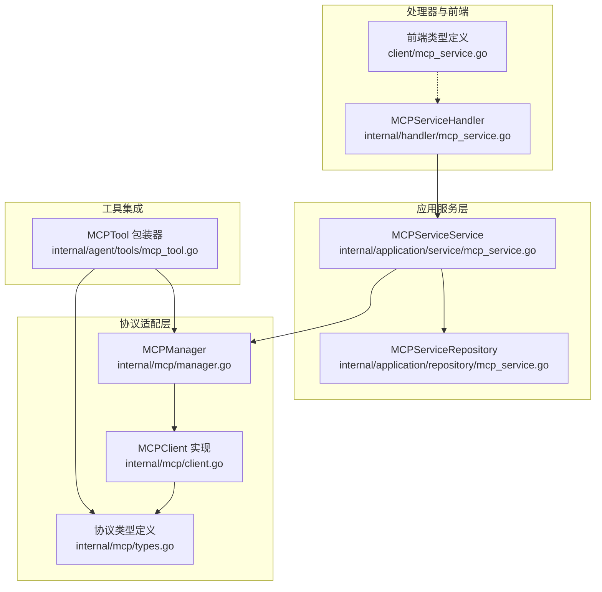
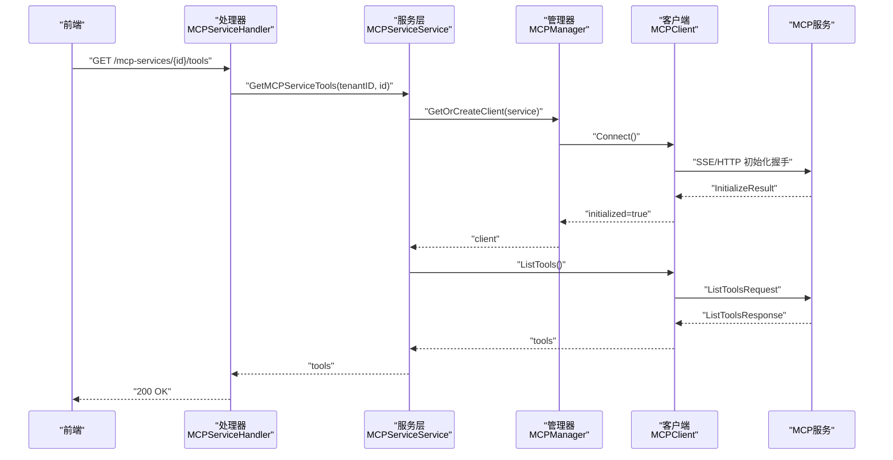
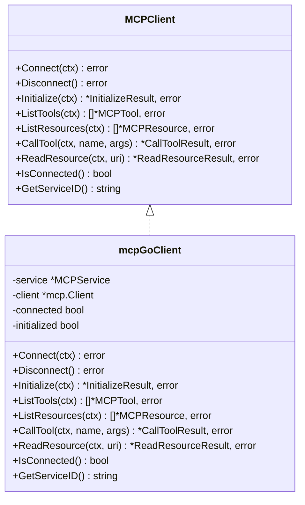
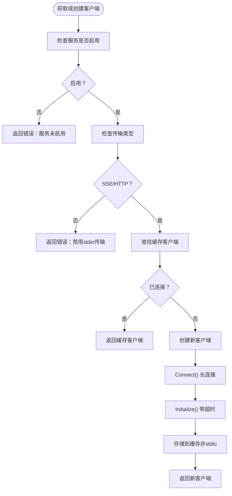
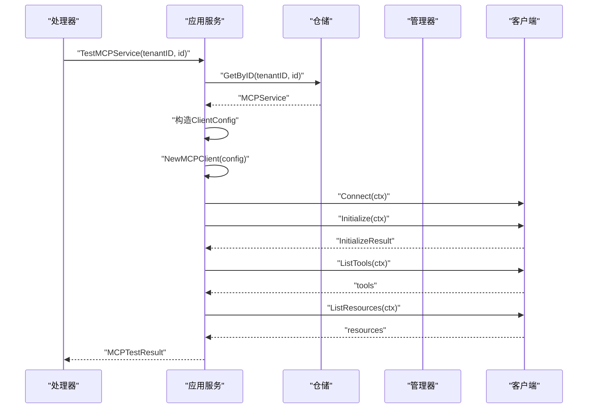
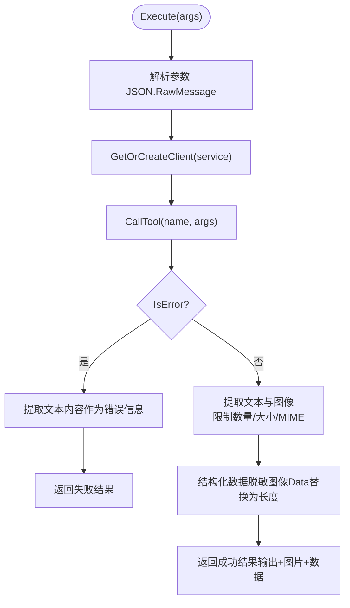
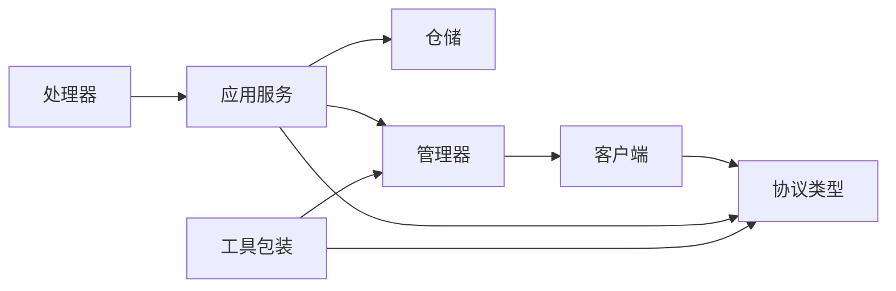

# MCP协议实现

<cite>
**本文引用的文件**
- [internal/mcp/types.go](file://internal/mcp/types.go)
- [internal/mcp/client.go](file://internal/mcp/client.go)
- [internal/mcp/manager.go](file://internal/mcp/manager.go)
- [internal/mcp/errors.go](file://internal/mcp/errors.go)
- [internal/timeseries/types.go](file://internal/timeseries/types.go)
- [internal/application/service/mcp_service.go](file://internal/application/service/mcp_service.go)
- [internal/application/repository/mcp_service.go](file://internal/application/repository/mcp_service.go)
- [internal/handler/mcp_service.go](file://internal/handler/mcp_service.go)
- [internal/agent/tools/mcp_tool.go](file://internal/agent/tools/mcp_tool.go)
- [client/mcp_service.go](file://client/mcp_service.go)
- [docs/wiki/核心功能/MCP功能使用说明.md](file://docs/wiki/核心功能/MCP功能使用说明.md)
- [docs/BUILTIN_MCP_SERVICES.md](file://docs/BUILTIN_MCP_SERVICES.md)
</cite>

## 目录
1. [简介](#简介)
2. [项目结构](#项目结构)
3. [核心组件](#核心组件)
4. [架构总览](#架构总览)
5. [详细组件分析](#详细组件分析)
6. [依赖关系分析](#依赖关系分析)
7. [性能考量](#性能考量)
8. [故障排查指南](#故障排查指南)
9. [结论](#结论)
10. [附录](#附录)

## 简介
本文件面向WeKnora中MCP（Model Context Protocol）协议的实现，系统性阐述协议核心概念、数据结构、错误处理、服务配置与传输类型、消息格式与序列化、版本兼容性、最佳实践、性能优化与调试方法，并结合WeKnora的具体应用场景与集成方式给出落地指导。

## 项目结构
WeKnora的MCP实现采用分层设计：
- 协议适配层：封装mcp-go客户端，负责连接、初始化握手、工具与资源列举、工具调用与资源读取。
- 管理层：MCPManager负责客户端生命周期管理、连接复用、空闲清理与优雅关闭。
- 应用服务层：封装业务逻辑，提供服务CRUD、连通性测试、工具/资源查询。
- 数据访问层：基于GORM的仓储实现，持久化MCP服务配置。
- 处理器层：HTTP接口，绑定请求与响应，执行业务服务。
- 工具层：将MCP工具包装为Agent可调用的工具，负责参数解析、结果提取与安全输出。
- 类型与常量：统一定义MCP服务配置、传输类型、能力与消息格式。

**图表来源**
- [internal/application/service/mcp_service.go:1-408](file://internal/application/service/mcp_service.go#L1-L408)
- [internal/application/repository/mcp_service.go:1-147](file://internal/application/repository/mcp_service.go#L1-L147)
- [internal/mcp/manager.go:1-226](file://internal/mcp/manager.go#L1-L226)
- [internal/mcp/client.go:1-379](file://internal/mcp/client.go#L1-L379)
- [internal/mcp/types.go:1-67](file://internal/mcp/types.go#L1-L67)
- [internal/handler/mcp_service.go:1-448](file://internal/handler/mcp_service.go#L1-L448)
- [internal/agent/tools/mcp_tool.go:1-479](file://internal/agent/tools/mcp_tool.go#L1-L479)
- [client/mcp_service.go:1-208](file://client/mcp_service.go#L1-L208)

**章节来源**
- [internal/mcp/types.go:1-67](file://internal/mcp/types.go#L1-L67)
- [internal/mcp/client.go:1-379](file://internal/mcp/client.go#L1-L379)
- [internal/mcp/manager.go:1-226](file://internal/mcp/manager.go#L1-L226)
- [internal/application/service/mcp_service.go:1-408](file://internal/application/service/mcp_service.go#L1-L408)
- [internal/application/repository/mcp_service.go:1-147](file://internal/application/repository/mcp_service.go#L1-L147)
- [internal/handler/mcp_service.go:1-448](file://internal/handler/mcp_service.go#L1-L448)
- [internal/agent/tools/mcp_tool.go:1-479](file://internal/agent/tools/mcp_tool.go#L1-L479)
- [client/mcp_service.go:1-208](file://client/mcp_service.go#L1-L208)

## 核心组件
- 协议类型与消息格式
  - 初始化结果、服务器能力、工具能力、资源能力、内容项、资源内容等结构体定义，涵盖协议版本、能力声明、工具输入Schema、文本/图像/资源三类内容项。
- MCP客户端接口与实现
  - 定义连接、断开、初始化、列举工具/资源、调用工具、读取资源等方法；支持SSE、HTTP Streamable两种传输；显式禁用stdio以规避安全风险。
- MCP管理器
  - 负责客户端缓存与复用、连接生命周期、超时控制、空闲清理、优雅关闭。
- 错误处理
  - 统一的错误常量，覆盖不支持传输、未连接、已连接、初始化失败、工具/资源不存在、无效响应、超时、连接关闭等场景。
- 应用服务与仓储
  - 提供服务创建、查询、更新、删除、测试连通性、列举工具/资源；仓储负责持久化与查询。
- 处理器
  - 提供HTTP接口，完成鉴权、参数绑定、SSRF校验、调用应用服务并返回结果。
- 工具包装
  - 将MCP工具注册为Agent可用工具，负责参数解析、调用MCP客户端、结果提取与安全输出。

**章节来源**
- [internal/mcp/types.go:1-67](file://internal/mcp/types.go#L1-L67)
- [internal/mcp/client.go:19-47](file://internal/mcp/client.go#L19-L47)
- [internal/mcp/manager.go:13-35](file://internal/mcp/manager.go#L13-L35)
- [internal/mcp/errors.go:1-33](file://internal/mcp/errors.go#L1-L33)
- [internal/application/service/mcp_service.go:15-30](file://internal/application/service/mcp_service.go#L15-L30)
- [internal/application/repository/mcp_service.go:12-20](file://internal/application/repository/mcp_service.go#L12-L20)
- [internal/handler/mcp_service.go:15-25](file://internal/handler/mcp_service.go#L15-L25)
- [internal/agent/tools/mcp_tool.go:17-31](file://internal/agent/tools/mcp_tool.go#L17-L31)

## 架构总览
下图展示了从HTTP请求到MCP服务调用的完整链路，包括连接建立、初始化握手、工具/资源查询与工具调用。

**图表来源**
- [internal/handler/mcp_service.go:377-411](file://internal/handler/mcp_service.go#L377-L411)
- [internal/application/service/mcp_service.go:336-364](file://internal/application/service/mcp_service.go#L336-L364)
- [internal/mcp/manager.go:37-96](file://internal/mcp/manager.go#L37-L96)
- [internal/mcp/client.go:163-231](file://internal/mcp/client.go#L163-L231)

## 详细组件分析

### 协议类型与消息格式
- 初始化结果
  - 字段：协议版本、服务器能力、服务器信息（名称、版本）。
- 服务器能力
  - 工具能力、资源能力、提示词能力、日志与实验性能力映射。
- 工具/资源能力
  - listChanged标志位，指示列表变更通知能力。
- 服务器信息
  - 名称与版本。
- 工具调用结果
  - 内容项数组（文本/图像/资源）、错误标记。
- 内容项
  - 类型、文本、数据（base64）、MIME类型。
- 资源读取结果
  - 资源内容数组（URI、MIME、文本、二进制）。

这些类型定义了WeKnora与MCP服务之间的消息契约，保证序列化/反序列化一致性与跨语言互操作。

**章节来源**
- [internal/mcp/types.go:3-67](file://internal/mcp/types.go#L3-L67)

### MCP客户端与传输类型
- 支持的传输类型
  - SSE：Server-Sent Events，适合流式交互。
  - HTTP Streamable：标准HTTP流式兼容。
  - Stdio：标准输入输出，出于安全考虑在WeKnora中禁用。
- 客户端行为
  - 连接建立、初始化握手（携带WeKnora客户端信息与最新协议版本）、列举工具/资源、调用工具、读取资源。
  - 对会话失效错误进行检测并主动断开，确保后续调用能重建有效会话。
  - SSE/HTTP流式客户端在管理器上下文中保持长连接，stdion则按需连接并在使用后断开。

**图表来源**
- [internal/mcp/client.go:19-47](file://internal/mcp/client.go#L19-L47)
- [internal/mcp/client.go:54-135](file://internal/mcp/client.go#L54-L135)

**章节来源**
- [internal/mcp/client.go:19-135](file://internal/mcp/client.go#L19-L135)

### MCP管理器
- 职责
  - 客户端缓存与复用（SSE/HTTP流式），stdion按需创建与释放。
  - 初始化超时控制（默认30秒，上限60秒）。
  - 空闲连接清理（周期性扫描并移除断开连接）。
  - 优雅关闭与资源回收。
- 并发与一致性
  - 使用读写锁保护客户端映射，支持高并发场景下的安全访问。

**图表来源**
- [internal/mcp/manager.go:37-96](file://internal/mcp/manager.go#L37-L96)
- [internal/mcp/manager.go:98-120](file://internal/mcp/manager.go#L98-L120)

**章节来源**
- [internal/mcp/manager.go:13-226](file://internal/mcp/manager.go#L13-L226)

### 应用服务与仓储
- 应用服务
  - 创建/查询/列表/更新/删除MCP服务；测试连通性（创建临时客户端进行连接、初始化、列举工具与资源）；提供工具/资源查询。
  - 对内置服务的更新/删除进行保护；对关键配置变更触发连接关闭以确保重新连接生效。
- 仓储
  - 支持按ID、租户、启用状态、ID集合查询；更新时仅更新提供字段；软删除。

**图表来源**
- [internal/handler/mcp_service.go:332-375](file://internal/handler/mcp_service.go#L332-L375)
- [internal/application/service/mcp_service.go:261-334](file://internal/application/service/mcp_service.go#L261-L334)

**章节来源**
- [internal/application/service/mcp_service.go:15-408](file://internal/application/service/mcp_service.go#L15-L408)
- [internal/application/repository/mcp_service.go:12-147](file://internal/application/repository/mcp_service.go#L12-L147)

### 工具包装与Agent集成
- 工具命名与描述
  - 命名规则：mcp_{service_name}_{tool_name}，使用服务名稳定化工具名，避免MCP服务重启导致名称变化。
  - 描述前缀标注“外部来源”，降低间接提示注入风险。
- 参数与Schema
  - 优先使用MCP服务提供的输入Schema；若为空，返回默认空对象Schema。
- 执行流程
  - 解析参数、获取/创建客户端、调用工具、处理结果（文本拼接、图像提取与数据URI生成、结构化数据脱敏）、错误路径处理。
  - 对stdion传输在使用后断开连接；对SSE/HTTP流式在失败时尝试断开并重建连接。
- 输出安全
  - 图像数据base64在结构化数据中以长度占位符替代，避免日志与传输泄露。

**图表来源**
- [internal/agent/tools/mcp_tool.go:89-184](file://internal/agent/tools/mcp_tool.go#L89-L184)
- [internal/agent/tools/mcp_tool.go:204-303](file://internal/agent/tools/mcp_tool.go#L204-L303)

**章节来源**
- [internal/agent/tools/mcp_tool.go:17-479](file://internal/agent/tools/mcp_tool.go#L17-L479)

### 前端类型与使用说明
- 前端类型
  - 传输类型枚举（sse、http-streamable、stdio）；MCP服务配置（ID、租户ID、名称、描述、启用状态、传输类型、URL、头部、认证配置、高级配置、stdio配置、环境变量、是否内置、时间戳）；工具与资源结构；测试结果。
- 使用说明
  - 在前端“设置 > MCP服务”中集中管理服务，支持启停、测试、编辑、删除；优先SSE获取流式体验，必要时使用HTTP Streamable；生产环境建议使用API Key或Bearer Token并定期轮换；对公网或第三方服务适当提高重试次数与延迟。

**章节来源**
- [client/mcp_service.go:10-79](file://client/mcp_service.go#L10-L79)
- [docs/wiki/核心功能/MCP功能使用说明.md:1-67](file://docs/wiki/核心功能/MCP功能使用说明.md#L1-L67)

### 内置MCP服务管理
- 特性
  - 对所有租户可见、安全保护（隐藏敏感信息）、只读保护（不可编辑/删除）、统一管理。
- 传输限制
  - 仅支持SSE与HTTP Streamable，stdio被禁用。
- 管理方式
  - 通过数据库直接插入或更新is_builtin字段；提供SQL示例与注意事项。

**章节来源**
- [docs/BUILTIN_MCP_SERVICES.md:1-145](file://docs/BUILTIN_MCP_SERVICES.md#L1-L145)

## 依赖关系分析
- 组件耦合
  - 处理器依赖应用服务；应用服务依赖仓储与管理器；管理器依赖客户端；客户端依赖mcp-go库与WeKnora内部类型。
- 外部依赖
  - mcp-go客户端库（SSE/HTTP流式）、GORM（数据库访问）、Gin（HTTP框架）、日志与安全工具包。
- 循环依赖
  - 未发现循环依赖；各层职责清晰，接口边界明确。

**图表来源**
- [internal/handler/mcp_service.go:15-25](file://internal/handler/mcp_service.go#L15-L25)
- [internal/application/service/mcp_service.go:15-30](file://internal/application/service/mcp_service.go#L15-L30)
- [internal/mcp/manager.go:13-35](file://internal/mcp/manager.go#L13-L35)
- [internal/mcp/client.go:19-47](file://internal/mcp/client.go#L19-L47)
- [internal/mcp/types.go:1-67](file://internal/mcp/types.go#L1-L67)
- [internal/agent/tools/mcp_tool.go:17-31](file://internal/agent/tools/mcp_tool.go#L17-L31)

**章节来源**
- [internal/handler/mcp_service.go:15-448](file://internal/handler/mcp_service.go#L15-L448)
- [internal/application/service/mcp_service.go:15-408](file://internal/application/service/mcp_service.go#L15-L408)
- [internal/mcp/manager.go:13-226](file://internal/mcp/manager.go#L13-L226)
- [internal/mcp/client.go:19-379](file://internal/mcp/client.go#L19-L379)
- [internal/mcp/types.go:1-67](file://internal/mcp/types.go#L1-L67)
- [internal/agent/tools/mcp_tool.go:17-479](file://internal/agent/tools/mcp_tool.go#L17-L479)

## 性能考量
- 连接复用
  - SSE/HTTP流式客户端在管理器中缓存并复用，减少握手与初始化开销；stdion按需创建与释放。
- 超时与重试
  - 初始化超时默认30秒（上限60秒），避免长时间阻塞；工具调用失败时对SSE/HTTP流式进行一次自动重连。
- 资源清理
  - 定期清理断开连接，释放内存与句柄；优雅关闭时关闭所有客户端并清空缓存。
- 结果提取与脱敏
  - 图像数据在结构化数据中以长度占位符替代，避免大块base64字符串在日志与传输中造成内存与带宽压力。
- 建议
  - 对公网或第三方服务适当提高重试次数与延迟；合理设置超时；避免在日志中打印完整图像数据。

[本节为通用性能建议，无需特定文件引用]

## 故障排查指南
- 常见错误
  - 不支持的传输类型：检查传输类型是否为sse或http-streamable。
  - 未连接：确认已Connect并Initialize成功。
  - 初始化握手失败：检查URL、认证配置、网络连通性。
  - 工具/资源不存在：确认服务端是否提供对应工具/资源。
  - 无效响应：检查服务端协议实现与版本兼容性。
  - 超时：调整高级配置中的超时与重试策略。
  - 连接关闭：关注会话失效错误，客户端会自动断开并重建连接。
- 排查步骤
  - 使用前端“测试”功能查看工具与资源清单及错误信息。
  - 检查处理器日志与应用服务日志，定位具体失败环节。
  - 对SSE/HTTP流式问题，观察会话头变化与服务端状态；对stdion问题，确认命令与参数正确。
  - 对内置服务问题，确认is_builtin标记与隐藏敏感信息策略。

**章节来源**
- [internal/mcp/errors.go:1-33](file://internal/mcp/errors.go#L1-L33)
- [internal/mcp/client.go:143-161](file://internal/mcp/client.go#L143-L161)
- [internal/handler/mcp_service.go:332-375](file://internal/handler/mcp_service.go#L332-L375)

## 结论
WeKnora的MCP实现以清晰的分层架构、严格的错误处理与安全策略为基础，提供了稳定可靠的外部工具与资源接入能力。通过连接复用、超时控制、空闲清理与结果脱敏等机制，兼顾了性能与安全性。结合内置服务管理与前端可视化配置，实现了灵活、易用且可控的MCP集成方案。

[本节为总结性内容，无需特定文件引用]

## 附录

### 协议版本兼容性
- 客户端在初始化时使用最新协议版本，服务端需兼容该版本；如服务端版本过低，初始化可能失败，需升级服务端实现。

**章节来源**
- [internal/mcp/client.go:198-231](file://internal/mcp/client.go#L198-L231)

### 消息序列化与反序列化
- Go侧使用标准json包进行结构体与RawMessage的编解码；工具输入Schema以json.RawMessage形式传递，避免二次解析开销。
- 结果脱敏：图像Data在结构化数据中替换为长度占位符，防止大字符串泄露。

**章节来源**
- [internal/mcp/client.go:247-255](file://internal/mcp/client.go#L247-L255)
- [internal/mcp/client.go:347-363](file://internal/mcp/client.go#L347-L363)
- [internal/agent/tools/mcp_tool.go:253-265](file://internal/agent/tools/mcp_tool.go#L253-L265)

### 最佳实践
- 传输类型选择：优先SSE；需要标准HTTP兼容时使用HTTP Streamable；本地调试使用stdio但需谨慎。
- 鉴权管理：使用API Key或Bearer Token，定期轮换；生产环境最小权限原则。
- 重试策略：对公网或第三方服务适当提高重试次数与延迟。
- 日志与安全：避免在日志中打印完整图像数据；对工具输出加前缀标注外部来源。

**章节来源**
- [docs/wiki/核心功能/MCP功能使用说明.md:46-51](file://docs/wiki/核心功能/MCP功能使用说明.md#L46-L51)
- [internal/agent/tools/mcp_tool.go:166-170](file://internal/agent/tools/mcp_tool.go#L166-L170)

### 调试方法
- 使用前端“测试”接口查看工具与资源清单。
- 查看处理器与应用服务日志，定位初始化、列举与调用阶段的异常。
- 对SSE/HTTP流式问题，检查会话头与服务端状态；对stdion问题，检查命令与参数。

**章节来源**
- [internal/handler/mcp_service.go:332-375](file://internal/handler/mcp_service.go#L332-L375)
- [internal/mcp/client.go:137-141](file://internal/mcp/client.go#L137-L141)