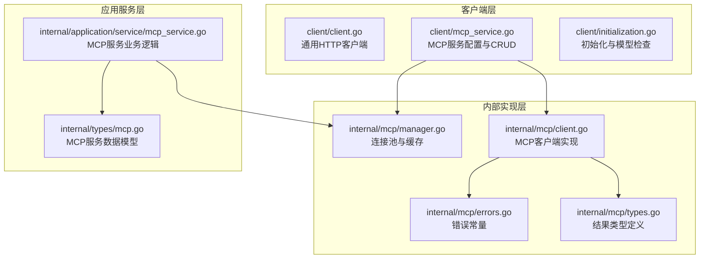
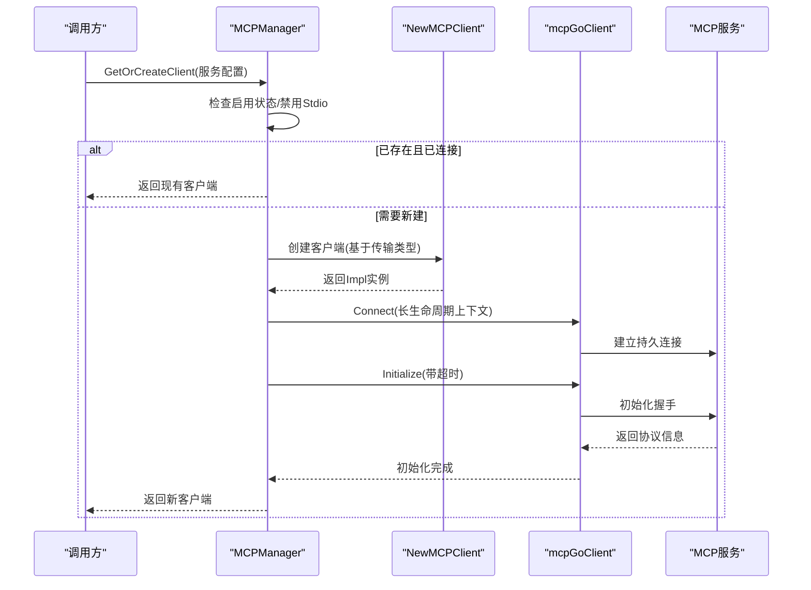
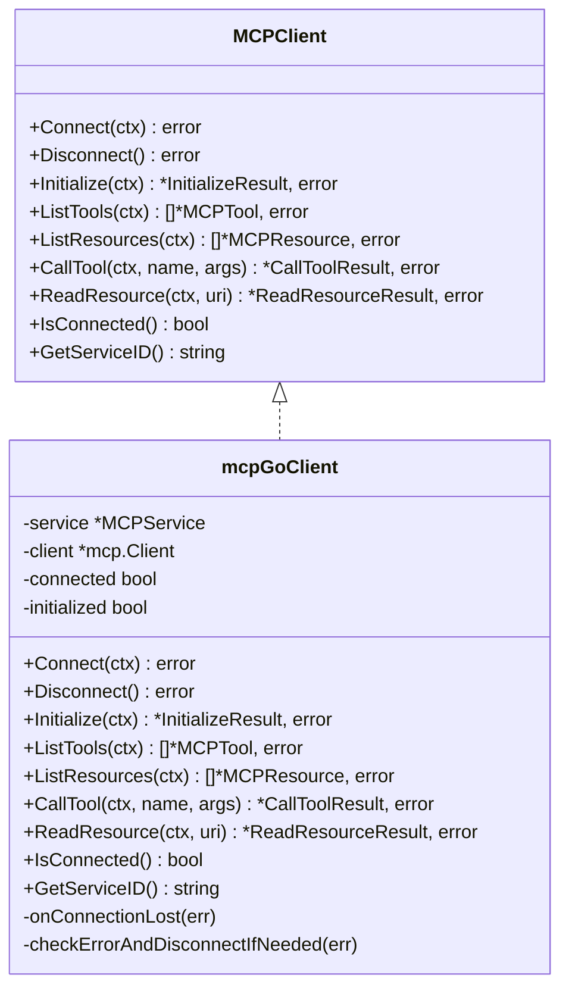
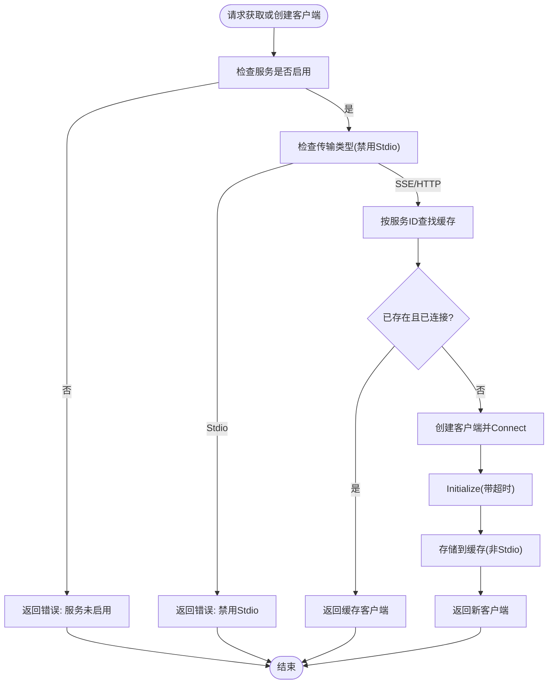
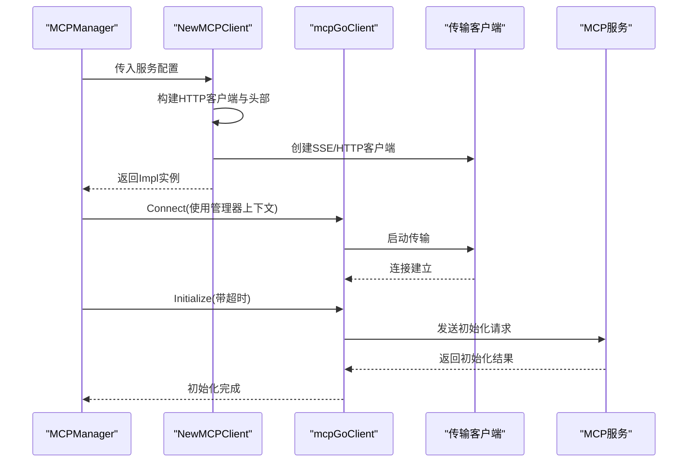
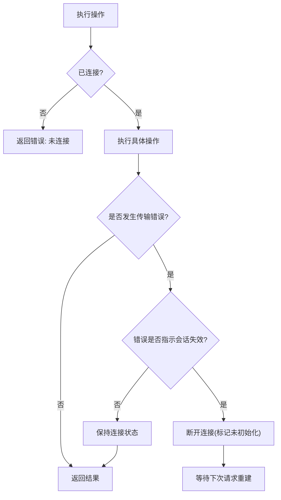
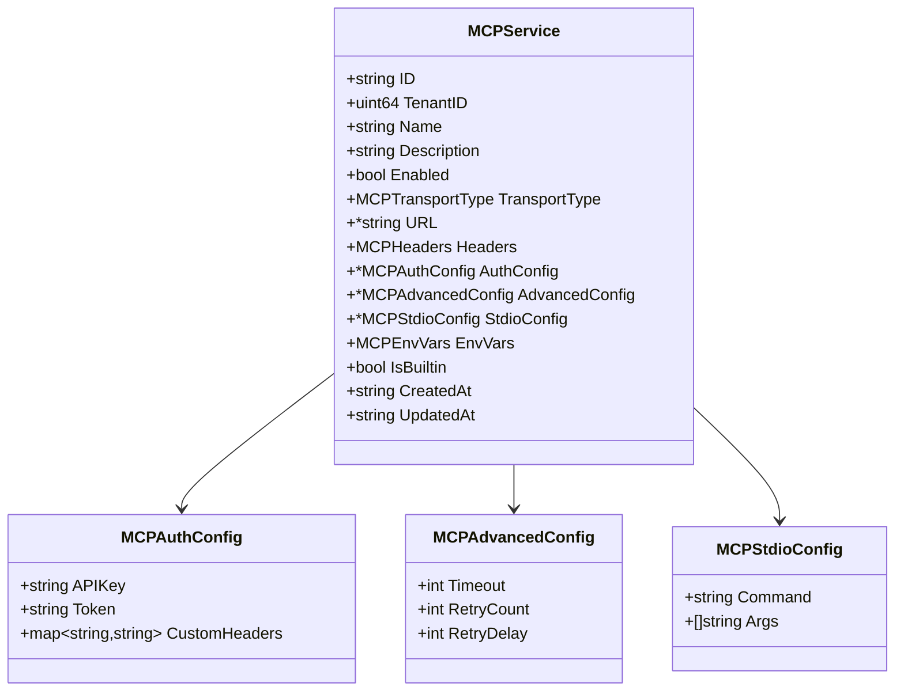
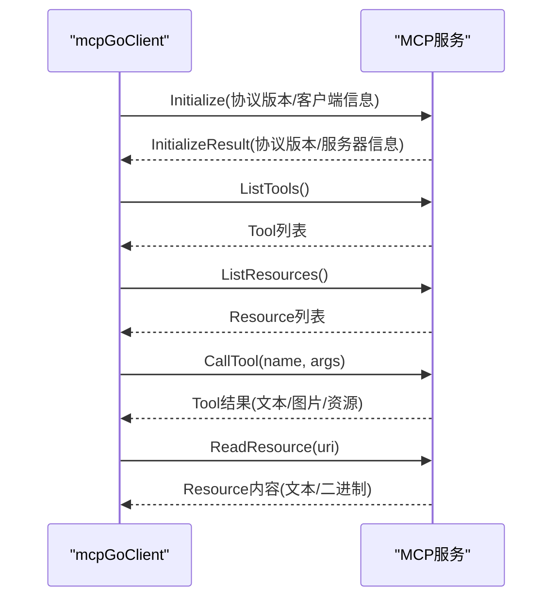
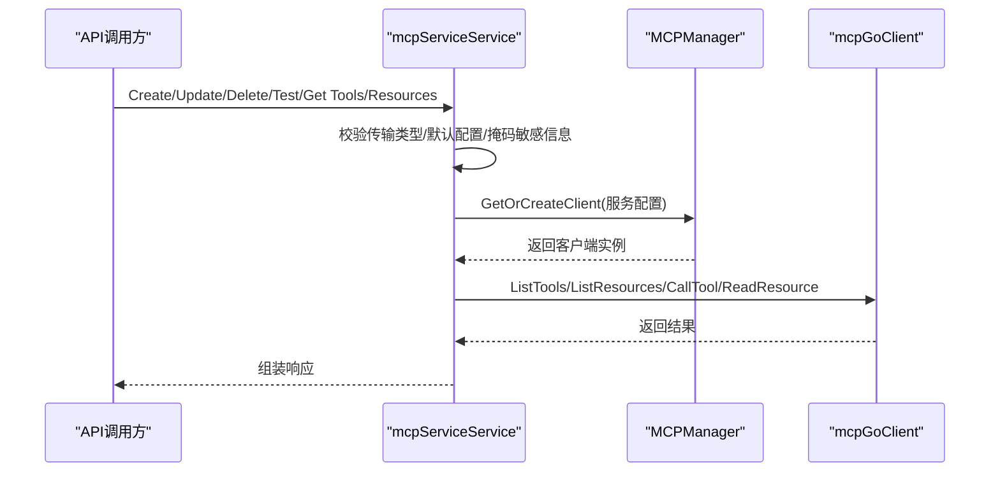
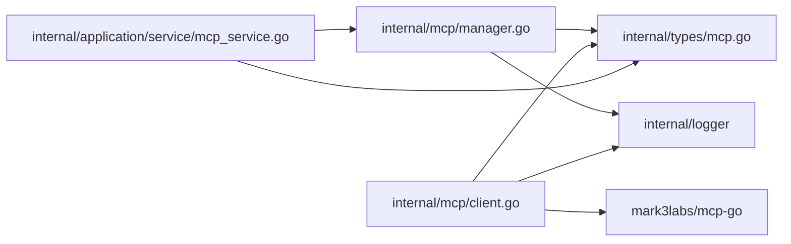

# MCP客户端管理

<cite>
**本文档引用的文件**
- [client.go](file://client/client.go)
- [mcp_service.go](file://client/mcp_service.go)
- [initialization.go](file://client/initialization.go)
- [client.go](file://internal/mcp/client.go)
- [manager.go](file://internal/mcp/manager.go)
- [types.go](file://internal/mcp/types.go)
- [errors.go](file://internal/mcp/errors.go)
- [mcp.go](file://internal/types/mcp.go)
- [mcp_service.go](file://internal/application/service/mcp_service.go)
</cite>

## 目录
1. [简介](#简介)
2. [项目结构](#项目结构)
3. [核心组件](#核心组件)
4. [架构总览](#架构总览)
5. [详细组件分析](#详细组件分析)
6. [依赖关系分析](#依赖关系分析)
7. [性能考虑](#性能考虑)
8. [故障排查指南](#故障排查指南)
9. [结论](#结论)

## 简介
本文件为 WeKnora MCP 客户端管理系统的技术文档，聚焦于 MCP 客户端的生命周期管理、连接池机制与缓存策略，详细解释客户端创建流程、连接建立过程与初始化超时处理，涵盖客户端状态管理、连接重试机制与故障恢复策略，并提供客户端配置选项、性能监控与资源清理机制，阐述客户端与 MCP 服务的交互模式与通信协议。

## 项目结构
WeKnora 的 MCP 客户端管理涉及三层：
- 客户端层：对外暴露 HTTP 客户端与 MCP 服务配置接口（client 包）
- 内部实现层：封装 MCP 协议客户端、连接管理与错误处理（internal/mcp）
- 应用服务层：业务编排与配置管理（internal/application/service）

**图表来源**
- [client.go:1-105](file://client/client.go#L1-L105)
- [mcp_service.go:1-208](file://client/mcp_service.go#L1-L208)
- [initialization.go:1-256](file://client/initialization.go#L1-L256)
- [client.go:1-379](file://internal/mcp/client.go#L1-L379)
- [manager.go:1-226](file://internal/mcp/manager.go#L1-L226)
- [types.go:1-67](file://internal/mcp/types.go#L1-L67)
- [errors.go:1-33](file://internal/mcp/errors.go#L1-L33)
- [mcp_service.go:1-408](file://internal/application/service/mcp_service.go#L1-L408)
- [mcp.go:1-243](file://internal/types/mcp.go#L1-L243)

**章节来源**
- [client.go:1-105](file://client/client.go#L1-L105)
- [mcp_service.go:1-208](file://client/mcp_service.go#L1-L208)
- [initialization.go:1-256](file://client/initialization.go#L1-L256)
- [client.go:1-379](file://internal/mcp/client.go#L1-L379)
- [manager.go:1-226](file://internal/mcp/manager.go#L1-L226)
- [types.go:1-67](file://internal/mcp/types.go#L1-L67)
- [errors.go:1-33](file://internal/mcp/errors.go#L1-L33)
- [mcp_service.go:1-408](file://internal/application/service/mcp_service.go#L1-L408)
- [mcp.go:1-243](file://internal/types/mcp.go#L1-L243)

## 核心组件
- MCP 客户端接口与实现：定义统一的连接、初始化、工具与资源访问能力，并对底层传输进行抽象
- MCP 管理器：负责连接池与缓存、生命周期管理、清理与监控
- 类型与错误：标准化返回结果与错误语义
- 应用服务：封装业务操作，协调配置变更与连接重建

**章节来源**
- [client.go:19-47](file://internal/mcp/client.go#L19-L47)
- [manager.go:13-35](file://internal/mcp/manager.go#L13-L35)
- [types.go:3-67](file://internal/mcp/types.go#L3-L67)
- [errors.go:5-32](file://internal/mcp/errors.go#L5-L32)
- [mcp_service.go:15-30](file://internal/application/service/mcp_service.go#L15-L30)

## 架构总览
MCP 客户端采用“按服务ID缓存 + 生命周期管理”的连接池模式，支持 SSE 与 HTTP Streamable 两种传输方式；Stdio 传输出于安全考虑被禁用。连接建立后执行初始化握手，随后可查询工具与资源列表。异常时自动断开并清理，后续请求触发重建。

**图表来源**
- [manager.go:40-96](file://internal/mcp/manager.go#L40-L96)
- [client.go:62-135](file://internal/mcp/client.go#L62-L135)
- [client.go:163-181](file://internal/mcp/client.go#L163-L181)
- [client.go:198-231](file://internal/mcp/client.go#L198-L231)

## 详细组件分析

### 客户端接口与实现
- 接口职责
  - 连接/断开：Connect/Disconnect
  - 初始化：Initialize（执行协议握手）
  - 能力发现：ListTools/ListResources
  - 工具调用：CallTool
  - 资源读取：ReadResource
  - 状态查询：IsConnected/GetServiceID
- 实现要点
  - 支持 SSE 与 HTTP Streamable 传输，Stdio 明确禁用
  - 连接丢失回调触发断开，避免悬挂连接
  - 对传输错误进行会话有效性判断，必要时主动断开以触发重建
  - 初始化阶段使用带超时的上下文，失败即断开

**图表来源**
- [client.go:19-47](file://internal/mcp/client.go#L19-L47)
- [client.go:54-60](file://internal/mcp/client.go#L54-L60)
- [client.go:137-161](file://internal/mcp/client.go#L137-L161)

**章节来源**
- [client.go:19-47](file://internal/mcp/client.go#L19-L47)
- [client.go:54-135](file://internal/mcp/client.go#L54-L135)
- [client.go:137-161](file://internal/mcp/client.go#L137-L161)
- [client.go:163-196](file://internal/mcp/client.go#L163-L196)
- [client.go:198-231](file://internal/mcp/client.go#L198-L231)
- [client.go:233-285](file://internal/mcp/client.go#L233-L285)
- [client.go:287-338](file://internal/mcp/client.go#L287-L338)
- [client.go:370-379](file://internal/mcp/client.go#L370-L379)

### 连接池与缓存策略
- 缓存键：按服务ID缓存客户端实例
- 复用条件：同一服务ID且客户端处于已连接状态
- 生命周期：
  - 新建：创建客户端并 Connect，随后 Initialize
  - 断开：Disconnect 清理状态
  - 清理：周期性移除未连接的客户端
- 上下文设计：SSE/HTTP Streamable 使用管理器的长期上下文，超时由 HTTP 客户端控制

**图表来源**
- [manager.go:40-96](file://internal/mcp/manager.go#L40-L96)
- [manager.go:171-197](file://internal/mcp/manager.go#L171-L197)
- [client.go:122-127](file://internal/mcp/client.go#L122-L127)

**章节来源**
- [manager.go:13-35](file://internal/mcp/manager.go#L13-L35)
- [manager.go:40-96](file://internal/mcp/manager.go#L40-L96)
- [manager.go:171-197](file://internal/mcp/manager.go#L171-L197)

### 客户端创建流程与初始化超时处理
- 创建流程
  - 校验服务启用状态与传输类型
  - 基于传输类型构建 HTTP 客户端与头部（含鉴权）
  - 创建具体传输客户端（SSE 或 HTTP Streamable）
  - 注册连接丢失回调
- 初始化超时
  - 默认初始化超时为 30 秒，可由服务高级配置覆盖，上限 60 秒
  - 使用带超时的上下文执行 Initialize，失败则断开并返回错误

**图表来源**
- [client.go:62-135](file://internal/mcp/client.go#L62-L135)
- [client.go:163-181](file://internal/mcp/client.go#L163-L181)
- [client.go:198-231](file://internal/mcp/client.go#L198-L231)
- [manager.go:98-120](file://internal/mcp/manager.go#L98-L120)

**章节来源**
- [client.go:62-135](file://internal/mcp/client.go#L62-L135)
- [client.go:198-231](file://internal/mcp/client.go#L198-L231)
- [manager.go:98-120](file://internal/mcp/manager.go#L98-L120)

### 客户端状态管理与故障恢复
- 状态字段：connected、initialized
- 故障恢复
  - 连接丢失回调触发断开
  - 传输错误中若检测到会话失效（如无效会话ID、无活动连接），主动断开
  - 后续请求将重建连接与初始化
- 资源清理
  - CloseClient/CloseAll 触发断开并从缓存移除
  - 周期性清理未连接客户端

**图表来源**
- [client.go:143-161](file://internal/mcp/client.go#L143-L161)
- [client.go:183-196](file://internal/mcp/client.go#L183-L196)
- [manager.go:131-148](file://internal/mcp/manager.go#L131-L148)
- [manager.go:171-197](file://internal/mcp/manager.go#L171-L197)

**章节来源**
- [client.go:143-161](file://internal/mcp/client.go#L143-L161)
- [client.go:183-196](file://internal/mcp/client.go#L183-L196)
- [manager.go:131-148](file://internal/mcp/manager.go#L131-L148)
- [manager.go:171-197](file://internal/mcp/manager.go#L171-L197)

### 客户端配置选项
- 传输类型：sse、http-streamable、stdio（禁用）
- URL：SSE/HTTP Streamable 必填
- 头部：自定义 HTTP 头
- 鉴权：API Key、Bearer Token、自定义头
- 高级配置：超时（秒）、重试次数、重试间隔（秒）
- Stdio 配置：命令与参数（仅在启用 Stdio 时需要）
- 环境变量：Stdio 专用

**图表来源**
- [mcp.go:21-39](file://internal/types/mcp.go#L21-L39)
- [mcp.go:44-49](file://internal/types/mcp.go#L44-L49)
- [mcp.go:51-56](file://internal/types/mcp.go#L51-L56)
- [mcp.go:58-62](file://internal/types/mcp.go#L58-L62)

**章节来源**
- [mcp.go:12-19](file://internal/types/mcp.go#L12-L19)
- [mcp.go:21-39](file://internal/types/mcp.go#L21-L39)
- [mcp.go:44-49](file://internal/types/mcp.go#L44-L49)
- [mcp.go:51-56](file://internal/types/mcp.go#L51-L56)
- [mcp.go:58-62](file://internal/types/mcp.go#L58-L62)

### 与MCP服务的交互模式与通信协议
- 传输层
  - SSE：服务器推送事件，适合持续会话
  - HTTP Streamable：可流式的HTTP传输
  - Stdio：禁用
- 协议握手
  - Initialize 请求包含协议版本、客户端信息等
  - 成功后记录协议版本与服务器信息
- 能力与资源
  - ListTools：获取可用工具列表
  - ListResources：获取可用资源列表
- 工具与资源操作
  - CallTool：调用指定工具
  - ReadResource：读取指定资源

**图表来源**
- [client.go:198-231](file://internal/mcp/client.go#L198-L231)
- [client.go:233-258](file://internal/mcp/client.go#L233-L258)
- [client.go:260-285](file://internal/mcp/client.go#L260-L285)
- [client.go:287-327](file://internal/mcp/client.go#L287-L327)
- [client.go:329-368](file://internal/mcp/client.go#L329-L368)

**章节来源**
- [client.go:198-231](file://internal/mcp/client.go#L198-L231)
- [client.go:233-285](file://internal/mcp/client.go#L233-L285)
- [client.go:287-368](file://internal/mcp/client.go#L287-L368)

### 客户端与应用服务的协作
- 服务创建/更新/删除：校验传输类型（禁用 Stdio），默认高级配置，敏感信息掩码
- 测试连接：临时创建客户端，连接+初始化，列出工具与资源
- 获取工具/资源：通过管理器获取或创建客户端，再调用对应方法

**图表来源**
- [mcp_service.go:32-54](file://internal/application/service/mcp_service.go#L32-L54)
- [mcp_service.go:114-231](file://internal/application/service/mcp_service.go#L114-L231)
- [mcp_service.go:261-334](file://internal/application/service/mcp_service.go#L261-L334)
- [mcp_service.go:336-394](file://internal/application/service/mcp_service.go#L336-L394)
- [manager.go:40-96](file://internal/mcp/manager.go#L40-L96)

**章节来源**
- [mcp_service.go:32-54](file://internal/application/service/mcp_service.go#L32-L54)
- [mcp_service.go:114-231](file://internal/application/service/mcp_service.go#L114-L231)
- [mcp_service.go:261-334](file://internal/application/service/mcp_service.go#L261-L334)
- [mcp_service.go:336-394](file://internal/application/service/mcp_service.go#L336-L394)
- [manager.go:40-96](file://internal/mcp/manager.go#L40-L96)

## 依赖关系分析
- 内部依赖
  - internal/mcp/client.go 依赖 internal/logger、internal/types、mark3labs/mcp-go
  - internal/mcp/manager.go 依赖 internal/logger、internal/types
  - internal/application/service/mcp_service.go 依赖 internal/mcp、internal/types
- 外部依赖
  - mark3labs/mcp-go 提供传输层抽象与协议实现
  - 标准库 net/http、time、context 等

**图表来源**
- [manager.go:1-11](file://internal/mcp/manager.go#L1-L11)
- [client.go:3-17](file://internal/mcp/client.go#L3-L17)
- [mcp_service.go:3-13](file://internal/application/service/mcp_service.go#L3-L13)

**章节来源**
- [manager.go:1-11](file://internal/mcp/manager.go#L1-L11)
- [client.go:3-17](file://internal/mcp/client.go#L3-L17)
- [mcp_service.go:3-13](file://internal/application/service/mcp_service.go#L3-L13)

## 性能考虑
- 连接复用：按服务ID缓存客户端，减少重复握手与初始化成本
- 超时控制：初始化超时可配置，上限保护，避免长时间阻塞
- 清理策略：定期清理未连接客户端，释放资源
- 传输选择：SSE/HTTP Streamable 适合持续会话，避免 Stdio 带来的安全与性能风险

[本节为通用性能建议，不直接分析具体文件]

## 故障排查指南
- 常见错误
  - 不支持的传输类型：确认使用 SSE 或 HTTP Streamable
  - 未连接：确保已完成 Connect 与 Initialize
  - 初始化失败：检查服务可达性、鉴权配置与超时设置
  - 工具/资源不存在：确认服务端能力声明与 URI 正确
  - 会话失效：观察日志中的会话错误提示，等待自动断开与重建
- 排查步骤
  - 使用测试接口验证连接与能力
  - 查看管理器活跃客户端数量与服务ID列表
  - 检查日志输出的连接与断开事件
  - 核对高级配置中的超时与重试参数

**章节来源**
- [errors.go:5-32](file://internal/mcp/errors.go#L5-L32)
- [manager.go:199-225](file://internal/mcp/manager.go#L199-L225)
- [client.go:143-161](file://internal/mcp/client.go#L143-L161)

## 结论
WeKnora 的 MCP 客户端管理通过清晰的接口抽象、稳健的连接池与缓存策略、完善的错误处理与清理机制，实现了对 MCP 服务的高效、可靠管理。SSE 与 HTTP Streamable 传输提供了稳定的会话能力，而禁用 Stdio 则提升了安全性。结合初始化超时控制与周期性清理，系统在性能与稳定性之间取得了良好平衡。