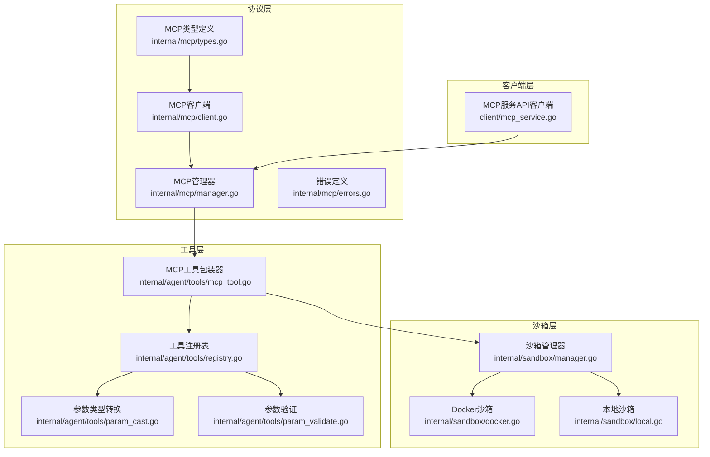
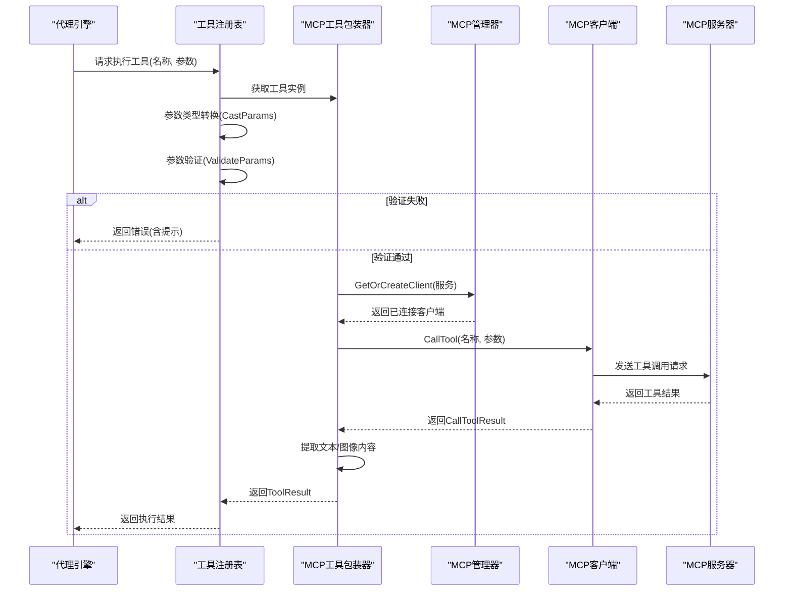
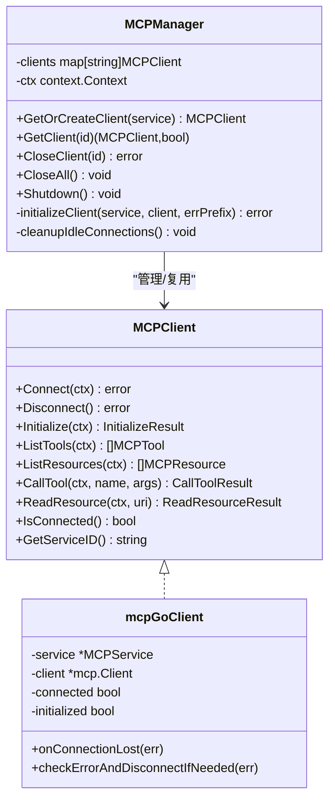
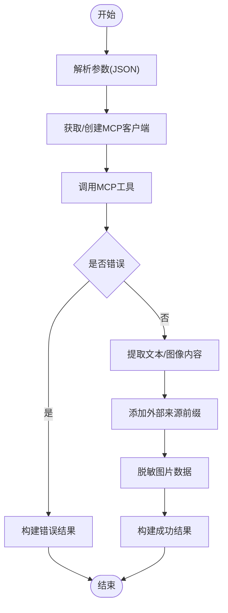
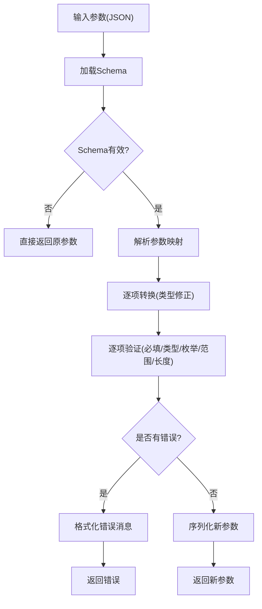
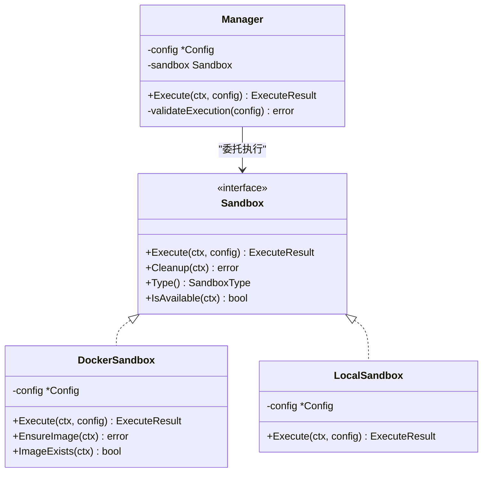
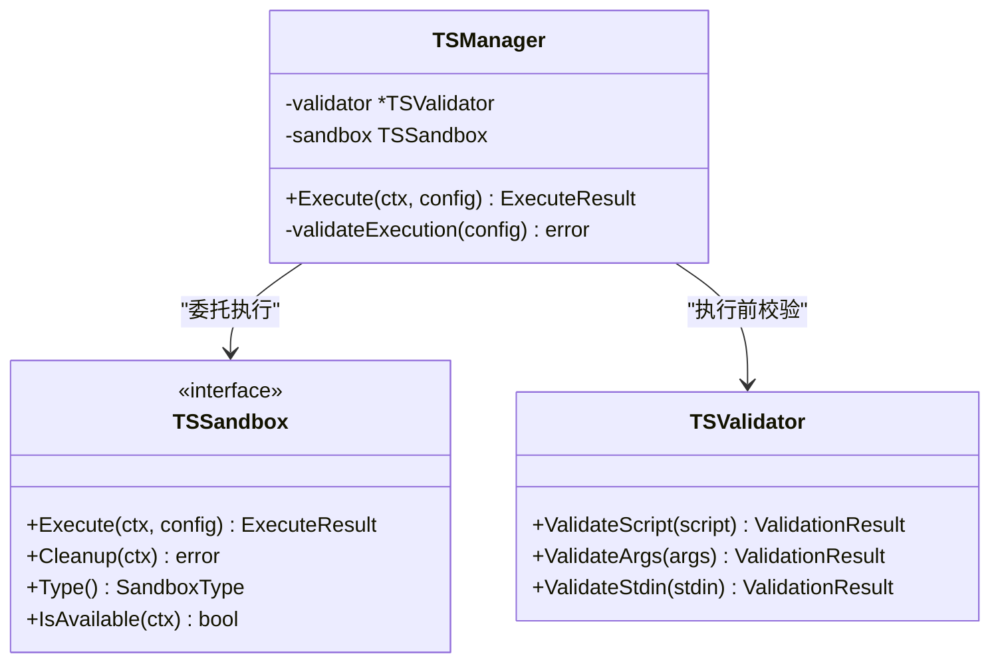
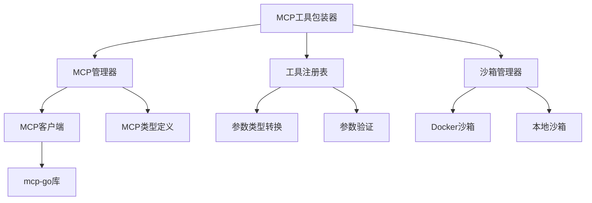

# MCP工具集成

<cite>
**本文档引用的文件**
- [internal/mcp/types.go](file://internal/mcp/types.go)
- [internal/mcp/client.go](file://internal/mcp/client.go)
- [internal/mcp/manager.go](file://internal/mcp/manager.go)
- [internal/mcp/errors.go](file://internal/mcp/errors.go)
- [client/mcp_service.go](file://client/mcp_service.go)
- [internal/agent/tools/mcp_tool.go](file://internal/agent/tools/mcp_tool.go)
- [internal/agent/tools/param_cast.go](file://internal/agent/tools/param_cast.go)
- [internal/agent/tools/param_validate.go](file://internal/agent/tools/param_validate.go)
- [internal/agent/tools/registry.go](file://internal/agent/tools/registry.go)
- [internal/sandbox/manager.go](file://internal/sandbox/manager.go)
- [internal/sandbox/docker.go](file://internal/sandbox/docker.go)
- [internal/sandbox/local.go](file://internal/sandbox/local.go)
- [internal/timeseries/validator.go](file://internal/timeseries/validator.go)
- [internal/timeseries/sandbox.go](file://internal/timeseries/sandbox.go)
- [internal/timeseries/manager.go](file://internal/timeseries/manager.go)
- [internal/timeseries/types.go](file://internal/timeseries/types.go)
- [internal/timeseries/validator_test.go](file://internal/timeseries/validator_test.go)
- [internal/timeseries/sandbox_test.go](file://internal/timeseries/sandbox_test.go)
- [internal/timeseries/manager_test.go](file://internal/timeseries/manager_test.go)
- [internal/timeseries/types_test.go](file://internal/timeseries/types_test.go)
- [internal/timeseries/validator.go](file://internal/timeseries/validator.go)
- [internal/timeseries/sandbox.go](file://internal/timeseries/sandbox.go)
- [internal/timeseries/manager.go](file://internal/timeseries/manager.go)
- [internal/timeseries/types.go](file://internal/timeseries/types.go)
- [internal/timeseries/validator_test.go](file://internal/timeseries/validator_test.go)
- [internal/timeseries/sandbox_test.go](file://internal/timeseries/sandbox_test.go)
- [internal/timeseries/manager_test.go](file://internal/timeseries/manager_test.go)
- [internal/timeseries/types_test.go](file://internal/timeseries/types_test.go)
</cite>

## 目录
1. [简介](#简介)
2. [项目结构](#项目结构)
3. [核心组件](#核心组件)
4. [架构总览](#架构总览)
5. [详细组件分析](#详细组件分析)
6. [依赖关系分析](#依赖关系分析)
7. [性能考虑](#性能考虑)
8. [故障排除指南](#故障排除指南)
9. [结论](#结论)
10. [附录](#附录)

## 简介
本文件面向WeKnora MCP（Model Context Protocol）工具集成功能，提供从底层协议客户端到上层工具注册与执行的完整技术文档。重点涵盖：
- MCP工具的注册机制与命名策略
- 调用流程与参数验证系统
- 工具接口定义、参数类型转换与返回值处理
- 执行环境隔离、安全沙箱机制与资源限制策略
- 工具开发指南、调试技巧与性能优化方案
- 工具与代理系统的集成方式与最佳实践

## 项目结构
MCP工具集成涉及多个层次：
- 协议层：基于mcp-go库封装的客户端与管理器
- 类型层：MCP服务、工具、资源的结构化定义
- 工具层：将MCP工具包装为代理可执行的工具，并进行参数校验与类型转换
- 沙箱层：提供容器或本地进程级的安全执行环境
- 客户端层：对外暴露MCP服务的增删改查与测试能力

**图表来源**
- [internal/mcp/types.go:1-67](file://internal/mcp/types.go#L1-L67)
- [internal/mcp/client.go:1-379](file://internal/mcp/client.go#L1-L379)
- [internal/mcp/manager.go:1-226](file://internal/mcp/manager.go#L1-L226)
- [internal/mcp/errors.go:1-33](file://internal/mcp/errors.go#L1-L33)
- [internal/agent/tools/mcp_tool.go:1-479](file://internal/agent/tools/mcp_tool.go#L1-L479)
- [internal/agent/tools/param_cast.go:1-134](file://internal/agent/tools/param_cast.go#L1-L134)
- [internal/agent/tools/param_validate.go:1-235](file://internal/agent/tools/param_validate.go#L1-L235)
- [internal/agent/tools/registry.go:1-171](file://internal/agent/tools/registry.go#L1-L171)
- [internal/sandbox/manager.go:1-258](file://internal/sandbox/manager.go#L1-L258)
- [internal/sandbox/docker.go:1-219](file://internal/sandbox/docker.go#L1-L219)
- [internal/sandbox/local.go:1-253](file://internal/sandbox/local.go#L1-L253)
- [client/mcp_service.go:1-208](file://client/mcp_service.go#L1-L208)

**章节来源**
- [internal/mcp/types.go:1-67](file://internal/mcp/types.go#L1-L67)
- [internal/mcp/client.go:1-379](file://internal/mcp/client.go#L1-L379)
- [internal/mcp/manager.go:1-226](file://internal/mcp/manager.go#L1-L226)
- [internal/mcp/errors.go:1-33](file://internal/mcp/errors.go#L1-L33)
- [client/mcp_service.go:1-208](file://client/mcp_service.go#L1-L208)

## 核心组件
- MCP类型定义：定义InitializeResult、ServerCapabilities、CallToolResult、ContentItem等协议相关结构体，确保与MCP协议一致。
- MCP客户端：封装连接建立、初始化握手、工具列表获取、资源读取、工具调用等操作；支持SSE与HTTP Streamable传输，禁用stdio以避免命令注入风险。
- MCP管理器：负责客户端生命周期管理、连接复用、超时控制、会话失效检测与重连、空闲清理。
- 工具包装器：将MCP服务工具适配为代理工具接口，执行前进行参数解析、类型转换与验证，执行后提取文本与图像内容，实施输出前缀与图片数据脱敏。
- 参数转换与验证：对LLM返回的非标准类型进行安全转换；基于JSON Schema进行严格参数校验，提前拦截无效参数。
- 工具注册表：统一注册与执行入口，实施首胜策略防止工具名冲突，输出截断与错误提示增强。
- 沙箱管理：根据配置选择Docker或本地沙箱，执行前进行脚本与参数安全校验，提供资源限制与网络隔离。

**章节来源**
- [internal/mcp/types.go:1-67](file://internal/mcp/types.go#L1-L67)
- [internal/mcp/client.go:1-379](file://internal/mcp/client.go#L1-L379)
- [internal/mcp/manager.go:1-226](file://internal/mcp/manager.go#L1-L226)
- [internal/agent/tools/mcp_tool.go:1-479](file://internal/agent/tools/mcp_tool.go#L1-L479)
- [internal/agent/tools/param_cast.go:1-134](file://internal/agent/tools/param_cast.go#L1-L134)
- [internal/agent/tools/param_validate.go:1-235](file://internal/agent/tools/param_validate.go#L1-L235)
- [internal/agent/tools/registry.go:1-171](file://internal/agent/tools/registry.go#L1-L171)
- [internal/sandbox/manager.go:1-258](file://internal/sandbox/manager.go#L1-L258)

## 架构总览
下图展示MCP工具从注册到执行的关键交互路径，包括参数验证、类型转换、调用与结果处理。

**图表来源**
- [internal/agent/tools/registry.go:87-159](file://internal/agent/tools/registry.go#L87-L159)
- [internal/agent/tools/mcp_tool.go:89-184](file://internal/agent/tools/mcp_tool.go#L89-L184)
- [internal/mcp/manager.go:37-96](file://internal/mcp/manager.go#L37-L96)
- [internal/mcp/client.go:287-327](file://internal/mcp/client.go#L287-L327)

**章节来源**
- [internal/agent/tools/registry.go:87-159](file://internal/agent/tools/registry.go#L87-L159)
- [internal/agent/tools/mcp_tool.go:89-184](file://internal/agent/tools/mcp_tool.go#L89-L184)
- [internal/mcp/manager.go:37-96](file://internal/mcp/manager.go#L37-L96)
- [internal/mcp/client.go:287-327](file://internal/mcp/client.go#L287-L327)

## 详细组件分析

### MCP客户端与管理器
- 客户端职责
  - 支持SSE与HTTP Streamable两种传输，禁用stdio以降低安全风险
  - 初始化握手、工具列表获取、资源读取、工具调用
  - 会话失效检测与主动断开，避免后续请求失败
- 管理器职责
  - 复用SSE/HTTP连接，减少握手成本
  - 统一超时控制与重试策略
  - 定期清理断开连接，维持健康连接池

**图表来源**
- [internal/mcp/client.go:19-135](file://internal/mcp/client.go#L19-L135)
- [internal/mcp/manager.go:13-96](file://internal/mcp/manager.go#L13-L96)

**章节来源**
- [internal/mcp/client.go:1-379](file://internal/mcp/client.go#L1-L379)
- [internal/mcp/manager.go:1-226](file://internal/mcp/manager.go#L1-L226)

### 工具包装器与注册表
- 工具包装器
  - 名称生成：基于服务名与工具名生成稳定且符合长度限制的工具名
  - 描述前缀：对外部不可信来源进行标识，降低间接提示注入风险
  - 参数处理：解析JSON参数，Stdio传输在使用后释放连接
  - 结果处理：提取文本与图像，实施输出前缀与图片数据脱敏
- 注册表
  - 首胜策略：防止同名工具覆盖，避免执行劫持
  - 执行链路：类型转换 → 参数验证 → 工具执行 → 输出截断与日志上报

**图表来源**
- [internal/agent/tools/mcp_tool.go:89-184](file://internal/agent/tools/mcp_tool.go#L89-L184)

**章节来源**
- [internal/agent/tools/mcp_tool.go:1-479](file://internal/agent/tools/mcp_tool.go#L1-L479)
- [internal/agent/tools/registry.go:1-171](file://internal/agent/tools/registry.go#L1-L171)

### 参数验证与类型转换
- 类型转换
  - 针对字符串布尔、整数、数字、数组等常见类型进行安全转换
  - 对LLM返回的非标准类型进行修正，提升鲁棒性
- 参数验证
  - 基于JSON Schema进行必填、类型、枚举、数值范围、字符串长度等检查
  - 返回结构化错误列表，便于反馈与重试

**图表来源**
- [internal/agent/tools/param_cast.go:9-65](file://internal/agent/tools/param_cast.go#L9-L65)
- [internal/agent/tools/param_validate.go:15-81](file://internal/agent/tools/param_validate.go#L15-L81)

**章节来源**
- [internal/agent/tools/param_cast.go:1-134](file://internal/agent/tools/param_cast.go#L1-L134)
- [internal/agent/tools/param_validate.go:1-235](file://internal/agent/tools/param_validate.go#L1-L235)

### 沙箱执行与安全策略
- 沙箱选择
  - Docker优先可用时启用，否则按配置回退至本地沙箱
  - 支持禁用沙箱（不推荐）
- 安全校验
  - 执行前对脚本、参数、stdin进行安全校验，拒绝潜在注入
- 资源限制
  - CPU、内存、PID数量限制，网络隔离，只读根文件系统与临时目录
- 本地沙箱
  - 命令白名单、工作目录限制、最小环境变量集合、超时强制终止

**图表来源**
- [internal/sandbox/manager.go:11-80](file://internal/sandbox/manager.go#L11-L80)
- [internal/sandbox/docker.go:13-170](file://internal/sandbox/docker.go#L13-L170)
- [internal/sandbox/local.go:15-132](file://internal/sandbox/local.go#L15-L132)

**章节来源**
- [internal/sandbox/manager.go:1-258](file://internal/sandbox/manager.go#L1-L258)
- [internal/sandbox/docker.go:1-219](file://internal/sandbox/docker.go#L1-L219)
- [internal/sandbox/local.go:1-253](file://internal/sandbox/local.go#L1-L253)

### 时间序列沙箱（补充）
时间序列模块包含独立的沙箱实现与验证器，用于特定场景下的脚本执行与安全校验，与MCP工具集成无直接耦合，但体现了整体安全执行框架的一致性。

**图表来源**
- [internal/timeseries/validator.go:1-200](file://internal/timeseries/validator.go#L1-L200)
- [internal/timeseries/sandbox.go:1-200](file://internal/timeseries/sandbox.go#L1-L200)
- [internal/timeseries/manager.go:1-200](file://internal/timeseries/manager.go#L1-L200)

**章节来源**
- [internal/timeseries/validator.go:1-200](file://internal/timeseries/validator.go#L1-L200)
- [internal/timeseries/sandbox.go:1-200](file://internal/timeseries/sandbox.go#L1-L200)
- [internal/timeseries/manager.go:1-200](file://internal/timeseries/manager.go#L1-L200)

## 依赖关系分析
- 组件内聚与耦合
  - MCP管理器与客户端高度内聚，通过接口解耦不同传输类型
  - 工具包装器依赖管理器与类型定义，与注册表协作完成执行链
  - 沙箱层与工具层松耦合，通过配置与接口进行交互
- 外部依赖
  - mcp-go客户端库用于协议通信
  - GORM用于MCP服务配置的持久化
  - Docker CLI用于容器沙箱执行

**图表来源**
- [internal/mcp/manager.go:1-226](file://internal/mcp/manager.go#L1-L226)
- [internal/mcp/client.go:1-379](file://internal/mcp/client.go#L1-L379)
- [internal/agent/tools/mcp_tool.go:1-479](file://internal/agent/tools/mcp_tool.go#L1-L479)
- [internal/agent/tools/registry.go:1-171](file://internal/agent/tools/registry.go#L1-L171)
- [internal/sandbox/manager.go:1-258](file://internal/sandbox/manager.go#L1-L258)

**章节来源**
- [internal/mcp/manager.go:1-226](file://internal/mcp/manager.go#L1-L226)
- [internal/mcp/client.go:1-379](file://internal/mcp/client.go#L1-L379)
- [internal/agent/tools/mcp_tool.go:1-479](file://internal/agent/tools/mcp_tool.go#L1-L479)
- [internal/agent/tools/registry.go:1-171](file://internal/agent/tools/registry.go#L1-L171)
- [internal/sandbox/manager.go:1-258](file://internal/sandbox/manager.go#L1-L258)

## 性能考虑
- 连接复用与超时
  - SSE/HTTP Streamable连接复用，减少握手与TLS开销
  - 初始化与工具列表获取设置合理超时上限，避免阻塞
- 执行优化
  - 参数类型转换与验证前置，减少无效工具调用
  - 图像数据脱敏与数量/大小限制，降低内存与带宽压力
- 资源限制
  - Docker沙箱提供CPU/内存/PID/网络隔离，避免资源滥用
  - 本地沙箱通过超时与命令白名单降低风险

[本节为通用性能指导，无需具体文件分析]

## 故障排除指南
- 常见错误与定位
  - 连接失败：检查URL、认证头、超时设置；关注会话失效错误并触发重连
  - 工具未找到：确认工具名生成规则与服务端工具列表一致性
  - 参数错误：查看参数验证错误列表，修正类型或范围
  - 执行超时：调整高级配置中的超时与重试参数
- 日志与诊断
  - 工具执行前后记录详细上下文，便于定位问题
  - 沙箱执行失败时检查安全校验错误与退出码

**章节来源**
- [internal/mcp/errors.go:1-33](file://internal/mcp/errors.go#L1-L33)
- [internal/mcp/client.go:143-161](file://internal/mcp/client.go#L143-L161)
- [internal/agent/tools/registry.go:87-159](file://internal/agent/tools/registry.go#L87-L159)

## 结论
WeKnora的MCP工具集成功能通过协议客户端、管理器、工具包装器与注册表形成完整的执行链，结合参数类型转换与验证、输出前缀与图片脱敏，以及Docker/本地沙箱的安全策略，实现了安全、可靠、高性能的工具集成。建议在生产环境中启用SSE/HTTP Streamable传输、合理配置超时与重试、严格限制沙箱资源，并持续监控工具执行日志以保障稳定性。

[本节为总结性内容，无需具体文件分析]

## 附录

### 工具开发指南
- 接口定义
  - 工具名称需满足长度与字符要求，避免与已有工具冲突
  - 输入Schema应明确类型、必填、枚举与范围约束
- 参数处理
  - 利用类型转换与验证减少运行时错误
  - 对图像输出进行格式与大小限制，避免过大负载
- 返回值
  - 错误路径返回清晰消息，必要时包含重试建议
  - 成功路径提供结构化数据与文本摘要

**章节来源**
- [internal/agent/tools/mcp_tool.go:33-87](file://internal/agent/tools/mcp_tool.go#L33-L87)
- [internal/agent/tools/param_validate.go:15-81](file://internal/agent/tools/param_validate.go#L15-L81)
- [internal/agent/tools/registry.go:87-159](file://internal/agent/tools/registry.go#L87-L159)

### 调试技巧
- 启用详细日志，关注工具名生成、参数解析、调用结果与错误消息
- 使用测试接口验证MCP服务连通性与工具列表
- 在沙箱中单独执行脚本，验证安全校验与资源限制

**章节来源**
- [client/mcp_service.go:158-173](file://client/mcp_service.go#L158-L173)
- [internal/sandbox/manager.go:82-111](file://internal/sandbox/manager.go#L82-L111)

### 性能优化方案
- 连接池与复用：优先使用SSE/HTTP Streamable，避免频繁握手
- 批量与缓存：对工具列表与资源进行缓存，减少重复查询
- 资源限制：在Docker沙箱中设置合理的CPU/内存/PID限制，避免资源争用

**章节来源**
- [internal/mcp/manager.go:37-96](file://internal/mcp/manager.go#L37-L96)
- [internal/sandbox/docker.go:103-170](file://internal/sandbox/docker.go#L103-L170)