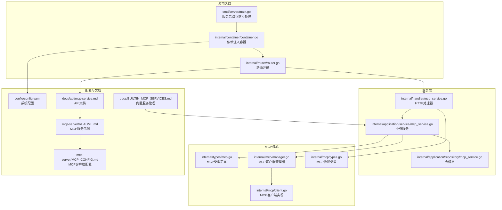
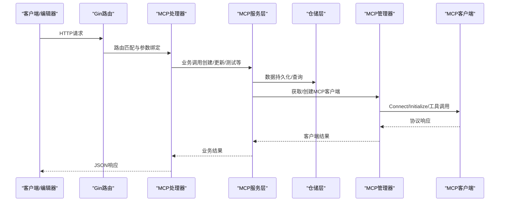
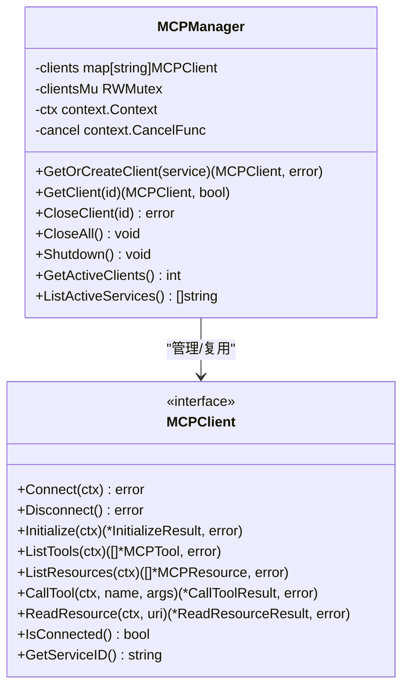
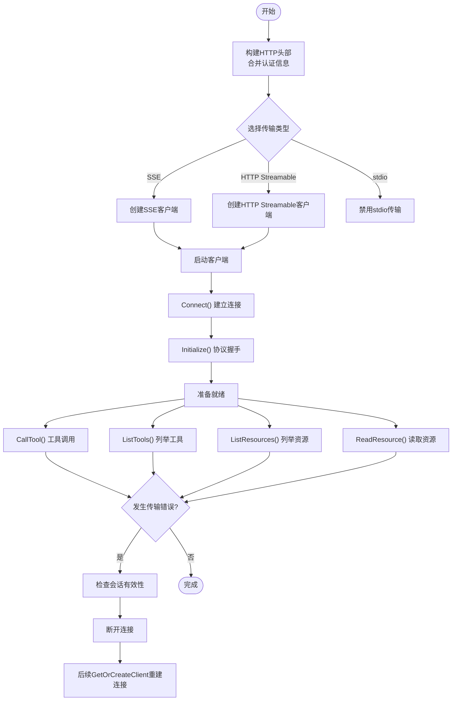
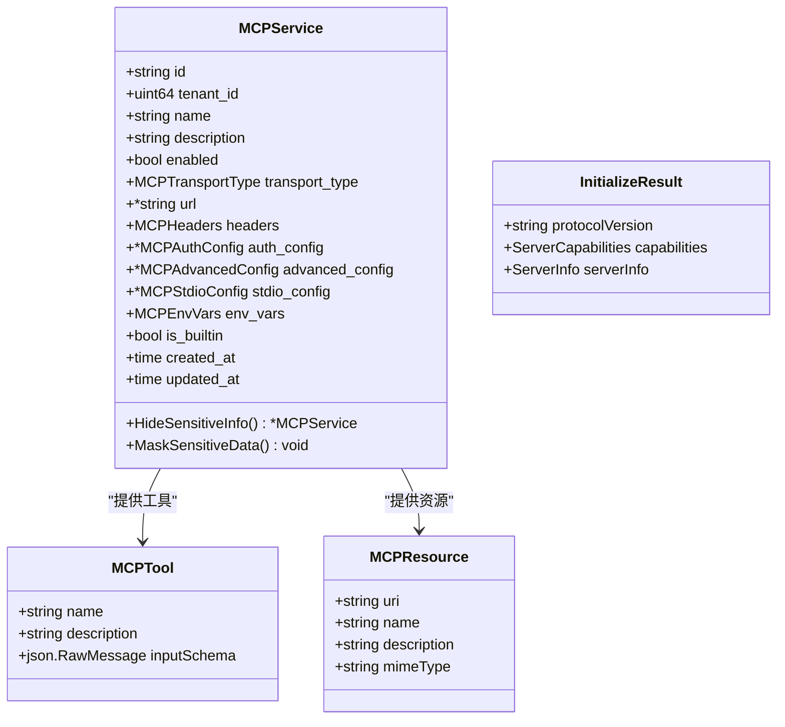
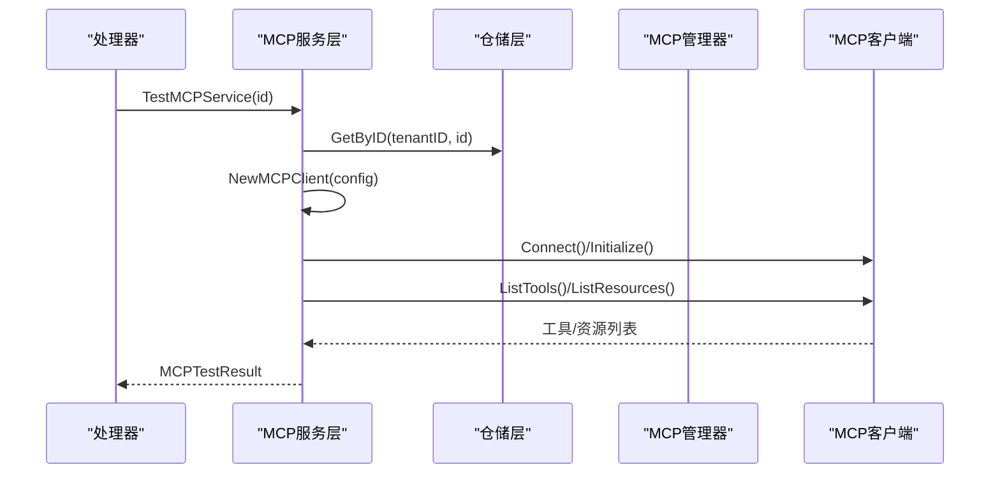
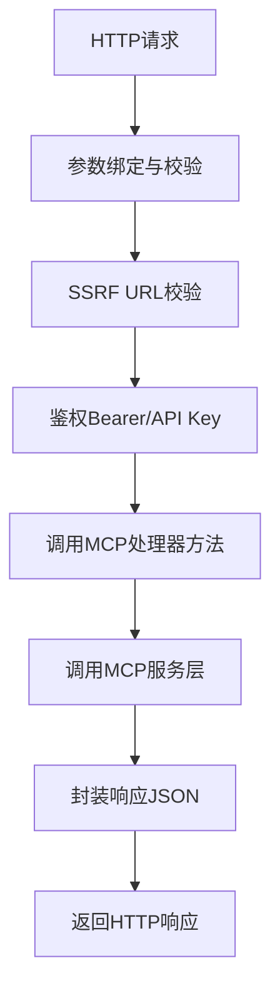
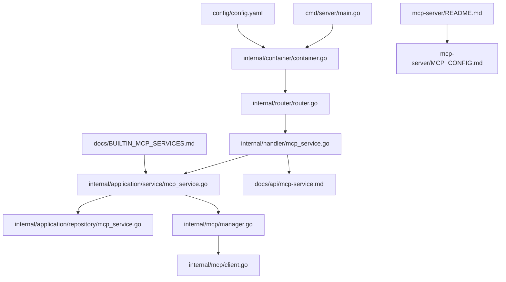

# MCP服务开发指南

<cite>
**本文档引用的文件**
- [README.md](file://README.md)
- [BUILTIN_MCP_SERVICES.md](file://docs/BUILTIN_MCP_SERVICES.md)
- [mcp-service.md](file://docs/api/mcp-service.md)
- [types.go](file://internal/mcp/types.go)
- [manager.go](file://internal/mcp/manager.go)
- [client.go](file://internal/mcp/client.go)
- [mcp.go](file://internal/types/mcp.go)
- [mcp_service.go](file://internal/application/service/mcp_service.go)
- [mcp_service.go](file://internal/handler/mcp_service.go)
- [mcp_service.go](file://client/mcp_service.go)
- [router.go](file://internal/router/router.go)
- [container.go](file://internal/container/container.go)
- [main.go](file://cmd/server/main.go)
- [config.yaml](file://config/config.yaml)
- [mcp-server/README.md](file://mcp-server/README.md)
- [mcp-server/MCP_CONFIG.md](file://mcp-server/MCP_CONFIG.md)
</cite>

## 目录
1. [简介](#简介)
2. [项目结构](#项目结构)
3. [核心组件](#核心组件)
4. [架构总览](#架构总览)
5. [详细组件分析](#详细组件分析)
6. [依赖关系分析](#依赖关系分析)
7. [性能考虑](#性能考虑)
8. [故障排查指南](#故障排查指南)
9. [结论](#结论)
10. [附录](#附录)

## 简介
本指南面向WeKnora MCP（Model Context Protocol）服务的开发者，系统阐述MCP服务的标准实现模式、接口规范与开发框架。文档覆盖服务启动流程、配置管理与生命周期控制，详细说明服务端点定义、请求处理与响应格式规范，并提供测试方法、调试工具与性能监控方案。同时，阐明MCP服务与WeKnora系统的集成方式与部署策略，帮助开发者快速构建、验证与上线MCP服务。

## 项目结构
WeKnora采用分层架构，MCP服务位于后端服务层，通过Gin路由暴露REST API，使用依赖注入容器统一装配，数据库持久化采用GORM，MCP客户端通过统一管理器复用连接，支持SSE与HTTP Streamable两种传输方式。

**图表来源**
- [main.go:43-123](file://cmd/server/main.go#L43-L123)
- [container.go:93-311](file://internal/container/container.go#L93-L311)
- [router.go:71-161](file://internal/router/router.go#L71-L161)
- [mcp_service.go:15-25](file://internal/handler/mcp_service.go#L15-L25)
- [mcp_service.go:15-30](file://internal/application/service/mcp_service.go#L15-L30)
- [mcp_service.go:12-20](file://internal/application/repository/mcp_service.go#L12-L20)
- [types.go:21-39](file://internal/types/mcp.go#L21-L39)
- [manager.go:13-35](file://internal/mcp/manager.go#L13-L35)
- [client.go:54-60](file://internal/mcp/client.go#L54-L60)
- [mcp-service.md:1-15](file://docs/api/mcp-service.md#L1-L15)
- [config.yaml:1-113](file://config/config.yaml#L1-L113)
- [mcp-server/README.md:1-143](file://mcp-server/README.md#L1-L143)
- [mcp-server/MCP_CONFIG.md:1-115](file://mcp-server/MCP_CONFIG.md#L1-L115)

**章节来源**
- [README.md:333-348](file://README.md#L333-L348)
- [main.go:43-123](file://cmd/server/main.go#L43-L123)
- [container.go:93-311](file://internal/container/container.go#L93-L311)
- [router.go:71-161](file://internal/router/router.go#L71-L161)

## 核心组件
- **MCP客户端管理器（MCPManager）**：负责MCP客户端的创建、缓存、复用与清理，支持SSE/HTTP Streamable长连接，提供连接健康检查与自动断线重连。
- **MCP客户端（MCPClient）**：封装mark3labs/mcp-go客户端，实现Initialize、ListTools、ListResources、CallTool、ReadResource等协议方法。
- **MCP类型系统**：定义InitializeResult、CallToolResult、ReadResourceResult等协议类型，以及MCPService、MCPTool、MCPResource等业务类型。
- **MCP服务层**：提供创建、查询、更新、删除、测试连接、列举工具与资源等能力，负责安全校验（如SSRF）、敏感信息掩码与内置服务保护。
- **MCP处理器**：基于Gin的HTTP处理器，实现REST API端点，负责参数绑定、鉴权、错误处理与响应封装。
- **仓储层**：基于GORM的数据库访问层，支持内置服务可见性、软删除与条件查询。
- **路由与容器**：统一注册MCP路由，通过依赖注入容器装配服务、仓储与处理器，支持多数据库驱动与自动迁移。

**章节来源**
- [manager.go:13-96](file://internal/mcp/manager.go#L13-L96)
- [client.go:19-47](file://internal/mcp/client.go#L19-L47)
- [types.go:3-67](file://internal/mcp/types.go#L3-L67)
- [mcp.go:21-88](file://internal/types/mcp.go#L21-L88)
- [mcp_service.go:15-30](file://internal/application/service/mcp_service.go#L15-L30)
- [mcp_service.go:15-25](file://internal/handler/mcp_service.go#L15-L25)
- [mcp_service.go:12-20](file://internal/application/repository/mcp_service.go#L12-L20)
- [router.go:461-482](file://internal/router/router.go#L461-L482)
- [container.go:158-160](file://internal/container/container.go#L158-L160)

## 架构总览
MCP服务在WeKnora中的位置与交互如下：

**图表来源**
- [router.go:461-482](file://internal/router/router.go#L461-L482)
- [mcp_service.go:39-76](file://internal/handler/mcp_service.go#L39-L76)
- [mcp_service.go:32-54](file://internal/application/service/mcp_service.go#L32-L54)
- [manager.go:37-96](file://internal/mcp/manager.go#L37-L96)
- [client.go:163-181](file://internal/mcp/client.go#L163-L181)

## 详细组件分析

### MCP客户端管理器（MCPManager）
- **职责**：集中管理MCP客户端生命周期，缓存SSE/HTTP Streamable连接，定期清理断开连接，提供连接状态查询与优雅关闭。
- **关键行为**：
  - GetOrCreateClient：按服务ID缓存客户端；SSE/HTTP连接复用；禁用stdio以保障安全。
  - initializeClient：带超时的初始化流程，防止阻塞。
  - cleanupIdleConnections：周期性清理断开连接。
  - 关闭策略：Shutdown触发上下文取消与所有连接关闭。

**图表来源**
- [manager.go:13-96](file://internal/mcp/manager.go#L13-L96)
- [client.go:19-47](file://internal/mcp/client.go#L19-L47)

**章节来源**
- [manager.go:13-226](file://internal/mcp/manager.go#L13-L226)

### MCP客户端实现（mcpGoClient）
- **职责**：封装第三方mcp-go客户端，实现MCP协议方法，处理连接丢失回调与会话失效错误。
- **关键行为**：
  - Transport选择：SSE/HTTP Streamable；禁用stdio。
  - 头部与认证：支持API Key、Bearer Token与自定义头部。
  - 错误处理：识别“无效会话ID”“无活动连接”等错误并主动断开重连。
  - 协议映射：Initialize、ListTools、ListResources、CallTool、ReadResource的结果转换。

**图表来源**
- [client.go:62-135](file://internal/mcp/client.go#L62-L135)
- [client.go:137-161](file://internal/mcp/client.go#L137-L161)
- [client.go:198-327](file://internal/mcp/client.go#L198-L327)
- [client.go:329-368](file://internal/mcp/client.go#L329-L368)

**章节来源**
- [client.go:1-379](file://internal/mcp/client.go#L1-L379)

### MCP类型系统
- **协议类型**：InitializeResult、CallToolResult、ReadResourceResult、ContentItem、ResourceContent等。
- **业务类型**：MCPService（含传输类型、URL/Stdio配置、认证与高级配置）、MCPTool、MCPResource、MCPTestResult。
- **安全与可见性**：内置服务（is_builtin）对所有租户可见，但敏感信息隐藏；普通服务支持敏感信息掩码。

**图表来源**
- [mcp.go:21-88](file://internal/types/mcp.go#L21-L88)
- [types.go:3-67](file://internal/mcp/types.go#L3-L67)

**章节来源**
- [mcp.go:1-243](file://internal/types/mcp.go#L1-L243)
- [types.go:1-67](file://internal/mcp/types.go#L1-L67)

### MCP服务层（业务逻辑）
- **职责**：封装MCP服务的CRUD、测试连接、列举工具与资源等业务逻辑；执行安全校验与敏感信息处理。
- **关键行为**：
  - 创建/更新/删除：禁用stdio；内置服务不可编辑/删除；更新时检测关键配置变更并关闭旧连接。
  - 测试连接：临时创建客户端，超时控制，返回工具与资源清单。
  - 列举工具/资源：通过MCP管理器获取或创建客户端后调用。

**图表来源**
- [mcp_service.go:261-334](file://internal/application/service/mcp_service.go#L261-L334)
- [mcp_service.go:336-394](file://internal/application/service/mcp_service.go#L336-L394)

**章节来源**
- [mcp_service.go:1-408](file://internal/application/service/mcp_service.go#L1-L408)

### MCP处理器（HTTP接口）
- **职责**：基于Gin实现REST API端点，负责参数绑定、鉴权、SSRF校验、错误处理与响应封装。
- **关键端点**：
  - 创建/查询/更新/删除MCP服务
  - 测试连接
  - 列举工具与资源

**图表来源**
- [mcp_service.go:39-76](file://internal/handler/mcp_service.go#L39-L76)
- [mcp_service.go:112-152](file://internal/handler/mcp_service.go#L112-L152)
- [mcp_service.go:154-294](file://internal/handler/mcp_service.go#L154-L294)

**章节来源**
- [mcp_service.go:1-448](file://internal/handler/mcp_service.go#L1-L448)

### 路由与容器装配
- **路由注册**：统一在router中注册MCP服务路由组，挂载到/v1路径下。
- **依赖注入**：容器负责注册仓储、服务、处理器与MCP管理器，支持多数据库驱动与自动迁移。

**章节来源**
- [router.go:461-482](file://internal/router/router.go#L461-L482)
- [container.go:147-160](file://internal/container/container.go#L147-L160)
- [container.go:279-289](file://internal/container/container.go#L279-L289)

## 依赖关系分析

**图表来源**
- [main.go:55-60](file://cmd/server/main.go#L55-L60)
- [container.go:93-311](file://internal/container/container.go#L93-L311)
- [router.go:461-482](file://internal/router/router.go#L461-L482)
- [mcp_service.go:15-25](file://internal/handler/mcp_service.go#L15-L25)
- [mcp_service.go:15-30](file://internal/application/service/mcp_service.go#L15-L30)
- [mcp_service.go:12-20](file://internal/application/repository/mcp_service.go#L12-L20)
- [manager.go:13-35](file://internal/mcp/manager.go#L13-L35)
- [client.go:54-60](file://internal/mcp/client.go#L54-L60)
- [mcp-service.md:1-15](file://docs/api/mcp-service.md#L1-L15)
- [config.yaml:1-113](file://config/config.yaml#L1-L113)
- [BUILTIN_MCP_SERVICES.md:1-145](file://docs/BUILTIN_MCP_SERVICES.md#L1-L145)
- [mcp-server/README.md:1-143](file://mcp-server/README.md#L1-L143)
- [mcp-server/MCP_CONFIG.md:1-115](file://mcp-server/MCP_CONFIG.md#L1-L115)

**章节来源**
- [router.go:461-482](file://internal/router/router.go#L461-L482)
- [container.go:93-311](file://internal/container/container.go#L93-L311)

## 性能考虑
- **连接复用**：SSE/HTTP Streamable连接在MCP管理器中缓存复用，减少握手与初始化开销。
- **超时控制**：客户端与初始化均设置超时，避免长时间阻塞；超时上限限制防止过长等待。
- **连接清理**：定时清理断开连接，释放资源，避免内存泄漏。
- **并发与重试**：高级配置支持超时、重试次数与重试间隔，提升稳定性。
- **数据库优化**：仓储层使用条件查询与索引字段，内置服务可见性通过联合条件实现高效查询。

**章节来源**
- [manager.go:171-197](file://internal/mcp/manager.go#L171-L197)
- [client.go:63-72](file://internal/mcp/client.go#L63-L72)
- [mcp_service.go:200-207](file://internal/application/service/mcp_service.go#L200-L207)

## 故障排查指南
- **连接失败**：
  - 检查URL与传输类型配置；确认SSE/HTTP Streamable URL可达。
  - 查看连接丢失回调与会话失效错误，确认服务端会话头（Mcp-Session-Id）有效性。
- **认证问题**：
  - 确认API Key或Bearer Token配置正确；检查自定义头部拼装。
- **SSRF防护**：
  - 处理器对URL进行SSRF校验，若失败返回参数错误。
- **内置服务限制**：
  - 内置服务不可编辑/删除；敏感信息在前端展示时会被隐藏。
- **测试连接**：
  - 使用测试端点验证工具与资源列表；关注超时与初始化失败原因。

**章节来源**
- [client.go:137-161](file://internal/mcp/client.go#L137-L161)
- [mcp_service.go:57-64](file://internal/handler/mcp_service.go#L57-L64)
- [BUILTIN_MCP_SERVICES.md:14-24](file://docs/BUILTIN_MCP_SERVICES.md#L14-L24)
- [mcp_service.go:261-334](file://internal/application/service/mcp_service.go#L261-L334)

## 结论
WeKnora的MCP服务开发遵循清晰的分层架构与严格的接口规范，通过依赖注入容器实现松耦合装配，借助MCP管理器实现连接复用与生命周期管理。开发者可基于此框架快速实现MCP服务，结合内置服务管理与测试工具，确保服务的稳定性与安全性。

## 附录

### 服务端点定义与响应格式
- **创建MCP服务**：POST /api/v1/mcp-services
- **获取MCP服务列表**：GET /api/v1/mcp-services
- **获取MCP服务详情**：GET /api/v1/mcp-services/:id
- **更新MCP服务**：PUT /api/v1/mcp-services/:id
- **删除MCP服务**：DELETE /api/v1/mcp-services/:id
- **测试MCP服务连接**：POST /api/v1/mcp-services/:id/test
- **获取MCP服务工具列表**：GET /api/v1/mcp-services/:id/tools
- **获取MCP服务资源列表**：GET /api/v1/mcp-services/:id/resources

响应统一结构：success布尔字段与data承载具体数据；测试连接返回success、message、tools与resources数组。

**章节来源**
- [mcp-service.md:5-396](file://docs/api/mcp-service.md#L5-L396)

### 配置与部署策略
- **服务启动**：通过main函数启动HTTP服务器，注册路由与中间件，监听信号实现优雅关闭。
- **容器装配**：依赖注入容器注册数据库、仓储、服务、处理器与MCP管理器，支持多数据库驱动与自动迁移。
- **MCP客户端配置**：推荐使用uv运行Python MCP服务，配置WEKNORA_BASE_URL与WEKNORA_API_KEY环境变量。
- **内置MCP服务**：通过数据库插入内置服务，支持SSE与HTTP Streamable传输，stdio禁用。

**章节来源**
- [main.go:43-123](file://cmd/server/main.go#L43-L123)
- [container.go:93-311](file://internal/container/container.go#L93-L311)
- [mcp-server/MCP_CONFIG.md:1-115](file://mcp-server/MCP_CONFIG.md#L1-L115)
- [BUILTIN_MCP_SERVICES.md:25-145](file://docs/BUILTIN_MCP_SERVICES.md#L25-L145)