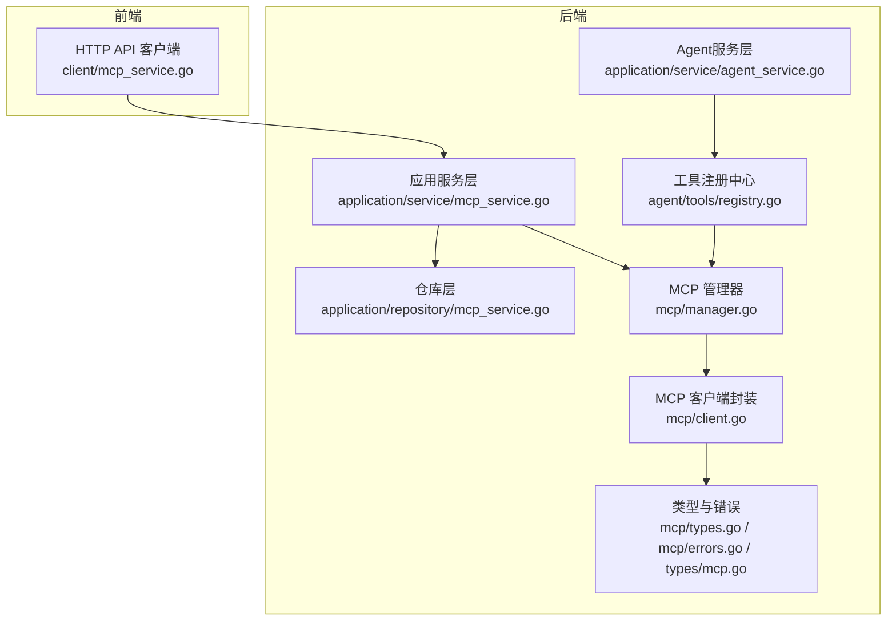
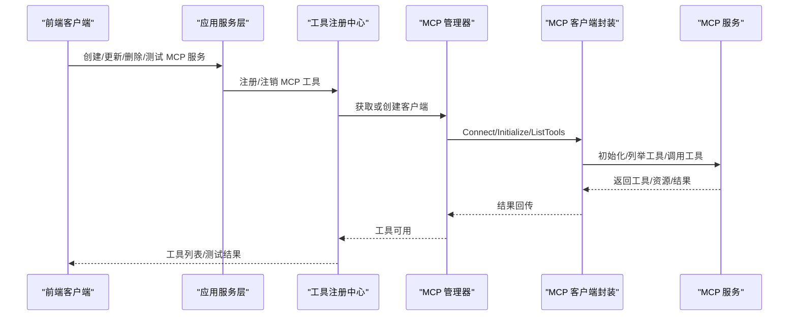
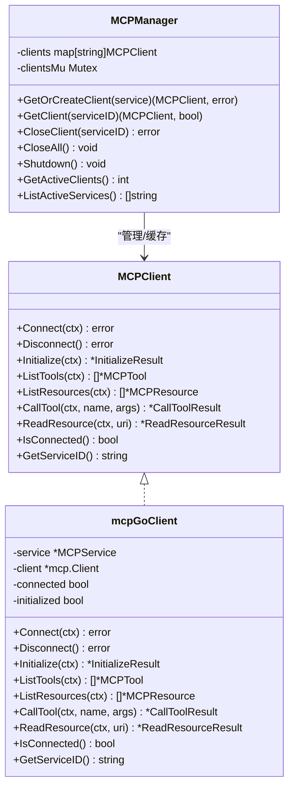
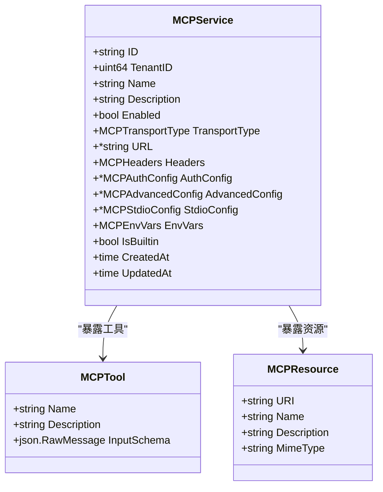
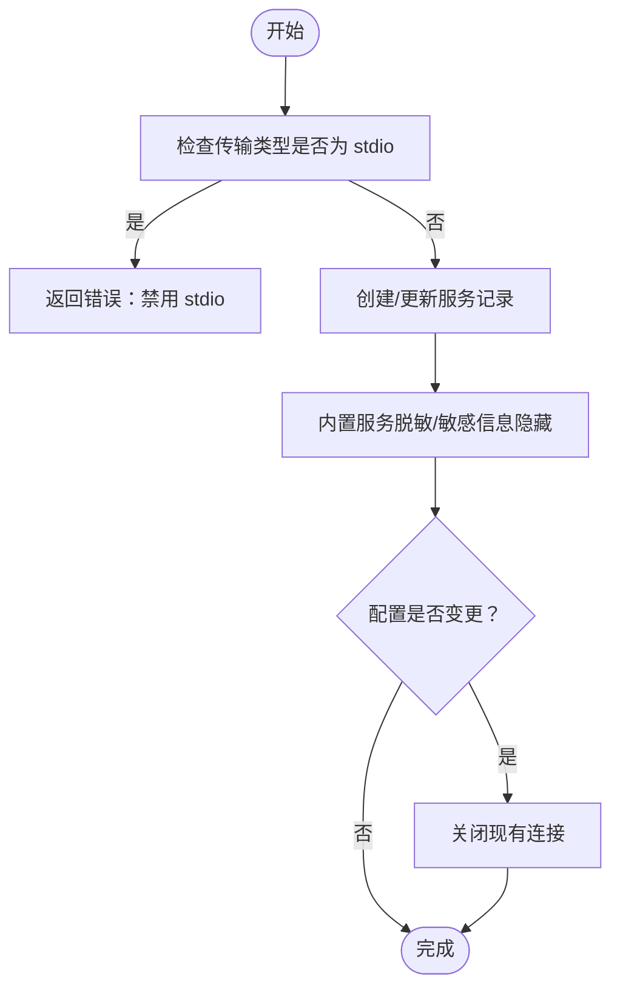
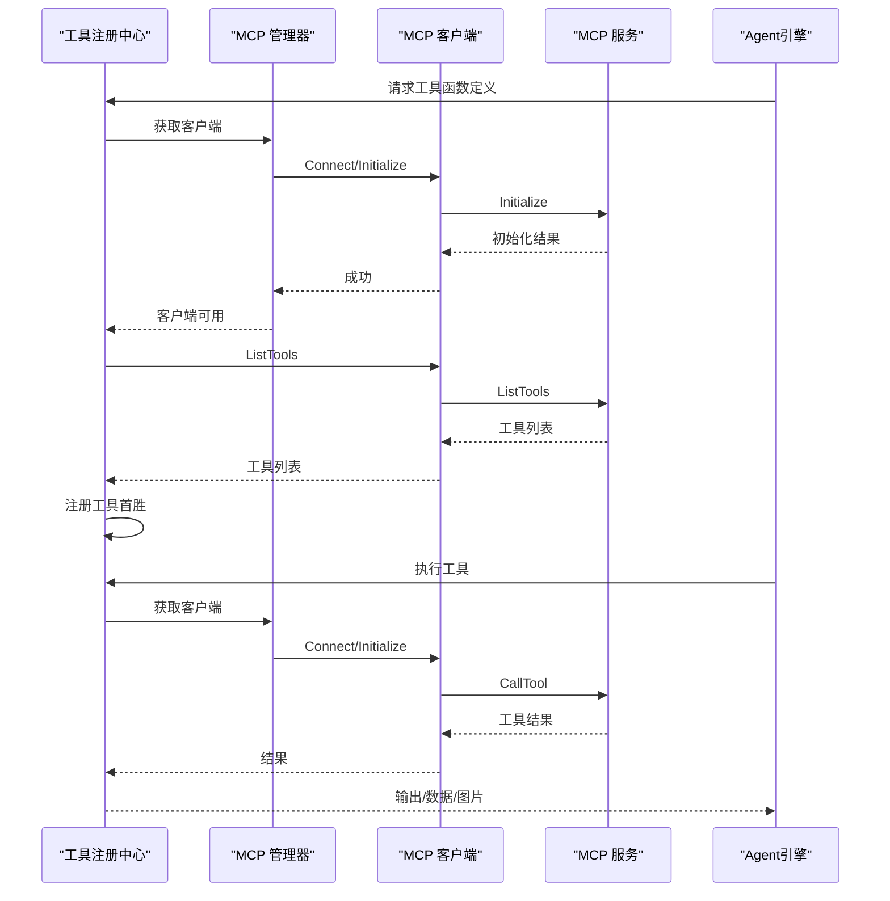
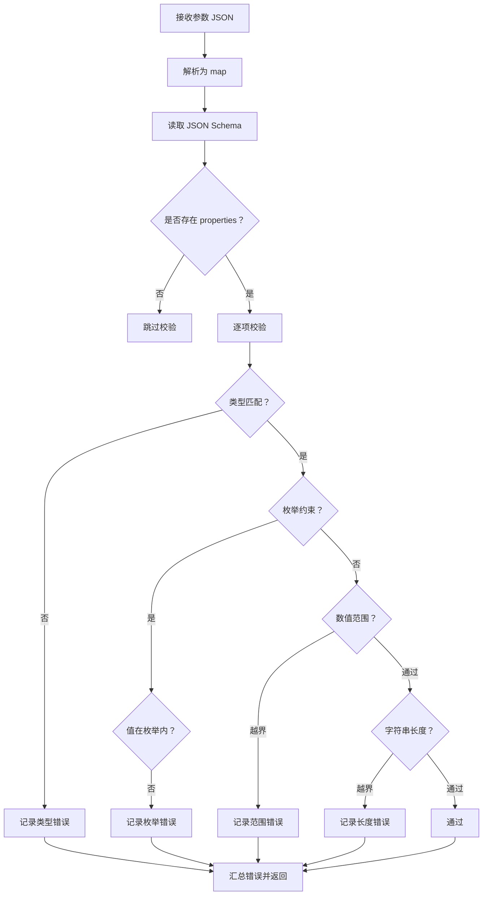
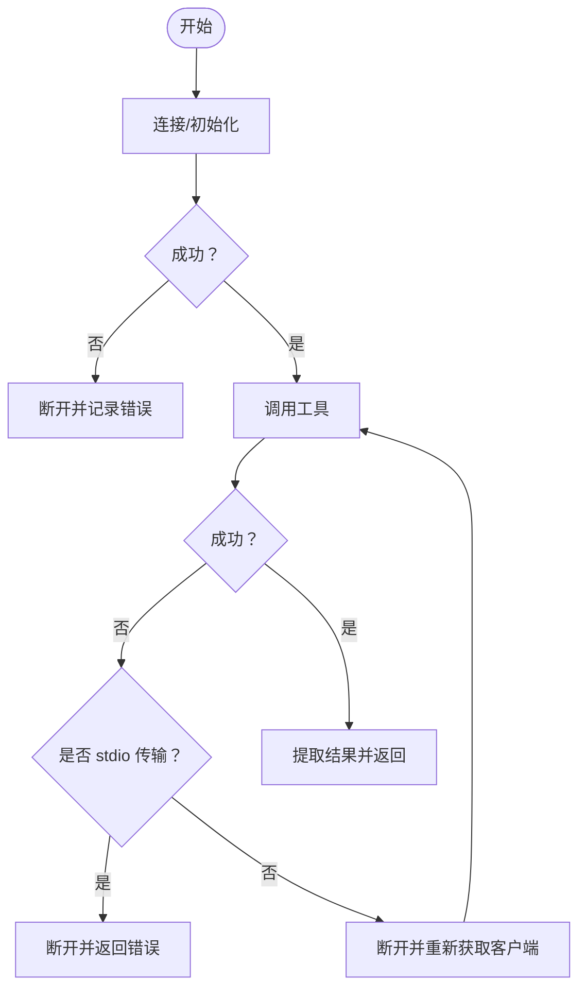
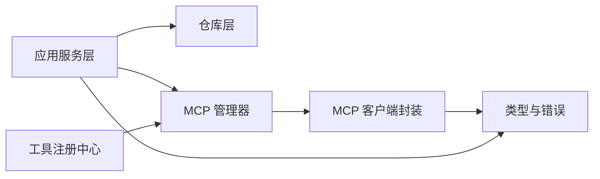

# MCP服务集成

<cite>
**本文引用的文件**
- [internal/mcp/client.go](file://internal/mcp/client.go)
- [internal/mcp/manager.go](file://internal/mcp/manager.go)
- [internal/mcp/types.go](file://internal/mcp/types.go)
- [internal/mcp/errors.go](file://internal/mcp/errors.go)
- [internal/types/mcp.go](file://internal/types/mcp.go)
- [internal/application/service/mcp_service.go](file://internal/application/service/mcp_service.go)
- [internal/application/repository/mcp_service.go](file://internal/application/repository/mcp_service.go)
- [client/mcp_service.go](file://client/mcp_service.go)
- [internal/agent/tools/mcp_tool.go](file://internal/agent/tools/mcp_tool.go)
- [internal/agent/tools/registry.go](file://internal/agent/tools/registry.go)
- [internal/agent/tools/param_validate.go](file://internal/agent/tools/param_validate.go)
- [internal/agent/tools/skill_execute.go](file://internal/agent/tools/skill_execute.go)
- [internal/application/service/agent_service.go](file://internal/application/service/agent_service.go)
</cite>

## 目录
1. [简介](#简介)
2. [项目结构](#项目结构)
3. [核心组件](#核心组件)
4. [架构总览](#架构总览)
5. [详细组件分析](#详细组件分析)
6. [依赖关系分析](#依赖关系分析)
7. [性能考量](#性能考量)
8. [故障排查指南](#故障排查指南)
9. [结论](#结论)
10. [附录](#附录)

## 简介
本文件为 WeKnora 的 MCP（Model Context Protocol）服务集成系统提供全面技术文档。内容覆盖 MCP 协议实现机制、服务发现与注册、工具注册与连接管理策略、外部工具集成流程、参数验证与错误处理、MCP 客户端实现、工具调用流程、性能优化方案、安全考虑、连接重试与故障恢复策略，并给出 MCP 服务开发与工具扩展的最佳实践与调试技巧。

## 项目结构
WeKnora 将 MCP 能力划分为多层：类型定义与错误码、应用服务层、仓库层、MCP 客户端与管理器、工具注册与执行层。前端通过 HTTP API 与后端交互，后端负责 MCP 服务配置、连接管理、工具注册与调用。

**图表来源**
- [client/mcp_service.go:1-208](file://client/mcp_service.go#L1-L208)
- [internal/application/service/mcp_service.go:1-408](file://internal/application/service/mcp_service.go#L1-L408)
- [internal/application/repository/mcp_service.go:1-147](file://internal/application/repository/mcp_service.go#L1-L147)
- [internal/application/service/agent_service.go:183-230](file://internal/application/service/agent_service.go#L183-L230)
- [internal/agent/tools/registry.go:1-171](file://internal/agent/tools/registry.go#L1-L171)
- [internal/mcp/manager.go:1-226](file://internal/mcp/manager.go#L1-L226)
- [internal/mcp/client.go:1-379](file://internal/mcp/client.go#L1-L379)
- [internal/mcp/types.go:1-67](file://internal/mcp/types.go#L1-L67)
- [internal/mcp/errors.go:1-33](file://internal/mcp/errors.go#L1-L33)
- [internal/types/mcp.go:1-243](file://internal/types/mcp.go#L1-L243)

**章节来源**
- [client/mcp_service.go:1-208](file://client/mcp_service.go#L1-L208)
- [internal/application/service/mcp_service.go:1-408](file://internal/application/service/mcp_service.go#L1-L408)
- [internal/application/repository/mcp_service.go:1-147](file://internal/application/repository/mcp_service.go#L1-L147)
- [internal/application/service/agent_service.go:183-230](file://internal/application/service/agent_service.go#L183-L230)
- [internal/agent/tools/registry.go:1-171](file://internal/agent/tools/registry.go#L1-L171)
- [internal/mcp/manager.go:1-226](file://internal/mcp/manager.go#L1-L226)
- [internal/mcp/client.go:1-379](file://internal/mcp/client.go#L1-L379)
- [internal/mcp/types.go:1-67](file://internal/mcp/types.go#L1-L67)
- [internal/mcp/errors.go:1-33](file://internal/mcp/errors.go#L1-L33)
- [internal/types/mcp.go:1-243](file://internal/types/mcp.go#L1-L243)

## 核心组件
- 类型与错误定义：统一描述 MCP 服务配置、传输方式、认证、高级配置、工具与资源模型，以及标准错误码。
- 应用服务层：负责 MCP 服务的创建、查询、更新、删除、测试连通性、列举工具与资源。
- 仓库层：持久化 MCP 服务配置，支持内置服务对所有租户可见。
- MCP 管理器：集中管理 MCP 客户端生命周期，缓存连接并进行周期清理。
- MCP 客户端封装：基于第三方库封装初始化、工具列表、资源读取、工具调用等操作，并处理会话失效等异常。
- 工具注册与执行：将 MCP 工具注册到全局工具注册中心，执行前进行参数校验与类型转换，执行后提取文本与图片结果并进行安全输出。
- 参数验证：基于 JSON Schema 的参数校验，提前拦截无效参数，减少无效调用。
- Agent 集成：根据 Agent 配置选择启用的 MCP 服务，动态注册 MCP 工具。

**章节来源**
- [internal/types/mcp.go:1-243](file://internal/types/mcp.go#L1-L243)
- [internal/mcp/types.go:1-67](file://internal/mcp/types.go#L1-L67)
- [internal/mcp/errors.go:1-33](file://internal/mcp/errors.go#L1-L33)
- [internal/application/service/mcp_service.go:1-408](file://internal/application/service/mcp_service.go#L1-L408)
- [internal/application/repository/mcp_service.go:1-147](file://internal/application/repository/mcp_service.go#L1-L147)
- [internal/mcp/manager.go:1-226](file://internal/mcp/manager.go#L1-L226)
- [internal/mcp/client.go:1-379](file://internal/mcp/client.go#L1-L379)
- [internal/agent/tools/registry.go:1-171](file://internal/agent/tools/registry.go#L1-L171)
- [internal/agent/tools/mcp_tool.go:1-479](file://internal/agent/tools/mcp_tool.go#L1-L479)
- [internal/agent/tools/param_validate.go:1-235](file://internal/agent/tools/param_validate.go#L1-L235)
- [internal/application/service/agent_service.go:183-230](file://internal/application/service/agent_service.go#L183-L230)

## 架构总览
下图展示从前端到后端、再到 MCP 服务的完整调用链路与关键控制点。

**图表来源**
- [client/mcp_service.go:81-208](file://client/mcp_service.go#L81-L208)
- [internal/application/service/mcp_service.go:261-394](file://internal/application/service/mcp_service.go#L261-L394)
- [internal/agent/tools/registry.go:43-159](file://internal/agent/tools/registry.go#L43-L159)
- [internal/mcp/manager.go:37-96](file://internal/mcp/manager.go#L37-L96)
- [internal/mcp/client.go:163-327](file://internal/mcp/client.go#L163-L327)

## 详细组件分析

### MCP 客户端与管理器
- 客户端封装
  - 支持 SSE 与 HTTP Streamable 两种传输；禁用 stdio 以避免命令注入风险。
  - 自动构建 HTTP 头部，支持 API Key、Bearer Token 与自定义头部。
  - 提供 Initialize、ListTools、ListResources、CallTool、ReadResource 等方法。
  - 对会话失效类错误进行检测并主动断开，确保后续请求能建立新会话。
- 管理器
  - 缓存已连接客户端，复用长连接（SSE/HTTP Streamable），避免重复握手。
  - 提供连接超时控制、初始化超时控制、周期清理断开连接、统计活跃客户端数量。
  - 支持关闭指定客户端与全部客户端，优雅关停。

**图表来源**
- [internal/mcp/client.go:19-135](file://internal/mcp/client.go#L19-L135)
- [internal/mcp/client.go:54-135](file://internal/mcp/client.go#L54-L135)
- [internal/mcp/manager.go:13-35](file://internal/mcp/manager.go#L13-L35)
- [internal/mcp/manager.go:37-96](file://internal/mcp/manager.go#L37-L96)

**章节来源**
- [internal/mcp/client.go:1-379](file://internal/mcp/client.go#L1-L379)
- [internal/mcp/manager.go:1-226](file://internal/mcp/manager.go#L1-L226)
- [internal/mcp/errors.go:1-33](file://internal/mcp/errors.go#L1-L33)

### MCP 服务配置与类型定义
- 传输类型：SSE、HTTP Streamable、stdio（禁用）。
- 认证配置：API Key、Token、自定义头部。
- 高级配置：超时、重试次数、重试间隔。
- 工具与资源：输入参数 JSON Schema、URI、名称、描述、MIME 类型。
- 内置服务：对所有租户可见，敏感信息在列表中脱敏显示。

**图表来源**
- [internal/types/mcp.go:21-80](file://internal/types/mcp.go#L21-L80)

**章节来源**
- [internal/types/mcp.go:1-243](file://internal/types/mcp.go#L1-L243)

### 应用服务层：MCP 服务管理
- 创建/更新/删除：校验传输类型（禁用 stdio），合并更新字段，屏蔽内置服务修改与删除。
- 测试连通性：临时创建客户端，连接、初始化、列举工具与资源，返回测试结果。
- 列举工具与资源：通过管理器获取客户端，避免重复握手。
- 配置变更处理：当服务被禁用、关键配置变更或启用状态变化时，关闭现有连接以确保干净状态。

**图表来源**
- [internal/application/service/mcp_service.go:32-231](file://internal/application/service/mcp_service.go#L32-L231)

**章节来源**
- [internal/application/service/mcp_service.go:1-408](file://internal/application/service/mcp_service.go#L1-L408)
- [internal/application/repository/mcp_service.go:1-147](file://internal/application/repository/mcp_service.go#L1-L147)

### 工具注册与调用流程
- 注册流程：遍历启用的 MCP 服务，获取客户端，列举工具，生成工具包装器，按首胜策略注册，避免命名冲突。
- 执行流程：参数解析与 JSON Schema 校验，必要时类型转换，执行 MCP 工具调用，提取文本与图片结果，进行安全输出与大小限制。
- 错误处理：区分连接失败、初始化失败、工具不存在、资源不存在、无效响应、超时、连接关闭等错误；对会话失效进行自动断开与重连。

**图表来源**
- [internal/agent/tools/registry.go:43-159](file://internal/agent/tools/registry.go#L43-L159)
- [internal/agent/tools/mcp_tool.go:323-415](file://internal/agent/tools/mcp_tool.go#L323-L415)
- [internal/mcp/manager.go:37-96](file://internal/mcp/manager.go#L37-L96)
- [internal/mcp/client.go:163-327](file://internal/mcp/client.go#L163-L327)

**章节来源**
- [internal/agent/tools/registry.go:1-171](file://internal/agent/tools/registry.go#L1-L171)
- [internal/agent/tools/mcp_tool.go:1-479](file://internal/agent/tools/mcp_tool.go#L1-L479)
- [internal/agent/tools/param_validate.go:1-235](file://internal/agent/tools/param_validate.go#L1-L235)

### 参数验证机制
- 基于 JSON Schema 的参数校验，支持 required、type、enum、minimum/maximum、minLength/maxLength 等规则。
- 在工具执行前进行校验，格式化错误消息并提示重试不同方法，避免无效调用浪费资源。

**图表来源**
- [internal/agent/tools/param_validate.go:15-153](file://internal/agent/tools/param_validate.go#L15-L153)

**章节来源**
- [internal/agent/tools/param_validate.go:1-235](file://internal/agent/tools/param_validate.go#L1-L235)

### 错误处理与重试策略
- 连接与初始化：超时控制、错误分类、断开连接、日志记录。
- 工具调用：失败时对非 stdio 传输进行一次重连重试；对会话失效错误进行自动断开。
- 资源读取：统一错误处理与内容提取。
- Agent 层：工具执行失败附加重试提示，避免循环失败。

**图表来源**
- [internal/mcp/client.go:143-161](file://internal/mcp/client.go#L143-L161)
- [internal/mcp/client.go:287-327](file://internal/mcp/client.go#L287-L327)
- [internal/agent/tools/mcp_tool.go:89-184](file://internal/agent/tools/mcp_tool.go#L89-L184)

**章节来源**
- [internal/mcp/client.go:1-379](file://internal/mcp/client.go#L1-L379)
- [internal/agent/tools/mcp_tool.go:1-479](file://internal/agent/tools/mcp_tool.go#L1-L479)

### 安全考虑与调试技巧
- 传输安全：禁用 stdio，仅使用 SSE 或 HTTP Streamable；会话头失效时自动断开。
- 输出安全：MCP 工具输出前缀“不可信”标记，图片数据脱敏，限制最大图片数量与大小。
- 参数安全：严格 JSON Schema 校验，避免注入与类型不匹配。
- 调试建议：开启日志、使用测试接口验证连通性与工具列表、观察会话头与错误码、关注连接清理与活跃客户端统计。

**章节来源**
- [internal/mcp/client.go:122-127](file://internal/mcp/client.go#L122-L127)
- [internal/agent/tools/mcp_tool.go:166-184](file://internal/agent/tools/mcp_tool.go#L166-L184)
- [internal/application/service/mcp_service.go:261-334](file://internal/application/service/mcp_service.go#L261-L334)

## 依赖关系分析
- 组件耦合
  - 应用服务层依赖仓库层与 MCP 管理器。
  - 工具注册中心依赖 MCP 管理器与工具实现。
  - MCP 客户端封装依赖第三方库与内部类型。
- 外部依赖
  - 第三方 MCP 客户端库用于实际协议通信。
  - GORM 用于持久化 MCP 服务配置。
- 潜在环路
  - 当前结构为单向依赖，未见循环引用。

**图表来源**
- [internal/application/service/mcp_service.go:15-30](file://internal/application/service/mcp_service.go#L15-L30)
- [internal/agent/tools/registry.go:16-27](file://internal/agent/tools/registry.go#L16-L27)
- [internal/mcp/manager.go:13-35](file://internal/mcp/manager.go#L13-L35)
- [internal/mcp/client.go:19-53](file://internal/mcp/client.go#L19-L53)

**章节来源**
- [internal/application/service/mcp_service.go:1-408](file://internal/application/service/mcp_service.go#L1-L408)
- [internal/agent/tools/registry.go:1-171](file://internal/agent/tools/registry.go#L1-L171)
- [internal/mcp/manager.go:1-226](file://internal/mcp/manager.go#L1-L226)
- [internal/mcp/client.go:1-379](file://internal/mcp/client.go#L1-L379)

## 性能考量
- 连接复用：SSE/HTTP Streamable 传输通过管理器缓存客户端，避免重复握手与初始化。
- 超时控制：连接超时、初始化超时、工具列举超时，防止阻塞与资源占用。
- 清理策略：定时清理断开连接，降低内存占用与僵尸连接风险。
- 输出限制：图片数量与大小限制、输出截断，避免上下文窗口污染与内存膨胀。
- 并发安全：读写锁保护客户端映射，提高并发访问效率。

**章节来源**
- [internal/mcp/manager.go:171-225](file://internal/mcp/manager.go#L171-L225)
- [internal/agent/tools/mcp_tool.go:186-202](file://internal/agent/tools/mcp_tool.go#L186-L202)
- [internal/agent/tools/registry.go:29-41](file://internal/agent/tools/registry.go#L29-L41)

## 故障排查指南
- 常见错误
  - 不支持的传输类型：确认使用 SSE 或 HTTP Streamable。
  - 未连接：检查连接与初始化是否成功。
  - 初始化握手失败：检查超时设置与服务端可达性。
  - 工具/资源不存在：确认服务端是否正确暴露。
  - 无效响应：检查服务端返回格式与内容。
  - 超时：调整高级配置中的超时时间。
  - 连接关闭：关注会话头失效与自动断开逻辑。
- 排查步骤
  - 使用测试接口验证连通性与工具列表。
  - 查看日志中的连接与初始化阶段错误。
  - 观察活跃客户端数量与清理周期。
  - 对 stdio 传输进行隔离测试，确认禁用原因。

**章节来源**
- [internal/mcp/errors.go:1-33](file://internal/mcp/errors.go#L1-L33)
- [internal/application/service/mcp_service.go:261-334](file://internal/application/service/mcp_service.go#L261-L334)
- [internal/mcp/client.go:143-161](file://internal/mcp/client.go#L143-L161)

## 结论
WeKnora 的 MCP 集成体系通过清晰的分层设计与严格的错误处理、参数校验与安全策略，实现了稳定可靠的外部工具集成能力。管理器的连接复用与清理机制提升了性能与稳定性，工具注册与执行流程保证了可扩展性与安全性。建议在生产环境中合理配置超时与重试，持续监控活跃连接与错误日志，并遵循禁用 stdio 的安全策略。

## 附录
- MCP 服务开发指南
  - 选择 SSE 或 HTTP Streamable 作为传输，配置必要的认证头。
  - 提供准确的工具输入 JSON Schema，便于参数校验与工具函数定义。
  - 实现稳定的初始化与工具调用，避免会话头失效导致的频繁断开。
- 工具扩展最佳实践
  - 工具命名采用“mcp_{service_name}_{tool_name}”格式，保持稳定。
  - 严格限制工具输出的图片数量与大小，避免内存与上下文问题。
  - 对错误输出进行统一格式化，便于 Agent 与用户理解。
- 调试技巧
  - 使用测试接口快速验证服务连通性与工具列表。
  - 关注会话头与错误码，定位会话失效问题。
  - 启用详细日志，观察连接、初始化、工具调用各阶段行为。