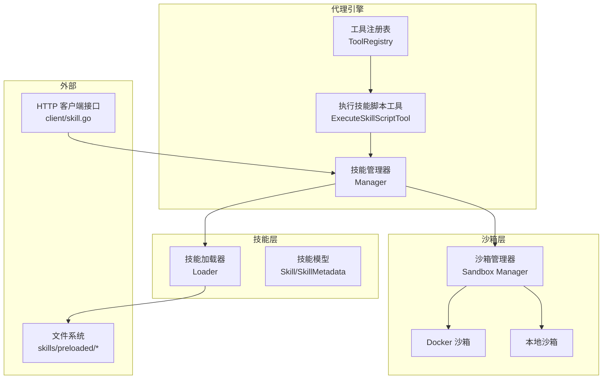
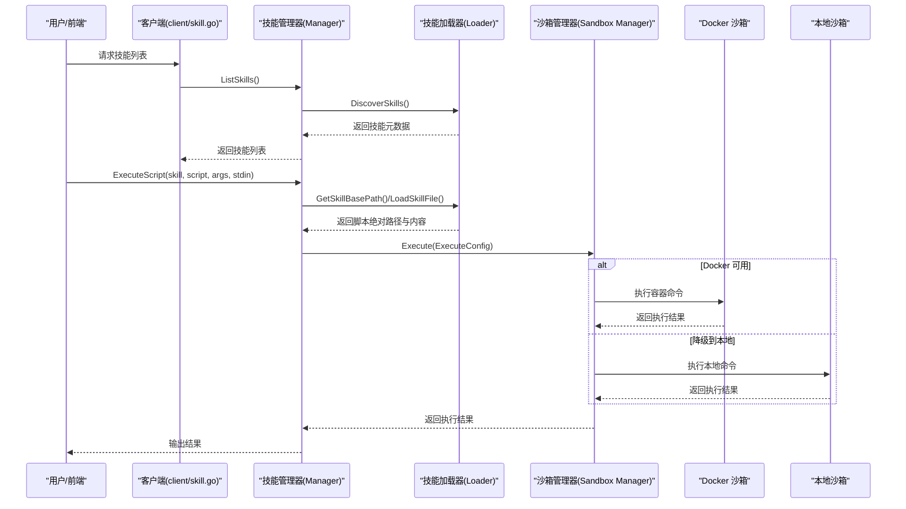
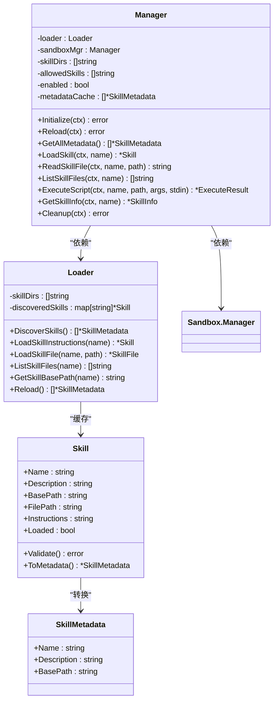
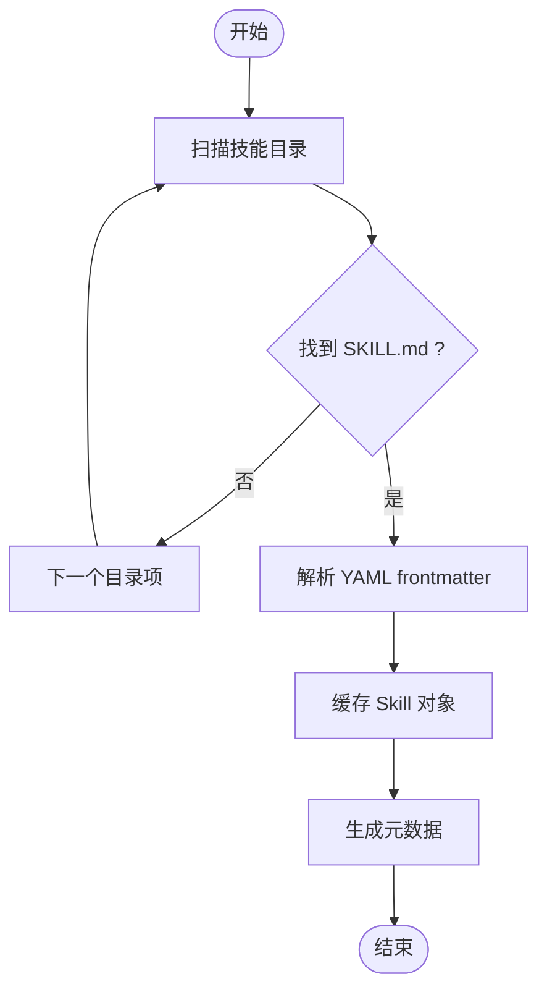
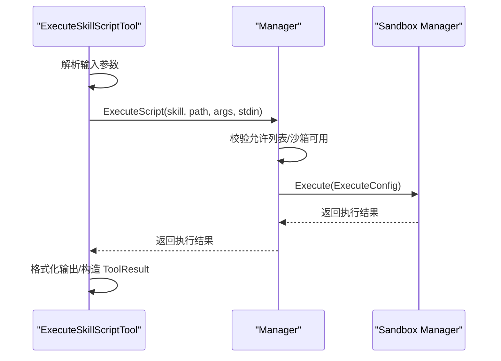
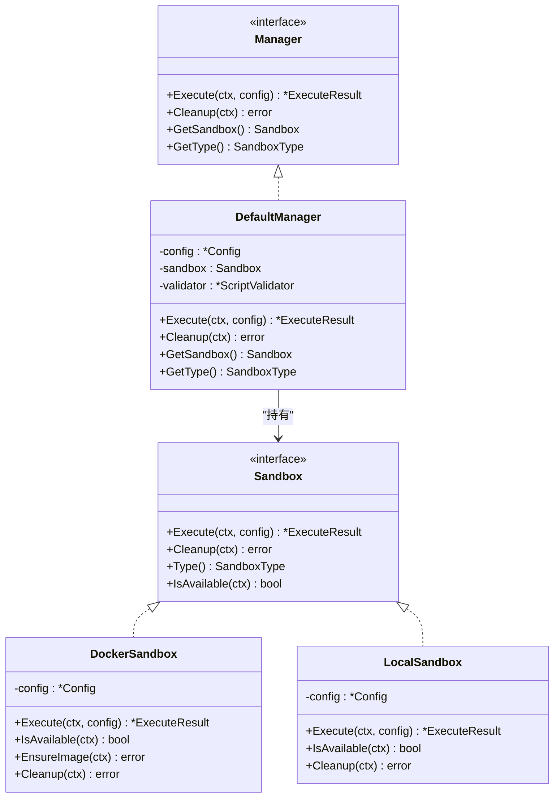
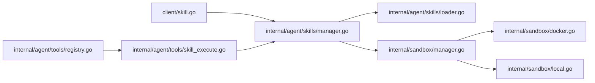

# 代理技能系统

<cite>
**本文引用的文件**
- [internal/agent/skills/manager.go](file://internal/agent/skills/manager.go)
- [internal/agent/skills/loader.go](file://internal/agent/skills/loader.go)
- [internal/agent/skills/skill.go](file://internal/agent/skills/skill.go)
- [internal/agent/tools/skill_execute.go](file://internal/agent/tools/skill_execute.go)
- [internal/agent/tools/registry.go](file://internal/agent/tools/registry.go)
- [internal/agent/tools/definitions.go](file://internal/agent/tools/definitions.go)
- [internal/sandbox/manager.go](file://internal/sandbox/manager.go)
- [internal/sandbox/sandbox.go](file://internal/sandbox/sandbox.go)
- [internal/sandbox/docker.go](file://internal/sandbox/docker.go)
- [internal/sandbox/local.go](file://internal/sandbox/local.go)
- [client/skill.go](file://client/skill.go)
- [skills/preloaded/citation-generator/SKILL.md](file://skills/preloaded/citation-generator/SKILL.md)
- [skills/preloaded/document-analyzer/SKILL.md](file://skills/preloaded/document-analyzer/SKILL.md)
- [examples/skills/pdf-processing/SKILL.md](file://examples/skills/pdf-processing/SKILL.md)
</cite>

## 目录
1. [简介](#简介)
2. [项目结构](#项目结构)
3. [核心组件](#核心组件)
4. [架构总览](#架构总览)
5. [详细组件分析](#详细组件分析)
6. [依赖分析](#依赖分析)
7. [性能考虑](#性能考虑)
8. [故障排查指南](#故障排查指南)
9. [结论](#结论)
10. [附录](#附录)

## 简介
本技术文档围绕 WeKnora 的代理技能系统，系统性阐述技能管理器的设计与实现、技能加载机制、执行环境隔离与参数验证体系，并深入解析预加载技能（文档处理、数据分析、文献管理）的实现原理。同时提供技能沙箱执行环境、安全隔离机制与资源限制策略说明，以及技能开发、打包发布与版本管理的最佳实践，帮助开发者高效地使用与扩展技能系统。

## 项目结构
技能系统主要由以下模块构成：
- 技能管理层：负责发现、缓存、加载与执行技能，协调 Loader 与 Sandbox。
- 技能加载器：基于文件系统扫描与解析 SKILL.md，实现“渐进披露”（metadata/level2/level3）。
- 工具层：将技能脚本执行封装为工具，供代理调用；注册与参数校验在工具注册表中完成。
- 沙箱管理：统一的沙箱接口与实现，支持 Docker 与本地沙箱，提供安全隔离与资源限制。
- 客户端接口：提供技能列表等 API 的客户端封装。

图表来源
- [internal/agent/skills/manager.go:1-284](file://internal/agent/skills/manager.go#L1-L284)
- [internal/agent/skills/loader.go:1-309](file://internal/agent/skills/loader.go#L1-L309)
- [internal/agent/tools/skill_execute.go:1-191](file://internal/agent/tools/skill_execute.go#L1-L191)
- [internal/sandbox/manager.go:1-258](file://internal/sandbox/manager.go#L1-L258)
- [internal/sandbox/docker.go:1-219](file://internal/sandbox/docker.go#L1-L219)
- [internal/sandbox/local.go:1-253](file://internal/sandbox/local.go#L1-L253)
- [client/skill.go:1-35](file://client/skill.go#L1-L35)

章节来源
- [internal/agent/skills/manager.go:1-284](file://internal/agent/skills/manager.go#L1-L284)
- [internal/agent/skills/loader.go:1-309](file://internal/agent/skills/loader.go#L1-L309)
- [internal/agent/tools/skill_execute.go:1-191](file://internal/agent/tools/skill_execute.go#L1-L191)
- [internal/sandbox/manager.go:1-258](file://internal/sandbox/manager.go#L1-L258)
- [internal/sandbox/sandbox.go:1-245](file://internal/sandbox/sandbox.go#L1-L245)
- [internal/sandbox/docker.go:1-219](file://internal/sandbox/docker.go#L1-L219)
- [internal/sandbox/local.go:1-253](file://internal/sandbox/local.go#L1-L253)
- [client/skill.go:1-35](file://client/skill.go#L1-L35)

## 核心组件
- 技能管理器（Manager）
  - 职责：初始化技能缓存、按需加载技能指令与附加文件、在沙箱中执行脚本、提供技能信息查询与重载。
  - 关键点：支持白名单过滤、并发安全缓存、与沙箱管理器解耦。
- 技能加载器（Loader）
  - 职责：扫描目录发现技能、解析 SKILL.md 获取元数据、按需加载完整指令与附加文件。
  - 关键点：渐进披露设计（Level 1/2/3），路径安全校验，缓存命中优化。
- 技能模型（Skill/SkillMetadata）
  - 职责：定义技能元数据、指令体与附加文件结构，提供 YAML frontmatter 解析与校验。
  - 关键点：名称/描述长度与字符集约束、XML 标签检测、脚本类型判定。
- 执行技能脚本工具（ExecuteSkillScriptTool）
  - 职责：将脚本执行封装为工具，参数校验、日志记录、结果格式化输出。
  - 关键点：与技能管理器协作，返回标准化执行结果。
- 沙箱管理（Sandbox Manager）
  - 职责：选择并配置沙箱类型（Docker/Local/Disabled），执行前安全校验，资源限制与超时控制。
  - 关键点：默认命令白名单、只读根文件系统、网络隔离、CPU/内存限制、超时与进程组清理。
- 工具注册表（ToolRegistry）
  - 职责：工具注册、函数定义导出、参数校验与输出截断、执行管线日志。
  - 关键点：首次注册优先策略，避免名称冲突；统一错误提示与重试引导。

章节来源
- [internal/agent/skills/manager.go:11-284](file://internal/agent/skills/manager.go#L11-L284)
- [internal/agent/skills/loader.go:10-309](file://internal/agent/skills/loader.go#L10-L309)
- [internal/agent/skills/skill.go:32-219](file://internal/agent/skills/skill.go#L32-L219)
- [internal/agent/tools/skill_execute.go:15-191](file://internal/agent/tools/skill_execute.go#L15-L191)
- [internal/sandbox/manager.go:11-258](file://internal/sandbox/manager.go#L11-L258)
- [internal/sandbox/sandbox.go:44-245](file://internal/sandbox/sandbox.go#L44-L245)
- [internal/agent/tools/registry.go:16-171](file://internal/agent/tools/registry.go#L16-L171)

## 架构总览
技能系统采用“管理器-加载器-沙箱”的分层架构，通过工具层将脚本执行能力暴露给代理，形成闭环的技能生命周期管理。

图表来源
- [internal/agent/skills/manager.go:56-215](file://internal/agent/skills/manager.go#L56-L215)
- [internal/agent/skills/loader.go:28-192](file://internal/agent/skills/loader.go#L28-L192)
- [internal/sandbox/manager.go:82-111](file://internal/sandbox/manager.go#L82-L111)
- [internal/sandbox/docker.go:45-101](file://internal/sandbox/docker.go#L45-L101)
- [internal/sandbox/local.go:47-132](file://internal/sandbox/local.go#L47-L132)
- [client/skill.go:21-34](file://client/skill.go#L21-L34)

## 详细组件分析

### 技能管理器（Manager）
- 初始化与缓存
  - Initialize：扫描技能目录，解析 SKILL.md，按白名单过滤，写入只读副本缓存。
  - Reload：清空缓存并重新发现，支持热更新。
- 技能发现与加载
  - DiscoverSkills：仅读取 frontmatter，轻量操作，用于系统提示注入。
  - LoadSkill：按需加载完整指令体。
  - ReadSkillFile/ListSkillFiles：读取附加文件与枚举技能目录文件。
- 脚本执行
  - ExecuteScript：校验脚本类型、准备 ExecuteConfig（工作目录、参数、stdin），交由沙箱执行。
- 安全与可用性
  - 白名单过滤、禁用时拒绝请求、沙箱未配置报错。
- 并发与线程安全
  - 缓存读写加锁，返回副本防止外部修改。

图表来源
- [internal/agent/skills/manager.go:11-284](file://internal/agent/skills/manager.go#L11-L284)
- [internal/agent/skills/loader.go:10-309](file://internal/agent/skills/loader.go#L10-L309)
- [internal/agent/skills/skill.go:32-109](file://internal/agent/skills/skill.go#L32-L109)

章节来源
- [internal/agent/skills/manager.go:51-284](file://internal/agent/skills/manager.go#L51-L284)
- [internal/agent/skills/loader.go:28-309](file://internal/agent/skills/loader.go#L28-L309)
- [internal/agent/skills/skill.go:67-109](file://internal/agent/skills/skill.go#L67-L109)

### 技能加载器（Loader）
- 发现策略
  - 遍历配置目录，扫描子目录，寻找 SKILL.md，解析 frontmatter，构建元数据并缓存 Skill。
- 加载策略
  - 按名称定位技能目录，读取 SKILL.md 并填充指令体；缓存已加载的技能对象。
- 文件访问
  - 附加文件读取与枚举，路径安全校验（禁止路径穿越、绝对路径与相对路径组合），确保文件位于技能目录内。
- 基础路径
  - 统一返回绝对路径，保证沙箱执行工作目录稳定。

图表来源
- [internal/agent/skills/loader.go:28-104](file://internal/agent/skills/loader.go#L28-L104)

章节来源
- [internal/agent/skills/loader.go:28-309](file://internal/agent/skills/loader.go#L28-L309)

### 技能模型与校验（Skill/SkillMetadata）
- 模型字段
  - 名称与描述（Level 1）、文件系统路径（BasePath/FilePath）、指令体（Level 2）、附加文件（Level 3）。
- 校验规则
  - 名称长度与字符集、保留词、XML 标签检测；描述长度与 XML 标签检测；脚本类型判定与语言映射。
- 解析流程
  - frontmatter 三短横线界定，分离 frontmatter 与正文，YAML 解析，校验通过后设置 Loaded=true。

章节来源
- [internal/agent/skills/skill.go:16-219](file://internal/agent/skills/skill.go#L16-L219)

### 执行技能脚本工具（ExecuteSkillScriptTool）
- 工具职责
  - 将脚本执行封装为工具，参数校验（必填字段）、日志记录、结果格式化输出、成功与否判断。
- 与管理器协作
  - 通过技能管理器执行脚本，返回标准化结果（stdout/stderr/exit code/duration/killed）。
- 错误处理
  - 参数解析失败、技能未启用、执行失败均返回 ToolResult，附带错误信息与重试提示。

图表来源
- [internal/agent/tools/skill_execute.go:64-185](file://internal/agent/tools/skill_execute.go#L64-L185)
- [internal/agent/skills/manager.go:174-215](file://internal/agent/skills/manager.go#L174-L215)
- [internal/sandbox/manager.go:82-111](file://internal/sandbox/manager.go#L82-L111)

章节来源
- [internal/agent/tools/skill_execute.go:15-191](file://internal/agent/tools/skill_execute.go#L15-L191)

### 沙箱管理与执行（Sandbox Manager/Docker/Local）
- 管理器职责
  - 选择沙箱类型（Docker/Local/Disabled），初始化与回退逻辑，执行前安全校验（脚本、参数、stdin），统一返回结果。
- Docker 沙箱
  - 非特权用户、丢弃全部能力、只读根文件系统、临时写入目录、CPU/内存限制、网络隔离、超时控制、命令白名单。
- 本地沙箱
  - 命令白名单、工作目录限制、超时与进程组清理、最小化环境变量、危险变量过滤。
- 配置与默认值
  - 默认超时、默认内存、默认 CPU、默认 Docker 镜像、默认允许命令集合。

图表来源
- [internal/sandbox/manager.go:11-258](file://internal/sandbox/manager.go#L11-L258)
- [internal/sandbox/sandbox.go:44-245](file://internal/sandbox/sandbox.go#L44-L245)
- [internal/sandbox/docker.go:13-219](file://internal/sandbox/docker.go#L13-L219)
- [internal/sandbox/local.go:15-253](file://internal/sandbox/local.go#L15-L253)

章节来源
- [internal/sandbox/manager.go:43-204](file://internal/sandbox/manager.go#L43-L204)
- [internal/sandbox/docker.go:45-219](file://internal/sandbox/docker.go#L45-L219)
- [internal/sandbox/local.go:47-253](file://internal/sandbox/local.go#L47-L253)
- [internal/sandbox/sandbox.go:75-245](file://internal/sandbox/sandbox.go#L75-L245)

### 工具注册与参数校验（ToolRegistry）
- 注册策略
  - 首次注册优先，避免名称冲突；提供函数定义导出与参数 JSON Schema 校验。
- 执行流程
  - 参数类型强制转换、Schema 校验、执行、输出截断、日志记录与错误提示。
- 技能相关工具
  - execute_skill_script、read_skill 等工具在工具集中暴露，供代理调用。

章节来源
- [internal/agent/tools/registry.go:16-171](file://internal/agent/tools/registry.go#L16-L171)
- [internal/agent/tools/definitions.go:7-91](file://internal/agent/tools/definitions.go#L7-L91)

## 依赖分析
- 组件耦合
  - Manager 依赖 Loader 与 Sandbox.Manager；工具层依赖 Manager；客户端依赖 Manager。
- 外部依赖
  - Docker 命令可用性检测；文件系统权限与路径解析；YAML frontmatter 解析。
- 循环依赖
  - 无直接循环依赖；各层职责清晰，接口边界明确。

图表来源
- [client/skill.go:1-35](file://client/skill.go#L1-L35)
- [internal/agent/skills/manager.go:1-284](file://internal/agent/skills/manager.go#L1-L284)
- [internal/agent/skills/loader.go:1-309](file://internal/agent/skills/loader.go#L1-L309)
- [internal/sandbox/manager.go:1-258](file://internal/sandbox/manager.go#L1-L258)
- [internal/sandbox/docker.go:1-219](file://internal/sandbox/docker.go#L1-L219)
- [internal/sandbox/local.go:1-253](file://internal/sandbox/local.go#L1-L253)
- [internal/agent/tools/skill_execute.go:1-191](file://internal/agent/tools/skill_execute.go#L1-L191)
- [internal/agent/tools/registry.go:1-171](file://internal/agent/tools/registry.go#L1-L171)

章节来源
- [client/skill.go:1-35](file://client/skill.go#L1-L35)
- [internal/agent/skills/manager.go:1-284](file://internal/agent/skills/manager.go#L1-L284)
- [internal/agent/skills/loader.go:1-309](file://internal/agent/skills/loader.go#L1-L309)
- [internal/sandbox/manager.go:1-258](file://internal/sandbox/manager.go#L1-L258)
- [internal/sandbox/docker.go:1-219](file://internal/sandbox/docker.go#L1-L219)
- [internal/sandbox/local.go:1-253](file://internal/sandbox/local.go#L1-L253)
- [internal/agent/tools/skill_execute.go:1-191](file://internal/agent/tools/skill_execute.go#L1-L191)
- [internal/agent/tools/registry.go:1-171](file://internal/agent/tools/registry.go#L1-L171)

## 性能考虑
- 发现与缓存
  - 发现阶段仅解析 frontmatter，避免大文件 IO；缓存命中减少重复解析。
- 执行路径
  - 脚本执行前进行安全校验与路径检查，避免无效执行；Docker 预拉取镜像提升首次执行速度。
- 资源限制
  - CPU/内存限制与超时控制，防止资源滥用；只读根文件系统降低容器开销。
- 输出截断
  - 工具输出截断，避免上下文窗口污染。

## 故障排查指南
- 技能未启用
  - 现象：返回“skills are not enabled”。
  - 排查：确认 Manager 启用标志与工具可用性。
- 技能未被允许
  - 现象：返回“skill not allowed”。
  - 排查：核对 allowedSkills 白名单配置。
- 沙箱未配置或不可用
  - 现象：返回“sandbox is not configured”或“docker is not available and fallback is disabled”。
  - 排查：检查 Docker 可用性与回退开关；确认默认镜像与命令白名单。
- 脚本路径不合法
  - 现象：返回“invalid file path”或“file path outside skill directory”。
  - 排查：检查相对路径与技能目录边界。
- 超时或被终止
  - 现象：返回 killed=true，Error=ErrTimeout。
  - 排查：调整超时、资源限制或脚本逻辑。
- 参数校验失败
  - 现象：工具返回参数错误与重试提示。
  - 排查：核对 JSON Schema 与参数类型。

章节来源
- [internal/agent/skills/manager.go:117-159](file://internal/agent/skills/manager.go#L117-L159)
- [internal/agent/skills/loader.go:194-243](file://internal/agent/skills/loader.go#L194-L243)
- [internal/sandbox/manager.go:82-111](file://internal/sandbox/manager.go#L82-L111)
- [internal/sandbox/docker.go:36-43](file://internal/sandbox/docker.go#L36-L43)
- [internal/agent/tools/registry.go:109-125](file://internal/agent/tools/registry.go#L109-L125)

## 结论
WeKnora 的代理技能系统通过“管理器-加载器-沙箱”的分层设计，实现了技能的发现、缓存、按需加载与安全执行。渐进披露的加载策略兼顾性能与灵活性，沙箱提供了强隔离与资源限制，工具层则将脚本执行能力以标准化方式暴露给代理。结合白名单与参数校验，系统在安全性与可用性之间取得平衡，适合在生产环境中稳定运行与持续演进。

## 附录

### 预加载技能实现原理
- 文档处理技能（PDF 处理）
  - 示例：pdf-processing 技能提供文本/表格提取、表单填充与文档合并等能力，配套脚本位于 scripts/ 目录，可通过 execute_skill_script 工具调用。
- 文档分析技能
  - 示例：document-analyzer 技能对知识库文档进行结构分析、关键信息提取与质量评估，输出标准化报告模板。
- 文献管理技能（引用生成）
  - 示例：citation-generator 技能支持多种引用格式与参考文献列表生成，便于在回答中标注来源。

章节来源
- [examples/skills/pdf-processing/SKILL.md:1-41](file://examples/skills/pdf-processing/SKILL.md#L1-L41)
- [skills/preloaded/document-analyzer/SKILL.md:1-81](file://skills/preloaded/document-analyzer/SKILL.md#L1-L81)
- [skills/preloaded/citation-generator/SKILL.md:1-59](file://skills/preloaded/citation-generator/SKILL.md#L1-L59)

### 技能开发指南
- 目录结构
  - 每个技能一个独立目录，包含 SKILL.md（frontmatter + 指令体）与可选的附加文件（如 scripts/）。
- SKILL.md 规范
  - 使用 YAML frontmatter（三短横线界定），包含 name 与 description；指令体为技能使用说明与最佳实践。
- 脚本类型
  - 支持 Python、Shell、JavaScript、Ruby、Perl、PHP 等脚本类型，扩展名决定解释器。
- 安全与合规
  - 避免保留词与非法字符；不在名称/描述中使用 XML 标签；脚本路径必须位于技能目录内。
- 参数与 stdin
  - 通过工具输入参数与 stdin 传递数据；注意参数长度与敏感信息保护。

章节来源
- [internal/agent/skills/skill.go:16-219](file://internal/agent/skills/skill.go#L16-L219)
- [internal/agent/skills/loader.go:194-243](file://internal/agent/skills/loader.go#L194-L243)

### 技能打包发布与版本管理
- 打包
  - 将技能目录整体打包，包含 SKILL.md 与所有资源文件；确保脚本路径与依赖完整。
- 发布
  - 将技能放置于预加载目录（skills/preloaded/）或自定义技能目录，重启服务后自动发现。
- 版本管理
  - 通过目录命名或版本号区分不同版本；建议在 SKILL.md 中记录版本信息与变更摘要；利用白名单控制灰度发布。

章节来源
- [internal/agent/skills/loader.go:28-104](file://internal/agent/skills/loader.go#L28-L104)
- [internal/agent/skills/manager.go:56-78](file://internal/agent/skills/manager.go#L56-L78)

### 技能注册流程与依赖管理
- 注册流程
  - 初始化时 Manager 调用 Loader 发现技能并缓存；工具层通过工具注册表暴露技能相关工具。
- 依赖管理
  - Docker 沙箱依赖 Docker 可用性与镜像；本地沙箱依赖命令白名单与系统环境；脚本执行依赖工作目录与 stdin 输入。

章节来源
- [internal/agent/skills/manager.go:56-78](file://internal/agent/skills/manager.go#L56-L78)
- [internal/agent/tools/registry.go:43-54](file://internal/agent/tools/registry.go#L43-L54)
- [internal/sandbox/docker.go:36-43](file://internal/sandbox/docker.go#L36-L43)

### 性能监控方法
- 执行指标
  - 记录脚本执行耗时、退出码、标准输出/错误大小；对超时与被终止进行告警。
- 资源监控
  - 监控 CPU/内存使用率与容器/进程数量；对异常飙升进行限流或隔离。
- 日志与追踪
  - 工具执行日志包含参数与结果摘要；错误提示引导重试与修正。

章节来源
- [internal/agent/tools/skill_execute.go:105-185](file://internal/agent/tools/skill_execute.go#L105-L185)
- [internal/sandbox/manager.go:82-111](file://internal/sandbox/manager.go#L82-L111)