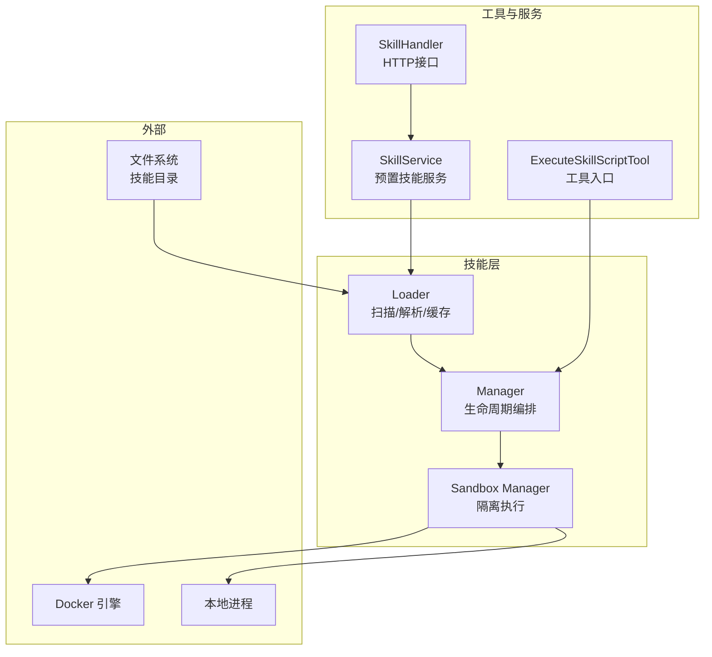
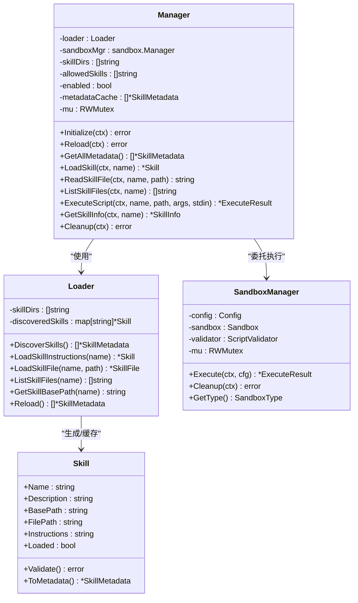
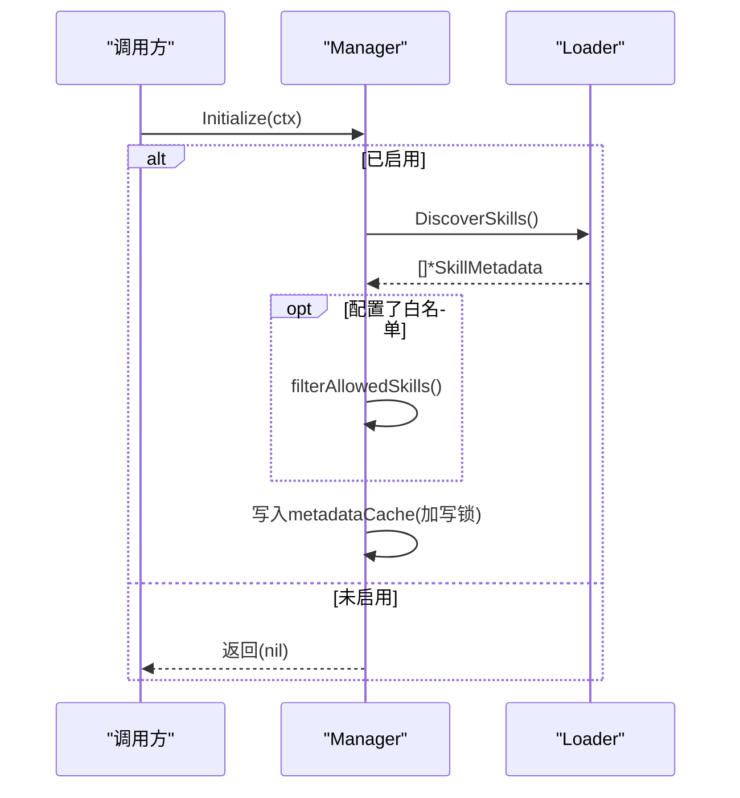
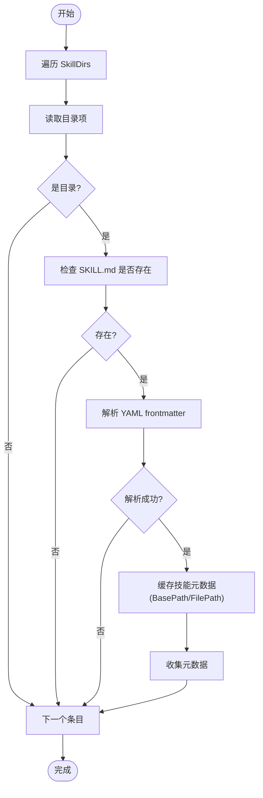
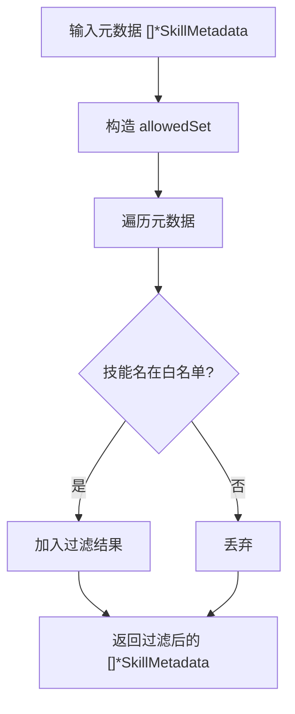
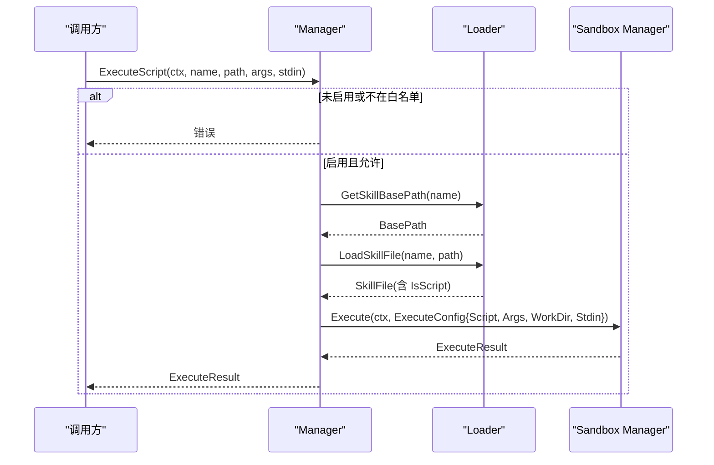
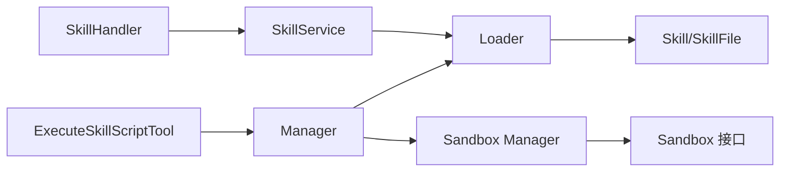

# 技能管理器

<cite>
**本文引用的文件**
- [manager.go](file://internal/agent/skills/manager.go)
- [loader.go](file://internal/agent/skills/loader.go)
- [skill.go](file://internal/agent/skills/skill.go)
- [manager.go](file://internal/sandbox/manager.go)
- [sandbox.go](file://internal/sandbox/sandbox.go)
- [skill_execute.go](file://internal/agent/tools/skill_execute.go)
- [skill_service.go](file://internal/application/service/skill_service.go)
- [skill_handler.go](file://internal/handler/skill_handler.go)
- [integration_test.go](file://internal/agent/skills/integration_test.go)
- [skills_test.go](file://internal/agent/skills/skills_test.go)
- [SKILL.md](file://examples/skills/pdf-processing/SKILL.md)
</cite>

## 目录
1. [简介](#简介)
2. [项目结构](#项目结构)
3. [核心组件](#核心组件)
4. [架构总览](#架构总览)
5. [详细组件分析](#详细组件分析)
6. [依赖关系分析](#依赖关系分析)
7. [性能考量](#性能考量)
8. [故障排查指南](#故障排查指南)
9. [结论](#结论)
10. [附录：使用指南与最佳实践](#附录使用指南与最佳实践)

## 简介
本文件为 WeKnora 技能管理器（Agent Skills）提供系统化技术文档，覆盖从技能发现、加载到脚本执行的完整生命周期管理。重点内容包括：
- ManagerConfig 配置结构与初始化流程
- 技能目录扫描机制与元数据缓存策略
- 技能白名单过滤机制与并发安全的读写锁实现
- 内存缓存管理与重新加载机制
- 技能信息获取、文件列表查询与脚本执行的安全沙箱集成
- 资源清理策略与工具链集成

## 项目结构
技能管理器位于 internal/agent/skills 目录，围绕“渐进披露”（Progressive Disclosure）模式组织能力：
- 发现与加载：Loader 负责扫描目录、解析 SKILL.md 并缓存技能元数据与内容
- 执行编排：Manager 协调 Loader 与 Sandbox，提供统一的技能生命周期接口
- 沙箱执行：sandbox 包提供 Docker/本地隔离环境与安全校验
- 工具集成：tools 中的 ExecuteSkillScriptTool 将技能脚本执行接入智能体工作流
- 业务服务：application/service/skill_service 提供预置技能的发现与检索
- 处理器：handler/skill_handler 对外暴露技能信息查询接口

图表来源
- [manager.go:11-25](file://internal/agent/skills/manager.go#L11-L25)
- [loader.go:10-26](file://internal/agent/skills/loader.go#L10-L26)
- [manager.go:44-80](file://internal/sandbox/manager.go#L44-L80)
- [skill_execute.go:50-62](file://internal/agent/tools/skill_execute.go#L50-L62)
- [skill_service.go:18-35](file://internal/application/service/skill_service.go#L18-L35)

章节来源
- [manager.go:11-49](file://internal/agent/skills/manager.go#L11-L49)
- [loader.go:28-44](file://internal/agent/skills/loader.go#L28-L44)
- [manager.go:44-80](file://internal/sandbox/manager.go#L44-L80)
- [skill_execute.go:50-62](file://internal/agent/tools/skill_execute.go#L50-L62)
- [skill_service.go:18-35](file://internal/application/service/skill_service.go#L18-L35)

## 核心组件
- Manager：技能生命周期管理器，负责初始化、元数据缓存、技能加载、文件读取、脚本执行、重新加载与资源清理
- Loader：技能发现与文件级加载器，支持按需加载指令与附加文件，内置缓存
- Skill/技能模型：定义技能元数据、指令与附加文件结构，并提供解析与验证
- Sandbox Manager：统一的沙箱执行接口，支持 Docker 与本地隔离，内置安全校验
- ExecuteSkillScriptTool：将技能脚本执行封装为工具，供智能体调用
- SkillService：业务层服务，负责预置技能目录定位与发现
- SkillHandler：对外提供技能信息查询的 HTTP 接口

章节来源
- [manager.go:11-49](file://internal/agent/skills/manager.go#L11-L49)
- [loader.go:10-26](file://internal/agent/skills/loader.go#L10-L26)
- [skill.go:32-65](file://internal/agent/skills/skill.go#L32-L65)
- [manager.go:11-41](file://internal/sandbox/manager.go#L11-L41)
- [skill_execute.go:50-62](file://internal/agent/tools/skill_execute.go#L50-L62)
- [skill_service.go:18-35](file://internal/application/service/skill_service.go#L18-L35)

## 架构总览
技能管理器采用分层与编排相结合的设计：
- Loader 负责“发现（Level 1）+ 加载指令（Level 2）+ 读取资源（Level 3）”
- Manager 在 Loader 基础上提供并发安全的缓存与白名单过滤，并协调 Sandbox 执行
- Sandbox Manager 负责选择合适的隔离后端并进行安全校验
- 工具与服务层通过 Manager 暴露统一能力

图表来源
- [manager.go:11-49](file://internal/agent/skills/manager.go#L11-L49)
- [loader.go:10-26](file://internal/agent/skills/loader.go#L10-L26)
- [skill.go:32-65](file://internal/agent/skills/skill.go#L32-L65)
- [manager.go:11-41](file://internal/sandbox/manager.go#L11-L41)

## 详细组件分析

### ManagerConfig 配置结构与初始化流程
- 配置项
  - SkillDirs：技能搜索目录列表
  - AllowedSkills：技能白名单（空表示允许全部）
  - Enabled：是否启用技能功能
- 初始化流程
  - 若未启用，跳过发现；否则调用 Loader.DiscoverSkills 获取元数据
  - 若配置了 AllowedSkills，则进行白名单过滤
  - 使用互斥锁保护，写入只读内存缓存 metadataCache
- 重新加载
  - 清空缓存后重新发现并过滤，再写回缓存
- 并发安全
  - 读多写少场景使用 RWMutex，读路径仅持读锁，写路径持写锁

图表来源
- [manager.go:56-78](file://internal/agent/skills/manager.go#L56-L78)
- [loader.go:28-44](file://internal/agent/skills/loader.go#L28-L44)

章节来源
- [manager.go:27-49](file://internal/agent/skills/manager.go#L27-L49)
- [manager.go:56-78](file://internal/agent/skills/manager.go#L56-L78)
- [manager.go:255-275](file://internal/agent/skills/manager.go#L255-L275)

### 技能目录扫描机制与元数据缓存策略
- 目录扫描
  - 遍历每个 SkillDirs 子目录，检查是否存在 SKILL.md
  - 解析 YAML frontmatter 获取技能元数据（名称、描述等）
  - 记录 BasePath 与 FilePath，便于后续加载与执行
- 缓存策略
  - Loader 维护 discoveredSkills 映射，按需加载完整技能内容
  - Manager 维护 metadataCache，用于系统提示注入与快速枚举
  - 两者均在初始化/重新加载时更新，保证一致性
- 文件系统安全
  - 列表文件时使用 filepath.Walk 并计算相对路径，避免越权访问
  - 读取附加文件时进行路径规范化与越权检测

图表来源
- [loader.go:46-104](file://internal/agent/skills/loader.go#L46-L104)

章节来源
- [loader.go:46-104](file://internal/agent/skills/loader.go#L46-L104)
- [loader.go:284-302](file://internal/agent/skills/loader.go#L284-L302)
- [loader.go:245-282](file://internal/agent/skills/loader.go#L245-L282)

### 技能白名单过滤机制
- 白名单生效时机
  - 初始化与重新加载时对元数据进行过滤
  - 所有公开方法在执行前都会再次校验技能名是否在白名单内
- 过滤实现
  - 将 AllowedSkills 构造为哈希集合，O(1) 查找
  - 仅保留存在于白名单中的技能元数据

图表来源
- [manager.go:80-98](file://internal/agent/skills/manager.go#L80-L98)

章节来源
- [manager.go:80-98](file://internal/agent/skills/manager.go#L80-L98)
- [manager.go:130-141](file://internal/agent/skills/manager.go#L130-L141)

### 并发安全的读写锁实现与内存缓存管理
- 读写分离
  - Manager 的元数据缓存使用 sync.RWMutex
  - 读操作（GetAllMetadata）仅持读锁并返回副本，避免外部修改
  - 写操作（Initialize/Reload）持写锁，确保原子替换
- Loader 缓存
  - discoveredSkills 为内存映射，按需加载技能内容
  - 重新加载时清空映射并重建
- 适用场景
  - 高并发场景下，读多写少，减少锁竞争

章节来源
- [manager.go:22-24](file://internal/agent/skills/manager.go#L22-L24)
- [manager.go:100-114](file://internal/agent/skills/manager.go#L100-L114)
- [loader.go:304-308](file://internal/agent/skills/loader.go#L304-L308)

### 技能信息获取、文件列表查询与脚本执行
- 技能信息获取
  - 通过 LoadSkillInstructions 获取完整技能内容，再结合 ListSkillFiles 返回文件清单
- 文件列表查询
  - 使用 filepath.Walk 遍历技能目录，返回相对路径列表
- 脚本执行
  - 通过 ExecuteScript 构造 sandbox.ExecuteConfig，传入脚本绝对路径、工作目录、参数与 stdin
  - 执行前进行白名单校验与安全校验（由 Sandbox Manager 完成）

图表来源
- [manager.go:174-215](file://internal/agent/skills/manager.go#L174-L215)
- [loader.go:290-302](file://internal/agent/skills/loader.go#L290-L302)
- [manager.go:82-111](file://internal/sandbox/manager.go#L82-L111)

章节来源
- [manager.go:174-215](file://internal/agent/skills/manager.go#L174-L215)
- [loader.go:245-282](file://internal/agent/skills/loader.go#L245-L282)
- [manager.go:82-111](file://internal/sandbox/manager.go#L82-L111)

### 安全沙箱集成与脚本执行
- 沙箱类型
  - 支持 docker、local、disabled 三种类型
  - 可配置默认超时、内存/CPU 限制、允许命令列表、网络访问等
- 安全校验
  - 执行前对脚本内容、参数、stdin 进行校验，防止注入攻击
  - 不可执行脚本会被拒绝
- 执行结果
  - 返回标准输出、标准错误、退出码、耗时、是否被终止等

章节来源
- [sandbox.go:11-73](file://internal/sandbox/sandbox.go#L11-L73)
- [manager.go:44-80](file://internal/sandbox/manager.go#L44-L80)
- [manager.go:113-174](file://internal/sandbox/manager.go#L113-L174)

### 工具链与业务服务集成
- ExecuteSkillScriptTool
  - 将技能脚本执行封装为工具，支持参数与 stdin 输入
  - 调用 Manager.ExecuteScript 完成执行
- SkillService
  - 自动定位预置技能目录（优先环境变量 WEKNORA_SKILLS_DIR，其次可执行文件所在目录，最后当前工作目录）
  - 提供 ListPreloadedSkills 与 GetSkillByName
- SkillHandler
  - 提供 HTTP 接口列出预置技能元数据

章节来源
- [skill_execute.go:50-62](file://internal/agent/tools/skill_execute.go#L50-L62)
- [skill_execute.go:64-105](file://internal/agent/tools/skill_execute.go#L64-L105)
- [skill_service.go:37-65](file://internal/application/service/skill_service.go#L37-L65)
- [skill_service.go:94-112](file://internal/application/service/skill_service.go#L94-L112)
- [skill_handler.go:31-47](file://internal/handler/skill_handler.go#L31-L47)

## 依赖关系分析
- Manager 依赖 Loader 与 Sandbox Manager
- Loader 依赖文件系统与技能模型解析
- Sandbox Manager 依赖 Docker 或本地执行后端
- 工具与服务层通过 Manager 暴露能力
- 无循环依赖，耦合清晰

图表来源
- [manager.go:11-49](file://internal/agent/skills/manager.go#L11-L49)
- [loader.go:10-26](file://internal/agent/skills/loader.go#L10-L26)
- [manager.go:11-41](file://internal/sandbox/manager.go#L11-L41)
- [skill_execute.go:50-62](file://internal/agent/tools/skill_execute.go#L50-L62)
- [skill_service.go:18-35](file://internal/application/service/skill_service.go#L18-L35)
- [skill_handler.go:13-23](file://internal/handler/skill_handler.go#L13-L23)

章节来源
- [manager.go:11-49](file://internal/agent/skills/manager.go#L11-L49)
- [loader.go:10-26](file://internal/agent/skills/loader.go#L10-L26)
- [manager.go:11-41](file://internal/sandbox/manager.go#L11-L41)
- [skill_execute.go:50-62](file://internal/agent/tools/skill_execute.go#L50-L62)
- [skill_service.go:18-35](file://internal/application/service/skill_service.go#L18-L35)
- [skill_handler.go:13-23](file://internal/handler/skill_handler.go#L13-L23)

## 性能考量
- 渐进披露降低内存占用：仅在需要时加载技能指令与附加文件
- 缓存命中优化：Loader 与 Manager 的缓存避免重复磁盘 IO 与解析
- 并发读取：RWMutex 使读操作无阻塞，适合高并发场景
- I/O 优化：文件列表使用一次遍历，避免多次 stat
- 沙箱预热：Docker 类型沙箱在初始化阶段异步拉取镜像，减少首次执行延迟

## 故障排查指南
- 技能未发现
  - 检查 SkillDirs 是否正确，目录是否存在且包含 SKILL.md
  - 确认目录权限与文件编码
- 技能不可用
  - 确认 Enabled=true 且 AllowedSkills 包含该技能名
- 执行失败
  - 查看 ExecuteResult 的 ExitCode、Stderr、Error 字段
  - 检查脚本是否为可执行脚本（IsScript），路径是否在技能目录内
- 安全拦截
  - 若返回安全校验错误，检查脚本内容、参数与 stdin 是否符合白名单与规则
- 目录越权
  - LoadSkillFile 会拒绝相对路径穿越与绝对路径访问

章节来源
- [manager.go:174-215](file://internal/agent/skills/manager.go#L174-L215)
- [manager.go:113-174](file://internal/sandbox/manager.go#L113-L174)
- [loader.go:194-243](file://internal/agent/skills/loader.go#L194-L243)

## 结论
WeKnora 技能管理器以 Loader/Manager/Sandbox 分层架构为核心，遵循渐进披露与最小权限原则，结合白名单与安全校验，提供了稳定、可扩展且安全的技能生命周期管理能力。通过内存缓存与并发读写锁，满足高并发场景下的性能需求；通过工具与服务层集成，无缝接入智能体工作流与外部接口。

## 附录：使用指南与最佳实践
- 初始化
  - 构造 ManagerConfig，设置 SkillDirs、AllowedSkills、Enabled
  - 调用 Manager.Initialize 完成发现与缓存
- 日常使用
  - 使用 GetAllMetadata 获取系统提示注入所需的技能元数据
  - 需要时调用 LoadSkill 获取完整指令，再根据需要读取附加文件
  - 执行脚本时通过 ExecuteScript 传入参数与 stdin
- 最佳实践
  - 将技能目录放置于受控位置，避免敏感文件泄露
  - 合理配置 AllowedSkills，仅开放必要技能
  - 为脚本设置合理的超时与资源限制
  - 定期调用 Reload 以刷新缓存（如技能目录动态变更）
  - 使用工具 ExecuteSkillScriptTool 时，尽量通过参数传递而非 stdin，避免大块数据
- 示例参考
  - 预置技能示例：examples/skills/pdf-processing/SKILL.md
  - 集成测试：integration_test.go 展示了从发现到执行的完整流程

章节来源
- [integration_test.go:92-154](file://internal/agent/skills/integration_test.go#L92-L154)
- [SKILL.md:1-41](file://examples/skills/pdf-processing/SKILL.md#L1-L41)
- [manager.go:255-275](file://internal/agent/skills/manager.go#L255-L275)
- [skill_execute.go:17-40](file://internal/agent/tools/skill_execute.go#L17-L40)