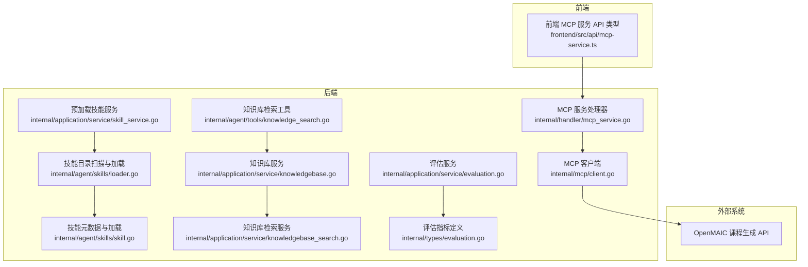
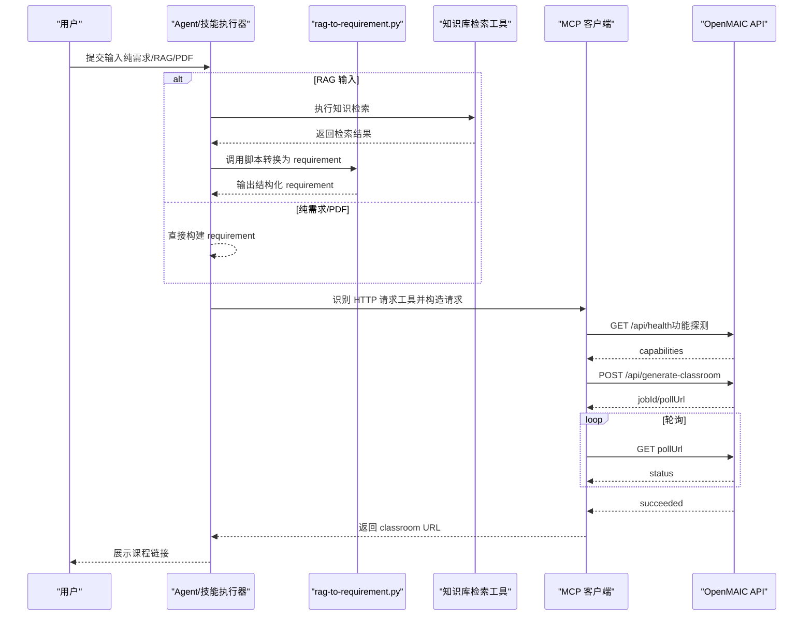
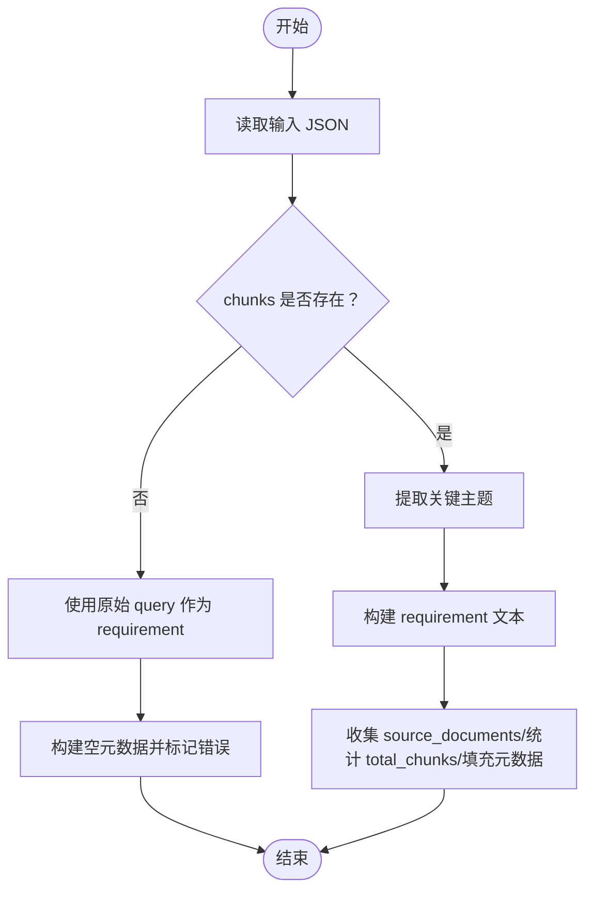
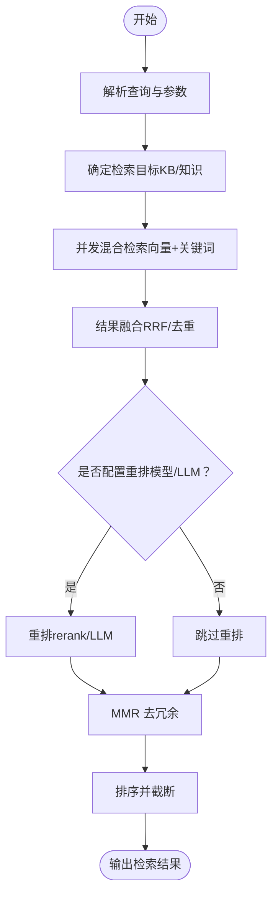
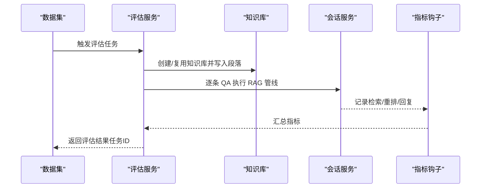
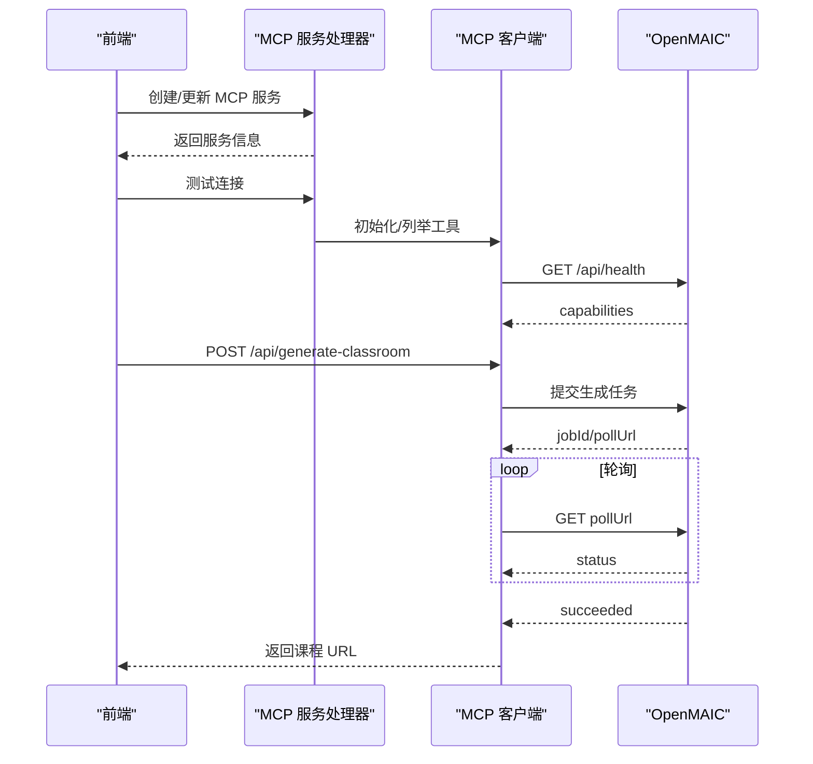
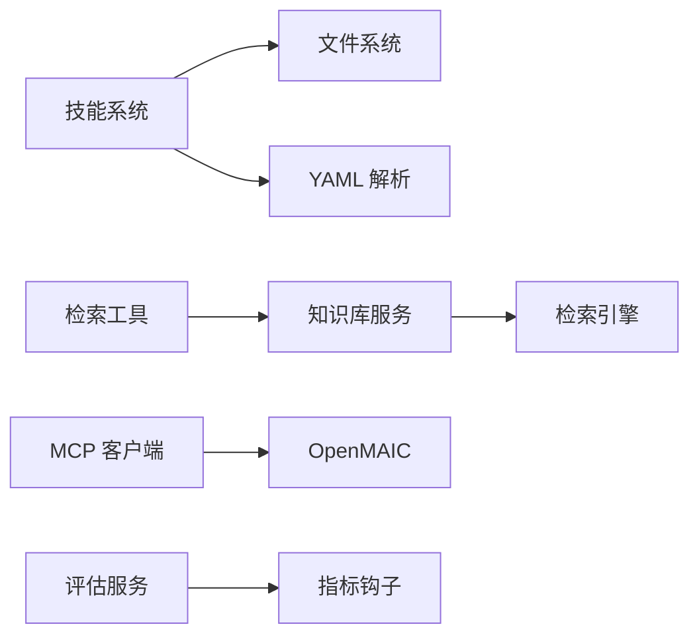

# 开源课堂技能

<cite>
**本文引用的文件**
- [rag-to-requirement.py](file://skills/预加载/openmaic-classroom/scripts/rag-to-requirement.py)
- [openmaic-classroom 技能说明](file://skills/预加载/openmaic-classroom/SKILL.md)
- [OpenMAIC API 参考](file://skills/预加载/openmaic-classroom/references/api-reference.md)
- [技能元数据与加载](file://internal/agent/skills/skill.go)
- [技能目录扫描与加载](file://internal/agent/skills/loader.go)
- [预加载技能服务](file://internal/application/service/skill_service.go)
- [知识库检索工具](file://internal/agent/tools/knowledge_search.go)
- [知识库服务](file://internal/application/service/knowledgebase.go)
- [知识库检索服务](file://internal/application/service/knowledgebase_search.go)
- [MCP 客户端](file://internal/mcp/client.go)
- [MCP 服务处理器](file://internal/handler/mcp_service.go)
- [前端 MCP 服务 API 类型](file://frontend/src/api/mcp-service.ts)
- [评估服务](file://internal/application/service/evaluation.go)
- [评估指标定义](file://internal/types/evaluation.go)
- [Swagger 评估接口](file://docs/swagger.json)
</cite>

## 目录
1. [简介](#简介)
2. [项目结构](#项目结构)
3. [核心组件](#核心组件)
4. [架构总览](#架构总览)
5. [详细组件分析](#详细组件分析)
6. [依赖分析](#依赖分析)
7. [性能考虑](#性能考虑)
8. [故障排查指南](#故障排查指南)
9. [结论](#结论)
10. [附录](#附录)

## 简介
本技术文档围绕 WeKnora 的“开源课堂技能”展开，聚焦其智能教学辅助能力与实现架构，包括：
- RAG 到需求的转换算法（rag-to-requirement.py）
- 教学资源推荐机制（基于知识库检索与重排）
- 学习路径规划（多文档课程集生成思路）
- 智能问答系统（RAG 管线与评估）

文档同时提供 API 参考、集成方式、部署指南、使用示例与扩展建议，帮助教育工作者与学习者高效利用该智能化教学工具。

## 项目结构
WeKnora 采用模块化分层设计：
- 前端：提供 MCP 服务管理与调用界面
- 后端：Agent 技能系统、知识库检索、RAG 管线、评估与指标
- 外部集成：MCP 服务（HTTP/SSE）、OpenMAIC 课程生成 API

图表来源
- [技能元数据与加载:1-219](file://internal/agent/skills/skill.go#L1-L219)
- [技能目录扫描与加载:1-309](file://internal/agent/skills/loader.go#L1-L309)
- [预加载技能服务:1-136](file://internal/application/service/skill_service.go#L1-L136)
- [知识库检索工具:1-800](file://internal/agent/tools/knowledge_search.go#L1-L800)
- [知识库服务:1-639](file://internal/application/service/knowledgebase.go#L1-L639)
- [知识库检索服务:95-187](file://internal/application/service/knowledgebase_search.go#L95-L187)
- [MCP 客户端:1-379](file://internal/mcp/client.go#L1-L379)
- [MCP 服务处理器:1-448](file://internal/handler/mcp_service.go#L1-L448)
- [前端 MCP 服务 API 类型:1-104](file://frontend/src/api/mcp-service.ts#L1-L104)
- [评估服务:1-477](file://internal/application/service/evaluation.go#L1-L477)
- [评估指标定义:35-70](file://internal/types/evaluation.go#L35-L70)

章节来源
- [技能元数据与加载:1-219](file://internal/agent/skills/skill.go#L1-L219)
- [技能目录扫描与加载:1-309](file://internal/agent/skills/loader.go#L1-L309)
- [预加载技能服务:1-136](file://internal/application/service/skill_service.go#L1-L136)
- [知识库检索工具:1-800](file://internal/agent/tools/knowledge_search.go#L1-L800)
- [知识库服务:1-639](file://internal/application/service/knowledgebase.go#L1-L639)
- [知识库检索服务:95-187](file://internal/application/service/knowledgebase_search.go#L95-L187)
- [MCP 客户端:1-379](file://internal/mcp/client.go#L1-L379)
- [MCP 服务处理器:1-448](file://internal/handler/mcp_service.go#L1-L448)
- [前端 MCP 服务 API 类型:1-104](file://frontend/src/api/mcp-service.ts#L1-L104)
- [评估服务:1-477](file://internal/application/service/evaluation.go#L1-L477)
- [评估指标定义:35-70](file://internal/types/evaluation.go#L35-L70)

## 核心组件
- 技能系统：负责发现、加载与缓存技能（含 SKILL.md 解析、脚本文件加载）
- 检索工具：语义/向量化检索、关键词检索、重排与多样性控制
- MCP 集成：统一的外部服务接入（HTTP/SSE），用于调用 OpenMAIC 等第三方 API
- 评估体系：对检索与生成质量进行指标化评估与可视化

章节来源
- [技能元数据与加载:1-219](file://internal/agent/skills/skill.go#L1-L219)
- [技能目录扫描与加载:1-309](file://internal/agent/skills/loader.go#L1-L309)
- [预加载技能服务:1-136](file://internal/application/service/skill_service.go#L1-L136)
- [知识库检索工具:1-800](file://internal/agent/tools/knowledge_search.go#L1-L800)
- [MCP 客户端:1-379](file://internal/mcp/client.go#L1-L379)
- [评估服务:1-477](file://internal/application/service/evaluation.go#L1-L477)

## 架构总览
WeKnora 的“开源课堂技能”通过以下链路实现教学辅助：
- 输入来源：纯需求、RAG 检索结果、PDF 文档
- 需求转换：RAG 结果 → 结构化 requirement（脚本）
- 生成请求：构建 OpenMAIC 生成请求（含可选功能开关）
- 任务调度：通过 MCP 工具调用 OpenMAIC API，支持健康检查与功能探测
- 结果查询：轮询任务状态，获取课程链接
- 评估反馈：对检索与问答质量进行指标化评估

图表来源
- [openmaic-classroom 技能说明:66-242](file://skills/预加载/openmaic-classroom/SKILL.md#L66-L242)
- [OpenMAIC API 参考:36-150](file://skills/预加载/openmaic-classroom/references/api-reference.md#L36-L150)
- [MCP 客户端:198-327](file://internal/mcp/client.go#L198-L327)
- [知识库检索工具:161-429](file://internal/agent/tools/knowledge_search.go#L161-L429)

章节来源
- [openmaic-classroom 技能说明:66-242](file://skills/预加载/openmaic-classroom/SKILL.md#L66-L242)
- [OpenMAIC API 参考:36-150](file://skills/预加载/openmaic-classroom/references/api-reference.md#L36-L150)
- [MCP 客户端:198-327](file://internal/mcp/client.go#L198-L327)
- [知识库检索工具:161-429](file://internal/agent/tools/knowledge_search.go#L161-L429)

## 详细组件分析

### 组件 A：RAG 到需求转换（rag-to-requirement.py）
- 功能定位：将 RAG 检索结果转换为 OpenMAIC 课程生成所需的结构化 requirement，并附带元数据（来源文档、受众、难度、语言等）
- 输入输出：
  - 输入：chunks 数组（包含 document_name、content、metadata）、可选 query/audience/depth/language/focus_areas
  - 输出：requirement 字符串 + metadata（source_documents、total_chunks、audience、depth、language）
- 关键逻辑：
  - 主题抽取：优先从 metadata 的 section/chapter/heading/title 提取；不足时从内容前缀提取
  - requirement 构建：拼接“为谁+难度+内容来源+核心主题+重点覆盖+语言要求”
  - 边界处理：当 chunks 为空时，回退为使用原始 query 作为 requirement，并返回错误提示

图表来源
- [rag-to-requirement.py:46-157](file://skills/预加载/openmaic-classroom/scripts/rag-to-requirement.py#L46-L157)

章节来源
- [rag-to-requirement.py:1-195](file://skills/预加载/openmaic-classroom/scripts/rag-to-requirement.py#L1-L195)

### 组件 B：教学资源推荐机制（知识库检索与重排）
- 能力范围：语义检索、关键词检索、混合融合（RRF）、去重、重排（rerank/LLM）、多样性控制（MMR）
- 关键参数：
  - topK、向量阈值、关键词阈值、最小分数
  - 支持按知识库过滤、跨知识库合并检索
- 输出：去重、重排后的检索结果，便于后续 requirement 构建与课程生成

图表来源
- [知识库检索工具:455-627](file://internal/agent/tools/knowledge_search.go#L455-L627)
- [知识库检索服务:95-187](file://internal/application/service/knowledgebase_search.go#L95-L187)

章节来源
- [知识库检索工具:1-800](file://internal/agent/tools/knowledge_search.go#L1-L800)
- [知识库检索服务:95-187](file://internal/application/service/knowledgebase_search.go#L95-L187)

### 组件 C：智能问答系统（RAG 管线与评估）
- 管线组成：检索 → 重排 → 生成 → 总结（可选）
- 评估指标：检索精度/召回/NDCG@3；生成质量指标（由外部数据集驱动）
- 评估流程：后台异步执行，记录每个 QA 对的检索、重排、对话响应，汇总指标并暴露查询接口

图表来源
- [评估服务:128-456](file://internal/application/service/evaluation.go#L128-L456)
- [评估指标定义:35-70](file://internal/types/evaluation.go#L35-L70)
- [Swagger 评估接口:1762-1802](file://docs/swagger.json#L1762-L1802)

章节来源
- [评估服务:1-477](file://internal/application/service/evaluation.go#L1-L477)
- [评估指标定义:35-70](file://internal/types/evaluation.go#L35-L70)
- [Swagger 评估接口:1762-1802](file://docs/swagger.json#L1762-L1802)

### 组件 D：OpenMAIC 课程生成集成（MCP 工具）
- MCP 服务注册与测试：通过后端 API 管理 MCP 服务（SSE/HTTP Streamable），并支持工具与资源列举
- 调用流程：识别 HTTP 请求工具 → 健康检查与功能探测 → 发送生成请求 → 轮询状态 → 返回课程链接
- 安全与限制：禁止 stdio 传输；支持超时与重试配置；容器内沙箱默认禁用网络访问，需通过 MCP 工具调用

图表来源
- [MCP 服务处理器:27-375](file://internal/handler/mcp_service.go#L27-L375)
- [MCP 客户端:62-327](file://internal/mcp/client.go#L62-L327)
- [OpenMAIC API 参考:36-150](file://skills/预加载/openmaic-classroom/references/api-reference.md#L36-L150)
- [前端 MCP 服务 API 类型:1-104](file://frontend/src/api/mcp-service.ts#L1-L104)

章节来源
- [MCP 服务处理器:1-448](file://internal/handler/mcp_service.go#L1-L448)
- [MCP 客户端:1-379](file://internal/mcp/client.go#L1-L379)
- [OpenMAIC API 参考:1-266](file://skills/预加载/openmaic-classroom/references/api-reference.md#L1-L266)
- [前端 MCP 服务 API 类型:1-104](file://frontend/src/api/mcp-service.ts#L1-L104)

## 依赖分析
- 技能系统依赖文件系统扫描与 YAML 解析，支持脚本文件安全加载与路径校验
- 检索工具依赖知识库服务与检索引擎，支持并发检索与结果融合
- MCP 集成依赖统一客户端封装，支持 SSE/HTTP Streamable 传输与会话失效处理
- 评估体系依赖指标钩子与并发执行框架，保障大规模数据集评估效率

图表来源
- [技能目录扫描与加载:194-243](file://internal/agent/skills/loader.go#L194-L243)
- [知识库检索工具:455-627](file://internal/agent/tools/knowledge_search.go#L455-L627)
- [MCP 客户端:95-135](file://internal/mcp/client.go#L95-L135)
- [评估服务:380-456](file://internal/application/service/evaluation.go#L380-L456)

章节来源
- [技能目录扫描与加载:194-243](file://internal/agent/skills/loader.go#L194-L243)
- [知识库检索工具:455-627](file://internal/agent/tools/knowledge_search.go#L455-L627)
- [MCP 客户端:95-135](file://internal/mcp/client.go#L95-L135)
- [评估服务:380-456](file://internal/application/service/evaluation.go#L380-L456)

## 性能考虑
- 检索阶段：使用并发检索与融合策略，合理设置 topK 与阈值，避免过度打分导致的计算开销
- 重排阶段：优先使用 rerank 模型，必要时回退至 LLM 重排；批量处理以降低 token 消耗
- 评估阶段：限制并发 worker 数量，避免 CPU/IO 抢占；及时清理临时知识库与知识条目
- MCP 调用：配置合理的超时与重试，避免长连接阻塞；对会话失效进行自动重连

## 故障排查指南
- MCP 服务不可用
  - 现象：无法识别 HTTP 请求工具或连接失败
  - 处理：检查 MCP 服务配置（URL/Headers/Auth/Advanced），确保传输类型为 SSE/HTTP Streamable；通过测试接口验证连通性
- OpenMAIC API 错误
  - 连接失败：检查 Base URL 与网络可达性；托管模式需携带 Authorization
  - 401/403：核对访问码与配额；本地模式无需认证
  - 500：服务端异常，稍后重试或切换模式
- 课程生成长时间排队
  - 规则：提交后仅查询一次，用户再次查询时也仅查询一次；仅在 succeeded/failed 时继续
- 评估任务异常
  - 现象：任务状态失败或指标缺失
  - 处理：查看任务 ID 对应的评估详情，确认数据集、知识库与模型配置

章节来源
- [openmaic-classroom 技能说明:244-272](file://skills/预加载/openmaic-classroom/SKILL.md#L244-L272)
- [MCP 服务处理器:332-375](file://internal/handler/mcp_service.go#L332-L375)
- [MCP 客户端:143-161](file://internal/mcp/client.go#L143-L161)
- [评估服务:102-126](file://internal/application/service/evaluation.go#L102-L126)

## 结论
WeKnora 的“开源课堂技能”通过标准化的技能加载、强大的知识库检索与重排、可靠的 MCP 集成以及完善的评估体系，实现了从 RAG 到课程生成的完整闭环。rag-to-requirement.py 作为需求转换的关键环节，确保了输入质量与生成一致性；OpenMAIC 的异步任务与功能探测机制提供了灵活的外部能力扩展；评估体系则为持续优化提供了数据支撑。

## 附录

### API 参考（OpenMAIC）
- 健康检查：GET /api/health（返回 capabilities）
- 生成课程：POST /api/generate-classroom（返回 jobId/pollUrl）
- 轮询状态：GET pollUrl（返回 status/progress/result）
- 解析 PDF：POST /api/parse-pdf（multipart/form-data）
- Web 搜索：POST /api/web-search
- 验证 LLM 连接：POST /api/verify-model

章节来源
- [OpenMAIC API 参考:1-266](file://skills/预加载/openmaic-classroom/references/api-reference.md#L1-L266)

### 集成方式（MCP）
- 前端：通过前端 API 类型定义与后端接口交互，管理 MCP 服务、测试连接、列举工具与资源
- 后端：MCP 服务处理器提供 CRUD 与测试接口；MCP 客户端封装初始化、列举工具、调用工具与读取资源

章节来源
- [前端 MCP 服务 API 类型:1-104](file://frontend/src/api/mcp-service.ts#L1-L104)
- [MCP 服务处理器:27-448](file://internal/handler/mcp_service.go#L27-L448)
- [MCP 客户端:19-47](file://internal/mcp/client.go#L19-L47)

### 使用示例（RAG → 课程）
- 步骤
  1) 使用知识库检索工具获取 chunks
  2) 调用 rag-to-requirement.py 将 chunks 转换为 requirement
  3) 通过 MCP 工具调用 OpenMAIC API 提交生成任务
  4) 轮询状态，获取课程链接

章节来源
- [openmaic-classroom 技能说明:66-242](file://skills/预加载/openmaic-classroom/SKILL.md#L66-L242)
- [rag-to-requirement.py:160-195](file://skills/预加载/openmaic-classroom/scripts/rag-to-requirement.py#L160-L195)

### 部署指南（要点）
- MCP 服务
  - 通过后端接口创建/更新 MCP 服务，选择 SSE/HTTP Streamable 传输
  - 配置 URL、Headers、认证信息与高级参数（超时/重试）
  - 使用测试接口验证连通性与工具列表
- OpenMAIC
  - 选择托管模式（open.maic.chat）或本地模式（自建实例）
  - 本地模式需将 localhost/127.0.0.1 替换为 host.docker.internal
  - 提交前先查询 /api/health 并根据 capabilities 设置可选功能

章节来源
- [openmaic-classroom 技能说明:22-198](file://skills/预加载/openmaic-classroom/SKILL.md#L22-L198)
- [MCP 服务处理器:27-110](file://internal/handler/mcp_service.go#L27-L110)
- [MCP 客户端:95-135](file://internal/mcp/client.go#L95-L135)

### 扩展开发建议
- 自定义技能：遵循 SKILL.md 前言与正文结构，提供脚本与资源文件，放置于 skills/预加载/<skill-name> 目录
- 新增检索策略：在检索工具中扩展融合/重排策略，提升检索质量
- MCP 服务扩展：新增第三方服务时，优先采用 SSE/HTTP Streamable 传输，确保安全性与稳定性
- 评估体系：结合业务场景扩展评估指标，完善自动化评估流程

章节来源
- [技能元数据与加载:111-183](file://internal/agent/skills/skill.go#L111-L183)
- [技能目录扫描与加载:194-243](file://internal/agent/skills/loader.go#L194-L243)
- [知识库检索工具:629-713](file://internal/agent/tools/knowledge_search.go#L629-L713)
- [MCP 客户端:95-135](file://internal/mcp/client.go#L95-L135)
- [评估服务:380-456](file://internal/application/service/evaluation.go#L380-L456)