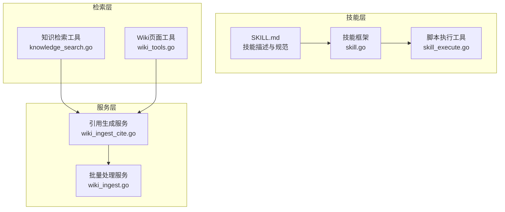
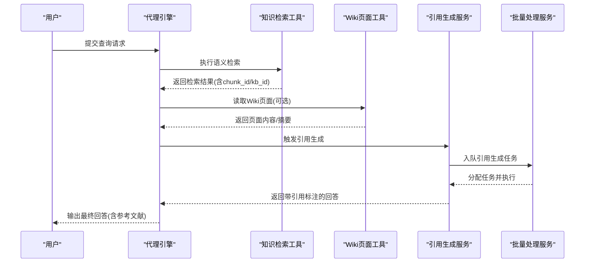
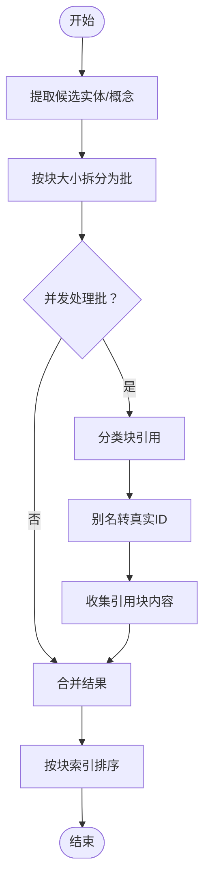
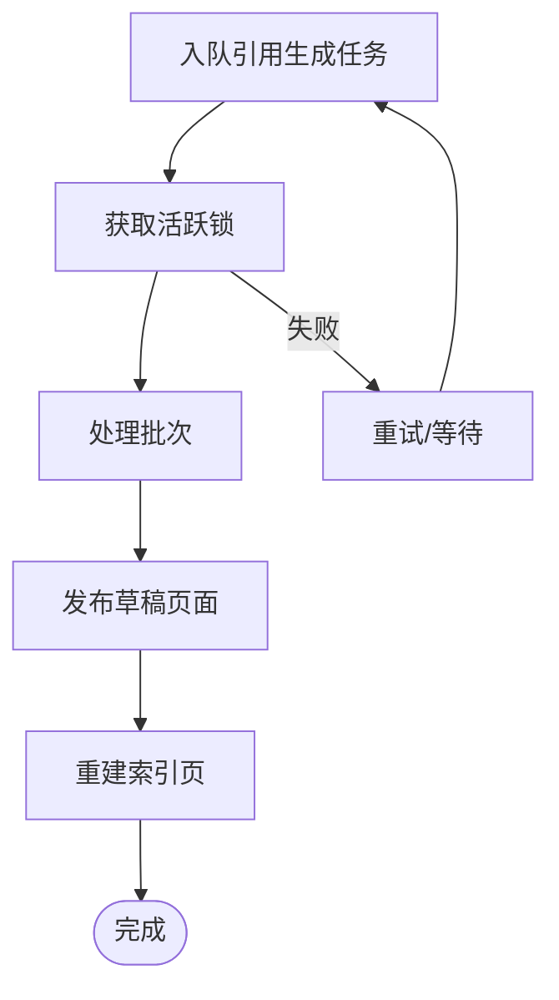
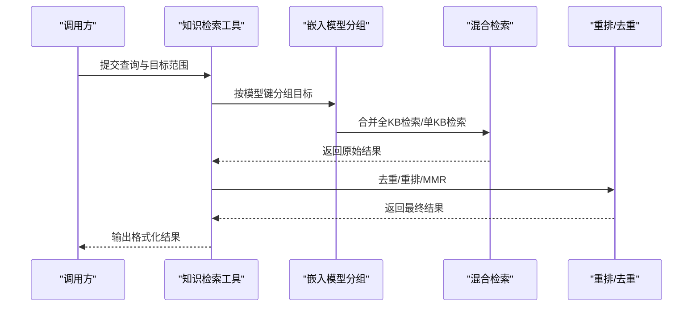
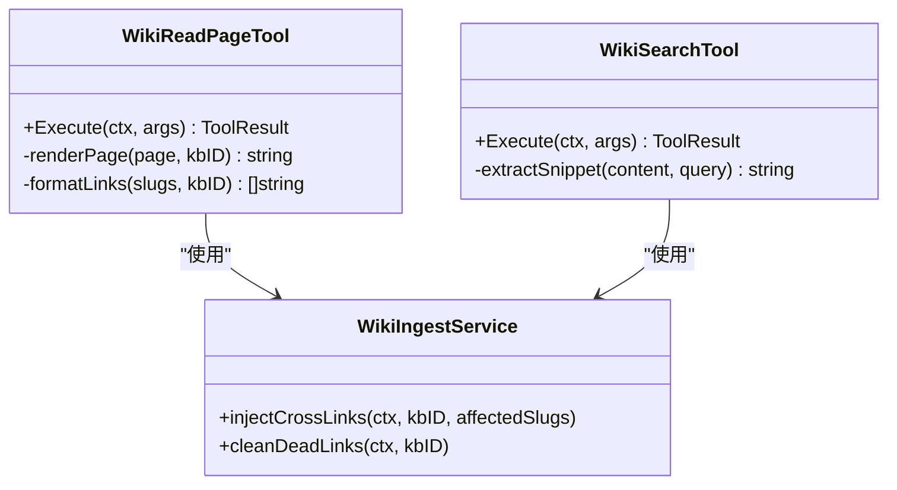
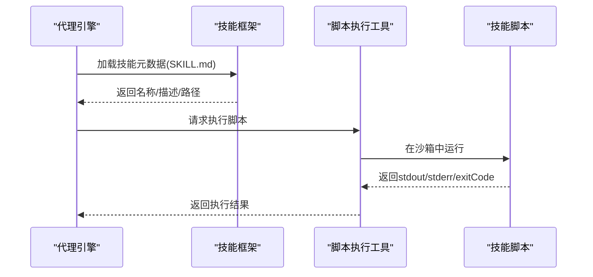
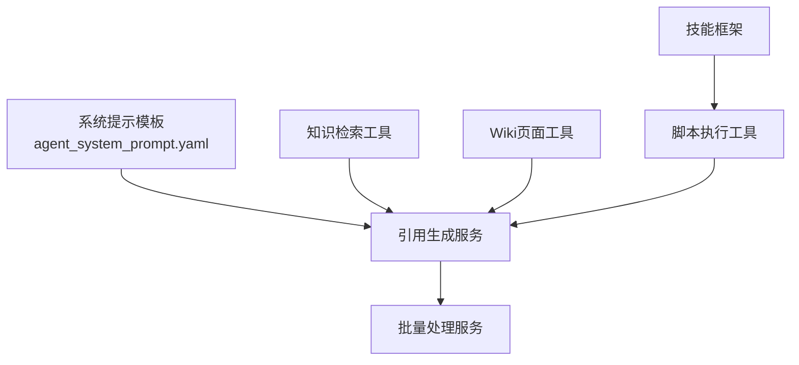

# 引用生成器技能

<cite>
**本文档引用的文件**
- [SKILL.md](file://skills/preloaded/citation-generator/SKILL.md)
- [wiki_ingest_cite.go](file://internal/application/service/wiki_ingest_cite.go)
- [wiki_ingest.go](file://internal/application/service/wiki_ingest.go)
- [wiki_tools.go](file://internal/agent/tools/wiki_tools.go)
- [knowledge_search.go](file://internal/agent/tools/knowledge_search.go)
- [skill.go](file://internal/agent/skills/skill.go)
- [skill_execute.go](file://internal/agent/tools/skill_execute.go)
- [agent_system_prompt.yaml](file://config/prompt_templates/agent_system_prompt.yaml)
</cite>

## 目录
1. [简介](#简介)
2. [项目结构](#项目结构)
3. [核心组件](#核心组件)
4. [架构总览](#架构总览)
5. [详细组件分析](#详细组件分析)
6. [依赖关系分析](#依赖关系分析)
7. [性能考虑](#性能考虑)
8. [故障排除指南](#故障排除指南)
9. [结论](#结论)
10. [附录](#附录)

## 简介
本文件为 WeKnora 引用生成器技能的技术文档，面向开发者与集成者，系统性阐述该技能的架构设计、数据流、处理逻辑与扩展方式。引用生成器技能的核心目标是：基于检索到的知识库内容，自动生成规范的学术引用格式，并在回答末尾生成参考文献列表。技能支持多种引用格式（如简化格式、APA 等），并提供来源标注与参考文献清单的自动化生成。

## 项目结构
引用生成器技能位于预加载技能目录中，其核心由三部分组成：
- 技能描述与使用规范：位于技能目录的 SKILL.md 文件，定义了技能的能力边界、引用格式与使用指南。
- 检索与引用生成流程：通过知识检索工具与 Wiki 页面工具，结合引用生成提示模板，完成引用标注与参考文献生成。
- 技能框架与脚本执行：技能框架负责解析技能元数据与资源，脚本执行工具提供沙箱化脚本运行能力（若技能包含脚本资源）。

**图表来源**
- [SKILL.md:1-59](file://skills/preloaded/citation-generator/SKILL.md#L1-L59)
- [skill.go:1-219](file://internal/agent/skills/skill.go#L1-L219)
- [skill_execute.go:1-191](file://internal/agent/tools/skill_execute.go#L1-L191)
- [knowledge_search.go:1-800](file://internal/agent/tools/knowledge_search.go#L1-L800)
- [wiki_tools.go:1-716](file://internal/agent/tools/wiki_tools.go#L1-L716)
- [wiki_ingest_cite.go:1-567](file://internal/application/service/wiki_ingest_cite.go#L1-L567)
- [wiki_ingest.go:1-800](file://internal/application/service/wiki_ingest.go#L1-L800)

**章节来源**
- [SKILL.md:1-59](file://skills/preloaded/citation-generator/SKILL.md#L1-L59)
- [skill.go:1-219](file://internal/agent/skills/skill.go#L1-L219)
- [skill_execute.go:1-191](file://internal/agent/tools/skill_execute.go#L1-L191)
- [knowledge_search.go:1-800](file://internal/agent/tools/knowledge_search.go#L1-L800)
- [wiki_tools.go:1-716](file://internal/agent/tools/wiki_tools.go#L1-L716)
- [wiki_ingest_cite.go:1-567](file://internal/application/service/wiki_ingest_cite.go#L1-L567)
- [wiki_ingest.go:1-800](file://internal/application/service/wiki_ingest.go#L1-L800)

## 核心组件
- 技能描述与规范：定义技能名称、描述、核心能力与引用格式规范，明确简化格式与 APA 格式的使用场景与输出结构。
- 知识检索工具：提供语义/向量检索能力，返回与查询语义相关的内容块，支持多 KB 并行检索与重排。
- Wiki 页面工具：提供 Wiki 页面读取与搜索能力，支持正则表达式检索与链接注入，便于在回答中进行来源标注。
- 引用生成服务：对检索结果进行批处理与并行化处理，按块级引用规则生成引用标注，并汇总参考文献列表。
- 批量处理服务：协调引用生成任务的队列、锁与重试机制，确保并发安全与任务幂等。
- 技能框架与脚本执行：解析技能元数据，加载技能资源，提供沙箱化脚本执行能力（若技能包含脚本）。

**章节来源**
- [SKILL.md:1-59](file://skills/preloaded/citation-generator/SKILL.md#L1-L59)
- [knowledge_search.go:1-800](file://internal/agent/tools/knowledge_search.go#L1-L800)
- [wiki_tools.go:1-716](file://internal/agent/tools/wiki_tools.go#L1-L716)
- [wiki_ingest_cite.go:1-567](file://internal/application/service/wiki_ingest_cite.go#L1-L567)
- [wiki_ingest.go:1-800](file://internal/application/service/wiki_ingest.go#L1-L800)
- [skill.go:1-219](file://internal/agent/skills/skill.go#L1-L219)
- [skill_execute.go:1-191](file://internal/agent/tools/skill_execute.go#L1-L191)

## 架构总览
引用生成器技能的执行流程围绕“检索—引用标注—参考文献生成”展开。系统通过知识检索工具获取与查询语义相关的文本块，再通过 Wiki 页面工具补充概念/实体层面的信息，随后由引用生成服务对每个检索块进行引用标注，并在回答末尾生成参考文献列表。

**图表来源**
- [knowledge_search.go:161-429](file://internal/agent/tools/knowledge_search.go#L161-L429)
- [wiki_tools.go:201-418](file://internal/agent/tools/wiki_tools.go#L201-L418)
- [wiki_ingest_cite.go:276-381](file://internal/application/service/wiki_ingest_cite.go#L276-L381)
- [wiki_ingest.go:268-273](file://internal/application/service/wiki_ingest.go#L268-L273)

## 详细组件分析

### 组件A：引用生成服务（wiki_ingest_cite.go）
该组件负责将检索到的块级内容与候选实体/概念进行匹配，生成引用标注与参考文献列表。关键特性包括：
- 候选实体/概念提取：从文档内容中抽取实体与概念，去重并生成 slug。
- 块级引用分类：将文档块按候选实体/概念进行分类，记录每个实体/概念引用的块 ID 列表。
- 引用块批处理：按最大字符预算拆分为多个批，限制并发度，避免超出上下文长度。
- 结果合并与排序：按块索引顺序稳定排序，合并跨批结果，生成最终引用映射。

**图表来源**
- [wiki_ingest_cite.go:71-131](file://internal/application/service/wiki_ingest_cite.go#L71-L131)
- [wiki_ingest_cite.go:147-216](file://internal/application/service/wiki_ingest_cite.go#L147-L216)
- [wiki_ingest_cite.go:276-381](file://internal/application/service/wiki_ingest_cite.go#L276-L381)
- [wiki_ingest_cite.go:445-461](file://internal/application/service/wiki_ingest_cite.go#L445-L461)

**章节来源**
- [wiki_ingest_cite.go:1-567](file://internal/application/service/wiki_ingest_cite.go#L1-L567)

### 组件B：批量处理服务（wiki_ingest.go）
该组件负责引用生成任务的调度、并发控制与幂等性保障：
- 任务队列与延迟：通过 Redis 列表与延时任务实现自然批处理，避免频繁触发。
- 并发锁与重试：使用短 TTL 的活跃锁防止并发冲突，配合重试策略提升稳定性。
- 日志与索引重建：在引用生成完成后更新日志页与索引页，保持知识库导航一致性。

**图表来源**
- [wiki_ingest.go:166-226](file://internal/application/service/wiki_ingest.go#L166-L226)
- [wiki_ingest.go:268-273](file://internal/application/service/wiki_ingest.go#L268-L273)
- [wiki_ingest.go:615-728](file://internal/application/service/wiki_ingest.go#L615-L728)

**章节来源**
- [wiki_ingest.go:1-800](file://internal/application/service/wiki_ingest.go#L1-L800)

### 组件C：知识检索工具（knowledge_search.go）
该工具提供语义/向量检索能力，支持：
- 多 KB 并行检索：按嵌入模型分组，合并全 KB 目标与特定知识目标，减少重复计算。
- 重排与多样性：优先尝试 LLM 重排，其次回退至重排模型；随后应用 MMR 减少冗余。
- 结果去重与富化：对检索结果进行去重、图像信息富化与最终排序。

**图表来源**
- [knowledge_search.go:455-627](file://internal/agent/tools/knowledge_search.go#L455-L627)
- [knowledge_search.go:629-713](file://internal/agent/tools/knowledge_search.go#L629-L713)
- [knowledge_search.go:747-800](file://internal/agent/tools/knowledge_search.go#L747-L800)

**章节来源**
- [knowledge_search.go:1-800](file://internal/agent/tools/knowledge_search.go#L1-L800)

### 组件D：Wiki 页面工具（wiki_tools.go）
该工具提供 Wiki 页面读取与搜索能力，支持：
- Wiki 页面读取：按 slug 读取页面，渲染元数据、关系与来源引用，支持去重与摘要省略。
- Wiki 搜索：支持正则表达式检索，返回匹配页面的标题、slug、摘要与片段，便于在回答中标注来源。
- 链接注入与死链清理：在引用生成后自动注入跨页链接，并清理失效链接。

**图表来源**
- [wiki_tools.go:158-418](file://internal/agent/tools/wiki_tools.go#L158-L418)
- [wiki_tools.go:420-600](file://internal/agent/tools/wiki_tools.go#L420-L600)
- [wiki_ingest.go:420-527](file://internal/application/service/wiki_ingest.go#L420-L527)

**章节来源**
- [wiki_tools.go:1-716](file://internal/agent/tools/wiki_tools.go#L1-L716)
- [wiki_ingest.go:420-527](file://internal/application/service/wiki_ingest.go#L420-L527)

### 组件E：技能框架与脚本执行（skill.go、skill_execute.go）
技能框架负责：
- 解析 SKILL.md 的 YAML 前言与正文，验证技能元数据，支持按需加载指令与资源。
- 识别脚本文件类型，提供脚本语言推断与执行环境准备。
脚本执行工具负责：
- 在沙箱环境中执行技能脚本，限制网络访问与文件权限，提供标准输出/错误与退出码反馈。

**图表来源**
- [skill.go:111-173](file://internal/agent/skills/skill.go#L111-L173)
- [skill_execute.go:64-184](file://internal/agent/tools/skill_execute.go#L64-L184)

**章节来源**
- [skill.go:1-219](file://internal/agent/skills/skill.go#L1-L219)
- [skill_execute.go:1-191](file://internal/agent/tools/skill_execute.go#L1-L191)

## 依赖关系分析
- 技能描述依赖系统提示模板中的引用格式约束，确保输出符合规范化要求。
- 引用生成服务依赖知识检索工具与 Wiki 页面工具提供的块 ID 与页面内容。
- 批量处理服务依赖 Redis 实现任务队列与并发锁，保障任务幂等与有序执行。
- 技能框架与脚本执行工具为技能扩展提供基础能力，支持在技能内嵌脚本进行复杂数据处理。

**图表来源**
- [agent_system_prompt.yaml:459-473](file://config/prompt_templates/agent_system_prompt.yaml#L459-L473)
- [wiki_ingest_cite.go:1-567](file://internal/application/service/wiki_ingest_cite.go#L1-L567)
- [knowledge_search.go:1-800](file://internal/agent/tools/knowledge_search.go#L1-L800)
- [wiki_tools.go:1-716](file://internal/agent/tools/wiki_tools.go#L1-L716)
- [wiki_ingest.go:1-800](file://internal/application/service/wiki_ingest.go#L1-L800)
- [skill.go:1-219](file://internal/agent/skills/skill.go#L1-L219)
- [skill_execute.go:1-191](file://internal/agent/tools/skill_execute.go#L1-L191)

**章节来源**
- [agent_system_prompt.yaml:459-473](file://config/prompt_templates/agent_system_prompt.yaml#L459-L473)
- [wiki_ingest_cite.go:1-567](file://internal/application/service/wiki_ingest_cite.go#L1-L567)
- [knowledge_search.go:1-800](file://internal/agent/tools/knowledge_search.go#L1-L800)
- [wiki_tools.go:1-716](file://internal/agent/tools/wiki_tools.go#L1-L716)
- [wiki_ingest.go:1-800](file://internal/application/service/wiki_ingest.go#L1-L800)
- [skill.go:1-219](file://internal/agent/skills/skill.go#L1-L219)
- [skill_execute.go:1-191](file://internal/agent/tools/skill_execute.go#L1-L191)

## 性能考虑
- 批处理与并发控制：引用生成服务将块内容按预算拆分为批，并限制并发度，避免单次请求超长上下文与过载。
- 检索与重排优化：知识检索工具按嵌入模型分组目标，合并全 KB 检索，减少重复嵌入计算；重排阶段优先使用 LLM，回退至重排模型，平衡质量与成本。
- 任务队列与锁：批量处理服务通过 Redis 列表与短 TTL 锁实现自然批处理与并发控制，降低锁竞争与任务堆积风险。
- 去重与富化：检索结果在重排前进行去重与富化，减少后续处理开销，提升整体吞吐。

[本节为通用性能指导，不直接分析具体文件]

## 故障排除指南
- 引用生成失败：检查检索结果是否包含有效的 chunk_id 与 kb_id，确认引用生成服务能够正确解析块别名并翻译为真实 ID。
- 并发冲突：若出现“并发任务已激活”错误，确认活跃锁是否过期或存在孤儿锁，必要时清理 Redis 中的活跃锁键。
- Wiki 页面不可达：当 Wiki 页面读取返回“页面不存在”或“被过滤”，检查页面 slug 是否存在于目标知识库，以及是否被用户作用域过滤。
- 脚本执行失败：若技能包含脚本，检查脚本路径与参数，确认沙箱环境具备必要的执行权限与解释器。

**章节来源**
- [wiki_ingest_cite.go:300-360](file://internal/application/service/wiki_ingest_cite.go#L300-L360)
- [wiki_ingest.go:24-31](file://internal/application/service/wiki_ingest.go#L24-L31)
- [wiki_tools.go:370-418](file://internal/agent/tools/wiki_tools.go#L370-L418)
- [skill_execute.go:64-184](file://internal/agent/tools/skill_execute.go#L64-L184)

## 结论
引用生成器技能通过“检索—引用标注—参考文献生成”的流水线，实现了对知识库内容的规范化引用与溯源。其核心优势在于：
- 多层次引用标注：既支持块级精确引用，也支持 Wiki 页面级概念引用。
- 多格式支持：在简化格式与 APA 格式之间灵活切换，满足不同学术规范。
- 可靠的任务编排：通过批处理与并发锁保障任务稳定性，结合日志与索引维护知识库一致性。
- 易扩展的技能框架：支持脚本资源与按需加载，便于二次开发与定制。

[本节为总结性内容，不直接分析具体文件]

## 附录

### 输入输出格式规范
- 检索输入：查询数组（1–5 个语义查询）、可选知识库 ID 数组。
- 检索输出：包含 chunk_id、kb_id、知识库类型、匹配分数与内容片段的结果集。
- 引用标注：在回答中按句内标注来源，遵循系统提示模板中的引用格式约束。
- 参考文献：在回答末尾生成参考文献列表，条目包含文档名与页码/段落信息。

**章节来源**
- [knowledge_search.go:79-103](file://internal/agent/tools/knowledge_search.go#L79-L103)
- [agent_system_prompt.yaml:459-473](file://config/prompt_templates/agent_system_prompt.yaml#L459-L473)
- [SKILL.md:16-46](file://skills/preloaded/citation-generator/SKILL.md#L16-L46)

### 配置参数与依赖库管理
- 引用生成服务：通过预算与并发常量控制批大小与并行度，避免上下文溢出。
- 批量处理服务：通过 Redis 键空间实现任务队列与活跃锁，保障幂等与有序执行。
- 技能框架：解析 SKILL.md 前言与正文，验证元数据，支持脚本识别与语言推断。
- 脚本执行工具：在沙箱中执行脚本，限制网络与文件访问，提供标准输出/错误与退出码。

**章节来源**
- [wiki_ingest_cite.go:18-29](file://internal/application/service/wiki_ingest_cite.go#L18-L29)
- [wiki_ingest.go:33-82](file://internal/application/service/wiki_ingest.go#L33-L82)
- [skill.go:111-173](file://internal/agent/skills/skill.go#L111-L173)
- [skill_execute.go:64-184](file://internal/agent/tools/skill_execute.go#L64-L184)

### 使用示例与最佳实践
- 使用指南：在检索内容时记录来源信息，在引用时立即标注来源，在汇总时生成参考文献列表。
- 最佳实践：优先使用块级引用以提高准确性；对同一文档的多次引用进行合并；确保引用与原文严格对应，避免虚构来源。

**章节来源**
- [SKILL.md:48-58](file://skills/preloaded/citation-generator/SKILL.md#L48-L58)