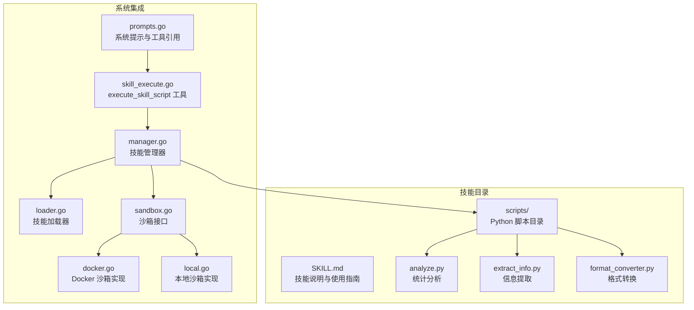
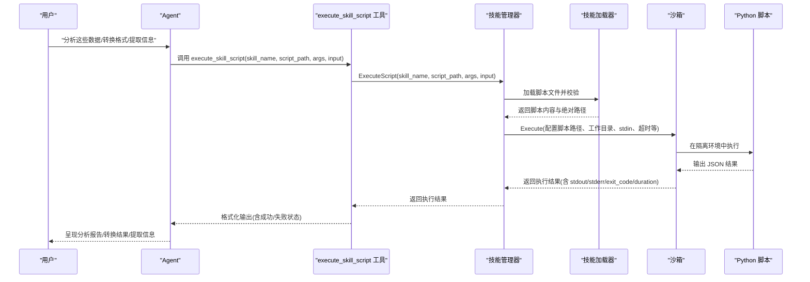
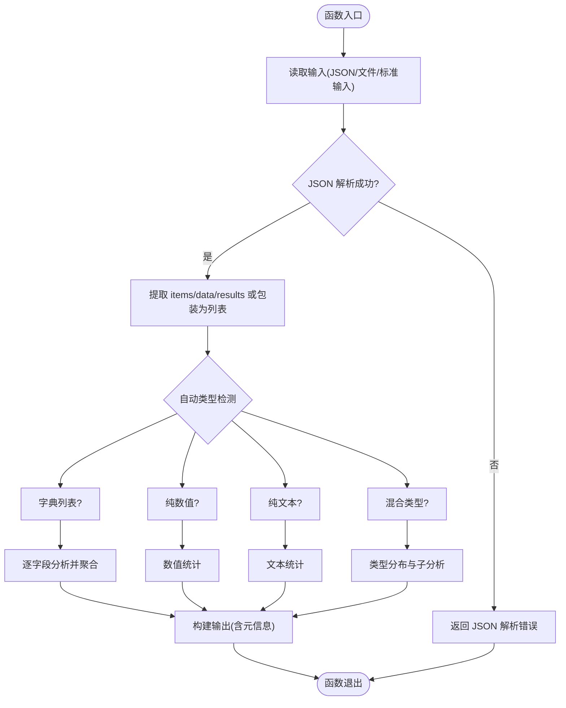
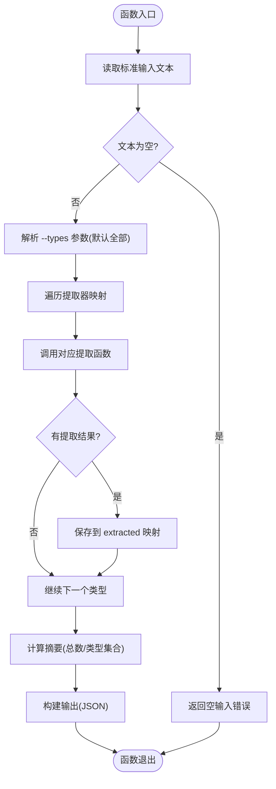
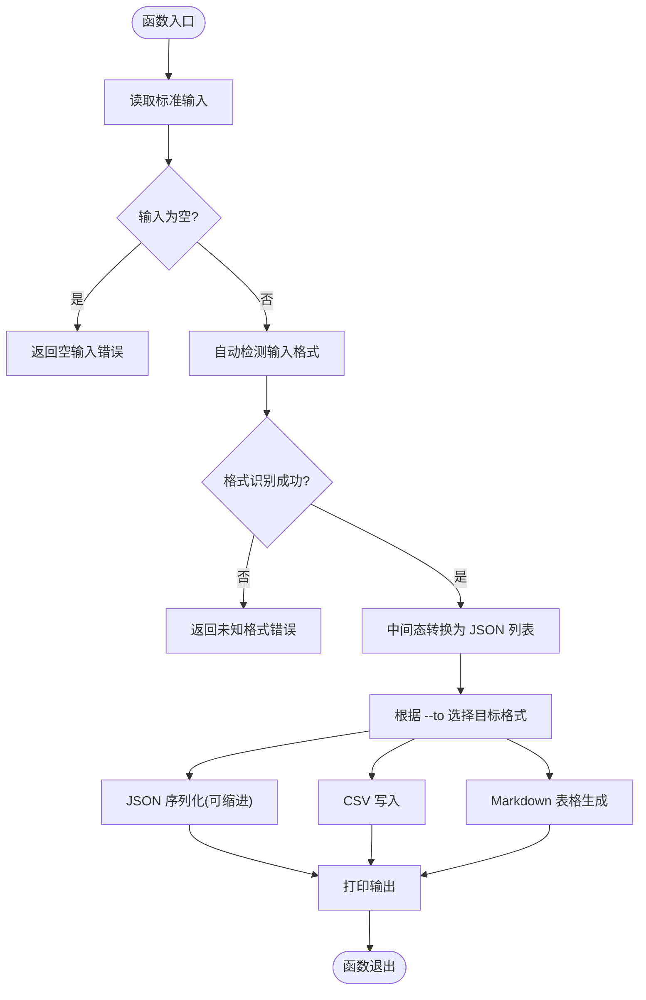
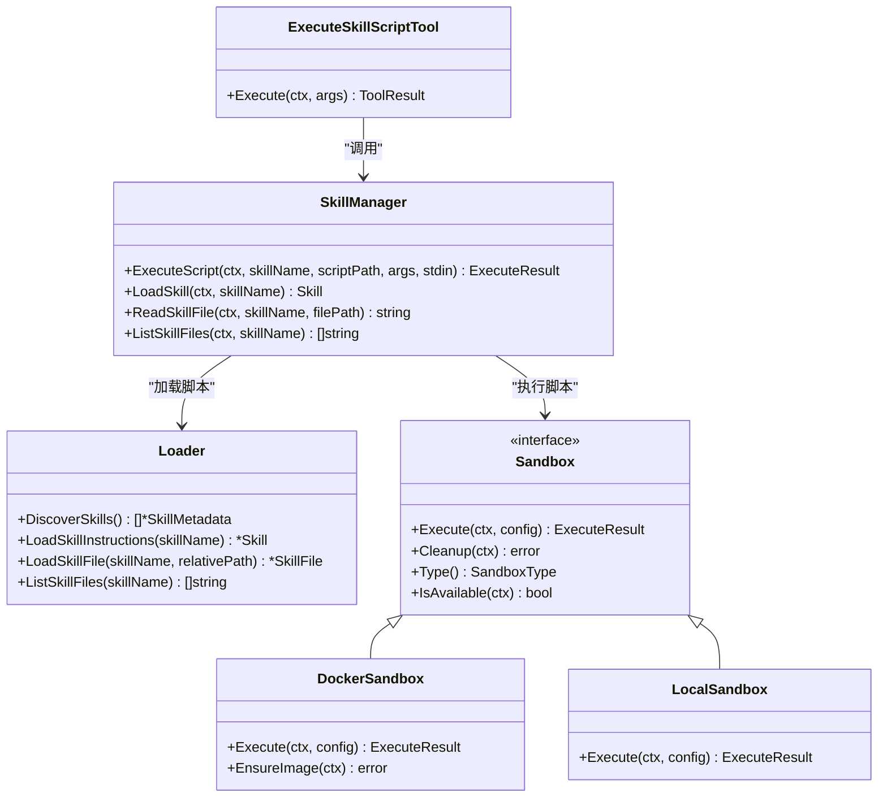
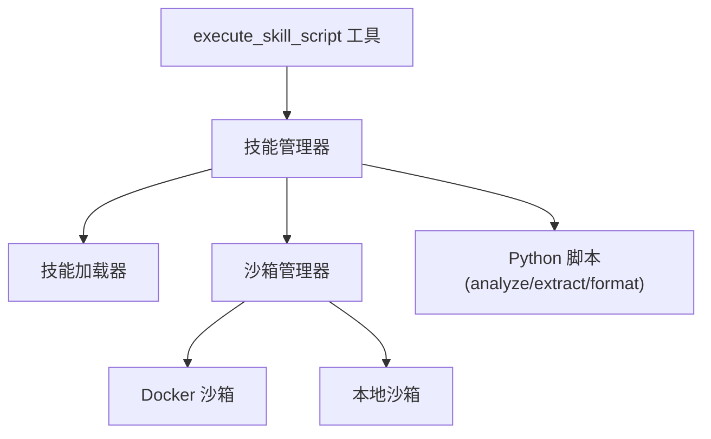

# 数据处理器技能

<cite>
**本文档引用的文件**
- [analyze.py](file://skills/preloaded/data-processor/scripts/analyze.py)
- [extract_info.py](file://skills/preloaded/data-processor/scripts/extract_info.py)
- [format_converter.py](file://skills/preloaded/data-processor/scripts/format_converter.py)
- [SKILL.md](file://skills/preloaded/data-processor/SKILL.md)
- [skill_execute.go](file://internal/agent/tools/skill_execute.go)
- [manager.go](file://internal/agent/skills/manager.go)
- [loader.go](file://internal/agent/skills/loader.go)
- [sandbox.go](file://internal/sandbox/sandbox.go)
- [docker.go](file://internal/sandbox/docker.go)
- [local.go](file://internal/sandbox/local.go)
- [prompts.go](file://internal/agent/prompts.go)
</cite>

## 目录
1. [简介](#简介)
2. [项目结构](#项目结构)
3. [核心组件](#核心组件)
4. [架构总览](#架构总览)
5. [详细组件分析](#详细组件分析)
6. [依赖关系分析](#依赖关系分析)
7. [性能考虑](#性能考虑)
8. [故障排除指南](#故障排除指南)
9. [结论](#结论)
10. [附录](#附录)

## 简介
数据处理器技能是 WeKnora 内置的预加载技能之一，专为对知识库检索结果和任意数据进行多维度数据分析、格式转换与信息提取而设计。该技能通过三个核心 Python 脚本协同工作：
- analyze.py：提供统计分析能力（数值统计、文本统计、混合数据与字典列表分析）
- extract_info.py：从非结构化文本中提取结构化信息（数字、日期、百分比、金额、邮箱、URL、电话、关键词）
- format_converter.py：在 JSON、CSV、Markdown 表格之间进行相互转换

技能还具备完善的输入输出规范、错误处理机制，并运行于安全沙箱环境中，支持超时控制与资源限制。

## 项目结构
数据处理器技能位于 skills/preloaded/data-processor 目录下，包含技能说明文档与三个核心脚本。系统通过技能管理器发现、加载并执行这些脚本，同时通过沙箱提供安全隔离的执行环境。

**图表来源**
- [SKILL.md:1-176](file://skills/preloaded/data-processor/SKILL.md#L1-L176)
- [skill_execute.go:1-191](file://internal/agent/tools/skill_execute.go#L1-L191)
- [manager.go:1-284](file://internal/agent/skills/manager.go#L1-L284)
- [loader.go:1-309](file://internal/agent/skills/loader.go#L1-L309)
- [sandbox.go:1-245](file://internal/sandbox/sandbox.go#L1-L245)
- [docker.go:1-219](file://internal/sandbox/docker.go#L1-L219)
- [local.go:1-253](file://internal/sandbox/local.go#L1-L253)

**章节来源**
- [SKILL.md:1-176](file://skills/preloaded/data-processor/SKILL.md#L1-L176)

## 核心组件
- analyze.py：支持数值、文本、混合数据与字典列表的统计分析，自动类型检测与元信息输出。
- extract_info.py：提供多种信息提取能力，支持按类型选择性提取并统计摘要。
- format_converter.py：在 JSON、CSV、Markdown 三者间转换，支持自动格式检测与中间态转换。
- 技能执行工具：execute_skill_script，负责参数校验、脚本加载与沙箱执行。
- 技能管理器：负责技能发现、指令加载、脚本执行与文件列表枚举。
- 沙箱系统：提供 Docker/本地两种隔离执行方式，默认超时 60 秒，内存限制 256MB。

**章节来源**
- [analyze.py:1-251](file://skills/preloaded/data-processor/scripts/analyze.py#L1-L251)
- [extract_info.py:1-200](file://skills/preloaded/data-processor/scripts/extract_info.py#L1-L200)
- [format_converter.py:1-207](file://skills/preloaded/data-processor/scripts/format_converter.py#L1-L207)
- [skill_execute.go:1-191](file://internal/agent/tools/skill_execute.go#L1-L191)
- [manager.go:1-284](file://internal/agent/skills/manager.go#L1-L284)
- [sandbox.go:1-245](file://internal/sandbox/sandbox.go#L1-L245)

## 架构总览
数据处理器技能的执行链路如下：系统提示引导 Agent 使用技能 → 调用 execute_skill_script 工具 → 技能管理器加载脚本 → 沙箱执行脚本 → 返回结构化输出。

**图表来源**
- [prompts.go:222-241](file://internal/agent/prompts.go#L222-L241)
- [skill_execute.go:64-191](file://internal/agent/tools/skill_execute.go#L64-L191)
- [manager.go:174-215](file://internal/agent/skills/manager.go#L174-L215)
- [loader.go:194-243](file://internal/agent/skills/loader.go#L194-L243)
- [sandbox.go:44-73](file://internal/sandbox/sandbox.go#L44-L73)

## 详细组件分析

### analyze.py：统计分析模块
- 功能特性
  - 数值分析：计数、求和、平均值、中位数、最值、标准差、四分位数
  - 文本分析：字符数、词数、平均长度、词频统计、唯一词数
  - 混合数据分析：类型分布统计
  - 字典列表分析：逐字段类型判断与统计（数值/文本/空值计数）
  - 自动类型检测：根据输入数据自动选择分析策略
  - 元信息输出：包含输入类型、条目数量、分析类型等
- 输入要求
  - 支持 JSON 列表或包含 items/data/results 的字典；也支持单条记录包装为列表
  - 文件读取或标准输入均可，支持 pretty 输出
- 输出规范
  - 成功标志 + analysis 结果 + metadata
  - analysis 内容随分析类型变化（数值/文本/混合/字典列表）
- 错误处理
  - 空输入、JSON 解析错误、文件不存在、不支持的数据格式等均有明确错误返回

**图表来源**
- [analyze.py:166-247](file://skills/preloaded/data-processor/scripts/analyze.py#L166-L247)

**章节来源**
- [analyze.py:1-251](file://skills/preloaded/data-processor/scripts/analyze.py#L1-L251)
- [SKILL.md:27-70](file://skills/preloaded/data-processor/SKILL.md#L27-L70)

### extract_info.py：信息提取模块
- 功能特性
  - 多类型提取：数字、日期、百分比、金额、邮箱、URL、电话、关键词
  - 关键词提取：支持中英文，过滤停用词并统计词频
  - 类型选择：可通过 --types 参数指定提取类型集合
  - 统计摘要：输出提取总数与发现类型
- 输入要求
  - 标准输入文本；支持 pretty 输出
- 输出规范
  - 成功标志 + 文本长度 + 提取结果 + 摘要统计
  - 各类型提取结果为数组或错误对象
- 错误处理
  - 空输入、读取错误、类型解析异常等均有错误兜底

**图表来源**
- [extract_info.py:135-196](file://skills/preloaded/data-processor/scripts/extract_info.py#L135-L196)

**章节来源**
- [extract_info.py:1-200](file://skills/preloaded/data-processor/scripts/extract_info.py#L1-L200)
- [SKILL.md:87-104](file://skills/preloaded/data-processor/SKILL.md#L87-L104)

### format_converter.py：格式转换模块
- 功能特性
  - JSON↔CSV↔Markdown 表格双向转换
  - 自动格式检测：基于首字符与首行特征识别输入格式
  - 中间态转换：统一转为 JSON 列表再输出目标格式
  - 字段对齐：CSV/Markdown 表头自动合并，缺失值为空字符串
  - Markdown 转义：对特殊字符进行转义处理
- 输入要求
  - --from 指定输入格式(auto/JSON/CSV/Markdown)，--to 指定输出格式(JSON/CSV/Markdown)
  - 支持标准输入；支持 pretty 输出
- 输出规范
  - JSON：支持缩进格式化
  - CSV：标准 CSV 头与行
  - Markdown：带表头与分隔线的表格
- 错误处理
  - 未知格式、解析失败、转换失败等均有错误返回

**图表来源**
- [format_converter.py:132-203](file://skills/preloaded/data-processor/scripts/format_converter.py#L132-L203)

**章节来源**
- [format_converter.py:1-207](file://skills/preloaded/data-processor/scripts/format_converter.py#L1-L207)
- [SKILL.md:71-86](file://skills/preloaded/data-processor/SKILL.md#L71-L86)

### 技能执行与系统集成
- execute_skill_script 工具
  - 参数：skill_name、script_path、args、input
  - 行为：校验必填参数 → 调用技能管理器执行 → 格式化输出(含 stdout/stderr/exit_code/duration/killed)
- 技能管理器
  - 发现与加载：扫描目录发现 SKILL.md → 解析 Frontmatter → 缓存元数据
  - 脚本执行：获取脚本绝对路径 → 校验是否为脚本 → 构造沙箱执行配置 → 返回执行结果
  - 文件枚举：列出技能目录内所有文件
- 沙箱系统
  - 接口：统一 Execute/Cleanup/GetType/IsAvailable
  - 实现：Docker 沙箱(容器隔离、资源限制、只读根文件系统)与本地沙箱(命令白名单、超时、最小环境)
  - 默认配置：超时 60 秒，内存 256MB，CPU 1.0，Docker 镜像 wechatopenai/weknora-sandbox:latest

**图表来源**
- [skill_execute.go:1-191](file://internal/agent/tools/skill_execute.go#L1-L191)
- [manager.go:1-284](file://internal/agent/skills/manager.go#L1-L284)
- [loader.go:1-309](file://internal/agent/skills/loader.go#L1-L309)
- [sandbox.go:1-245](file://internal/sandbox/sandbox.go#L1-L245)
- [docker.go:1-219](file://internal/sandbox/docker.go#L1-L219)
- [local.go:1-253](file://internal/sandbox/local.go#L1-L253)

**章节来源**
- [skill_execute.go:1-191](file://internal/agent/tools/skill_execute.go#L1-L191)
- [manager.go:1-284](file://internal/agent/skills/manager.go#L1-L284)
- [loader.go:1-309](file://internal/agent/skills/loader.go#L1-L309)
- [sandbox.go:1-245](file://internal/sandbox/sandbox.go#L1-L245)

## 依赖关系分析
- 组件耦合
  - execute_skill_script 工具强依赖技能管理器；技能管理器依赖加载器与沙箱管理器
  - 三个脚本彼此独立，通过统一的沙箱执行接口接入系统
- 外部依赖
  - Python 解释器(由沙箱选择器决定)、正则表达式、CSV/JSON/Markdown 解析库
- 安全与隔离
  - Docker 沙箱提供进程、网络、文件系统隔离；本地沙箱通过命令白名单与最小环境限制
  - 默认超时与内存限制防止资源滥用

**图表来源**
- [skill_execute.go:1-191](file://internal/agent/tools/skill_execute.go#L1-L191)
- [manager.go:1-284](file://internal/agent/skills/manager.go#L1-L284)
- [sandbox.go:1-245](file://internal/sandbox/sandbox.go#L1-L245)

**章节来源**
- [sandbox.go:1-245](file://internal/sandbox/sandbox.go#L1-L245)
- [docker.go:1-219](file://internal/sandbox/docker.go#L1-L219)
- [local.go:1-253](file://internal/sandbox/local.go#L1-L253)

## 性能考虑
- 执行超时：默认 60 秒，避免长时间阻塞；可通过沙箱配置调整
- 内存限制：默认 256MB，防止内存泄漏导致系统不稳定
- CPU 限制：默认 1.0 核，避免过度占用
- I/O 优化：脚本通过标准输入输出交互，减少磁盘 IO；大文件建议分批处理
- 正则匹配：信息提取模块使用正则，注意复杂文本的匹配成本；可按需指定提取类型
- 转换效率：格式转换先转为 JSON 列表再输出，保证字段一致性，但会增加一次序列化开销

## 故障排除指南
- 常见错误与定位
  - 空输入：检查标准输入是否正确传递；确认 input 参数或管道输入
  - JSON 解析错误：检查输入 JSON 格式；确认 items/data/results 字段是否存在
  - 文件未找到：确认 --file 指定的文件路径存在于技能目录内
  - 不支持的格式：确认输入格式与 --from/--to 选项一致
  - 超时被杀：增大超时或优化脚本逻辑；避免无限循环或大量正则回溯
- 输出解读
  - execute_skill_script 工具会返回 stdout/stderr/exit_code/duration/killed 等信息
  - 成功条件：exit_code 为 0 且未被终止；失败时优先读取 stderr 或 Error 字段
- 安全与权限
  - Docker 沙箱需要 docker 命令可用；若不可用将回退到本地沙箱
  - 本地沙箱仅允许白名单命令，避免危险操作

**章节来源**
- [analyze.py:187-195](file://skills/preloaded/data-processor/scripts/analyze.py#L187-L195)
- [extract_info.py:148-150](file://skills/preloaded/data-processor/scripts/extract_info.py#L148-L150)
- [format_converter.py:149-151](file://skills/preloaded/data-processor/scripts/format_converter.py#L149-L151)
- [skill_execute.go:105-191](file://internal/agent/tools/skill_execute.go#L105-L191)
- [sandbox.go:31-42](file://internal/sandbox/sandbox.go#L31-L42)

## 结论
数据处理器技能通过三个专业脚本覆盖了数据分析、信息提取与格式转换的核心需求，并在系统层面提供了安全、可控的执行环境。其清晰的输入输出规范、完善的错误处理与可配置的沙箱策略，使其既能满足日常分析任务，又能在生产环境中稳定运行。建议在大规模数据处理时采用分批策略与类型选择性提取，以获得更优性能与更精准的结果。

## 附录

### 使用场景与最佳实践
- 分析 RAG 检索结果：先收集文档片段，再调用 analyze.py 生成统计报告
- 格式转换：统一输出为 CSV/Markdown 以便下游系统消费
- 信息提取：从长文本中抽取关键实体，辅助人工审核与自动化处理
- 最佳实践：预处理数据、选择性提取、结果验证、分批处理大数据

### 输出格式示例
- 分析报告：包含基本统计、分布情况与结论
- 提取结果：各类型提取数组与摘要统计
- 转换结果：标准化的 JSON/CSV/Markdown 表格

**章节来源**
- [SKILL.md:106-176](file://skills/preloaded/data-processor/SKILL.md#L106-L176)