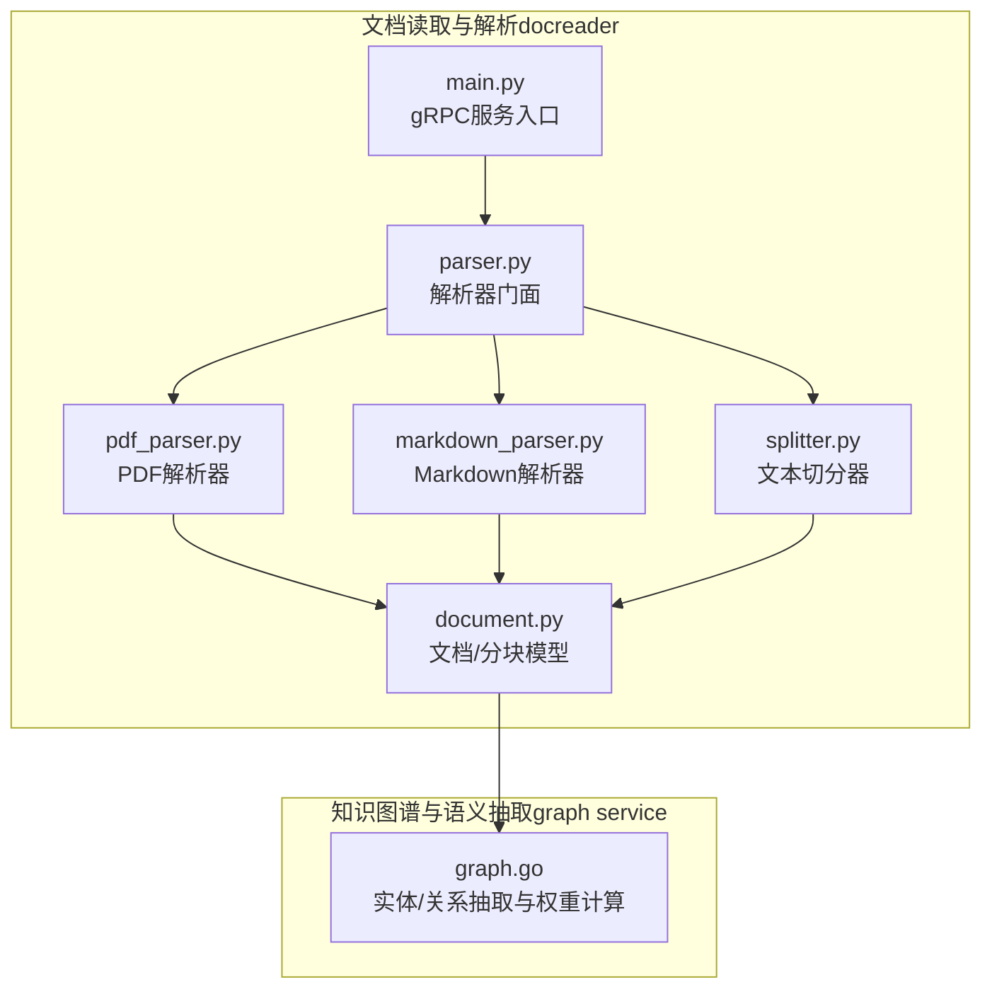
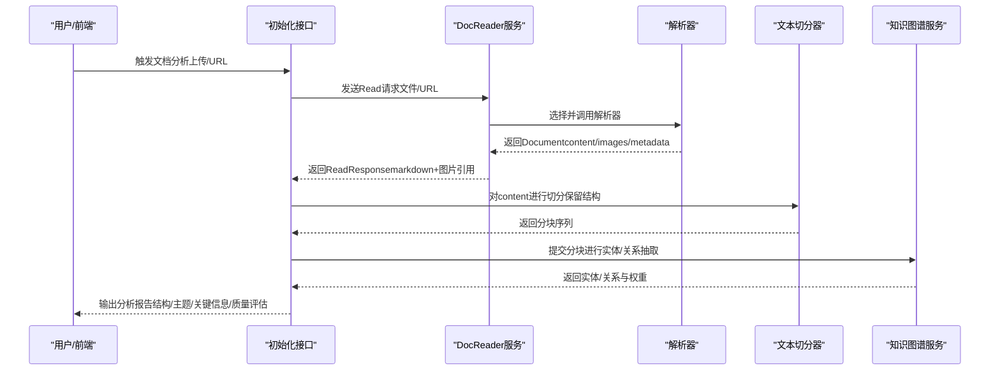
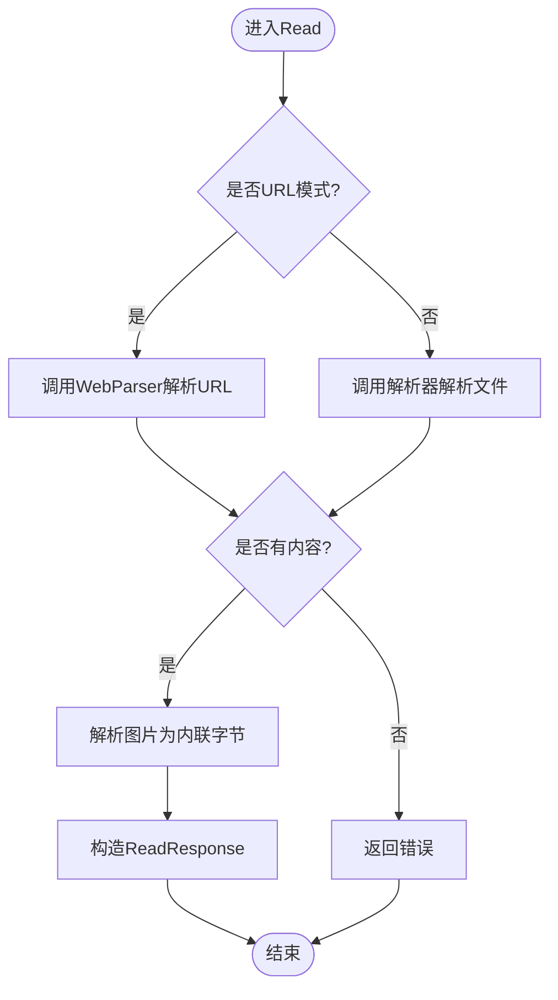
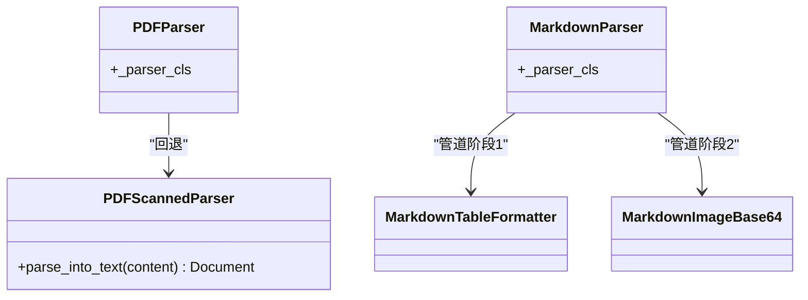
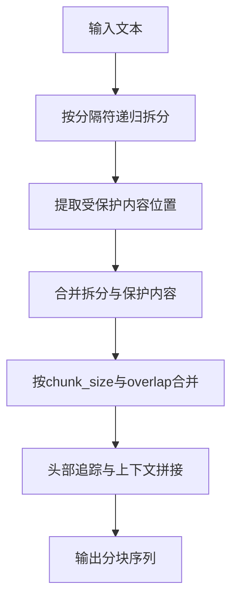
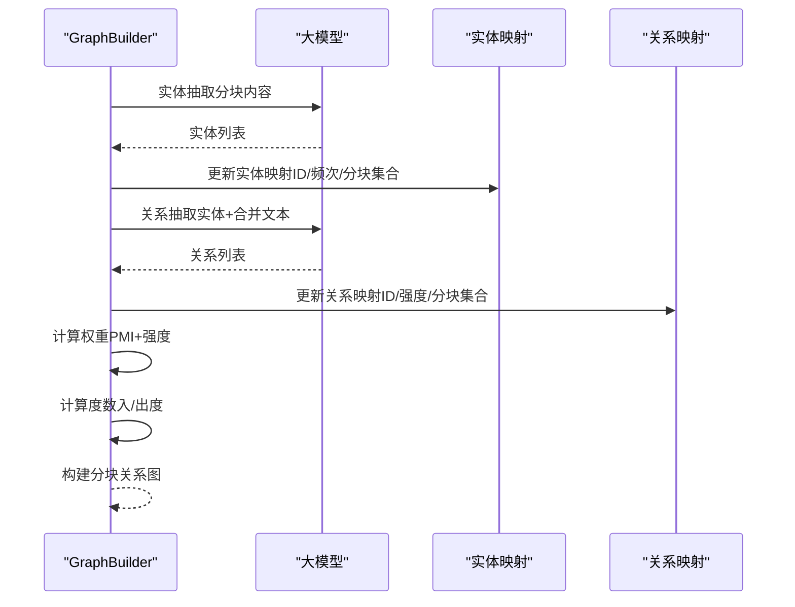
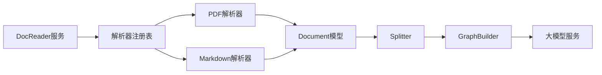

# 文档分析器技能

<cite>
**本文引用的文件列表**
- [SKILL.md](file://skills/preloaded/document-analyzer/SKILL.md)
- [agent-skills.md](file://docs/agent-skills.md)
- [main.py](file://docreader/main.py)
- [document.py](file://docreader/models/document.py)
- [parser.py](file://docreader/parser/parser.py)
- [__init__.py](file://docreader/parser/__init__.py)
- [pdf_parser.py](file://docreader/parser/pdf_parser.py)
- [markdown_parser.py](file://docreader/parser/markdown_parser.py)
- [splitter.py](file://docreader/splitter/splitter.py)
- [graph.go](file://internal/application/service/graph.go)
- [initialization.go](file://internal/handler/initialization.go)
- [get_document_info.go](file://internal/agent/tools/get_document_info.go)
- [task.go](file://internal/types/task.go)
- [rewrite.yaml](file://config/prompt_templates/rewrite.yaml)
- [graph_extraction.yaml](file://config/prompt_templates/graph_extraction.yaml)
- [initialization.md](file://docs/api/initialization.md)
</cite>

## 目录
1. [简介](#简介)
2. [项目结构](#项目结构)
3. [核心组件](#核心组件)
4. [架构总览](#架构总览)
5. [详细组件分析](#详细组件分析)
6. [依赖关系分析](#依赖关系分析)
7. [性能考量](#性能考量)
8. [故障排查指南](#故障排查指南)
9. [结论](#结论)
10. [附录](#附录)

## 简介
本文档面向WeKnora“文档分析器”技能，系统化阐述其内容理解能力与分析算法，覆盖文本内容分析、关键信息提取、主题识别、文档类型识别与内容质量评估等能力。文档从技术架构、数据流、处理流程、性能优化、配置参数、输入输出规范、结果解释机制等方面进行深入解析，并提供使用场景、最佳实践与扩展开发指导，帮助开发者与用户充分发挥该技能的价值。

## 项目结构
WeKnora的文档分析能力由两部分协同实现：
- 文档读取与解析服务（docreader）：负责将各类文档（PDF、Markdown、Word、图片含文字、网页等）统一解析为Markdown文本与图像引用，支持链式解析与扫描版PDF回退。
- 知识图谱与语义抽取服务（graph service）：基于解析后的文本，利用大模型进行实体与关系抽取，构建实体-关系图谱，用于主题识别、关键信息提取与上下文关联。

图表来源
- [main.py:98-182](file://docreader/main.py#L98-L182)
- [parser.py:11-83](file://docreader/parser/parser.py#L11-L83)
- [pdf_parser.py:13-69](file://docreader/parser/pdf_parser.py#L13-L69)
- [markdown_parser.py:376-388](file://docreader/parser/markdown_parser.py#L376-L388)
- [splitter.py:31-144](file://docreader/splitter/splitter.py#L31-L144)
- [document.py:62-88](file://docreader/models/document.py#L62-L88)
- [graph.go:96-189](file://internal/application/service/graph.go#L96-L189)

章节来源
- [main.py:98-182](file://docreader/main.py#L98-L182)
- [parser.py:11-83](file://docreader/parser/parser.py#L11-L83)
- [pdf_parser.py:13-69](file://docreader/parser/pdf_parser.py#L13-L69)
- [markdown_parser.py:376-388](file://docreader/parser/markdown_parser.py#L376-L388)
- [splitter.py:31-144](file://docreader/splitter/splitter.py#L31-L144)
- [document.py:62-88](file://docreader/models/document.py#L62-L88)
- [graph.go:96-189](file://internal/application/service/graph.go#L96-L189)

## 核心组件
- 文档读取与解析服务（docreader）
  - gRPC服务入口：统一处理文件模式与URL模式的读取请求，返回Markdown内容与图像引用。
  - 解析器门面：根据文件类型选择具体解析器，支持链式解析与回退策略。
  - PDF解析器：优先使用MarkItDown解析，失败时转为扫描版PDF回退方案（逐页转图片）。
  - Markdown解析器：表格标准化与Base64图片提取，确保后续处理一致性。
  - 文本切分器：按分隔符与保护正则进行智能切分，保留公式、表格、链接、代码块等结构完整性。
  - 文档/分块模型：封装文档内容、图像映射与分块元数据，便于后续处理与持久化。

- 知识图谱与语义抽取服务
  - 实体抽取：对每个分块调用大模型抽取实体，去重合并，统计频次与所在分块集合。
  - 关系抽取：基于实体与合并后的文本内容，抽取实体间关系，计算强度与权重。
  - 权重与度数：结合PMI与强度值归一化加权，计算实体入/出度与关系综合度，构建分块关系图。
  - 可视化：生成Mermaid图示，辅助理解知识图谱结构。

章节来源
- [main.py:98-182](file://docreader/main.py#L98-L182)
- [parser.py:11-83](file://docreader/parser/parser.py#L11-L83)
- [pdf_parser.py:13-69](file://docreader/parser/pdf_parser.py#L13-L69)
- [markdown_parser.py:376-388](file://docreader/parser/markdown_parser.py#L376-L388)
- [splitter.py:31-144](file://docreader/splitter/splitter.py#L31-L144)
- [document.py:62-88](file://docreader/models/document.py#L62-L88)
- [graph.go:96-189](file://internal/application/service/graph.go#L96-L189)

## 架构总览
文档分析器技能的端到端工作流如下：

图表来源
- [main.py:103-166](file://docreader/main.py#L103-L166)
- [parser.py:25-83](file://docreader/parser/parser.py#L25-L83)
- [splitter.py:116-144](file://docreader/splitter/splitter.py#L116-L144)
- [graph.go:374-497](file://internal/application/service/graph.go#L374-L497)

## 详细组件分析

### 组件A：文档读取与解析（DocReader）
- 处理模式
  - 文件模式：接收文件名、类型与字节内容，调用解析器生成Document。
  - URL模式：通过WebParser抓取网页内容，返回Document。
- 图像处理
  - 将解析得到的图片以内联字节形式返回，供上层应用存储与管理。
- 错误处理
  - 解析失败或内容为空时返回错误信息，便于上层重试或提示。

图表来源
- [main.py:103-166](file://docreader/main.py#L103-L166)

章节来源
- [main.py:98-182](file://docreader/main.py#L98-L182)

### 组件B：解析器与回退策略（PDF/Markdown）
- PDF解析器
  - 采用责任链模式：优先尝试MarkItDown解析，失败则转为扫描版PDF回退（逐页转图片），并标注图像来源类型与页数。
- Markdown解析器
  - 表格格式标准化：统一对齐标记与间距。
  - Base64图片提取：解码嵌入图片为原始字节，生成唯一文件名并替换为路径引用，便于后续存储与管理。

图表来源
- [pdf_parser.py:57-69](file://docreader/parser/pdf_parser.py#L57-L69)
- [markdown_parser.py:376-388](file://docreader/parser/markdown_parser.py#L376-L388)

章节来源
- [pdf_parser.py:13-69](file://docreader/parser/pdf_parser.py#L13-L69)
- [markdown_parser.py:127-161](file://docreader/parser/markdown_parser.py#L127-L161)
- [markdown_parser.py:352-374](file://docreader/parser/markdown_parser.py#L352-L374)

### 组件C：文本切分与结构保留（Splitter）
- 设计要点
  - 支持可配置的分隔符优先级与重叠长度，避免跨段落截断。
  - 保护正则：公式、表格、链接、代码块等结构完整保留。
  - 头部追踪：在分块前缀附加标题上下文，提升检索与理解效果。
- 算法流程
  - 递归按分隔符拆分，合并受保护内容，再按大小与重叠合并为最终分块。
  - 提供恢复函数，基于位置信息还原原文，保障一致性验证。

图表来源
- [splitter.py:116-144](file://docreader/splitter/splitter.py#L116-L144)
- [splitter.py:183-297](file://docreader/splitter/splitter.py#L183-L297)
- [splitter.py:299-407](file://docreader/splitter/splitter.py#L299-L407)
- [splitter.py:517-556](file://docreader/splitter/splitter.py#L517-L556)

章节来源
- [splitter.py:31-144](file://docreader/splitter/splitter.py#L31-L144)
- [splitter.py:183-297](file://docreader/splitter/splitter.py#L183-L297)
- [splitter.py:299-407](file://docreader/splitter/splitter.py#L299-L407)
- [splitter.py:517-556](file://docreader/splitter/splitter.py#L517-L556)

### 组件D：知识图谱与语义抽取（Graph Builder）
- 实体抽取
  - 对每个分块调用大模型抽取实体，去重合并，记录所在分块ID与出现频次。
- 关系抽取
  - 基于实体集合与合并文本，抽取实体间关系，计算强度与权重。
- 权重与度数
  - 使用PMI与强度值归一化加权，缩放到1-10范围；计算实体入/出度与关系综合度。
- 分块关系图
  - 基于实体关系连接相关分块，形成分块级关系网络，支持直接/间接关联查询。

图表来源
- [graph.go:96-189](file://internal/application/service/graph.go#L96-L189)
- [graph.go:191-315](file://internal/application/service/graph.go#L191-L315)
- [graph.go:499-589](file://internal/application/service/graph.go#L499-L589)
- [graph.go:591-628](file://internal/application/service/graph.go#L591-L628)
- [graph.go:630-673](file://internal/application/service/graph.go#L630-L673)

章节来源
- [graph.go:96-189](file://internal/application/service/graph.go#L96-L189)
- [graph.go:191-315](file://internal/application/service/graph.go#L191-L315)
- [graph.go:499-589](file://internal/application/service/graph.go#L499-L589)
- [graph.go:591-628](file://internal/application/service/graph.go#L591-L628)
- [graph.go:630-673](file://internal/application/service/graph.go#L630-L673)

### 组件E：文档信息工具（GetDocumentInfo）
- 能力概述
  - 批量查询文档元数据（标题、来源、文件信息、解析状态、分块数量、自定义元数据）。
  - 支持并发查询，权限校验（知识库可访问性）。
- 输出格式
  - 控制台格式化输出与结构化JSON数据，便于前端展示与二次处理。

章节来源
- [get_document_info.go:74-260](file://internal/agent/tools/get_document_info.go#L74-L260)

## 依赖关系分析
- 组件耦合
  - DocReader服务与解析器模块松耦合：通过注册表与责任链模式实现动态选择与回退。
  - 文档模型与切分器解耦：切分器仅依赖字符串与位置信息，便于扩展不同格式。
  - 知识图谱服务与解析产物解耦：通过分块序列与合并文本进行抽取，便于替换底层模型。
- 外部依赖
  - PDF解析依赖pdfplumber与MarkItDown（外部引擎）。
  - 大模型抽取依赖配置模板与模型服务（初始化接口提供测试与校验）。

图表来源
- [parser.py:18-23](file://docreader/parser/parser.py#L18-L23)
- [pdf_parser.py:57-69](file://docreader/parser/pdf_parser.py#L57-L69)
- [markdown_parser.py:376-388](file://docreader/parser/markdown_parser.py#L376-L388)
- [document.py:62-88](file://docreader/models/document.py#L62-L88)
- [splitter.py:116-144](file://docreader/splitter/splitter.py#L116-L144)
- [graph.go:96-189](file://internal/application/service/graph.go#L96-L189)

章节来源
- [parser.py:11-83](file://docreader/parser/parser.py#L11-L83)
- [__init__.py:16-38](file://docreader/parser/__init__.py#L16-L38)

## 性能考量
- 解析并发与限流
  - DocReader服务使用线程池与消息长度限制，避免单次请求过大导致阻塞。
- 实体/关系抽取并发
  - GraphBuilder对实体抽取设置并发上限，关系抽取按批次并发，降低内存峰值与超时风险。
- 文本切分优化
  - 保护正则与头部追踪减少无效重切，重叠长度控制召回与上下文平衡。
- 存储与传输
  - 图像以内联字节形式返回，由上层统一存储，减少中间态复杂度。

章节来源
- [main.py:184-211](file://docreader/main.py#L184-L211)
- [graph.go:374-497](file://internal/application/service/graph.go#L374-L497)
- [splitter.py:31-144](file://docreader/splitter/splitter.py#L31-L144)

## 故障排查指南
- 常见问题
  - PDF无文本：确认是否为扫描版PDF，系统会自动转为图片回退；检查pdfplumber依赖与分辨率设置。
  - Markdown表格错位：检查表格格式标准化是否生效，确认分隔符与对齐标记。
  - 实体/关系抽取失败：检查大模型可用性与提示词模板，确认文本长度与标签配置。
  - 多模态测试失败：检查DocReader服务是否启动，以及图像/OCR处理链路。
- 排查步骤
  - 使用初始化接口的多模态测试与文本关系提取接口进行端到端验证。
  - 查看DocReader日志与错误响应，定位解析阶段问题。
  - 使用GetDocumentInfo工具核验文档元数据与分块数量，判断处理状态。

章节来源
- [initialization.go:2064-2112](file://internal/handler/initialization.go#L2064-L2112)
- [initialization.go:2152-2192](file://internal/handler/initialization.go#L2152-L2192)
- [initialization.md:342-381](file://docs/api/initialization.md#L342-L381)
- [get_document_info.go:74-260](file://internal/agent/tools/get_document_info.go#L74-L260)

## 结论
WeKnora文档分析器技能通过“文档读取与解析 + 知识图谱与语义抽取”的双引擎架构，实现了对多格式文档的统一理解与结构化分析。其解析器链与回退策略保证了鲁棒性，文本切分器在结构完整性与上下文保留之间取得平衡，知识图谱服务则提供了主题识别、关键信息提取与内容质量评估的语义基础。配合完善的配置参数、输入输出规范与监控接口，该技能能够稳定支撑各类知识管理与内容理解场景。

## 附录

### 技能能力与流程
- 核心能力
  - 结构分析：识别章节层级与组织架构。
  - 关键信息提取：提取核心主题、关键论点、支撑数据与结论建议。
  - 文档类型识别：判断报告、手册、论文、合同等类型。
  - 内容质量评估：评估完整性、一致性与清晰度。
- 分析流程
  - 文档概览：获取文档名称、类型、页数/分块数、时间与主要章节。
  - 结构分析：标题层级、章节组织与逻辑流程。
  - 内容提取：核心主题、关键论点、支撑数据与结论建议。
  - 质量评估：完整性、一致性、清晰度。

章节来源
- [SKILL.md:10-48](file://skills/preloaded/document-analyzer/SKILL.md#L10-L48)
- [agent-skills.md:296-310](file://docs/agent-skills.md#L296-L310)

### 输入输出规范与配置参数
- 输入
  - 文件：文件名、类型、内容字节。
  - URL：目标地址与标题。
  - 解析器引擎与覆盖参数：可选指定解析引擎与参数覆盖。
- 输出
  - ReadResponse：Markdown内容、图像引用、元数据。
  - 分块序列：位置信息与上下文保留。
  - 实体/关系：结构化JSON，包含权重与度数。
- 配置参数
  - DocReader：gRPC端口、最大并发、消息大小限制。
  - Splitter：分块大小、重叠长度、分隔符、保护正则。
  - GraphBuilder：温度、并发上限、批大小、最小实体数、权重比例。

章节来源
- [main.py:184-211](file://docreader/main.py#L184-L211)
- [splitter.py:65-114](file://docreader/splitter/splitter.py#L65-L114)
- [graph.go:23-53](file://internal/application/service/graph.go#L23-L53)

### 使用场景与最佳实践
- 场景
  - 合同/协议审阅：识别关键条款、主体与时间线，评估一致性与完整性。
  - 科研论文理解：提取研究方法、数据与结论，构建主题与关系图谱。
  - 手册/指南结构化：识别章节与子章节，提取关键步骤与注意事项。
- 最佳实践
  - 优先使用高质量扫描版PDF（清晰度高），减少OCR误差。
  - 合理设置分块大小与重叠，兼顾召回与上下文连贯性。
  - 对长文档分批进行关系抽取，避免大文本超时。
  - 使用GetDocumentInfo核验处理状态，确保分块数量与元数据正确。

章节来源
- [SKILL.md:10-48](file://skills/preloaded/document-analyzer/SKILL.md#L10-L48)
- [get_document_info.go:74-260](file://internal/agent/tools/get_document_info.go#L74-L260)

### 扩展开发指导
- 新增解析器
  - 在解析器注册表中注册新引擎，遵循BaseParser接口，实现parse_into_text。
- 自定义切分策略
  - 扩展Splitter的分隔符与保护正则，适配特定领域格式（如法律条文、技术规范）。
- 替换大模型
  - 通过初始化接口测试新模型，更新提示词模板（graph_extraction.yaml、rewrite.yaml）。
- 任务类型与调度
  - 参考任务常量（如document:process、chunk:extract）进行任务编排与监控。

章节来源
- [__init__.py:16-38](file://docreader/parser/__init__.py#L16-L38)
- [graph_extraction.yaml:24-42](file://config/prompt_templates/graph_extraction.yaml#L24-L42)
- [rewrite.yaml:46-54](file://config/prompt_templates/rewrite.yaml#L46-L54)
- [task.go:1-23](file://internal/types/task.go#L1-L23)