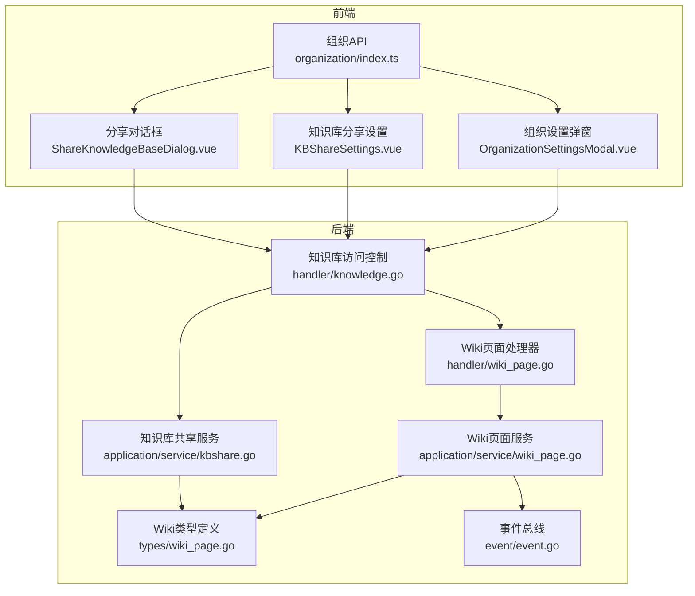
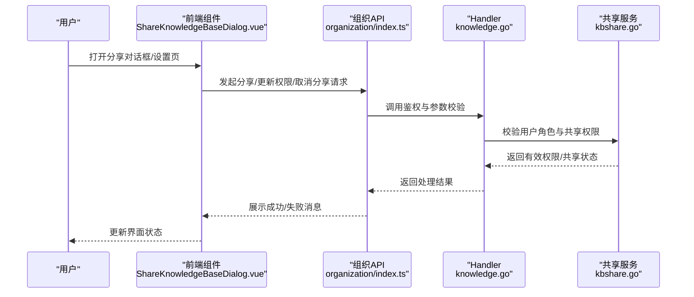
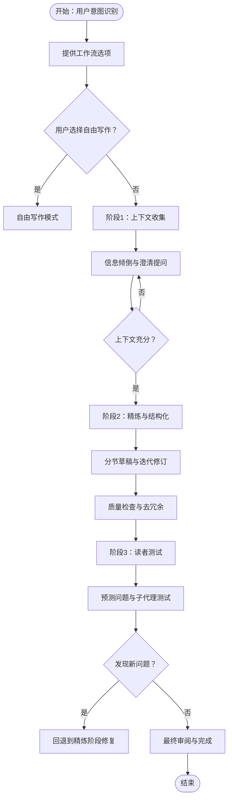
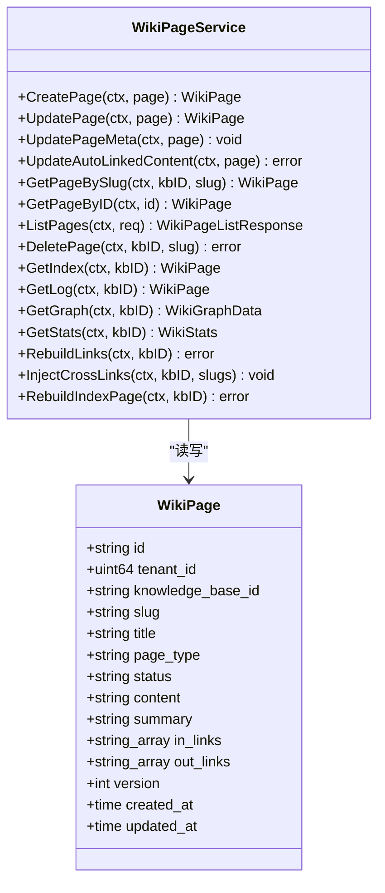
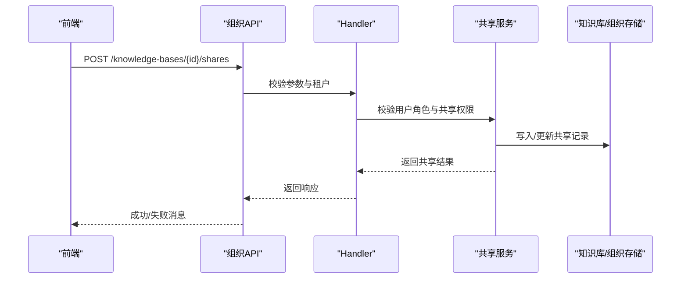
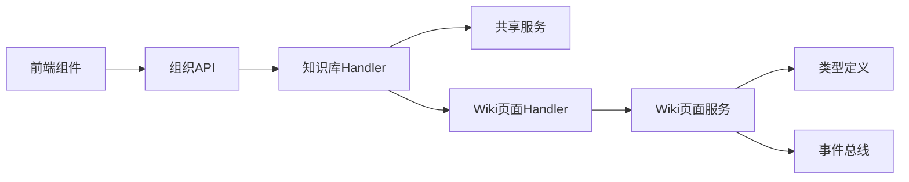

# 文档协作者技能

<cite>
**本文引用的文件**
- [SKILL.md](file://skills/preloaded/doc-coauthoring/SKILL.md)
- [wiki_page.go](file://internal/application/service/wiki_page.go)
- [wiki_page.go](file://internal/types/wiki_page.go)
- [wiki_page.go](file://internal/handler/wiki_page.go)
- [kbshare.go](file://internal/application/service/kbshare.go)
- [knowledge.go](file://internal/handler/knowledge.go)
- [index.ts](file://frontend/src/api/organization/index.ts)
- [ShareKnowledgeBaseDialog.vue](file://frontend/src/components/ShareKnowledgeBaseDialog.vue)
- [KBShareSettings.vue](file://frontend/src/views/knowledge/settings/KBShareSettings.vue)
- [OrganizationSettingsModal.vue](file://frontend/src/views/organization/OrganizationSettingsModal.vue)
- [event.go](file://internal/event/event.go)
- [usage_example.md](file://internal/event/usage_example.md)
- [event_bus.go](file://internal/types/event_bus.go)
</cite>

## 目录
1. [简介](#简介)
2. [项目结构](#项目结构)
3. [核心组件](#核心组件)
4. [架构总览](#架构总览)
5. [详细组件分析](#详细组件分析)
6. [依赖分析](#依赖分析)
7. [性能考虑](#性能考虑)
8. [故障排除指南](#故障排除指南)
9. [结论](#结论)
10. [附录](#附录)

## 简介
本文件面向WeKnora“文档协作者技能”，聚焦于文档协作与多人协同编辑能力的技术实现。结合仓库中的“文档协作”技能定义与Wiki页面、知识库共享、事件总线等后端能力，系统性阐述以下主题：
- 协作工作流与阶段划分（上下文收集、精炼与结构化、读者测试）
- 版本控制与变更记录（版本号、链接维护、索引页重建）
- 权限与共享机制（组织内共享、角色与权限、访问控制）
- 事件驱动与可观测性（事件总线、异步处理、性能优化）
- 前后端集成与API规范（REST接口、前端交互、错误处理）

本指南既适合开发者理解实现细节，也适合产品与运营人员把握协作流程与配置要点。

## 项目结构
围绕“文档协作者技能”的实现，涉及以下关键模块：
- 技能定义：skills/preloaded/doc-coauthoring/SKILL.md，定义协作工作流与交互步骤
- Wiki页面服务：internal/application/service/wiki_page.go，提供页面增删改查、链接维护、统计与重建
- 类型与常量：internal/types/wiki_page.go，定义页面类型、状态、配置与统计结构
- Wiki页面HTTP处理器：internal/handler/wiki_page.go，暴露REST接口
- 知识库共享服务：internal/application/service/kbshare.go，提供共享、权限校验与计数
- 知识库访问控制：internal/handler/knowledge.go，统一鉴权入口
- 前端API与UI：frontend/src/api/organization/index.ts、ShareKnowledgeBaseDialog.vue、KBShareSettings.vue、OrganizationSettingsModal.vue
- 事件总线：internal/event/event.go、internal/types/event_bus.go、internal/event/usage_example.md



图表来源
- [wiki_page.go:1-561](file://internal/handler/wiki_page.go#L1-L561)
- [wiki_page.go:1-691](file://internal/application/service/wiki_page.go#L1-L691)
- [wiki_page.go:1-255](file://internal/types/wiki_page.go#L1-L255)
- [kbshare.go:1-484](file://internal/application/service/kbshare.go#L1-L484)
- [knowledge.go:123-151](file://internal/handler/knowledge.go#L123-L151)
- [event.go:1-231](file://internal/event/event.go#L1-L231)

章节来源
- [SKILL.md:1-376](file://skills/preloaded/doc-coauthoring/SKILL.md#L1-L376)
- [wiki_page.go:1-691](file://internal/application/service/wiki_page.go#L1-L691)
- [wiki_page.go:1-255](file://internal/types/wiki_page.go#L1-L255)
- [wiki_page.go:1-561](file://internal/handler/wiki_page.go#L1-L561)
- [kbshare.go:1-484](file://internal/application/service/kbshare.go#L1-L484)
- [knowledge.go:123-151](file://internal/handler/knowledge.go#L123-L151)
- [index.ts:526-564](file://frontend/src/api/organization/index.ts#L526-L564)
- [ShareKnowledgeBaseDialog.vue:150-238](file://frontend/src/components/ShareKnowledgeBaseDialog.vue#L150-L238)
- [KBShareSettings.vue:216-297](file://frontend/src/views/knowledge/settings/KBShareSettings.vue#L216-L297)
- [OrganizationSettingsModal.vue:524-542](file://frontend/src/views/organization/OrganizationSettingsModal.vue#L524-L542)
- [event.go:1-231](file://internal/event/event.go#L1-L231)

## 核心组件
- 文档协作技能（Doc Co-Authoring Workflow）
  - 三阶段工作流：上下文收集、精炼与结构化、读者测试
  - 支持模板与现有共享文档读取、图片alt文本检查、子代理读者测试
  - 提供占位符草稿与迭代修订的指导原则
- Wiki页面服务
  - 页面创建/更新/删除、列表与搜索、链接解析与双向链接维护
  - 版本号仅在用户可见字段变化时递增，避免“纯书签”更新导致版本膨胀
  - 统计聚合、图谱构建、索引页重建、问题清单与自动修复
- 知识库共享与权限
  - 组织内共享、角色与权限（查看者/编辑者/管理员）、有效权限计算
  - 访问控制：拥有者、共享组织成员、共享代理等多场景统一鉴权
- 事件总线
  - 事件类型覆盖查询、检索、重排序、合并、聊天、Agent工具链等
  - 支持同步与异步模式，提供等待完成、清理与计数等能力
  - 性能优化建议：异步模式、中间件最小化、事件数据瘦身

章节来源
- [SKILL.md:1-376](file://skills/preloaded/doc-coauthoring/SKILL.md#L1-L376)
- [wiki_page.go:80-172](file://internal/application/service/wiki_page.go#L80-L172)
- [wiki_page.go:43-99](file://internal/types/wiki_page.go#L43-L99)
- [kbshare.go:404-452](file://internal/application/service/kbshare.go#L404-L452)
- [knowledge.go:123-151](file://internal/handler/knowledge.go#L123-L151)
- [event.go:14-65](file://internal/event/event.go#L14-L65)
- [usage_example.md:413-420](file://internal/event/usage_example.md#L413-L420)

## 架构总览
文档协作者技能在WeKnora中的运行路径如下：
- 前端通过组织API进行知识库分享、权限更新与取消分享
- 后端Handler负责鉴权与参数校验，调用Service层执行业务逻辑
- Service层封装领域操作（Wiki页面、共享、权限），必要时触发事件
- 事件总线支持异步观测与性能优化



图表来源
- [ShareKnowledgeBaseDialog.vue:226-238](file://frontend/src/components/ShareKnowledgeBaseDialog.vue#L226-L238)
- [index.ts:526-564](file://frontend/src/api/organization/index.ts#L526-L564)
- [knowledge.go:123-151](file://internal/handler/knowledge.go#L123-L151)
- [kbshare.go:122-175](file://internal/application/service/kbshare.go#L122-L175)

## 详细组件分析

### 组件A：文档协作技能（工作流与交互）
- 触发条件与初始引导：识别“写文档/起草/提案/规范”等意图，提供结构化工作流
- 三阶段流程
  - 上下文收集：元信息、受众、影响、模板/格式约束、背景与约束
  - 精炼与结构化：分节构建、头脑风暴、取舍与草稿、迭代修订、质量检查
  - 读者测试：预测读者问题、子代理测试、歧义与矛盾检查、修复回路
- 工具与产物
  - 占位符草稿与迭代修订（str_replace）
  - 分享链接与反馈闭环
- 配置与提示
  - Tone、偏差处理、上下文管理、工具体管与质量优先



图表来源
- [SKILL.md:10-376](file://skills/preloaded/doc-coauthoring/SKILL.md#L10-L376)

章节来源
- [SKILL.md:10-376](file://skills/preloaded/doc-coauthoring/SKILL.md#L10-L376)

### 组件B：Wiki页面服务（版本控制与链接维护）
- 版本控制策略
  - 仅在用户可见字段（标题、内容、摘要、类型、状态）发生实际变化时递增版本
  - “书签/索引/重入”等纯元数据更新不改变版本，便于下游消费
- 链接维护
  - 出站链接解析与双向入站链接更新/移除
  - 支持跨链接注入与死链清理后的自动更新
- 统计与图谱
  - 聚合统计、最近更新、待处理任务与问题计数
  - 构建节点与边的图数据，支持可视化
- 索引页与日志页
  - 默认索引页与日志页的按需创建与内容生成
- 重建与修复
  - 全量链接重建、跨链接注入、自动修复与lint报告



图表来源
- [wiki_page.go:43-99](file://internal/types/wiki_page.go#L43-L99)
- [wiki_page.go:46-172](file://internal/application/service/wiki_page.go#L46-L172)

章节来源
- [wiki_page.go:80-172](file://internal/application/service/wiki_page.go#L80-L172)
- [wiki_page.go:43-99](file://internal/types/wiki_page.go#L43-L99)

### 组件C：知识库共享与权限（组织内协作）
- 共享流程
  - 校验知识库归属、组织存在性、用户角色（编辑以上）
  - 创建/更新共享记录，支持权限变更与取消共享
- 权限计算
  - 有效权限为共享权限与用户在组织角色的较低者
  - 列表去重与最高权限保留
- 访问控制
  - Handler统一鉴权入口，支持共享KB权限检查与代理共享场景



图表来源
- [index.ts:526-532](file://frontend/src/api/organization/index.ts#L526-L532)
- [knowledge.go:123-151](file://internal/handler/knowledge.go#L123-L151)
- [kbshare.go:50-120](file://internal/application/service/kbshare.go#L50-L120)

章节来源
- [kbshare.go:50-120](file://internal/application/service/kbshare.go#L50-L120)
- [kbshare.go:404-452](file://internal/application/service/kbshare.go#L404-L452)
- [knowledge.go:123-151](file://internal/handler/knowledge.go#L123-L151)
- [index.ts:526-564](file://frontend/src/api/organization/index.ts#L526-L564)
- [ShareKnowledgeBaseDialog.vue:226-238](file://frontend/src/components/ShareKnowledgeBaseDialog.vue#L226-L238)
- [KBShareSettings.vue:236-297](file://frontend/src/views/knowledge/settings/KBShareSettings.vue#L236-L297)
- [OrganizationSettingsModal.vue:524-542](file://frontend/src/views/organization/OrganizationSettingsModal.vue#L524-L542)

### 组件D：事件总线（可观测性与性能）
- 事件类型覆盖查询、检索、重排序、合并、聊天、Agent工具链、错误、会话标题、控制等
- 同步/异步两种模式，EmitAndWait等待所有处理器完成
- 性能优化建议：异步模式、中间件最小化、控制事件数据大小、专用监听器

```mermaid
classDiagram
class EventBus {
-map~EventType, []EventHandler~ handlers
-bool asyncMode
+On(eventType, handler) void
+Off(eventType) void
+Emit(ctx, event) error
+EmitAndWait(ctx, event) error
+HasHandlers(eventType) bool
+GetHandlerCount(eventType) int
+Clear() void
}
class Event {
+string ID
+EventType Type
+string SessionID
+interface{} Data
+map~string, interface{}~ Metadata
+string RequestID
}
EventBus --> Event : "发布/订阅"
```

图表来源
- [event.go:80-231](file://internal/event/event.go#L80-L231)
- [event_bus.go:10-30](file://internal/types/event_bus.go#L10-L30)

章节来源
- [event.go:120-202](file://internal/event/event.go#L120-L202)
- [usage_example.md:413-420](file://internal/event/usage_example.md#L413-L420)
- [event_bus.go:10-30](file://internal/types/event_bus.go#L10-L30)

## 依赖分析
- 组件耦合
  - Handler依赖Service与类型定义，Service依赖Repository与外部组件（如Redis）
  - 前端通过API与Handler交互，UI组件依赖API封装
- 权限与共享
  - Handler统一鉴权，共享服务负责权限计算与持久化
- 事件总线
  - 低耦合事件发布/订阅，支持异步以降低关键路径开销



图表来源
- [knowledge.go:123-151](file://internal/handler/knowledge.go#L123-L151)
- [kbshare.go:1-484](file://internal/application/service/kbshare.go#L1-L484)
- [wiki_page.go:1-561](file://internal/handler/wiki_page.go#L1-L561)
- [wiki_page.go:1-691](file://internal/application/service/wiki_page.go#L1-L691)
- [wiki_page.go:1-255](file://internal/types/wiki_page.go#L1-L255)
- [event.go:1-231](file://internal/event/event.go#L1-L231)

章节来源
- [knowledge.go:123-151](file://internal/handler/knowledge.go#L123-L151)
- [kbshare.go:1-484](file://internal/application/service/kbshare.go#L1-L484)
- [wiki_page.go:1-561](file://internal/handler/wiki_page.go#L1-L561)
- [wiki_page.go:1-691](file://internal/application/service/wiki_page.go#L1-L691)
- [wiki_page.go:1-255](file://internal/types/wiki_page.go#L1-L255)
- [event.go:1-231](file://internal/event/event.go#L1-L231)

## 性能考虑
- 事件总线
  - 在不影响业务逻辑的监控与日志场景使用异步模式
  - 控制事件数据体量，避免在事件中传递大对象
  - 专用监听器，保持单一职责
- Wiki页面更新
  - 版本号仅在用户可见字段变化时递增，减少无效版本传播
  - 链接重建与跨链接注入批量处理，避免频繁I/O
- 前端交互
  - 分享/权限更新采用异步提交与加载态，提升用户体验

章节来源
- [usage_example.md:413-420](file://internal/event/usage_example.md#L413-L420)
- [wiki_page.go:80-172](file://internal/application/service/wiki_page.go#L80-L172)

## 故障排除指南
- 知识库未启用Wiki
  - 现象：访问Wiki接口返回错误
  - 处理：确认知识库已启用Wiki特性
- 权限不足
  - 现象：无法创建/更新/删除页面或访问共享知识库
  - 处理：检查用户在组织的角色与共享权限，确认有效权限计算
- 页面不存在
  - 现象：按slug获取页面返回404
  - 处理：确认slug正确且页面已创建
- 分享失败
  - 现象：分享/更新权限/取消分享返回失败
  - 处理：检查组织存在性、用户角色、知识库归属与请求参数

章节来源
- [wiki_page.go:56-61](file://internal/handler/wiki_page.go#L56-L61)
- [knowledge.go:123-151](file://internal/handler/knowledge.go#L123-L151)
- [index.ts:526-564](file://frontend/src/api/organization/index.ts#L526-L564)

## 结论
WeKnora的“文档协作者技能”通过明确的工作流与工具链，为团队提供了结构化的协作范式。后端以Wiki页面服务为核心，结合版本控制、链接维护与统计能力，支撑高质量文档产出；前端通过组织API与UI组件实现知识库共享与权限管理；事件总线提供可观测性与性能优化基础。整体架构清晰、职责分离，便于扩展与演进。

## 附录
- API接口规范（示例）
  - 获取Wiki索引页：GET /api/v1/knowledgebase/{kb_id}/wiki/index
  - 获取Wiki统计：GET /api/v1/knowledgebase/{kb_id}/wiki/stats
  - 分享知识库：POST /api/v1/knowledge-bases/{kbId}/shares
  - 更新分享权限：PUT /api/v1/knowledge-bases/{kbId}/shares/{shareId}
  - 取消分享：DELETE /api/v1/knowledge-bases/{kbId}/shares/{shareId}
- 配置项
  - Wiki配置：合成模型ID、每批最大页面数、提取粒度
- 术语
  - 有效权限：共享权限与组织角色的较低者
  - 版本号：仅在用户可见字段变化时递增

章节来源
- [wiki_page.go:276-374](file://internal/handler/wiki_page.go#L276-L374)
- [index.ts:526-564](file://frontend/src/api/organization/index.ts#L526-L564)
- [wiki_page.go:149-161](file://internal/types/wiki_page.go#L149-L161)