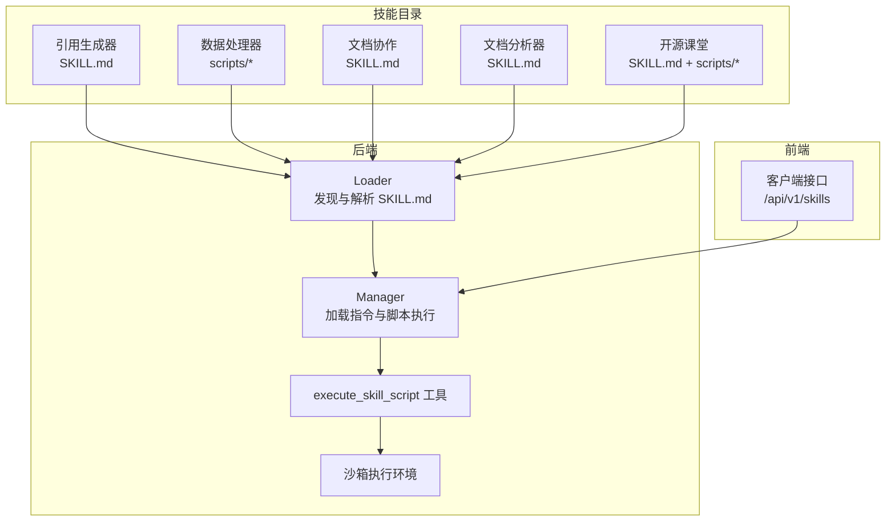
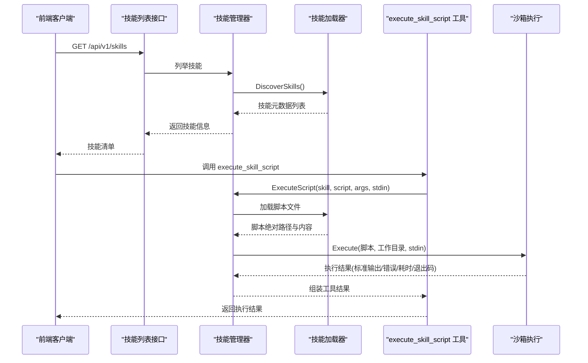
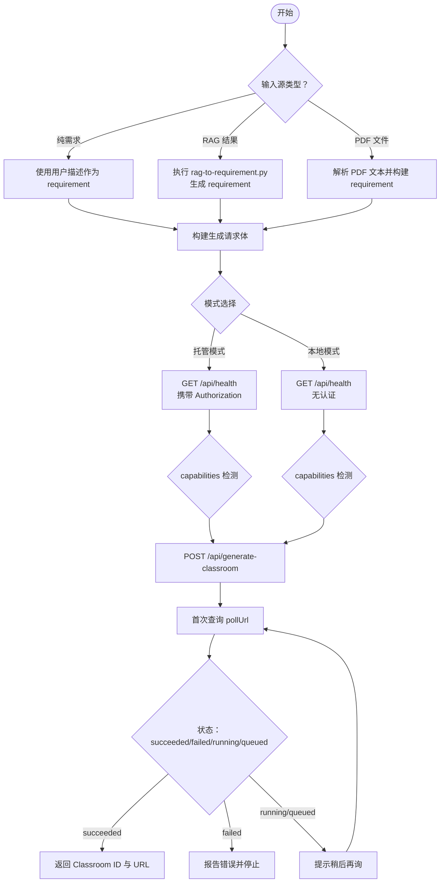
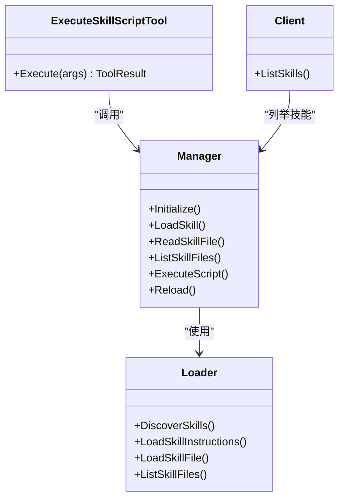

# 预加载技能

<cite>
**本文引用的文件**
- [skills\preloaded\citation-generator\SKILL.md](file://skills\preloaded\citation-generator\SKILL.md)
- [skills\preloaded\doc-coauthoring\SKILL.md](file://skills\preloaded\doc-coauthoring\SKILL.md)
- [skills\preloaded\document-analyzer\SKILL.md](file://skills\preloaded\document-analyzer\SKILL.md)
- [skills\preloaded\openmaic-classroom\SKILL.md](file://skills\preloaded\openmaic-classroom\SKILL.md)
- [skills\preloaded\openmaic-classroom\scripts\rag-to-requirement.py](file://skills\preloaded\openmaic-classroom\scripts\rag-to-requirement.py)
- [internal\agent\skills\loader.go](file://internal\agent\skills\loader.go)
- [internal\agent\skills\manager.go](file://internal\agent\skills\manager.go)
- [internal\agent\skills\skill.go](file://internal\agent\skills\skill.go)
- [internal\agent\tools\skill_execute.go](file://internal\agent\tools\skill_execute.go)
- [client\skill.go](file://client\skill.go)
</cite>

## 目录
1. [简介](#简介)
2. [项目结构](#项目结构)
3. [核心组件](#核心组件)
4. [架构总览](#架构总览)
5. [详细组件分析](#详细组件分析)
6. [依赖分析](#依赖分析)
7. [性能考虑](#性能考虑)
8. [故障排查指南](#故障排查指南)
9. [结论](#结论)
10. [附录](#附录)

## 简介
本文件为 WeKnora 预加载技能系统的全面技术文档，聚焦于技能目录结构、配置文件规范与脚本执行机制，系统性解析四类预加载技能的能力与实现要点：引用生成器、数据处理器（示例脚本）、文档协作者、文档分析器与开源课堂（OpenMAIC 教学助手）。文档还提供安装部署流程、依赖管理策略、版本兼容性处理、开发模板、测试验证方法与性能优化建议，帮助开发者快速上手并扩展开发。

## 项目结构
WeKnora 的预加载技能位于 skills/preloaded 目录下，每个技能以独立子目录组织，包含技能说明文件 SKILL.md 与可选的资源脚本。系统通过 Go 侧的技能加载器与管理器发现、加载与执行这些技能及其脚本；同时提供前端客户端接口以列举可用技能。

**图表来源**
- [internal\agent\skills\loader.go:28-104](file://internal\agent\skills\loader.go#L28-L104)
- [internal\agent\skills\manager.go:56-78](file://internal\agent\skills\manager.go#L56-L78)
- [internal\agent\tools\skill_execute.go:50-62](file://internal\agent\tools\skill_execute.go#L50-L62)
- [client\skill.go:21-34](file://client\skill.go#L21-L34)

**章节来源**
- [internal\agent\skills\loader.go:28-104](file://internal\agent\skills\loader.go#L28-L104)
- [internal\agent\skills\manager.go:56-78](file://internal\agent\skills\manager.go#L56-L78)
- [client\skill.go:21-34](file://client\skill.go#L21-L34)

## 核心组件
- 技能发现与解析（Loader）
  - 递归扫描技能目录，定位每个技能子目录下的 SKILL.md，解析 YAML 前言元数据，缓存技能元信息。
  - 支持按名称加载完整技能指令与列出技能目录下的文件。
- 技能管理（Manager）
  - 初始化时执行发现并缓存元数据；按需加载技能完整指令；提供脚本读取与执行能力；支持白名单控制与热重载。
- 脚本执行工具（execute_skill_script）
  - 将脚本在隔离沙箱中执行，限制网络访问，仅允许读取技能目录内的文件；支持通过 stdin 传参与命令行参数。
- 客户端接口
  - 提供列举预加载技能的 API，返回技能名称与描述及“技能可用”标志。

**章节来源**
- [internal\agent\skills\loader.go:106-192](file://internal\agent\skills\loader.go#L106-L192)
- [internal\agent\skills\manager.go:116-215](file://internal\agent\skills\manager.go#L116-L215)
- [internal\agent\tools\skill_execute.go:64-184](file://internal\agent\tools\skill_execute.go#L64-L184)
- [client\skill.go:21-34](file://client\skill.go#L21-L34)

## 架构总览
预加载技能遵循“渐进披露”模式：系统在不同阶段加载不同层次的信息，以平衡性能与功能。前端通过客户端接口获取技能清单；后端在初始化时完成技能发现与元数据缓存；当具体技能被调用时，按需加载完整指令；若技能包含脚本，通过工具与沙箱安全执行。

**图表来源**
- [client\skill.go:21-34](file://client\skill.go#L21-L34)
- [internal\agent\skills\manager.go:116-215](file://internal\agent\skills\manager.go#L116-L215)
- [internal\agent\tools\skill_execute.go:64-184](file://internal\agent\tools\skill_execute.go#L64-L184)

## 详细组件分析

### 引用生成器（Citation Generator）
- 设计理念
  - 为检索结果与知识库内容生成规范引用，支持来源标注与多种引用格式（默认简化格式、APA 等），并在回答末尾汇总参考文献列表。
- 功能特性
  - 来源标注：在知识点后即时标注来源（文档名、页码/段落）。
  - 格式化引用：内置默认简化格式与 APA 格式模板。
  - 参考文献列表：在回答末尾按编号列出完整参考文献。
- 使用指南
  - 检索时记录来源信息（文档名、页码、分块ID）；引用时立即标注；汇总时生成参考文献。
- 注意事项
  - 无页码时使用分块或段落编号；同一文档多次引用可合并；引用必须准确对应原文。

**章节来源**
- [skills\preloaded\citation-generator\SKILL.md:1-59](file://skills\preloaded\citation-generator\SKILL.md#L1-L59)

### 文档协作者（Doc Co-Authoring）
- 设计理念
  - 提供结构化协作写作工作流，引导用户通过“上下文收集 → 精炼与结构 → 读者测试”三个阶段产出高质量文档。
- 功能特性
  - 触发条件：提及写文档、提案、技术规范、决策文档等。
  - 三阶段流程：上下文收集（澄清元信息、拉取共享文档、检查图片 alt 文本）、精炼与结构（分节讨论、草稿与迭代修订）、读者测试（新鲜视角验证盲点）。
  - 工具与资产：支持通过 artifacts 或本地文件进行草稿与修订；提供链接以便持续编辑。
- 使用指南
  - 明确文档类型、受众与预期影响；提供背景与约束；在读者测试阶段以“无上下文”的视角验证可读性与一致性。

**章节来源**
- [skills\preloaded\doc-coauthoring\SKILL.md:1-376](file://skills\preloaded\doc-coauthoring\SKILL.md#L1-L376)

### 文档分析器（Document Analyzer）
- 设计理念
  - 对知识库文档进行深度结构分析与内容理解，辅助内容质量评估与组织方式解读。
- 功能特性
  - 结构分析：识别章节层级与组织架构。
  - 关键信息提取：核心主题、关键论点、支撑数据、结论建议。
  - 文档类型识别：报告、手册、论文、合同等。
  - 质量评估：完整性、一致性、清晰度。
- 输出格式
  - 标准化 Markdown 报告模板，包含基本信息、文档结构、核心内容与分析结论。

**章节来源**
- [skills\preloaded\document-analyzer\SKILL.md:1-81](file://skills\preloaded\document-analyzer\SKILL.md#L1-L81)

### 开源课堂（OpenMAIC Classroom）
- 设计理念
  - 将 RAG 检索结果或文档内容转换为 OpenMAIC 互动课程，支持托管模式与本地模式两种使用方式。
- 能力边界
  - 必须通过 WeKnora 注册的 MCP 工具调用 OpenMAIC API；脚本在 Docker 沙箱中执行且默认禁用网络访问。
- 模式选择
  - 托管模式（推荐快速使用）：open.maic.chat，使用访问码认证。
  - 本地模式：用户提供实例地址，WeKnora 会将 localhost/127.0.0.1 替换为 host.docker.internal 以适配容器网络。
- 使用场景
  - 将知识库内容、检索结果或上传 PDF 转换为教学课件/互动课堂。
- 工作流程
  - Phase 1：确认输入源（纯需求、RAG 检索结果、PDF 文件）。
  - Phase 1.1：当输入为 RAG 结果时，使用脚本将检索块转换为结构化 requirement。
  - Phase 2：构建生成请求体（requirement、PDF 内容、语言、可选功能开关等）。
  - Phase 3：通过 MCP 工具调用 OpenMAIC API，健康检查并 Feature Detection。
  - Phase 4：查询任务进度（仅单次查询，避免轮询）。
  - Phase 5：返回课程 ID 与可访问 URL。
- 错误处理
  - 连接失败、401（访问码无效）、403（配额用尽）、500（服务器错误）、Provider 配置错误等场景的处理指引。
- 多文档 → 课程集
  - 逐个生成并汇总返回所有课程 URL，避免并发导致配额冲突。

**图表来源**
- [skills\preloaded\openmaic-classroom\SKILL.md:66-238](file://skills\preloaded\openmaic-classroom\SKILL.md#L66-L238)
- [skills\preloaded\openmaic-classroom\scripts\rag-to-requirement.py:1-195](file://skills\preloaded\openmaic-classroom\scripts\rag-to-requirement.py#L1-L195)

**章节来源**
- [skills\preloaded\openmaic-classroom\SKILL.md:1-273](file://skills\preloaded\openmaic-classroom\SKILL.md#L1-L273)
- [skills\preloaded\openmaic-classroom\scripts\rag-to-requirement.py:1-195](file://skills\preloaded\openmaic-classroom\scripts\rag-to-requirement.py#L1-L195)

### 技能脚本执行机制（数据处理器示例）
- 目录与脚本
  - 数据处理器示例位于 skills/preloaded/data-processor/scripts/，包含若干 Python/Shell 脚本，用于演示如何在技能中嵌入自动化处理逻辑。
- 执行流程
  - 通过 execute_skill_script 工具调用，指定技能名与脚本相对路径，支持命令行参数与 stdin 输入。
  - 系统在沙箱中执行脚本，限制网络访问，仅允许读取技能目录内文件。
- 安全与隔离
  - 沙箱默认禁用网络访问；通过路径清理与绝对路径校验防止越权访问；超时或异常会被捕获并反馈。

**章节来源**
- [internal\agent\tools\skill_execute.go:64-184](file://internal\agent\tools\skill_execute.go#L64-L184)
- [internal\agent\skills\manager.go:174-215](file://internal\agent\skills\manager.go#L174-L215)

## 依赖分析
- 组件耦合与职责
  - Loader：负责文件系统扫描与元数据解析，低耦合、高内聚。
  - Manager：协调 Loader 与沙箱执行，提供白名单与缓存，承担较高协调职责。
  - execute_skill_script 工具：封装脚本执行细节，向上层提供统一调用接口。
  - 客户端：仅负责技能清单的获取，与技能执行解耦。
- 外部依赖与集成点
  - OpenMAIC API：通过 MCP 工具调用，需在 WeKnora 中注册并可用。
  - Docker 沙箱：脚本执行的隔离环境，网络默认禁用。
- 潜在循环依赖
  - 当前结构无明显循环依赖；工具与管理器通过接口调用，避免直接相互引用。

**图表来源**
- [internal\agent\skills\loader.go:10-26](file://internal\agent\skills\loader.go#L10-L26)
- [internal\agent\skills\manager.go:11-25](file://internal\agent\skills\manager.go#L11-L25)
- [internal\agent\tools\skill_execute.go:50-62](file://internal\agent\tools\skill_execute.go#L50-L62)
- [client\skill.go:8-19](file://client\skill.go#L8-L19)

**章节来源**
- [internal\agent\skills\loader.go:10-26](file://internal\agent\skills\loader.go#L10-L26)
- [internal\agent\skills\manager.go:11-25](file://internal\agent\skills\manager.go#L11-L25)
- [internal\agent\tools\skill_execute.go:50-62](file://internal\agent\tools\skill_execute.go#L50-L62)
- [client\skill.go:8-19](file://client\skill.go#L8-L19)

## 性能考虑
- 渐进披露与缓存
  - 发现阶段仅解析 YAML 前言元数据，避免一次性加载全部指令；后续按需加载完整指令与脚本。
- 并发与资源
  - 脚本执行在沙箱中串行或受控并发，避免资源争用；建议对长耗时任务设置合理超时与重试策略。
- I/O 与磁盘
  - 列表与读取文件采用绝对路径与路径清理，减少不必要的 I/O；对大型技能目录建议分层组织。
- 网络与外部服务
  - OpenMAIC 调用需健康检查与 Feature Detection，避免盲目请求；对托管模式建议缓存认证信息与基础 URL。

[本节为通用性能建议，无需特定文件引用]

## 故障排查指南
- 技能未显示
  - 确认技能目录存在且包含 SKILL.md；检查初始化是否成功；确认白名单配置。
- 脚本执行失败
  - 检查脚本路径是否相对技能根目录；确认脚本扩展名为可执行类型；查看沙箱执行结果中的退出码与错误信息。
- OpenMAIC 调用异常
  - 确认 MCP 工具已注册且可用；托管模式检查访问码与配额；本地模式检查地址替换为 host.docker.internal。
- 进度查询无效
  - 遵循“仅单次查询”的规则；在 running/queued 状态下提示用户稍后再询。

**章节来源**
- [internal\agent\skills\manager.go:174-215](file://internal\agent\skills\manager.go#L174-L215)
- [internal\agent\tools\skill_execute.go:105-112](file://internal\agent\tools\skill_execute.go#L105-L112)
- [skills\preloaded\openmaic-classroom\SKILL.md:244-253](file://skills\preloaded\openmaic-classroom\SKILL.md#L244-L253)

## 结论
WeKnora 预加载技能系统通过清晰的目录结构、严格的配置文件规范与安全的脚本执行机制，为引用生成、文档协作、内容分析与智能教学提供了可扩展的能力基座。系统采用渐进披露模式与沙箱隔离，兼顾性能与安全；通过 MCP 工具与健康检查，确保外部服务集成的稳定性。开发者可基于现有模板与工具快速扩展新技能，并遵循本文档的部署、测试与优化建议，实现高质量的技能交付。

[本节为总结性内容，无需特定文件引用]

## 附录

### 安装与部署流程
- 准备技能目录
  - 将技能目录放置于 skills/preloaded 下，确保每个技能包含 SKILL.md 与所需资源文件。
- 启动与初始化
  - 后端启动时自动执行技能发现与元数据缓存；前端通过 /api/v1/skills 获取技能清单。
- OpenMAIC 集成
  - 在 WeKnora 中注册 mcp_api_requester 服务；托管模式提供访问码；本地模式提供实例地址并进行地址替换。

**章节来源**
- [internal\agent\skills\manager.go:56-78](file://internal\agent\skills\manager.go#L56-L78)
- [client\skill.go:21-34](file://client\skill.go#L21-L34)
- [skills\preloaded\openmaic-classroom\SKILL.md:22-25](file://skills\preloaded\openmaic-classroom\SKILL.md#L22-L25)

### 依赖管理策略
- 脚本语言与解释器
  - 支持 Python、Bash、Node、Ruby、Perl、PHP 等脚本类型；系统根据扩展名识别解释器。
- 沙箱权限
  - 默认禁用网络访问；仅允许读取技能目录内文件；stdin 与命令行参数用于传参。
- 外部服务
  - 通过 MCP 工具统一调用外部 API；健康检查与 capabilities 检测保障可用性。

**章节来源**
- [internal\agent\skills\skill.go:185-218](file://internal\agent\skills\skill.go#L185-L218)
- [internal\agent\tools\skill_execute.go:31-38](file://internal\agent\tools\skill_execute.go#L31-L38)
- [skills\preloaded\openmaic-classroom\SKILL.md:141-160](file://skills\preloaded\openmaic-classroom\SKILL.md#L141-L160)

### 版本兼容性处理
- 脚本执行
  - 通过工具描述识别 HTTP 请求类 MCP 工具；若缺失则引导部署 mcp_api_requester。
- OpenMAIC 版本
  - 旧版本可能不返回 capabilities，此时不发送可选功能标志；新版本按 capabilities 动态启用功能。
- 地址替换
  - 本地模式下将 localhost/127.0.0.1 替换为 host.docker.internal，确保容器内可访问宿主机服务。

**章节来源**
- [skills\preloaded\openmaic-classroom\SKILL.md:128-140](file://skills\preloaded\openmaic-classroom\SKILL.md#L128-L140)
- [skills\preloaded\openmaic-classroom\SKILL.md:41-48](file://skills\preloaded\openmaic-classroom\SKILL.md#L41-L48)

### 开发模板与最佳实践
- 技能目录结构
  - SKILL.md（含 YAML 前言元数据）+ scripts/*（可选）+ 其他资源文件。
- 编写 SKILL.md
  - 明确名称、描述、核心能力、使用指南与注意事项；引用格式与示例应具体可操作。
- 脚本开发
  - 使用 stdin 接收内存数据，避免临时文件；提供错误处理与清晰输出；避免网络访问（除非经沙箱授权）。
- 测试验证
  - 通过 execute_skill_script 工具执行脚本并检查退出码、标准输出与标准错误；对 OpenMAIC 流程进行健康检查与进度查询测试。
- 性能优化
  - 控制脚本长度与复杂度；避免重复 I/O；合理设置超时；对长任务采用异步查询与幂等设计。

**章节来源**
- [internal\agent\tools\skill_execute.go:64-184](file://internal\agent\tools\skill_execute.go#L64-L184)
- [skills\preloaded\openmaic-classroom\SKILL.md:200-229](file://skills\preloaded\openmaic-classroom\SKILL.md#L200-L229)