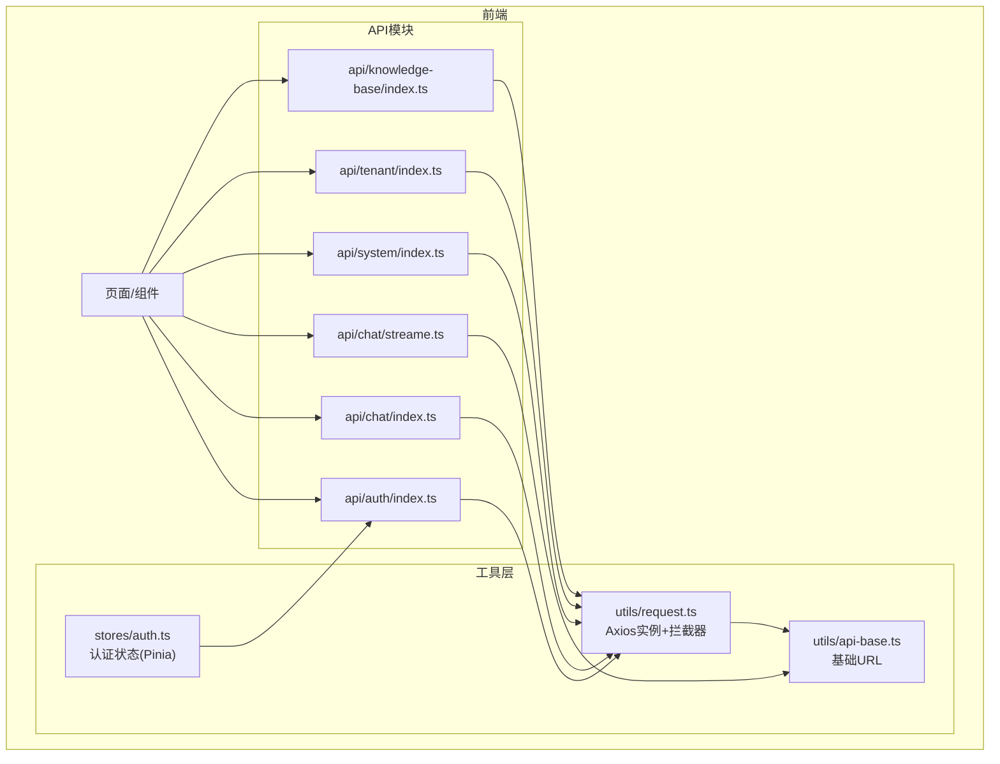
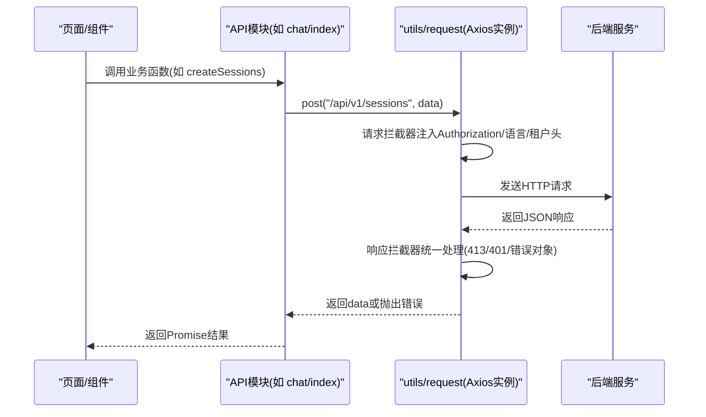
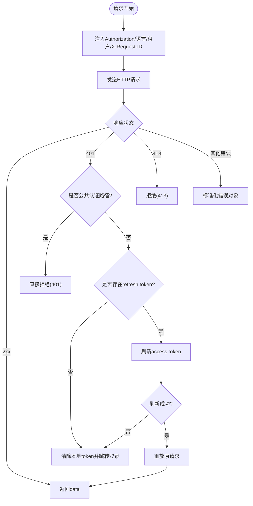
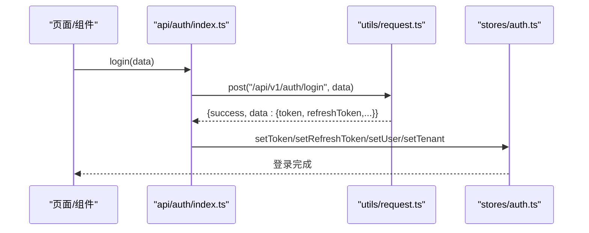
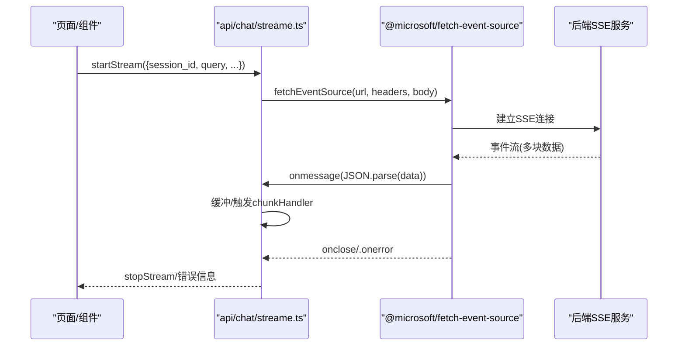
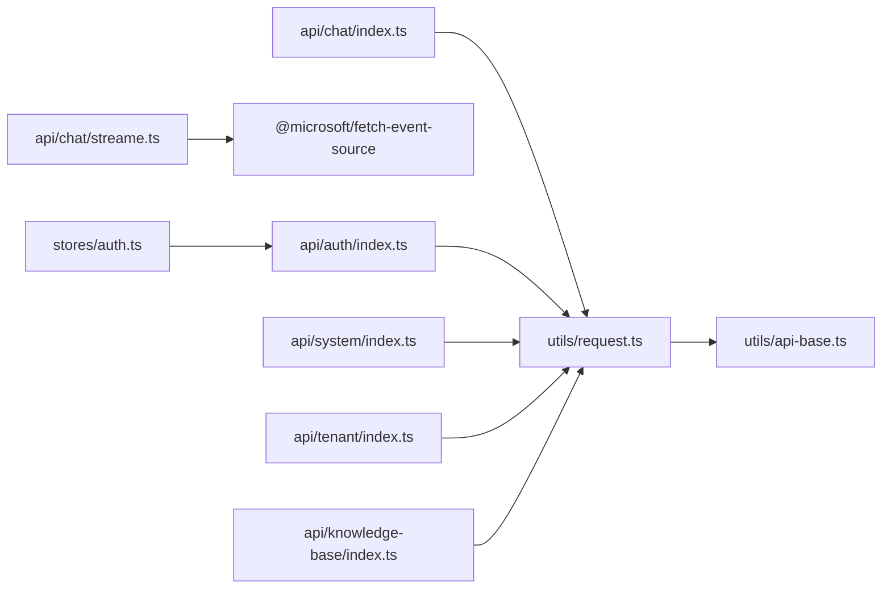

# API集成层

<cite>
**本文引用的文件**
- [frontend/src/utils/request.ts](file://frontend/src/utils/request.ts)
- [frontend/src/utils/api-base.ts](file://frontend/src/utils/api-base.ts)
- [frontend/src/stores/auth.ts](file://frontend/src/stores/auth.ts)
- [frontend/src/api/auth/index.ts](file://frontend/src/api/auth/index.ts)
- [frontend/src/api/chat/index.ts](file://frontend/src/api/chat/index.ts)
- [frontend/src/api/chat/streame.ts](file://frontend/src/api/chat/streame.ts)
- [frontend/src/api/system/index.ts](file://frontend/src/api/system/index.ts)
- [frontend/src/api/tenant/index.ts](file://frontend/src/api/tenant/index.ts)
- [frontend/src/api/knowledge-base/index.ts](file://frontend/src/api/knowledge-base/index.ts)
</cite>

## 目录
1. [简介](#简介)
2. [项目结构](#项目结构)
3. [核心组件](#核心组件)
4. [架构总览](#架构总览)
5. [详细组件分析](#详细组件分析)
6. [依赖关系分析](#依赖关系分析)
7. [性能考量](#性能考量)
8. [故障排除指南](#故障排除指南)
9. [结论](#结论)
10. [附录](#附录)

## 简介
本文件面向前端开发者，系统化梳理 WeKnora 的 API 集成层设计与实现，覆盖以下主题：
- HTTP 客户端配置与请求/响应拦截器
- API 模块化设计与接口封装策略
- 错误处理与认证令牌管理
- WebSocket/SSE 实时消息处理与连接状态监控
- 请求重试与超时策略
- API 文档生成、接口测试与性能监控集成建议
- 最佳实践与故障排除

## 项目结构
WeKnora 前端采用“按功能域划分”的模块组织方式，API 层位于 frontend/src/api 下，每个领域（如 auth、chat、knowledge-base、system、tenant 等）独立模块，统一通过 utils/request.ts 提供的 Axios 实例进行网络请求。

图表来源
- [frontend/src/utils/request.ts:1-260](file://frontend/src/utils/request.ts#L1-L260)
- [frontend/src/utils/api-base.ts:1-6](file://frontend/src/utils/api-base.ts#L1-L6)
- [frontend/src/stores/auth.ts:1-252](file://frontend/src/stores/auth.ts#L1-L252)
- [frontend/src/api/auth/index.ts:1-305](file://frontend/src/api/auth/index.ts#L1-L305)
- [frontend/src/api/chat/index.ts:1-66](file://frontend/src/api/chat/index.ts#L1-L66)
- [frontend/src/api/chat/streame.ts:1-198](file://frontend/src/api/chat/streame.ts#L1-L198)
- [frontend/src/api/system/index.ts:1-253](file://frontend/src/api/system/index.ts#L1-L253)
- [frontend/src/api/tenant/index.ts:1-87](file://frontend/src/api/tenant/index.ts#L1-L87)
- [frontend/src/api/knowledge-base/index.ts:1-378](file://frontend/src/api/knowledge-base/index.ts#L1-L378)

章节来源
- [frontend/src/utils/request.ts:1-260](file://frontend/src/utils/request.ts#L1-L260)
- [frontend/src/utils/api-base.ts:1-6](file://frontend/src/utils/api-base.ts#L1-L6)
- [frontend/src/stores/auth.ts:1-252](file://frontend/src/stores/auth.ts#L1-L252)
- [frontend/src/api/auth/index.ts:1-305](file://frontend/src/api/auth/index.ts#L1-L305)
- [frontend/src/api/chat/index.ts:1-66](file://frontend/src/api/chat/index.ts#L1-L66)
- [frontend/src/api/chat/streame.ts:1-198](file://frontend/src/api/chat/streame.ts#L1-L198)
- [frontend/src/api/system/index.ts:1-253](file://frontend/src/api/system/index.ts#L1-L253)
- [frontend/src/api/tenant/index.ts:1-87](file://frontend/src/api/tenant/index.ts#L1-L87)
- [frontend/src/api/knowledge-base/index.ts:1-378](file://frontend/src/api/knowledge-base/index.ts#L1-L378)

## 核心组件
- HTTP 客户端与拦截器
  - 基于 Axios 创建实例，设置基础 URL、超时、通用请求头（含 X-Request-ID）
  - 请求拦截器：注入 Authorization、Accept-Language、跨租户 X-Tenant-ID、动态 X-Request-ID
  - 响应拦截器：统一提取 data、处理 413、401（含刷新令牌队列）、标准化错误对象
- 认证与状态管理
  - Pinia Store 管理用户、租户、令牌、当前知识库、跨租户选择等
  - 本地持久化 localStorage/sessionStorage
- API 模块化
  - 每个领域一个模块，导出语义化函数，内部统一调用 utils/request.ts
  - 支持普通请求与 SSE 流式请求两种模式
- 实时消息与流式渲染
  - SSE 使用 @microsoft/fetch-event-source，提供 startStream/onChunk/stopStream 生命周期
  - 跨租户头、语言头、令牌头与请求体参数均在流式请求中复用

章节来源
- [frontend/src/utils/request.ts:14-21](file://frontend/src/utils/request.ts#L14-L21)
- [frontend/src/utils/request.ts:29-62](file://frontend/src/utils/request.ts#L29-L62)
- [frontend/src/utils/request.ts:94-217](file://frontend/src/utils/request.ts#L94-L217)
- [frontend/src/stores/auth.ts:1-252](file://frontend/src/stores/auth.ts#L1-L252)
- [frontend/src/api/chat/streame.ts:20-198](file://frontend/src/api/chat/streame.ts#L20-L198)

## 架构总览
下图展示从前端组件到 API 模块、再到 HTTP 层的整体调用链路与数据流。

图表来源
- [frontend/src/api/chat/index.ts:1-66](file://frontend/src/api/chat/index.ts#L1-L66)
- [frontend/src/utils/request.ts:14-21](file://frontend/src/utils/request.ts#L14-L21)
- [frontend/src/utils/request.ts:29-62](file://frontend/src/utils/request.ts#L29-L62)
- [frontend/src/utils/request.ts:94-217](file://frontend/src/utils/request.ts#L94-L217)

## 详细组件分析

### HTTP 客户端与拦截器
- 实例配置
  - 基础 URL 来源于 getApiBaseUrl，默认为空字符串（开发时由 Vite 代理 /api）
  - 超时 30000ms，Content-Type 默认 application/json
  - 每次请求生成随机 X-Request-ID，便于后端追踪
- 请求拦截器
  - 注入 Authorization: Bearer token
  - 注入 Accept-Language：优先 i18n 当前语言，其次 localStorage
  - 跨租户访问：当选择的租户 ID 与默认租户不同，注入 X-Tenant-ID
  - 每次请求更新 X-Request-ID
- 响应拦截器
  - 成功：仅透传 data
  - 失败：区分无网络、413、401 等场景，标准化错误对象（包含 status/message/原始数据）
  - 401 专用处理：
    - 公共认证路径（如 /auth/auto-setup、/auth/login、/auth/register、/auth/oidc/）直接拒绝
    - 其他 401：若存在 refresh token，进入刷新流程；刷新成功则重放原请求；刷新失败则清空本地 token 并跳转登录
  - 刷新令牌并发控制：isRefreshing 标志 + failedQueue 队列，避免重复刷新

图表来源
- [frontend/src/utils/request.ts:29-62](file://frontend/src/utils/request.ts#L29-L62)
- [frontend/src/utils/request.ts:94-217](file://frontend/src/utils/request.ts#L94-L217)

章节来源
- [frontend/src/utils/request.ts:14-21](file://frontend/src/utils/request.ts#L14-L21)
- [frontend/src/utils/request.ts:29-62](file://frontend/src/utils/request.ts#L29-L62)
- [frontend/src/utils/request.ts:94-217](file://frontend/src/utils/request.ts#L94-L217)
- [frontend/src/utils/api-base.ts:1-6](file://frontend/src/utils/api-base.ts#L1-L6)

### 认证与令牌管理
- 令牌存储与刷新
  - 本地存储 weknora_token、weknora_refresh_token、weknora_user、weknora_tenant
  - 刷新流程：调用 auth 模块 refreshToken 接口，成功后更新本地存储并重放原请求
  - 并发刷新：isRefreshing + failedQueue 队列，确保只刷新一次
- 跨租户访问
  - 通过 localStorage weknora_selected_tenant_id 与 weknora_tenant 默认租户对比，决定是否注入 X-Tenant-ID
- Pinia Store
  - 管理用户、租户、令牌、知识库、当前租户选择、Lite 模式等
  - 提供登录、登出、初始化等操作，并持久化到 localStorage

图表来源
- [frontend/src/api/auth/index.ts:135-145](file://frontend/src/api/auth/index.ts#L135-L145)
- [frontend/src/utils/request.ts:14-21](file://frontend/src/utils/request.ts#L14-L21)
- [frontend/src/stores/auth.ts:59-67](file://frontend/src/stores/auth.ts#L59-L67)

章节来源
- [frontend/src/api/auth/index.ts:1-305](file://frontend/src/api/auth/index.ts#L1-L305)
- [frontend/src/stores/auth.ts:1-252](file://frontend/src/stores/auth.ts#L1-L252)
- [frontend/src/utils/request.ts:134-183](file://frontend/src/utils/request.ts#L134-L183)

### API 模块化设计与接口封装
- 设计原则
  - 每个领域一个模块，函数名即接口语义（如 createSessions、getSessionsList、knowledgeChat）
  - 统一使用 utils/request.ts 的 get/post/put/del/postChat 等方法
  - 对外返回 Promise，内部对异常进行兜底包装，保证调用方拿到统一的 {success,message,data} 结构
- 文件组织
  - auth：登录、注册、OIDC、自动初始化、用户/租户信息、令牌刷新、校验、登出
  - chat：会话、消息、Agent/知识问答、停止、批量删除
  - system：系统信息、Agent/对话配置、提示词模板、解析引擎、存储引擎
  - tenant：租户列表/搜索
  - knowledge-base：知识库 CRUD、文件上传/下载/预览、FAQ 导入/导出/查询、标签管理、语义检索

章节来源
- [frontend/src/api/auth/index.ts:1-305](file://frontend/src/api/auth/index.ts#L1-L305)
- [frontend/src/api/chat/index.ts:1-66](file://frontend/src/api/chat/index.ts#L1-L66)
- [frontend/src/api/system/index.ts:1-253](file://frontend/src/api/system/index.ts#L1-L253)
- [frontend/src/api/tenant/index.ts:1-87](file://frontend/src/api/tenant/index.ts#L1-L87)
- [frontend/src/api/knowledge-base/index.ts:1-378](file://frontend/src/api/knowledge-base/index.ts#L1-L378)

### 实时消息与流式处理
- SSE 流式聊天
  - 使用 @microsoft/fetch-event-source，支持 startStream/onChunk/stopStream 生命周期
  - 自动注入 Authorization、Accept-Language、X-Tenant-ID、X-Request-ID
  - 支持多种参数：knowledge_base_ids、knowledge_ids、agent_id、web_search_enabled、enable_memory、summary_model_id、mcp_service_ids、mentioned_items、images、attachment_uploads 等
  - onmessage 中将 JSON 数据推入缓冲区，可注册 chunkHandler 进行增量渲染
- 传统 HTTP 聊天
  - chat/index.ts 提供非流式的 knowledgeChat/agentChat，使用 utils/request.ts 的 postChat 方法

图表来源
- [frontend/src/api/chat/streame.ts:33-169](file://frontend/src/api/chat/streame.ts#L33-L169)
- [frontend/src/utils/request.ts:240-247](file://frontend/src/utils/request.ts#L240-L247)

章节来源
- [frontend/src/api/chat/streame.ts:1-198](file://frontend/src/api/chat/streame.ts#L1-L198)
- [frontend/src/api/chat/index.ts:17-34](file://frontend/src/api/chat/index.ts#L17-L34)

### 错误处理流程
- 网络错误：无 error.response 时，统一提示网络错误
- 413：文件过大，返回带 status 413 的标准化错误对象
- 401：
  - 公共认证路径：直接拒绝，提示无效凭据
  - 其他路径：进入刷新流程；刷新失败则清空本地 token 并跳转登录
- 其他错误：提取后端返回的 message/error.message/message 字段，统一包装为 {status,message,...}

章节来源
- [frontend/src/utils/request.ts:104-217](file://frontend/src/utils/request.ts#L104-L217)

### 超时与重试策略
- 超时：Axios 实例默认 30000ms
- 重试：当前实现未内置自动重试；建议在调用侧根据业务场景对关键请求做幂等重试（例如登录、令牌刷新、上传等）

章节来源
- [frontend/src/utils/request.ts](file://frontend/src/utils/request.ts#L16)
- [frontend/src/utils/request.ts:118-129](file://frontend/src/utils/request.ts#L118-L129)

### WebSocket 连接管理
- 当前代码库未发现 WebSocket 客户端实现；SSE 已覆盖主要实时交互场景
- 若未来引入 WebSocket，建议：
  - 单例连接管理器，集中处理连接、断线重连、心跳、订阅主题
  - 状态机：Idle -> Connecting -> Connected -> Reconnecting -> Closed
  - 与 Pinia Store 集成，暴露连接状态与事件派发

[本节为概念性建议，不对应具体源文件]

## 依赖关系分析
- 模块耦合
  - API 模块仅依赖 utils/request.ts，保持低耦合
  - chat/streame.ts 依赖 @microsoft/fetch-event-source，独立于 Axios
  - stores/auth.ts 为全局状态，被各模块间接使用（如登录后写入 token）
- 外部依赖
  - axios：HTTP 客户端
  - @microsoft/fetch-event-source：SSE 客户端
  - pinia：状态管理
  - vue：响应式与生命周期钩子

图表来源
- [frontend/src/api/chat/index.ts](file://frontend/src/api/chat/index.ts#L1)
- [frontend/src/api/chat/streame.ts](file://frontend/src/api/chat/streame.ts#L1)
- [frontend/src/api/auth/index.ts](file://frontend/src/api/auth/index.ts#L1)
- [frontend/src/api/system/index.ts](file://frontend/src/api/system/index.ts#L1)
- [frontend/src/api/tenant/index.ts](file://frontend/src/api/tenant/index.ts#L1)
- [frontend/src/api/knowledge-base/index.ts](file://frontend/src/api/knowledge-base/index.ts#L1)
- [frontend/src/stores/auth.ts](file://frontend/src/stores/auth.ts#L1)
- [frontend/src/utils/request.ts](file://frontend/src/utils/request.ts#L1)
- [frontend/src/utils/api-base.ts](file://frontend/src/utils/api-base.ts#L1)

章节来源
- [frontend/src/api/chat/index.ts:1-66](file://frontend/src/api/chat/index.ts#L1-L66)
- [frontend/src/api/chat/streame.ts:1-198](file://frontend/src/api/chat/streame.ts#L1-L198)
- [frontend/src/api/auth/index.ts:1-305](file://frontend/src/api/auth/index.ts#L1-L305)
- [frontend/src/api/system/index.ts:1-253](file://frontend/src/api/system/index.ts#L1-L253)
- [frontend/src/api/tenant/index.ts:1-87](file://frontend/src/api/tenant/index.ts#L1-L87)
- [frontend/src/api/knowledge-base/index.ts:1-378](file://frontend/src/api/knowledge-base/index.ts#L1-L378)
- [frontend/src/stores/auth.ts:1-252](file://frontend/src/stores/auth.ts#L1-L252)
- [frontend/src/utils/request.ts:1-260](file://frontend/src/utils/request.ts#L1-L260)
- [frontend/src/utils/api-base.ts:1-6](file://frontend/src/utils/api-base.ts#L1-L6)

## 性能考量
- 请求头与缓存
  - 每次请求生成 X-Request-ID，便于端到端追踪
  - Accept-Language 由 i18n 动态注入，减少重复翻译成本
- SSE 流式渲染
  - 使用缓冲与定时器控制渲染节奏，避免频繁重绘
  - 支持 onChunk 回调，便于按块增量渲染
- 上传与下载
  - 上传使用 multipart/form-data，并支持进度回调
  - 下载使用 blob，避免内存峰值过高
- 超时与重试
  - 建议对关键请求在调用侧做幂等重试，结合 X-Request-ID 去重
- 监控集成
  - 建议在拦截器中埋点记录请求耗时、状态码分布、错误类型
  - 与前端监控 SDK（如埋点/日志）集成，上报异常与性能指标

[本节提供通用建议，不直接分析具体文件]

## 故障排除指南
- 登录/鉴权问题
  - 确认 localStorage 中 weknora_token 是否存在
  - 若出现 401，检查是否命中公共认证路径；若是，确认凭证正确
  - 若触发刷新，确认 weknora_refresh_token 是否存在；刷新失败将清空本地 token 并跳转登录
- 跨租户访问
  - 确认 weknora_selected_tenant_id 与 weknora_tenant 默认租户是否一致；不一致时会注入 X-Tenant-ID
- 文件上传/下载
  - 413：调整文件大小或后端配置
  - 下载返回 blob，注意在浏览器中正确处理
- SSE 流式聊天
  - 确认已注入 Authorization 与 X-Tenant-ID
  - 检查 onerror 回调中的错误信息，必要时调用 stopStream 清理
- 网络异常
  - 无 error.response 时统一提示网络错误，检查代理与 CORS 配置

章节来源
- [frontend/src/utils/request.ts:107-193](file://frontend/src/utils/request.ts#L107-L193)
- [frontend/src/utils/request.ts:160-183](file://frontend/src/utils/request.ts#L160-L183)
- [frontend/src/api/chat/streame.ts:149-168](file://frontend/src/api/chat/streame.ts#L149-L168)

## 结论
WeKnora 的 API 集成层以 Axios 为核心，通过拦截器实现统一的认证、国际化、跨租户与错误处理；以模块化 API 文件承载业务语义；以 SSE 支持流式交互。整体设计清晰、职责分离明确，具备良好的扩展性与可维护性。建议后续补充 WebSocket 支持、自动重试与性能监控埋点，进一步完善实时通信与可观测性。

## 附录
- API 文档生成
  - 可基于 TypeScript 类型与注释生成 OpenAPI/Swagger 文档（推荐使用 typed-api-docs 或类似工具）
- 接口测试
  - 建议为每个 API 模块编写单元测试，覆盖成功/失败/401/413 等场景
- 性能监控
  - 在 utils/request.ts 中增加请求耗时统计与错误上报
  - 对 SSE 连接建立耗时、首包延迟、渲染节流效果进行观测

[本节为通用建议，不直接分析具体文件]