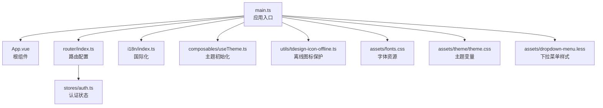
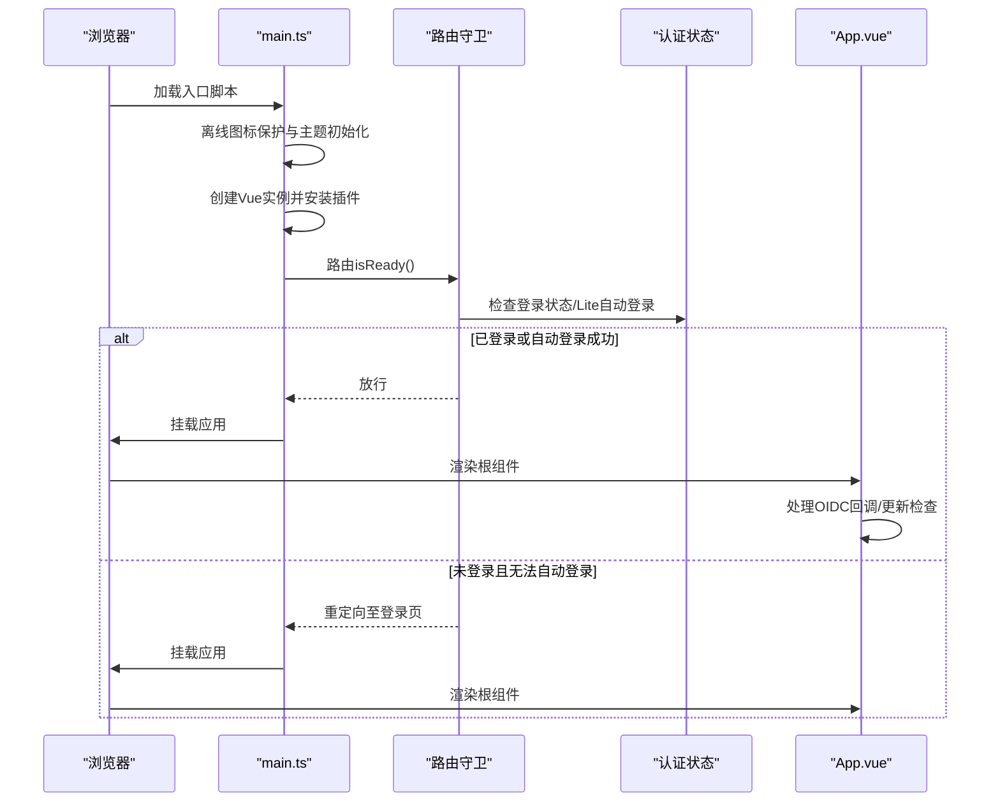
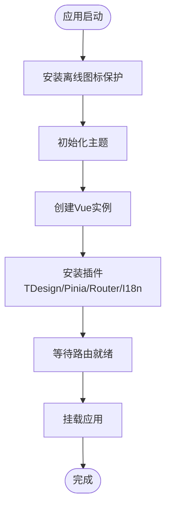
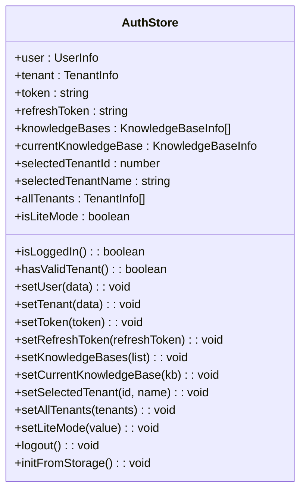
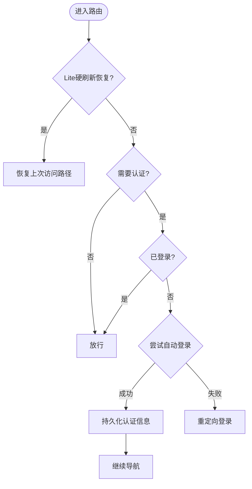
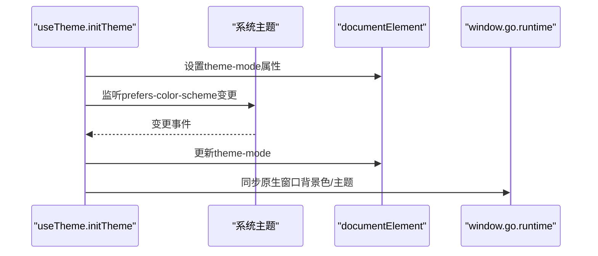
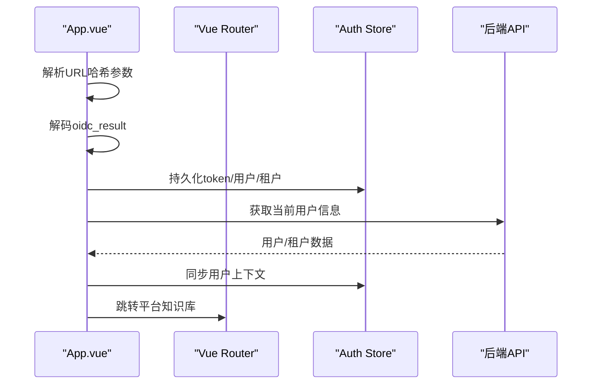
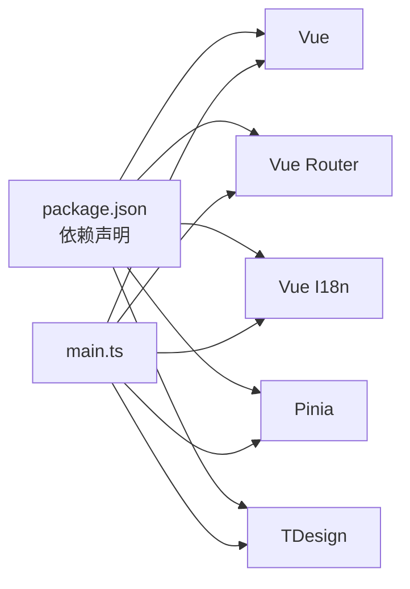

# Vue.js应用入口

<cite>
**本文档引用的文件**
- [main.ts](file://frontend/src/main.ts)
- [App.vue](file://frontend/src/App.vue)
- [router/index.ts](file://frontend/src/router/index.ts)
- [i18n/index.ts](file://frontend/src/i18n/index.ts)
- [composables/useTheme.ts](file://frontend/src/composables/useTheme.ts)
- [stores/auth.ts](file://frontend/src/stores/auth.ts)
- [utils/tdesign-icon-offline.ts](file://frontend/src/utils/tdesign-icon-offline.ts)
- [package.json](file://frontend/package.json)
- [vite.config.ts](file://frontend/vite.config.ts)
- [assets/fonts.css](file://frontend/src/assets/fonts.css)
- [assets/theme/theme.css](file://frontend/src/assets/theme/theme.css)
- [assets/dropdown-menu.less](file://frontend/src/assets/dropdown-menu.less)
</cite>

## 目录
1. [简介](#简介)
2. [项目结构](#项目结构)
3. [核心组件](#核心组件)
4. [架构总览](#架构总览)
5. [详细组件分析](#详细组件分析)
6. [依赖关系分析](#依赖关系分析)
7. [性能考虑](#性能考虑)
8. [故障排除指南](#故障排除指南)
9. [结论](#结论)

## 简介
本文件聚焦WeKnora前端Vue.js应用的入口初始化流程，系统性阐述从应用创建到插件安装、状态管理、路由配置、国际化与主题初始化的完整链路。同时覆盖TDesign组件库集成、字体资源加载与静态资源管理策略，以及Wails桌面应用桥接机制、运行时环境检测与自动登录流程。文档还提供应用启动优化策略、错误边界处理与性能监控集成建议，帮助前端开发者建立完整的应用初始化最佳实践。

## 项目结构
前端应用位于`frontend/src`目录，入口文件为`main.ts`，负责创建Vue实例、安装插件、初始化主题与国际化，并在路由就绪后挂载应用。路由配置位于`router/index.ts`，包含认证守卫与Lite版自动登录逻辑。国际化与主题分别在`i18n/index.ts`与`composables/useTheme.ts`中实现。静态资源包括字体、主题CSS与全局下拉菜单样式，位于`assets`目录。

**图表来源**
- [main.ts:1-31](file://frontend/src/main.ts#L1-L31)
- [App.vue:1-209](file://frontend/src/App.vue#L1-L209)
- [router/index.ts:1-232](file://frontend/src/router/index.ts#L1-L232)
- [i18n/index.ts:1-26](file://frontend/src/i18n/index.ts#L1-L26)
- [composables/useTheme.ts:1-81](file://frontend/src/composables/useTheme.ts#L1-L81)
- [utils/tdesign-icon-offline.ts:1-82](file://frontend/src/utils/tdesign-icon-offline.ts#L1-L82)
- [assets/fonts.css:1-6](file://frontend/src/assets/fonts.css#L1-L6)
- [assets/theme/theme.css:1-131](file://frontend/src/assets/theme/theme.css#L1-L131)
- [assets/dropdown-menu.less:1-323](file://frontend/src/assets/dropdown-menu.less#L1-L323)

**章节来源**
- [main.ts:1-31](file://frontend/src/main.ts#L1-L31)
- [vite.config.ts:1-56](file://frontend/vite.config.ts#L1-L56)

## 核心组件
- 应用入口与插件安装顺序：在创建Vue实例前，先执行离线图标保护与主题初始化，随后按序安装TDesign、Pinia、路由与国际化插件，最后等待路由就绪再挂载，避免首屏闪烁与跳转延迟。
- 根组件职责：集中处理OIDC回调、更新检查触发、TDesign全局语言配置与全局样式注入。
- 路由守卫与自动登录：在认证缺失时尝试Lite版自动登录，成功后持久化认证信息并继续导航。
- 国际化与主题：i18n根据localStorage选择语言；主题支持light/dark/system，同步Wails原生窗口背景色。
- 静态资源：字体、主题变量与下拉菜单样式统一管理，确保跨组件一致性。

**章节来源**
- [main.ts:15-31](file://frontend/src/main.ts#L15-L31)
- [App.vue:11-135](file://frontend/src/App.vue#L11-L135)
- [router/index.ts:168-222](file://frontend/src/router/index.ts#L168-L222)
- [i18n/index.ts:14-26](file://frontend/src/i18n/index.ts#L14-L26)
- [composables/useTheme.ts:68-81](file://frontend/src/composables/useTheme.ts#L68-L81)

## 架构总览
应用初始化的关键流程如下：

**图表来源**
- [main.ts:15-31](file://frontend/src/main.ts#L15-L31)
- [router/index.ts:168-222](file://frontend/src/router/index.ts#L168-L222)
- [App.vue:137-163](file://frontend/src/App.vue#L137-L163)

## 详细组件分析

### 应用入口初始化流程
- 关键步骤
  - 离线图标保护：在Vue挂载前注入占位节点，阻止TDesign图标组件请求外部CDN，保证内网可用性。
  - 主题初始化：读取localStorage中的主题偏好，应用到documentElement并同步Wails原生窗口背景色。
  - 插件安装顺序：TDesign → Pinia → Router → I18n，确保后续组件能正确使用全局能力。
  - 路由就绪挂载：等待router.isReady()完成后挂载，避免首屏路由跳转闪烁。
- 最佳实践
  - 将耗时初始化（如图标保护、主题）前置，减少首次交互延迟。
  - 严格控制插件安装顺序，避免依赖未就绪导致的异常。

**图表来源**
- [main.ts:15-31](file://frontend/src/main.ts#L15-L31)
- [utils/tdesign-icon-offline.ts:39-81](file://frontend/src/utils/tdesign-icon-offline.ts#L39-L81)
- [composables/useTheme.ts:68-81](file://frontend/src/composables/useTheme.ts#L68-L81)

**章节来源**
- [main.ts:15-31](file://frontend/src/main.ts#L15-L31)
- [utils/tdesign-icon-offline.ts:1-82](file://frontend/src/utils/tdesign-icon-offline.ts#L1-L82)
- [composables/useTheme.ts:68-81](file://frontend/src/composables/useTheme.ts#L68-L81)

### Pinia状态管理
- 认证状态存储：封装用户、租户、令牌、知识库、当前KB、选中租户、Lite模式等状态，提供持久化与计算属性。
- 生命周期：应用启动时从localStorage恢复状态，支持logout清理并移除相关存储项。
- 使用建议：在路由守卫与业务组件中通过store访问认证上下文，避免重复请求。

**图表来源**
- [stores/auth.ts:1-252](file://frontend/src/stores/auth.ts#L1-L252)

**章节来源**
- [stores/auth.ts:1-252](file://frontend/src/stores/auth.ts#L1-L252)

### 路由配置与自动登录
- 路由守卫策略
  - Lite版硬刷新恢复：记录上次访问路径，若命中安全目标且默认入口，优先恢复。
  - 登录拦截：未登录且需要认证的路由重定向至登录页；已登录访问登录页重定向至知识库列表。
  - 自动登录：在未登录且允许自动设置时，调用autoSetup接口尝试Lite自动登录，成功后持久化并继续导航。
- 导航后处理：记录平台子路由访问路径到sessionStorage，便于下次恢复。

**图表来源**
- [router/index.ts:168-222](file://frontend/src/router/index.ts#L168-L222)

**章节来源**
- [router/index.ts:10-29](file://frontend/src/router/index.ts#L10-L29)
- [router/index.ts:168-222](file://frontend/src/router/index.ts#L168-L222)

### 国际化设置
- 语言选择：从localStorage读取保存的语言，默认zh-CN；创建i18n实例并启用全局注入。
- 语言映射：根组件根据当前locale动态选择TDesign全局语言配置，确保组件文案与界面语言一致。

**章节来源**
- [i18n/index.ts:14-26](file://frontend/src/i18n/index.ts#L14-L26)
- [App.vue:22-29](file://frontend/src/App.vue#L22-L29)

### 主题初始化与Wails桥接
- 主题模式：支持light/dark/system，读取localStorage并监听系统主题变化，动态应用到documentElement。
- Wails桥接：当存在window.go.runtime时，同步原生窗口背景色与深浅主题，减少Ctrl+R整窗白闪。
- 样式同步：通过CSS变量与主题类名，确保全局样式与组件库主题一致。

**图表来源**
- [composables/useTheme.ts:68-81](file://frontend/src/composables/useTheme.ts#L68-L81)

**章节来源**
- [composables/useTheme.ts:16-50](file://frontend/src/composables/useTheme.ts#L16-L50)
- [composables/useTheme.ts:68-81](file://frontend/src/composables/useTheme.ts#L68-L81)

### TDesign组件库集成与字体资源
- 组件库集成：在main.ts中引入tdesign-vue-next及其全局样式，确保组件样式与主题一致。
- 图标离线保护：通过占位节点阻断图标组件对外网CDN的请求，避免无外网环境下的图标不显示。
- 字体资源：在assets/fonts.css中声明自定义字体，配合主题CSS与全局样式提升阅读体验。
- 全局下拉菜单样式：通过dropdown-menu.less统一popup/dropdown菜单的外观与交互，提升一致性。

**章节来源**
- [main.ts:6-11](file://frontend/src/main.ts#L6-L11)
- [utils/tdesign-icon-offline.ts:1-82](file://frontend/src/utils/tdesign-icon-offline.ts#L1-L82)
- [assets/fonts.css:1-6](file://frontend/src/assets/fonts.css#L1-L6)
- [assets/dropdown-menu.less:1-323](file://frontend/src/assets/dropdown-menu.less#L1-L323)

### OIDC回调与自动登录流程
- OIDC回调处理：根组件在mounted时解析URL哈希中的oidc_result，解码并校验登录结果，成功后持久化token与用户/租户信息并跳转平台知识库。
- 错误处理：出现错误时清空状态、提示错误消息并重定向至登录页。
- 自动更新检查：启动后延时触发更新检查，后续周期性检查，受设置项控制。

**图表来源**
- [App.vue:91-135](file://frontend/src/App.vue#L91-L135)
- [App.vue:137-163](file://frontend/src/App.vue#L137-L163)

**章节来源**
- [App.vue:31-135](file://frontend/src/App.vue#L31-L135)

## 依赖关系分析
- 插件依赖：main.ts中插件安装顺序直接影响后续组件行为，必须遵循TDesign → Pinia → Router → I18n的顺序。
- 资源依赖：字体与主题CSS需在应用挂载前加载，确保组件渲染时具备正确的样式基础。
- 运行时依赖：Wails桥接仅在桌面壳环境中可用，需进行环境检测与降级处理。

**图表来源**
- [package.json:14-38](file://frontend/package.json#L14-L38)
- [main.ts:1-12](file://frontend/src/main.ts#L1-L12)

**章节来源**
- [package.json:14-38](file://frontend/package.json#L14-L38)
- [main.ts:1-12](file://frontend/src/main.ts#L1-L12)

## 性能考虑
- 启动优化
  - 将离线图标保护与主题初始化前置，减少首屏样式抖动。
  - 路由就绪后再挂载，避免导航闪烁。
  - 懒加载路由视图组件，降低初始包体积。
- 资源管理
  - 字体与主题CSS采用CSS变量，减少重绘与回流。
  - 下拉菜单样式集中管理，避免重复样式计算。
- 运行时监控
  - 在根组件中集成性能指标采集（如首屏时间、路由切换耗时），结合浏览器性能API与日志上报。
  - 对自动登录与更新检查等异步任务增加超时与重试策略，提升稳定性。

[本节为通用指导，无需特定文件引用]

## 故障排除指南
- 图标不显示
  - 确认离线图标保护已在挂载前执行。
  - 检查本地字体资源是否正确加载。
- 主题不生效
  - 检查localStorage中的主题偏好值与documentElement的theme-mode属性。
  - 确认Wails桥接可用时原生窗口背景色已同步。
- 自动登录失败
  - 查看路由守卫中的autoSetup调用与错误标记逻辑。
  - 确认认证状态存储已正确持久化。
- OIDC回调异常
  - 检查URL哈希解析与结果解码流程，确保错误分支正确清理状态并提示用户。

**章节来源**
- [utils/tdesign-icon-offline.ts:39-81](file://frontend/src/utils/tdesign-icon-offline.ts#L39-L81)
- [composables/useTheme.ts:68-81](file://frontend/src/composables/useTheme.ts#L68-L81)
- [router/index.ts:168-222](file://frontend/src/router/index.ts#L168-L222)
- [App.vue:91-135](file://frontend/src/App.vue#L91-L135)

## 结论
WeKnora前端应用入口通过严格的初始化顺序与完善的资源管理，实现了稳定、可维护的启动流程。结合Pinia状态管理、TDesign组件库、国际化与主题系统，以及Wails桌面桥接与自动登录机制，为用户提供一致且高性能的使用体验。建议在实际开发中遵循本文档的最佳实践，持续优化启动性能与错误处理，确保应用在多环境下的可靠性与可扩展性。