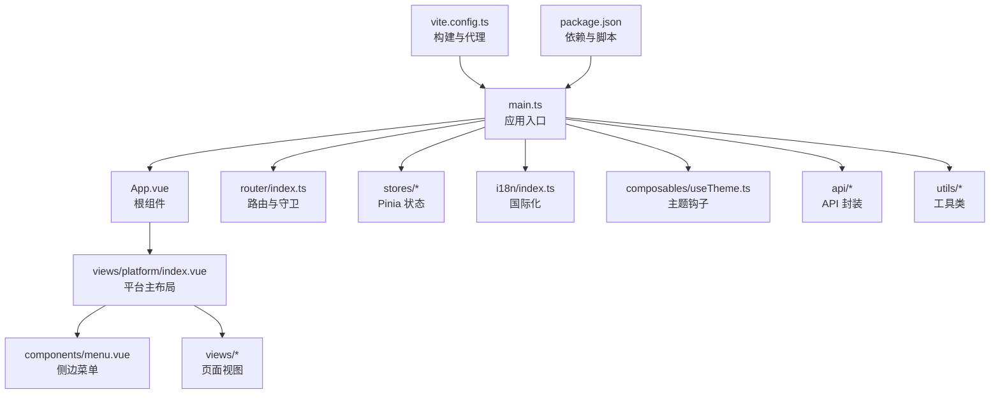
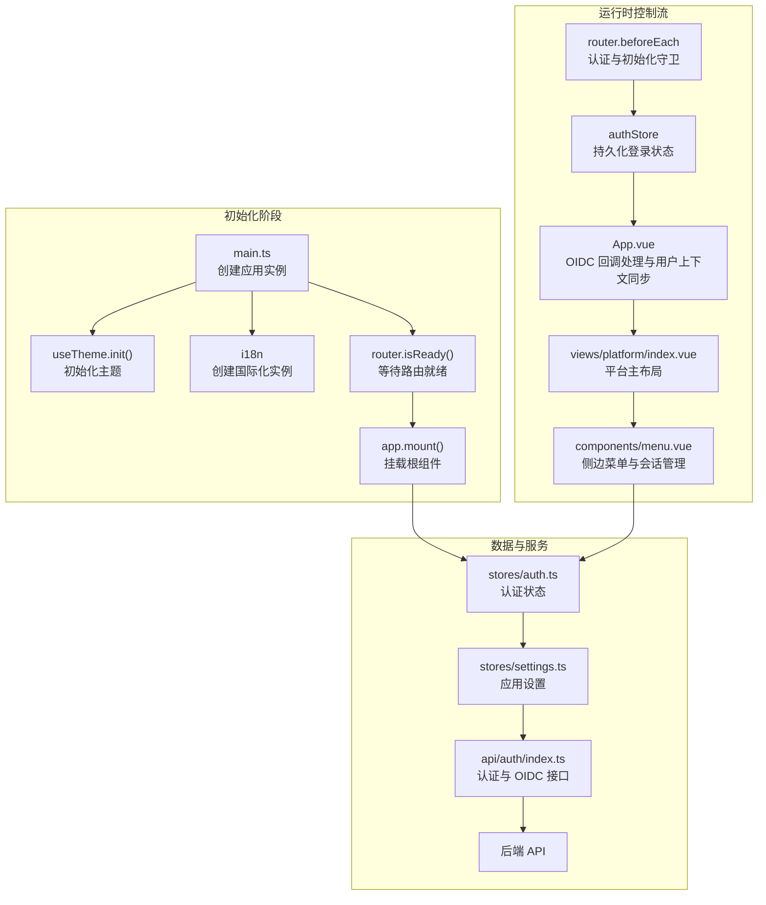
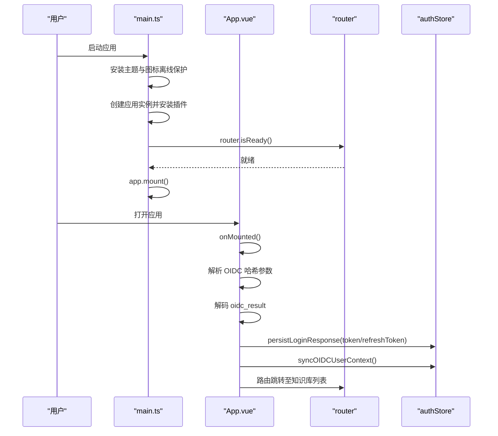
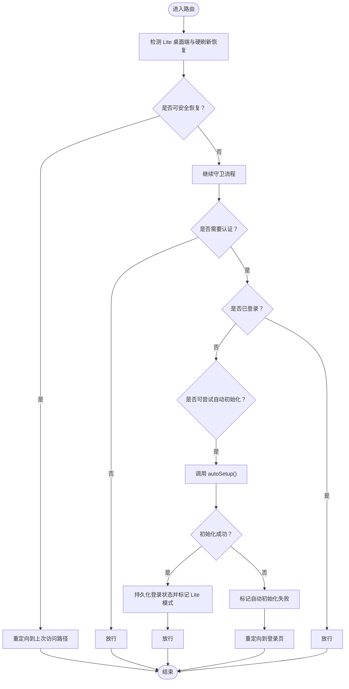
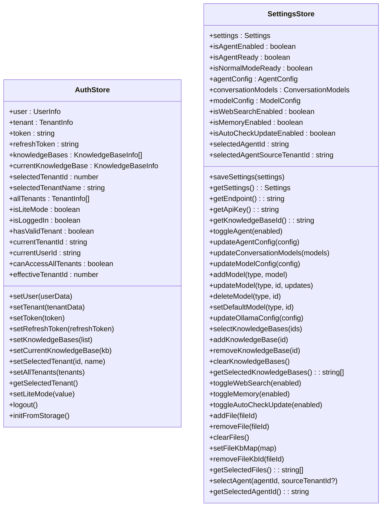
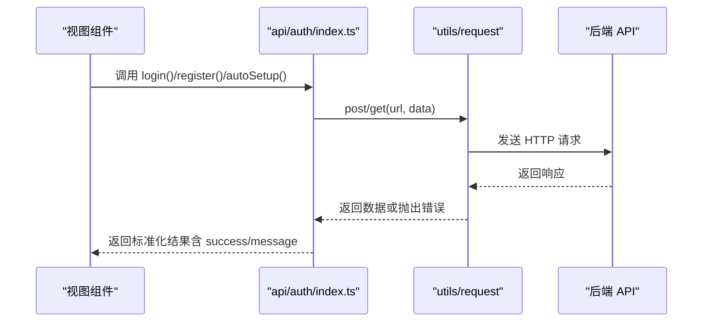
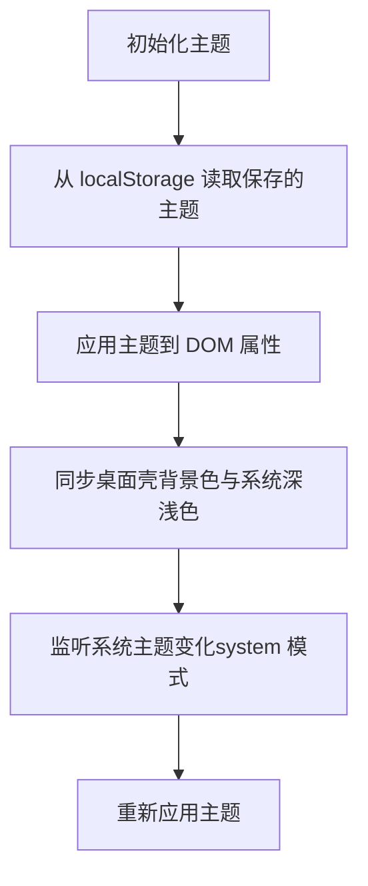
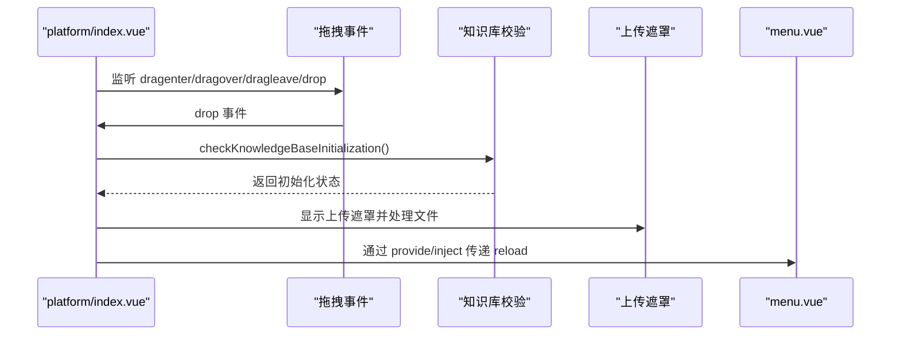
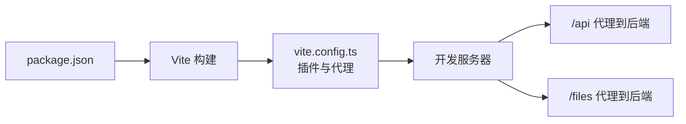

# 前端应用架构

<cite>
**本文档引用的文件**
- [frontend/src/main.ts](file://frontend/src/main.ts)
- [frontend/src/App.vue](file://frontend/src/App.vue)
- [frontend/src/router/index.ts](file://frontend/src/router/index.ts)
- [frontend/package.json](file://frontend/package.json)
- [frontend/vite.config.ts](file://frontend/vite.config.ts)
- [frontend/src/stores/auth.ts](file://frontend/src/stores/auth.ts)
- [frontend/src/stores/settings.ts](file://frontend/src/stores/settings.ts)
- [frontend/src/i18n/index.ts](file://frontend/src/i18n/index.ts)
- [frontend/src/utils/api-base.ts](file://frontend/src/utils/api-base.ts)
- [frontend/src/composables/useTheme.ts](file://frontend/src/composables/useTheme.ts)
- [frontend/src/api/auth/index.ts](file://frontend/src/api/auth/index.ts)
- [frontend/src/components/menu.vue](file://frontend/src/components/menu.vue)
- [frontend/src/views/platform/index.vue](file://frontend/src/views/platform/index.vue)
- [frontend/src/types/tool-results.ts](file://frontend/src/types/tool-results.ts)
</cite>

## 目录
1. [简介](#简介)
2. [项目结构](#项目结构)
3. [核心组件](#核心组件)
4. [架构总览](#架构总览)
5. [详细组件分析](#详细组件分析)
6. [依赖关系分析](#依赖关系分析)
7. [性能考虑](#性能考虑)
8. [故障排查指南](#故障排查指南)
9. [结论](#结论)
10. [附录](#附录)

## 简介
本文件为 WeKnora 前端应用的架构文档，聚焦 Vue 3 应用的初始化流程、路由配置、状态管理与组件架构设计，解释页面组件设计模式、业务组件封装策略与 UI 组件库的使用方法。同时涵盖 API 集成层实现、HTTP 客户端配置、WebSocket 连接管理与错误处理策略，以及 TypeScript 类型定义、国际化支持与响应式设计实现。文档提供组件开发指南、状态管理最佳实践与性能优化技巧，面向前端开发者提供完整的开发与维护指导。

## 项目结构
前端项目采用基于功能域的模块化组织方式，主要目录与职责如下：
- src/main.ts：应用入口，初始化 Vue 实例、Pinia、路由、国际化与主题。
- src/router/index.ts：路由定义与导航守卫，统一处理认证与初始化流程。
- src/stores/*：基于 Pinia 的状态管理模块，覆盖认证、设置、UI 等领域。
- src/api/*：API 接口封装，统一请求与响应处理。
- src/components/*：通用业务组件与 UI 组件。
- src/views/*：页面级视图组件，按功能域划分。
- src/i18n/*：国际化资源与语言切换逻辑。
- src/utils/*：工具类与通用能力（如请求、主题、图标等）。
- vite.config.ts：Vite 构建与开发服务器配置，含代理规则。
- package.json：依赖与脚本定义。

图表来源
- [frontend/src/main.ts:1-31](file://frontend/src/main.ts#L1-L31)
- [frontend/src/router/index.ts:1-232](file://frontend/src/router/index.ts#L1-L232)
- [frontend/src/views/platform/index.vue:1-205](file://frontend/src/views/platform/index.vue#L1-L205)
- [frontend/src/components/menu.vue:1-800](file://frontend/src/components/menu.vue#L1-L800)

章节来源
- [frontend/src/main.ts:1-31](file://frontend/src/main.ts#L1-L31)
- [frontend/src/router/index.ts:1-232](file://frontend/src/router/index.ts#L1-L232)
- [frontend/package.json:1-64](file://frontend/package.json#L1-L64)
- [frontend/vite.config.ts:1-56](file://frontend/vite.config.ts#L1-L56)

## 核心组件
- 应用入口与初始化：创建 Vue 实例、安装插件（TDesign、Pinia、Router、i18n），预加载主题与图标离线保护，等待路由准备后再挂载，避免首屏闪烁。
- 根组件 App.vue：负责 OIDC 回调处理、用户上下文同步、TDesign 国际化映射、全局更新检查与桌面端事件绑定。
- 路由系统：定义平台级路由与子路由，实现导航守卫以控制访问权限与自动初始化流程，支持 Lite 桌面端硬刷新后的页面恢复。
- 状态管理：Pinia Store 覆盖认证、设置、UI 等领域，持久化到 localStorage，提供计算属性与动作方法。
- 国际化：多语言资源与语言切换，fallback 至中文，支持本地存储语言偏好。
- 主题系统：支持 light/dark/system，与桌面壳同步原生窗口颜色，响应系统主题变化。
- API 集成：统一请求封装与错误处理，提供认证、OIDC、系统信息等接口。
- 页面与组件：平台主布局承载菜单与视图，菜单组件负责侧边栏、会话列表、批量操作与用户菜单。

章节来源
- [frontend/src/main.ts:1-31](file://frontend/src/main.ts#L1-L31)
- [frontend/src/App.vue:1-209](file://frontend/src/App.vue#L1-L209)
- [frontend/src/router/index.ts:1-232](file://frontend/src/router/index.ts#L1-L232)
- [frontend/src/stores/auth.ts:1-252](file://frontend/src/stores/auth.ts#L1-L252)
- [frontend/src/stores/settings.ts:1-385](file://frontend/src/stores/settings.ts#L1-L385)
- [frontend/src/i18n/index.ts:1-26](file://frontend/src/i18n/index.ts#L1-L26)
- [frontend/src/composables/useTheme.ts:1-81](file://frontend/src/composables/useTheme.ts#L1-L81)
- [frontend/src/api/auth/index.ts:1-305](file://frontend/src/api/auth/index.ts#L1-L305)
- [frontend/src/views/platform/index.vue:1-205](file://frontend/src/views/platform/index.vue#L1-L205)
- [frontend/src/components/menu.vue:1-800](file://frontend/src/components/menu.vue#L1-L800)

## 架构总览
WeKnora 前端采用“入口初始化 → 路由守卫 → 状态管理 → 视图渲染”的清晰控制流。应用通过 Pinia 管理跨组件状态，通过 TDesign 提供 UI 能力，通过 i18n 与主题钩子实现国际化与主题切换。API 层对后端接口进行统一封装，提供认证、OIDC、系统信息等能力。

图表来源
- [frontend/src/main.ts:1-31](file://frontend/src/main.ts#L1-L31)
- [frontend/src/router/index.ts:168-222](file://frontend/src/router/index.ts#L168-L222)
- [frontend/src/App.vue:43-135](file://frontend/src/App.vue#L43-L135)
- [frontend/src/views/platform/index.vue:13-37](file://frontend/src/views/platform/index.vue#L13-L37)
- [frontend/src/components/menu.vue:134-170](file://frontend/src/components/menu.vue#L134-L170)
- [frontend/src/stores/auth.ts:1-252](file://frontend/src/stores/auth.ts#L1-L252)
- [frontend/src/stores/settings.ts:1-385](file://frontend/src/stores/settings.ts#L1-L385)
- [frontend/src/api/auth/index.ts:1-305](file://frontend/src/api/auth/index.ts#L1-L305)

## 详细组件分析

### 应用初始化流程
- 在 main.ts 中，先安装主题与图标离线保护，再初始化 Pinia、Router、i18n，最后等待路由就绪后挂载，避免硬刷新时的闪烁。
- App.vue 在 mounted 生命周期中处理 OIDC 回调，解析哈希参数，解码结果，同步用户与租户上下文，并触发路由跳转。

图表来源
- [frontend/src/main.ts:15-30](file://frontend/src/main.ts#L15-L30)
- [frontend/src/App.vue:91-135](file://frontend/src/App.vue#L91-L135)

章节来源
- [frontend/src/main.ts:1-31](file://frontend/src/main.ts#L1-L31)
- [frontend/src/App.vue:1-209](file://frontend/src/App.vue#L1-L209)

### 路由配置与导航守卫
- 路由定义包含登录、平台主路由与子路由（知识库、组织、设置、智能体、聊天等），支持懒加载组件。
- 导航守卫实现以下逻辑：
  - Lite 桌面端硬刷新后恢复上次访问的 /platform 子路径。
  - 对需要认证或初始化的路由进行校验，未认证时尝试自动初始化（auto-setup），成功则标记 Lite 模式并放行。
  - 已登录用户访问登录页时重定向至知识库列表。
  - 访问 /join 时将 code 参数转换为 invite_code 并重定向至组织列表。

图表来源
- [frontend/src/router/index.ts:168-229](file://frontend/src/router/index.ts#L168-L229)

章节来源
- [frontend/src/router/index.ts:1-232](file://frontend/src/router/index.ts#L1-L232)

### 状态管理（Pinia）
- 认证状态（auth.ts）：
  - 状态：用户、租户、token、refreshToken、知识库列表、当前知识库、选中租户、Lite 模式等。
  - 计算属性：登录状态、有效租户、当前租户/用户 ID、可访问所有租户、生效租户 ID。
  - 动作：设置用户/租户/token/refreshToken、知识库选择、租户切换、Lite 模式切换、登出与从 localStorage 恢复。
- 应用设置（settings.ts）：
  - 管理 API 端点、API Key、Agent 配置、模型配置、Ollama 配置、网络搜索与记忆开关、自动检查更新等。
  - 提供 getters 判断 Agent 就绪状态与普通模式就绪状态，actions 提供保存、更新与模型管理。

图表来源
- [frontend/src/stores/auth.ts:1-252](file://frontend/src/stores/auth.ts#L1-L252)
- [frontend/src/stores/settings.ts:1-385](file://frontend/src/stores/settings.ts#L1-L385)

章节来源
- [frontend/src/stores/auth.ts:1-252](file://frontend/src/stores/auth.ts#L1-L252)
- [frontend/src/stores/settings.ts:1-385](file://frontend/src/stores/settings.ts#L1-L385)

### API 集成层与错误处理
- API 封装位于 src/api/auth/index.ts，提供登录、注册、OIDC、自动初始化、用户/租户信息、Token 刷新、登出与验证等接口。
- 统一使用 utils/request（未在本文档直接展示）进行 HTTP 请求，异常时返回标准化的错误对象，结合 i18n 提示用户。
- 开发环境通过 Vite 代理将 /api 与 /files 代理到后端，便于前后端联调。

图表来源
- [frontend/src/api/auth/index.ts:135-305](file://frontend/src/api/auth/index.ts#L135-L305)
- [frontend/vite.config.ts:42-53](file://frontend/vite.config.ts#L42-L53)

章节来源
- [frontend/src/api/auth/index.ts:1-305](file://frontend/src/api/auth/index.ts#L1-L305)
- [frontend/vite.config.ts:1-56](file://frontend/vite.config.ts#L1-L56)

### 国际化与主题
- 国际化：i18n/index.ts 创建 i18n 实例，支持 zh-CN、en-US、ru-RU、ko-KR，从 localStorage 读取语言偏好，fallback 至 zh-CN。
- 主题：useTheme.ts 提供主题模式切换（light/dark/system），持久化到 localStorage，响应系统主题变化，并与桌面壳同步原生窗口颜色。

图表来源
- [frontend/src/composables/useTheme.ts:69-81](file://frontend/src/composables/useTheme.ts#L69-L81)
- [frontend/src/i18n/index.ts:14-26](file://frontend/src/i18n/index.ts#L14-L26)

章节来源
- [frontend/src/composables/useTheme.ts:1-81](file://frontend/src/composables/useTheme.ts#L1-L81)
- [frontend/src/i18n/index.ts:1-26](file://frontend/src/i18n/index.ts#L1-L26)

### 页面组件设计模式与业务组件封装
- 平台主布局（views/platform/index.vue）：
  - 承载菜单与 RouterView，提供全局上传遮罩与键盘事件处理（桌面端软刷新）。
  - 提供 provide/inject 机制，向子组件传递 reload 方法。
  - 监听全局拖拽事件，校验知识库初始化状态后触发上传流程。
- 侧边菜单（components/menu.vue）：
  - 负责菜单项激活状态、图标状态、会话列表分组与滚动加载、批量操作、用户菜单与租户选择器。
  - 与 Pinia 状态交互，调用 API 获取会话列表与知识库信息，处理删除、清空消息等操作。

图表来源
- [frontend/src/views/platform/index.vue:93-175](file://frontend/src/views/platform/index.vue#L93-L175)
- [frontend/src/components/menu.vue:511-582](file://frontend/src/components/menu.vue#L511-L582)

章节来源
- [frontend/src/views/platform/index.vue:1-205](file://frontend/src/views/platform/index.vue#L1-L205)
- [frontend/src/components/menu.vue:1-800](file://frontend/src/components/menu.vue#L1-L800)

### WebSocket 连接管理与错误处理
- 项目中未发现显式的 WebSocket 客户端代码或相关配置。若后续需要集成实时通信，建议：
  - 在 utils 目录新增 WebSocket 客户端封装，提供连接、断线重连、消息派发与错误回调。
  - 在 Pinia Store 中维护连接状态与消息队列，确保断线后自动恢复。
  - 在路由守卫与页面生命周期中正确管理连接的建立与释放，避免内存泄漏。

[本节为概念性说明，不直接分析具体文件，故无章节来源]

## 依赖关系分析
- 构建与开发：Vite 作为构建工具，配置了 Vue 与 JSX 插件、路径别名与代理规则，开发时将 /api 与 /files 代理到后端。
- 运行时依赖：Vue 3、Vue Router、Pinia、TDesign Vue Next、vue-i18n、axios/marked 等，版本与脚本在 package.json 中定义。
- 代理配置：vite.config.ts 将 /api 与 /files 代理到 http://localhost:8080，便于本地联调。

图表来源
- [frontend/package.json:1-64](file://frontend/package.json#L1-L64)
- [frontend/vite.config.ts:27-55](file://frontend/vite.config.ts#L27-L55)

章节来源
- [frontend/package.json:1-64](file://frontend/package.json#L1-L64)
- [frontend/vite.config.ts:1-56](file://frontend/vite.config.ts#L1-L56)

## 性能考虑
- 首屏与路由：在 main.ts 中等待 router.isReady() 再挂载，避免硬刷新时的闪烁与不必要的重渲染。
- 组件懒加载：路由组件采用动态导入，减小首包体积。
- 状态持久化：Pinia Store 将关键状态持久化到 localStorage，提升用户体验与回退能力。
- 图标与主题：提前安装图标离线保护与初始化主题，减少运行时请求与重绘。
- 列表与滚动：菜单组件对滚动触底进行防抖与分页加载，避免频繁请求与 DOM 抖动。
- 桌面端优化：在 App.vue 中对桌面端进行更新检查与事件绑定，避免整页刷新带来的白屏与状态丢失。

[本节提供通用指导，不直接分析具体文件，故无章节来源]

## 故障排查指南
- OIDC 登录失败：
  - 检查 App.vue 中 OIDC 回调解析与错误提示逻辑，确认哈希参数存在且格式正确。
  - 确认后端 OIDC 配置与授权 URL 生成正常。
- 自动初始化失败：
  - 查看 router.beforeEach 中 autoSetup 的调用与标记失败逻辑，确认本地存储标记与后续重定向。
- 登录状态异常：
  - 检查 authStore 的持久化与恢复逻辑，确认 localStorage 中的用户、租户、token 等字段是否存在。
- 国际化与主题：
  - 确认 i18n 的语言偏好与 fallback，useTheme 的系统主题监听与桌面壳同步逻辑。
- 构建与代理：
  - 确认 vite.config.ts 的代理配置与端口，确保 /api 与 /files 能正确转发到后端。

章节来源
- [frontend/src/App.vue:91-135](file://frontend/src/App.vue#L91-L135)
- [frontend/src/router/index.ts:168-229](file://frontend/src/router/index.ts#L168-L229)
- [frontend/src/stores/auth.ts:145-212](file://frontend/src/stores/auth.ts#L145-L212)
- [frontend/src/i18n/index.ts:14-26](file://frontend/src/i18n/index.ts#L14-L26)
- [frontend/src/composables/useTheme.ts:69-81](file://frontend/src/composables/useTheme.ts#L69-L81)
- [frontend/vite.config.ts:42-53](file://frontend/vite.config.ts#L42-L53)

## 结论
WeKnora 前端应用采用现代化的 Vue 3 技术栈，通过清晰的初始化流程、完善的路由守卫、模块化的状态管理与组件封装，实现了良好的用户体验与可维护性。国际化与主题系统提升了跨语言与跨平台的适配能力。未来可在 WebSocket 实时通信、性能监控与错误追踪等方面进一步完善，以支撑更复杂的业务场景。

[本节为总结性内容，不直接分析具体文件，故无章节来源]

## 附录
- TypeScript 类型定义：工具结果类型（tool-results.ts）定义了多种工具输出的数据结构，便于在组件中进行类型约束与提示。
- API 基础路径：getApiBaseUrl() 默认返回空字符串，开发环境通过 Vite 代理实现同源请求，生产环境可根据部署情况调整。

章节来源
- [frontend/src/types/tool-results.ts:1-296](file://frontend/src/types/tool-results.ts#L1-L296)
- [frontend/src/utils/api-base.ts:1-6](file://frontend/src/utils/api-base.ts#L1-L6)