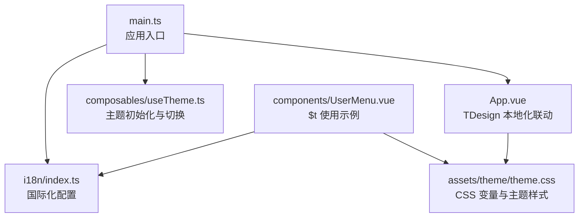
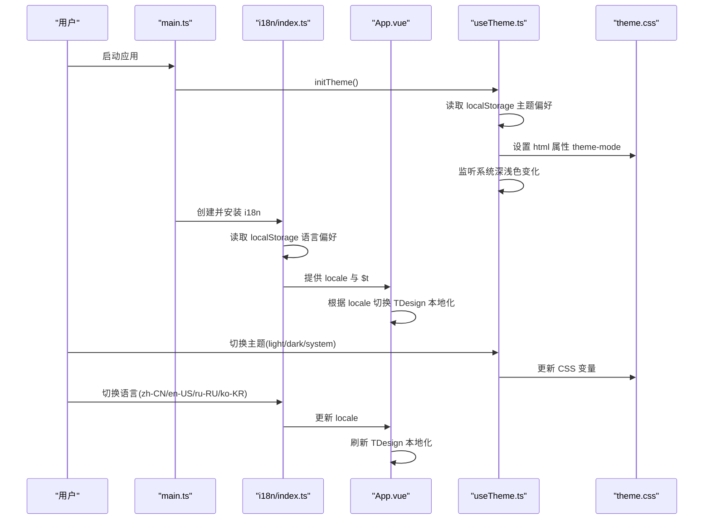
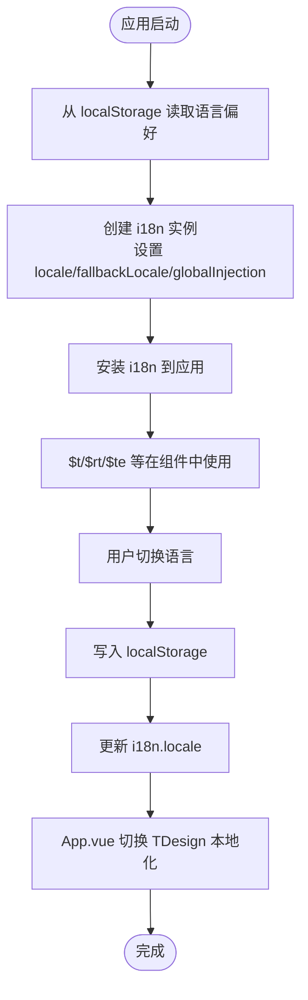
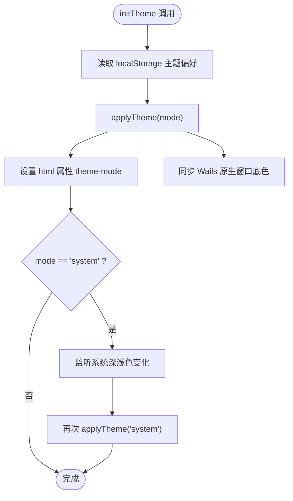
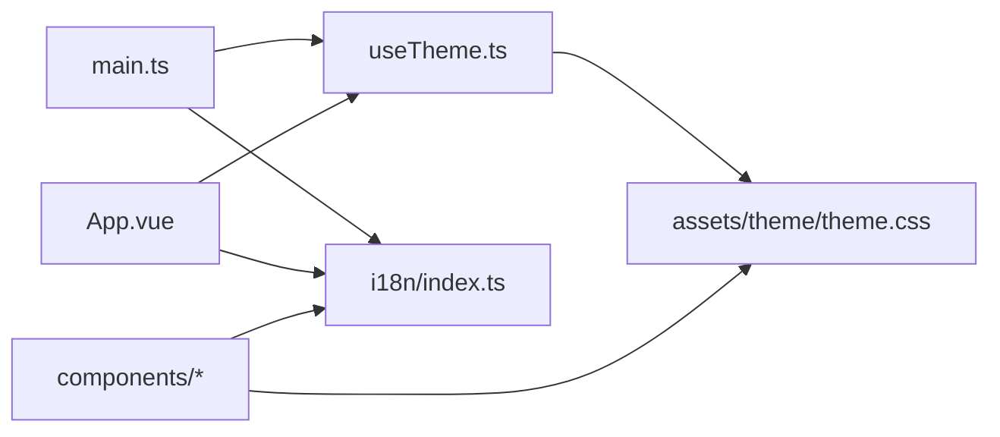

# 国际化与主题

<cite>
**本文引用的文件**
- [frontend/src/i18n/index.ts](file://frontend/src/i18n/index.ts)
- [frontend/src/main.ts](file://frontend/src/main.ts)
- [frontend/src/App.vue](file://frontend/src/App.vue)
- [frontend/src/composables/useTheme.ts](file://frontend/src/composables/useTheme.ts)
- [frontend/src/assets/theme/theme.css](file://frontend/src/assets/theme/theme.css)
- [frontend/src/components/UserMenu.vue](file://frontend/src/components/UserMenu.vue)
</cite>

## 目录
1. [引言](#引言)
2. [项目结构](#项目结构)
3. [核心组件](#核心组件)
4. [架构总览](#架构总览)
5. [详细组件分析](#详细组件分析)
6. [依赖关系分析](#依赖关系分析)
7. [性能考量](#性能考量)
8. [故障排查指南](#故障排查指南)
9. [结论](#结论)
10. [附录](#附录)

## 引言
本文件聚焦 WeKnora 前端的国际化与主题系统，系统性阐述多语言支持实现、语言包管理与动态语言切换机制；主题系统架构、CSS 变量管理与主题切换策略；国际化资源加载、语言检测与本地化格式化；以及主题定制方法、颜色系统设计与响应式主题适配。文档同时提供国际化最佳实践、主题开发指南与跨浏览器兼容性建议，帮助前端开发者高效完成国际化与主题开发。

## 项目结构
WeKnora 前端国际化与主题相关的关键位置如下：
- 国际化入口与语言包：frontend/src/i18n/index.ts
- 应用初始化与主题初始化：frontend/src/main.ts
- 应用根组件与 TDesign 本地化联动：frontend/src/App.vue
- 主题组合式函数与系统深浅色监听：frontend/src/composables/useTheme.ts
- 主题 CSS 变量与暗色适配：frontend/src/assets/theme/theme.css
- 多语言使用的典型组件示例：frontend/src/components/UserMenu.vue

**图表来源**
- [frontend/src/main.ts:1-31](file://frontend/src/main.ts#L1-L31)
- [frontend/src/i18n/index.ts:1-26](file://frontend/src/i18n/index.ts#L1-L26)
- [frontend/src/App.vue:1-209](file://frontend/src/App.vue#L1-L209)
- [frontend/src/composables/useTheme.ts:1-81](file://frontend/src/composables/useTheme.ts#L1-L81)
- [frontend/src/assets/theme/theme.css:1-131](file://frontend/src/assets/theme/theme.css#L1-L131)
- [frontend/src/components/UserMenu.vue:1-511](file://frontend/src/components/UserMenu.vue#L1-L511)

**章节来源**
- [frontend/src/main.ts:1-31](file://frontend/src/main.ts#L1-L31)
- [frontend/src/i18n/index.ts:1-26](file://frontend/src/i18n/index.ts#L1-L26)
- [frontend/src/App.vue:1-209](file://frontend/src/App.vue#L1-L209)
- [frontend/src/composables/useTheme.ts:1-81](file://frontend/src/composables/useTheme.ts#L1-L81)
- [frontend/src/assets/theme/theme.css:1-131](file://frontend/src/assets/theme/theme.css#L1-L131)
- [frontend/src/components/UserMenu.vue:1-511](file://frontend/src/components/UserMenu.vue#L1-L511)

## 核心组件
- 国际化核心
  - i18n 实例：创建 vue-i18n 实例，注册多语言消息，设置默认语言与回退语言，读取 localStorage 保存的语言偏好。
  - 语言包：包含 zh-CN、en-US、ru-RU、ko-KR 的消息集合。
- 主题核心
  - useTheme 组合式函数：维护主题模式（light/dark/system），持久化到 localStorage，应用 CSS 属性标记，监听系统深浅色变化，同步 Wails 原生窗口底色。
  - CSS 变量：在 :root 与 [theme-mode="dark"] 中定义品牌色、文本色、背景色、圆角与阴影等变量，实现明暗两套主题。

**章节来源**
- [frontend/src/i18n/index.ts:1-26](file://frontend/src/i18n/index.ts#L1-L26)
- [frontend/src/composables/useTheme.ts:1-81](file://frontend/src/composables/useTheme.ts#L1-L81)
- [frontend/src/assets/theme/theme.css:1-131](file://frontend/src/assets/theme/theme.css#L1-L131)

## 架构总览
国际化与主题在启动阶段即被初始化，贯穿运行期的动态切换与持久化。国际化负责语言与本地化，主题负责外观与色彩体系。

**图表来源**
- [frontend/src/main.ts:1-31](file://frontend/src/main.ts#L1-L31)
- [frontend/src/i18n/index.ts:1-26](file://frontend/src/i18n/index.ts#L1-L26)
- [frontend/src/App.vue:1-209](file://frontend/src/App.vue#L1-L209)
- [frontend/src/composables/useTheme.ts:1-81](file://frontend/src/composables/useTheme.ts#L1-L81)
- [frontend/src/assets/theme/theme.css:1-131](file://frontend/src/assets/theme/theme.css#L1-L131)

## 详细组件分析

### 国际化系统
- 初始化与持久化
  - 从 localStorage 读取保存的语言键值，若不存在则默认 zh-CN。
  - 创建 i18n 实例，legacy 关闭，启用全局注入，设置回退语言为 zh-CN。
- 动态语言切换
  - 在组件中通过 useI18n 获取 locale，结合 TDesign 的 locale 配置映射，实现 UI 文案与组件本地化同步切换。
- 语言包组织
  - 语言包以模块形式集中于 i18n/locales 目录，按语言代码命名，便于扩展新语言。

**图表来源**
- [frontend/src/i18n/index.ts:1-26](file://frontend/src/i18n/index.ts#L1-L26)
- [frontend/src/App.vue:1-209](file://frontend/src/App.vue#L1-L209)

**章节来源**
- [frontend/src/i18n/index.ts:1-26](file://frontend/src/i18n/index.ts#L1-L26)
- [frontend/src/App.vue:1-209](file://frontend/src/App.vue#L1-L209)

### 主题系统
- 主题模式与持久化
  - 支持 light、dark、system 三种模式，优先读取 localStorage，否则默认 light。
  - 当模式为 system 时，监听 prefers-color-scheme 变化，自动同步深浅色。
- DOM 属性与 Wails 同步
  - 在 documentElement 上设置 theme-mode 属性，驱动 CSS 变量切换。
  - 通过 Wails runtime 同步原生窗口底色与主题，减少刷新时的闪烁。
- CSS 变量与覆盖
  - 在 :root 与 [theme-mode="dark"] 中定义品牌色、文本色、背景色、边框、圆角、阴影等变量。
  - 提供滚动条与表单自动填充的暗色适配，保证一致性与可用性。

**图表来源**
- [frontend/src/composables/useTheme.ts:1-81](file://frontend/src/composables/useTheme.ts#L1-L81)

**章节来源**
- [frontend/src/composables/useTheme.ts:1-81](file://frontend/src/composables/useTheme.ts#L1-L81)
- [frontend/src/assets/theme/theme.css:1-131](file://frontend/src/assets/theme/theme.css#L1-L131)

### 组件级国际化实践
- 在组件中通过 $t 使用翻译键，确保文案统一由 i18n 管理。
- 结合 UI 组件库的本地化配置，保持界面文案与组件提示一致。

**章节来源**
- [frontend/src/components/UserMenu.vue:1-511](file://frontend/src/components/UserMenu.vue#L1-L511)

## 依赖关系分析
- main.ts 作为应用入口，负责初始化主题与国际化，并挂载应用。
- App.vue 作为根组件，基于 i18n.locale 选择 TDesign 本地化配置，确保全局 UI 一致。
- useTheme.ts 与 theme.css 形成主题层，通过 CSS 变量与 DOM 属性实现明暗主题切换。
- 组件层广泛使用 $t 与 TDesign 组件，形成“语言-主题-组件”三层协同。

**图表来源**
- [frontend/src/main.ts:1-31](file://frontend/src/main.ts#L1-L31)
- [frontend/src/i18n/index.ts:1-26](file://frontend/src/i18n/index.ts#L1-L26)
- [frontend/src/App.vue:1-209](file://frontend/src/App.vue#L1-L209)
- [frontend/src/composables/useTheme.ts:1-81](file://frontend/src/composables/useTheme.ts#L1-L81)
- [frontend/src/assets/theme/theme.css:1-131](file://frontend/src/assets/theme/theme.css#L1-L131)

**章节来源**
- [frontend/src/main.ts:1-31](file://frontend/src/main.ts#L1-L31)
- [frontend/src/App.vue:1-209](file://frontend/src/App.vue#L1-L209)

## 性能考量
- 主题切换
  - 通过 CSS 变量与属性切换，避免重排与重绘抖动；配合独立合成层与颜色方案声明，进一步降低刷新成本。
- 国际化
  - 语言包集中管理，按需加载可考虑按路由或页面拆分，减少初始体积。
  - 本地化映射采用对象查找，时间复杂度 O(1)，切换流畅。
- 浏览器兼容
  - 暗色滚动条与自动填充覆盖使用标准属性，兼容现代浏览器；对旧版浏览器可提供降级样式。

[本节为通用性能建议，不直接分析具体文件]

## 故障排查指南
- 语言未生效
  - 检查 localStorage 中的 locale 键是否存在，确认 i18n.locale 已更新。
  - 确认 App.vue 中根据 locale 切换了 TDesign 本地化配置。
- 主题切换无效
  - 检查 documentElement 是否存在 theme-mode 属性，确认 CSS 变量已更新。
  - 若使用桌面壳，确认 Wails runtime 方法是否可用且未抛错。
- 暗色滚动条或输入框样式异常
  - 检查 theme.css 中针对暗色模式的覆盖规则是否正确加载。
  - 确认组件样式未覆盖关键变量。

**章节来源**
- [frontend/src/i18n/index.ts:1-26](file://frontend/src/i18n/index.ts#L1-L26)
- [frontend/src/App.vue:1-209](file://frontend/src/App.vue#L1-L209)
- [frontend/src/composables/useTheme.ts:1-81](file://frontend/src/composables/useTheme.ts#L1-L81)
- [frontend/src/assets/theme/theme.css:1-131](file://frontend/src/assets/theme/theme.css#L1-L131)

## 结论
WeKnora 的国际化与主题系统以简洁高效的架构实现了语言与外观的解耦：i18n 负责文案与本地化，useTheme 负责外观与色彩体系，二者均通过 localStorage 持久化与运行时动态切换，配合 CSS 变量与 TDesign 本地化映射，形成一致、可扩展的前端体验。遵循本文的最佳实践与开发指南，可快速扩展新语言与自定义主题，保障跨浏览器与跨平台的一致性。

## 附录
- 最佳实践
  - 语言包按页面/功能域拆分，按需懒加载；统一翻译键命名规范，避免重复与歧义。
  - 主题变量集中管理，新增变量遵循命名约定，避免硬编码颜色。
  - 组件中统一通过 $t 与组件库本地化配置，避免直接拼接字符串。
- 主题开发指南
  - 新增主题模式时，在 CSS 中补充对应变量集，并在 useTheme 中扩展逻辑。
  - 为暗色模式提供滚动条、表单与图标适配，确保可用性。
- 跨浏览器兼容
  - 使用标准 CSS 变量与媒体查询；对旧版浏览器提供降级样式与特性检测。

[本节为通用指导，不直接分析具体文件]