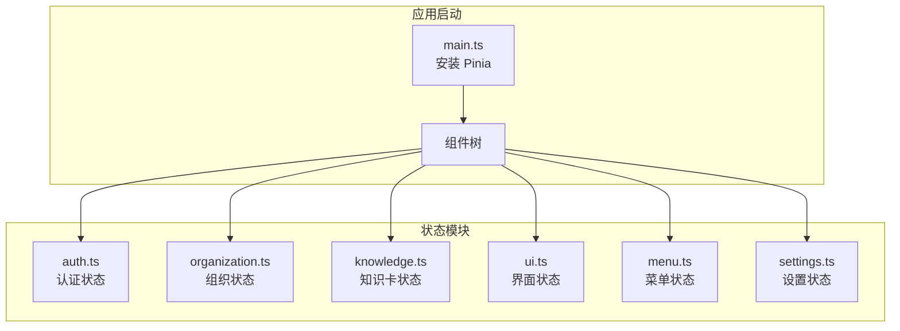
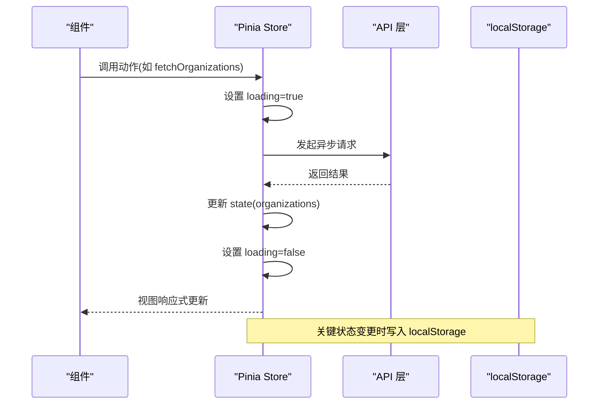
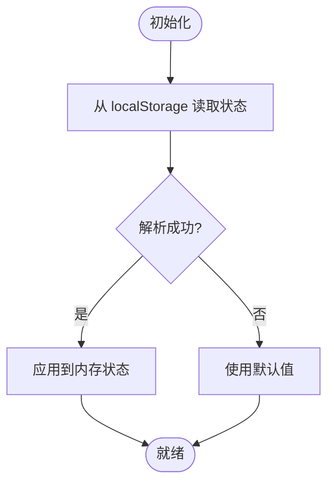
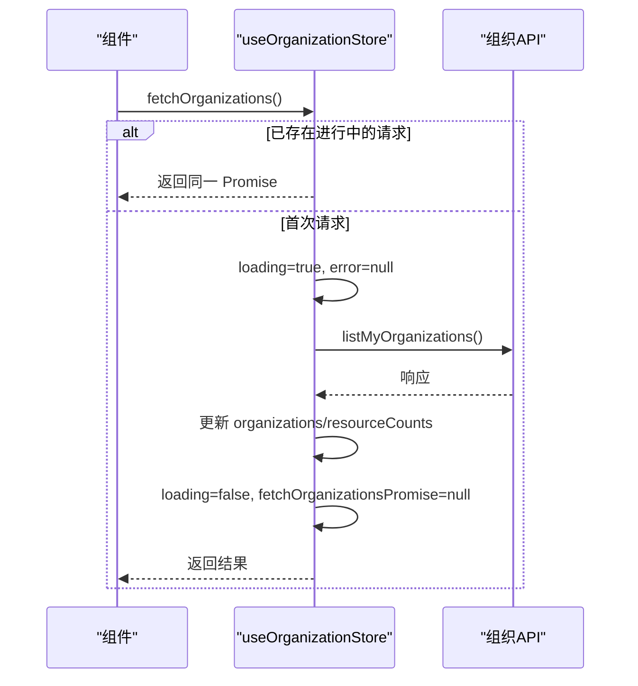
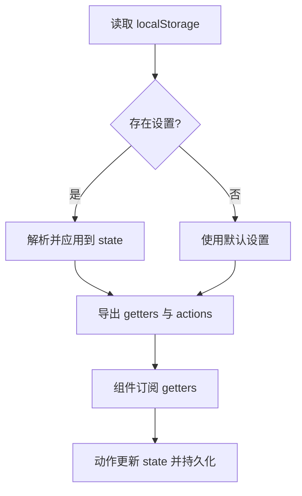
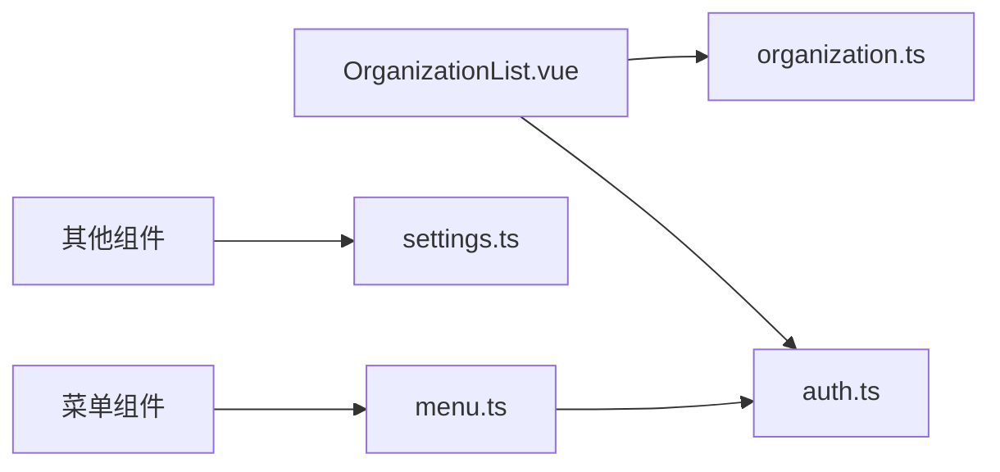

# 状态管理

<cite>
**本文引用的文件**
- [main.ts](file://frontend/src/main.ts)
- [auth.ts](file://frontend/src/stores/auth.ts)
- [organization.ts](file://frontend/src/stores/organization.ts)
- [knowledge.ts](file://frontend/src/stores/knowledge.ts)
- [ui.ts](file://frontend/src/stores/ui.ts)
- [menu.ts](file://frontend/src/stores/menu.ts)
- [settings.ts](file://frontend/src/stores/settings.ts)
- [OrganizationList.vue](file://frontend/src/views/organization/OrganizationList.vue)
</cite>

## 目录
1. [简介](#简介)
2. [项目结构](#项目结构)
3. [核心组件](#核心组件)
4. [架构总览](#架构总览)
5. [详细组件分析](#详细组件分析)
6. [依赖关系分析](#依赖关系分析)
7. [性能考量](#性能考量)
8. [故障排查指南](#故障排查指南)
9. [结论](#结论)
10. [附录](#附录)

## 简介
本文件系统性梳理 WeKnora 前端基于 Pinia 的状态管理方案，覆盖状态定义、动作管理、计算属性、持久化与重置、异步处理、派生计算与订阅模式，并给出模块化设计、命名规范与调试建议。重点围绕认证状态、知识库状态、组织状态与 UI 状态展开，帮助前端开发者建立一致、可维护、高性能的状态管理实践。

## 项目结构
- 应用在入口处安装并初始化 Pinia，随后各页面与组件通过组合式 Store 访问状态与动作。
- 状态模块按领域划分：认证(auth)、组织(organization)、知识库(knowledge)、UI(ui)、菜单(menu)、设置(settings)。
- 组件通过 watch、computed 与事件交互 Store，实现状态驱动的视图更新与行为控制。

图表来源
- [main.ts:23](file://frontend/src/main.ts#L23)
- [auth.ts:7](file://frontend/src/stores/auth.ts#L7)
- [organization.ts:27](file://frontend/src/stores/organization.ts#L27)
- [knowledge.ts:5](file://frontend/src/stores/knowledge.ts#L5)
- [ui.ts:3](file://frontend/src/stores/ui.ts#L3)
- [menu.ts:19](file://frontend/src/stores/menu.ts#L19)
- [settings.ts:103](file://frontend/src/stores/settings.ts#L103)

章节来源
- [main.ts:1-31](file://frontend/src/main.ts#L1-L31)

## 核心组件
- 认证状态模块：集中管理用户、租户、令牌、当前知识库、租户选择、Lite 模式等，并提供持久化与初始化恢复能力。
- 组织状态模块：封装组织 CRUD、成员管理、邀请码生成、共享资源查询等异步动作，内置并发请求去重。
- 知识库状态模块：轻量状态，承载知识卡列表与总数等基础数据。
- UI 状态模块：管理模态框、编辑器、侧边栏折叠、标签选择等界面行为。
- 菜单状态模块：维护菜单项、国际化标题、聊天会话动态注入、Lite 模式下的菜单可见性。
- 设置状态模块：统一管理模型、Agent、网络搜索、记忆、文件选择、智能体选择等复杂设置，提供持久化与派生计算。

章节来源
- [auth.ts:7-252](file://frontend/src/stores/auth.ts#L7-L252)
- [organization.ts:27-474](file://frontend/src/stores/organization.ts#L27-L474)
- [knowledge.ts:1-12](file://frontend/src/stores/knowledge.ts#L1-L12)
- [ui.ts:1-131](file://frontend/src/stores/ui.ts#L1-L131)
- [menu.ts:1-152](file://frontend/src/stores/menu.ts#L1-L152)
- [settings.ts:103-385](file://frontend/src/stores/settings.ts#L103-L385)

## 架构总览
Pinia Store 采用组合式 API 设计，以 defineStore 定义状态、计算属性与动作，组件通过响应式引用与计算属性订阅状态变化；异步操作通过动作封装并结合 loading/error 状态反馈；持久化通过 localStorage 实现跨会话保留关键状态。

图表来源
- [organization.ts:64-87](file://frontend/src/stores/organization.ts#L64-L87)
- [settings.ts:158-383](file://frontend/src/stores/settings.ts#L158-L383)

## 详细组件分析

### 认证状态模块（auth）
- 设计模式：组合式 Store，使用 ref/computed 定义状态与计算属性，动作负责状态更新与持久化。
- 关键状态
  - 用户信息、租户信息、访问令牌、刷新令牌
  - 知识库列表、当前知识库、已选租户ID/名称
  - 可访问全部租户权限、Lite 模式开关
- 持久化与重置
  - 动作将关键字段写入 localStorage，并在初始化时从 localStorage 恢复
  - 登出时清空内存与 localStorage，并清理相关会话存储
- 计算属性
  - 登录态、有效租户、当前用户/租户ID、有效租户ID等
- 异步与错误处理
  - 提供初始化恢复与错误日志记录
- 最佳实践
  - 将敏感令牌与用户信息持久化到安全存储或最小化暴露
  - 在路由守卫与应用启动阶段调用初始化恢复

图表来源
- [auth.ts:145-212](file://frontend/src/stores/auth.ts#L145-L212)

章节来源
- [auth.ts:7-252](file://frontend/src/stores/auth.ts#L7-L252)

### 组织状态模块（organization）
- 设计模式：组合式 Store，ref/computed 管理状态与派生，动作封装异步业务流。
- 关键状态
  - 组织列表、当前组织、成员列表、共享知识库/智能体
  - 预览数据、加载标志、错误消息、资源统计
- 并发去重
  - 通过 fetchOrganizationsPromise 防止重复请求，提升性能与一致性
- 动作清单
  - 列表获取、创建、更新、删除、加入/离开、邀请码生成、成员管理、共享资源查询
- 计算属性
  - 我的组织、拥有组织、加入组织、待审批总数等
- 错误处理
  - 统一设置 error 字段与降级逻辑，finally 清理 loading

图表来源
- [organization.ts:64-87](file://frontend/src/stores/organization.ts#L64-L87)

章节来源
- [organization.ts:27-474](file://frontend/src/stores/organization.ts#L27-L474)

### 知识库状态模块（knowledge）
- 设计模式：选项式 Store，state 返回对象，actions 留白扩展
- 关键状态
  - 卡片列表、总数
- 使用建议
  - 结合具体页面动作填充 state，保持与 UI 卡片展示一致

章节来源
- [knowledge.ts:1-12](file://frontend/src/stores/knowledge.ts#L1-L12)

### UI 状态模块（ui）
- 设计模式：选项式 Store，集中管理界面行为与临时状态
- 关键状态
  - 设置/知识库编辑器弹窗、当前 KB、标签选择、侧边栏折叠
  - 手动编辑器可见性与回调
- 动作
  - 打开/关闭/切换设置与编辑器
  - 侧边栏折叠切换并持久化
  - 通知手动编辑器成功回调

章节来源
- [ui.ts:1-131](file://frontend/src/stores/ui.ts#L1-L131)

### 菜单状态模块（menu）
- 设计模式：组合式 Store，维护菜单项与动态子菜单
- 关键状态
  - 菜单项数组、可见菜单、首次会话标记、预填查询与附件
- 行为
  - 国际化标题应用与监听语言变化
  - Lite 模式下过滤特定路径
  - 动态注入/更新聊天会话子菜单
  - 预填查询消费

章节来源
- [menu.ts:1-152](file://frontend/src/stores/menu.ts#L1-L152)

### 设置状态模块（settings）
- 设计模式：选项式 Store，集中管理复杂设置与派生计算
- 关键状态
  - 端点、API Key、知识库ID、Agent 开关与配置、模型配置、Ollama 配置
  - 网络搜索、记忆、自动更新、智能体选择、文件选择与映射
- 派生计算
  - Agent 就绪判断、普通模式就绪判断、当前选中智能体ID与来源租户ID
- 动作
  - 保存/获取设置、切换 Agent/网络搜索/记忆/自动更新
  - 模型增删改、默认模型设置、知识库/文件选择、智能体选择与重置
- 持久化
  - 读取与写入 localStorage，确保跨会话保留

图表来源
- [settings.ts:103-385](file://frontend/src/stores/settings.ts#L103-L385)

章节来源
- [settings.ts:103-385](file://frontend/src/stores/settings.ts#L103-L385)

## 依赖关系分析
- 组件对 Store 的依赖：通过组合式 API 访问状态与动作，典型用法是在 script 中解构 store 并在模板中绑定。
- Store 间耦合：menu 依赖 auth 的 Lite 模式；organization 依赖 API 层；settings 依赖默认配置与本地存储。
- 订阅模式：组件通过 watch 监听 store 的响应式状态，实现视图与状态的双向联动。

图表来源
- [OrganizationList.vue:818-825](file://frontend/src/views/organization/OrganizationList.vue#L818-L825)
- [menu.ts:65-70](file://frontend/src/stores/menu.ts#L65-L70)

章节来源
- [OrganizationList.vue:818-825](file://frontend/src/views/organization/OrganizationList.vue#L818-L825)
- [menu.ts:19-70](file://frontend/src/stores/menu.ts#L19-L70)

## 性能考量
- 并发去重：组织模块通过共享 Promise 避免重复请求，减少网络与渲染抖动。
- 响应式粒度：优先使用 ref/computed 粒度化状态，避免大对象整体替换导致不必要的重渲染。
- 持久化策略：仅持久化必要状态，避免 localStorage 过载；对大对象序列化需注意体积与解析成本。
- 订阅优化：组件内 watch 仅监听必要字段；对高频更新场景考虑节流/防抖。
- 模块拆分：按领域拆分 Store，降低耦合并便于缓存与测试。

## 故障排查指南
- 认证状态异常
  - 现象：登录后仍显示未登录或租户信息丢失
  - 排查：确认初始化恢复逻辑是否执行、localStorage 是否被清理、令牌是否过期
- 组织列表不更新
  - 现象：创建/删除/加入后列表未刷新
  - 排查：确认是否调用对应动作（如 fetchOrganizations）、是否正确处理 error/loading
- 设置未生效
  - 现象：切换模型/智能体后 UI 未更新
  - 排查：确认 getters 是否正确读取 state、动作是否持久化到 localStorage
- 菜单显示异常
  - 现象：Lite 模式下菜单项未隐藏或标题未翻译
  - 排查：确认 visibleMenuArr 计算逻辑、i18n 监听与 localStorage 折叠状态

章节来源
- [auth.ts:145-212](file://frontend/src/stores/auth.ts#L145-L212)
- [organization.ts:64-87](file://frontend/src/stores/organization.ts#L64-L87)
- [settings.ts:103-385](file://frontend/src/stores/settings.ts#L103-L385)
- [menu.ts:45-70](file://frontend/src/stores/menu.ts#L45-L70)

## 结论
WeKnora 的 Pinia 状态管理以组合式与选项式 Store 并行，覆盖认证、组织、知识库、UI、菜单与设置六大领域。通过计算属性与动作封装异步流程，配合 localStorage 持久化与订阅模式，实现了清晰、可维护且具备良好性能的状态体系。建议在后续迭代中进一步完善错误边界与调试工具集成，持续优化状态粒度与模块边界。

## 附录

### 状态模块化设计与命名规范
- 模块命名：按领域命名（如 auth、organization、knowledge、ui、menu、settings），避免跨域混用
- 状态命名：使用名词短语，如 organizations、currentOrganization、loading
- 动作命名：使用动词短语，如 fetchOrganizations、create、update、remove
- 计算属性命名：使用描述性短语，如 myOrganizations、ownedOrganizations、isAgentReady
- 持久化键名：统一前缀（如 WeKnora_ 或 weknora_），便于识别与清理

### 状态调试与可观测性
- 开发工具：使用浏览器 Vue DevTools/Pinia 插件观察 state、getters、actions 调用轨迹
- 日志策略：在关键动作（如 fetchOrganizations）前后记录时间戳与错误信息
- 错误边界：为每个动作设置 error 字段并在 UI 层显式反馈
- 性能监控：对高频动作（如搜索、列表刷新）添加节流/防抖与去重逻辑