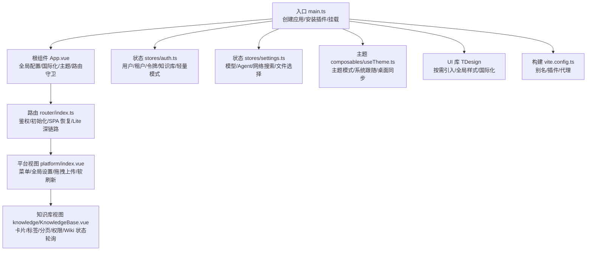
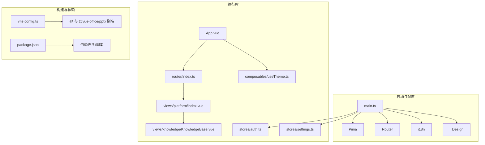
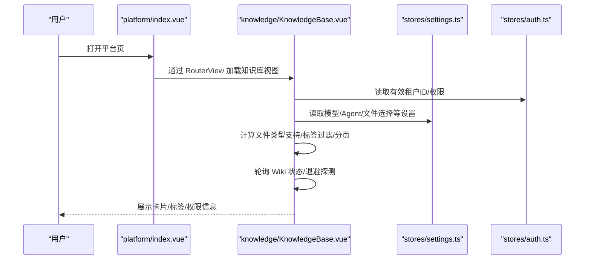
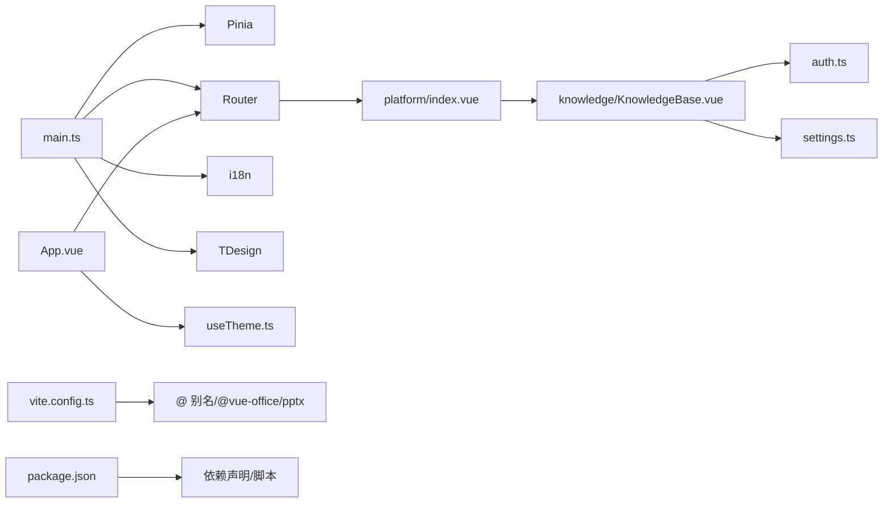

# 组件架构

<cite>
**本文引用的文件**
- [frontend/src/main.ts](file://frontend/src/main.ts)
- [frontend/src/App.vue](file://frontend/src/App.vue)
- [frontend/src/router/index.ts](file://frontend/src/router/index.ts)
- [frontend/src/stores/auth.ts](file://frontend/src/stores/auth.ts)
- [frontend/src/stores/settings.ts](file://frontend/src/stores/settings.ts)
- [frontend/src/composables/useTheme.ts](file://frontend/src/composables/useTheme.ts)
- [frontend/src/views/platform/index.vue](file://frontend/src/views/platform/index.vue)
- [frontend/src/views/knowledge/KnowledgeBase.vue](file://frontend/src/views/knowledge/KnowledgeBase.vue)
- [frontend/package.json](file://frontend/package.json)
- [frontend/vite.config.ts](file://frontend/vite.config.ts)
</cite>

## 目录
1. [简介](#简介)
2. [项目结构](#项目结构)
3. [核心组件](#核心组件)
4. [架构总览](#架构总览)
5. [组件详解](#组件详解)
6. [依赖关系分析](#依赖关系分析)
7. [性能考量](#性能考量)
8. [故障排查指南](#故障排查指南)
9. [结论](#结论)
10. [附录](#附录)

## 简介
本文件面向前端开发者，系统梳理 WeKnora 前端组件架构与开发实践，覆盖页面组件设计模式、业务组件封装策略、UI 组件库使用、组件通信与事件处理、属性传递、可复用组件设计、组合式 API 与响应式数据绑定、视图组织与生命周期管理、性能优化策略，以及组件测试、文档与版本管理建议。目标是提供一套可落地的组件开发指导与设计模式参考。

## 项目结构
WeKnora 前端采用 Vue 3 + TypeScript + Vite 技术栈，结合 Pinia 状态管理与 TDesign UI 组件库，路由基于 Vue Router。应用入口集中于 main.ts，根组件 App.vue 负责全局配置与 OIDC 登录回调处理；路由层负责鉴权与系统初始化；各业务视图通过组合式 API 与状态管理协作，实现模块化的页面组件设计。

图表来源
- [frontend/src/main.ts:1-31](file://frontend/src/main.ts#L1-L31)
- [frontend/src/App.vue:1-209](file://frontend/src/App.vue#L1-L209)
- [frontend/src/router/index.ts:1-232](file://frontend/src/router/index.ts#L1-L232)
- [frontend/src/views/platform/index.vue:1-205](file://frontend/src/views/platform/index.vue#L1-L205)
- [frontend/src/views/knowledge/KnowledgeBase.vue:1-800](file://frontend/src/views/knowledge/KnowledgeBase.vue#L1-L800)
- [frontend/src/stores/auth.ts:1-252](file://frontend/src/stores/auth.ts#L1-L252)
- [frontend/src/stores/settings.ts:1-385](file://frontend/src/stores/settings.ts#L1-L385)
- [frontend/src/composables/useTheme.ts:1-81](file://frontend/src/composables/useTheme.ts#L1-L81)
- [frontend/vite.config.ts:1-56](file://frontend/vite.config.ts#L1-L56)

章节来源
- [frontend/src/main.ts:1-31](file://frontend/src/main.ts#L1-L31)
- [frontend/src/App.vue:1-209](file://frontend/src/App.vue#L1-L209)
- [frontend/src/router/index.ts:1-232](file://frontend/src/router/index.ts#L1-L232)
- [frontend/src/views/platform/index.vue:1-205](file://frontend/src/views/platform/index.vue#L1-L205)
- [frontend/src/views/knowledge/KnowledgeBase.vue:1-800](file://frontend/src/views/knowledge/KnowledgeBase.vue#L1-L800)
- [frontend/src/stores/auth.ts:1-252](file://frontend/src/stores/auth.ts#L1-L252)
- [frontend/src/stores/settings.ts:1-385](file://frontend/src/stores/settings.ts#L1-L385)
- [frontend/src/composables/useTheme.ts:1-81](file://frontend/src/composables/useTheme.ts#L1-L81)
- [frontend/vite.config.ts:1-56](file://frontend/vite.config.ts#L1-L56)

## 核心组件
- 应用入口与全局配置
  - 在入口文件中统一注册 TDesign、Pinia、Router、i18n，并在路由就绪后再挂载，避免首屏闪烁与跳转异常。
- 根组件 App.vue
  - 负责 TDesign 国际化配置、OIDC 回调解析与持久化、全局更新检测定时器、手动知识编辑器挂载。
- 路由系统 router/index.ts
  - 实现登录态与系统初始化校验、自动登录（Lite）、路由守卫与 Lite 深链路恢复、会话级路径持久化。
- 状态管理 stores
  - auth.ts：用户、租户、令牌、知识库、当前 KB、租户选择、Lite 模式等状态与持久化。
  - settings.ts：模型配置、Agent 配置、网络搜索、记忆、文件选择、智能体选择等设置与持久化。
- 主题 composable useTheme.ts
  - 提供主题模式切换、系统跟随、桌面端原生窗口颜色同步。
- 视图组件
  - platform/index.vue：平台主布局、菜单、全局设置、拖拽上传遮罩、软刷新与键盘事件拦截。
  - knowledge/KnowledgeBase.vue：知识库详情页，包含卡片列表、标签管理、分页、权限控制、Wiki 状态轮询与面包屑提示。

章节来源
- [frontend/src/main.ts:1-31](file://frontend/src/main.ts#L1-L31)
- [frontend/src/App.vue:1-209](file://frontend/src/App.vue#L1-L209)
- [frontend/src/router/index.ts:1-232](file://frontend/src/router/index.ts#L1-L232)
- [frontend/src/stores/auth.ts:1-252](file://frontend/src/stores/auth.ts#L1-L252)
- [frontend/src/stores/settings.ts:1-385](file://frontend/src/stores/settings.ts#L1-L385)
- [frontend/src/composables/useTheme.ts:1-81](file://frontend/src/composables/useTheme.ts#L1-L81)
- [frontend/src/views/platform/index.vue:1-205](file://frontend/src/views/platform/index.vue#L1-L205)
- [frontend/src/views/knowledge/KnowledgeBase.vue:1-800](file://frontend/src/views/knowledge/KnowledgeBase.vue#L1-L800)

## 架构总览
WeKnora 前端采用“入口装配 + 根组件协调 + 路由守卫 + 状态中心 + 视图模块”的分层架构。UI 层基于 TDesign，通过按需引入与全局样式保证一致性；构建层通过 Vite 插件与别名提升开发体验；跨组件通信主要通过 props、事件、provide/inject、Pinia 状态与自定义事件实现。

图表来源
- [frontend/src/main.ts:1-31](file://frontend/src/main.ts#L1-L31)
- [frontend/src/App.vue:1-209](file://frontend/src/App.vue#L1-L209)
- [frontend/src/router/index.ts:1-232](file://frontend/src/router/index.ts#L1-L232)
- [frontend/src/views/platform/index.vue:1-205](file://frontend/src/views/platform/index.vue#L1-L205)
- [frontend/src/views/knowledge/KnowledgeBase.vue:1-800](file://frontend/src/views/knowledge/KnowledgeBase.vue#L1-L800)
- [frontend/src/stores/auth.ts:1-252](file://frontend/src/stores/auth.ts#L1-L252)
- [frontend/src/stores/settings.ts:1-385](file://frontend/src/stores/settings.ts#L1-L385)
- [frontend/src/composables/useTheme.ts:1-81](file://frontend/src/composables/useTheme.ts#L1-L81)
- [frontend/vite.config.ts:1-56](file://frontend/vite.config.ts#L1-L56)
- [frontend/package.json:1-64](file://frontend/package.json#L1-L64)

## 组件详解

### 页面组件设计模式
- 平台视图 platform/index.vue
  - 设计要点：菜单与路由视图分离、全局上传遮罩、软刷新与键盘事件拦截、provide/inject 传递 reload 方法、全局拖拽上传事件监听与清理。
  - 关键交互：拖拽进入/离开计数器避免子元素触发、初始化检查、批量文件处理、Wails 桌面端快捷键拦截。
- 知识库视图 knowledge/KnowledgeBase.vue
  - 设计要点：Tab 切换与 URL 同步、标签过滤与分页、权限计算与角色展示、Wiki 状态轮询与退避探测、文件类型支持集合计算、URL 导入与事件驱动刷新。
  - 性能策略：防抖搜索、分页加载、轮询开关与定时器清理、组件卸载时资源回收。

图表来源
- [frontend/src/views/platform/index.vue:1-205](file://frontend/src/views/platform/index.vue#L1-L205)
- [frontend/src/views/knowledge/KnowledgeBase.vue:1-800](file://frontend/src/views/knowledge/KnowledgeBase.vue#L1-L800)
- [frontend/src/stores/settings.ts:1-385](file://frontend/src/stores/settings.ts#L1-L385)
- [frontend/src/stores/auth.ts:1-252](file://frontend/src/stores/auth.ts#L1-L252)

章节来源
- [frontend/src/views/platform/index.vue:1-205](file://frontend/src/views/platform/index.vue#L1-L205)
- [frontend/src/views/knowledge/KnowledgeBase.vue:1-800](file://frontend/src/views/knowledge/KnowledgeBase.vue#L1-L800)

### 业务组件封装策略
- 组合式 API 与状态解耦
  - 使用 useTheme、useKnowledgeBase 等组合式函数封装主题与业务逻辑，视图组件通过响应式数据与方法进行交互，降低耦合度。
- 视图内聚与职责清晰
  - 知识库视图承担卡片、标签、权限、轮询等职责，避免在多个组件间分散逻辑；通过 watch 与事件驱动实现状态同步。
- 事件驱动与自定义事件
  - 通过自定义事件（如文件上传完成、URL 导入打开）在视图间传递消息，避免直接依赖 DOM 或深层嵌套。

章节来源
- [frontend/src/composables/useTheme.ts:1-81](file://frontend/src/composables/useTheme.ts#L1-L81)
- [frontend/src/views/knowledge/KnowledgeBase.vue:1-800](file://frontend/src/views/knowledge/KnowledgeBase.vue#L1-L800)

### UI 组件库使用方法
- TDesign 按需引入与全局样式
  - 在入口统一安装 TDesign，并引入少量全局样式变量，保证主题与国际化配置生效。
- 国际化与本地化
  - App.vue 中根据 i18n 当前语言动态设置 TDesign 全局语言配置，确保组件文案与系统语言一致。
- 图标离线保护
  - 在应用启动阶段安装图标离线保护，避免运行时请求外部 CDN 导致的闪烁或失败。

章节来源
- [frontend/src/main.ts:1-31](file://frontend/src/main.ts#L1-L31)
- [frontend/src/App.vue:1-209](file://frontend/src/App.vue#L1-L209)

### 组件通信机制、事件处理与属性传递
- Props 与事件
  - 视图组件通过 props 接收路由参数与配置，通过 emits 与父组件通信（如标签变更、文件上传完成）。
- provide/inject
  - 平台视图通过 provide 注入 reload 方法，子视图在需要时触发软刷新，避免整页刷新导致的白屏。
- 自定义事件
  - 知识库视图监听自定义事件（文件上传完成、URL 导入打开），在匹配当前 KB 时刷新列表与标签。
- 路由与查询参数
  - Tab 与筛选条件通过 URL 查询参数同步，实现刷新后状态保留与分享友好。

章节来源
- [frontend/src/views/platform/index.vue:1-205](file://frontend/src/views/platform/index.vue#L1-L205)
- [frontend/src/views/knowledge/KnowledgeBase.vue:1-800](file://frontend/src/views/knowledge/KnowledgeBase.vue#L1-L800)

### 可复用组件设计与组合式 API
- useTheme
  - 提供主题模式切换与系统跟随能力，桌面端同步原生窗口颜色，减少刷新白屏。
- useKnowledgeBase
  - 封装知识库卡片列表、分页、可见性控制等通用逻辑，视图组件通过组合式函数直接消费。
- 响应式数据绑定
  - 通过 ref、reactive、computed、watch 实现复杂状态与联动逻辑，如文件类型支持集合、权限计算、轮询控制。

章节来源
- [frontend/src/composables/useTheme.ts:1-81](file://frontend/src/composables/useTheme.ts#L1-L81)
- [frontend/src/views/knowledge/KnowledgeBase.vue:1-800](file://frontend/src/views/knowledge/KnowledgeBase.vue#L1-L800)

### 视图组件组织与生命周期管理
- 生命周期钩子
  - 在 mounted 中发起初始化请求、注册全局事件、启动轮询；在 unmounted 中清理定时器、移除事件监听，防止内存泄漏。
- 软刷新与整页刷新
  - 平台视图对 Wails 桌面端拦截 Cmd/Ctrl+R，改为前端软刷新，避免整页刷新导致的状态不一致。
- 路由守卫与恢复
  - 路由守卫中处理自动登录、Lite 模式深链路恢复、会话路径持久化，提升用户体验。

章节来源
- [frontend/src/views/platform/index.vue:1-205](file://frontend/src/views/platform/index.vue#L1-L205)
- [frontend/src/router/index.ts:1-232](file://frontend/src/router/index.ts#L1-L232)

### 性能优化策略
- 轮询与定时器管理
  - 知识库视图对 Wiki 状态采用 5s 轮询，空闲时停止定时器；同时安排多次退避探测，尽快点亮“索引中”提示。
- 防抖与分页
  - 标签搜索与文档搜索使用防抖，减少请求频率；分页加载避免一次性渲染大量数据。
- 资源回收
  - 组件卸载时清理轮询、定时器与事件监听，避免内存泄漏。
- 构建优化
  - Vite 配置别名与插件，开发代理指向后端服务，提升调试效率。

章节来源
- [frontend/src/views/knowledge/KnowledgeBase.vue:1-800](file://frontend/src/views/knowledge/KnowledgeBase.vue#L1-L800)
- [frontend/vite.config.ts:1-56](file://frontend/vite.config.ts#L1-L56)

### 组件测试方法、组件文档编写与组件版本管理
- 组件测试
  - 建议针对组合式函数（如 useTheme）编写单元测试，验证主题切换与系统跟随逻辑；对视图组件使用集成测试，覆盖路由守卫、事件监听与状态变更。
- 组件文档
  - 为每个可复用组件编写 README，说明 props、events、slots、组合式函数参数与返回值、典型使用场景与注意事项。
- 版本管理
  - 前端版本号在 package.json 中维护，发布前统一更新版本并生成变更日志；构建产物通过 CI/CD 管道分发。

章节来源
- [frontend/package.json:1-64](file://frontend/package.json#L1-L64)

## 依赖关系分析
- 外部依赖
  - Vue 3、Pinia、Vue Router、TDesign、Vue I18n、Mermaid、KaTeX、Marked 等。
- 内部依赖
  - 视图组件依赖状态管理（auth、settings）、组合式函数（useTheme）、路由与国际化；平台视图作为枢纽连接菜单、设置与知识库视图。
- 构建依赖
  - Vite 插件与别名配置，开发代理指向后端 API 与文件服务。

图表来源
- [frontend/src/main.ts:1-31](file://frontend/src/main.ts#L1-L31)
- [frontend/src/App.vue:1-209](file://frontend/src/App.vue#L1-L209)
- [frontend/src/router/index.ts:1-232](file://frontend/src/router/index.ts#L1-L232)
- [frontend/src/views/platform/index.vue:1-205](file://frontend/src/views/platform/index.vue#L1-L205)
- [frontend/src/views/knowledge/KnowledgeBase.vue:1-800](file://frontend/src/views/knowledge/KnowledgeBase.vue#L1-L800)
- [frontend/src/stores/auth.ts:1-252](file://frontend/src/stores/auth.ts#L1-L252)
- [frontend/src/stores/settings.ts:1-385](file://frontend/src/stores/settings.ts#L1-L385)
- [frontend/src/composables/useTheme.ts:1-81](file://frontend/src/composables/useTheme.ts#L1-L81)
- [frontend/vite.config.ts:1-56](file://frontend/vite.config.ts#L1-L56)
- [frontend/package.json:1-64](file://frontend/package.json#L1-L64)

章节来源
- [frontend/src/main.ts:1-31](file://frontend/src/main.ts#L1-L31)
- [frontend/src/App.vue:1-209](file://frontend/src/App.vue#L1-L209)
- [frontend/src/router/index.ts:1-232](file://frontend/src/router/index.ts#L1-L232)
- [frontend/src/views/platform/index.vue:1-205](file://frontend/src/views/platform/index.vue#L1-L205)
- [frontend/src/views/knowledge/KnowledgeBase.vue:1-800](file://frontend/src/views/knowledge/KnowledgeBase.vue#L1-L800)
- [frontend/src/stores/auth.ts:1-252](file://frontend/src/stores/auth.ts#L1-L252)
- [frontend/src/stores/settings.ts:1-385](file://frontend/src/stores/settings.ts#L1-L385)
- [frontend/src/composables/useTheme.ts:1-81](file://frontend/src/composables/useTheme.ts#L1-L81)
- [frontend/vite.config.ts:1-56](file://frontend/vite.config.ts#L1-L56)
- [frontend/package.json:1-64](file://frontend/package.json#L1-L64)

## 性能考量
- 轮询与退避：对后台任务状态采用 5s 轮询并在活跃时启动，空闲时停止；同时安排多次退避探测，缩短“索引中”提示延迟。
- 防抖与分页：标签搜索与文档搜索使用防抖，分页加载避免一次性渲染大量数据。
- 资源回收：组件卸载时清理定时器与事件监听，避免内存泄漏。
- 构建与代理：Vite 别名与开发代理提升开发效率，减少网络往返。

章节来源
- [frontend/src/views/knowledge/KnowledgeBase.vue:1-800](file://frontend/src/views/knowledge/KnowledgeBase.vue#L1-L800)
- [frontend/vite.config.ts:1-56](file://frontend/vite.config.ts#L1-L56)

## 故障排查指南
- OIDC 登录回调
  - 若登录失败或出现错误提示，检查回调参数解析与清理逻辑，确认路由跳转与消息提示正确执行。
- 路由守卫与自动登录
  - 若自动登录失败或无法进入平台页，检查自动设置标记位与本地存储状态，确认 Lite 模式与深链路恢复逻辑。
- 拖拽上传与软刷新
  - 若桌面端整页刷新导致白屏，确认键盘事件拦截与软刷新逻辑；检查全局事件监听注册与清理。
- Wiki 状态轮询
  - 若“索引中”提示不出现，检查轮询开关与退避探测逻辑，确认 KB 类型与索引策略。

章节来源
- [frontend/src/App.vue:1-209](file://frontend/src/App.vue#L1-L209)
- [frontend/src/router/index.ts:1-232](file://frontend/src/router/index.ts#L1-L232)
- [frontend/src/views/platform/index.vue:1-205](file://frontend/src/views/platform/index.vue#L1-L205)
- [frontend/src/views/knowledge/KnowledgeBase.vue:1-800](file://frontend/src/views/knowledge/KnowledgeBase.vue#L1-L800)

## 结论
WeKnora 的前端组件架构以 Vue 3 为核心，结合 Pinia 与 TDesign，形成清晰的入口装配、路由守卫、状态中心与视图模块的分层体系。通过组合式 API、事件驱动与生命周期管理，实现了高内聚、低耦合的页面组件设计；配合轮询与防抖等性能策略，保障了复杂业务场景下的用户体验。建议在后续迭代中完善组件测试与文档，规范版本管理流程，持续提升可维护性与可扩展性。

## 附录
- 构建与开发
  - Vite 配置包含插件、别名与开发代理，便于前后端联调。
  - 包依赖与脚本在 package.json 中统一管理，支持开发、构建与预览。

章节来源
- [frontend/vite.config.ts:1-56](file://frontend/vite.config.ts#L1-L56)
- [frontend/package.json:1-64](file://frontend/package.json#L1-L64)