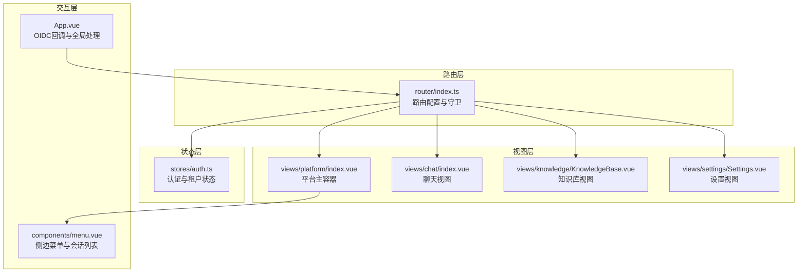
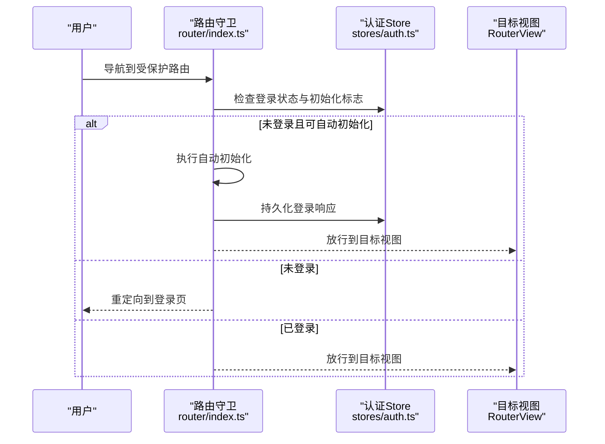
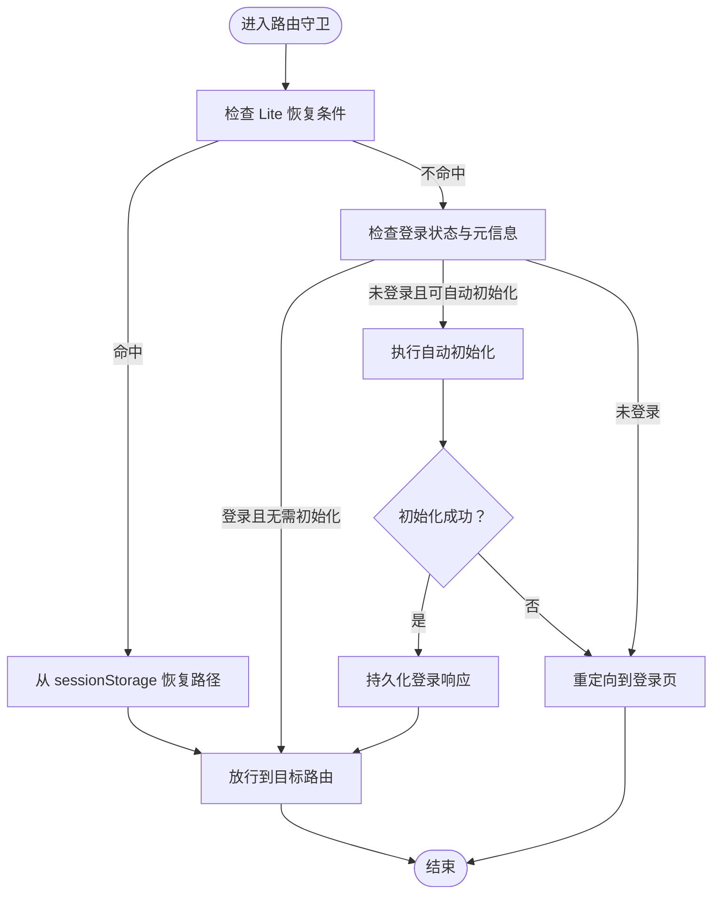
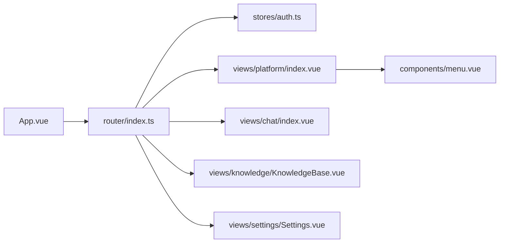

# 路由系统

<cite>
**本文档引用的文件**
- [frontend/src/router/index.ts](file://frontend/src/router/index.ts)
- [frontend/src/views/platform/index.vue](file://frontend/src/views/platform/index.vue)
- [frontend/src/views/chat/index.vue](file://frontend/src/views/chat/index.vue)
- [frontend/src/views/knowledge/KnowledgeBase.vue](file://frontend/src/views/knowledge/KnowledgeBase.vue)
- [frontend/src/views/settings/Settings.vue](file://frontend/src/views/settings/Settings.vue)
- [frontend/src/stores/auth.ts](file://frontend/src/stores/auth.ts)
- [frontend/src/components/menu.vue](file://frontend/src/components/menu.vue)
- [frontend/src/App.vue](file://frontend/src/App.vue)
</cite>

## 目录
1. [简介](#简介)
2. [项目结构](#项目结构)
3. [核心组件](#核心组件)
4. [架构总览](#架构总览)
5. [详细组件分析](#详细组件分析)
6. [依赖关系分析](#依赖关系分析)
7. [性能考虑](#性能考虑)
8. [故障排查指南](#故障排查指南)
9. [结论](#结论)

## 简介
本文件系统性梳理 WeKnora 前端路由体系，围绕 Vue Router 配置、路由守卫与导航拦截、懒加载与动态路由、权限控制、路由元信息、面包屑与页面标题管理、以及平台/聊天/知识库/设置等模块的组织结构进行深入解析，并提供参数传递、查询字符串处理与路由缓存策略建议，帮助前端开发者高效落地路由设计与实现。

## 项目结构
WeKnora 前端路由采用 Vue Router 4 + TypeScript 构建，核心入口位于路由配置文件，配合平台主容器、聊天视图、知识库视图与设置视图，形成清晰的模块化路由组织。路由守卫统一处理认证与初始化状态检查，支持 Lite 模式下的会话恢复与深度链接恢复。

**图表来源**
- [frontend/src/router/index.ts:35-135](file://frontend/src/router/index.ts#L35-L135)
- [frontend/src/views/platform/index.vue:1-205](file://frontend/src/views/platform/index.vue#L1-L205)
- [frontend/src/views/chat/index.vue:1-800](file://frontend/src/views/chat/index.vue#L1-L800)
- [frontend/src/views/knowledge/KnowledgeBase.vue:1-800](file://frontend/src/views/knowledge/KnowledgeBase.vue#L1-L800)
- [frontend/src/views/settings/Settings.vue:1-585](file://frontend/src/views/settings/Settings.vue#L1-L585)
- [frontend/src/stores/auth.ts:1-252](file://frontend/src/stores/auth.ts#L1-L252)
- [frontend/src/components/menu.vue:1-800](file://frontend/src/components/menu.vue#L1-L800)
- [frontend/src/App.vue:1-209](file://frontend/src/App.vue#L1-L209)

**章节来源**
- [frontend/src/router/index.ts:35-135](file://frontend/src/router/index.ts#L35-L135)
- [frontend/src/views/platform/index.vue:1-205](file://frontend/src/views/platform/index.vue#L1-L205)

## 核心组件
- 路由配置与守卫
  - 基于 createRouter/createWebHistory 构建，定义根路径重定向、登录页、邀请加入组织重定向、知识库主页、平台主路由及其子路由。
  - 路由元信息包含 requiresAuth、requiresInit，用于守卫决策。
  - 全局前置守卫负责认证检查、自动初始化（Lite 模式）、登录页放行与登录后重定向。
  - 全局后置守卫记录 Lite 模式下的最后访问路径，用于硬刷新后的恢复。
- 平台主容器
  - 承载 RouterView，注入菜单与全局设置弹窗，提供软刷新能力与拖拽上传遮罩。
- 聊天视图
  - 基于路由参数 chatid 动态加载会话消息，支持流式事件处理、推荐问题、滚动与分页加载。
- 知识库视图
  - 支持知识库详情、文档/ Wiki/ 图谱三类标签页，面包屑导航与权限控制，查询字符串 tab 参数同步。
- 设置视图
  - 平台设置弹窗，左侧导航与右侧内容区域，支持 ESC 关闭与快捷导航事件。
- 认证状态
  - Pinia 认证 Store 提供用户、租户、令牌、Lite 模式等状态，持久化至 localStorage。
- 侧边菜单
  - 动态构建会话列表，根据路由状态高亮图标与菜单项，支持批量管理与删除。

**章节来源**
- [frontend/src/router/index.ts:169-222](file://frontend/src/router/index.ts#L169-L222)
- [frontend/src/views/platform/index.vue:1-205](file://frontend/src/views/platform/index.vue#L1-L205)
- [frontend/src/views/chat/index.vue:1-800](file://frontend/src/views/chat/index.vue#L1-L800)
- [frontend/src/views/knowledge/KnowledgeBase.vue:1-800](file://frontend/src/views/knowledge/KnowledgeBase.vue#L1-L800)
- [frontend/src/views/settings/Settings.vue:1-585](file://frontend/src/views/settings/Settings.vue#L1-L585)
- [frontend/src/stores/auth.ts:1-252](file://frontend/src/stores/auth.ts#L1-L252)
- [frontend/src/components/menu.vue:1-800](file://frontend/src/components/menu.vue#L1-L800)

## 架构总览
路由系统采用“集中配置 + 全局守卫 + 模块化视图”的架构。路由配置文件集中声明路径、懒加载组件与元信息；全局守卫统一处理认证与初始化；各模块视图通过 RouterView 渲染，配合状态 Store 实现权限与业务逻辑解耦。

**图表来源**
- [frontend/src/router/index.ts:169-222](file://frontend/src/router/index.ts#L169-L222)
- [frontend/src/stores/auth.ts:1-252](file://frontend/src/stores/auth.ts#L1-L252)

## 详细组件分析

### 路由配置与懒加载
- 路由定义
  - 根路径重定向至平台知识库列表。
  - 登录页与邀请加入组织重定向，将邀请码转换为标准查询参数。
  - 知识库主页与平台主路由，平台路由包含多级子路由：设置、知识库列表、知识库详情、知识库搜索、智能体列表、全局/知识库级创建聊天、对话详情、组织列表。
- 懒加载策略
  - 所有视图组件均通过动态 import 实现按需加载，降低首屏体积。
- 路由元信息
  - requiresAuth：是否要求登录。
  - requiresInit：是否要求系统初始化完成。
- Lite 模式支持
  - 硬刷新后若默认入口命中平台范围，尝试从 sessionStorage 恢复上次访问路径，确保 Lite 模式体验一致。

**章节来源**
- [frontend/src/router/index.ts:35-135](file://frontend/src/router/index.ts#L35-L135)
- [frontend/src/router/index.ts:169-229](file://frontend/src/router/index.ts#L169-L229)

### 路由守卫机制与导航拦截
- 前置守卫
  - Lite 恢复：检测 Lite 模式与默认入口，尝试恢复上次访问路径。
  - 登录页放行：已登录用户访问登录页时重定向至知识库列表。
  - 自动初始化：未登录但满足条件时尝试自动初始化，成功后放行。
  - 认证检查：未登录则重定向至登录页。
- 后置守卫
  - Lite 模式下记录平台子路由访问路径，便于恢复。

**图表来源**
- [frontend/src/router/index.ts:169-222](file://frontend/src/router/index.ts#L169-L222)

**章节来源**
- [frontend/src/router/index.ts:169-229](file://frontend/src/router/index.ts#L169-L229)

### 动态路由与参数传递
- 动态路由
  - 知识库详情：/platform/knowledge-bases/:kbId
  - 对话详情：/platform/chat/:chatid
  - 全局/知识库级创建聊天：/platform/creatChat 与 /platform/knowledge-bases/:kbId/creatChat
- 参数读取与同步
  - 知识库视图通过路由参数与查询字符串 tab 同步当前激活标签页，刷新时保持状态。
  - 聊天视图通过路由参数 chatid 加载对应会话消息，支持滚动加载与流式事件处理。
- 查询字符串处理
  - 知识库视图将 activeKbTab 同步到 query.tab，避免刷新丢失。
  - 登录邀请重定向将 code 转换为 invite_code 透传。

**章节来源**
- [frontend/src/views/knowledge/KnowledgeBase.vue:50-698](file://frontend/src/views/knowledge/KnowledgeBase.vue#L50-L698)
- [frontend/src/views/chat/index.vue:125-264](file://frontend/src/views/chat/index.vue#L125-L264)
- [frontend/src/router/index.ts:52-58](file://frontend/src/router/index.ts#L52-L58)

### 权限控制与集成
- 认证状态
  - 通过 Pinia Store 管理用户、租户、令牌与 Lite 模式，持久化至 localStorage。
- 知识库权限
  - 知识库视图计算 isOwner、canEdit、canManage 等权限，结合组织共享记录与后端返回权限标识，决定操作按钮与提示。
- 菜单与图标状态
  - 侧边菜单根据当前路由高亮对应图标与菜单项，支持批量管理与删除。

**章节来源**
- [frontend/src/stores/auth.ts:1-252](file://frontend/src/stores/auth.ts#L1-L252)
- [frontend/src/views/knowledge/KnowledgeBase.vue:191-233](file://frontend/src/views/knowledge/KnowledgeBase.vue#L191-L233)
- [frontend/src/components/menu.vue:224-262](file://frontend/src/components/menu.vue#L224-L262)

### 面包屑导航实现
- 知识库视图面包屑
  - 包含“知识库列表 -> 当前知识库 -> 文档/Wiki/图谱”三级结构，支持点击跳转与状态指示（如 Wiki 索引中）。
  - 通过 activeKbTab 控制当前标签页，tab 切换时同步到查询字符串。
- FAQ 与 Wiki 页面
  - FAQ 管理器同样提供面包屑，便于快速回到知识库列表。

**章节来源**
- [frontend/src/views/knowledge/KnowledgeBase.vue:1647-1716](file://frontend/src/views/knowledge/KnowledgeBase.vue#L1647-L1716)

### 页面标题管理
- OIDC 回调处理
  - App.vue 监听 URL hash 中的 OIDC 结果，解码并持久化登录信息后重定向至平台知识库列表，同时清理回调参数，避免二次触发。
- 路由标题
  - 路由层未显式设置页面标题，建议在视图层或守卫中结合 i18n 与路由元信息动态设置 document.title，以提升 SEO 与用户体验。

**章节来源**
- [frontend/src/App.vue:39-135](file://frontend/src/App.vue#L39-L135)
- [frontend/src/router/index.ts:35-135](file://frontend/src/router/index.ts#L35-L135)

### 平台/聊天/知识库/设置路由组织
- 平台主路由
  - /platform 下包含设置、知识库列表、知识库详情、知识库搜索、智能体列表、创建聊天、对话详情、组织列表等子路由。
- 聊天路由
  - /platform/chat/:chatid 详情页，支持推荐问题、流式事件、滚动与分页加载。
- 知识库路由
  - /platform/knowledge-bases 与 /platform/knowledge-bases/:kbId，支持文档/ Wiki/ 图谱三类标签页与权限控制。
- 设置路由
  - /platform/settings 作为设置弹窗入口，支持 ESC 关闭与快捷导航事件。

**章节来源**
- [frontend/src/router/index.ts:68-133](file://frontend/src/router/index.ts#L68-L133)
- [frontend/src/views/platform/index.vue:1-205](file://frontend/src/views/platform/index.vue#L1-L205)
- [frontend/src/views/chat/index.vue:1-800](file://frontend/src/views/chat/index.vue#L1-L800)
- [frontend/src/views/knowledge/KnowledgeBase.vue:1-800](file://frontend/src/views/knowledge/KnowledgeBase.vue#L1-L800)
- [frontend/src/views/settings/Settings.vue:1-585](file://frontend/src/views/settings/Settings.vue#L1-L585)

### 路由缓存策略
- 组件缓存
  - 平台主容器通过 RouterView 渲染子路由，建议在需要保持状态的场景使用 keep-alive 或路由级缓存策略（如按需缓存知识库详情与聊天视图）。
- 会话与标签页状态
  - 聊天视图通过路由参数与本地状态管理会话消息与滚动位置；知识库视图通过查询字符串同步标签页状态，减少刷新丢失。
- Lite 模式路径记忆
  - 后置守卫记录平台子路由访问路径，避免硬刷新后回到默认入口。

**章节来源**
- [frontend/src/views/platform/index.vue:3-4](file://frontend/src/views/platform/index.vue#L3-L4)
- [frontend/src/views/chat/index.vue:240-264](file://frontend/src/views/chat/index.vue#L240-L264)
- [frontend/src/views/knowledge/KnowledgeBase.vue:689-698](file://frontend/src/views/knowledge/KnowledgeBase.vue#L689-L698)
- [frontend/src/router/index.ts:224-229](file://frontend/src/router/index.ts#L224-L229)

## 依赖关系分析
- 路由配置依赖
  - 路由元信息驱动守卫逻辑，守卫依赖认证 Store 与自动初始化接口。
- 视图依赖
  - 平台视图依赖菜单组件与设置弹窗；聊天视图依赖消息 API 与流式事件；知识库视图依赖知识库 API 与权限 Store；设置视图依赖 UI Store 与多子模块组件。
- 交互依赖
  - 侧边菜单动态构建会话列表，与聊天 API 交互；App.vue 处理 OIDC 回调，影响路由初始化。

**图表来源**
- [frontend/src/router/index.ts:1-232](file://frontend/src/router/index.ts#L1-L232)
- [frontend/src/stores/auth.ts:1-252](file://frontend/src/stores/auth.ts#L1-L252)
- [frontend/src/views/platform/index.vue:1-205](file://frontend/src/views/platform/index.vue#L1-L205)
- [frontend/src/views/chat/index.vue:1-800](file://frontend/src/views/chat/index.vue#L1-L800)
- [frontend/src/views/knowledge/KnowledgeBase.vue:1-800](file://frontend/src/views/knowledge/KnowledgeBase.vue#L1-L800)
- [frontend/src/views/settings/Settings.vue:1-585](file://frontend/src/views/settings/Settings.vue#L1-L585)
- [frontend/src/components/menu.vue:1-800](file://frontend/src/components/menu.vue#L1-L800)
- [frontend/src/App.vue:1-209](file://frontend/src/App.vue#L1-L209)

**章节来源**
- [frontend/src/router/index.ts:1-232](file://frontend/src/router/index.ts#L1-L232)
- [frontend/src/stores/auth.ts:1-252](file://frontend/src/stores/auth.ts#L1-L252)
- [frontend/src/components/menu.vue:1-800](file://frontend/src/components/menu.vue#L1-L800)
- [frontend/src/App.vue:1-209](file://frontend/src/App.vue#L1-L209)

## 性能考虑
- 懒加载与代码分割
  - 所有视图组件采用动态 import，建议结合路由级别的预加载策略（如对高频访问的子路由进行预加载）。
- 路由守卫轻量化
  - 守卫中尽量避免重型计算，将初始化与认证检查拆分为独立模块，减少阻塞。
- 视图状态持久化
  - 聊天与知识库视图通过路由参数与查询字符串同步状态，减少刷新带来的重载成本。
- Lite 模式优化
  - 会话恢复与路径记忆减少无效导航，提升硬刷新体验。

[本节为通用指导，无需特定文件引用]

## 故障排查指南
- 登录后无法进入受保护页面
  - 检查守卫逻辑与自动初始化流程，确认认证 Store 已持久化登录响应。
- Lite 模式硬刷新路径异常
  - 确认 sessionStorage 中的最后路径是否为平台子路由且安全可恢复。
- 知识库标签页状态丢失
  - 确认 activeKbTab 是否同步到 query.tab，刷新后是否正确读取。
- 聊天视图消息不加载
  - 检查路由参数 chatid 是否正确传递，API 请求与流式事件处理是否正常。
- 设置弹窗无法关闭
  - 确认 ESC 事件绑定与路由回退逻辑，检查 UI Store 状态。

**章节来源**
- [frontend/src/router/index.ts:169-229](file://frontend/src/router/index.ts#L169-L229)
- [frontend/src/views/knowledge/KnowledgeBase.vue:689-698](file://frontend/src/views/knowledge/KnowledgeBase.vue#L689-L698)
- [frontend/src/views/chat/index.vue:240-264](file://frontend/src/views/chat/index.vue#L240-L264)
- [frontend/src/views/settings/Settings.vue:240-252](file://frontend/src/views/settings/Settings.vue#L240-L252)

## 结论
WeKnora 路由系统以集中配置与全局守卫为核心，结合懒加载、动态路由与查询字符串同步，实现了平台、聊天、知识库与设置模块的清晰组织。通过认证 Store 与权限计算，路由与业务逻辑有效解耦。建议在视图层补充页面标题管理与 keep-alive 缓存策略，进一步提升性能与用户体验。