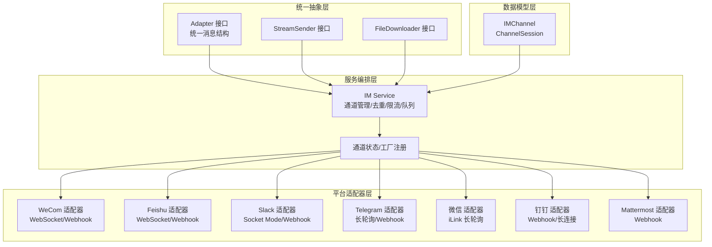
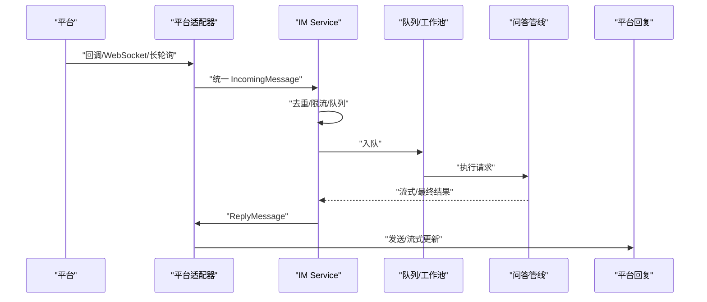
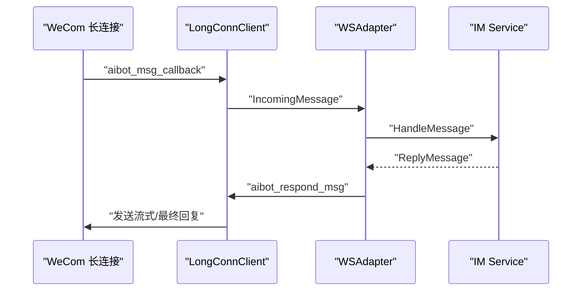
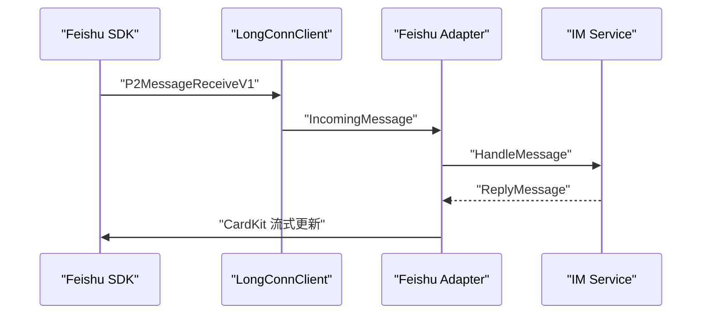
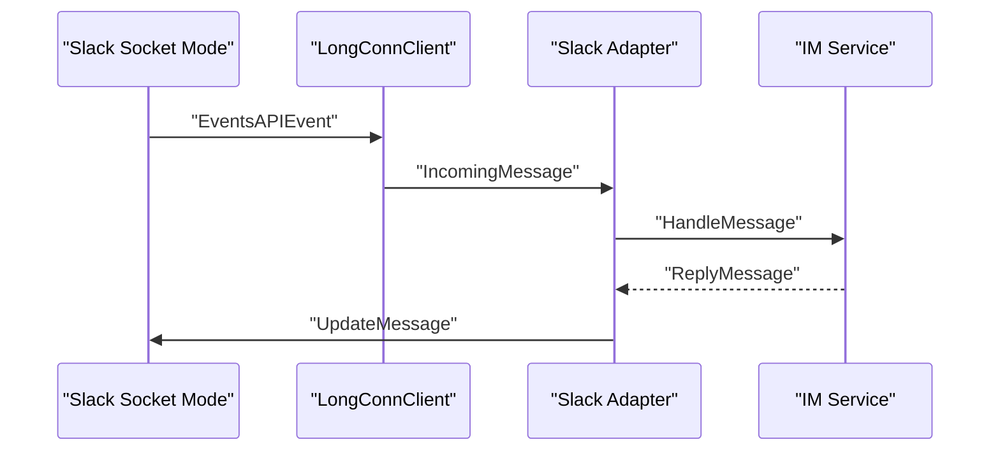
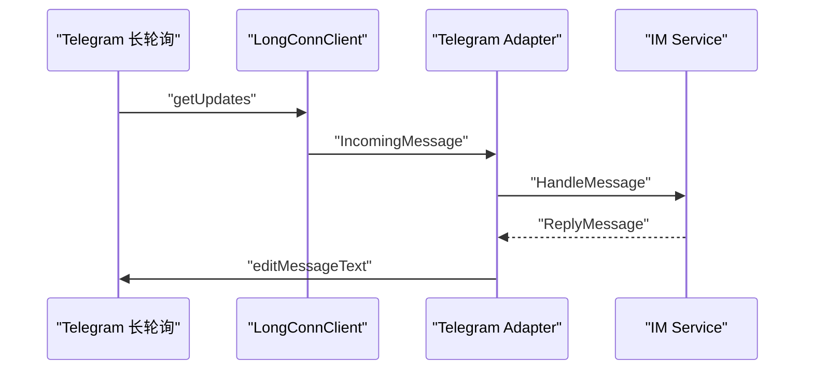
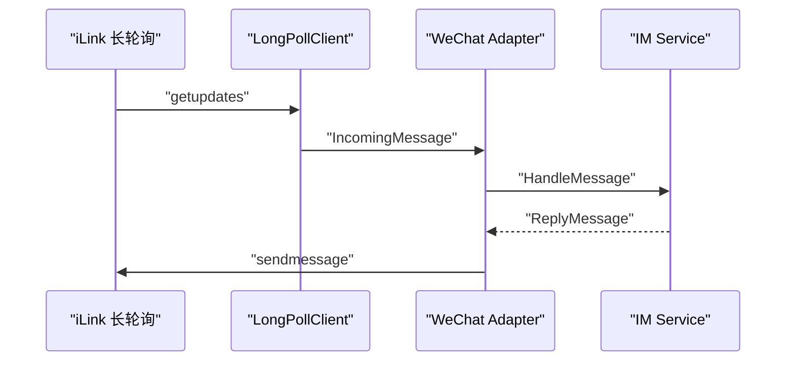
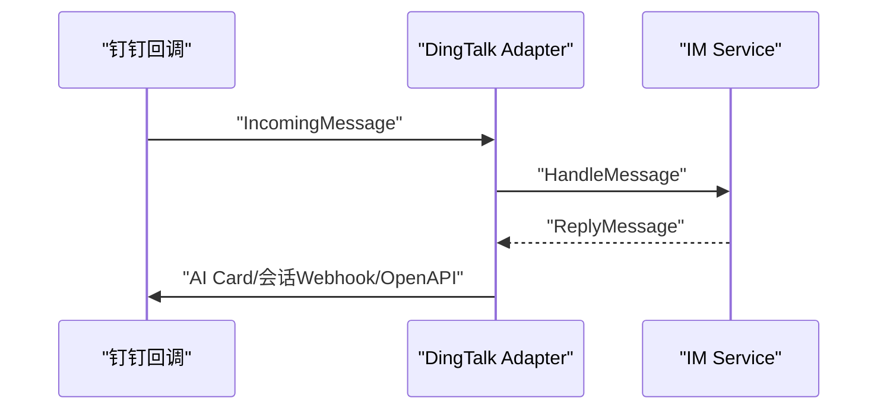
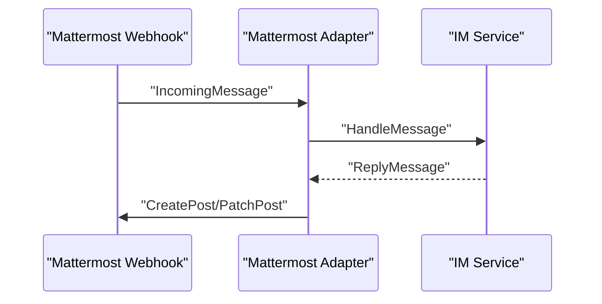
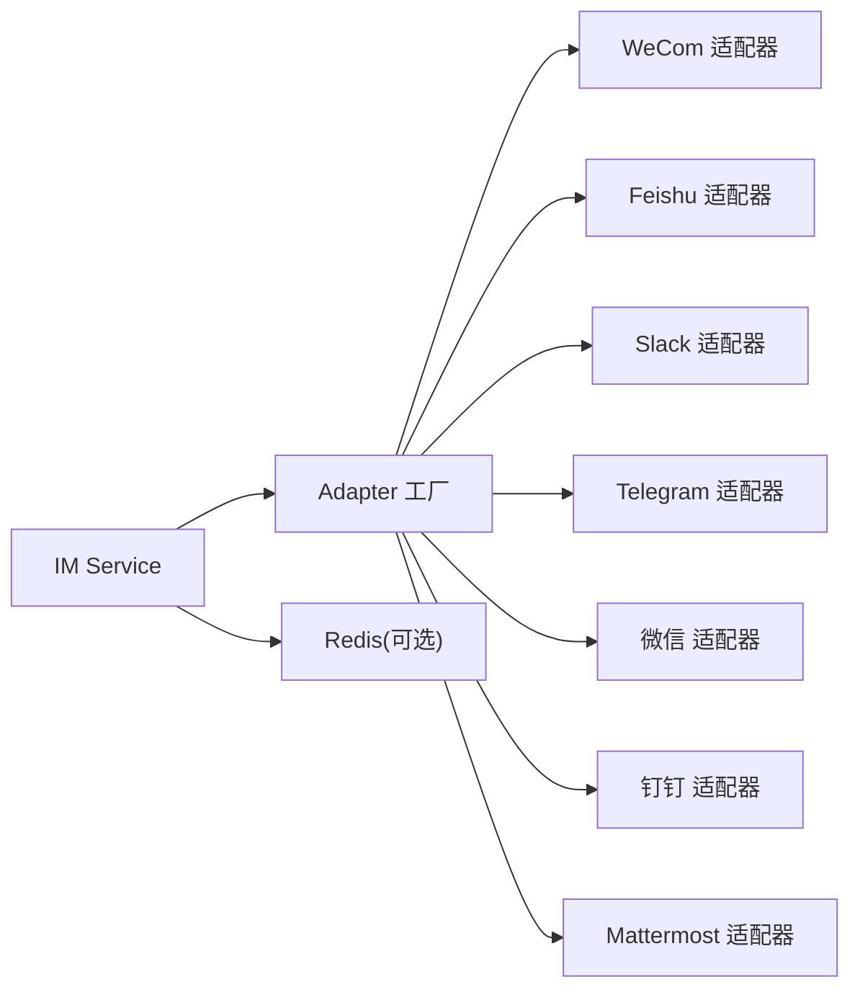

# IM平台适配器

<cite>
**本文档引用的文件**
- [adapter.go](file://internal/im/adapter.go)
- [service.go](file://internal/im/service.go)
- [types.go](file://internal/im/types.go)
- [wecom/adapter.go](file://internal/im/wecom/adapter.go)
- [wecom/ws_adapter.go](file://internal/im/wecom/ws_adapter.go)
- [wecom/longconn.go](file://internal/im/wecom/longconn.go)
- [feishu/adapter.go](file://internal/im/feishu/adapter.go)
- [feishu/longconn.go](file://internal/im/feishu/longconn.go)
- [slack/adapter.go](file://internal/im/slack/adapter.go)
- [slack/longconn.go](file://internal/im/slack/longconn.go)
- [telegram/adapter.go](file://internal/im/telegram/adapter.go)
- [telegram/longconn.go](file://internal/im/telegram/longconn.go)
- [wechat/adapter.go](file://internal/im/wechat/adapter.go)
- [wechat/longpoll.go](file://internal/im/wechat/longpoll.go)
- [dingtalk/adapter.go](file://internal/im/dingtalk/adapter.go)
- [mattermost/adapter.go](file://internal/im/mattermost/adapter.go)
</cite>

## 目录
1. [简介](#简介)
2. [项目结构](#项目结构)
3. [核心组件](#核心组件)
4. [架构总览](#架构总览)
5. [详细组件分析](#详细组件分析)
6. [依赖关系分析](#依赖关系分析)
7. [性能考虑](#性能考虑)
8. [故障排除指南](#故障排除指南)
9. [结论](#结论)

## 简介
本文件为 WeKnora IM 平台适配器系统的完整技术文档，覆盖 WeCom、Feishu、Slack、Telegram、微信、钉钉、Mattermost 七大平台的统一适配器架构与实现细节。文档从统一接口设计、消息解析与回推、流式回复、文件下载、会话管理、分布式一致性、错误处理与性能优化等维度进行深入剖析，并提供适配器开发模板、最佳实践与兼容性处理方案，帮助开发者快速扩展新平台或维护现有适配器。

## 项目结构
IM 子系统采用“统一抽象 + 平台适配器”的分层设计：
- 统一抽象层：定义平台枚举、消息类型、统一入站/出站消息结构、适配器接口与可选能力接口（流式发送、文件下载）。
- 服务编排层：IM Service 负责通道生命周期管理、去重、速率限制、队列与工作池、跨实例停止信号、WebSocket 主从选举等。
- 平台适配器层：各平台分别实现 Adapter 接口；部分平台提供长连接客户端以支持 WebSocket/长轮询事件推送。
- 数据模型层：IMChannel、ChannelSession 等持久化模型，支撑多租户、多通道、会话映射与机器人身份唯一性。

图表来源
- [adapter.go:120-165](file://internal/im/adapter.go#L120-L165)
- [service.go:101-164](file://internal/im/service.go#L101-L164)
- [types.go:14-36](file://internal/im/types.go#L14-L36)

章节来源
- [adapter.go:1-165](file://internal/im/adapter.go#L1-L165)
- [service.go:1-200](file://internal/im/service.go#L1-L200)
- [types.go:1-179](file://internal/im/types.go#L1-L179)

## 核心组件
- 统一接口与消息模型
  - 平台标识、会话模式、消息类型、聊天类型等枚举统一定义。
  - IncomingMessage/ReplyMessage 抽象了文本、文件、图片、线程、引用回复等跨平台语义。
  - Adapter 接口定义回调校验、消息解析、回复发送、URL 验证等能力。
  - 可选接口：StreamSender（流式回复）、FileDownloader（文件下载）。
- 服务编排
  - 通道注册与启动/停止、去重、速率限制、全局队列与工作池、跨实例停止检测、WebSocket 主从选举与接管。
  - 支持单实例与多实例模式，多实例通过 Redis 实现分布式一致性。
- 数据模型
  - IMChannel：通道配置（平台、模式、输出模式、知识库绑定、机器人身份唯一性）。
  - ChannelSession：IM 用户+聊天组合到 WeKnora 会话的映射，支持 thread 模式。

章节来源
- [adapter.go:10-165](file://internal/im/adapter.go#L10-L165)
- [service.go:101-200](file://internal/im/service.go#L101-L200)
- [types.go:14-179](file://internal/im/types.go#L14-L179)

## 架构总览
下图展示了 IM Service 如何协调各平台适配器，完成消息接收、去重、限流、队列调度、流式回复与文件处理：

图表来源
- [service.go:784-850](file://internal/im/service.go#L784-L850)
- [adapter.go:120-165](file://internal/im/adapter.go#L120-L165)

章节来源
- [service.go:350-485](file://internal/im/service.go#L350-L485)
- [adapter.go:120-165](file://internal/im/adapter.go#L120-L165)

## 详细组件分析

### WeCom 适配器
- 两种接入模式
  - WebSocket 长连接：通过 WeCom 智能助手 WebSocket 推送消息，支持流式回复、引用回复、加密媒体下载。
  - Webhook：HTTP 回调，用于 URL 验证与事件订阅。
- 关键特性
  - 流式回复：基于替换式协议，累积内容后整体推送，断连后自动重连并继续推送。
  - 引用回复：解析 quoted/replied 消息，生成非文本类型提示，避免幻觉。
  - 文件下载：对加密 URL 使用 per-message AES 密钥解密。
  - @mention 前缀清理：支持多种策略，包括双空格分隔、缓存机器人名匹配与启发式扫描。
- 长连接客户端
  - 自动重连、心跳保活、帧解析、回调分发、流式缓冲与断连恢复。

图表来源
- [wecom/longconn.go:487-631](file://internal/im/wecom/longconn.go#L487-L631)
- [wecom/ws_adapter.go:53-118](file://internal/im/wecom/ws_adapter.go#L53-L118)

章节来源
- [wecom/adapter.go:1-200](file://internal/im/wecom/adapter.go#L1-L200)
- [wecom/ws_adapter.go:1-174](file://internal/im/wecom/ws_adapter.go#L1-L174)
- [wecom/longconn.go:1-200](file://internal/im/wecom/longconn.go#L1-L200)

### Feishu 适配器
- 两种接入模式
  - WebSocket 长连接：使用官方 SDK 事件分发器，自动重连与日志桥接。
  - Webhook：HTTP 回调，支持签名验证与加密事件解密。
- 关键特性
  - 流式回复：CardKit 卡片流式更新，支持占位符清除与 Think 区块转换。
  - 文件下载：通过 GetMessageResource API 获取资源，路径参数安全校验。
  - 群聊 @mention 清理：去除 @user 前缀，保留纯文本。
- 长连接客户端
  - 将 SDK 事件转换为统一 IncomingMessage，支持文本、文件、图片、富文本（post）。

图表来源
- [feishu/longconn.go:83-131](file://internal/im/feishu/longconn.go#L83-L131)
- [feishu/adapter.go:636-728](file://internal/im/feishu/adapter.go#L636-L728)

章节来源
- [feishu/adapter.go:1-200](file://internal/im/feishu/adapter.go#L1-L200)
- [feishu/longconn.go:1-150](file://internal/im/feishu/longconn.go#L1-L150)

### Slack 适配器
- 两种接入模式
  - Socket Mode 长连接：使用官方 SDK 的 Socket Mode 客户端，自动 ACK 事件并分发。
  - Events API Webhook：HTTP 回调，支持签名验证。
- 关键特性
  - 流式回复：先发送“正在思考”消息，再增量更新消息内容。
  - 文件下载：优先使用 Extra 中的私有下载链接，否则通过 GetFileInfo 获取。
  - 群聊 @mention 清理：去除 <@U...> 前缀。
- 长连接客户端
  - 处理 AppMentionEvent 与 MessageEvent，区分群聊/频道/私聊，计算 thread_ts。

图表来源
- [slack/longconn.go:91-140](file://internal/im/slack/longconn.go#L91-L140)
- [slack/adapter.go:227-307](file://internal/im/slack/adapter.go#L227-L307)

章节来源
- [slack/adapter.go:1-120](file://internal/im/slack/adapter.go#L1-L120)
- [slack/longconn.go:1-100](file://internal/im/slack/longconn.go#L1-L100)

### Telegram 适配器
- 两种接入模式
  - 长轮询：周期性拉取更新，支持断点续传。
  - Webhook：HTTP 回调，支持 Secret Token 校验。
- 关键特性
  - 流式回复：发送“正在思考”消息，按最小编辑间隔节流更新。
  - 文件下载：通过 getFile 获取文件路径，再下载。
  - 群聊 @bot 清理：去除 @botname 前缀。
- 长连接客户端
  - 循环调用 getUpdates，解析消息，分发给处理器。

图表来源
- [telegram/longconn.go:35-76](file://internal/im/telegram/longconn.go#L35-L76)
- [telegram/adapter.go:359-446](file://internal/im/telegram/adapter.go#L359-L446)

章节来源
- [telegram/adapter.go:1-120](file://internal/im/telegram/adapter.go#L1-L120)
- [telegram/longconn.go:1-80](file://internal/im/telegram/longconn.go#L1-L80)

### 微信（iLink）适配器
- 仅支持长轮询模式，无 WebSocket/Webhook。
- 关键特性
  - 文件下载：CDN 加密下载，支持 AES-128-ECB 解密，多种密钥格式解析。
  - 文本/语音/图片/文件消息解析，构建统一 IncomingMessage。
  - 发送文本消息 via iLink API，支持 typing 指示。
- 长连接客户端
  - 周期性调用 /ilink/bot/getupdates，处理消息并推进游标。

图表来源
- [wechat/longpoll.go:107-178](file://internal/im/wechat/longpoll.go#L107-L178)
- [wechat/adapter.go:95-140](file://internal/im/wechat/adapter.go#L95-L140)

章节来源
- [wechat/adapter.go:1-120](file://internal/im/wechat/adapter.go#L1-L120)
- [wechat/longpoll.go:1-120](file://internal/im/wechat/longpoll.go#L1-L120)

### 钉钉适配器
- 两种接入模式
  - Webhook：HTTP 回调，支持 HMAC-SHA256 签名校验与时间戳校验。
  - 长连接：通过会话 Webhook 或 OpenAPI 回复；支持 AI 卡片流式更新。
- 关键特性
  - 流式回复：AI 卡片流式更新，带最小更新间隔与最终化。
  - 访问令牌缓存：避免频繁获取。
  - 会话 Webhook 优先：若存在则走会话 Webhook，否则走 OpenAPI。
- 长连接客户端
  - 会话 Webhook 与 OpenAPI 双通道回推。

图表来源
- [dingtalk/adapter.go:492-594](file://internal/im/dingtalk/adapter.go#L492-L594)

章节来源
- [dingtalk/adapter.go:1-120](file://internal/im/dingtalk/adapter.go#L1-L120)

### Mattermost 适配器
- 仅支持 Outgoing Webhook 入站与 REST 出站。
- 关键特性
  - 流式回复：创建“正在思考”帖子，后续 Patch 更新内容。
  - 线程支持：根据配置选择回复到主时间线或根帖子线程。
  - 文件下载：通过客户端获取文件信息与读取器。
- 长连接客户端
  - 通过 REST API 创建/更新帖子。

图表来源
- [mattermost/adapter.go:255-323](file://internal/im/mattermost/adapter.go#L255-L323)

章节来源
- [mattermost/adapter.go:1-120](file://internal/im/mattermost/adapter.go#L1-L120)

## 依赖关系分析
- 组件耦合
  - Adapter 仅依赖统一抽象与 Gin 上下文，低耦合，便于扩展。
  - IM Service 通过工厂函数注册不同平台适配器，集中管理通道生命周期。
  - 各平台长连接客户端与适配器松耦合，适配器仅接收 IncomingMessage。
- 外部依赖
  - 各平台 SDK/HTTP 客户端（如 Feishu SDK、Slack SDK、Telegram HTTP API、钉钉 OpenAPI、Mattermost REST）。
  - Redis（可选）用于去重、限流、主从选举、跨实例停止信号。
- 循环依赖
  - 未发现循环依赖；适配器不依赖服务层，服务层依赖适配器接口。

图表来源
- [service.go:352-357](file://internal/im/service.go#L352-L357)
- [adapter.go:120-165](file://internal/im/adapter.go#L120-L165)

章节来源
- [service.go:350-420](file://internal/im/service.go#L350-L420)
- [adapter.go:120-165](file://internal/im/adapter.go#L120-L165)

## 性能考虑
- 去重与限流
  - 单实例：本地 sync.Map 去重；多实例：Redis SetNX 去重，TTL 控制过期。
  - 滑动窗口限流：支持 Redis ZSET 与本地降级，按用户粒度控制并发。
- 队列与工作池
  - 有界队列 + 工作池，背压保护下游 LLM 资源；支持全局最大并发限制。
- 流式回复节流
  - Telegram：最小编辑间隔；Slack/DingTalk：最小更新间隔；Feishu/Mattermost：增量更新。
- 连接管理
  - WeCom/Feishu：自动重连、心跳保活、断连恢复；Slack/Telegram：事件 ACK 与错误退避。
- 缓存与幂等
  - 钉钉访问令牌缓存；WeCom/AES 解密缓存；Redis 键前缀统一管理。

章节来源
- [service.go:30-80](file://internal/im/service.go#L30-L80)
- [service.go:325-350](file://internal/im/service.go#L325-L350)
- [telegram/adapter.go:307-323](file://internal/im/telegram/adapter.go#L307-L323)
- [slack/adapter.go:274-283](file://internal/im/slack/adapter.go#L274-L283)
- [dingtalk/adapter.go:426-440](file://internal/im/dingtalk/adapter.go#L426-L440)

## 故障排除指南
- 常见问题定位
  - 回调校验失败：检查签名/时间戳/Token 配置是否正确（钉钉/HMAC、Slack/Secret、Feishu/加密、Telegram/Secret）。
  - 消息重复：确认 Redis 去重是否启用；检查消息 ID 是否为空。
  - 流式回复异常：检查平台流式接口是否开启（Feishu CardKit、Slack/Telegram/DingTalk 卡片）。
  - 文件下载失败：确认平台资源 URL 有效、密钥格式正确（WeCom/AES、微信/AES-128-ECB）。
  - 群聊 @mention 未清理：检查平台适配器的 @mention 清理逻辑是否生效。
- 多实例一致性
  - WebSocket 主从选举：确认 Redis 可用；观察 leader 锁 TTL 与重试间隔日志。
  - 跨实例停止：检查 /stop 标记与 inflight 映射是否写入 Redis。
- 日志与追踪
  - 各平台长连接客户端均桥接统一 logger；关注连接建立、重连、心跳、事件分发日志。

章节来源
- [service.go:520-627](file://internal/im/service.go#L520-L627)
- [wechat/adapter.go:142-200](file://internal/im/wechat/adapter.go#L142-L200)
- [wecom/longconn.go:359-418](file://internal/im/wecom/longconn.go#L359-L418)

## 结论
WeKnora 的 IM 适配器体系通过统一抽象与服务编排，实现了对主流即时通讯平台的高兼容、高性能接入。平台适配器遵循最小接口契约，结合长连接/Webhook/长轮询等模式，满足不同平台的特性需求。服务层提供去重、限流、队列、流式回复与分布式一致性保障，适合在多租户、多实例环境下稳定运行。开发者可基于本文档提供的模板与最佳实践，快速扩展新的 IM 平台或优化现有适配器。