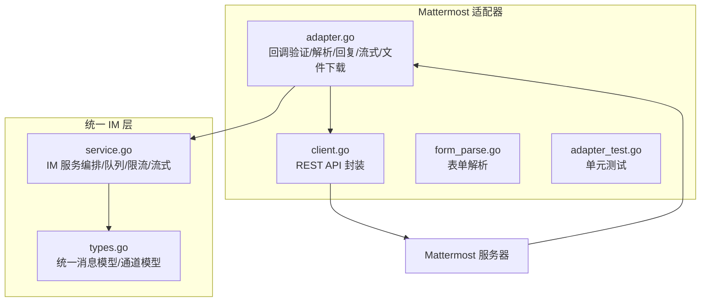
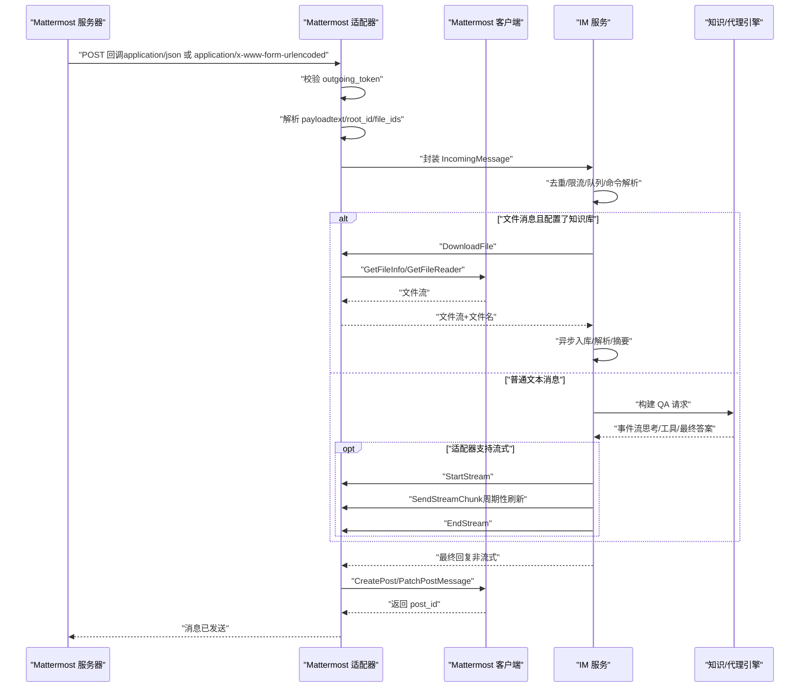
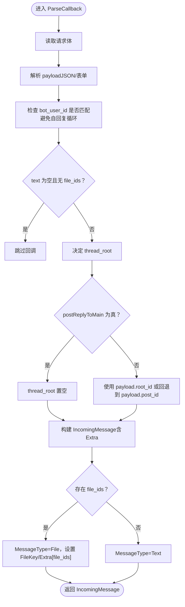
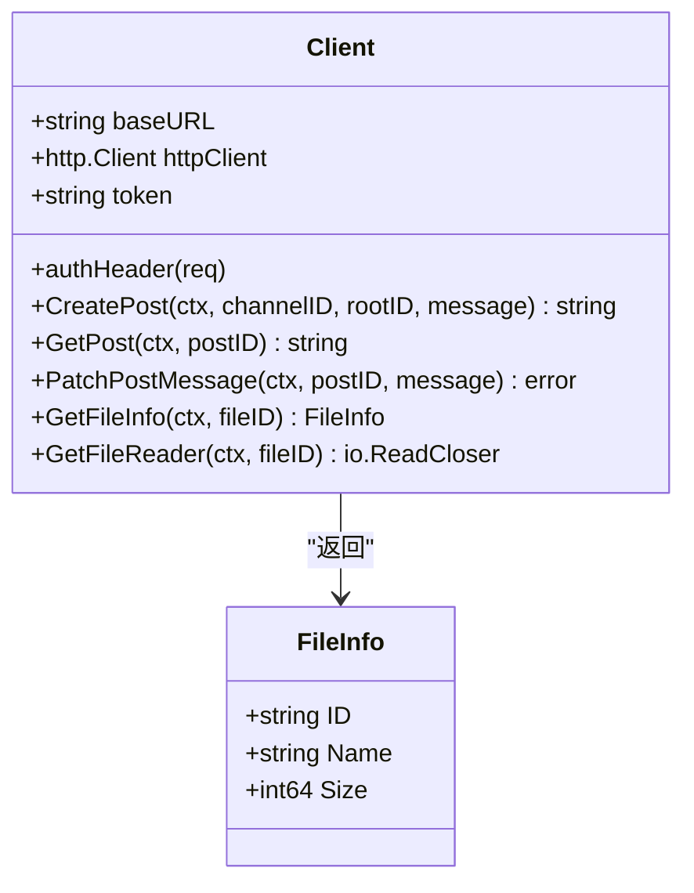
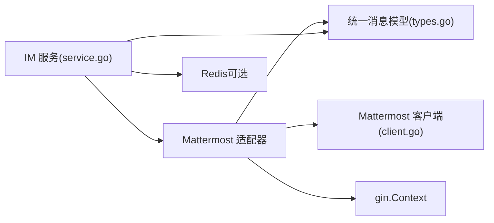

# Mattermost适配器

<cite>
**本文档引用的文件**
- [adapter.go](file://internal/im/mattermost/adapter.go)
- [client.go](file://internal/im/mattermost/client.go)
- [form_parse.go](file://internal/im/mattermost/form_parse.go)
- [adapter_test.go](file://internal/im/mattermost/adapter_test.go)
- [types.go](file://internal/im/types.go)
- [adapter.go](file://internal/im/adapter.go)
- [service.go](file://internal/im/service.go)
</cite>

## 目录
1. [简介](#简介)
2. [项目结构](#项目结构)
3. [核心组件](#核心组件)
4. [架构总览](#架构总览)
5. [详细组件分析](#详细组件分析)
6. [依赖关系分析](#依赖关系分析)
7. [性能考虑](#性能考虑)
8. [故障排除指南](#故障排除指南)
9. [结论](#结论)
10. [附录](#附录)

## 简介
本文件为 Mattermost 适配器的完整技术文档，面向开发者与运维人员，系统性阐述 WeKnora 在 Mattermost 平台上的集成方案。重点覆盖以下方面：
- Mattermost API 的 REST 调用封装与回调解析
- 回调验证、消息解析、文件下载与上传处理
- 线程根 ID（root_id）处理、回复消息与 @ 提及的实现策略
- 通道权限管理与机器人身份验证
- 流式回复（流式消息回执与状态同步）
- 与统一 IM 服务层的对接与最佳实践

本适配器采用“回调 + REST”的模式：通过 Mattermost 出站 Webhook 接收消息回调，解析后交由统一 IM 服务处理；对外通过 Mattermost REST API 发送消息、更新消息、获取文件信息与下载文件。

## 项目结构
Mattermost 适配器位于 internal/im/mattermost 目录，核心文件如下：
- adapter.go：适配器主体，负责回调验证、消息解析、回复发送、流式处理、文件下载
- client.go：对 Mattermost REST API v4 的封装，提供发帖、拉取帖子、更新消息、文件信息与下载
- form_parse.go：表单解析工具，兼容 Mattermost 默认的 application/x-www-form-urlencoded
- adapter_test.go：单元测试，覆盖回调解析、线程根 ID 逻辑、文件 ID 解析等

此外，适配器遵循统一 IM 接口规范，与 internal/im/types.go 中的统一消息模型、内部 IM 服务 internal/im/service.go 协同工作。

图表来源
- [adapter.go:1-350](file://internal/im/mattermost/adapter.go#L1-L350)
- [client.go:1-229](file://internal/im/mattermost/client.go#L1-L229)
- [form_parse.go:1-28](file://internal/im/mattermost/form_parse.go#L1-L28)
- [types.go:1-179](file://internal/im/types.go#L1-L179)
- [service.go:1-2532](file://internal/im/service.go#L1-L2532)

章节来源
- [adapter.go:1-350](file://internal/im/mattermost/adapter.go#L1-L350)
- [client.go:1-229](file://internal/im/mattermost/client.go#L1-L229)
- [form_parse.go:1-28](file://internal/im/mattermost/form_parse.go#L1-L28)
- [types.go:1-179](file://internal/im/types.go#L1-L179)
- [service.go:1-2532](file://internal/im/service.go#L1-L2532)

## 核心组件
- Mattermost 适配器（Adapter）
  - 实现统一 IM 接口：VerifyCallback、ParseCallback、SendReply、HandleURLVerification
  - 支持流式回复（StartStream/SendStreamChunk/EndStream）
  - 支持文件下载（DownloadFile）
  - 内部维护流式状态映射，确保多实例下幂等与一致性
- Mattermost 客户端（Client）
  - 封装 REST API：创建帖子、获取帖子 root_id、更新帖子、获取文件信息、下载文件
  - 统一鉴权头（Bearer Token）与错误处理
- 表单解析工具
  - 兼容 Mattermost 默认的 application/x-www-form-urlencoded 回调体
- 统一消息模型与服务编排
  - IncomingMessage/ReplyMessage/IMChannel/ChannelSession 等模型
  - IM 服务负责去重、限流、队列、命令处理、流式回传、文件处理等

章节来源
- [adapter.go:30-350](file://internal/im/mattermost/adapter.go#L30-L350)
- [client.go:14-229](file://internal/im/mattermost/client.go#L14-L229)
- [form_parse.go:9-28](file://internal/im/mattermost/form_parse.go#L9-L28)
- [types.go:14-179](file://internal/im/types.go#L14-L179)
- [service.go:101-165](file://internal/im/service.go#L101-L165)

## 架构总览
Mattermost 适配器与统一 IM 服务的交互流程如下：

图表来源
- [adapter.go:70-155](file://internal/im/mattermost/adapter.go#L70-L155)
- [adapter.go:225-350](file://internal/im/mattermost/adapter.go#L225-L350)
- [client.go:45-156](file://internal/im/mattermost/client.go#L45-L156)
- [service.go:784-977](file://internal/im/service.go#L784-L977)
- [service.go:1435-1736](file://internal/im/service.go#L1435-L1736)

## 详细组件分析

### Mattermost 适配器（Adapter）
- 回调验证与解析
  - VerifyCallback：读取请求体，解析 token，与配置的 outgoing_token 对比，防止伪造回调
  - ParseCallback：解析 application/json 或 application/x-www-form-urlencoded；提取 user_id、channel_id、post_id、text、root_id、file_ids；过滤空消息；计算 thread_root（优先使用 root_id，否则回退到 post_id；当 postReplyToMain=true 时强制清空 thread_root）
- 消息发送与流式处理
  - SendReply：根据 incoming.Extra[“channel_id”] 和 thread_root 发送回复
  - StartStream：创建占位消息“正在思考...”，生成 stream_id（channel_id:post_id），记录流式状态
  - SendStreamChunk：累积内容并通过 PatchPostMessage 实时更新
  - EndStream：结束流式，确保最终内容落盘
- 文件下载
  - DownloadFile：先 GetFileInfo 获取原始文件名，再 GetFileReader 下载二进制流
- 关键常量与 Extra 字段
  - extraKeyThreadRoot、extraKeyChannelID：用于传递 thread_root 与 channel_id，便于后续发送与流式处理

图表来源
- [adapter.go:89-155](file://internal/im/mattermost/adapter.go#L89-L155)
- [adapter.go:157-196](file://internal/im/mattermost/adapter.go#L157-L196)
- [adapter.go:198-223](file://internal/im/mattermost/adapter.go#L198-L223)

章节来源
- [adapter.go:70-155](file://internal/im/mattermost/adapter.go#L70-L155)
- [adapter.go:225-350](file://internal/im/mattermost/adapter.go#L225-L350)

### Mattermost 客户端（Client）
- CreatePost：创建帖子，支持 root_id（thread 根）
- GetPost：按 post_id 查询 root_id（用于回退 thread_root）
- PatchPostMessage：增量更新消息内容（流式刷新）
- GetFileInfo：获取文件元信息（名称、大小）
- GetFileReader：下载文件二进制流
- 错误处理：统一返回可读的错误信息，包含状态码与响应体片段

图表来源
- [client.go:14-229](file://internal/im/mattermost/client.go#L14-L229)

章节来源
- [client.go:14-229](file://internal/im/mattermost/client.go#L14-L229)

### 表单解析工具
- parseFormBody：解析 application/x-www-form-urlencoded
- jsonArrayFromCSV：将逗号分隔的 file_ids 转换为 JSON 数组

章节来源
- [form_parse.go:9-28](file://internal/im/mattermost/form_parse.go#L9-L28)

### 统一消息模型与服务编排
- IncomingMessage/ReplyMessage：统一的消息结构，包含平台、类型、用户、聊天、线程、引用、附件等
- IMChannel/ChannelSession：通道与会话映射，支持按用户或按线程会话模式
- IM 服务：负责去重、限流、队列、命令处理、流式回传、文件处理、跨实例停止信号等

章节来源
- [types.go:14-179](file://internal/im/types.go#L14-L179)
- [service.go:101-165](file://internal/im/service.go#L101-L165)
- [service.go:784-977](file://internal/im/service.go#L784-L977)
- [service.go:1435-1736](file://internal/im/service.go#L1435-L1736)

## 依赖关系分析
- 适配器依赖
  - gin.Context：接收 Mattermost 回调
  - 内部 IM 接口与类型：统一消息模型
  - Mattermost Client：REST API 调用
- 服务层依赖
  - 适配器接口：VerifyCallback/Parsing/SendReply/StreamSender/FileDownloader
  - 会话与消息服务：创建/更新消息、解析会话
  - 知识服务：文件消息入库
  - Redis：分布式去重、限流、领导者选举、跨实例停止信号

图表来源
- [adapter.go:1-350](file://internal/im/mattermost/adapter.go#L1-L350)
- [client.go:1-229](file://internal/im/mattermost/client.go#L1-L229)
- [types.go:1-179](file://internal/im/types.go#L1-L179)
- [service.go:1-2532](file://internal/im/service.go#L1-L2532)

章节来源
- [adapter.go:1-350](file://internal/im/mattermost/adapter.go#L1-L350)
- [service.go:1-2532](file://internal/im/service.go#L1-L2532)

## 性能考虑
- 流式刷新节流：IM 服务以固定周期（约 300ms）批量刷新流式内容，降低 API 调用频率，避免被平台限流
- 去重与限流：基于 Redis 的滑动窗口限流与消息去重，保障高并发下的稳定性
- 队列背压：有界工作池与队列深度限制，保护下游 LLM 资源
- 文件处理异步化：文件消息下载与入库异步执行，避免阻塞主消息处理路径

章节来源
- [service.go:30-44](file://internal/im/service.go#L30-L44)
- [service.go:1435-1736](file://internal/im/service.go#L1435-L1736)
- [service.go:2018-2054](file://internal/im/service.go#L2018-L2054)

## 故障排除指南
- 回调未触发或被拒绝
  - 检查 outgoing_token 是否正确配置与传递
  - 确认 Mattermost 出站 Webhook 的目标 URL 与签名验证逻辑一致
- 自回复循环
  - 若 bot_user_id 与回调中的 user_id 匹配，适配器会跳过回调，避免死循环
- 无内容或无文件的回调被忽略
  - 当 text 为空且 file_ids 为空时，适配器直接跳过
- 线程根 ID 异常
  - postReplyToMain=true 时会强制清空 thread_root
  - 若 root_id 缺失，适配器会回退到 post_id；必要时通过 GetPost 获取实际 root_id
- 权限不足（403）
  - 创建帖子返回 403 时，提示需将机器人加入频道
- 流式更新失败
  - PatchPostMessage 失败会被记录日志，不影响最终 EndStream 的落盘
- 文件下载失败
  - GetFileInfo/GetFileReader 返回错误时，适配器会返回错误给上层；IM 服务会生成智能通知

章节来源
- [adapter.go:70-155](file://internal/im/mattermost/adapter.go#L70-L155)
- [adapter.go:225-350](file://internal/im/mattermost/adapter.go#L225-L350)
- [client.go:76-91](file://internal/im/mattermost/client.go#L76-L91)
- [client.go:152-156](file://internal/im/mattermost/client.go#L152-L156)
- [client.go:210-219](file://internal/im/mattermost/client.go#L210-L219)

## 结论
Mattermost 适配器以“回调 + REST”的方式实现了与 Mattermost 的稳定集成，具备完善的回调验证、消息解析、线程根 ID 处理、流式回复与文件处理能力。配合统一 IM 服务的去重、限流、队列与命令处理，能够满足企业级场景下的消息处理需求。开发者在接入时应重点关注：
- outgoing_token 与 bot_user_id 的配置
- 线程模式与 postReplyToMain 的选择
- 文件知识库配置与扩展名支持
- 分布式环境下的流式状态与停止信号处理

## 附录

### Mattermost 特定概念与实现要点
- 回调参数
  - token：出站 Webhook 验证令牌
  - user_id/user_name：发送者标识
  - channel_id：群聊/频道标识
  - post_id：消息标识（用于 thread_root 回退）
  - text：消息正文
  - root_id：线程根标识（可为空）
  - file_ids：文件 ID 列表（支持数组或逗号分隔字符串）
- 线程根 ID（ThreadID）处理
  - 优先使用 payload.root_id
  - 若为空且 postReplyToMain=false，则回退到 payload.post_id
  - 若 postReplyToMain=true，则强制 thread_root 置空
- @ 提及与引用
  - 适配器解析 IncomingMessage 时不直接处理 @ 提及；如需 @ 提及功能，可在业务侧结合 Mattermost 用户名解析与消息渲染策略实现
- 机器人身份验证
  - outgoing_token 用于回调签名验证
  - Bearer Token 用于 Mattermost REST API 调用
- 权限管理
  - 机器人必须加入目标频道才能发送消息；403 错误会明确提示添加成员

章节来源
- [adapter.go:50-60](file://internal/im/mattermost/adapter.go#L50-L60)
- [adapter.go:111-126](file://internal/im/mattermost/adapter.go#L111-L126)
- [client.go:45-92](file://internal/im/mattermost/client.go#L45-L92)

### 测试要点
- 回调解析：JSON 与表单两种 Content-Type 的解析正确性
- 线程根 ID：root_id 为空时的回退逻辑
- 文件 ID：数组与逗号分隔字符串的兼容性
- 空消息过滤：text 为空且无 file_ids 的回调应被忽略

章节来源
- [adapter_test.go:8-127](file://internal/im/mattermost/adapter_test.go#L8-L127)
- [adapter_test.go:129-153](file://internal/im/mattermost/adapter_test.go#L129-L153)