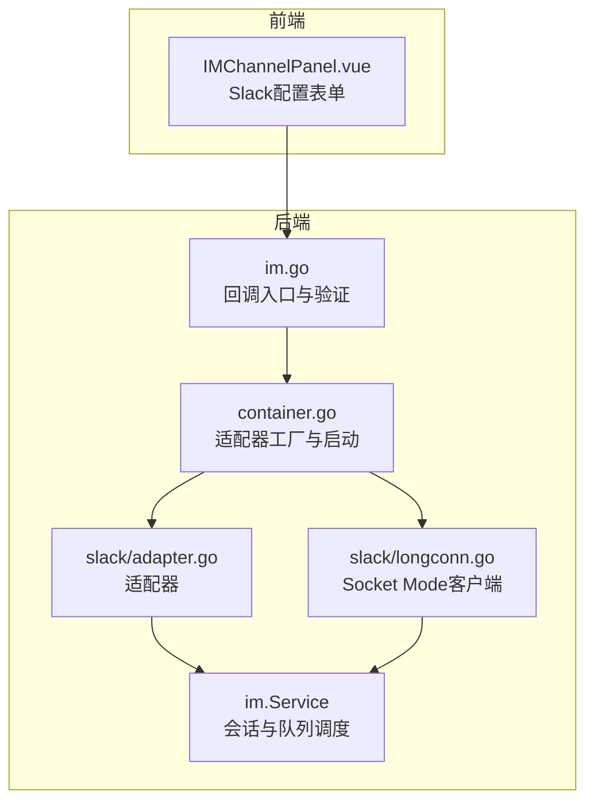
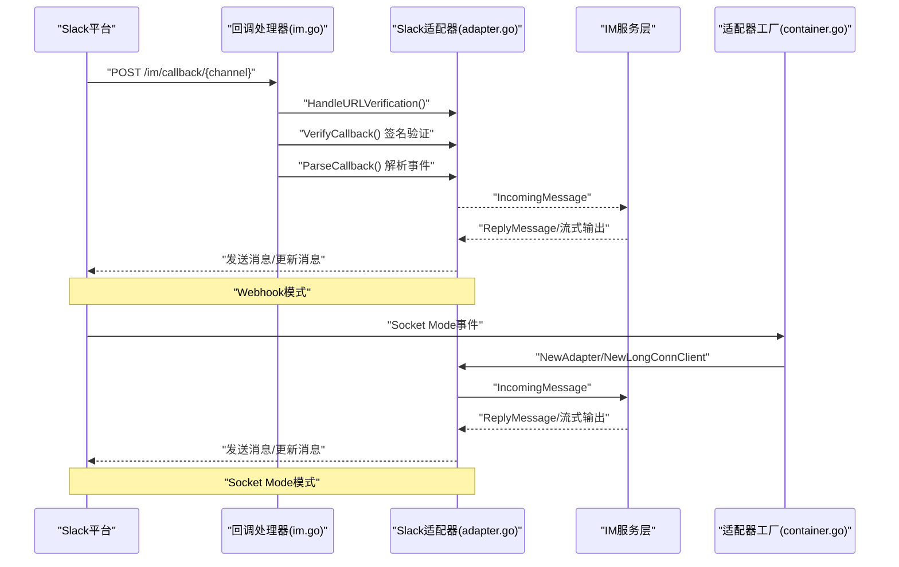
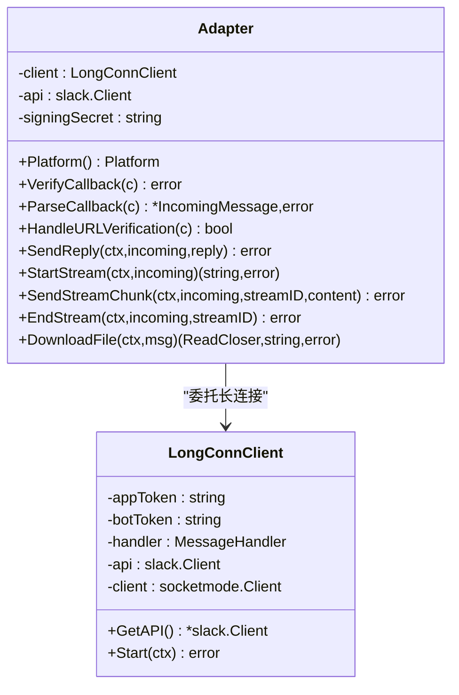
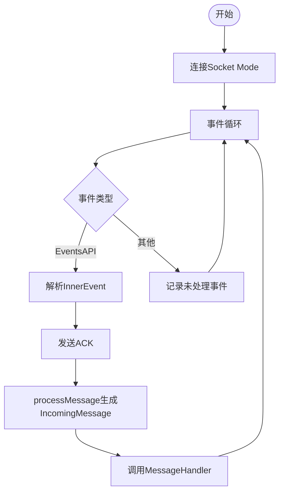
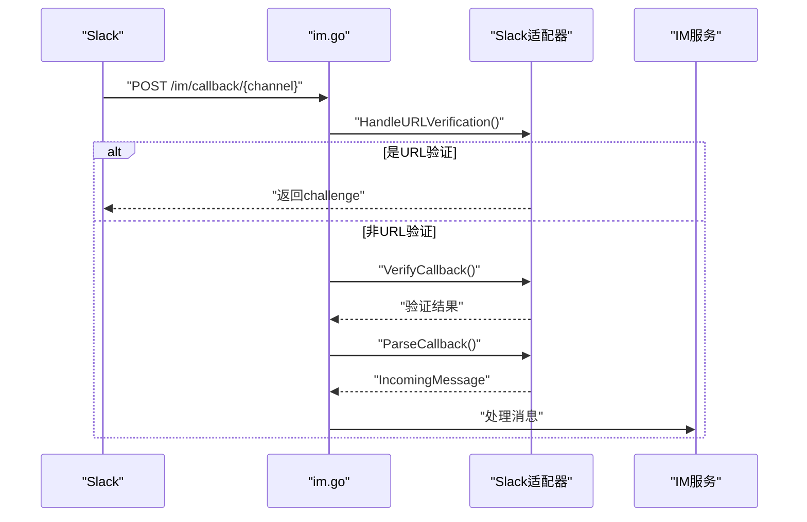
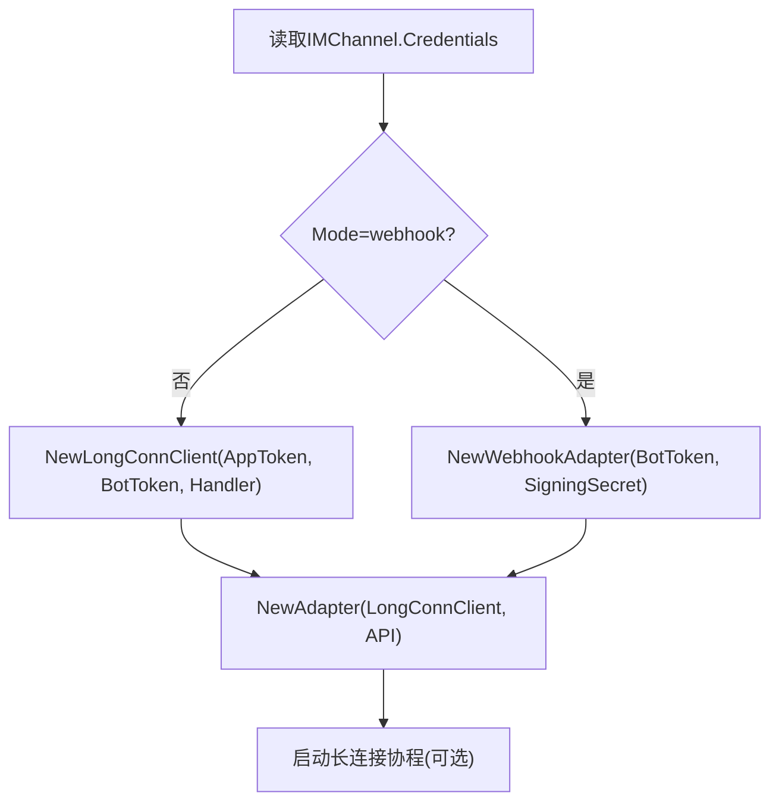
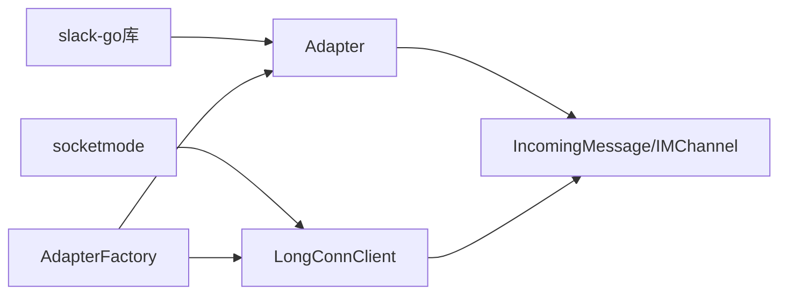

# Slack适配器

<cite>
**本文档引用的文件**
- [adapter.go](file://internal/im/slack/adapter.go)
- [longconn.go](file://internal/im/slack/longconn.go)
- [adapter_test.go](file://internal/im/slack/adapter_test.go)
- [types.go](file://internal/im/types.go)
- [container.go](file://internal/container/container.go)
- [im.go](file://internal/handler/im.go)
- [IMChannelPanel.vue](file://frontend/src/components/IMChannelPanel.vue)
- [ratelimit.go](file://internal/im/ratelimit.go)
</cite>

## 目录
1. [简介](#简介)
2. [项目结构](#项目结构)
3. [核心组件](#核心组件)
4. [架构总览](#架构总览)
5. [详细组件分析](#详细组件分析)
6. [依赖关系分析](#依赖关系分析)
7. [性能考量](#性能考量)
8. [故障排查指南](#故障排查指南)
9. [结论](#结论)
10. [附录](#附录)

## 简介
本文件为WeKnora项目的Slack适配器技术文档，覆盖Slack API集成（Socket Mode长连接与Events API Webhook）、事件驱动架构、WebSocket连接处理、消息类型与线程回复机制、用户权限与机器人配置、消息解析与文件上传下载、频道管理与机器人配置、OAuth认证与事件订阅、消息回执处理以及Slack特有的thread_ts字段处理与提及@功能实现等。文档面向开发者，提供从架构到实现细节的完整说明，并给出最佳实践与排错建议。

## 项目结构
Slack适配器位于内部IM模块中，采用“适配器+长连接客户端”的分层设计：
- 适配器：负责HTTP回调验证、事件解析、消息发送、流式输出、文件下载等。
- 长连接客户端：封装Slack Socket Mode，接收Events API事件并转换为统一的IncomingMessage。
- 服务层：在容器工厂中根据通道配置选择webhook或websocket模式，启动适配器与长连接。
- 前端：提供Slack通道配置界面，支持App Token/Bot Token/Signing Secret等参数输入。

**图表来源**
- [IMChannelPanel.vue:240-271](file://frontend/src/components/IMChannelPanel.vue#L240-L271)
- [im.go:261-304](file://internal/handler/im.go#L261-L304)
- [container.go:1275-1310](file://internal/container/container.go#L1275-L1310)
- [adapter.go:1-339](file://internal/im/slack/adapter.go#L1-L339)
- [longconn.go:1-149](file://internal/im/slack/longconn.go#L1-L149)

**章节来源**
- [adapter.go:1-339](file://internal/im/slack/adapter.go#L1-L339)
- [longconn.go:1-149](file://internal/im/slack/longconn.go#L1-L149)
- [IMChannelPanel.vue:240-271](file://frontend/src/components/IMChannelPanel.vue#L240-L271)

## 核心组件
- Slack适配器（Adapter）
  - 支持两种模式：Events API Webhook（签名验证）与Socket Mode长连接。
  - 负责回调验证、事件解析、消息发送、流式输出、文件下载。
- Slack长连接客户端（LongConnClient）
  - 封装socketmode.Client，处理Events API事件，转换为统一IncomingMessage并交由上层处理。
- 通道与会话模型（IMChannel/ChannelSession）
  - 存储平台、模式、凭证、会话模式等；计算唯一bot身份标识，避免重复绑定。
- 容器工厂（AdapterFactory）
  - 根据通道配置动态创建适配器实例，启动长连接或注册Webhook路由。
- 前端配置面板
  - 提供Slack App Token/Bot Token/Signing Secret等参数输入与链接跳转。

**章节来源**
- [adapter.go:28-98](file://internal/im/slack/adapter.go#L28-L98)
- [longconn.go:18-47](file://internal/im/slack/longconn.go#L18-L47)
- [types.go:14-83](file://internal/im/types.go#L14-L83)
- [container.go:1275-1310](file://internal/container/container.go#L1275-L1310)
- [IMChannelPanel.vue:240-271](file://frontend/src/components/IMChannelPanel.vue#L240-L271)

## 架构总览
Slack适配器通过两种路径接入Slack：
- Webhook模式：通过Events API回调，进行签名验证后解析消息。
- Socket Mode模式：建立WebSocket长连接，接收Events API事件并ACK确认。

**图表来源**
- [im.go:283-304](file://internal/handler/im.go#L283-L304)
- [adapter.go:100-171](file://internal/im/slack/adapter.go#L100-L171)
- [container.go:1275-1310](file://internal/container/container.go#L1275-L1310)
- [longconn.go:54-89](file://internal/im/slack/longconn.go#L54-L89)

## 详细组件分析

### 组件A：Slack适配器（Adapter）
职责与能力：
- 平台标识：返回PlatformSlack。
- 回调验证：基于Signing Secret进行签名验证（可选）。
- 事件解析：解析Events API中的AppMentionEvent与MessageEvent，剥离@提及文本，设置ThreadID与MessageID。
- 消息发送：根据是否提供MessageID决定回复至原消息或作为新消息发送。
- 流式输出：维护每条流的状态，周期性更新消息内容。
- 文件下载：根据文件ID与下载URL拉取文件流。

关键实现要点：
- Slack提及解析：在群组聊天中去除形如"<@U...>"的提及前缀，保留纯文本。
- ThreadID与MessageID：顶层消息使用自身时间戳作为ThreadID与MessageID；线程回复使用thread_ts。
- 流式状态：以channelID:ts为流ID，记录累积内容与目标channel/ts。
- 文件类型识别：根据MIME类型判断图片或文件，填充消息类型与额外元数据。

**图表来源**
- [adapter.go:28-98](file://internal/im/slack/adapter.go#L28-L98)
- [adapter.go:196-338](file://internal/im/slack/adapter.go#L196-L338)
- [longconn.go:18-47](file://internal/im/slack/longconn.go#L18-L47)

**章节来源**
- [adapter.go:52-94](file://internal/im/slack/adapter.go#L52-L94)
- [adapter.go:125-171](file://internal/im/slack/adapter.go#L125-L171)
- [adapter.go:196-338](file://internal/im/slack/adapter.go#L196-L338)
- [adapter_test.go:10-71](file://internal/im/slack/adapter_test.go#L10-L71)

### 组件B：Slack长连接客户端（LongConnClient）
职责与能力：
- 初始化slack.Client与socketmode.Client。
- 处理连接生命周期事件（连接中、连接失败、已连接）。
- 解析Events API事件，ACK确认后调用processMessage生成IncomingMessage并交由上层处理。
- 支持@bot提及与文件分享事件，自动推导ThreadID与聊天类型。

**图表来源**
- [longconn.go:54-89](file://internal/im/slack/longconn.go#L54-L89)
- [longconn.go:91-140](file://internal/im/slack/longconn.go#L91-L140)
- [longconn.go:142-149](file://internal/im/slack/longconn.go#L142-L149)

**章节来源**
- [longconn.go:54-89](file://internal/im/slack/longconn.go#L54-L89)
- [longconn.go:91-140](file://internal/im/slack/longconn.go#L91-L140)
- [longconn.go:142-149](file://internal/im/slack/longconn.go#L142-L149)

### 组件C：回调处理与验证（im.go）
职责与能力：
- 接收来自Slack的回调请求，优先处理URL验证（Events API挑战响应）。
- 对Webhook模式进行签名验证，确保请求来源可信。
- 解析回调消息，若非消息事件则直接返回（如URL验证）。
- 将IncomingMessage交由IM服务层处理，触发后续会话与回答流程。

**图表来源**
- [im.go:283-304](file://internal/handler/im.go#L283-L304)
- [adapter.go:173-194](file://internal/im/slack/adapter.go#L173-L194)
- [adapter.go:100-123](file://internal/im/slack/adapter.go#L100-L123)
- [adapter.go:125-171](file://internal/im/slack/adapter.go#L125-L171)

**章节来源**
- [im.go:261-304](file://internal/handler/im.go#L261-L304)
- [adapter.go:100-171](file://internal/im/slack/adapter.go#L100-L171)

### 组件D：适配器工厂与启动（container.go）
职责与能力：
- 根据IMChannel.Mode选择webhook或websocket模式。
- webhook模式：创建slack.Webhook适配器，传入Bot Token与Signing Secret。
- websocket模式：创建LongConnClient，注入app_token与bot_token，启动长连接协程。
- 返回适配器实例与可选清理函数（用于停止长连接）。

**图表来源**
- [container.go:1275-1310](file://internal/container/container.go#L1275-L1310)

**章节来源**
- [container.go:1275-1310](file://internal/container/container.go#L1275-L1310)

### 组件E：前端配置面板（IMChannelPanel.vue）
职责与能力：
- 提供Slack配置表单项：App Token、Bot Token、Signing Secret。
- 根据模式显示不同字段组合（websocket需要App Token/Bot Token；webhook需要Bot Token/Signing Secret）。
- 提供跳转到Slack应用控制台的链接，便于开发者创建应用与令牌。

**章节来源**
- [IMChannelPanel.vue:240-271](file://frontend/src/components/IMChannelPanel.vue#L240-L271)

## 依赖关系分析
- 适配器依赖slack-go库进行API调用与事件解析。
- 长连接客户端依赖socketmode进行WebSocket事件接收与ACK。
- 适配器与长连接客户端均依赖统一的IncomingMessage结构，保证消息语义一致。
- 通道模型（IMChannel）通过computeBotIdentity计算唯一bot身份，避免重复绑定。

**图表来源**
- [adapter.go:3-19](file://internal/im/slack/adapter.go#L3-L19)
- [longconn.go:3-13](file://internal/im/slack/longconn.go#L3-L13)
- [types.go:85-145](file://internal/im/types.go#L85-L145)
- [container.go:1275-1310](file://internal/container/container.go#L1275-L1310)

**章节来源**
- [adapter.go:3-19](file://internal/im/slack/adapter.go#L3-L19)
- [longconn.go:3-13](file://internal/im/slack/longconn.go#L3-L13)
- [types.go:85-145](file://internal/im/types.go#L85-L145)
- [container.go:1275-1310](file://internal/container/container.go#L1275-L1310)

## 性能考量
- 流式输出与速率限制
  - 适配器在流式更新消息时存在速率限制风险，代码中对更新失败仅记录警告日志，避免阻塞主流程。
  - 服务层对用户级请求实施滑动窗口限流，结合Redis ZSET实现跨实例一致性。
- 缓存与去重
  - 服务层维护最近处理的消息ID缓存，防止重复处理。
- 并发与锁
  - 适配器流式状态使用互斥锁保护，避免并发写入冲突。

**章节来源**
- [adapter.go:274-281](file://internal/im/slack/adapter.go#L274-L281)
- [ratelimit.go:74-99](file://internal/im/ratelimit.go#L74-L99)
- [ratelimit.go:133-167](file://internal/im/ratelimit.go#L133-L167)

## 故障排查指南
常见问题与定位建议：
- 回调签名验证失败
  - 确认Signing Secret正确配置且与Slack应用设置一致；检查回调URL是否指向正确的通道。
  - 参考回调处理器中的验证逻辑与错误返回。
- Socket Mode连接失败
  - 检查App Token与Bot Token是否正确；确认应用已安装到工作区且授权范围足够。
  - 关注连接事件日志，定位连接中/连接失败阶段的问题。
- 线程回复异常
  - 确认thread_ts字段是否正确传递；在群组聊天中，@提及会被剥离，ThreadID应使用thread_ts。
- 文件下载失败
  - 确认文件ID与下载URL可用；若缺少下载URL，需通过GetFileInfo获取。
- 流式更新失败
  - 观察速率限制警告日志；适当降低更新频率或合并更新批次。

**章节来源**
- [im.go:288-293](file://internal/handler/im.go#L288-L293)
- [adapter.go:100-123](file://internal/im/slack/adapter.go#L100-L123)
- [adapter.go:309-338](file://internal/im/slack/adapter.go#L309-L338)
- [adapter.go:274-281](file://internal/im/slack/adapter.go#L274-L281)

## 结论
Slack适配器通过清晰的分层设计与统一的消息模型，实现了对Slack平台的全面支持。其既支持Events API Webhook的低延迟回调，也支持Socket Mode长连接的事件驱动架构。通过严格的线程ID与消息ID处理、流式输出与文件下载能力，以及完善的限流与去重策略，适配器能够稳定地支撑多租户场景下的机器人交互需求。建议在生产环境中结合Redis实现分布式限流与去重，并持续关注Slack API的变更与速率限制策略。

## 附录

### Slack Bot配置清单
- Webhook模式
  - Bot Token：用于Events API回调与消息发送。
  - Signing Secret：用于回调签名验证。
- Socket Mode模式
  - App Token：用于启用Socket Mode。
  - Bot Token：用于API调用与消息发送。

**章节来源**
- [IMChannelPanel.vue:240-271](file://frontend/src/components/IMChannelPanel.vue#L240-L271)
- [container.go:1275-1310](file://internal/container/container.go#L1275-L1310)