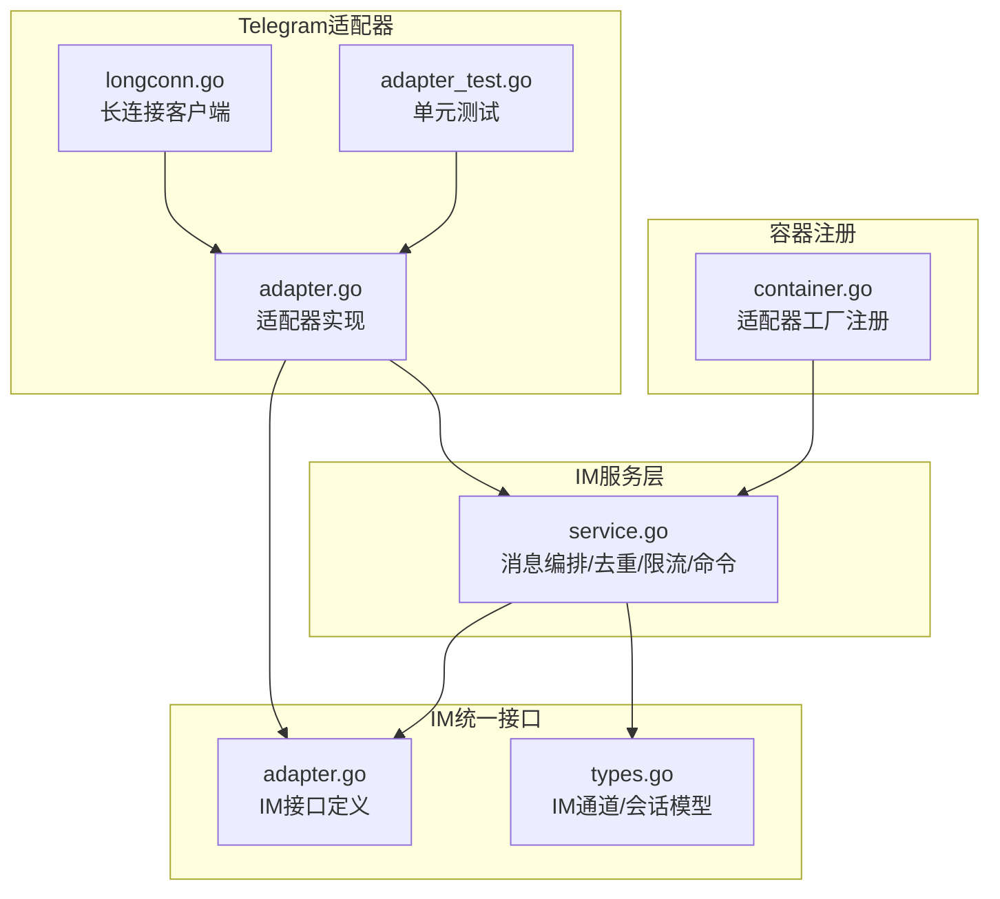
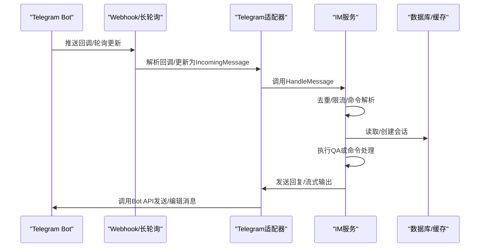
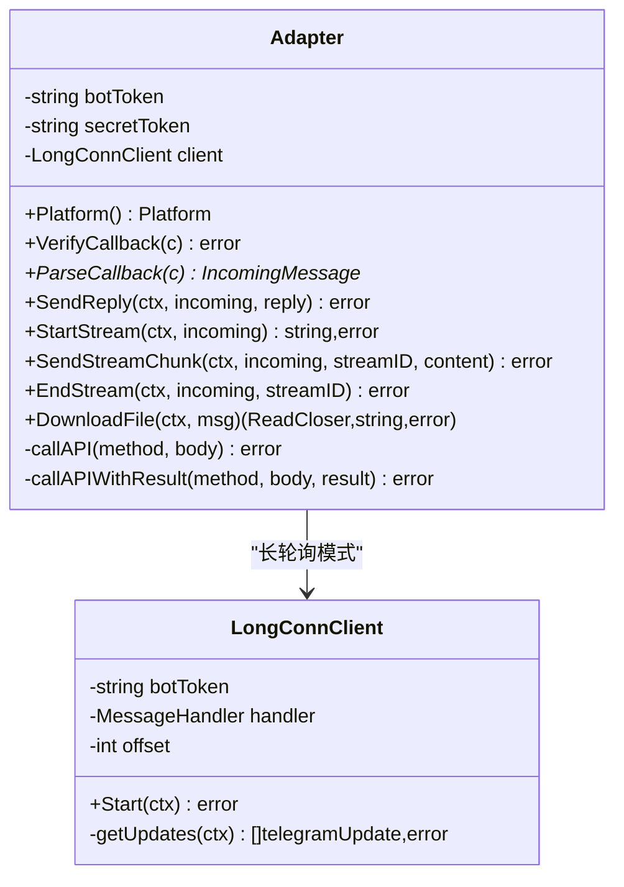
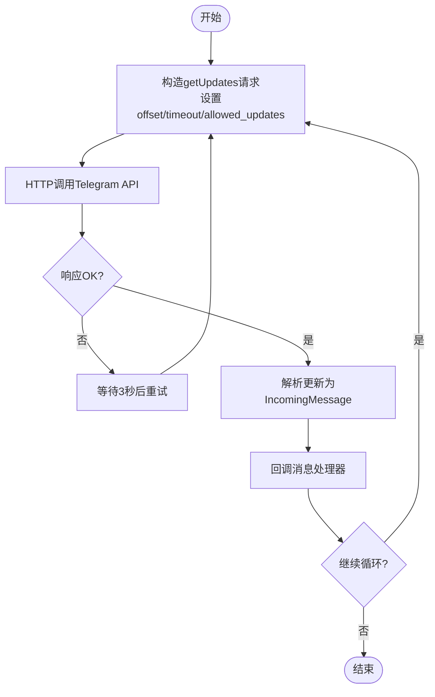
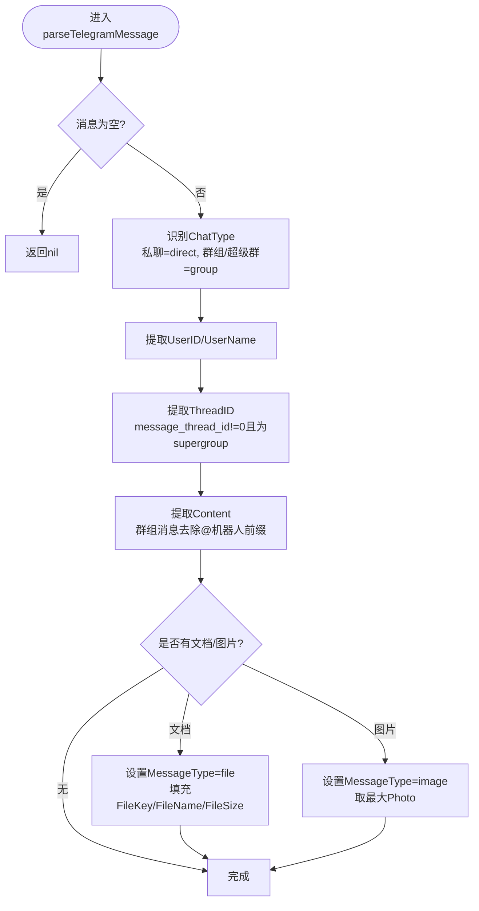
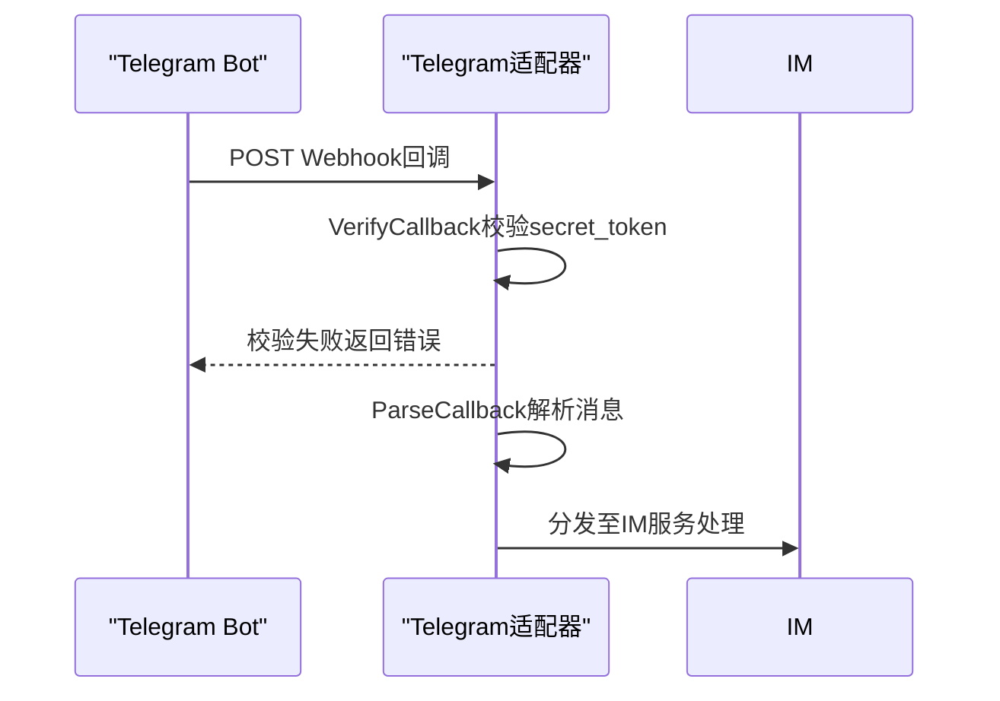
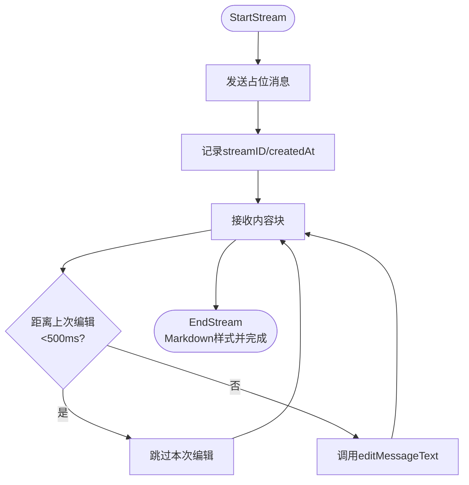
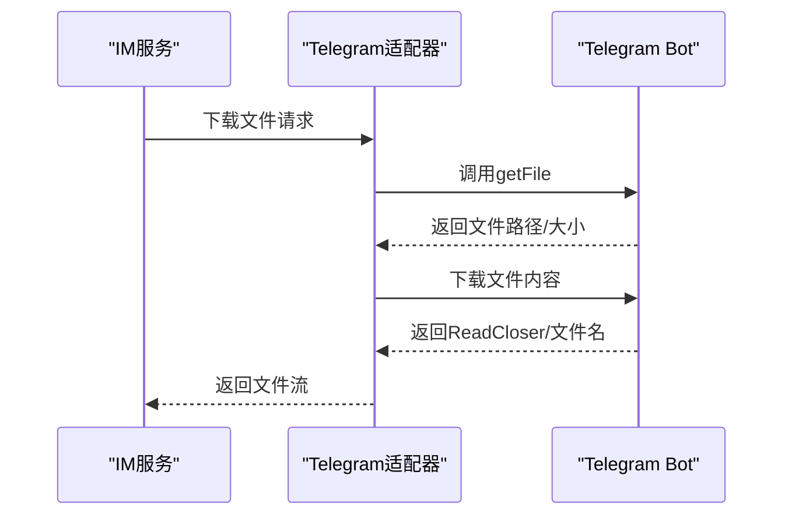
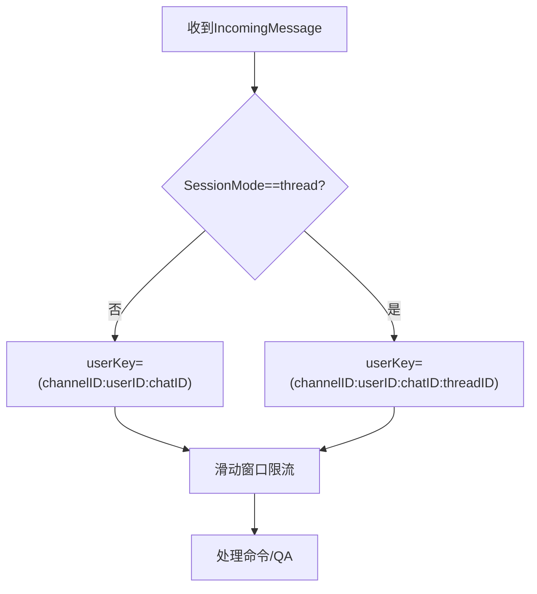
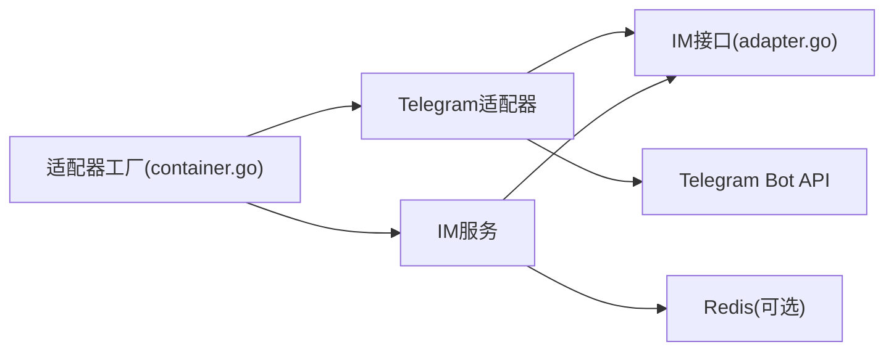

# Telegram适配器

<cite>
**本文档引用的文件**
- [adapter.go](file://internal/im/telegram/adapter.go)
- [longconn.go](file://internal/im/telegram/longconn.go)
- [adapter_test.go](file://internal/im/telegram/adapter_test.go)
- [adapter.go](file://internal/im/adapter.go)
- [types.go](file://internal/im/types.go)
- [service.go](file://internal/im/service.go)
- [container.go](file://internal/container/container.go)
</cite>

## 目录
1. [简介](#简介)
2. [项目结构](#项目结构)
3. [核心组件](#核心组件)
4. [架构总览](#架构总览)
5. [详细组件分析](#详细组件分析)
6. [依赖分析](#依赖分析)
7. [性能考虑](#性能考虑)
8. [故障排查指南](#故障排查指南)
9. [结论](#结论)
10. [附录](#附录)

## 简介
本文件为WeKnora项目中的Telegram适配器技术文档，面向开发者提供从底层实现到上层集成的完整指导。内容涵盖：
- Telegram Bot API的集成方式与消息解析
- Webhook与长轮询两种接入模式
- 消息类型识别、文件/媒体处理、话题论坛支持
- 用户身份与会话管理、机器人命令处理
- Webhook安全校验、证书配置与消息去重策略
- message_thread_id字段处理、回复消息解析与Inline键盘交互
- 最佳实践与常见问题排查

## 项目结构
Telegram适配器位于internal/im/telegram目录，主要由以下文件组成：
- adapter.go：实现Telegram适配器、消息解析、API调用、流式回复与文件下载
- longconn.go：长轮询客户端，持续拉取Telegram更新
- adapter_test.go：针对Telegram消息解析的单元测试，覆盖话题论坛线程ID等场景

此外，适配器通过统一的IM接口与服务层协作：
- internal/im/adapter.go：定义平台无关的适配器接口与消息结构
- internal/im/types.go：IM通道与会话模型，包含平台标识与身份计算
- internal/im/service.go：IM服务编排，负责去重、限流、命令分发、流式输出等
- internal/container/container.go：适配器工厂注册，按通道配置选择Webhook/长轮询模式

**图表来源**
- [adapter.go:1-486](file://internal/im/telegram/adapter.go#L1-L486)
- [longconn.go:1-117](file://internal/im/telegram/longconn.go#L1-L117)
- [adapter.go:1-165](file://internal/im/adapter.go#L1-L165)
- [types.go:1-179](file://internal/im/types.go#L1-L179)
- [service.go:1-1200](file://internal/im/service.go#L1-L1200)
- [container.go:1313-1349](file://internal/container/container.go#L1313-L1349)

**章节来源**
- [adapter.go:1-486](file://internal/im/telegram/adapter.go#L1-L486)
- [longconn.go:1-117](file://internal/im/telegram/longconn.go#L1-L117)
- [adapter.go:1-165](file://internal/im/adapter.go#L1-L165)
- [types.go:1-179](file://internal/im/types.go#L1-L179)
- [service.go:1-1200](file://internal/im/service.go#L1-L1200)
- [container.go:1313-1349](file://internal/container/container.go#L1313-L1349)

## 核心组件
- 适配器Adapter：实现IM接口，负责回调验证、消息解析、发送回复、流式输出、文件下载
- 长连接客户端LongConnClient：基于Telegram Bot API的长轮询客户端
- IM服务Service：统一的消息编排、去重、限流、命令分发与流式输出
- 适配器工厂：根据通道配置选择Webhook或长轮询模式

关键特性：
- Webhook模式：通过secret_token进行回调校验；解析消息后交由IM服务处理
- 长轮询模式：持续拉取消息，解析后交由IM服务处理
- 流式输出：在支持的平台上以“思考中”占位消息实时编辑，提升用户体验
- 文件下载：通过getFile获取文件路径并下载，支持知识库入库
- 话题论坛支持：message_thread_id用于区分话题线程，支持Thread会话模式

**章节来源**
- [adapter.go:29-71](file://internal/im/telegram/adapter.go#L29-L71)
- [longconn.go:18-33](file://internal/im/telegram/longconn.go#L18-L33)
- [adapter.go:120-165](file://internal/im/adapter.go#L120-L165)
- [service.go:30-80](file://internal/im/service.go#L30-L80)

## 架构总览
下图展示Telegram适配器与IM服务的交互关系：

**图表来源**
- [adapter.go:115-128](file://internal/im/telegram/adapter.go#L115-L128)
- [service.go:784-977](file://internal/im/service.go#L784-L977)
- [container.go:1327-1344](file://internal/container/container.go#L1327-L1344)

**章节来源**
- [adapter.go:115-128](file://internal/im/telegram/adapter.go#L115-L128)
- [service.go:784-977](file://internal/im/service.go#L784-L977)
- [container.go:1327-1344](file://internal/container/container.go#L1327-L1344)

## 详细组件分析

### 适配器Adapter
- 平台标识：返回PlatformTelegram
- 回调验证：当配置了secret_token时，校验请求头X-Telegram-Bot-Api-Secret-Token
- 消息解析：将Telegram更新映射为统一IncomingMessage，支持文本、文档、照片
- 发送回复：调用sendMessage，支持message_thread_id（话题论坛）
- 流式输出：StartStream发送“思考中”占位消息，SendStreamChunk按节流策略编辑，EndStream完成
- 文件下载：调用getFile获取文件路径并下载

**图表来源**
- [adapter.go:29-71](file://internal/im/telegram/adapter.go#L29-L71)
- [adapter.go:262-303](file://internal/im/telegram/adapter.go#L262-L303)
- [adapter.go:359-446](file://internal/im/telegram/adapter.go#L359-L446)
- [adapter.go:454-485](file://internal/im/telegram/adapter.go#L454-L485)
- [longconn.go:18-33](file://internal/im/telegram/longconn.go#L18-L33)
- [longconn.go:78-116](file://internal/im/telegram/longconn.go#L78-L116)

**章节来源**
- [adapter.go:29-71](file://internal/im/telegram/adapter.go#L29-L71)
- [adapter.go:115-204](file://internal/im/telegram/adapter.go#L115-L204)
- [adapter.go:216-256](file://internal/im/telegram/adapter.go#L216-L256)
- [adapter.go:359-446](file://internal/im/telegram/adapter.go#L359-L446)
- [adapter.go:454-485](file://internal/im/telegram/adapter.go#L454-L485)
- [longconn.go:18-33](file://internal/im/telegram/longconn.go#L18-L33)
- [longconn.go:78-116](file://internal/im/telegram/longconn.go#L78-L116)

### 长连接客户端LongConnClient
- 基于Telegram Bot API的getUpdates接口，设置offset、timeout与allowed_updates
- 循环拉取更新，解析为IncomingMessage并回调给上层处理器
- 错误回退与重试逻辑，避免瞬时错误中断

**图表来源**
- [longconn.go:78-116](file://internal/im/telegram/longconn.go#L78-L116)
- [longconn.go:35-76](file://internal/im/telegram/longconn.go#L35-L76)

**章节来源**
- [longconn.go:35-76](file://internal/im/telegram/longconn.go#L35-L76)
- [longconn.go:78-116](file://internal/im/telegram/longconn.go#L78-L116)

### 消息解析与类型识别
- 文本消息：提取MessageID、UserID、UserName、ChatID、ChatType、Content
- 话题论坛：当message_thread_id非零且属于supergroup时，作为ThreadID
- 文档消息：MessageType设为file，填充FileKey、FileName、FileSize
- 图片消息：取最大尺寸的Photo作为图片，MessageType设为image
- 群组消息前缀清理：去除“/命令@机器人”前缀，保留纯文本

**图表来源**
- [adapter.go:137-204](file://internal/im/telegram/adapter.go#L137-L204)

**章节来源**
- [adapter.go:137-204](file://internal/im/telegram/adapter.go#L137-L204)
- [adapter_test.go:9-46](file://internal/im/telegram/adapter_test.go#L9-L46)

### Webhook与回调校验
- Webhook模式：通过secret_token校验回调来源
- 回调验证：VerifyCallback检查请求头X-Telegram-Bot-Api-Secret-Token
- URL验证：HandleURLVerification返回false，表示不进行URL挑战

**图表来源**
- [adapter.go:62-71](file://internal/im/telegram/adapter.go#L62-L71)
- [adapter.go:115-128](file://internal/im/telegram/adapter.go#L115-L128)

**章节来源**
- [adapter.go:62-71](file://internal/im/telegram/adapter.go#L62-L71)
- [adapter.go:115-128](file://internal/im/telegram/adapter.go#L115-L128)

### 流式输出与节流策略
- 占位消息：StartStream发送“正在思考...”，记录streamID与chatID
- 节流编辑：最小编辑间隔为500ms，避免触发速率限制
- 流式结束：EndStream将Markdown样式应用并完成编辑
- 内存回收：启动后台reaper定期清理孤儿流状态

**图表来源**
- [adapter.go:359-446](file://internal/im/telegram/adapter.go#L359-L446)

**章节来源**
- [adapter.go:307-357](file://internal/im/telegram/adapter.go#L307-L357)
- [adapter.go:359-446](file://internal/im/telegram/adapter.go#L359-L446)

### 文件/媒体处理与知识库入库
- 文件下载：调用getFile获取文件路径，再下载文件内容
- 群组/频道非文本消息：若未配置知识库则提示无法处理
- 文件消息快捷通道：若通道配置了知识库ID，则直接走文件处理流程

**图表来源**
- [adapter.go:454-485](file://internal/im/telegram/adapter.go#L454-L485)
- [service.go:864-869](file://internal/im/service.go#L864-L869)

**章节来源**
- [adapter.go:454-485](file://internal/im/telegram/adapter.go#L454-L485)
- [service.go:864-869](file://internal/im/service.go#L864-L869)

### 话题论坛支持与Thread会话模式
- message_thread_id：仅在supergroup的Forum话题中有效
- Thread会话模式：当通道SessionMode为thread时，使用ThreadID作为会话键的一部分
- 适配器侧：发送/编辑消息时携带message_thread_id

**图表来源**
- [service.go:165-174](file://internal/im/service.go#L165-L174)
- [adapter.go:225-229](file://internal/im/telegram/adapter.go#L225-L229)
- [adapter.go:367-370](file://internal/im/telegram/adapter.go#L367-L370)

**章节来源**
- [adapter.go:80-81](file://internal/im/telegram/adapter.go#L80-L81)
- [adapter.go:225-229](file://internal/im/telegram/adapter.go#L225-L229)
- [adapter.go:367-370](file://internal/im/telegram/adapter.go#L367-L370)
- [service.go:165-174](file://internal/im/service.go#L165-L174)

### 机器人命令与Inline键盘交互
- 命令解析：IM服务在HandleMessage中先解析slash命令，再进入QA流程
- 命令执行：支持帮助、知识库查询、停止、清会话等
- Inline键盘：适配器未实现Inline交互处理，如需支持需扩展

**章节来源**
- [service.go:911-923](file://internal/im/service.go#L911-L923)
- [service.go:1045-1168](file://internal/im/service.go#L1045-L1168)

## 依赖分析
- 适配器依赖IM接口与统一消息结构
- 适配器依赖HTTP客户端调用Telegram Bot API
- IM服务依赖Redis进行分布式去重、限流、领导者选举
- 适配器工厂根据通道配置选择Webhook或长轮询模式

**图表来源**
- [adapter.go:1-20](file://internal/im/telegram/adapter.go#L1-L20)
- [adapter.go:1-165](file://internal/im/adapter.go#L1-L165)
- [service.go:1-80](file://internal/im/service.go#L1-L80)
- [container.go:1313-1349](file://internal/container/container.go#L1313-L1349)

**章节来源**
- [adapter.go:1-20](file://internal/im/telegram/adapter.go#L1-L20)
- [adapter.go:1-165](file://internal/im/adapter.go#L1-L165)
- [service.go:1-80](file://internal/im/service.go#L1-L80)
- [container.go:1313-1349](file://internal/container/container.go#L1313-L1349)

## 性能考虑
- 流式输出节流：最小编辑间隔500ms，避免触发编辑速率限制
- 去重与限流：全局TTL与滑动窗口控制重复消息与滥用
- 长轮询超时：timeout=30s，allowed_updates仅监听message，降低无效负载
- 文件下载：按需下载，避免一次性拉取大文件

[本节为通用性能讨论，无需列出具体文件来源]

## 故障排查指南
- Webhook校验失败：确认secret_token一致且请求头X-Telegram-Bot-Api-Secret-Token正确
- 消息重复：检查Redis去重键是否生效；单实例模式下检查本地去重表
- 限流被触发：调整rate limit参数或降低发送频率
- 长轮询中断：关注错误日志与回退等待，确保网络稳定
- 文件下载失败：检查file_id有效性与权限

**章节来源**
- [adapter.go:62-71](file://internal/im/telegram/adapter.go#L62-L71)
- [service.go:758-782](file://internal/im/service.go#L758-L782)
- [service.go:840-854](file://internal/im/service.go#L840-L854)
- [longconn.go:52-58](file://internal/im/telegram/longconn.go#L52-L58)
- [adapter.go:454-485](file://internal/im/telegram/adapter.go#L454-L485)

## 结论
Telegram适配器通过统一的IM接口与服务层协作，实现了对文本、文档、图片消息的解析与处理，并提供了Webhook与长轮询两种接入模式。其流式输出、去重与限流机制保证了良好的用户体验与系统稳定性。对于话题论坛的支持与Thread会话模式，使得多主题对话成为可能。未来可在Inline键盘交互与更丰富的消息类型支持方面进一步扩展。

[本节为总结性内容，无需列出具体文件来源]

## 附录

### Webhook设置与证书配置
- 回调URL：由Telegram BotFather配置
- Secret Token：在通道凭据中配置secret_token，适配器将校验回调头
- 证书：Telegram Bot API使用HTTPS，无需额外证书配置

**章节来源**
- [adapter.go:62-71](file://internal/im/telegram/adapter.go#L62-L71)
- [container.go:1327-1331](file://internal/container/container.go#L1327-L1331)

### 消息去重策略
- 多实例模式：Redis SetNX + TTL，跨实例去重
- 单实例模式：本地sync.Map + 定期清理

**章节来源**
- [service.go:758-782](file://internal/im/service.go#L758-L782)
- [service.go:370-388](file://internal/im/service.go#L370-L388)

### 适配器工厂注册
- 平台：telegram
- 模式：webhook或websocket（默认websocket）
- 凭据：bot_token、secret_token（可选）

**章节来源**
- [container.go:1313-1349](file://internal/container/container.go#L1313-L1349)