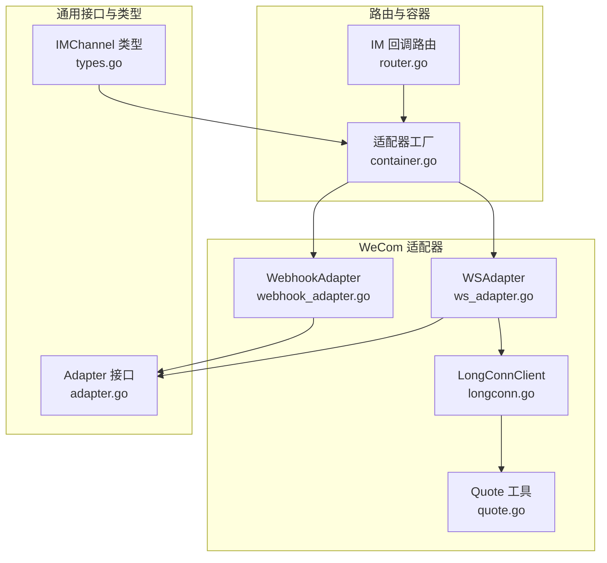
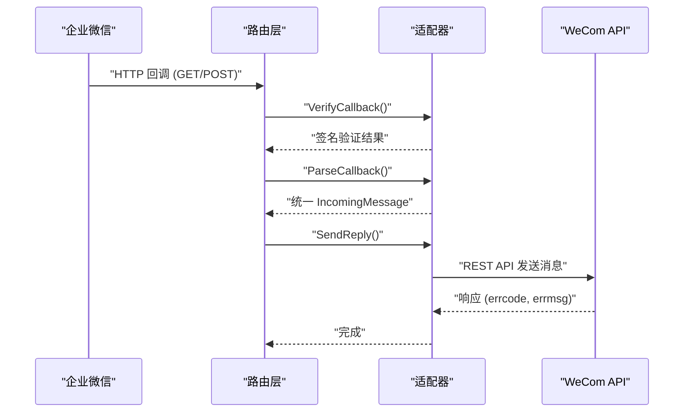
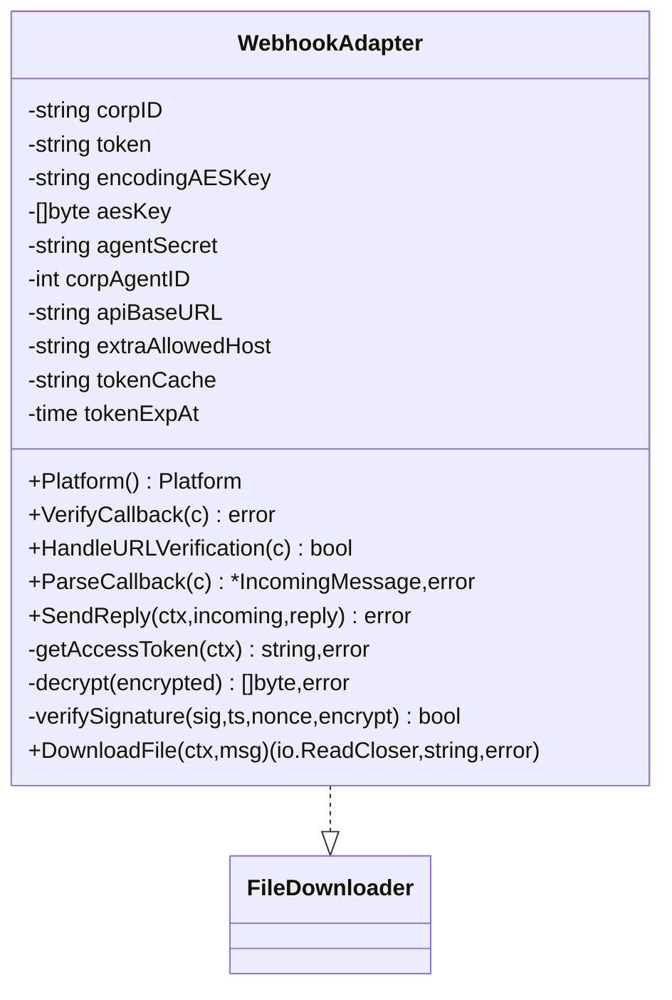
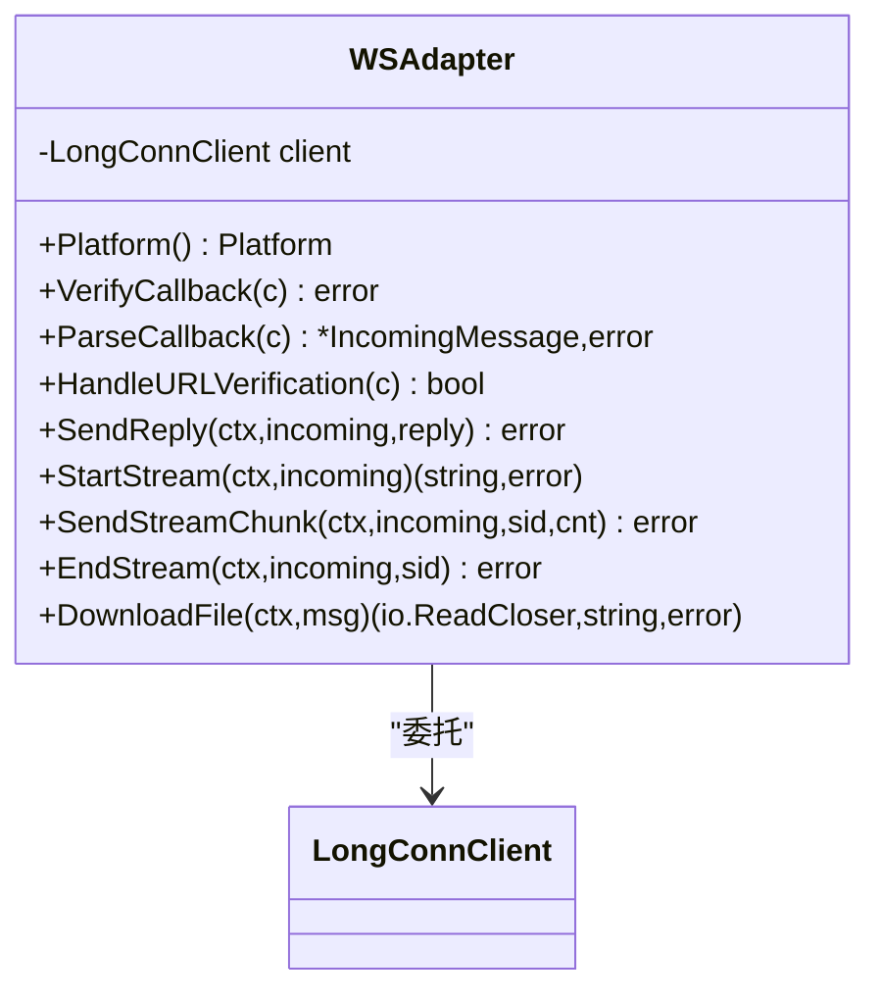
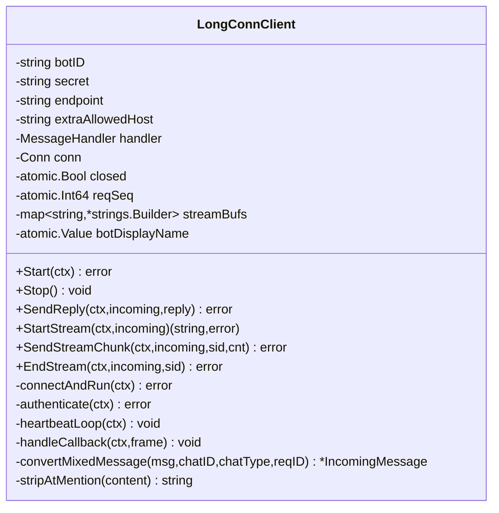
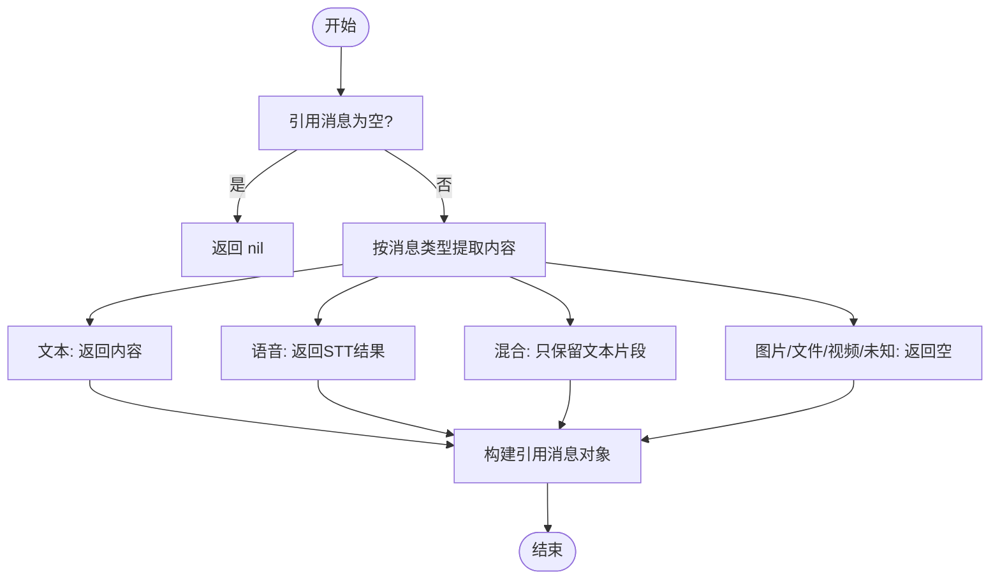
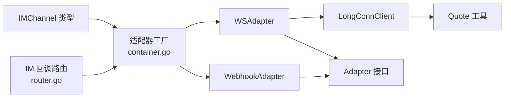

# WeCom适配器

<cite>
**本文引用的文件**
- [webhook_adapter.go](file://internal/im/wecom/webhook_adapter.go)
- [ws_adapter.go](file://internal/im/wecom/ws_adapter.go)
- [longconn.go](file://internal/im/wecom/longconn.go)
- [quote.go](file://internal/im/wecom/quote.go)
- [adapter.go](file://internal/im/adapter.go)
- [types.go](file://internal/im/types.go)
- [router.go](file://internal/router/router.go)
- [container.go](file://internal/container/container.go)
- [mention_test.go](file://internal/im/wecom/mention_test.go)
- [quote_test.go](file://internal/im/wecom/quote_test.go)
- [IMChannelPanel.vue](file://frontend/src/components/IMChannelPanel.vue)
</cite>

## 目录
1. [简介](#简介)
2. [项目结构](#项目结构)
3. [核心组件](#核心组件)
4. [架构总览](#架构总览)
5. [详细组件分析](#详细组件分析)
6. [依赖关系分析](#依赖关系分析)
7. [性能考量](#性能考量)
8. [故障排查指南](#故障排查指南)
9. [结论](#结论)
10. [附录](#附录)

## 简介
本文件为 WeCom 企业微信适配器的完整技术文档，覆盖以下关键主题：
- WeCom API 集成方式与回调处理机制
- 长连接模式下的实时消息处理、心跳与断线重连
- WeCom 特有消息类型的解析与处理（文本、图片、语音、混合消息）
- 用户身份验证流程与权限管理
- 文件下载、群组管理与机器人配置
- Webhook 配置、签名验证与消息去重策略
- 流式回复与实时消息处理的最佳实践

## 项目结构
WeCom 适配器位于 internal/im/wecom 目录，包含三种核心实现：
- Webhook 模式适配器：基于 HTTP 回调，消息经 WeCom 推送到服务端，回复通过 WeCom REST API 发送
- WebSocket 长连接模式适配器：通过持久 WebSocket 连接接收消息，支持流式回复与文件解密下载
- 长连接客户端：负责连接、鉴权、心跳、消息回调处理、流式帧发送与断线重连

图表来源
- [webhook_adapter.go:1-697](file://internal/im/wecom/webhook_adapter.go#L1-L697)
- [ws_adapter.go:1-174](file://internal/im/wecom/ws_adapter.go#L1-L174)
- [longconn.go:1-781](file://internal/im/wecom/longconn.go#L1-L781)
- [quote.go:1-72](file://internal/im/wecom/quote.go#L1-L72)
- [adapter.go:1-165](file://internal/im/adapter.go#L1-L165)
- [types.go:14-145](file://internal/im/types.go#L14-L145)
- [router.go:649-682](file://internal/router/router.go#L649-L682)
- [container.go:1197-1239](file://internal/container/container.go#L1197-L1239)

章节来源
- [webhook_adapter.go:1-697](file://internal/im/wecom/webhook_adapter.go#L1-L697)
- [ws_adapter.go:1-174](file://internal/im/wecom/ws_adapter.go#L1-L174)
- [longconn.go:1-781](file://internal/im/wecom/longconn.go#L1-L781)
- [adapter.go:1-165](file://internal/im/adapter.go#L1-L165)
- [types.go:14-145](file://internal/im/types.go#L14-L145)
- [router.go:649-682](file://internal/router/router.go#L649-L682)
- [container.go:1197-1239](file://internal/container/container.go#L1197-L1239)

## 核心组件
- WebhookAdapter：实现 HTTP 回调签名验证、消息解密解析、回复发送与文件下载
- WSAdapter：WebSocket 模式适配器，委托给 LongConnClient 处理消息与流式回复
- LongConnClient：WebSocket 客户端，负责连接、鉴权、心跳、消息回调、流式帧发送与断线重连
- Quote 工具：提取引用消息内容、识别是否来自机器人、构建引用消息对象
- Adapter 接口与 IMChannel 类型：统一消息格式、会话模式与通道配置

章节来源
- [webhook_adapter.go:77-126](file://internal/im/wecom/webhook_adapter.go#L77-L126)
- [ws_adapter.go:24-35](file://internal/im/wecom/ws_adapter.go#L24-L35)
- [longconn.go:123-145](file://internal/im/wecom/longconn.go#L123-L145)
- [quote.go:9-71](file://internal/im/wecom/quote.go#L9-L71)
- [adapter.go:120-165](file://internal/im/adapter.go#L120-L165)
- [types.go:14-145](file://internal/im/types.go#L14-L145)

## 架构总览
WeCom 适配器支持两种运行模式：
- Webhook 模式：企业微信通过 HTTP 回调推送消息，服务端进行签名验证与解密，随后通过 WeCom REST API 发送回复
- WebSocket 模式：通过持久 WebSocket 连接接收消息，支持流式回复与文件解密下载

图表来源
- [router.go:649-657](file://internal/router/router.go#L649-L657)
- [webhook_adapter.go:133-162](file://internal/im/wecom/webhook_adapter.go#L133-L162)
- [webhook_adapter.go:187-269](file://internal/im/wecom/webhook_adapter.go#L187-L269)
- [webhook_adapter.go:271-378](file://internal/im/wecom/webhook_adapter.go#L271-L378)

章节来源
- [router.go:649-657](file://internal/router/router.go#L649-L657)
- [webhook_adapter.go:133-162](file://internal/im/wecom/webhook_adapter.go#L133-L162)
- [webhook_adapter.go:187-269](file://internal/im/wecom/webhook_adapter.go#L187-L269)
- [webhook_adapter.go:271-378](file://internal/im/wecom/webhook_adapter.go#L271-L378)

## 详细组件分析

### WebhookAdapter 组件分析
- 负责 WeCom 回调签名验证、消息解密与解析、回复发送与文件下载
- 支持文本与图片消息；图片可通过 PicUrl 直接下载或通过 MediaId 调用临时素材 API 下载
- 采用访问令牌缓存机制，避免频繁请求 WeCom API

图表来源
- [webhook_adapter.go:77-126](file://internal/im/wecom/webhook_adapter.go#L77-L126)
- [webhook_adapter.go:133-162](file://internal/im/wecom/webhook_adapter.go#L133-L162)
- [webhook_adapter.go:187-269](file://internal/im/wecom/webhook_adapter.go#L187-L269)
- [webhook_adapter.go:271-378](file://internal/im/wecom/webhook_adapter.go#L271-L378)
- [webhook_adapter.go:380-426](file://internal/im/wecom/webhook_adapter.go#L380-L426)
- [webhook_adapter.go:441-492](file://internal/im/wecom/webhook_adapter.go#L441-L492)
- [webhook_adapter.go:525-552](file://internal/im/wecom/webhook_adapter.go#L525-L552)

章节来源
- [webhook_adapter.go:77-126](file://internal/im/wecom/webhook_adapter.go#L77-L126)
- [webhook_adapter.go:133-162](file://internal/im/wecom/webhook_adapter.go#L133-L162)
- [webhook_adapter.go:187-269](file://internal/im/wecom/webhook_adapter.go#L187-L269)
- [webhook_adapter.go:271-378](file://internal/im/wecom/webhook_adapter.go#L271-L378)
- [webhook_adapter.go:380-426](file://internal/im/wecom/webhook_adapter.go#L380-L426)
- [webhook_adapter.go:441-492](file://internal/im/wecom/webhook_adapter.go#L441-L492)
- [webhook_adapter.go:525-552](file://internal/im/wecom/webhook_adapter.go#L525-L552)

### WSAdapter 组件分析
- 在 WebSocket 模式下，将消息处理与流式回复委托给 LongConnClient
- 支持文件下载并根据消息中的 per-message AES Key 对加密内容进行解密

图表来源
- [ws_adapter.go:24-35](file://internal/im/wecom/ws_adapter.go#L24-L35)
- [ws_adapter.go:53-69](file://internal/im/wecom/ws_adapter.go#L53-L69)
- [ws_adapter.go:75-118](file://internal/im/wecom/ws_adapter.go#L75-L118)

章节来源
- [ws_adapter.go:24-35](file://internal/im/wecom/ws_adapter.go#L24-L35)
- [ws_adapter.go:53-69](file://internal/im/wecom/ws_adapter.go#L53-L69)
- [ws_adapter.go:75-118](file://internal/im/wecom/ws_adapter.go#L75-L118)

### LongConnClient 组件分析
- 负责 WebSocket 连接、鉴权、心跳、消息回调处理、流式帧发送与断线重连
- 支持文本、语音、图片、文件、视频与混合消息类型
- 提供 @mention 前缀清理策略，确保命令识别准确

图表来源
- [longconn.go:123-145](file://internal/im/wecom/longconn.go#L123-L145)
- [longconn.go:171-210](file://internal/im/wecom/longconn.go#L171-L210)
- [longconn.go:223-254](file://internal/im/wecom/longconn.go#L223-L254)
- [longconn.go:260-304](file://internal/im/wecom/longconn.go#L260-L304)
- [longconn.go:359-418](file://internal/im/wecom/longconn.go#L359-L418)
- [longconn.go:420-462](file://internal/im/wecom/longconn.go#L420-L462)
- [longconn.go:464-485](file://internal/im/wecom/longconn.go#L464-L485)
- [longconn.go:487-631](file://internal/im/wecom/longconn.go#L487-L631)
- [longconn.go:732-763](file://internal/im/wecom/longconn.go#L732-L763)

章节来源
- [longconn.go:123-145](file://internal/im/wecom/longconn.go#L123-L145)
- [longconn.go:171-210](file://internal/im/wecom/longconn.go#L171-L210)
- [longconn.go:223-254](file://internal/im/wecom/longconn.go#L223-L254)
- [longconn.go:260-304](file://internal/im/wecom/longconn.go#L260-L304)
- [longconn.go:359-418](file://internal/im/wecom/longconn.go#L359-L418)
- [longconn.go:420-462](file://internal/im/wecom/longconn.go#L420-L462)
- [longconn.go:464-485](file://internal/im/wecom/longconn.go#L464-L485)
- [longconn.go:487-631](file://internal/im/wecom/longconn.go#L487-L631)
- [longconn.go:732-763](file://internal/im/wecom/longconn.go#L732-L763)

### 引用消息处理（Quote）分析
- 提取引用消息文本内容，过滤非文本类型以避免 LLM 幻觉
- 判断引用消息是否来自机器人，区分用户与机器人消息
- 构建统一的引用消息对象，便于下游处理

图表来源
- [quote.go:9-35](file://internal/im/wecom/quote.go#L9-L35)
- [quote.go:37-50](file://internal/im/wecom/quote.go#L37-L50)
- [quote.go:52-71](file://internal/im/wecom/quote.go#L52-L71)

章节来源
- [quote.go:9-35](file://internal/im/wecom/quote.go#L9-L35)
- [quote.go:37-50](file://internal/im/wecom/quote.go#L37-L50)
- [quote.go:52-71](file://internal/im/wecom/quote.go#L52-L71)

### WeCom 特有消息类型处理
- 文本消息：去除 @mention 前缀（群聊），保留命令识别
- 图片/文件消息：支持直接下载 URL 或通过临时素材 API 下载
- 语音消息：使用语音转文本内容作为查询
- 混合消息：提取文本部分用于问答，若仅有图片则按图片消息处理

章节来源
- [longconn.go:529-614](file://internal/im/wecom/longconn.go#L529-L614)
- [longconn.go:633-691](file://internal/im/wecom/longconn.go#L633-L691)
- [webhook_adapter.go:225-268](file://internal/im/wecom/webhook_adapter.go#L225-L268)

### 用户身份验证与权限管理
- Webhook 模式：通过 token、timestamp、nonce、encrypt 参数组合进行 SHA1 签名验证
- WebSocket 模式：通过 bot_id 与 secret 进行订阅鉴权
- 通道级权限：IMChannel 的 Credentials 字段保存平台凭据，computeBotIdentity 生成唯一标识

章节来源
- [webhook_adapter.go:428-439](file://internal/im/wecom/webhook_adapter.go#L428-L439)
- [longconn.go:420-462](file://internal/im/wecom/longconn.go#L420-L462)
- [types.go:85-145](file://internal/im/types.go#L85-L145)

### 文件下载与群组管理
- Webhook 模式：支持通过 PicUrl 直接下载或通过 MediaId 调用临时素材 API 下载
- WebSocket 模式：对加密 URL 进行 AES-256-CBC 解密后再返回
- 群组管理：通过 appchat API 优先向群组回复，失败回退至私聊

章节来源
- [webhook_adapter.go:525-552](file://internal/im/wecom/webhook_adapter.go#L525-L552)
- [ws_adapter.go:75-118](file://internal/im/wecom/ws_adapter.go#L75-L118)
- [webhook_adapter.go:271-334](file://internal/im/wecom/webhook_adapter.go#L271-L334)

### 机器人配置与前端表单
- 支持两种模式：websocket 与 webhook
- websocket 模式需配置 bot_id、bot_secret、ws_endpoint
- webhook 模式需配置 corp_id、agent_secret、token、encoding_aes_key、corp_agent_id

章节来源
- [IMChannelPanel.vue:167-182](file://frontend/src/components/IMChannelPanel.vue#L167-L182)
- [IMChannelPanel.vue:183-193](file://frontend/src/components/IMChannelPanel.vue#L183-L193)

## 依赖关系分析
WeCom 适配器通过统一接口与类型与上层系统解耦，并通过路由与容器进行装配。

图表来源
- [router.go:649-657](file://internal/router/router.go#L649-L657)
- [container.go:1197-1239](file://internal/container/container.go#L1197-L1239)
- [adapter.go:120-165](file://internal/im/adapter.go#L120-L165)
- [types.go:14-145](file://internal/im/types.go#L14-L145)

章节来源
- [router.go:649-657](file://internal/router/router.go#L649-L657)
- [container.go:1197-1239](file://internal/container/container.go#L1197-L1239)
- [adapter.go:120-165](file://internal/im/adapter.go#L120-L165)
- [types.go:14-145](file://internal/im/types.go#L14-L145)

## 性能考量
- 访问令牌缓存：WebhookAdapter 缓存 WeCom access_token，减少 API 请求频率
- 流式回复：WebSocket 模式支持流式帧，降低首字节延迟
- 断线重连：指数退避重连策略，避免瞬时网络波动导致长时间不可用
- 心跳保活：固定周期 ping/pong，维持连接稳定

章节来源
- [webhook_adapter.go:380-426](file://internal/im/wecom/webhook_adapter.go#L380-L426)
- [longconn.go:171-210](file://internal/im/wecom/longconn.go#L171-L210)
- [longconn.go:464-485](file://internal/im/wecom/longconn.go#L464-L485)

## 故障排查指南
- 回调签名失败：检查 token、timestamp、nonce、encrypt 参数顺序与拼接规则
- 消息解密错误：确认 encoding_aes_key 正确且与企业微信配置一致
- 文件下载失败：检查 URL 是否在允许列表中，或是否需要通过临时素材 API 下载
- 语音消息无内容：语音转文本失败，需检查语音格式与网络环境
- @mention 命令不生效：确认群聊中 @mention 前缀被正确清理

章节来源
- [webhook_adapter.go:428-439](file://internal/im/wecom/webhook_adapter.go#L428-L439)
- [webhook_adapter.go:441-492](file://internal/im/wecom/webhook_adapter.go#L441-L492)
- [webhook_adapter.go:525-552](file://internal/im/wecom/webhook_adapter.go#L525-L552)
- [longconn.go:529-614](file://internal/im/wecom/longconn.go#L529-L614)
- [longconn.go:732-763](file://internal/im/wecom/longconn.go#L732-L763)

## 结论
WeCom 适配器提供了完善的企业微信集成方案，涵盖 Webhook 与 WebSocket 两种模式，支持多种消息类型与文件下载，具备健壮的签名验证、解密与流式回复能力。通过统一接口与类型设计，适配器与上层系统高度解耦，便于维护与扩展。

## 附录
- Webhook 配置要点
  - 回调 URL：/api/v1/im/callback/:channel_id
  - 签名验证：token + timestamp + nonce + encrypt 进行 SHA1 签名
  - 消息解密：使用 encoding_aes_key 进行 AES-CBC 解密
- WebSocket 配置要点
  - endpoint：wss://openws.work.weixin.qq.com
  - 认证：bot_id + bot_secret
  - 心跳：每 30 秒一次 ping/pong
- 消息去重策略
  - 使用 MessageID 作为去重键，结合平台标识与租户维度进行去重

章节来源
- [router.go:649-657](file://internal/router/router.go#L649-L657)
- [webhook_adapter.go:428-439](file://internal/im/wecom/webhook_adapter.go#L428-L439)
- [webhook_adapter.go:441-492](file://internal/im/wecom/webhook_adapter.go#L441-L492)
- [longconn.go:464-485](file://internal/im/wecom/longconn.go#L464-L485)