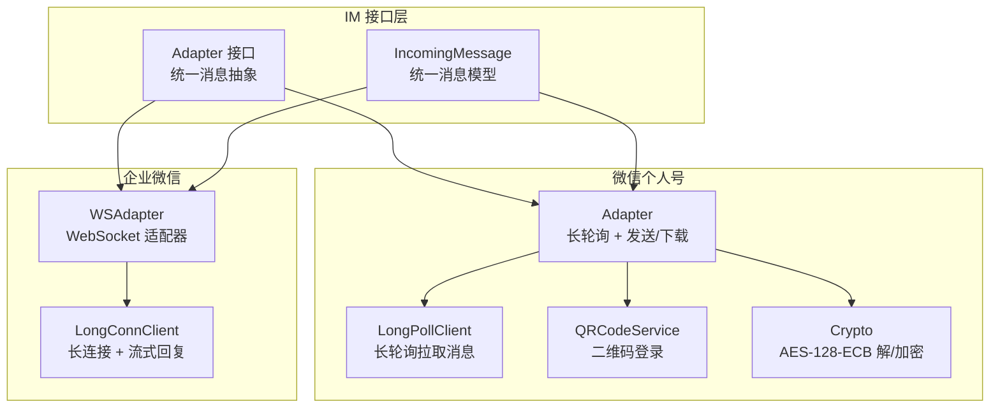
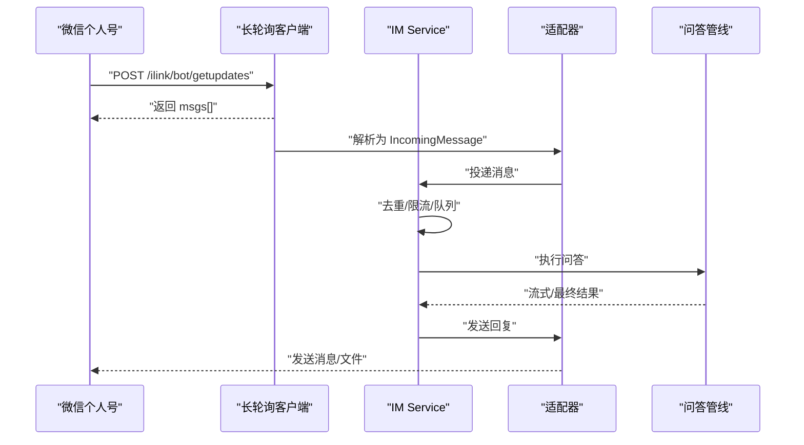
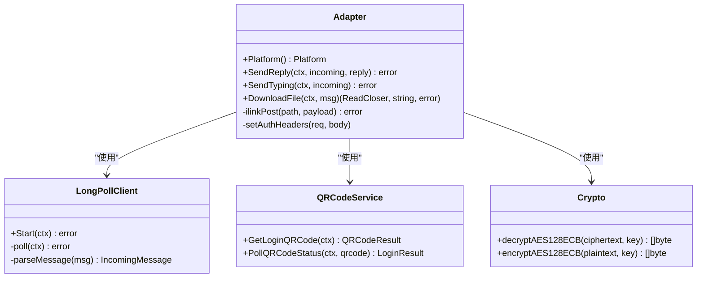
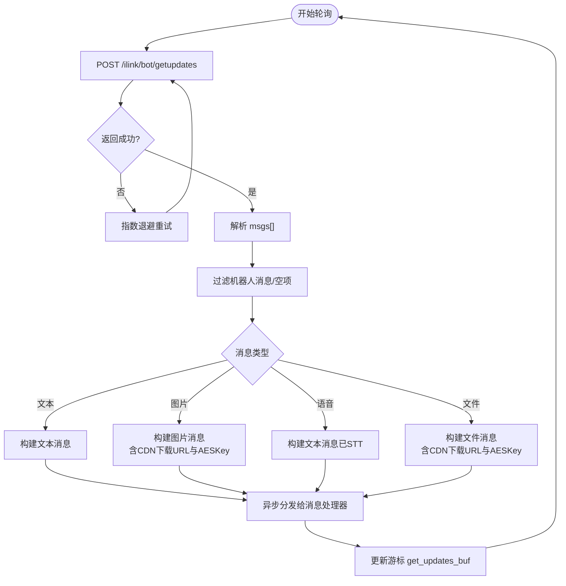
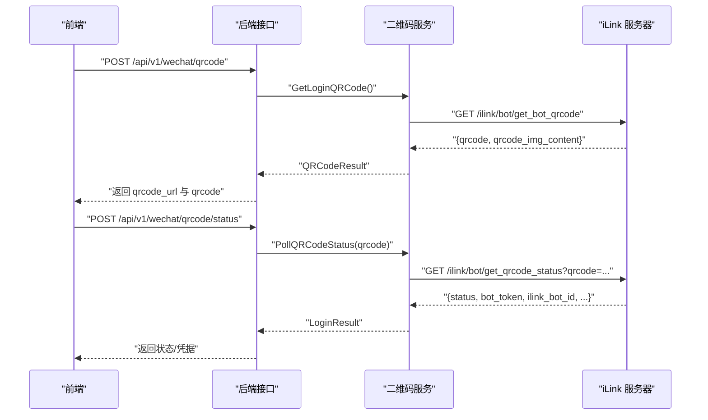
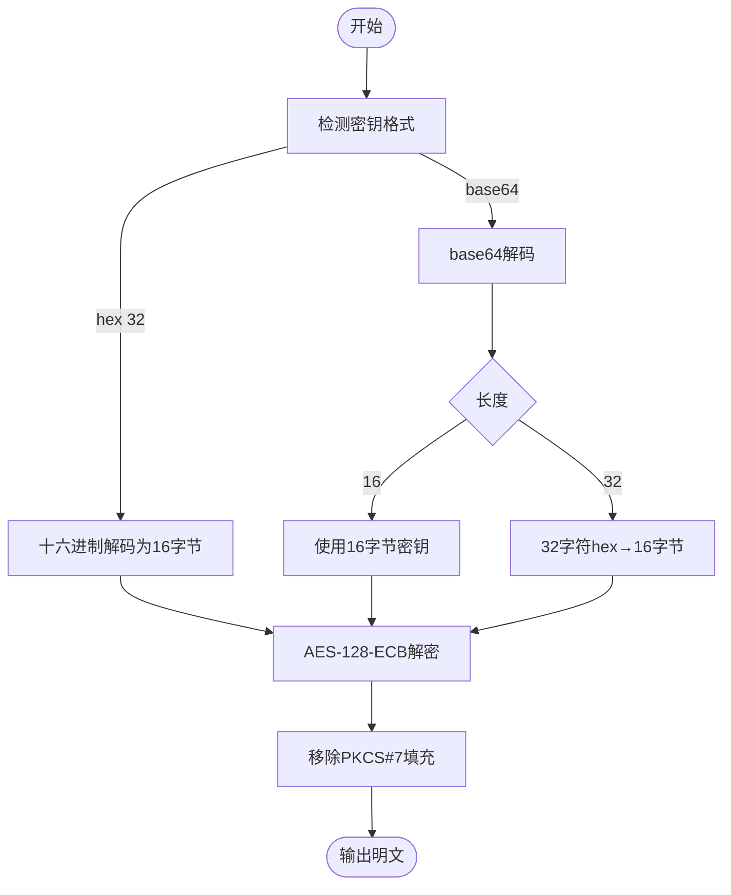
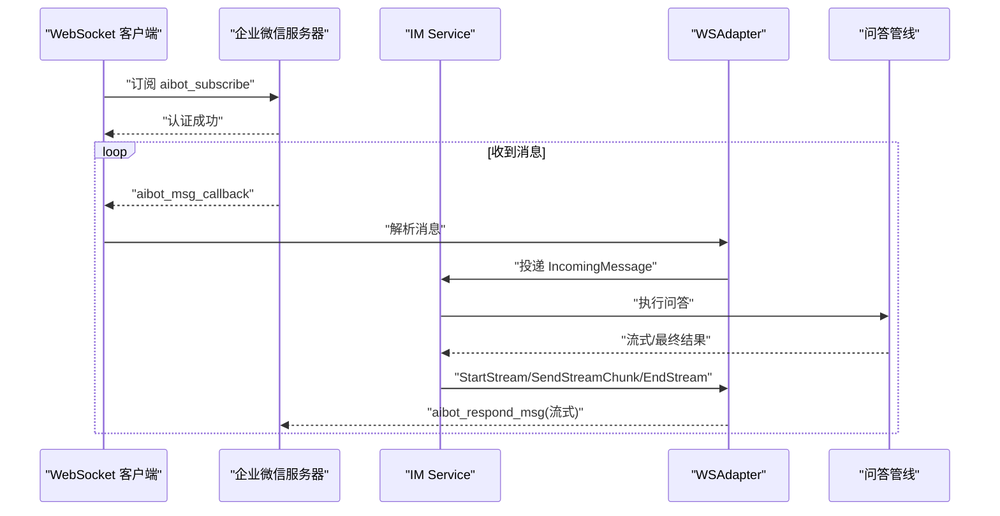
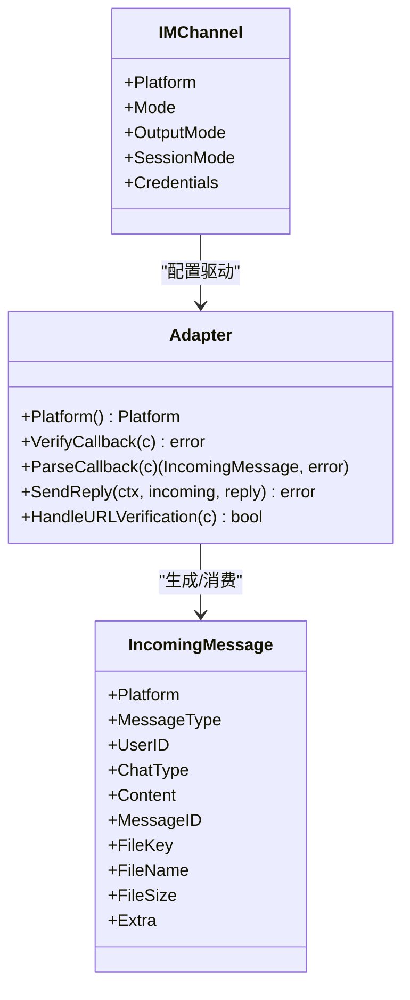
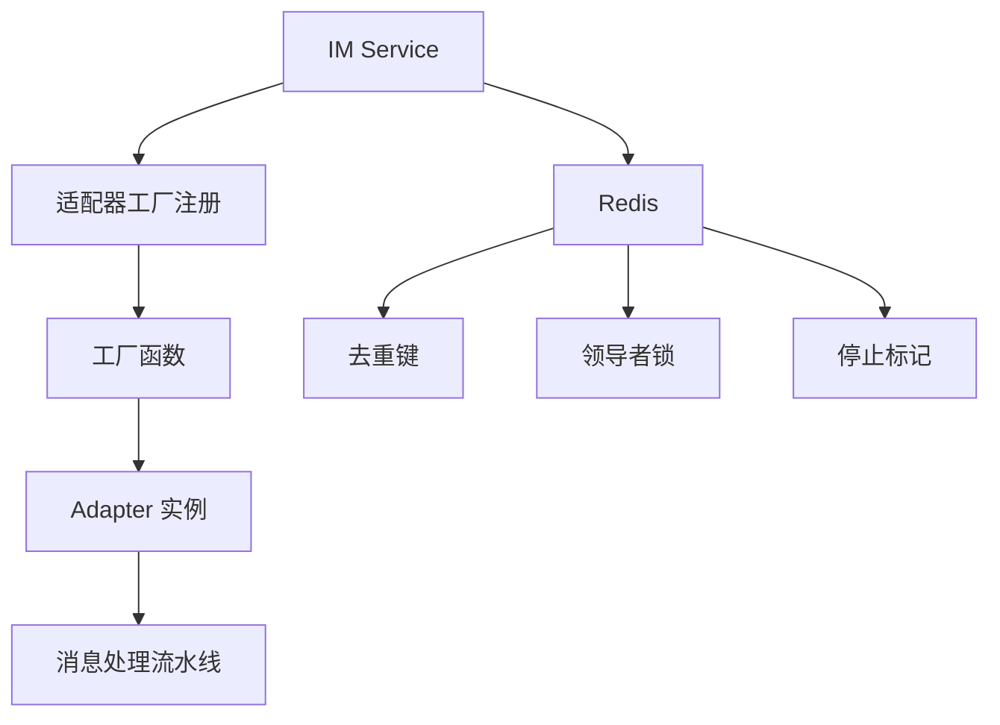

# 微信适配器

<cite>
**本文档引用的文件**
- [adapter.go](file://internal/im/adapter.go)
- [types.go](file://internal/im/types.go)
- [service.go](file://internal/im/service.go)
- [adapter.go](file://internal/im/wechat/adapter.go)
- [crypto.go](file://internal/im/wechat/crypto.go)
- [longpoll.go](file://internal/im/wechat/longpoll.go)
- [qrcode.go](file://internal/im/wechat/qrcode.go)
- [wechat_qrcode.go](file://internal/handler/wechat_qrcode.go)
- [longconn.go](file://internal/im/wecom/longconn.go)
</cite>

## 目录
1. [简介](#简介)
2. [项目结构](#项目结构)
3. [核心组件](#核心组件)
4. [架构总览](#架构总览)
5. [详细组件分析](#详细组件分析)
6. [依赖分析](#依赖分析)
7. [性能考虑](#性能考虑)
8. [故障排查指南](#故障排查指南)
9. [结论](#结论)
10. [附录](#附录)

## 简介
本文件为微信适配器的技术文档，聚焦于微信个人号（iLink Bot API）与企业微信（WeCom）的集成实现。内容涵盖：
- 微信个人号：基于HTTP长轮询的消息接收、消息加解密（AES-128-ECB）、文件下载与解密、二维码登录流程。
- 企业微信：基于WebSocket长连接的消息收发、流式回复、消息类型解析与群组管理。
- 统一适配器接口、消息模型、会话管理与分布式一致性保障。

本指南旨在帮助开发者快速理解并正确集成微信生态，包括Token验证、消息加解密、回调地址配置、安全传输与最佳实践。

## 项目结构
微信适配器位于内部模块 internal/im 下，按平台拆分目录：
- wechat：微信个人号适配（长轮询 + 二维码登录 + 加解密）
- wecom：企业微信适配（WebSocket + 流式回复 + 群组管理）

图表来源
- [adapter.go:120-165](file://internal/im/adapter.go#L120-L165)
- [adapter.go:62-78](file://internal/im/wechat/adapter.go#L62-L78)
- [longpoll.go:39-56](file://internal/im/wechat/longpoll.go#L39-L56)
- [qrcode.go:41-51](file://internal/im/wechat/qrcode.go#L41-L51)
- [crypto.go:10-72](file://internal/im/wechat/crypto.go#L10-L72)
- [longconn.go:123-145](file://internal/im/wecom/longconn.go#L123-L145)

章节来源
- [adapter.go:1-165](file://internal/im/adapter.go#L1-L165)
- [types.go:14-36](file://internal/im/types.go#L14-L36)

## 核心组件
- 统一适配器接口：定义平台标识、回调验证、消息解析、发送回复、URL验证等能力。
- IncomingMessage：跨平台统一的消息模型，包含用户ID、聊天类型、消息类型、文件信息、附加字段等。
- IM Service：负责通道加载、适配器工厂注册、消息去重、速率限制、分布式一致性、队列与工作池、停止信号检测等。
- 微信个人号适配器：基于iLink Bot API的长轮询接收、文本/图片/语音/文件消息解析、CDN下载与AES解密、发送文本与打字指示、二维码登录。
- 企业微信适配器：基于WebSocket长连接的订阅、心跳、消息回调、流式回复、群组与@提及处理、事件处理。

章节来源
- [adapter.go:120-165](file://internal/im/adapter.go#L120-L165)
- [types.go:42-98](file://internal/im/types.go#L42-L98)
- [service.go:101-163](file://internal/im/service.go#L101-L163)

## 架构总览
微信适配器整体架构由“适配器层 + 消息服务层 + 平台实现层”组成。微信个人号通过长轮询持续拉取消息；企业微信通过WebSocket保持长连接并支持流式回复。两者均通过统一的IncomingMessage模型进入消息处理流水线，并由IM Service完成去重、限流、队列与分布式一致性控制。

图表来源
- [longpoll.go:107-178](file://internal/im/wechat/longpoll.go#L107-L178)
- [adapter.go:95-122](file://internal/im/wechat/adapter.go#L95-L122)
- [service.go:784-800](file://internal/im/service.go#L784-L800)

## 详细组件分析

### 微信个人号适配器（长轮询 + 二维码登录 + 加解密）
- 平台标识：PlatformWeChat
- 回调验证：不支持（长轮询模式）
- 消息发送：通过REST API发送文本消息
- 打字指示：发送打字状态
- 文件下载与解密：从CDN下载加密文件，使用AES-128-ECB解密
- 二维码登录：获取二维码、轮询扫描状态、返回bot_token与ilink_bot_id

图表来源
- [adapter.go:62-78](file://internal/im/wechat/adapter.go#L62-L78)
- [adapter.go:95-122](file://internal/im/wechat/adapter.go#L95-L122)
- [adapter.go:142-200](file://internal/im/wechat/adapter.go#L142-L200)
- [longpoll.go:39-56](file://internal/im/wechat/longpoll.go#L39-L56)
- [qrcode.go:41-51](file://internal/im/wechat/qrcode.go#L41-L51)
- [crypto.go:10-72](file://internal/im/wechat/crypto.go#L10-L72)

章节来源
- [adapter.go:1-323](file://internal/im/wechat/adapter.go#L1-L323)
- [longpoll.go:1-364](file://internal/im/wechat/longpoll.go#L1-L364)
- [qrcode.go:1-160](file://internal/im/wechat/qrcode.go#L1-L160)
- [crypto.go:1-73](file://internal/im/wechat/crypto.go#L1-L73)

#### 长轮询消息解析流程

图表来源
- [longpoll.go:107-178](file://internal/im/wechat/longpoll.go#L107-L178)
- [longpoll.go:180-297](file://internal/im/wechat/longpoll.go#L180-L297)

#### 二维码登录流程

图表来源
- [qrcode.go:53-94](file://internal/im/wechat/qrcode.go#L53-L94)
- [qrcode.go:102-159](file://internal/im/wechat/qrcode.go#L102-L159)
- [wechat_qrcode.go:14-32](file://internal/handler/wechat_qrcode.go#L14-L32)
- [wechat_qrcode.go:34-72](file://internal/handler/wechat_qrcode.go#L34-L72)

#### AES-128-ECB 加解密流程
- 加密：对明文进行PKCS#7填充，按块加密。
- 解密：逐块解密，移除PKCS#7填充。
- 密钥格式：支持base64(raw 16字节)、base64(hex字符串32字符→转16字节)、原始hex字符串32字符→转16字节。

图表来源
- [crypto.go:10-72](file://internal/im/wechat/crypto.go#L10-L72)
- [adapter.go:202-244](file://internal/im/wechat/adapter.go#L202-L244)

### 企业微信适配器（WebSocket + 流式回复）
- 平台标识：PlatformWeCom
- 连接：WebSocket长连接，订阅后接收消息回调与事件回调
- 心跳：每30秒ping，超时未收到pong则断开触发重连
- 消息类型：文本、语音（STT）、图片、文件、混合消息（文本+图片）
- 流式回复：基于替换式流式协议，累积内容并发送完整文本
- 群组管理：识别群聊与@提及，自动去除@前缀以便识别命令

图表来源
- [longconn.go:359-418](file://internal/im/wecom/longconn.go#L359-L418)
- [longconn.go:487-631](file://internal/im/wecom/longconn.go#L487-L631)
- [longconn.go:223-254](file://internal/im/wecom/longconn.go#L223-L254)
- [longconn.go:260-329](file://internal/im/wecom/longconn.go#L260-L329)

章节来源
- [adapter.go:24-47](file://internal/im/wecom/adapter.go#L24-L47)
- [longconn.go:1-781](file://internal/im/wecom/longconn.go#L1-L781)

### 统一适配器接口与消息模型
- Adapter接口：平台标识、回调验证、消息解析、发送回复、URL验证。
- IncomingMessage：统一承载用户ID、聊天类型、消息类型、内容、文件信息、附加字段等。
- IMChannel：数据库中存储的通道配置，包含平台、模式、输出模式、会话模式、凭证等。

图表来源
- [adapter.go:120-165](file://internal/im/adapter.go#L120-L165)
- [adapter.go:42-98](file://internal/im/adapter.go#L42-L98)
- [types.go:14-36](file://internal/im/types.go#L14-L36)
- [types.go:147-168](file://internal/im/types.go#L147-L168)

章节来源
- [adapter.go:1-165](file://internal/im/adapter.go#L1-L165)
- [types.go:1-179](file://internal/im/types.go#L1-L179)

## 依赖分析
- 适配器与消息服务：IM Service通过适配器工厂创建具体平台适配器，统一接入消息处理流水线。
- 分布式一致性：Redis用于去重、限流、领导者选举、跨实例停止信号检测。
- 通道生命周期：IM Service负责通道加载、启动、停止、领导者轮换与重试。

图表来源
- [service.go:352-357](file://internal/im/service.go#L352-L357)
- [service.go:416-451](file://internal/im/service.go#L416-L451)
- [service.go:520-583](file://internal/im/service.go#L520-L583)

章节来源
- [service.go:101-163](file://internal/im/service.go#L101-L163)
- [service.go:352-357](file://internal/im/service.go#L352-L357)
- [service.go:416-451](file://internal/im/service.go#L416-L451)
- [service.go:520-583](file://internal/im/service.go#L520-L583)

## 性能考虑
- 长轮询：设置合理的HTTP超时与指数退避，避免频繁抖动；游标更新确保连续性。
- WebSocket：心跳周期与读超时需匹配；流式回复采用累积策略，减少重复发送。
- 去重与限流：Redis去重与滑动窗口限流降低重复处理与下游压力。
- 多实例：领导者选举避免多实例同时连接同一通道；停止信号跨实例一致。

## 故障排查指南
- 微信个人号
  - 长轮询失败：检查bot_token是否过期（错误码-14），重新二维码登录获取新token。
  - 文件下载失败：确认CDN下载URL有效且aes_key正确；检查AES解密密钥格式。
  - 打字指示无效：确认请求头与参数正确。
- 企业微信
  - 连接中断：检查心跳是否正常，服务器下发disconnected_event时会主动断开并重连。
  - 流式回复丢失：关注缓冲区清理时机，EndStream后清理对应流ID。
  - 群聊@提及：确认@前缀去除逻辑生效，避免命令无法识别。
- 通用
  - 重复消息：检查Redis去重键是否生效或单实例本地去重是否正常。
  - 速率限制：调整滑动窗口参数或等待冷却时间。

章节来源
- [longpoll.go:36-37](file://internal/im/wechat/longpoll.go#L36-L37)
- [longpoll.go:147-154](file://internal/im/wechat/longpoll.go#L147-L154)
- [longconn.go:40-47](file://internal/im/wecom/longconn.go#L40-L47)
- [longconn.go:502-511](file://internal/im/wecom/longconn.go#L502-L511)
- [service.go:758-782](file://internal/im/service.go#L758-L782)

## 结论
微信适配器在微信个人号与企业微信两大场景下提供了稳定、可扩展的集成方案。通过统一的适配器接口与消息模型，结合IM Service的去重、限流与分布式一致性保障，开发者可以快速搭建安全、高效的微信生态应用。建议在生产环境中启用Redis以获得更好的多实例一致性与稳定性，并严格遵循消息加解密与安全传输规范。

## 附录
- 配置要点
  - 微信个人号：保存bot_token与ilink_bot_id；二维码登录成功后方可启用长轮询。
  - 企业微信：配置WebSocket端点、bot_id与secret；根据需要开启流式回复。
- 最佳实践
  - 使用Redis进行去重与领导者选举，避免多实例冲突。
  - 对文件消息统一走CDN下载与AES解密，确保数据安全。
  - 在群组场景中处理@提及，保证命令识别准确。
  - 合理设置超时与重试策略，提升鲁棒性。