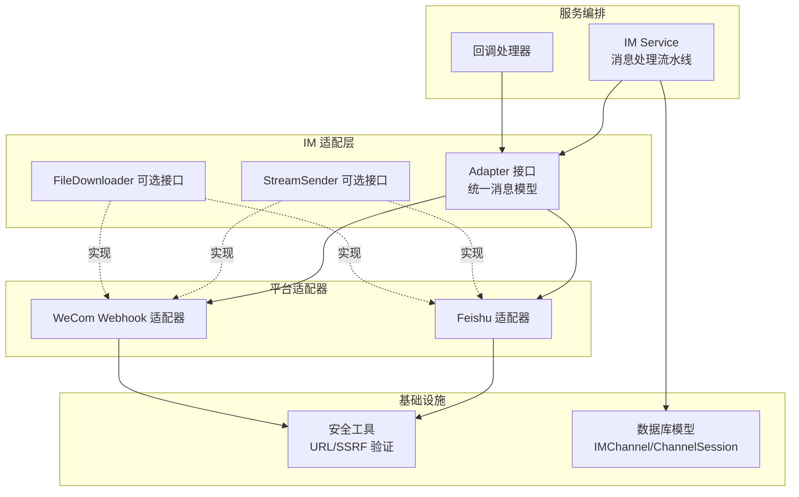
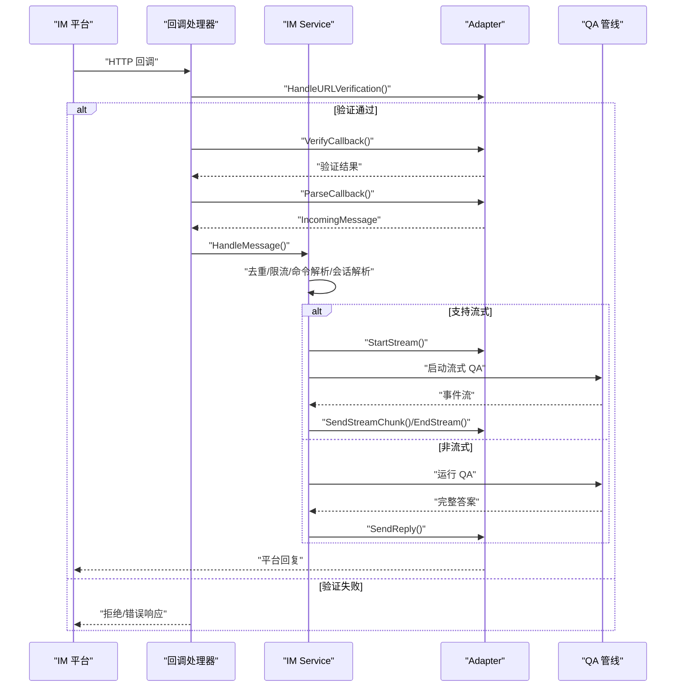
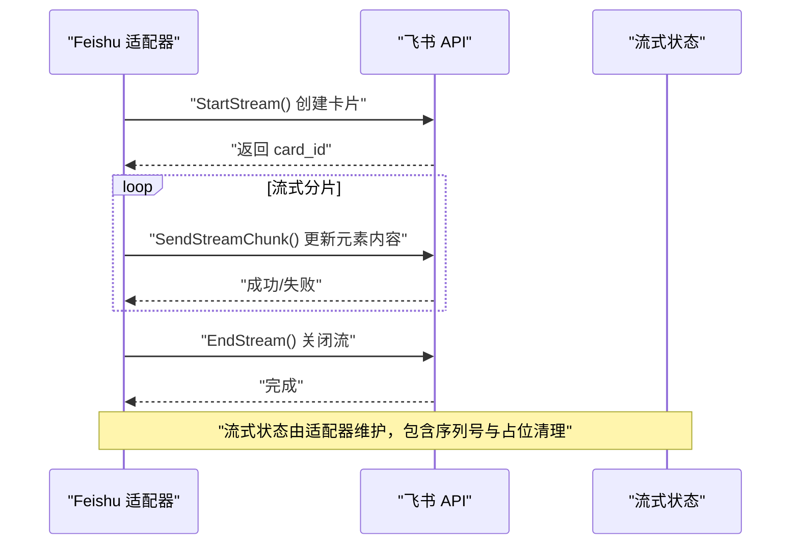
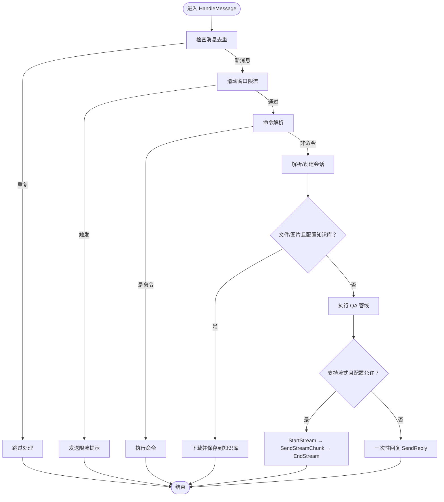
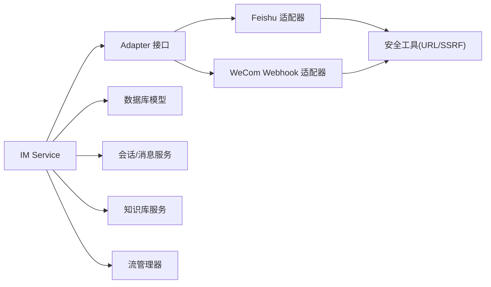

# 适配器接口规范

<cite>
**本文档引用的文件**
- [adapter.go](file://internal/im/adapter.go)
- [types.go](file://internal/im/types.go)
- [service.go](file://internal/im/service.go)
- [feishu/adapter.go](file://internal/im/feishu/adapter.go)
- [wecom/webhook_adapter.go](file://internal/im/wecom/webhook_adapter.go)
- [im.go](file://internal/handler/im.go)
- [security.go](file://internal/utils/security.go)
</cite>

## 目录
1. [简介](#简介)
2. [项目结构](#项目结构)
3. [核心组件](#核心组件)
4. [架构总览](#架构总览)
5. [详细组件分析](#详细组件分析)
6. [依赖关系分析](#依赖关系分析)
7. [性能考虑](#性能考虑)
8. [故障排除指南](#故障排除指南)
9. [结论](#结论)

## 简介
本文件为 WeKnora 项目的 IM（即时通讯）适配器接口规范，面向平台开发者与集成工程师，系统性阐述 Adapter 接口的设计理念、统一消息模型、扩展机制与实现要求。文档覆盖以下关键主题：
- 平台标识（Platform）、会话模式（SessionMode）、消息类型（MessageType）的标准化定义
- 统一入站消息（IncomingMessage）与统一出站消息（ReplyMessage）的数据结构、字段语义与使用场景
- 可选接口（StreamSender、FileDownloader）的实现与最佳实践
- 消息去重、签名验证、URL 验证与错误处理的标准流程
- 适配器开发规范与接口实现指导

## 项目结构
IM 适配器相关代码主要位于 internal/im 包中，并在各具体平台目录下实现具体适配器：
- 接口与统一模型：internal/im/adapter.go
- 数据模型与通道配置：internal/im/types.go
- 服务编排与业务流程：internal/im/service.go
- 平台适配器示例：internal/im/feishu/adapter.go、internal/im/wecom/webhook_adapter.go
- HTTP 回调入口：internal/handler/im.go
- 安全与 URL 验证：internal/utils/security.go



**图表来源**
- [adapter.go:120-164](file://internal/im/adapter.go#L120-L164)
- [service.go:101-163](file://internal/im/service.go#L101-L163)
- [feishu/adapter.go:32-34](file://internal/im/feishu/adapter.go#L32-L34)
- [wecom/webhook_adapter.go:95-96](file://internal/im/wecom/webhook_adapter.go#L95-L96)
- [security.go:373-480](file://internal/utils/security.go#L373-L480)
- [types.go:14-36](file://internal/im/types.go#L14-L36)

**章节来源**
- [adapter.go:1-165](file://internal/im/adapter.go#L1-L165)
- [types.go:1-179](file://internal/im/types.go#L1-L179)
- [service.go:1-200](file://internal/im/service.go#L1-L200)

## 核心组件
本节从接口设计、统一消息模型、扩展机制三个维度，系统阐述 Adapter 的核心能力。

- 接口设计
  - Adapter 是所有 IM 平台必须实现的基础接口，提供平台标识、回调签名验证、回调解析、回复发送与 URL 验证处理等能力。
  - 可选接口 StreamSender 支持实时流式回复；FileDownloader 支持文件下载与知识库入库。

- 统一消息模型
  - IncomingMessage：统一承载来自不同平台的消息，包括平台标识、消息类型、用户/聊天信息、内容、文件信息、线程 ID、引用消息与平台扩展字段。
  - ReplyMessage：统一承载回复内容，支持流式标记与平台扩展字段。

- 扩展机制
  - 通过可选接口实现平台特定能力（如流式卡片、文件下载），保持 Adapter 的最小契约与平台能力的最大化扩展。

**章节来源**
- [adapter.go:108-164](file://internal/im/adapter.go#L108-L164)

## 架构总览
IM 服务的整体处理流程如下：
- HTTP 回调入口接收平台事件
- 验证 URL 验证与回调签名
- 解析回调为统一 IncomingMessage
- 去重、限流、命令解析、会话解析
- 流式或非流式执行 QA 管线
- 通过适配器发送 ReplyMessage 或流式分片



**图表来源**
- [im.go:283-304](file://internal/handler/im.go#L283-L304)
- [service.go:784-977](file://internal/im/service.go#L784-L977)
- [adapter.go:120-139](file://internal/im/adapter.go#L120-L139)

**章节来源**
- [im.go:261-304](file://internal/handler/im.go#L261-L304)
- [service.go:784-977](file://internal/im/service.go#L784-L977)

## 详细组件分析

### 统一消息模型与字段语义
- 平台标识（Platform）
  - 支持 WeCom、Feishu、Slack、Telegram、DingTalk、Mattermost、WeChat 等平台标识枚举。
  - 用于区分不同平台的消息解析与回复策略。

- 会话模式（SessionMode）
  - user：按用户+聊天维度建立会话映射。
  - thread：按线程维度建立会话映射，适合支持话题线程的平台。

- 消息类型（MessageType）
  - text、file、image 三类基础类型，扩展性强，可覆盖富文本、多媒体等场景。

- 入站消息（IncomingMessage）
  - 字段涵盖平台、消息类型、用户/聊天标识、内容、消息 ID、文件键/名称/大小、线程 ID、引用消息、平台扩展字段等。
  - 引用消息（QuotedMessage）用于承载被引用的历史消息内容或非文本类型提示。

- 出站消息（ReplyMessage）
  - 字段包含内容（Markdown）、流式标记（IsStreaming/IsFinal）、平台扩展字段。
  - 流式场景下，IsStreaming=true 表示分片，IsFinal=true 标记最后分片。

- 通道与会话（IMChannel/ChannelSession）
  - IMChannel：绑定租户、代理、平台、模式（websocket/webhook）、输出模式（stream/full）、知识库 ID、机器人身份等。
  - ChannelSession：将平台用户+聊天+线程映射到 WeKnora 会话，支持状态与元数据。

```mermaid
classDiagram
class Platform {
<<enum>>
"wecom"
"feishu"
"slack"
"telegram"
"dingtalk"
"mattermost"
"wechat"
}
class SessionMode {
<<enum>>
"user"
"thread"
}
class MessageType {
<<enum>>
"text"
"file"
"image"
}
class ChatType {
<<enum>>
"direct"
"group"
}
class IncomingMessage {
+Platform platform
+MessageType messageType
+string userID
+string userName
+string chatID
+ChatType chatType
+string content
+string messageID
+string fileKey
+string fileName
+int64 fileSize
+string threadID
+QuotedMessage quote
+map[string]string extra
}
class QuotedMessage {
+string messageID
+string content
+string senderID
+bool isBotMessage
+string nonTextType
}
class ReplyMessage {
+string content
+bool isStreaming
+bool isFinal
+map[string]string extra
}
class IMChannel {
+string id
+uint64 tenantID
+string agentID
+string platform
+string name
+bool enabled
+string mode
+string outputMode
+string knowledgeBaseID
+string botIdentity
+string sessionMode
+JSON credentials
}
class ChannelSession {
+string id
+string platform
+string userID
+string chatID
+string threadID
+string sessionID
+uint64 tenantID
+string agentID
+string imChannelID
+string status
+JSON metadata
}
IncomingMessage --> Platform
IncomingMessage --> MessageType
IncomingMessage --> ChatType
IncomingMessage --> QuotedMessage
ReplyMessage --> Platform
IMChannel --> SessionMode
ChannelSession --> IMChannel
```

**图表来源**
- [adapter.go:10-106](file://internal/im/adapter.go#L10-L106)
- [adapter.go:42-98](file://internal/im/adapter.go#L42-L98)
- [adapter.go:108-118](file://internal/im/adapter.go#L108-L118)
- [types.go:14-36](file://internal/im/types.go#L14-L36)
- [types.go:147-168](file://internal/im/types.go#L147-L168)

**章节来源**
- [adapter.go:10-118](file://internal/im/adapter.go#L10-L118)
- [adapter.go:141-164](file://internal/im/adapter.go#L141-L164)
- [types.go:14-168](file://internal/im/types.go#L14-L168)

### Adapter 接口与实现要求
- 必需方法
  - Platform()：返回平台标识
  - VerifyCallback(*gin.Context)：验证回调签名/令牌
  - ParseCallback(*gin.Context)：解析回调为 IncomingMessage
  - SendReply(context.Context, *IncomingMessage, *ReplyMessage)：发送回复
  - HandleURLVerification(*gin.Context) bool：处理平台 URL 验证挑战

- 可选接口
  - StreamSender：StartStream/SendStreamChunk/EndStream，用于流式回复
  - FileDownloader：DownloadFile，用于文件下载并可接入知识库

- 实现要点
  - 签名验证：严格校验平台提供的 token/signature，避免伪造请求
  - 回调解析：统一解析为 IncomingMessage，处理多平台字段差异
  - 回复发送：根据平台 API 规范构造消息体，支持 Markdown
  - 流式处理：StartStream 创建会话态，SendStreamChunk 连续推送，EndStream 结束
  - 文件下载：DownloadFile 返回 io.ReadCloser 与文件名，结合知识库服务入库

**章节来源**
- [adapter.go:120-164](file://internal/im/adapter.go#L120-L164)

### 平台适配器示例与最佳实践

#### Feishu 适配器
- 签名验证：支持加密事件解密与 token 校验
- URL 验证：处理 challenge 请求
- 回调解析：支持 text、file、image、post 等消息类型，自动去除 @ 提及
- 回复发送：使用平台 API 发送 text 消息
- 流式回复：基于 CardKit 卡片实现流式更新，包含占位与清理逻辑
- 文件下载：通过 GetMessageResource API 获取文件/图片资源，带 SSRF 校验



**图表来源**
- [feishu/adapter.go:636-728](file://internal/im/feishu/adapter.go#L636-L728)
- [feishu/adapter.go:574-700](file://internal/im/feishu/adapter.go#L574-L700)

**章节来源**
- [feishu/adapter.go:100-188](file://internal/im/feishu/adapter.go#L100-L188)
- [feishu/adapter.go:224-432](file://internal/im/feishu/adapter.go#L224-L432)
- [feishu/adapter.go:434-559](file://internal/im/feishu/adapter.go#L434-L559)
- [feishu/adapter.go:636-728](file://internal/im/feishu/adapter.go#L636-L728)

#### WeCom Webhook 适配器
- 签名验证：基于 token、timestamp、nonce、encrypt 的 HMAC-SHA1 校验
- URL 验证：GET 请求回显解密后的 echostr
- 回调解析：支持 text、image，群聊去除 @ 提及
- 回复发送：优先使用 appchat API 回复群聊，失败回退至用户直发
- 文件下载：支持 MediaId 临时素材下载与 PicUrl 直链下载，内置 SSRF 白名单与 URL 校验

**章节来源**
- [wecom/webhook_adapter.go:128-185](file://internal/im/wecom/webhook_adapter.go#L128-L185)
- [wecom/webhook_adapter.go:187-269](file://internal/im/wecom/webhook_adapter.go#L187-L269)
- [wecom/webhook_adapter.go:271-378](file://internal/im/wecom/webhook_adapter.go#L271-L378)
- [wecom/webhook_adapter.go:525-638](file://internal/im/wecom/webhook_adapter.go#L525-L638)

### 消息处理流水线与去重、限流、命令解析
- 去重：基于 Redis SetNX 或本地 sync.Map，以消息 ID 为键，TTL 5 分钟
- 限流：基于滑动窗口（Redis/ZSET 或本地）按用户+聊天+线程维度限制请求速率
- 命令解析：识别 /help、/info、/search、/stop、/clear 等指令，绕过 QA 直接处理
- 会话解析：根据 SessionMode（user/thread）解析或创建 ChannelSession
- 流式/非流式：根据通道配置与适配器能力选择流式或一次性回复



**图表来源**
- [service.go:758-804](file://internal/im/service.go#L758-L804)
- [service.go:840-854](file://internal/im/service.go#L840-L854)
- [service.go:911-923](file://internal/im/service.go#L911-L923)
- [service.go:864-884](file://internal/im/service.go#L864-L884)
- [service.go:1014-1022](file://internal/im/service.go#L1014-L1022)
- [service.go:1435-1736](file://internal/im/service.go#L1435-L1736)

**章节来源**
- [service.go:758-884](file://internal/im/service.go#L758-L884)
- [service.go:894-977](file://internal/im/service.go#L894-L977)
- [service.go:1435-1736](file://internal/im/service.go#L1435-L1736)

### 文件下载与知识库入库
- 文件下载：适配器实现 FileDownloader 后，可在通道配置了知识库 ID 时自动下载文件
- 入库流程：读取文件内容，构造内存文件头，调用知识库服务创建知识记录并持久化
- 结果反馈：通过智能回复模板生成友好提示，支持流式展示

**章节来源**
- [adapter.go:156-164](file://internal/im/adapter.go#L156-L164)
- [service.go:2087-2126](file://internal/im/service.go#L2087-L2126)

## 依赖关系分析
- 组件耦合
  - Adapter 与平台适配器强耦合，与 IM Service 通过接口弱耦合
  - IM Service 依赖数据库模型（IMChannel/ChannelSession）、会话/消息服务、知识库服务、流管理器等
  - 安全工具（URL/SSRF 校验）贯穿文件下载与外部请求场景

- 外部依赖
  - 平台 HTTP API（飞书、企业微信等）
  - Redis（去重、限流、领导者选举、跨实例停止）
  - 数据库（GORM）



**图表来源**
- [service.go:101-163](file://internal/im/service.go#L101-L163)
- [feishu/adapter.go:32-34](file://internal/im/feishu/adapter.go#L32-L34)
- [wecom/webhook_adapter.go:95-96](file://internal/im/wecom/webhook_adapter.go#L95-L96)
- [security.go:373-480](file://internal/utils/security.go#L373-L480)

**章节来源**
- [service.go:101-163](file://internal/im/service.go#L101-L163)
- [security.go:373-480](file://internal/utils/security.go#L373-L480)

## 性能考虑
- 流式刷新间隔：默认 300ms，平衡 API 速率限制与感知延迟
- 队列与并发：工作池与队列深度控制 LLM 并发，避免下游资源耗尽
- 缓存与去重：Redis SetNX 去重，TTL 控制内存占用
- 限流策略：滑动窗口限流，支持跨实例一致性
- 超时控制：QA 超时 120s，避免阻塞

**章节来源**
- [service.go:30-44](file://internal/im/service.go#L30-L44)
- [service.go:243-275](file://internal/im/service.go#L243-L275)

## 故障排除指南
- 回调验证失败
  - 检查签名算法与参数顺序（如 WeCom 的 token+timestamp+nonce+encrypt）
  - 确认时间戳与时钟同步
- URL 验证失败
  - 确认平台回调地址正确配置，challenge 参数解析无误
- 消息去重导致重复处理
  - 检查 Redis 可用性与键空间，确认 TTL 设置合理
- 流式回复异常
  - 确认 StartStream 成功返回平台流 ID，SendStreamChunk/EndStream 正常调用
  - 检查平台 API 限额与幂等性
- 文件下载失败
  - 校验 URL 是否在白名单内，SSRF 校验是否通过
  - 检查文件类型与大小限制，确保知识库服务正常
- 错误处理与日志
  - 适配器与服务层均记录详细错误上下文，便于定位问题

**章节来源**
- [im.go:283-293](file://internal/handler/im.go#L283-L293)
- [service.go:758-804](file://internal/im/service.go#L758-L804)
- [wecom/webhook_adapter.go:525-638](file://internal/im/wecom/webhook_adapter.go#L525-L638)
- [security.go:373-480](file://internal/utils/security.go#L373-L480)

## 结论
本规范以 Adapter 接口为核心，构建了统一的 IM 消息模型与可扩展的适配器体系。通过明确的平台标识、会话模式与消息类型标准，配合去重、限流、命令解析与流式/非流式两种回复策略，实现了跨平台的一致体验。同时，可选接口（StreamSender、FileDownloader）与完善的安全校验（签名、URL/SSRF）保障了扩展性与安全性。开发者可据此快速实现新的 IM 平台适配器，并在现有服务编排上无缝集成。