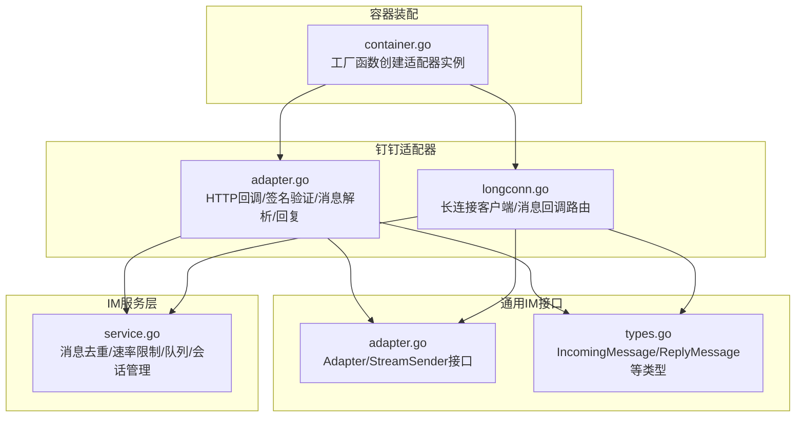
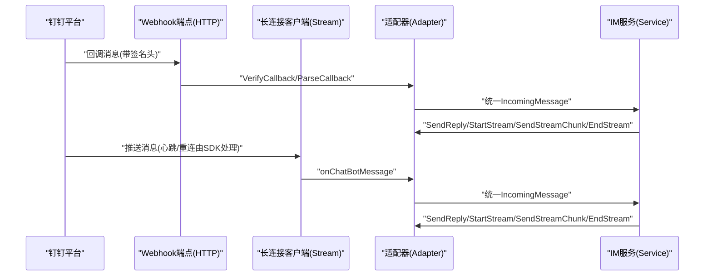
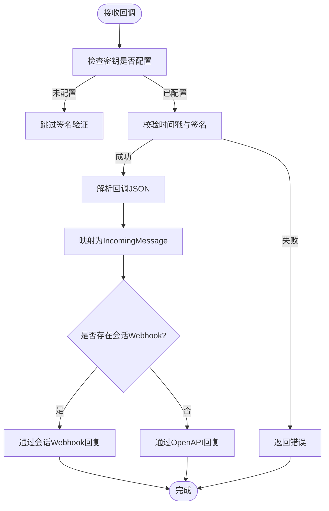
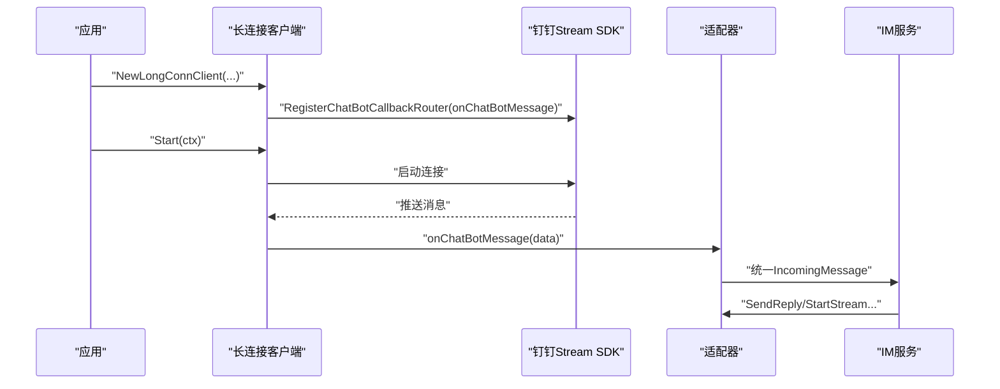
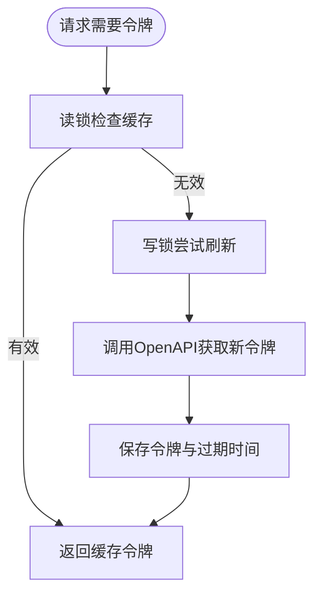
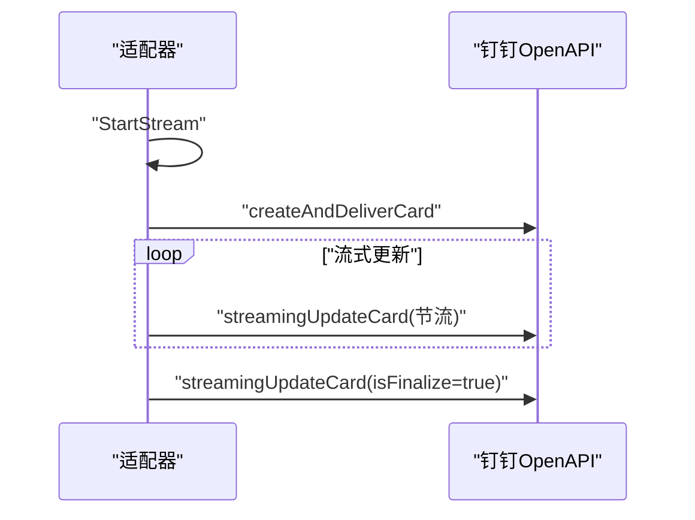
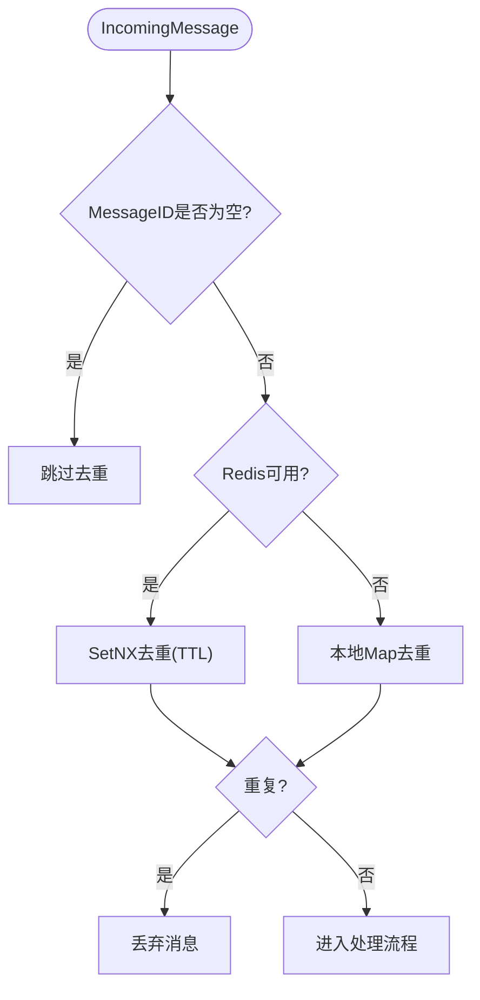
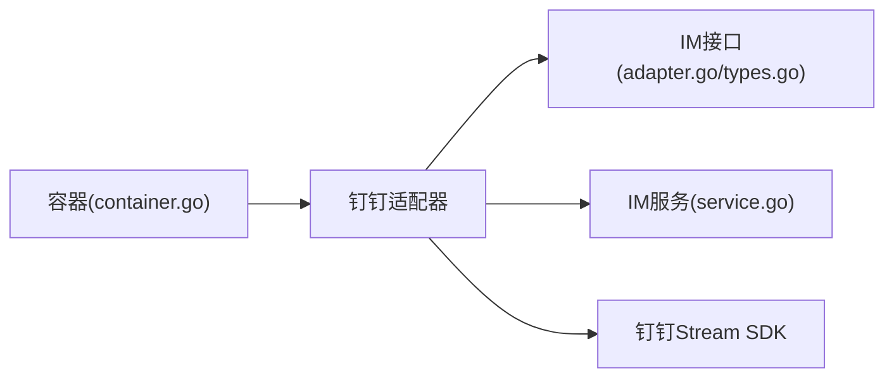

# 钉钉适配器

<cite>
**本文档引用的文件**
- [adapter.go](file://internal/im/dingtalk/adapter.go)
- [longconn.go](file://internal/im/dingtalk/longconn.go)
- [types.go](file://internal/im/types.go)
- [adapter.go](file://internal/im/adapter.go)
- [service.go](file://internal/im/service.go)
- [container.go](file://internal/container/container.go)
</cite>

## 目录
1. [简介](#简介)
2. [项目结构](#项目结构)
3. [核心组件](#核心组件)
4. [架构总览](#架构总览)
5. [详细组件分析](#详细组件分析)
6. [依赖关系分析](#依赖关系分析)
7. [性能考虑](#性能考虑)
8. [故障排查指南](#故障排查指南)
9. [结论](#结论)
10. [附录](#附录)

## 简介
本文件为钉钉适配器的技术文档，覆盖以下关键主题：
- 钉钉开放平台API集成方式与凭证管理
- 消息回调处理与签名验证
- Webhook与长连接两种接入模式
- 钉钉特有消息类型处理（文本、群聊、单聊）
- 用户身份识别与会话管理
- 组织架构权限与机器人配置
- 消息解析、文件下载、群组管理与机器人配置
- Webhook配置、签名验证与消息去重策略
- 长连接模式下的实时消息处理、心跳与断线重连
- 面向开发者的完整适配器开发指导与企业级集成最佳实践

## 项目结构
钉钉适配器位于内部IM模块的钉钉子目录，采用分层设计：
- 适配器层：负责对接钉钉平台，实现统一的消息收发接口
- 长连接客户端：封装钉钉Stream SDK，建立持久连接
- 服务层：统一调度消息处理、会话管理、流式输出与去重控制

**图表来源**
- [adapter.go:1-599](file://internal/im/dingtalk/adapter.go#L1-L599)
- [longconn.go:1-98](file://internal/im/dingtalk/longconn.go#L1-L98)
- [adapter.go:1-165](file://internal/im/adapter.go#L1-L165)
- [types.go:1-179](file://internal/im/types.go#L1-L179)
- [service.go:1-2532](file://internal/im/service.go#L1-L2532)
- [container.go:1360-1385](file://internal/container/container.go#L1360-L1385)

**章节来源**
- [adapter.go:1-599](file://internal/im/dingtalk/adapter.go#L1-L599)
- [longconn.go:1-98](file://internal/im/dingtalk/longconn.go#L1-L98)
- [adapter.go:1-165](file://internal/im/adapter.go#L1-L165)
- [types.go:1-179](file://internal/im/types.go#L1-L179)
- [service.go:1-2532](file://internal/im/service.go#L1-L2532)
- [container.go:1360-1385](file://internal/container/container.go#L1360-L1385)

## 核心组件
- 钉钉适配器（Webhook/长连接双模）
  - 支持HTTP回调模式与长连接模式
  - 提供统一的Adapter接口实现
- 长连接客户端
  - 基于钉钉Stream SDK，自动处理握手、心跳与断线重连
- 令牌缓存与刷新
  - 缓存access token，过期前主动刷新
- AI卡片流式输出
  - 可选AI卡片模板，支持增量更新与最终化
- 消息去重与速率限制
  - 基于Redis或本地Map的去重窗口
  - 分布式滑动窗口限流

**章节来源**
- [adapter.go:40-72](file://internal/im/dingtalk/adapter.go#L40-L72)
- [longconn.go:17-44](file://internal/im/dingtalk/longconn.go#L17-L44)
- [service.go:30-80](file://internal/im/service.go#L30-L80)

## 架构总览
钉钉适配器通过两种路径接入：
- Webhook模式：平台回调至HTTP端点，进行签名验证与消息解析，再通过OpenAPI或会话Webhook回复
- 长连接模式：通过Stream SDK建立持久连接，SDK负责心跳与重连，应用侧仅处理回调

**图表来源**
- [adapter.go:82-154](file://internal/im/dingtalk/adapter.go#L82-L154)
- [longconn.go:46-97](file://internal/im/dingtalk/longconn.go#L46-L97)
- [service.go:784-977](file://internal/im/service.go#L784-L977)

## 详细组件分析

### Webhook模式与回调处理
- 回调签名验证
  - 读取时间戳与签名头，校验时间窗与HMAC-SHA256签名
- 消息解析
  - 解析回调JSON，映射到统一IncomingMessage
  - 自动识别群聊/单聊、用户ID、消息ID、会话Webhook等
- 回复策略
  - 优先使用会话Webhook（若存在），否则走OpenAPI
  - OpenAPI按群聊/单聊选择不同接口

**图表来源**
- [adapter.go:82-154](file://internal/im/dingtalk/adapter.go#L82-L154)
- [adapter.go:191-287](file://internal/im/dingtalk/adapter.go#L191-L287)

**章节来源**
- [adapter.go:82-154](file://internal/im/dingtalk/adapter.go#L82-L154)
- [adapter.go:191-287](file://internal/im/dingtalk/adapter.go#L191-L287)

### 长连接模式与实时消息
- 客户端初始化
  - 注册聊天机器人回调路由
- 连接生命周期
  - 启动后阻塞等待，SDK负责心跳与断线重连
- 回调映射
  - 将平台回调数据映射为统一IncomingMessage并交由上层处理

**图表来源**
- [longconn.go:25-61](file://internal/im/dingtalk/longconn.go#L25-L61)
- [longconn.go:63-97](file://internal/im/dingtalk/longconn.go#L63-L97)

**章节来源**
- [longconn.go:17-98](file://internal/im/dingtalk/longconn.go#L17-L98)

### 认证与令牌管理
- 访问令牌缓存
  - 并发安全的读写锁保护
  - 过期时间提前5分钟刷新
- OpenAPI调用
  - 自动附加x-acs-dingtalk-access-token头

**图表来源**
- [adapter.go:289-346](file://internal/im/dingtalk/adapter.go#L289-L346)

**章节来源**
- [adapter.go:289-346](file://internal/im/dingtalk/adapter.go#L289-L346)

### AI卡片流式输出
- 卡片创建与投递
  - 根据群聊/单聊构造不同空间模型与投递参数
- 流式更新
  - 限制最小更新间隔，避免API限流
- 最终化
  - 结束时标记isFinalize=true

**图表来源**
- [adapter.go:382-440](file://internal/im/dingtalk/adapter.go#L382-L440)
- [adapter.go:523-594](file://internal/im/dingtalk/adapter.go#L523-L594)

**章节来源**
- [adapter.go:382-440](file://internal/im/dingtalk/adapter.go#L382-L440)
- [adapter.go:442-594](file://internal/im/dingtalk/adapter.go#L442-L594)

### 消息去重与会话管理
- 去重策略
  - 多实例：Redis键值去重，TTL控制过期
  - 单实例：本地sync.Map去重
- 会话解析
  - 支持按用户/按线程两种模式
  - 与通道配置联动，决定消息键构建

**图表来源**
- [service.go:758-804](file://internal/im/service.go#L758-L804)
- [service.go:767-782](file://internal/im/service.go#L767-L782)

**章节来源**
- [service.go:758-804](file://internal/im/service.go#L758-L804)
- [service.go:767-782](file://internal/im/service.go#L767-L782)

### 文件下载与知识库集成
- 文件消息处理
  - 当通道配置了知识库ID时，文件/图片消息不进入QA，直接下载并入库
- 下载接口
  - 适配器可实现FileDownloader接口以支持平台文件下载

**章节来源**
- [service.go:864-884](file://internal/im/service.go#L864-L884)
- [adapter.go:156-165](file://internal/im/adapter.go#L156-L165)

## 依赖关系分析
- 适配器依赖
  - 统一IM接口：Adapter/StreamSender/IncomingMessage/ReplyMessage
  - IM服务：消息去重、速率限制、队列与会话管理
  - 钉钉SDK：长连接客户端
- 容器装配
  - 工厂函数根据通道配置创建Webhook/长连接适配器实例

**图表来源**
- [adapter.go:1-599](file://internal/im/dingtalk/adapter.go#L1-L599)
- [adapter.go:1-165](file://internal/im/adapter.go#L1-L165)
- [types.go:1-179](file://internal/im/types.go#L1-L179)
- [service.go:1-2532](file://internal/im/service.go#L1-L2532)
- [container.go:1360-1385](file://internal/container/container.go#L1360-L1385)

**章节来源**
- [adapter.go:1-599](file://internal/im/dingtalk/adapter.go#L1-L599)
- [adapter.go:1-165](file://internal/im/adapter.go#L1-L165)
- [types.go:1-179](file://internal/im/types.go#L1-L179)
- [service.go:1-2532](file://internal/im/service.go#L1-L2532)
- [container.go:1360-1385](file://internal/container/container.go#L1360-L1385)

## 性能考虑
- 令牌缓存与刷新
  - 减少频繁调用OpenAPI换取令牌
- 流式输出节流
  - 最小更新间隔避免API限流
- 去重与限流
  - 去重窗口与滑动窗口限流降低重复与滥用
- 队列与并发
  - 有界队列与工作池控制下游负载

[本节为通用性能讨论，无需特定文件引用]

## 故障排查指南
- 回调签名失败
  - 检查时间戳是否过期（±1小时）
  - 确认密钥配置正确且与平台一致
- OpenAPI调用失败
  - 检查access token是否获取成功
  - 核对机器人权限与接口路径
- 长连接断开
  - 关注SDK日志，确认网络与鉴权
  - 检查平台端是否关闭或变更凭证
- 流式输出异常
  - 检查AI卡片模板ID与权限
  - 观察最小更新间隔是否导致内容延迟

**章节来源**
- [adapter.go:82-113](file://internal/im/dingtalk/adapter.go#L82-L113)
- [adapter.go:289-346](file://internal/im/dingtalk/adapter.go#L289-L346)
- [adapter.go:426-440](file://internal/im/dingtalk/adapter.go#L426-L440)
- [longconn.go:46-61](file://internal/im/dingtalk/longconn.go#L46-L61)

## 结论
钉钉适配器提供了企业级IM集成的完整能力：
- Webhook与长连接双模，满足不同部署场景
- 完整的签名验证、消息去重与限流机制
- 流式输出与AI卡片能力，提升用户体验
- 与IM服务深度集成，支持命令、队列与会话管理

[本节为总结性内容，无需特定文件引用]

## 附录

### Webhook配置与签名验证要点
- 平台端配置回调URL与密钥
- 服务端实现VerifyCallback，校验时间戳与签名
- ParseCallback解析消息体并映射为统一格式

**章节来源**
- [adapter.go:82-154](file://internal/im/dingtalk/adapter.go#L82-L154)

### 钉钉机器人配置与权限
- 机器人凭证：clientID/clientSecret
- 可选AI卡片模板ID用于流式卡片
- 群聊/单聊消息区分与会话Webhook使用

**章节来源**
- [adapter.go:40-72](file://internal/im/dingtalk/adapter.go#L40-L72)
- [adapter.go:191-287](file://internal/im/dingtalk/adapter.go#L191-L287)

### 适配器工厂与装配
- 容器根据通道配置创建Webhook/长连接适配器
- 适配器注册到IM服务，参与消息处理与流式输出

**章节来源**
- [container.go:1360-1385](file://internal/container/container.go#L1360-L1385)
- [service.go:412-451](file://internal/im/service.go#L412-L451)