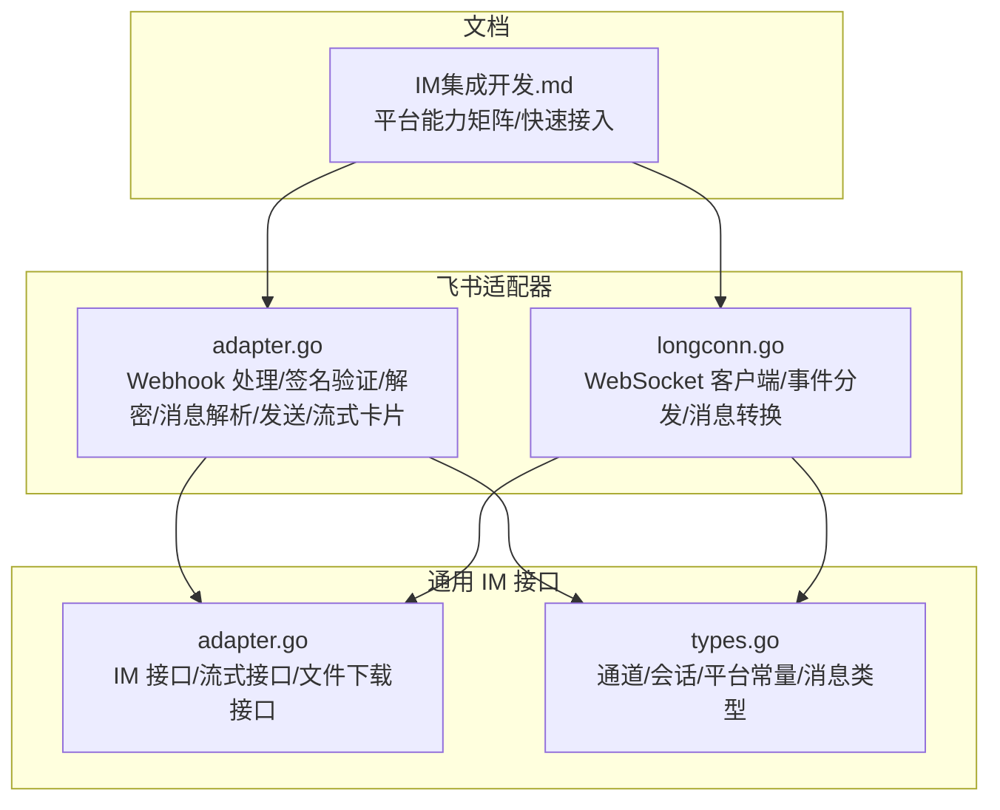
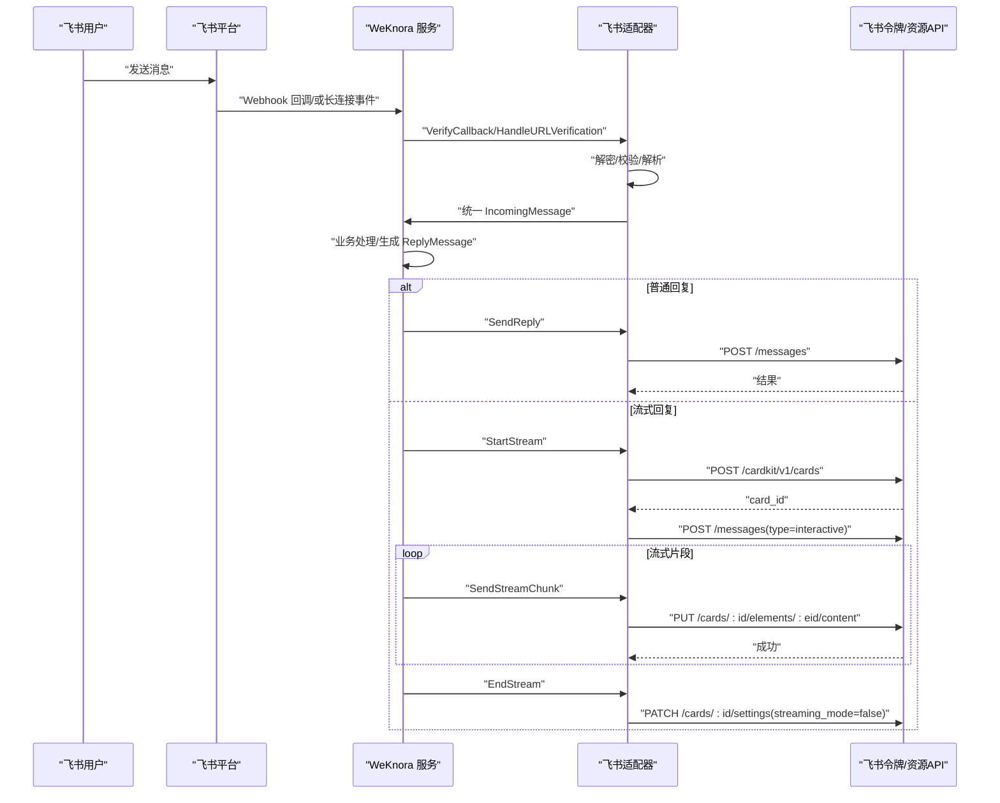
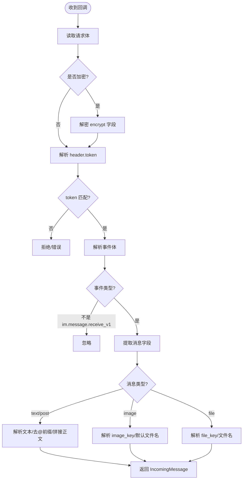
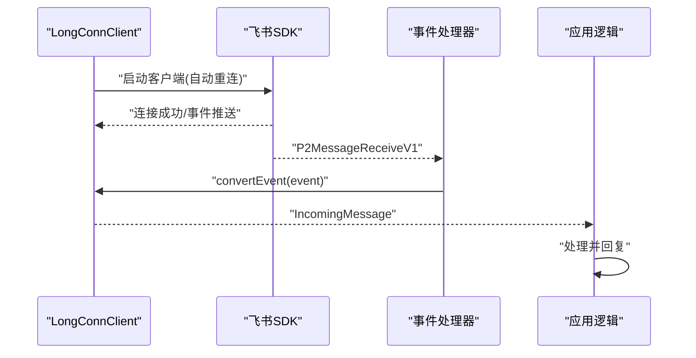
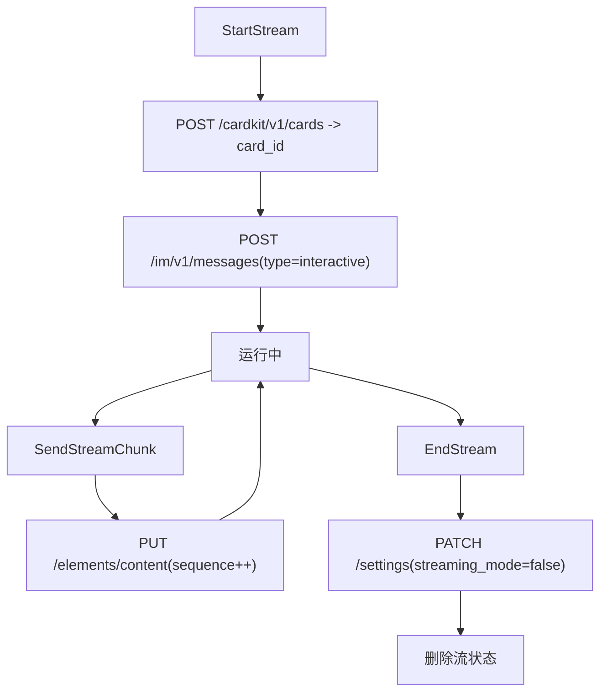
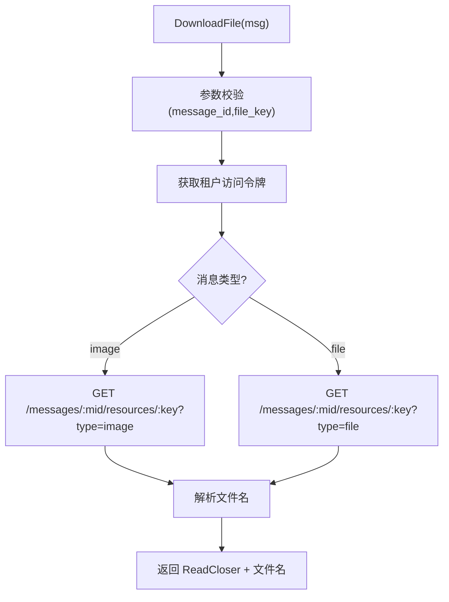
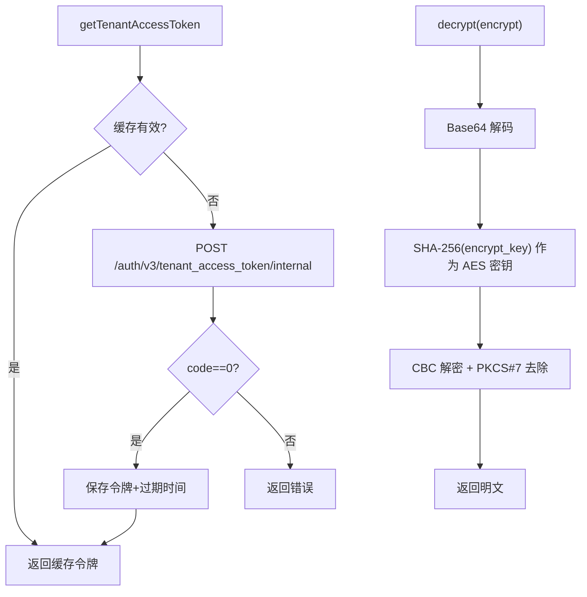
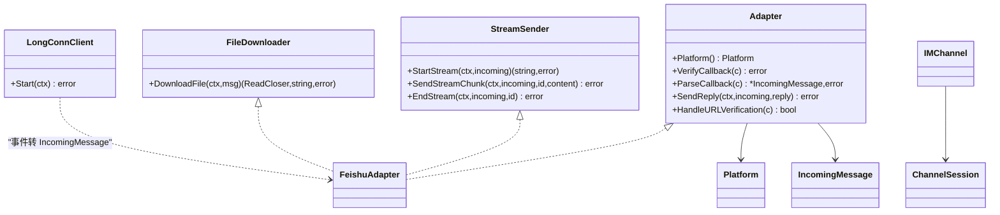

# 飞书适配器

<cite>
**本文引用的文件**
- [internal/im/feishu/adapter.go](file://internal/im/feishu/adapter.go)
- [internal/im/feishu/longconn.go](file://internal/im/feishu/longconn.go)
- [internal/im/feishu/adapter_test.go](file://internal/im/feishu/adapter_test.go)
- [internal/im/adapter.go](file://internal/im/adapter.go)
- [internal/im/types.go](file://internal/im/types.go)
- [docs/wiki/集成扩展/IM集成开发.md](file://docs/wiki/集成扩展/IM集成开发.md)
</cite>

## 目录
1. [简介](#简介)
2. [项目结构](#项目结构)
3. [核心组件](#核心组件)
4. [架构总览](#架构总览)
5. [详细组件分析](#详细组件分析)
6. [依赖分析](#依赖分析)
7. [性能考虑](#性能考虑)
8. [故障排查指南](#故障排查指南)
9. [结论](#结论)
10. [附录](#附录)

## 简介
本文件为飞书适配器的完整技术文档，覆盖以下关键主题：
- 飞书开放平台 API 集成方式与认证令牌管理
- 消息回调处理与 URL 验证挑战
- 加密事件解密与签名验证
- Webhook 与长连接两种模式的实现与选择
- 飞书特有消息类型的解析与处理（文本、富文本、图片、文件）
- 文件/图片下载与资源拉取
- 流式回复（CardKit）的卡片创建、元素更新与结束流程
- 线程会话与去重策略
- 面向开发者的集成最佳实践与排错建议

## 项目结构
飞书适配器位于内部模块中，遵循统一的 IM 适配器接口规范，并提供两种接入模式：
- Webhook 模式：通过 Gin 路由接收飞书回调，进行签名验证、解密与消息解析，再调用飞书 API 发送回复或卡片流式内容。
- 长连接模式：基于官方 SDK 的 WebSocket 客户端，自动重连并转换事件为统一消息结构。

图表来源
- [internal/im/feishu/adapter.go:1-1006](file://internal/im/feishu/adapter.go#L1-L1006)
- [internal/im/feishu/longconn.go:1-294](file://internal/im/feishu/longconn.go#L1-L294)
- [internal/im/adapter.go:1-165](file://internal/im/adapter.go#L1-L165)
- [internal/im/types.go:1-179](file://internal/im/types.go#L1-L179)
- [docs/wiki/集成扩展/IM集成开发.md:1-116](file://docs/wiki/集成扩展/IM集成开发.md#L1-L116)

章节来源
- [internal/im/feishu/adapter.go:1-1006](file://internal/im/feishu/adapter.go#L1-L1006)
- [internal/im/feishu/longconn.go:1-294](file://internal/im/feishu/longconn.go#L1-L294)
- [internal/im/adapter.go:1-165](file://internal/im/adapter.go#L1-L165)
- [internal/im/types.go:1-179](file://internal/im/types.go#L1-L179)
- [docs/wiki/集成扩展/IM集成开发.md:1-116](file://docs/wiki/集成扩展/IM集成开发.md#L1-L116)

## 核心组件
- 适配器 Adapter
  - 实现 IM 接口，负责回调验证、消息解析、普通文本回复、文件/图片下载、以及 CardKit 流式卡片的创建、更新与结束。
  - 关键职责：
    - 回调验证与 URL 验证挑战处理
    - 加密事件解密
    - 文本/富文本/图片/文件消息解析与线程 ID 计算
    - 租户访问令牌缓存与刷新
    - 流式卡片生命周期管理
- 长连接客户端 LongConnClient
  - 基于官方 SDK 的 WebSocket 客户端，自动重连，事件分发为统一 IncomingMessage。
  - 支持文本、文件、图片、富文本消息类型转换。
- 通用接口与类型
  - IM 接口定义了平台标识、消息类型、聊天类型、统一消息结构与流式接口。
  - IMChannel/ChannelSession 等类型用于通道配置与会话映射。

章节来源
- [internal/im/feishu/adapter.go:38-103](file://internal/im/feishu/adapter.go#L38-L103)
- [internal/im/feishu/longconn.go:19-48](file://internal/im/feishu/longconn.go#L19-L48)
- [internal/im/adapter.go:120-165](file://internal/im/adapter.go#L120-L165)
- [internal/im/types.go:14-179](file://internal/im/types.go#L14-L179)

## 架构总览
飞书适配器在两种模式下均遵循统一的消息生命周期：接收 → 解析 → 生成回复 → 发送。流式回复通过 CardKit 卡片实现。

图表来源
- [internal/im/feishu/adapter.go:105-147](file://internal/im/feishu/adapter.go#L105-L147)
- [internal/im/feishu/adapter.go:434-485](file://internal/im/feishu/adapter.go#L434-L485)
- [internal/im/feishu/adapter.go:636-728](file://internal/im/feishu/adapter.go#L636-L728)
- [internal/im/feishu/adapter.go:732-832](file://internal/im/feishu/adapter.go#L732-L832)

## 详细组件分析

### Webhook 模式：回调验证、URL 验证与消息解析
- 回调验证
  - 读取请求体，支持加密事件解密；校验 verificationToken。
- URL 验证挑战
  - 识别 challenge 字段并原样返回，用于首次对接验证。
- 消息解析
  - 仅处理 im.message.receive_v1 事件。
  - 支持文本、富文本、图片、文件四种消息类型。
  - 群聊中去除 @bot 前缀，计算线程 ID（优先 root_id，否则使用 message_id）。
- 线程与会话
  - IncomingMessage.ThreadID 用于区分会话上下文，结合会话模式（用户/线程）决定会话映射。

图表来源
- [internal/im/feishu/adapter.go:105-147](file://internal/im/feishu/adapter.go#L105-L147)
- [internal/im/feishu/adapter.go:149-188](file://internal/im/feishu/adapter.go#L149-L188)
- [internal/im/feishu/adapter.go:224-432](file://internal/im/feishu/adapter.go#L224-L432)

章节来源
- [internal/im/feishu/adapter.go:105-188](file://internal/im/feishu/adapter.go#L105-L188)
- [internal/im/feishu/adapter.go:224-432](file://internal/im/feishu/adapter.go#L224-L432)

### 长连接模式：WebSocket 事件分发与消息转换
- 客户端初始化
  - 使用官方 SDK 创建 WebSocket 客户端，设置自动重连与事件处理器。
- 事件分发
  - OnP2MessageReceiveV1 将飞书事件转换为统一 IncomingMessage 并交由上层处理。
- 消息转换
  - 文本、富文本、图片、文件分别解析并去除群聊 @ 前缀。
  - 群聊场景填充 ChatID 与 ChatType。

图表来源
- [internal/im/feishu/longconn.go:25-54](file://internal/im/feishu/longconn.go#L25-L54)
- [internal/im/feishu/longconn.go:83-131](file://internal/im/feishu/longconn.go#L83-L131)
- [internal/im/feishu/longconn.go:133-293](file://internal/im/feishu/longconn.go#L133-L293)

章节来源
- [internal/im/feishu/longconn.go:19-54](file://internal/im/feishu/longconn.go#L19-L54)
- [internal/im/feishu/longconn.go:83-293](file://internal/im/feishu/longconn.go#L83-L293)

### 流式回复（CardKit）：卡片创建、元素更新与结束
- 生命周期
  - StartStream：创建卡片实体，发送交互式卡片消息，记录流状态。
  - SendStreamChunk：累积内容，首块清除占位，更新卡片元素内容，维护严格递增序列号。
  - EndStream：关闭 streaming_mode，清理流状态。
- 序列号与去孤儿
  - 每个流维护自增 sequence，避免并发更新冲突。
  - 后台收割器定期清理超时未结束的流条目，防止内存泄漏。

图表来源
- [internal/im/feishu/adapter.go:636-662](file://internal/im/feishu/adapter.go#L636-L662)
- [internal/im/feishu/adapter.go:664-696](file://internal/im/feishu/adapter.go#L664-L696)
- [internal/im/feishu/adapter.go:702-728](file://internal/im/feishu/adapter.go#L702-L728)
- [internal/im/feishu/adapter.go:574-602](file://internal/im/feishu/adapter.go#L574-L602)

章节来源
- [internal/im/feishu/adapter.go:574-728](file://internal/im/feishu/adapter.go#L574-L728)

### 文件/图片下载与资源拉取
- 下载入口
  - 通过 GetMessageResource API 拉取文件或图片资源。
- 参数安全校验
  - 对 message_id 与 file_key 进行安全字符检查，防止路径穿越。
- 名称解析
  - 优先使用消息中的文件名，其次从响应头 Content-Disposition 提取，最后回退到 file_key。

图表来源
- [internal/im/feishu/adapter.go:503-559](file://internal/im/feishu/adapter.go#L503-L559)

章节来源
- [internal/im/feishu/adapter.go:503-559](file://internal/im/feishu/adapter.go#L503-L559)

### 令牌管理与加密解密
- 令牌缓存
  - 缓存 tenant_access_token，过期时间减去安全余量后写入过期时间点。
- 加密解密
  - 使用 AES-256-CBC，密钥为 encrypt_key 的 SHA-256，PKCS#7 填充校验。

图表来源
- [internal/im/feishu/adapter.go:908-959](file://internal/im/feishu/adapter.go#L908-L959)
- [internal/im/feishu/adapter.go:961-1005](file://internal/im/feishu/adapter.go#L961-L1005)

章节来源
- [internal/im/feishu/adapter.go:908-1005](file://internal/im/feishu/adapter.go#L908-L1005)

### 线程 ID 与会话模式
- 线程 ID 规则
  - 优先使用 root_id；若为空则回退到 message_id。
- 会话映射
  - 结合会话模式（用户/线程），将 (platform, user_id, chat_id, thread_id, tenant_id) 映射到会话。

章节来源
- [internal/im/feishu/adapter.go:268-272](file://internal/im/feishu/adapter.go#L268-L272)
- [internal/im/types.go:147-179](file://internal/im/types.go#L147-L179)

### 测试要点
- 线程 ID 计算正确性（带 root_id 与无 root_id 场景）
- 消息结构零值校验

章节来源
- [internal/im/feishu/adapter_test.go:5-53](file://internal/im/feishu/adapter_test.go#L5-L53)

## 依赖分析
- 适配器对通用接口的依赖
  - Adapter 接口：统一平台能力抽象。
  - StreamSender 接口：可选流式能力。
  - FileDownloader 接口：可选文件下载能力。
- 适配器对平台类型与通道配置的依赖
  - PlatformFeishu 平台标识。
  - IMChannel/ChannelSession 用于通道配置与会话映射。

图表来源
- [internal/im/adapter.go:120-165](file://internal/im/adapter.go#L120-L165)
- [internal/im/feishu/adapter.go:38-49](file://internal/im/feishu/adapter.go#L38-L49)
- [internal/im/feishu/longconn.go:19-23](file://internal/im/feishu/longconn.go#L19-L23)
- [internal/im/types.go:14-36](file://internal/im/types.go#L14-L36)

章节来源
- [internal/im/adapter.go:120-165](file://internal/im/adapter.go#L120-L165)
- [internal/im/feishu/adapter.go:38-49](file://internal/im/feishu/adapter.go#L38-L49)
- [internal/im/feishu/longconn.go:19-23](file://internal/im/feishu/longconn.go#L19-L23)
- [internal/im/types.go:14-36](file://internal/im/types.go#L14-L36)

## 性能考虑
- 令牌缓存与安全余量：减少频繁请求令牌，降低延迟与限流风险。
- 流式更新序列号：严格递增确保并发更新一致性。
- 流收割器：定期清理孤儿流，避免内存泄漏。
- 超时控制：HTTP 客户端设置合理超时，避免阻塞。
- 资源下载：按需下载，避免一次性加载大文件。

## 故障排查指南
- 回调被拒
  - 检查 verificationToken 是否配置正确，加密事件是否配置 encryptKey。
  - 确认回调 URL 在飞书后台已通过 URL 验证挑战。
- 解密失败
  - 确认 encryptKey 配置正确且与飞书后台一致。
  - 检查 encrypt 字段格式与长度。
- 无法发送卡片/流式更新
  - 校验租户访问令牌是否有效，必要时触发重新获取。
  - 检查 card_id 是否存在，元素 ID 是否为 streaming_content。
- 无法下载文件/图片
  - 校验 message_id 与 file_key 是否符合安全字符规则。
  - 确认资源类型与消息类型匹配（image/file）。
- 长连接断开
  - 检查网络与防火墙，确认自动重连是否启用。
  - 查看日志中“连接成功”提示，定位 SDK 日志级别。

章节来源
- [internal/im/feishu/adapter.go:105-147](file://internal/im/feishu/adapter.go#L105-L147)
- [internal/im/feishu/adapter.go:961-1005](file://internal/im/feishu/adapter.go#L961-L1005)
- [internal/im/feishu/adapter.go:503-559](file://internal/im/feishu/adapter.go#L503-L559)
- [internal/im/feishu/adapter.go:636-728](file://internal/im/feishu/adapter.go#L636-L728)
- [internal/im/feishu/longconn.go:50-54](file://internal/im/feishu/longconn.go#L50-L54)

## 结论
飞书适配器通过统一的 IM 接口与清晰的生命周期管理，实现了 Webhook 与长连接两种模式的无缝接入。其在消息解析、签名验证、加密解密、令牌缓存、文件下载与 CardKit 流式回复方面具备完善的工程化实现，适合在生产环境中稳定运行。开发者可依据本文档完成飞书平台的快速集成与优化。

## 附录
- 平台能力矩阵与快速接入参考
  - 参考文档：[IM集成开发:1-116](file://docs/wiki/集成扩展/IM集成开发.md#L1-L116)

章节来源
- [docs/wiki/集成扩展/IM集成开发.md:1-116](file://docs/wiki/集成扩展/IM集成开发.md#L1-L116)