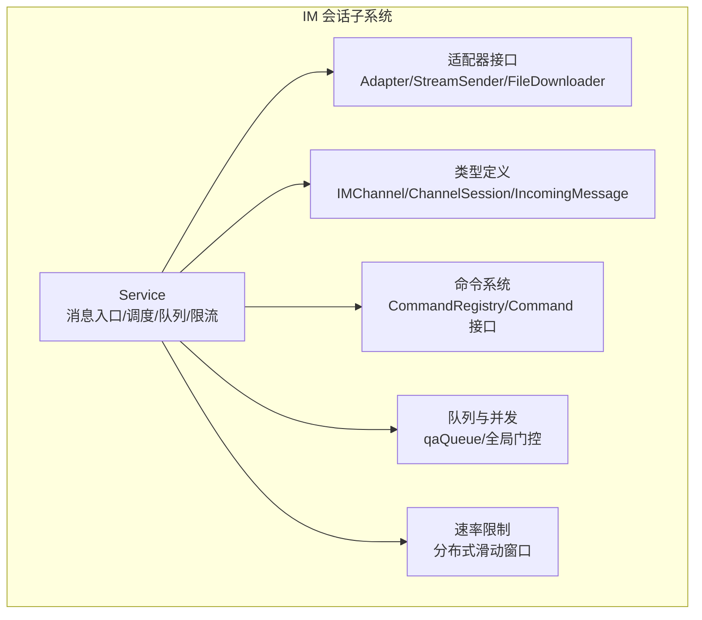
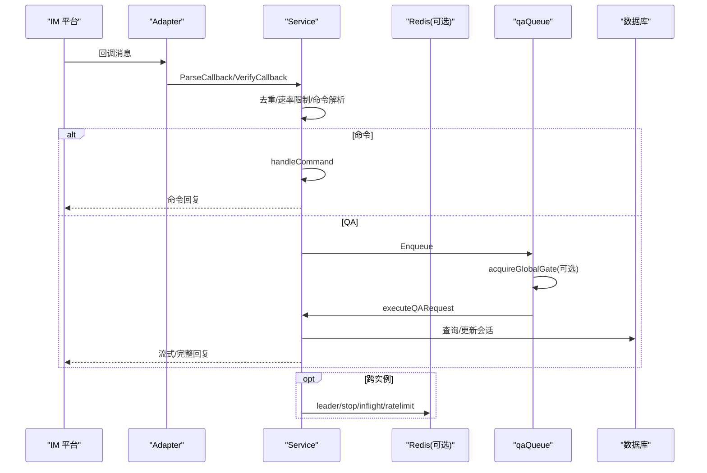
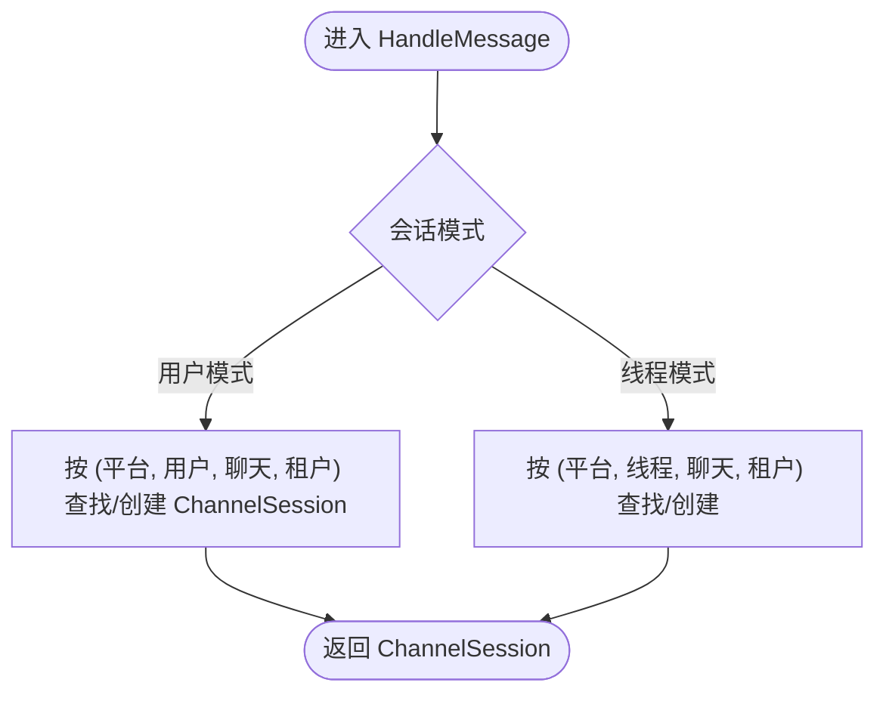
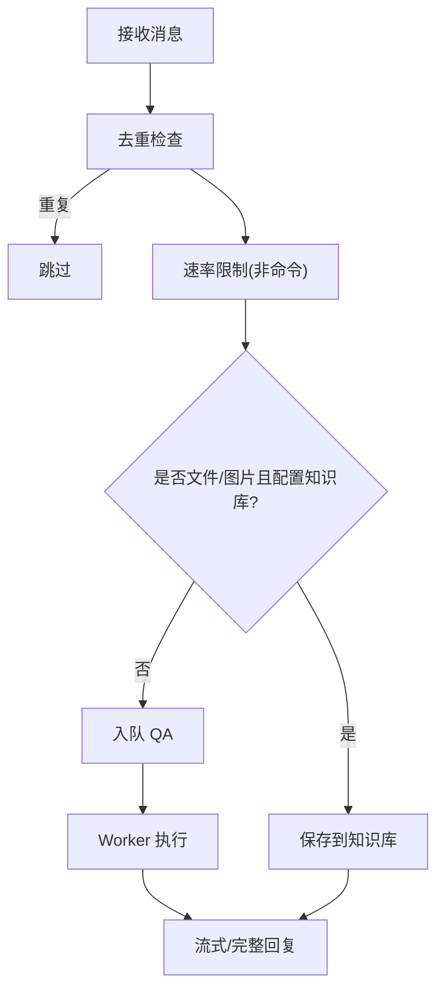
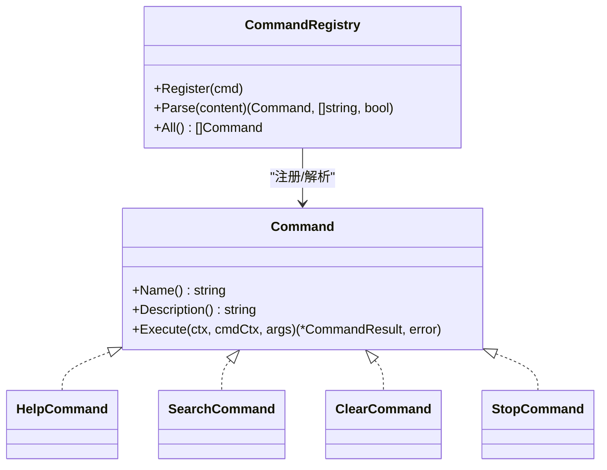
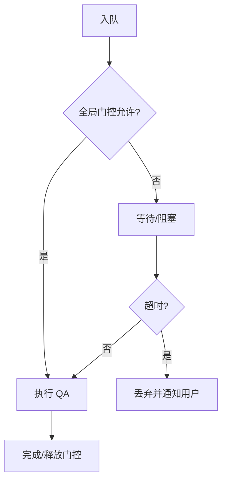
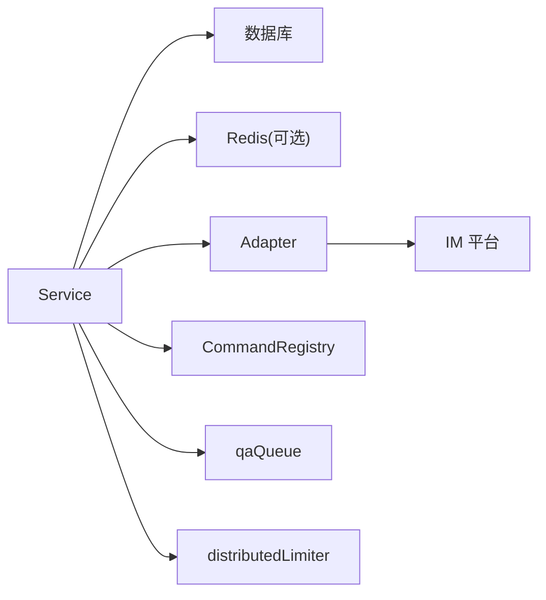

# 会话管理

<cite>
**本文档引用的文件**
- [service.go](file://internal/im/service.go)
- [types.go](file://internal/im/types.go)
- [types_test.go](file://internal/im/types_test.go)
- [adapter.go](file://internal/im/adapter.go)
- [command.go](file://internal/im/command.go)
- [command_registry.go](file://internal/im/command_registry.go)
- [cmd_help.go](file://internal/im/cmd_help.go)
- [cmd_clear.go](file://internal/im/cmd_clear.go)
- [cmd_stop.go](file://internal/im/cmd_stop.go)
- [cmd_search.go](file://internal/im/cmd_search.go)
- [qaqueue.go](file://internal/im/qaqueue.go)
- [ratelimit.go](file://internal/im/ratelimit.go)
- [tenant.go](file://internal/types/tenant.go)
</cite>

## 目录
1. [简介](#简介)
2. [项目结构](#项目结构)
3. [核心组件](#核心组件)
4. [架构总览](#架构总览)
5. [详细组件分析](#详细组件分析)
6. [依赖分析](#依赖分析)
7. [性能考量](#性能考量)
8. [故障排查指南](#故障排查指南)
9. [结论](#结论)
10. [附录](#附录)

## 简介
本文件为 WeKnora 的 IM 会话管理系统技术文档，聚焦于 IM 会话的状态管理、消息路由处理与线程管理策略，覆盖会话生命周期、用户状态跟踪、消息队列与并发控制、@ 提及能力、命令注册系统、速率限制、错误恢复、会话状态持久化、消息历史记录与会话清理、多租户隔离与权限控制、安全传输等主题。面向开发者提供最佳实践与扩展指导。

## 项目结构
IM 会话管理位于 internal/im 子系统，围绕 Service 协调适配器、通道配置、会话映射、命令系统、队列与限流、跨实例协调等模块工作。关键目录与文件职责如下：
- 服务编排与消息处理：service.go
- 类型定义与校验：types.go、adapter.go
- 命令系统：command.go、command_registry.go、各命令实现（cmd_help.go、cmd_clear.go、cmd_stop.go、cmd_search.go）
- 并发与队列：qaqueue.go
- 速率限制：ratelimit.go
- 多租户与安全：tenant.go

图表来源
- [service.go:101-163](file://internal/im/service.go#L101-L163)
- [adapter.go:120-165](file://internal/im/adapter.go#L120-L165)
- [types.go:14-36](file://internal/im/types.go#L14-L36)
- [command.go:52-67](file://internal/im/command.go#L52-L67)
- [qaqueue.go:67-214](file://internal/im/qaqueue.go#L67-L214)
- [ratelimit.go:53-104](file://internal/im/ratelimit.go#L53-L104)

章节来源
- [service.go:277-350](file://internal/im/service.go#L277-L350)
- [types.go:14-179](file://internal/im/types.go#L14-L179)
- [adapter.go:10-165](file://internal/im/adapter.go#L10-L165)
- [command.go:9-67](file://internal/im/command.go#L9-L67)
- [qaqueue.go:67-406](file://internal/im/qaqueue.go#L67-L406)
- [ratelimit.go:12-200](file://internal/im/ratelimit.go#L12-L200)

## 核心组件
- Service：统一入口，负责消息去重、速率限制、会话解析、命令分发、队列入队、流式/非流式回复、跨实例停止信号、WebSocket 领导者选举与重试、清理循环等。
- IMChannel/ChannelSession：数据库实体，承载通道配置与 IM 用户×聊天×线程到 WeKnora 会话的映射。
- Adapter/StreamSender/FileDownloader：平台适配器接口，抽象不同 IM 平台的消息收发、流式回复与文件下载。
- CommandRegistry/Command：命令注册与执行框架，支持 /help、/search、/clear、/stop 等内置命令。
- qaQueue：有界队列与固定 Worker 池，提供背压保护与全局并发门控。
- distributedLimiter：基于 Redis ZSET 的分布式滑动窗口限流，降级为本地滑动窗口。

章节来源
- [service.go:101-163](file://internal/im/service.go#L101-L163)
- [types.go:14-179](file://internal/im/types.go#L14-L179)
- [adapter.go:120-165](file://internal/im/adapter.go#L120-L165)
- [command.go:9-67](file://internal/im/command.go#L9-L67)
- [qaqueue.go:67-214](file://internal/im/qaqueue.go#L67-L214)
- [ratelimit.go:53-104](file://internal/im/ratelimit.go#L53-L104)

## 架构总览
IM 会话管理采用“适配器 + 服务 + 队列 + 限流”的解耦架构。消息从平台回调进入 Adapter，Service 统一处理后根据会话模式解析或创建 ChannelSession，再入队执行 QA 或命令处理。跨实例通过 Redis 实现领导者选举、去重、限流、停止标记与全局并发门控。

图表来源
- [service.go:784-977](file://internal/im/service.go#L784-L977)
- [service.go:979-1043](file://internal/im/service.go#L979-L1043)
- [qaqueue.go:216-263](file://internal/im/qaqueue.go#L216-L263)
- [ratelimit.go:74-104](file://internal/im/ratelimit.go#L74-L104)

## 详细组件分析

### 会话状态与生命周期
- 会话解析策略
  - 用户模式：以 (平台, 用户ID, 聊天ID, 租户ID) 解析或创建 ChannelSession。
  - 线程模式：以 (平台, 线程ID, 聊天ID, 租户ID) 解析或创建，顶级消息使用自身 ID 作为 ThreadID，形成每主题独立会话。
- 会话持久化与清理
  - ChannelSession 记录映射关系与元数据；软删除用于清空上下文并开启全新会话。
- 会话标题与标识
  - 线程模式下生成带 ThreadID 后缀的会话标题，便于追踪。

图表来源
- [service.go:1187-1323](file://internal/im/service.go#L1187-L1323)
- [types.go:147-179](file://internal/im/types.go#L147-L179)

章节来源
- [service.go:1187-1323](file://internal/im/service.go#L1187-L1323)
- [types.go:147-179](file://internal/im/types.go#L147-L179)
- [types_test.go:133-153](file://internal/im/types_test.go#L133-L153)

### 消息路由与处理管线
- 去重：优先使用 Redis SetNX 去重，失败时采用 fail-closed 策略；单实例模式使用本地 Map。
- 速率限制：对非命令消息执行 per-user 滑动窗口限流，支持按线程维度区分键。
- 文件/图片快捷路径：若通道配置了知识库且消息为文件/图片，则直接入库而不进入 QA。
- 命令分发：先于 QA 执行，支持帮助、搜索、清空、停止等。
- 队列与并发：入队后由 Worker 池执行，支持全局并发门控与超时取消。

图表来源
- [service.go:758-884](file://internal/im/service.go#L758-L884)
- [service.go:931-977](file://internal/im/service.go#L931-L977)
- [ratelimit.go:74-104](file://internal/im/ratelimit.go#L74-L104)

章节来源
- [service.go:758-884](file://internal/im/service.go#L758-L884)
- [service.go:931-977](file://internal/im/service.go#L931-L977)
- [ratelimit.go:74-104](file://internal/im/ratelimit.go#L74-L104)

### 线程管理与会话隔离
- 线程模式
  - ThreadID 缺失时回退到用户模式，避免共享会话。
  - 顶级消息使用自身 ID 作为 ThreadID，形成独立会话。
- 多租户隔离
  - 通道与会话均绑定 TenantID，确保跨实例与跨租户隔离。
- 输出模式
  - 支持流式与完整两种输出模式，适配不同平台能力。

章节来源
- [service.go:1261-1323](file://internal/im/service.go#L1261-L1323)
- [adapter.go:23-41](file://internal/im/adapter.go#L23-L41)
- [types.go:14-36](file://internal/im/types.go#L14-L36)

### 命令注册系统与内置命令
- 注册表
  - CommandRegistry 维护命令名称到处理器的映射，启动期注册内置命令。
- 命令接口
  - Command 定义 Name、Description、Execute，返回 CommandResult 与副作用 Action。
- 内置命令
  - /help：列出或展示命令详情。
  - /search：在知识库中检索并返回原文片段。
  - /clear：清空会话上下文，开启全新对话。
  - /stop：取消进行中的 QA 请求，支持跨实例。

图表来源
- [command_registry.go:1-37](file://internal/im/command_registry.go#L1-L37)
- [command.go:52-67](file://internal/im/command.go#L52-L67)
- [cmd_help.go:10-51](file://internal/im/cmd_help.go#L10-L51)
- [cmd_search.go:18-133](file://internal/im/cmd_search.go#L18-L133)
- [cmd_clear.go:5-23](file://internal/im/cmd_clear.go#L5-L23)
- [cmd_stop.go:5-22](file://internal/im/cmd_stop.go#L5-L22)

章节来源
- [command_registry.go:1-37](file://internal/im/command_registry.go#L1-L37)
- [command.go:9-67](file://internal/im/command.go#L9-L67)
- [cmd_help.go:10-51](file://internal/im/cmd_help.go#L10-L51)
- [cmd_search.go:18-133](file://internal/im/cmd_search.go#L18-L133)
- [cmd_clear.go:5-23](file://internal/im/cmd_clear.go#L5-L23)
- [cmd_stop.go:5-22](file://internal/im/cmd_stop.go#L5-L22)

### 速率限制机制
- 分布式滑动窗口
  - 使用 Redis ZSET 存储每个键的请求时间戳，Lua 脚本原子清理过期并计数，超过阈值则拒绝。
  - 失败时降级为本地滑动窗口，定期清理过期条目。
- 键空间
  - 默认 per-user 键；线程模式下附加 ThreadID 形成细粒度键，避免线程泄漏到用户模式键。

章节来源
- [ratelimit.go:25-104](file://internal/im/ratelimit.go#L25-L104)
- [service.go:840-854](file://internal/im/service.go#L840-L854)

### 消息队列与并发控制
- 有界队列与固定 Worker 池
  - 支持 per-user 限流与全局并发门控，防止下游资源耗尽。
- 全局并发门控
  - 使用 Redis INCR/Pexpire 原子计数，超过阈值阻塞直至释放。
- 超时与取消
  - 队列内等待超时自动丢弃并提示；Worker 在执行前检查上下文取消。
- 指标日志
  - 周期性输出队列深度、活跃 Worker 数、入队/处理/拒绝/超时统计。

图表来源
- [qaqueue.go:216-263](file://internal/im/qaqueue.go#L216-L263)
- [qaqueue.go:291-332](file://internal/im/qaqueue.go#L291-L332)
- [qaqueue.go:387-406](file://internal/im/qaqueue.go#L387-L406)

章节来源
- [qaqueue.go:67-214](file://internal/im/qaqueue.go#L67-L214)
- [qaqueue.go:216-263](file://internal/im/qaqueue.go#L216-L263)
- [qaqueue.go:291-332](file://internal/im/qaqueue.go#L291-L332)
- [qaqueue.go:387-406](file://internal/im/qaqueue.go#L387-L406)

### 跨实例协调与停止机制
- 领导者选举
  - WebSocket/长轮询通道通过 Redis SetNX 抢占领导者，失败实例周期性重试接管。
- 停止信号
  - /stop 写入 Redis 停止标记（预执行）与 StreamManager 停止事件（执行中），Watcher 轮询检测并取消上下文。
- 飞行映射
  - 将 userKey 映射到 (sessionID, messageID)，跨实例查找并写入停止事件。

章节来源
- [service.go:520-617](file://internal/im/service.go#L520-L617)
- [service.go:619-727](file://internal/im/service.go#L619-L727)
- [service.go:1090-1145](file://internal/im/service.go#L1090-L1145)

### 会话状态持久化与消息历史
- ChannelSession 持久化
  - 记录平台、用户、聊天、线程、租户、代理、通道与状态等字段。
- 清理策略
  - /clear 软删除当前 ChannelSession 并清空会话上下文，后续消息触发全新会话。
- 历史记录
  - 通过 WeKnora 会话服务读取历史消息与上下文，支持引用格式化与长度截断。

章节来源
- [types.go:147-179](file://internal/im/types.go#L147-L179)
- [service.go:1090-1102](file://internal/im/service.go#L1090-L1102)
- [service.go:184-215](file://internal/im/service.go#L184-L215)

### 多租户支持与安全传输
- 多租户隔离
  - 通道与会话均绑定 TenantID，命令上下文注入租户信息，确保资源访问边界。
- 安全存储
  - 租户 API Key 在保存前加密、加载后解密，避免明文泄露。
- 传输安全
  - Adapter 支持回调签名验证与 URL 验证处理，保障接入安全。

章节来源
- [tenant.go:141-161](file://internal/types/tenant.go#L141-L161)
- [adapter.go:125-139](file://internal/im/adapter.go#L125-L139)
- [service.go:886-893](file://internal/im/service.go#L886-L893)

## 依赖分析
- Service 依赖
  - 适配器工厂与运行时状态（channels、adapterFactories）
  - 会话/消息/租户/代理/知识库/模型/流管理服务
  - Redis 客户端（可选，启用分布式特性）
- 关键耦合点
  - 通道配置（IMChannel）决定会话模式与输出模式
  - ChannelSession 作为 IM 与 WeKnora 会话的桥梁
  - CommandRegistry 与 Command 实现解耦命令逻辑
  - qaQueue 与 distributedLimiter 提供背压与限流

图表来源
- [service.go:107-163](file://internal/im/service.go#L107-L163)
- [adapter.go:120-165](file://internal/im/adapter.go#L120-L165)
- [command_registry.go:1-37](file://internal/im/command_registry.go#L1-L37)
- [qaqueue.go:67-214](file://internal/im/qaqueue.go#L67-L214)
- [ratelimit.go:53-104](file://internal/im/ratelimit.go#L53-L104)

章节来源
- [service.go:107-163](file://internal/im/service.go#L107-L163)
- [adapter.go:120-165](file://internal/im/adapter.go#L120-L165)
- [command_registry.go:1-37](file://internal/im/command_registry.go#L1-L37)
- [qaqueue.go:67-214](file://internal/im/qaqueue.go#L67-L214)
- [ratelimit.go:53-104](file://internal/im/ratelimit.go#L53-L104)

## 性能考量
- 背压与限流
  - 队列容量与 per-user 限制避免下游过载；全局门控限制并发，防止资源争用。
- 流式输出
  - 适配器支持流式回复，结合 flush 间隔降低平台限速风险并提升感知延迟。
- 去重与清理
  - Redis 去重避免重复计算；本地清理循环减少内存占用。
- 降级策略
  - Redis 不可用时，速率限制与去重自动降级为本地实现，保证服务连续性。

## 故障排查指南
- 常见问题定位
  - 重复消息：检查 Redis 去重键是否存在；单实例模式确认本地 Map 是否清理。
  - 被限流：核对速率限制键（含线程维度）、窗口与最大请求数；观察清理循环是否正常。
  - 队列积压：查看队列指标与 Worker 活跃数；检查全局门控是否阻塞。
  - /stop 无效：确认 Redis 停止标记与 StreamManager 写入；检查飞行映射是否正确。
- 日志与可观测性
  - 服务层记录去重、限流、队列、超时、停止等事件；周期性输出队列指标日志。

章节来源
- [service.go:370-388](file://internal/im/service.go#L370-L388)
- [service.go:948-958](file://internal/im/service.go#L948-L958)
- [service.go:1003-1006](file://internal/im/service.go#L1003-L1006)
- [qaqueue.go:387-406](file://internal/im/qaqueue.go#L387-L406)

## 结论
WeKnora 的 IM 会话管理通过清晰的模块划分与跨实例协调机制，实现了高可用、可扩展、可治理的会话处理能力。其核心优势包括：
- 会话模式灵活（用户/线程），天然支持多主题对话与多租户隔离
- 命令系统解耦、易于扩展
- 队列与限流提供稳定背压与并发控制
- 分布式 Redis 能力保障跨实例一致性与可靠性
- 安全与持久化策略完善，满足生产环境要求

## 附录
- 最佳实践
  - 启用 Redis 以获得完整的分布式能力（去重、限流、领导者选举、停止信号）
  - 合理配置队列大小、每用户上限与全局并发上限
  - 为文件/图片消息配置知识库，避免进入 QA 管道造成资源浪费
  - 使用线程模式时确保平台支持 ThreadID，避免回退到用户模式导致会话混淆
- 扩展指导
  - 新增平台适配器：实现 Adapter/StreamSender/FileDownloader 接口并通过工厂注册
  - 新增命令：实现 Command 接口并在启动时注册到 CommandRegistry
  - 自定义限流策略：替换 distributedLimiter 或扩展键空间维度