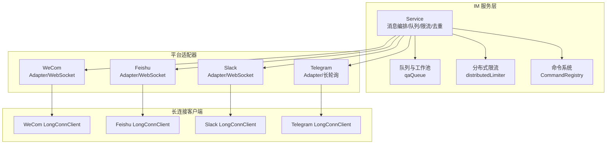
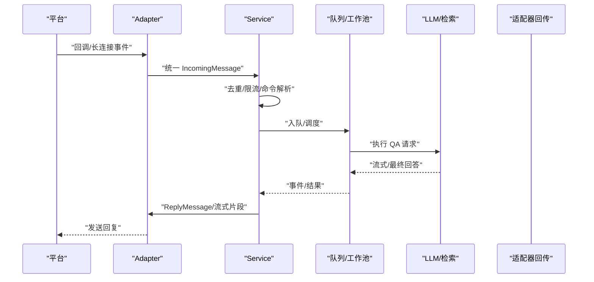
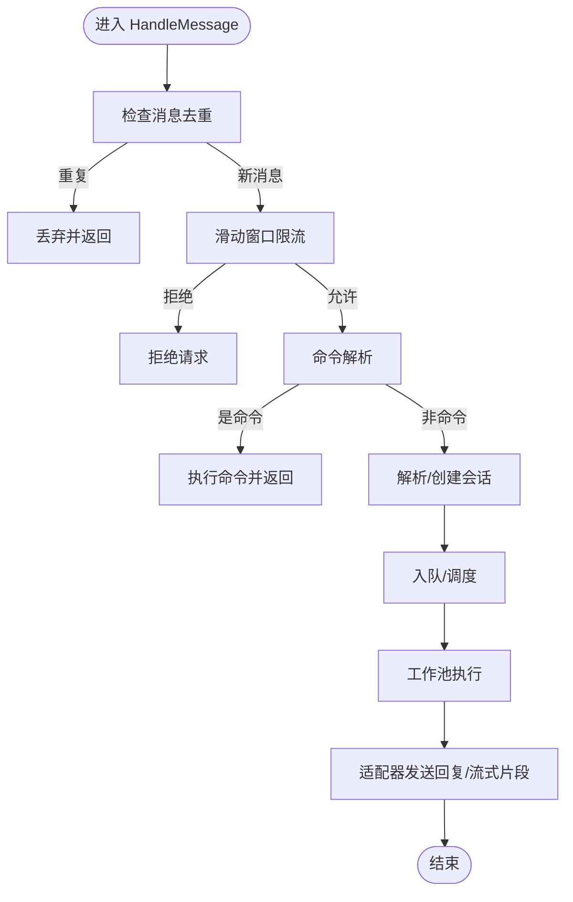
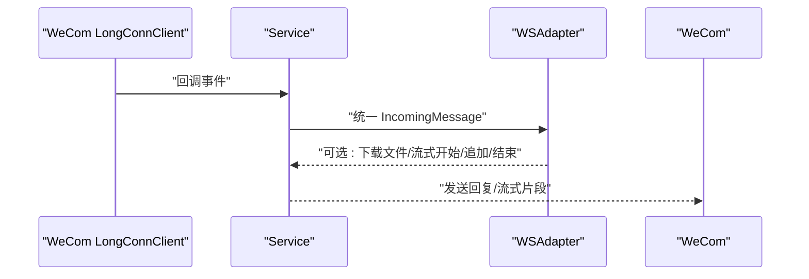
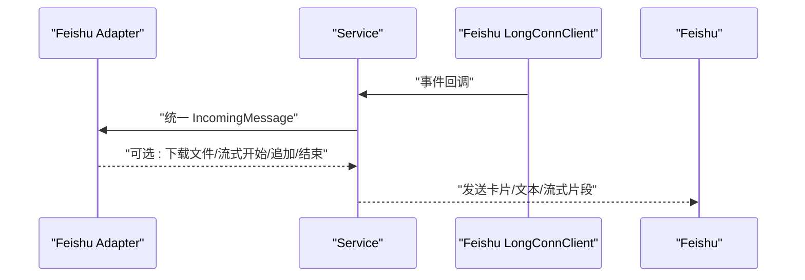
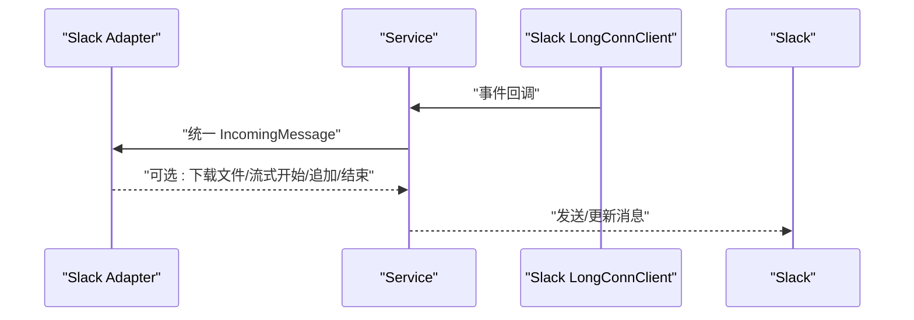
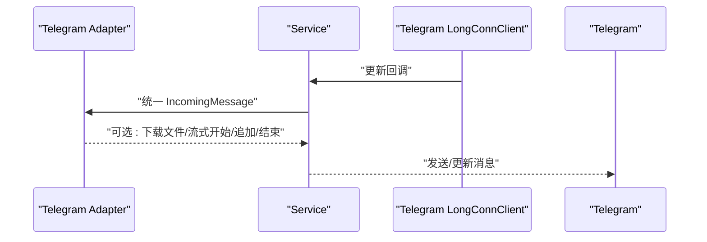
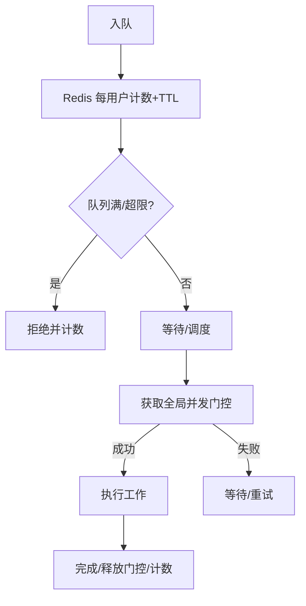
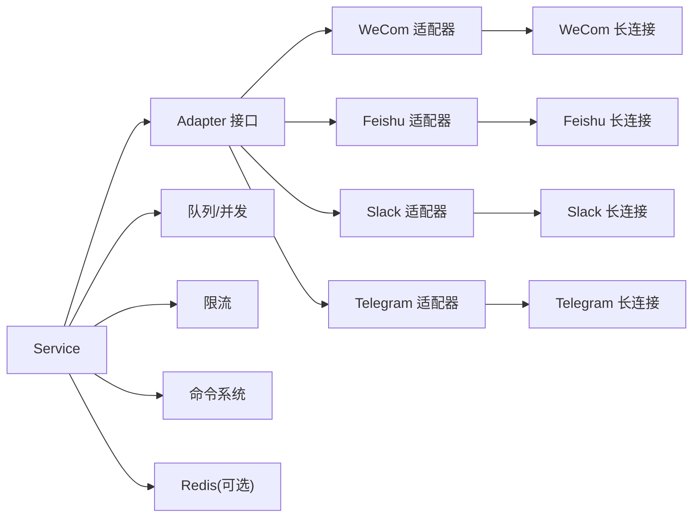

# 即时通讯集成

<cite>
**本文引用的文件**
- [adapter.go](file://internal/im/adapter.go)
- [service.go](file://internal/im/service.go)
- [types.go](file://internal/im/types.go)
- [wecom/adapter.go](file://internal/im/wecom/adapter.go)
- [wecom/ws_adapter.go](file://internal/im/wecom/ws_adapter.go)
- [wecom/longconn.go](file://internal/im/wecom/longconn.go)
- [feishu/adapter.go](file://internal/im/feishu/adapter.go)
- [feishu/longconn.go](file://internal/im/feishu/longconn.go)
- [slack/adapter.go](file://internal/im/slack/adapter.go)
- [slack/longconn.go](file://internal/im/slack/longconn.go)
- [telegram/adapter.go](file://internal/im/telegram/adapter.go)
- [telegram/longconn.go](file://internal/im/telegram/longconn.go)
- [qaqueue.go](file://internal/im/qaqueue.go)
- [ratelimit.go](file://internal/im/ratelimit.go)
- [command.go](file://internal/im/command.go)
</cite>

## 目录
1. [简介](#简介)
2. [项目结构](#项目结构)
3. [核心组件](#核心组件)
4. [架构总览](#架构总览)
5. [详细组件分析](#详细组件分析)
6. [依赖关系分析](#依赖关系分析)
7. [性能考量](#性能考量)
8. [故障排查指南](#故障排查指南)
9. [结论](#结论)
10. [附录](#附录)

## 简介
本技术文档面向开发者，系统性阐述 WeKnora 即时通讯（IM）集成系统的整体设计与实现，覆盖平台适配器架构、WeCom、Feishu、Slack、Telegram 的具体实现细节，以及会话管理、消息路由、线程管理与 @ 提及处理、长连接维护、消息队列与并发控制、分布式限流与去重、跨实例停止信号、命令系统、多租户与权限控制、消息安全传输等主题。文档同时提供 IM 适配器开发指南、平台集成最佳实践与性能优化策略。

## 项目结构
IM 子系统位于 internal/im 目录，采用“统一接口 + 平台适配器 + 长连接客户端”的分层设计：
- 统一接口与数据模型：定义平台枚举、消息类型、统一入站/出站消息结构、通道配置与会话映射等。
- 服务编排：IM Service 负责通道生命周期、消息去重、速率限制、队列调度、命令解析、跨实例停止检测、流式输出与文件下载等。
- 平台适配器：各 IM 平台实现 Adapter 接口；部分平台提供长连接客户端以支持 WebSocket/Socket Mode/长轮询。
- 并发与队列：基于 Redis 的全局并发门控、每用户排队计数、滑动窗口限流、队列深度与工作池。
- 命令系统：统一的斜杠命令注册与执行框架，支持清会话、停止生成、查询知识库等。

图表来源
- [service.go:101-164](file://internal/im/service.go#L101-L164)
- [adapter.go:120-165](file://internal/im/adapter.go#L120-L165)
- [wecom/ws_adapter.go:24-35](file://internal/im/wecom/ws_adapter.go#L24-L35)
- [feishu/adapter.go:38-60](file://internal/im/feishu/adapter.go#L38-L60)
- [slack/adapter.go:28-42](file://internal/im/slack/adapter.go#L28-L42)
- [telegram/adapter.go:29-52](file://internal/im/telegram/adapter.go#L29-L52)

章节来源
- [adapter.go:10-165](file://internal/im/adapter.go#L10-L165)
- [service.go:101-164](file://internal/im/service.go#L101-L164)

## 核心组件
- 统一接口与消息模型
  - 平台标识、会话模式、消息类型、聊天类型、统一入站消息与出站消息结构。
  - 支持流式回复接口与文件下载接口，便于不同平台差异化实现。
- 通道与会话
  - IMChannel：存储通道配置（平台、模式、输出模式、会话模式、凭证、绑定代理等）。
  - ChannelSession：将 IM 用户×聊天组合映射到 WeKnora 会话，支撑多轮对话与线程隔离。
- 服务编排 Service
  - 负责通道启动/停止、消息去重、速率限制、队列调度、命令解析、跨实例停止检测、流式输出与文件下载。
  - 多实例模式下通过 Redis 实现领导者选举、全局并发门控、去重键、停止标记等。
- 队列与并发控制
  - 有界队列 + 每用户限流 + 工作池，支持全局并发门控与超时丢弃。
- 分布式限流
  - 基于 Redis ZSET 的滑动窗口限流，失败时回退本地滑窗。
- 命令系统
  - 统一的斜杠命令注册与执行框架，支持清会话、停止生成、查询知识库等。

章节来源
- [adapter.go:10-165](file://internal/im/adapter.go#L10-L165)
- [types.go:14-179](file://internal/im/types.go#L14-L179)
- [service.go:101-164](file://internal/im/service.go#L101-L164)
- [qaqueue.go:67-114](file://internal/im/qaqueue.go#L67-L114)
- [ratelimit.go:53-104](file://internal/im/ratelimit.go#L53-L104)
- [command.go:9-67](file://internal/im/command.go#L9-L67)

## 架构总览
IM 服务的整体处理链路如下：
- 适配器接收平台回调或长连接事件，解析为统一 IncomingMessage。
- Service 执行去重、速率限制、命令解析、会话映射与队列调度。
- 队列工作池执行 QA 流水线，按需写入流式事件或最终结果。
- 适配器将 ReplyMessage 或流式片段发送至平台。

图表来源
- [service.go:784-800](file://internal/im/service.go#L784-L800)
- [qaqueue.go:216-263](file://internal/im/qaqueue.go#L216-L263)
- [adapter.go:120-165](file://internal/im/adapter.go#L120-L165)

## 详细组件分析

### 统一接口与消息模型
- 平台枚举：支持 WeCom、Feishu、Slack、Telegram、DingTalk、Mattermost、WeChat。
- 会话模式：user（按用户×聊天×租户）与 thread（按线程×聊天×租户）两种。
- 消息类型：text、file、image。
- 统一入站消息：包含平台、消息类型、用户/聊天标识、内容、消息ID、线程ID、引用消息、额外字段等。
- 统一出站消息：文本内容、是否流式、是否最终块、平台扩展字段。
- 可选接口：
  - StreamSender：开始/追加/结束流式回复。
  - FileDownloader：从平台下载文件资源。

章节来源
- [adapter.go:10-165](file://internal/im/adapter.go#L10-L165)

### 通道与会话映射
- IMChannel：通道配置，含平台、模式、输出模式、会话模式、凭证、绑定代理、知识库ID、机器人身份等。
- ChannelSession：将 IM 用户×聊天×线程映射到 WeKnora 会话，支持状态与元数据。
- 机器人身份：根据平台与凭证派生唯一标识，用于避免重复部署与冲突。

章节来源
- [types.go:14-179](file://internal/im/types.go#L14-L179)

### 服务编排与消息处理
- 通道生命周期：加载启用通道、工厂函数创建适配器、WebSocket 领导者选举、停止与清理。
- 去重：单实例使用内存 Map，多实例使用 Redis SetNX + TTL。
- 速率限制：Redis ZSET 滑动窗口 + 本地回退。
- 命令解析：/help、/info、/search、/stop、/clear 等。
- 跨实例停止：通过 StreamManager 事件与 Redis 停止标记实现。
- 流式输出：按 flush 间隔批量推送，避免平台限流。
- 文件下载：当通道配置了知识库ID时，对文件消息进行下载并保存。

图表来源
- [service.go:784-800](file://internal/im/service.go#L784-L800)
- [service.go:217-241](file://internal/im/service.go#L217-L241)
- [service.go:359-388](file://internal/im/service.go#L359-L388)
- [service.go:619-727](file://internal/im/service.go#L619-L727)

章节来源
- [service.go:784-800](file://internal/im/service.go#L784-L800)
- [service.go:217-241](file://internal/im/service.go#L217-L241)
- [service.go:359-388](file://internal/im/service.go#L359-L388)
- [service.go:619-727](file://internal/im/service.go#L619-L727)

### WeCom 适配器与长连接
- 适配器（WebSocket 模式）
  - 通过 WeCom LongConnClient 接收消息事件，转换为统一 IncomingMessage。
  - 支持流式回复与文件下载（加密 URL + AES 解密）。
- 长连接客户端
  - WebSocket 连接、鉴权、心跳、自动重连、帧解析与回调处理。
  - @ 提及处理：支持双空格分隔、缓存机器人名称、启发式识别。
  - 引用消息：解析 quoted/replied 消息，构建 QuotedMessage 上下文。
  - 加密文件下载：按消息级 AES Key 解密后返回。

图表来源
- [wecom/ws_adapter.go:24-69](file://internal/im/wecom/ws_adapter.go#L24-L69)
- [wecom/longconn.go:487-631](file://internal/im/wecom/longconn.go#L487-L631)

章节来源
- [wecom/ws_adapter.go:24-118](file://internal/im/wecom/ws_adapter.go#L24-L118)
- [wecom/longconn.go:123-781](file://internal/im/wecom/longconn.go#L123-L781)

### Feishu 适配器与长连接
- 适配器（Webhook/Events API）
  - 回调签名验证、事件解密、消息解析、@ 提及剥离、引用消息格式化。
  - 文本/富文本/图片/文件消息解析，统一为 IncomingMessage。
  - 发送文本回复与卡片流式更新（CardKit）。
  - 文件下载：GetMessageResource API，SSRF 路径参数校验。
- 长连接客户端
  - 使用官方 SDK WebSocket，自动重连，事件分发到统一消息结构。

图表来源
- [feishu/adapter.go:224-432](file://internal/im/feishu/adapter.go#L224-L432)
- [feishu/adapter.go:636-728](file://internal/im/feishu/adapter.go#L636-L728)
- [feishu/longconn.go:83-294](file://internal/im/feishu/longconn.go#L83-L294)

章节来源
- [feishu/adapter.go:100-559](file://internal/im/feishu/adapter.go#L100-L559)
- [feishu/longconn.go:19-294](file://internal/im/feishu/longconn.go#L19-L294)

### Slack 适配器与长连接
- 适配器（Events API + Socket Mode）
  - 回调签名验证、事件解析、@ 提及剥离、线程 ID 处理、文件消息解析。
  - 发送普通文本与流式更新（编辑消息），带最小编辑间隔节流。
- 长连接客户端
  - Socket Mode 自动重连，事件分发到统一消息结构。

图表来源
- [slack/adapter.go:125-171](file://internal/im/slack/adapter.go#L125-L171)
- [slack/adapter.go:227-307](file://internal/im/slack/adapter.go#L227-L307)
- [slack/longconn.go:91-149](file://internal/im/slack/longconn.go#L91-L149)

章节来源
- [slack/adapter.go:28-339](file://internal/im/slack/adapter.go#L28-L339)
- [slack/longconn.go:18-149](file://internal/im/slack/longconn.go#L18-L149)

### Telegram 适配器与长轮询
- 适配器（Webhook/长轮询）
  - Webhook 签名验证（可选）、更新解析、@ 提及剥离、线程话题支持。
  - 发送文本与流式更新（编辑消息），带最小编辑间隔节流。
  - 文件下载：getFile + 直接下载。
- 长轮询客户端
  - 基于 getUpdates 的长轮询循环，自动偏移与错误退避。

图表来源
- [telegram/adapter.go:115-204](file://internal/im/telegram/adapter.go#L115-L204)
- [telegram/adapter.go:359-446](file://internal/im/telegram/adapter.go#L359-L446)
- [telegram/longconn.go:35-117](file://internal/im/telegram/longconn.go#L35-L117)

章节来源
- [telegram/adapter.go:29-486](file://internal/im/telegram/adapter.go#L29-L486)
- [telegram/longconn.go:18-117](file://internal/im/telegram/longconn.go#L18-L117)

### 消息队列与并发控制
- 有界队列：最大队列长度、每用户最大排队数、工作池大小。
- 全局并发门控：Redis INCR/PEXPIRE + Lua 脚本，支持跨实例限流。
- 每用户排队计数：Redis 计数器 + TTL，防止单用户拥塞。
- 超时丢弃：队列等待超时自动取消并提示用户重试。
- 指标日志：周期性记录队列深度、活跃工作线程、入队/处理/拒绝/超时计数。

图表来源
- [qaqueue.go:132-175](file://internal/im/qaqueue.go#L132-L175)
- [qaqueue.go:216-263](file://internal/im/qaqueue.go#L216-L263)
- [qaqueue.go:290-341](file://internal/im/qaqueue.go#L290-L341)
- [qaqueue.go:351-381](file://internal/im/qaqueue.go#L351-L381)

章节来源
- [qaqueue.go:67-114](file://internal/im/qaqueue.go#L67-L114)
- [qaqueue.go:132-175](file://internal/im/qaqueue.go#L132-L175)
- [qaqueue.go:216-263](file://internal/im/qaqueue.go#L216-L263)
- [qaqueue.go:290-341](file://internal/im/qaqueue.go#L290-L341)
- [qaqueue.go:351-381](file://internal/im/qaqueue.go#L351-L381)

### 速率限制与去重
- 速率限制：Redis ZSET + Lua 脚本实现滑动窗口，失败回退本地滑窗。
- 去重：Redis SetNX + TTL；单实例使用内存 Map，失败关闭避免重复处理。

章节来源
- [ratelimit.go:25-104](file://internal/im/ratelimit.go#L25-L104)
- [service.go:758-782](file://internal/im/service.go#L758-L782)

### 命令系统
- Command 接口：名称、描述、执行。
- CommandContext：携带触发消息、会话、租户、代理、通道输出模式等。
- CommandAction：清会话、停止生成等副作用动作。
- 内置命令：/help、/info、/search、/stop、/clear。

章节来源
- [command.go:9-67](file://internal/im/command.go#L9-L67)
- [service.go:297-304](file://internal/im/service.go#L297-L304)

## 依赖关系分析
- 适配器依赖统一接口，按平台实现回调解析、签名验证、消息发送与可选流式/文件下载。
- Service 依赖队列、限流、命令系统、通道配置与会话映射，协调平台适配器。
- 长连接客户端封装平台 SDK 或自研协议，向上提供统一消息回调。
- Redis 在多实例模式下承担领导者选举、去重、限流、全局并发门控、停止标记等职责。

图表来源
- [adapter.go:120-165](file://internal/im/adapter.go#L120-L165)
- [service.go:101-164](file://internal/im/service.go#L101-L164)
- [wecom/ws_adapter.go:24-35](file://internal/im/wecom/ws_adapter.go#L24-L35)
- [feishu/adapter.go:38-60](file://internal/im/feishu/adapter.go#L38-L60)
- [slack/adapter.go:28-42](file://internal/im/slack/adapter.go#L28-L42)
- [telegram/adapter.go:29-52](file://internal/im/telegram/adapter.go#L29-L52)

章节来源
- [adapter.go:120-165](file://internal/im/adapter.go#L120-L165)
- [service.go:101-164](file://internal/im/service.go#L101-L164)

## 性能考量
- 流式输出：按固定间隔批量推送，平衡平台限流与感知延迟。
- 队列背压：有界队列 + 每用户限流 + 全局并发门控，避免下游过载。
- 限流策略：Redis 滑动窗口优先，失败回退本地滑窗，保证可用性。
- 长连接健壮性：自动重连、心跳保活、断线恢复、流式缓冲存活。
- 文件下载：平台直链 + 可选解密，减少中间层开销；Telegram/Slack 提供下载 URL 时优先使用。
- 日志与指标：周期性队列指标日志，便于容量规划与异常定位。

## 故障排查指南
- 通道无法启动
  - 检查平台凭证与通道配置；确认工厂函数注册与适配器创建成功。
  - 多实例模式下检查 Redis 是否可用，领导者选举是否成功。
- 消息重复
  - 检查 Redis 去重键是否生效；单实例模式下确认内存去重 Map。
- 速率受限
  - 查看 Redis 滑窗计数与本地滑窗清理；调整窗口与阈值。
- 队列积压
  - 观察队列深度与处理计数；必要时增加工作池或队列上限。
- 流式更新异常
  - 检查平台流式 API 调用频率限制与最小编辑间隔；关注流式回收器运行状态。
- 文件下载失败
  - 校验平台直链有效性与解密密钥；注意 Telegram/Slack 的下载 URL 生命周期。
- 跨实例停止无效
  - 确认 StreamManager 可用与 Redis 停止标记键；检查 /stop 命令执行路径。

章节来源
- [service.go:412-451](file://internal/im/service.go#L412-L451)
- [service.go:520-617](file://internal/im/service.go#L520-L617)
- [service.go:619-727](file://internal/im/service.go#L619-L727)
- [qaqueue.go:387-407](file://internal/im/qaqueue.go#L387-L407)

## 结论
WeKnora 的 IM 集成系统以统一接口为核心，结合平台适配器与长连接客户端，实现了多平台一致的消息处理体验。通过队列与并发控制、分布式限流与去重、跨实例停止检测与流式输出等机制，在保障高可用与低延迟的同时，提供了良好的扩展性与可观测性。开发者可据此快速接入新平台并实现定制化能力。

## 附录

### IM 适配器开发指南
- 实现 Adapter 接口：平台标识、回调签名验证、回调解析、回复发送、URL 验证处理。
- 可选实现：StreamSender（开始/追加/结束流式）、FileDownloader（下载文件）。
- 长连接模式：提供 LongConnClient，封装平台 SDK 或自研协议，向上抛出统一 IncomingMessage。
- 注意事项：@ 提及剥离、线程 ID 映射、引用消息格式化、加密文件解密、SSRF 校验、最小编辑间隔、流式回收器。

章节来源
- [adapter.go:120-165](file://internal/im/adapter.go#L120-L165)
- [wecom/longconn.go:123-781](file://internal/im/wecom/longconn.go#L123-L781)
- [feishu/longconn.go:19-294](file://internal/im/feishu/longconn.go#L19-L294)
- [slack/longconn.go:18-149](file://internal/im/slack/longconn.go#L18-L149)
- [telegram/longconn.go:18-117](file://internal/im/telegram/longconn.go#L18-L117)

### 平台集成最佳实践
- 选择合适模式：Webhook 适合高吞吐、低延迟；Socket Mode/长连接适合实时交互与复杂事件。
- 合理配置会话模式：thread 模式适用于论坛/话题场景；user 模式适用于一对一或群聊主会话。
- 严格限流与去重：生产环境务必启用 Redis，确保跨实例一致性。
- 流式体验：遵循平台最小编辑间隔，合理设置 flush 间隔，提升感知速度。
- 文件处理：优先使用平台直链与解密能力，避免中间层存储；注意生命周期与权限。

### 多租户、权限与安全
- 多租户：通道配置包含租户 ID，会话映射与机器人身份均按租户隔离。
- 权限控制：平台凭证按通道绑定，避免越权访问；Webhook/Events API 签名验证。
- 安全传输：回调签名验证、事件解密、SSRF 校验、最小权限的下载 URL 获取。