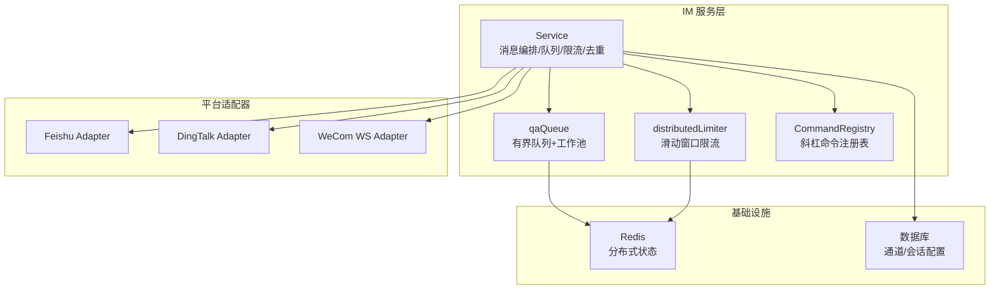
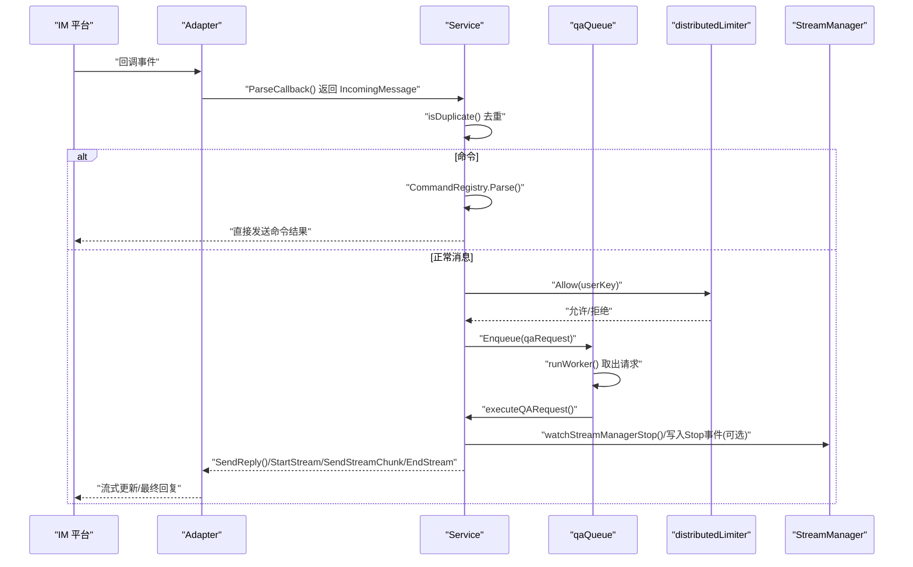
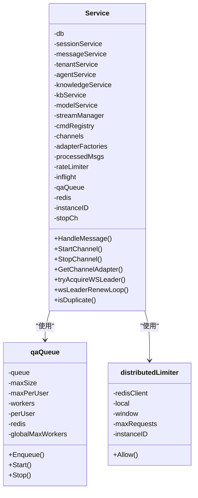
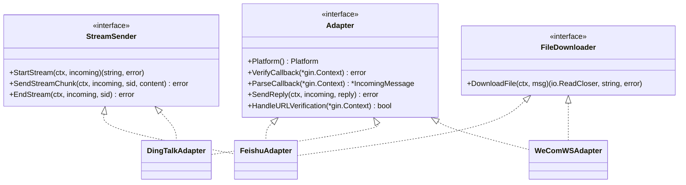
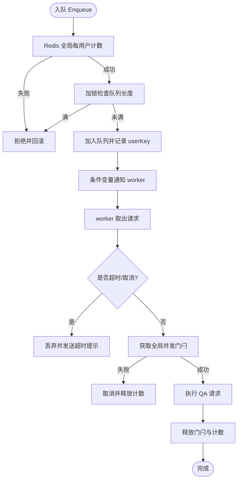
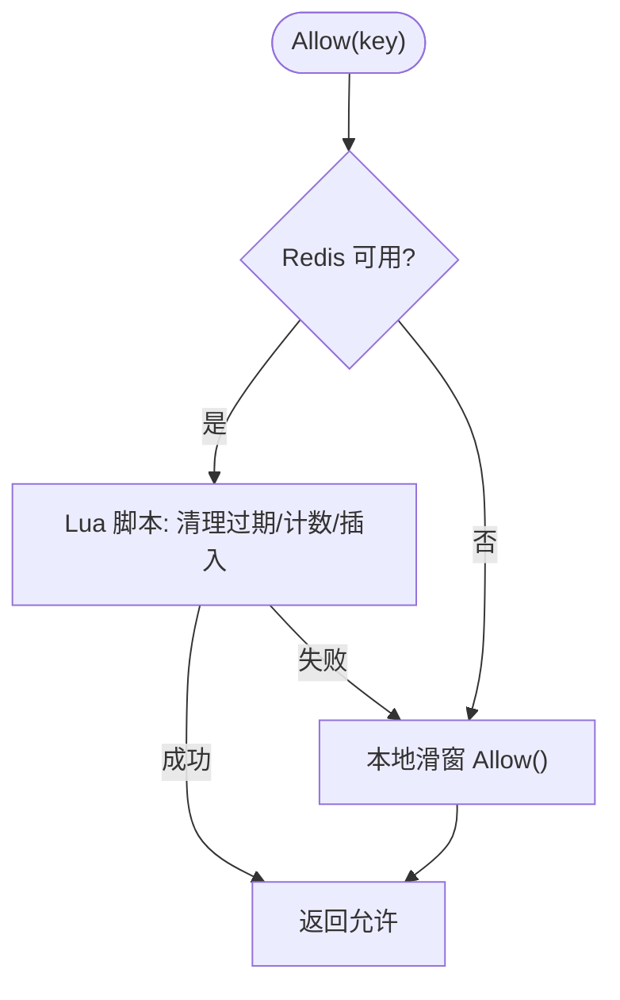
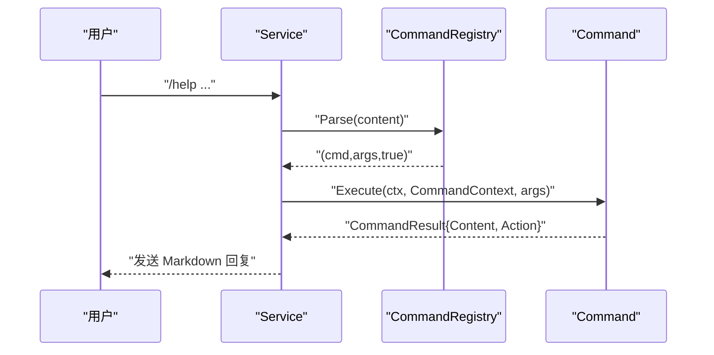
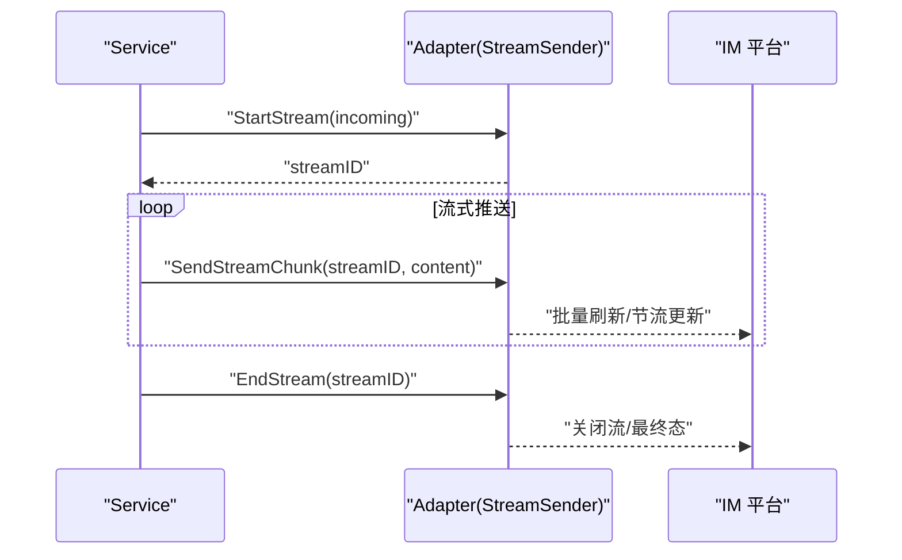
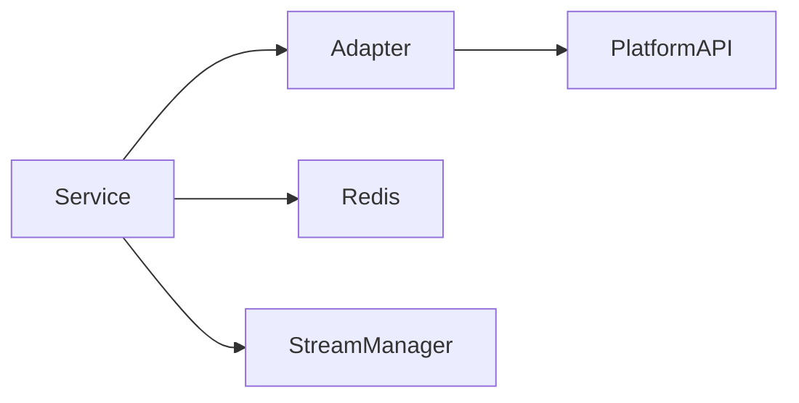

# 消息处理机制

<cite>
**本文档引用的文件**
- [service.go](file://internal/im/service.go)
- [types.go](file://internal/im/types.go)
- [adapter.go](file://internal/im/adapter.go)
- [qaqueue.go](file://internal/im/qaqueue.go)
- [ratelimit.go](file://internal/im/ratelimit.go)
- [command.go](file://internal/im/command.go)
- [command_registry.go](file://internal/im/command_registry.go)
- [session_test.go](file://internal/im/session_test.go)
- [stream_test.go](file://internal/im/stream_test.go)
- [dingtalk/adapter.go](file://internal/im/dingtalk/adapter.go)
- [feishu/adapter.go](file://internal/im/feishu/adapter.go)
- [wecom/ws_adapter.go](file://internal/im/wecom/ws_adapter.go)
</cite>

## 目录
1. [简介](#简介)
2. [项目结构](#项目结构)
3. [核心组件](#核心组件)
4. [架构总览](#架构总览)
5. [详细组件分析](#详细组件分析)
6. [依赖分析](#依赖分析)
7. [性能考虑](#性能考虑)
8. [故障排查指南](#故障排查指南)
9. [结论](#结论)
10. [附录](#附录)

## 简介
本文件面向开发者，系统化阐述 WeKnora 的 IM（即时通讯）消息处理机制，覆盖消息接收、解析、路由与响应全流程；解释消息队列管理、并发控制、流式响应与实时通信实现；给出消息格式标准化、内容过滤、安全校验与性能优化策略；并提供消息缓存、重试与错误处理方案，以及去重、顺序保证与可靠性传输机制的设计要点。

## 项目结构
IM 子系统围绕统一的消息抽象与平台适配器接口构建，服务层负责通道生命周期、命令解析、速率限制、队列调度与跨实例协调，各平台适配器实现具体协议对接与流式推送。

图表来源
- [service.go:101-163](file://internal/im/service.go#L101-L163)
- [qaqueue.go:67-96](file://internal/im/qaqueue.go#L67-L96)
- [ratelimit.go:53-71](file://internal/im/ratelimit.go#L53-L71)
- [command_registry.go:5-23](file://internal/im/command_registry.go#L5-L23)
- [feishu/adapter.go:38-60](file://internal/im/feishu/adapter.go#L38-L60)
- [dingtalk/adapter.go:40-72](file://internal/im/dingtalk/adapter.go#L40-L72)
- [wecom/ws_adapter.go:24-35](file://internal/im/wecom/ws_adapter.go#L24-L35)

章节来源
- [service.go:101-163](file://internal/im/service.go#L101-L163)
- [adapter.go:120-165](file://internal/im/adapter.go#L120-L165)

## 核心组件
- 统一消息模型：IncomingMessage/ReplyMessage 抽象不同平台的消息类型、线程与引用信息，支持文本、文件、图片等。
- 适配器接口：Adapter/StreamSender/FileDownloader 定义平台无关的回调验证、消息解析与回复/流式/文件下载能力。
- 服务编排：Service 负责通道启动/停止、去重、速率限制、命令分发、队列执行与跨实例协调。
- 队列与并发：qaQueue 提供有界队列、每用户限流、全局并发门闩与工作池。
- 限流：distributedLimiter 支持 Redis ZSET 滑动窗口与本地降级。
- 命令系统：CommandRegistry 注册斜杠命令，Command 接口解耦业务动作与服务层。

章节来源
- [adapter.go:42-165](file://internal/im/adapter.go#L42-L165)
- [types.go:14-179](file://internal/im/types.go#L14-L179)
- [service.go:101-163](file://internal/im/service.go#L101-L163)
- [qaqueue.go:67-96](file://internal/im/qaqueue.go#L67-L96)
- [ratelimit.go:53-71](file://internal/im/ratelimit.go#L53-L71)
- [command.go:9-66](file://internal/im/command.go#L9-L66)
- [command_registry.go:5-23](file://internal/im/command_registry.go#L5-L23)

## 架构总览
下图展示从平台回调到流式响应的关键交互路径，包括去重、命令解析、队列调度、全局并发门闩、跨实例停止信号与流式推送。

图表来源
- [adapter.go:120-165](file://internal/im/adapter.go#L120-L165)
- [service.go:784-800](file://internal/im/service.go#L784-L800)
- [qaqueue.go:134-175](file://internal/im/qaqueue.go#L134-L175)
- [ratelimit.go:74-83](file://internal/im/ratelimit.go#L74-L83)
- [service.go:699-727](file://internal/im/service.go#L699-L727)

## 详细组件分析

### Service：消息编排与通道管理
- 通道状态：channelState 记录 Adapter、取消函数与 WebSocket 领导者续期。
- 去重：Redis SetNX 或本地 sync.Map，TTL 控制过期清理。
- 速率限制：distributedLimiter 支持 Redis 滑窗与本地降级。
- 队列：newQAQueue 构建有界队列与工作池，支持全局并发门闩与每用户计数。
- 跨实例停止：通过 Redis 停止标记与 inflight 映射，结合 StreamManager 事件检测。
- 会话解析：根据 SessionMode(user/thread) 与 ThreadID 构造 userKey，确保 /stop 精确定位。

图表来源
- [service.go:101-163](file://internal/im/service.go#L101-L163)
- [qaqueue.go:67-96](file://internal/im/qaqueue.go#L67-L96)
- [ratelimit.go:53-71](file://internal/im/ratelimit.go#L53-L71)

章节来源
- [service.go:101-163](file://internal/im/service.go#L101-L163)
- [service.go:390-410](file://internal/im/service.go#L390-L410)
- [service.go:412-485](file://internal/im/service.go#L412-L485)
- [service.go:520-617](file://internal/im/service.go#L520-L617)
- [service.go:758-782](file://internal/im/service.go#L758-L782)

### Adapter 接口与平台适配
- Adapter：统一平台标识、回调验证、消息解析与回复。
- StreamSender：StartStream/SendStreamChunk/EndStream 实现流式卡片或消息更新。
- FileDownloader：从平台资源下载文件/图片，进行必要的解密与清洗。
- 平台适配器示例：
  - Feishu：支持加密事件、URL 验证、CardKit 流式卡片、文件下载。
  - DingTalk：支持签名验证、会话 Webhook 回复、AI 卡片流式更新。
  - WeCom：WebSocket 模式下的长连接适配，支持 AES-CBC 解密。

图表来源
- [adapter.go:120-165](file://internal/im/adapter.go#L120-L165)
- [feishu/adapter.go:38-60](file://internal/im/feishu/adapter.go#L38-L60)
- [dingtalk/adapter.go:40-72](file://internal/im/dingtalk/adapter.go#L40-L72)
- [wecom/ws_adapter.go:24-35](file://internal/im/wecom/ws_adapter.go#L24-L35)

章节来源
- [adapter.go:120-165](file://internal/im/adapter.go#L120-L165)
- [feishu/adapter.go:100-147](file://internal/im/feishu/adapter.go#L100-L147)
- [dingtalk/adapter.go:82-113](file://internal/im/dingtalk/adapter.go#L82-L113)
- [wecom/ws_adapter.go:71-118](file://internal/im/wecom/ws_adapter.go#L71-L118)

### 队列与并发：qaQueue
- 有界队列与每用户限流：支持 Redis 全局计数与本地计数双模式。
- 全局并发门闩：Redis INCR/DECR + PEXPIRE，防止跨实例过度并发。
- 工作池：固定 worker 数，阻塞/超时/取消语义清晰。
- 指标：深度、活跃 worker、入队/处理/拒绝/超时统计。

图表来源
- [qaqueue.go:134-175](file://internal/im/qaqueue.go#L134-L175)
- [qaqueue.go:216-262](file://internal/im/qaqueue.go#L216-L262)
- [qaqueue.go:290-350](file://internal/im/qaqueue.go#L290-L350)

章节来源
- [qaqueue.go:67-96](file://internal/im/qaqueue.go#L67-L96)
- [qaqueue.go:134-175](file://internal/im/qaqueue.go#L134-L175)
- [qaqueue.go:216-262](file://internal/im/qaqueue.go#L216-L262)
- [qaqueue.go:290-350](file://internal/im/qaqueue.go#L290-L350)

### 速率限制：distributedLimiter
- Redis 滑动窗口：ZSET 成员带实例 ID 与时间戳，原子清理过期并插入新成员。
- 本地降级：Redis 不可用时回退至内存滑窗，定期清理过期条目。
- 清理循环：周期性扫描移除过期键值，避免内存膨胀。

图表来源
- [ratelimit.go:74-99](file://internal/im/ratelimit.go#L74-L99)
- [ratelimit.go:131-167](file://internal/im/ratelimit.go#L131-L167)
- [ratelimit.go:169-199](file://internal/im/ratelimit.go#L169-L199)

章节来源
- [ratelimit.go:53-71](file://internal/im/ratelimit.go#L53-L71)
- [ratelimit.go:74-99](file://internal/im/ratelimit.go#L74-L99)
- [ratelimit.go:131-167](file://internal/im/ratelimit.go#L131-L167)

### 命令系统：斜杠命令
- CommandRegistry：按名称注册命令，区分未知命令与透传给 QA。
- Command：声明式动作（清会话、停止），由 Service 执行。
- LooksLikeCommand：区分命令尝试与路径透传，避免误判。

图表来源
- [command_registry.go:25-51](file://internal/im/command_registry.go#L25-L51)
- [command.go:52-66](file://internal/im/command.go#L52-L66)

章节来源
- [command.go:9-30](file://internal/im/command.go#L9-L30)
- [command_registry.go:5-23](file://internal/im/command_registry.go#L5-L23)
- [command_registry.go:25-51](file://internal/im/command_registry.go#L25-L51)

### 流式响应与实时通信
- 流式接口：StartStream/SendStreamChunk/EndStream，适配器负责幂等与去重。
- 批量刷新：内部缓冲合并，按固定间隔批量推送，兼顾低延迟与平台 API 限额。
- 平台差异：
  - Feishu：CardKit 流式元素更新，首块真实内容清除占位符。
  - DingTalk：AI 卡片流式更新，最小更新间隔节流，Orphan 清理器防泄漏。
  - WeCom：长连接模式，支持 AES-CBC 解密文件资源。

图表来源
- [adapter.go:141-154](file://internal/im/adapter.go#L141-L154)
- [feishu/adapter.go:636-728](file://internal/im/feishu/adapter.go#L636-L728)
- [dingtalk/adapter.go:492-594](file://internal/im/dingtalk/adapter.go#L492-L594)
- [stream_test.go:100-143](file://internal/im/stream_test.go#L100-L143)

章节来源
- [adapter.go:141-154](file://internal/im/adapter.go#L141-L154)
- [feishu/adapter.go:561-728](file://internal/im/feishu/adapter.go#L561-L728)
- [dingtalk/adapter.go:28-30](file://internal/im/dingtalk/adapter.go#L28-L30)
- [dingtalk/adapter.go:492-594](file://internal/im/dingtalk/adapter.go#L492-L594)
- [stream_test.go:100-143](file://internal/im/stream_test.go#L100-L143)

### 消息格式标准化与内容过滤
- 统一字段：平台、消息类型、用户/聊天标识、ThreadID、引用消息、文件元数据、扩展字段。
- 引用上下文：formatQuotedContext 将引用消息转为结构化标签，非文本引用生成明确指令而非占位符。
- 内容清洗：stripIMCitationTags 移除前端渲染标签，transformThinkBlocks 将思考块转换为平台兼容格式。
- 文件下载：SSRF/路径参数白名单校验，必要时解密（WeCom）。

章节来源
- [adapter.go:42-98](file://internal/im/adapter.go#L42-L98)
- [service.go:184-215](file://internal/im/service.go#L184-L215)
- [service.go:51-54](file://internal/im/service.go#L51-L54)
- [feishu/adapter.go:491-501](file://internal/im/feishu/adapter.go#L491-L501)
- [wecom/ws_adapter.go:120-173](file://internal/im/wecom/ws_adapter.go#L120-L173)

### 去重、顺序与可靠性
- 去重：Redis SetNX + TTL；单实例使用本地 Map；失败闭合策略避免重复处理。
- 顺序：ThreadID + userKey 组合确保线程内会话隔离；/stop 仅影响当前调用者。
- 可靠性：队列超时丢弃并提示；全局并发门闩与 Redis 自愈 TTL；Leader 选举与续期；Orphan 清理器。

章节来源
- [service.go:758-782](file://internal/im/service.go#L758-L782)
- [service.go:165-174](file://internal/im/service.go#L165-L174)
- [session_test.go:87-113](file://internal/im/session_test.go#L87-L113)
- [qaqueue.go:230-241](file://internal/im/qaqueue.go#L230-L241)
- [dingtalk/adapter.go:465-490](file://internal/im/dingtalk/adapter.go#L465-L490)

## 依赖分析
- Service 对 Adapter 的依赖通过工厂函数注入，便于多平台扩展。
- Redis 用于去重、限流、全局并发门闩、停止标记与领导者选举。
- StreamManager 与 Redis 停止标记共同实现跨实例 /stop 一致性。

图表来源
- [service.go:352-357](file://internal/im/service.go#L352-L357)
- [service.go:619-727](file://internal/im/service.go#L619-L727)
- [qaqueue.go:290-350](file://internal/im/qaqueue.go#L290-L350)
- [ratelimit.go:25-51](file://internal/im/ratelimit.go#L25-L51)

章节来源
- [service.go:352-357](file://internal/im/service.go#L352-L357)
- [service.go:619-727](file://internal/im/service.go#L619-L727)
- [qaqueue.go:290-350](file://internal/im/qaqueue.go#L290-L350)
- [ratelimit.go:25-51](file://internal/im/ratelimit.go#L25-L51)

## 性能考虑
- 合理设置 workers/maxQueue/maxPerUser/globalMaxWorkers，避免下游 LLM 资源过载。
- 利用 Redis 滑动窗口与全局门闩，平衡吞吐与稳定性。
- 流式刷新间隔折中延迟与平台限额；批量合并减少 API 调用次数。
- 本地/远程双重降级：Redis 失败时自动切换本地限流，保障系统可用性。
- 队列指标监控：深度、活跃 worker、拒绝/超时计数，辅助容量规划。

## 故障排查指南
- 常见问题
  - 重复消息：检查 Redis 去重键是否存在、TTL 是否过短。
  - 速率受限：确认 Redis 滑窗脚本是否可用，或本地限流是否生效。
  - 队列积压：观察队列深度与超时计数，调整 workers 与队列大小。
  - 流式卡顿：检查最小更新间隔与批量刷新逻辑，确认 Orphan 清理器运行。
  - /stop 无效：核对 Redis 停止标记与 inflight 映射是否正确写入/读取。
- 关键日志点
  - 队列度量日志、超时丢弃提示、全局门闩等待取消、Leader 续期丢失。
- 建议
  - 在生产环境启用 Redis，开启全局并发门闩与 leader 选举。
  - 对于高并发场景，适当提高 workers 与队列上限，并配合限流窗口与最大请求数。

章节来源
- [qaqueue.go:387-406](file://internal/im/qaqueue.go#L387-L406)
- [service.go:230-241](file://internal/im/service.go#L230-L241)
- [service.go:554-583](file://internal/im/service.go#L554-L583)
- [service.go:619-727](file://internal/im/service.go#L619-L727)

## 结论
WeKnora 的 IM 消息处理以统一抽象与平台适配器为核心，结合有界队列、分布式限流与全局并发门闩，实现了高可靠、低延迟的实时消息处理。通过去重、命令系统、流式推送与跨实例停止机制，系统在多租户、多实例环境下仍能保持一致的用户体验与稳定的后端负载。

## 附录
- 用户键构造规则：userKey = channelID:userID:chatID（thread 模式附加 ThreadID），确保 /stop 与队列限流的精确作用域。
- 引用上下文：非文本引用生成明确指令，避免 LLM 产生幻觉；文本引用截断并去除危险标签边界。
- 测试覆盖：会话键与 ThreadID 行为测试、流式批处理与刷新间隔测试，保障关键路径正确性。

章节来源
- [service.go:165-174](file://internal/im/service.go#L165-L174)
- [session_test.go:5-146](file://internal/im/session_test.go#L5-L146)
- [stream_test.go:100-143](file://internal/im/stream_test.go#L100-L143)