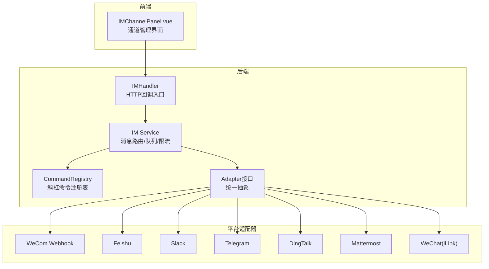
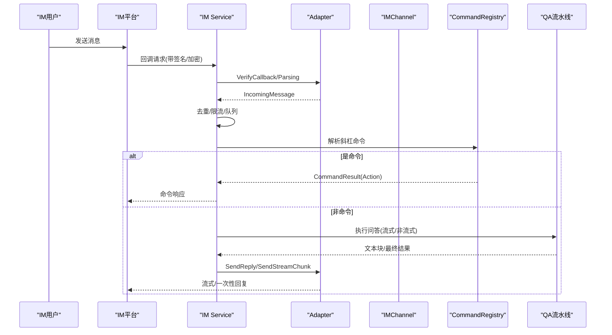
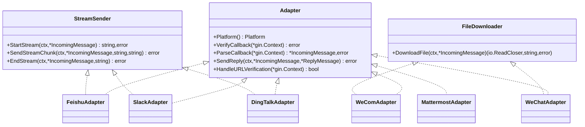
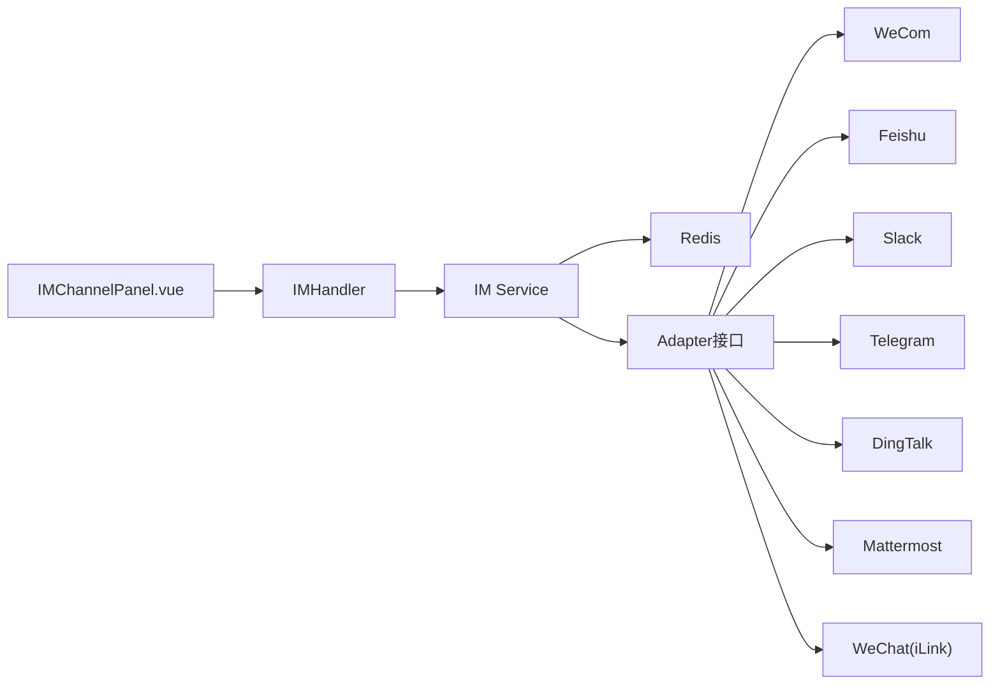

# 集成开发指南

<cite>
**本文档引用的文件**
- [adapter.go](file://internal/im/adapter.go)
- [types.go](file://internal/im/types.go)
- [service.go](file://internal/im/service.go)
- [command.go](file://internal/im/command.go)
- [ratelimit.go](file://internal/im/ratelimit.go)
- [wechat/adapter.go](file://internal/im/wechat/adapter.go)
- [feishu/adapter.go](file://internal/im/feishu/adapter.go)
- [wecom/webhook_adapter.go](file://internal/im/wecom/webhook_adapter.go)
- [dingtalk/adapter.go](file://internal/im/dingtalk/adapter.go)
- [slack/adapter.go](file://internal/im/slack/adapter.go)
- [IM集成开发.md](file://docs/wiki/集成扩展/IM集成开发.md)
- [command_registry.go](file://internal/im/command_registry.go)
- [config.yaml](file://config/config.yaml)
- [IMChannelPanel.vue](file://frontend/src/components/IMChannelPanel.vue)
- [im.go](file://internal/handler/im.go)
</cite>

## 目录
1. [简介](#简介)
2. [项目结构](#项目结构)
3. [核心组件](#核心组件)
4. [架构总览](#架构总览)
5. [详细组件分析](#详细组件分析)
6. [依赖关系分析](#依赖关系分析)
7. [性能考量](#性能考量)
8. [故障排查指南](#故障排查指南)
9. [结论](#结论)
10. [附录](#附录)

## 简介
本指南面向开发者，提供WeKnora IM（即时通讯）集成开发的完整实践路径。文档覆盖适配器接口设计、消息格式定义、认证机制实现、错误处理策略、开发环境搭建、调试技巧、测试方法、部署流程、性能优化、安全考虑与扩展性设计原则，并结合现有代码库中的适配器实现（企业微信、飞书、Slack、Telegram、钉钉、Mattermost、微信个人号）进行深入解析。

## 项目结构
WeKnora的IM集成采用“适配器模式 + 工厂模式 + 命令模式”的分层架构：
- 接口层：统一的IM适配器接口与消息模型
- 服务层：消息路由、会话管理、队列与限流、跨实例协调
- 平台适配器：各IM平台的具体实现（WeCom、Feishu、Slack、Telegram、DingTalk、Mattermost、WeChat）
- 前端：IM通道管理UI，支持凭据配置、回调URL生成、二维码绑定等
- 处理器：HTTP回调入口，路由到对应适配器

图表来源
- [IMChannelPanel.vue:1-746](file://frontend/src/components/IMChannelPanel.vue#L1-L746)
- [im.go:249-263](file://internal/handler/im.go#L249-L263)
- [service.go:390-451](file://internal/im/service.go#L390-L451)
- [adapter.go:120-165](file://internal/im/adapter.go#L120-L165)

章节来源
- [IM集成开发.md:1-116](file://docs/wiki/集成扩展/IM集成开发.md#L1-L116)
- [IMChannelPanel.vue:1-746](file://frontend/src/components/IMChannelPanel.vue#L1-L746)

## 核心组件
本节聚焦IM模块的核心类型与接口，帮助快速理解数据结构与职责边界。

- 平台枚举与会话模式
  - 平台标识：企业微信、飞书、Slack、Telegram、钉钉、Mattermost、微信个人号
  - 会话模式：按用户会话或按线程会话
- 消息模型
  - IncomingMessage：统一的入站消息结构，包含用户、聊天、内容、文件、线程等字段
  - QuotedMessage：引用/回复消息的上下文封装
  - ReplyMessage：统一的出站消息结构，支持流式与最终标记
- 适配器接口
  - Adapter：统一的回调验证、消息解析、发送回复能力
  - StreamSender：可选的流式回复能力（开始/推送/结束）
  - FileDownloader：可选的文件下载能力
- 通道与会话
  - IMChannel：数据库实体，绑定Agent、平台凭据、输出模式、会话模式、知识库ID等
  - ChannelSession：IM通道与WeKnora会话的映射，支持状态与元数据
- 命令系统
  - Command接口：斜杠命令的统一抽象
  - CommandRegistry：命令注册与解析

章节来源
- [adapter.go:10-165](file://internal/im/adapter.go#L10-L165)
- [types.go:14-179](file://internal/im/types.go#L14-L179)
- [command.go:9-67](file://internal/im/command.go#L9-L67)
- [command_registry.go:1-93](file://internal/im/command_registry.go#L1-L93)

## 架构总览
IM服务负责：
- 从数据库加载启用的通道，按平台工厂创建适配器
- 处理回调验证与消息解析
- 去重、限流、队列与工作池控制并发
- 跨实例领导选举与停止信号传播
- 解析斜杠命令、调用QA流水线、流式回传

图表来源
- [service.go:784-800](file://internal/im/service.go#L784-L800)
- [adapter.go:120-165](file://internal/im/adapter.go#L120-L165)
- [command_registry.go:25-51](file://internal/im/command_registry.go#L25-L51)

章节来源
- [service.go:101-163](file://internal/im/service.go#L101-L163)
- [IM集成开发.md:69-98](file://docs/wiki/集成扩展/IM集成开发.md#L69-L98)

## 详细组件分析

### 适配器接口设计
- Adapter接口职责
  - 平台识别、回调验证、消息解析、发送回复
  - URL验证处理（部分平台支持）
- StreamSender接口职责
  - 开始流式会话、推送内容块、结束流式会话
- FileDownloader接口职责
  - 下载平台文件资源，用于保存到知识库

图表来源
- [adapter.go:120-165](file://internal/im/adapter.go#L120-L165)
- [feishu/adapter.go:32-35](file://internal/im/feishu/adapter.go#L32-L35)
- [slack/adapter.go:21-26](file://internal/im/slack/adapter.go#L21-L26)
- [dingtalk/adapter.go:34-38](file://internal/im/dingtalk/adapter.go#L34-L38)
- [wecom/webhook_adapter.go:95-97](file://internal/im/wecom/webhook_adapter.go#L95-L97)
- [wechat/adapter.go:47-51](file://internal/im/wechat/adapter.go#L47-L51)

章节来源
- [adapter.go:120-165](file://internal/im/adapter.go#L120-L165)

### 消息格式定义
- 入站消息（IncomingMessage）
  - 包含平台、消息类型、用户/聊天标识、内容、文件键/名/大小、线程ID、引用消息、扩展字段
- 引用消息（QuotedMessage）
  - 记录被引用消息的ID、内容、发送者、是否机器人消息、非文本类型
- 出站消息（ReplyMessage）
  - 内容为Markdown；支持流式标记与最终标记；扩展字段用于平台特定参数

章节来源
- [adapter.go:42-118](file://internal/im/adapter.go#L42-L118)

### 认证机制实现
- 企业微信（Webhook）
  - 回调签名验证（Token + 时间戳 + 随机数 + 加密体排序哈希）
  - URL验证（解密echostr）
  - AES-CBC解密回调XML
- 飞书
  - 回调签名验证（Verification Token）
  - 加密事件解密（Encrypt字段）
- Slack
  - Events API签名验证（Signing Secret）
  - Socket Mode由客户端维护连接
- Telegram
  - Webhook签名（可选Secret Token）
  - 长轮询模式（iLink Bot API）
- 钉钉
  - Webhook签名（HMAC-SHA256，时间戳校验）
- Mattermost
  - 出站Webhook令牌校验
- 微信个人号（iLink）
  - Bearer Token鉴权，随机UIN头，媒体下载AES解密

章节来源
- [wecom/webhook_adapter.go:133-185](file://internal/im/wecom/webhook_adapter.go#L133-L185)
- [feishu/adapter.go:105-147](file://internal/im/feishu/adapter.go#L105-L147)
- [slack/adapter.go:100-123](file://internal/im/slack/adapter.go#L100-L123)
- [wechat/adapter.go:80-93](file://internal/im/wechat/adapter.go#L80-L93)
- [dingtalk/adapter.go:82-113](file://internal/im/dingtalk/adapter.go#L82-L113)

### 错误处理策略
- 回调解析失败：返回nil消息（忽略非消息事件）
- 签名/解密失败：拒绝处理并记录日志
- 平台API错误：解析响应码与消息，包装为错误返回
- 文件下载失败：返回错误并关闭响应体
- 去重失败（Redis不可用）：降级为本地去重，必要时fail-closed丢弃重复消息

章节来源
- [adapter.go:125-138](file://internal/im/adapter.go#L125-L138)
- [service.go:758-782](file://internal/im/service.go#L758-L782)
- [wechat/adapter.go:142-200](file://internal/im/wechat/adapter.go#L142-L200)

### 斜杠命令系统
- 命令注册
  - /help：显示所有命令
  - /info：查看绑定智能体信息
  - /search：对知识库执行混合检索
  - /stop：取消当前QA请求
  - /clear：清空当前对话记忆
- 命令解析
  - 严格区分“看起来像命令”与“已注册命令”
  - 未识别命令可选择透传至QA或提示帮助

章节来源
- [command.go:9-67](file://internal/im/command.go#L9-L67)
- [command_registry.go:25-93](file://internal/im/command_registry.go#L25-L93)
- [IM集成开发.md:80-89](file://docs/wiki/集成扩展/IM集成开发.md#L80-L89)

### 通道与会话管理
- IMChannel
  - 绑定Agent、平台、模式（websocket/webhook/longpoll）、输出模式（stream/full）、会话模式（user/thread）、知识库ID、凭据JSON
  - 自动生成唯一bot身份标识，便于多租户隔离
- ChannelSession
  - 将IM用户×聊天×线程映射到WeKnora会话，支持状态与元数据
- 服务启动
  - 从数据库加载启用通道，按平台工厂创建适配器
  - WebSocket/长轮询模式下进行领导选举，避免多实例重复连接

章节来源
- [types.go:14-179](file://internal/im/types.go#L14-L179)
- [service.go:390-451](file://internal/im/service.go#L390-L451)

### 流式输出与卡片更新
- 飞书（CardKit）
  - 创建卡片实体 → 发送卡片消息 → 流式更新元素内容 → 结束时关闭流式模式
- Slack
  - 初始发送占位消息 → 持续更新消息内容
- 钉钉（AI卡片）
  - 创建并投递AI卡片 → 流式更新内容 → 最终完成
- 微信个人号
  - 长轮询模式不支持流式，采用一次性回复

章节来源
- [feishu/adapter.go:636-728](file://internal/im/feishu/adapter.go#L636-L728)
- [slack/adapter.go:227-307](file://internal/im/slack/adapter.go#L227-L307)
- [dingtalk/adapter.go:492-594](file://internal/im/dingtalk/adapter.go#L492-L594)
- [wechat/adapter.go:95-140](file://internal/im/wechat/adapter.go#L95-L140)

### 文件下载与知识库集成
- 企业微信（Webhook）
  - 支持从临时媒体API或直链下载文件，自动推断文件名与扩展名
- 微信个人号（iLink）
  - 下载CDN加密文件，支持多种AES密钥格式解析与解密
- 飞书
  - 通过消息资源API下载文件/图片，支持SSRF防护与路径参数校验

章节来源
- [wecom/webhook_adapter.go:525-638](file://internal/im/wecom/webhook_adapter.go#L525-L638)
- [wechat/adapter.go:142-200](file://internal/im/wechat/adapter.go#L142-L200)
- [feishu/adapter.go:503-559](file://internal/im/feishu/adapter.go#L503-L559)

## 依赖关系分析
- 适配器与平台
  - 各平台适配器均实现Adapter接口，部分实现StreamSender与FileDownloader
- 服务与外部组件
  - Redis用于去重、限流、领导选举、跨实例停止检测
  - 分布式限流基于Redis ZSET，本地回退滑动窗口
- 前端与后端
  - 前端生成回调URL，WeCom/钉钉/飞书等平台需公网可达
  - 微信个人号采用iLink长轮询，无需公网域名

图表来源
- [service.go:154-157](file://internal/im/service.go#L154-L157)
- [adapter.go:120-165](file://internal/im/adapter.go#L120-L165)
- [IMChannelPanel.vue:582-585](file://frontend/src/components/IMChannelPanel.vue#L582-L585)

章节来源
- [service.go:101-163](file://internal/im/service.go#L101-L163)
- [IMChannelPanel.vue:1-746](file://frontend/src/components/IMChannelPanel.vue#L1-L746)

## 性能考量
- 去重与清理
  - Redis SetNX去重，TTL控制过期；单实例模式使用本地sync.Map并定期清理
- 限流
  - 滑动窗口（Redis ZSET + 本地回退），默认每分钟最多10次请求
- 队列与工作池
  - 有界队列与工作池，背压保护下游LLM资源
- 流式刷新
  - 定时刷新缓冲内容，平衡API限速与感知延迟
- 领导选举
  - WebSocket/长轮询场景仅允许单实例维持连接，避免重复消费

章节来源
- [service.go:30-80](file://internal/im/service.go#L30-L80)
- [ratelimit.go:12-19](file://internal/im/ratelimit.go#L12-L19)
- [service.go:412-451](file://internal/im/service.go#L412-L451)

## 故障排查指南
- 回调无法到达
  - 确认回调URL正确（前端生成），平台已配置
  - 检查签名/加密配置是否匹配（WeCom/飞书/Slack/钉钉/Mattermost/微信）
- 消息重复
  - 检查Redis去重是否生效；若Redis不可用，确认本地去重逻辑
- 流式输出异常
  - 确认适配器实现了StreamSender；检查平台卡片/消息更新接口调用
- 文件下载失败
  - 校验文件Key/URL有效性；检查平台API凭据与SSRF白名单
- 命令无效
  - 检查命令是否已注册；确认斜杠命令格式与解析规则

章节来源
- [service.go:758-782](file://internal/im/service.go#L758-L782)
- [IMChannelPanel.vue:582-585](file://frontend/src/components/IMChannelPanel.vue#L582-L585)

## 结论
WeKnora的IM集成通过清晰的适配器接口、完善的命令系统与稳健的服务层设计，提供了高扩展性的IM平台接入能力。开发者可基于现有适配器实现，快速扩展新的IM平台；同时遵循认证、限流、去重、流式输出与文件下载的最佳实践，确保在多租户、多实例环境下稳定运行。

## 附录

### 开发环境搭建
- 前置条件
  - 已部署并运行WeKnora服务
  - 已创建至少一个Agent（自定义智能体），并配置模型与知识库
- 平台接入要点
  - 企业微信：支持WebSocket与Webhook两种模式
  - 飞书：推荐WebSocket，Webhook需公网回调
  - Slack：Socket Mode或Events API
  - Telegram：长轮询或Webhook
  - 钉钉：Stream或Webhook
  - Mattermost：仅Webhook
  - 微信个人号：iLink长轮询，无需公网域名

章节来源
- [IM集成开发.md:27-68](file://docs/wiki/集成扩展/IM集成开发.md#L27-L68)

### 调试技巧
- 日志与追踪
  - 使用服务端日志与OpenTelemetry追踪，定位回调处理链路
- 前端辅助
  - 通道面板自动生成回调URL，一键复制；WeCom支持二维码绑定
- 平台特性
  - WeCom/Webhook：URL验证与AES解密
  - 飞书：加密事件解密与URL验证
  - Slack：Events API签名验证
  - 钉钉：Webhook签名与时间戳校验
  - Mattermost：出站Webhook令牌校验
  - 微信个人号：iLink鉴权与媒体下载解密

章节来源
- [IMChannelPanel.vue:582-607](file://frontend/src/components/IMChannelPanel.vue#L582-L607)
- [wecom/webhook_adapter.go:164-185](file://internal/im/wecom/webhook_adapter.go#L164-L185)
- [feishu/adapter.go:149-188](file://internal/im/feishu/adapter.go#L149-L188)
- [slack/adapter.go:173-194](file://internal/im/slack/adapter.go#L173-L194)
- [dingtalk/adapter.go:78-113](file://internal/im/dingtalk/adapter.go#L78-L113)
- [wecom/webhook_adapter.go:133-185](file://internal/im/wecom/webhook_adapter.go#L133-L185)
- [wechat/adapter.go:30-93](file://internal/im/wechat/adapter.go#L30-L93)

### 测试方法
- 单元测试
  - 针对回调解析与签名验证的关键函数编写测试
- 集成测试
  - 在受控环境中配置平台回调，验证消息流转与命令执行
- 性能测试
  - 压测队列与限流策略，观察Redis/ZSET行为与本地回退表现

### 部署流程
- 通道配置
  - 在前端通道面板创建并配置通道，填写平台凭据
- 回调设置
  - 按平台要求在IM平台侧配置回调URL与安全参数
- 启动与监控
  - 启动服务后，观察日志中通道启动与消息处理情况

章节来源
- [IMChannelPanel.vue:1-746](file://frontend/src/components/IMChannelPanel.vue#L1-L746)
- [im.go:249-263](file://internal/handler/im.go#L249-L263)