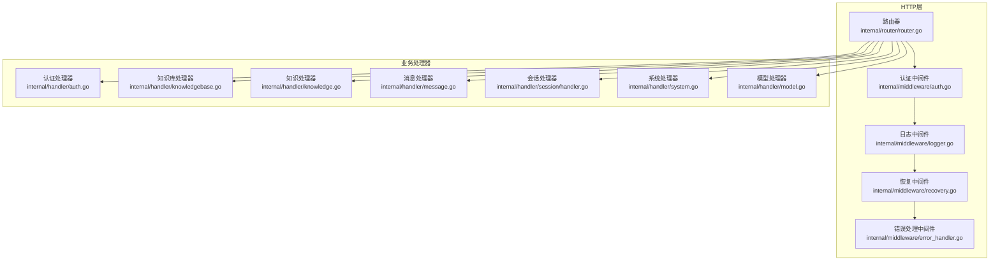
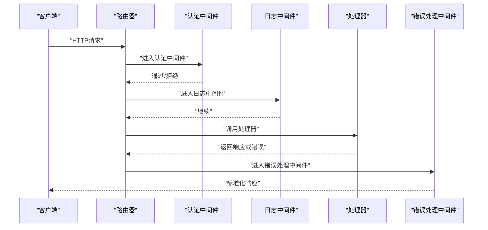
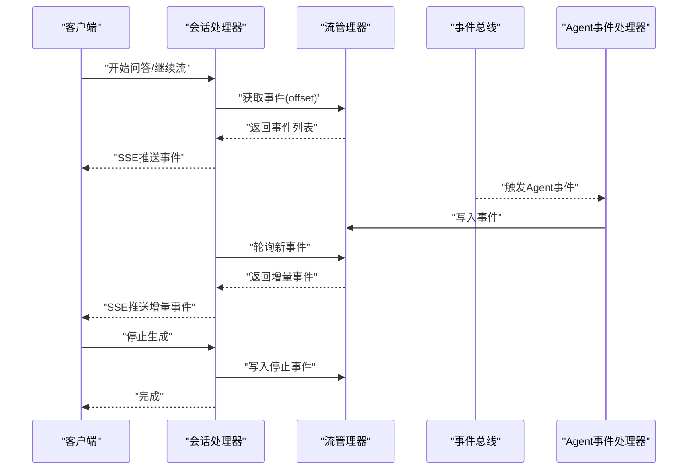
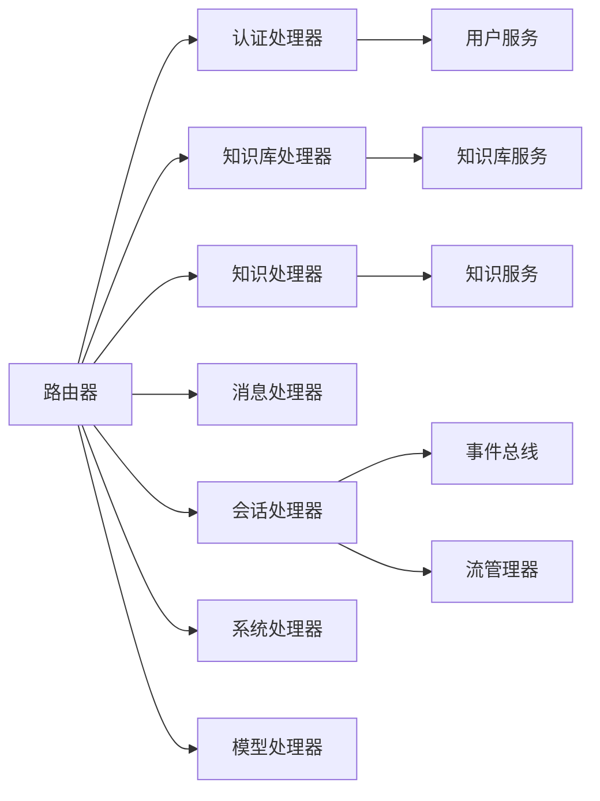

# HTTP处理器

<cite>
**本文引用的文件**
- [router.go](file://internal/router/router.go)
- [auth.go](file://internal/handler/auth.go)
- [knowledge.go](file://internal/handler/knowledge.go)
- [knowledgebase.go](file://internal/handler/knowledgebase.go)
- [message.go](file://internal/handler/message.go)
- [session/handler.go](file://internal/handler/session/handler.go)
- [session/stream.go](file://internal/handler/session/stream.go)
- [session/agent_stream_handler.go](file://internal/handler/session/agent_stream_handler.go)
- [auth中间件.go](file://internal/middleware/auth.go)
- [错误处理中间件.go](file://internal/middleware/error_handler.go)
- [日志中间件.go](file://internal/middleware/logger.go)
- [恢复中间件.go](file://internal/middleware/recovery.go)
- [system.go](file://internal/handler/system.go)
- [model.go](file://internal/handler/model.go)
</cite>

## 目录
1. [简介](#简介)
2. [项目结构](#项目结构)
3. [核心组件](#核心组件)
4. [架构总览](#架构总览)
5. [详细组件分析](#详细组件分析)
6. [依赖分析](#依赖分析)
7. [性能考虑](#性能考虑)
8. [故障排查指南](#故障排查指南)
9. [结论](#结论)

## 简介
本技术文档面向WeKnora的HTTP处理器系统，系统基于Gin框架构建，采用“处理器+中间件”的分层架构，覆盖认证、知识库、消息、会话、系统与模型等业务领域。文档重点阐述：
- 请求路由设计与版本控制策略
- 处理器架构与职责划分
- 中间件集成与错误处理机制
- 各业务领域处理器实现细节
- 请求处理流程、响应格式化、流式响应与WebSocket连接管理
- API版本控制、请求验证与安全防护

## 项目结构
WeKnora的HTTP层主要由以下模块构成：
- 路由器：集中注册所有API路由，并按版本分组
- 处理器：按业务域拆分，如认证、知识库、知识、消息、会话、系统、模型等
- 中间件：认证、日志、错误处理、恢复、语言、追踪等
- 会话子系统：包含流式响应与事件驱动的Agent交互

图表来源
- [router.go:71-161](file://internal/router/router.go#L71-L161)
- [auth中间件.go:65-228](file://internal/middleware/auth.go#L65-L228)
- [错误处理中间件.go:11-46](file://internal/middleware/error_handler.go#L11-L46)
- [日志中间件.go:140-236](file://internal/middleware/logger.go#L140-L236)
- [恢复中间件.go:12-39](file://internal/middleware/recovery.go#L12-L39)
- [auth.go:22-44](file://internal/handler/auth.go#L22-L44)
- [knowledgebase.go:25-49](file://internal/handler/knowledgebase.go#L25-L49)
- [knowledge.go:30-54](file://internal/handler/knowledge.go#L30-L54)
- [message.go:17-32](file://internal/handler/message.go#L17-L32)
- [session/handler.go:16-29](file://internal/handler/session/handler.go#L16-L29)
- [system.go:26-46](file://internal/handler/system.go#L26-L46)
- [model.go:17-31](file://internal/handler/model.go#L17-L31)

章节来源
- [router.go:71-161](file://internal/router/router.go#L71-L161)

## 核心组件
- 路由器：负责注册所有API路由，按版本分组（/api/v1），并挂载基础中间件栈
- 认证中间件：统一处理JWT与API Key两种认证方式，支持跨租户访问
- 错误处理中间件：将应用错误转换为标准JSON响应
- 日志中间件：结构化记录请求/响应，过滤敏感信息
- 恢复中间件：捕获panic并返回统一错误
- 业务处理器：封装各领域业务逻辑，统一进行输入校验、权限校验与错误处理

章节来源
- [router.go:71-161](file://internal/router/router.go#L71-L161)
- [auth中间件.go:65-228](file://internal/middleware/auth.go#L65-L228)
- [错误处理中间件.go:11-46](file://internal/middleware/error_handler.go#L11-L46)
- [日志中间件.go:140-236](file://internal/middleware/logger.go#L140-L236)
- [恢复中间件.go:12-39](file://internal/middleware/recovery.go#L12-L39)

## 架构总览
WeKnora的HTTP层采用“路由-中间件-处理器”三层结构，请求生命周期如下：
1. 路由器根据URL与方法匹配到对应处理器
2. 中间件栈依次执行：认证、日志、恢复、错误处理
3. 处理器执行业务逻辑，调用服务层，返回标准化响应

图表来源
- [router.go:117-129](file://internal/router/router.go#L117-L129)
- [auth中间件.go:65-228](file://internal/middleware/auth.go#L65-L228)
- [日志中间件.go:140-236](file://internal/middleware/logger.go#L140-L236)
- [错误处理中间件.go:11-46](file://internal/middleware/error_handler.go#L11-L46)

## 详细组件分析

### 路由与版本控制
- 路由器在根路径下注册健康检查、Swagger文档、静态资源等公共接口
- 所有业务接口统一置于/api/v1版本前缀下，便于未来演进
- 路由分组清晰：认证、知识库、知识、消息、会话、系统、模型等

章节来源
- [router.go:93-158](file://internal/router/router.go#L93-L158)

### 认证与授权
- 支持JWT与API Key两种认证方式
- JWT优先：从Authorization头解析Bearer Token，验证后将用户与租户信息写入上下文
- API Key兼容：从X-API-Key解析，提取租户ID并构造系统虚拟用户
- 跨租户访问：通过X-Tenant-ID头传递目标租户ID，结合配置校验用户权限
- 无需认证的API白名单：如健康检查、注册、登录、OIDC等

章节来源
- [auth中间件.go:20-63](file://internal/middleware/auth.go#L20-L63)
- [auth中间件.go:65-228](file://internal/middleware/auth.go#L65-L228)

### 认证处理器（AuthHandler）
- 提供注册、登录、OIDC授权、刷新令牌、登出、获取当前用户、修改密码、自动初始化等接口
- 统一进行请求参数校验、调用UserService执行业务逻辑、返回标准化响应
- OIDC回调通过state参数携带nonce与重定向地址，完成code交换后重定向回前端

章节来源
- [auth.go:46-108](file://internal/handler/auth.go#L46-L108)
- [auth.go:110-162](file://internal/handler/auth.go#L110-L162)
- [auth.go:164-217](file://internal/handler/auth.go#L164-L217)
- [auth.go:219-276](file://internal/handler/auth.go#L219-L276)
- [auth.go:319-368](file://internal/handler/auth.go#L319-L368)
- [auth.go:370-412](file://internal/handler/auth.go#L370-L412)
- [auth.go:414-454](file://internal/handler/auth.go#L414-L454)
- [auth.go:456-507](file://internal/handler/auth.go#L456-L507)
- [auth.go:509-580](file://internal/handler/auth.go#L509-L580)
- [auth.go:582-632](file://internal/handler/auth.go#L582-L632)

### 知识库处理器（KnowledgeBaseHandler）
- 提供创建、查询、更新、删除知识库，混合搜索、复制知识库、获取复制进度等接口
- 权限校验：支持拥有者、组织共享、共享智能体三种场景，动态确定effectiveTenantID
- 复制知识库通过Asynq异步任务执行，并持久化进度

章节来源
- [knowledgebase.go:51-102](file://internal/handler/knowledgebase.go#L51-L102)
- [knowledgebase.go:104-149](file://internal/handler/knowledgebase.go#L104-L149)
- [knowledgebase.go:151-246](file://internal/handler/knowledgebase.go#L151-L246)
- [knowledgebase.go:248-286](file://internal/handler/knowledgebase.go#L248-L286)
- [knowledgebase.go:288-381](file://internal/handler/knowledgebase.go#L288-L381)
- [knowledgebase.go:382-413](file://internal/handler/knowledgebase.go#L382-L413)
- [knowledgebase.go:415-514](file://internal/handler/knowledgebase.go#L415-L514)
- [knowledgebase.go:516-562](file://internal/handler/knowledgebase.go#L516-L562)
- [knowledgebase.go:578-706](file://internal/handler/knowledgebase.go#L578-L706)
- [knowledgebase.go:708-741](file://internal/handler/knowledgebase.go#L708-L741)

### 知识处理器（KnowledgeHandler）
- 提供从文件、URL、手工录入创建知识，查询、删除、清空知识库内容，下载/预览文件等接口
- 权限校验：支持拥有者与组织共享两种场景，动态确定effectiveTenantID
- 重复知识检测：对重复文件/URL返回冲突响应，包含现有知识对象

章节来源
- [knowledge.go:56-105](file://internal/handler/knowledge.go#L56-L105)
- [knowledge.go:107-169](file://internal/handler/knowledge.go#L107-L169)
- [knowledge.go:171-188](file://internal/handler/knowledge.go#L171-L188)
- [knowledge.go:190-313](file://internal/handler/knowledge.go#L190-L313)
- [knowledge.go:315-408](file://internal/handler/knowledge.go#L315-L408)
- [knowledge.go:410-467](file://internal/handler/knowledge.go#L410-L467)
- [knowledge.go:469-507](file://internal/handler/knowledge.go#L469-L507)
- [knowledge.go:509-586](file://internal/handler/knowledge.go#L509-L586)
- [knowledge.go:588-630](file://internal/handler/knowledge.go#L588-L630)
- [knowledge.go:632-715](file://internal/handler/knowledge.go#L632-L715)
- [knowledge.go:717-782](file://internal/handler/knowledge.go#L717-L782)

### 消息处理器（MessageHandler）
- 提供加载消息历史、删除消息、消息搜索、聊天历史KB统计等接口
- 支持按时间窗口与数量限制加载历史消息，支持关键词/向量/混合搜索

章节来源
- [message.go:34-121](file://internal/handler/message.go#L34-L121)
- [message.go:123-159](file://internal/handler/message.go#L123-L159)
- [message.go:161-213](file://internal/handler/message.go#L161-L213)
- [message.go:227-253](file://internal/handler/message.go#L227-L253)

### 会话处理器与流式响应
- 会话处理器：创建/查询/更新/删除会话，清空会话消息，生成标题，停止生成
- 流式响应：基于SSE（Server-Sent Events）持续推送事件，支持断线重连与继续流
- Agent事件驱动：通过事件总线订阅思考、工具调用、结果、引用、最终答案、反思、错误、会话标题、完成等事件，实时写入StreamManager并推送到前端

图表来源
- [session/handler.go:66-127](file://internal/handler/session/handler.go#L66-L127)
- [session/stream.go:18-176](file://internal/handler/session/stream.go#L18-L176)
- [session/agent_stream_handler.go:15-69](file://internal/handler/session/agent_stream_handler.go#L15-L69)

章节来源
- [session/handler.go:66-127](file://internal/handler/session/handler.go#L66-L127)
- [session/handler.go:129-174](file://internal/handler/session/handler.go#L129-L174)
- [session/handler.go:176-216](file://internal/handler/session/handler.go#L176-L216)
- [session/handler.go:218-287](file://internal/handler/session/handler.go#L218-L287)
- [session/handler.go:289-329](file://internal/handler/session/handler.go#L289-L329)
- [session/handler.go:331-371](file://internal/handler/session/handler.go#L331-L371)
- [session/handler.go:373-443](file://internal/handler/session/handler.go#L373-L443)
- [session/stream.go:18-176](file://internal/handler/session/stream.go#L18-L176)
- [session/agent_stream_handler.go:15-69](file://internal/handler/session/agent_stream_handler.go#L15-L69)

### 系统与模型处理器
- 系统处理器：提供系统信息、文档解析引擎列表、存储引擎状态与连通性检测等接口
- 模型处理器：提供模型的增删改查、厂商列表、敏感信息隐藏等接口

章节来源
- [system.go:71-121](file://internal/handler/system.go#L71-L121)
- [system.go:133-162](file://internal/handler/system.go#L133-L162)
- [system.go:164-223](file://internal/handler/system.go#L164-L223)
- [system.go:225-256](file://internal/handler/system.go#L225-L256)
- [system.go:258-290](file://internal/handler/system.go#L258-L290)
- [system.go:292-371](file://internal/handler/system.go#L292-L371)
- [system.go:373-433](file://internal/handler/system.go#L373-L433)
- [system.go:457-482](file://internal/handler/system.go#L457-L482)
- [system.go:593-625](file://internal/handler/system.go#L593-L625)
- [system.go:627-690](file://internal/handler/system.go#L627-L690)
- [system.go:691-726](file://internal/handler/system.go#L691-L726)
- [system.go:728-760](file://internal/handler/system.go#L728-L760)
- [system.go:762-794](file://internal/handler/system.go#L762-L794)
- [system.go:796-800](file://internal/handler/system.go#L796-L800)
- [model.go:73-144](file://internal/handler/model.go#L73-L144)
- [model.go:146-195](file://internal/handler/model.go#L146-L195)
- [model.go:197-242](file://internal/handler/model.go#L197-L242)
- [model.go:254-339](file://internal/handler/model.go#L254-L339)
- [model.go:341-382](file://internal/handler/model.go#L341-L382)
- [model.go:412-488](file://internal/handler/model.go#L412-L488)

## 依赖分析
- 路由器依赖各处理器实例，通过依赖注入容器统一装配
- 处理器依赖服务接口（如UserService、KnowledgeBaseService等），实现业务解耦
- 中间件之间无循环依赖，遵循“认证→日志→恢复→错误处理”的顺序
- 会话处理器依赖事件总线与流管理器，支撑Agent事件驱动与SSE流式输出

图表来源
- [router.go:31-69](file://internal/router/router.go#L31-L69)
- [session/handler.go:16-29](file://internal/handler/session/handler.go#L16-L29)
- [knowledge.go:30-54](file://internal/handler/knowledge.go#L30-L54)
- [knowledgebase.go:25-49](file://internal/handler/knowledgebase.go#L25-L49)
- [auth.go:25-29](file://internal/handler/auth.go#L25-L29)

章节来源
- [router.go:31-69](file://internal/router/router.go#L31-L69)

## 性能考虑
- SSE流式响应：日志中间件对SSE响应体进行跳过记录，避免内存膨胀
- 异步任务：知识库复制、清空等重操作通过Asynq异步执行，提升吞吐
- 权限判定：在处理器内部尽早判定权限，减少无效调用
- 缓存与延迟：系统信息与引擎状态可结合缓存策略降低重复计算

## 故障排查指南
- 认证失败：检查Authorization头格式与Bearer Token有效性；确认X-API-Key格式与租户有效性
- 跨租户访问：确认用户具备跨租户权限，且X-Tenant-ID合法
- SSE断线重连：使用ContinueStream接口，携带message_id参数继续拉取事件
- 500错误：查看日志中间件输出的request_id，定位堆栈信息
- 存储引擎检测：使用系统接口检测MinIO/COS/TOS/S3/OSS连通性，关注屏蔽的错误提示

章节来源
- [auth中间件.go:65-228](file://internal/middleware/auth.go#L65-L228)
- [session/stream.go:18-176](file://internal/handler/session/stream.go#L18-L176)
- [日志中间件.go:140-236](file://internal/middleware/logger.go#L140-L236)
- [system.go:593-625](file://internal/handler/system.go#L593-L625)
- [system.go:627-690](file://internal/handler/system.go#L627-L690)
- [system.go:691-726](file://internal/handler/system.go#L691-L726)
- [system.go:728-760](file://internal/handler/system.go#L728-L760)
- [system.go:762-794](file://internal/handler/system.go#L762-L794)
- [system.go:796-800](file://internal/handler/system.go#L796-L800)

## 结论
WeKnora的HTTP处理器系统通过清晰的路由分组、严格的中间件栈与职责明确的处理器，实现了高内聚、低耦合的REST API体系。结合事件驱动与SSE流式响应，满足了复杂业务场景下的实时交互需求。建议在生产环境中：
- 严格启用认证中间件与日志中间件
- 对外部输入进行SSRF与参数校验
- 对关键接口增加限流与熔断
- 持续优化SSE与事件处理的性能与稳定性