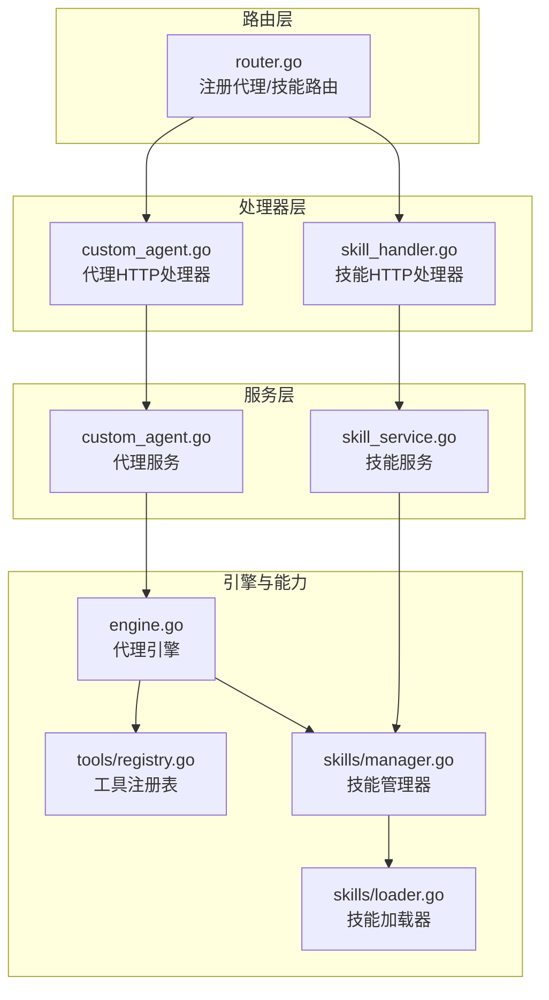
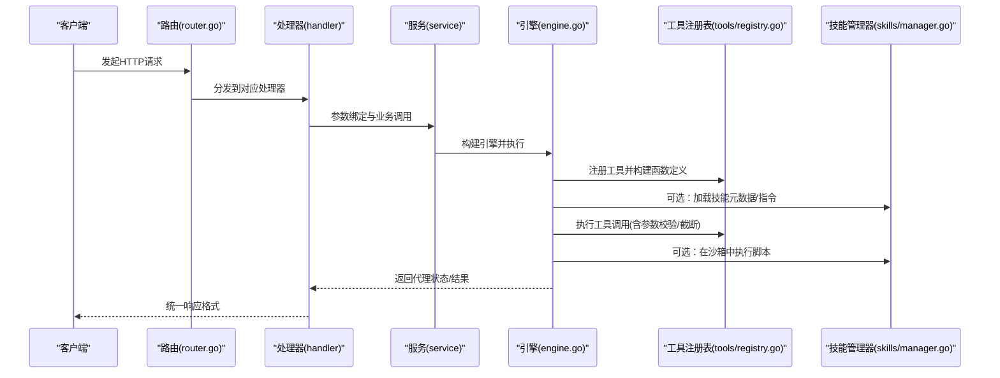
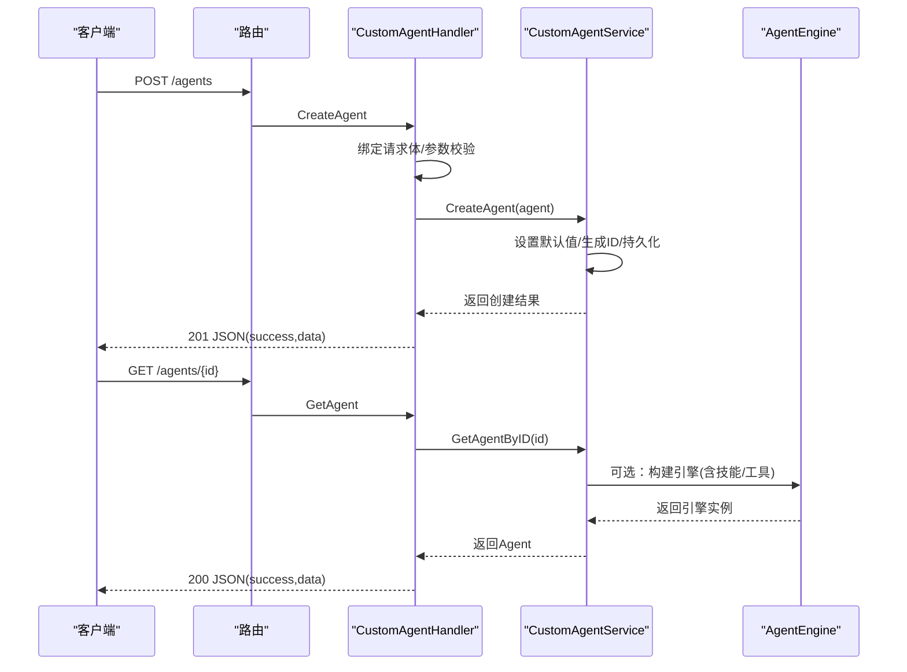
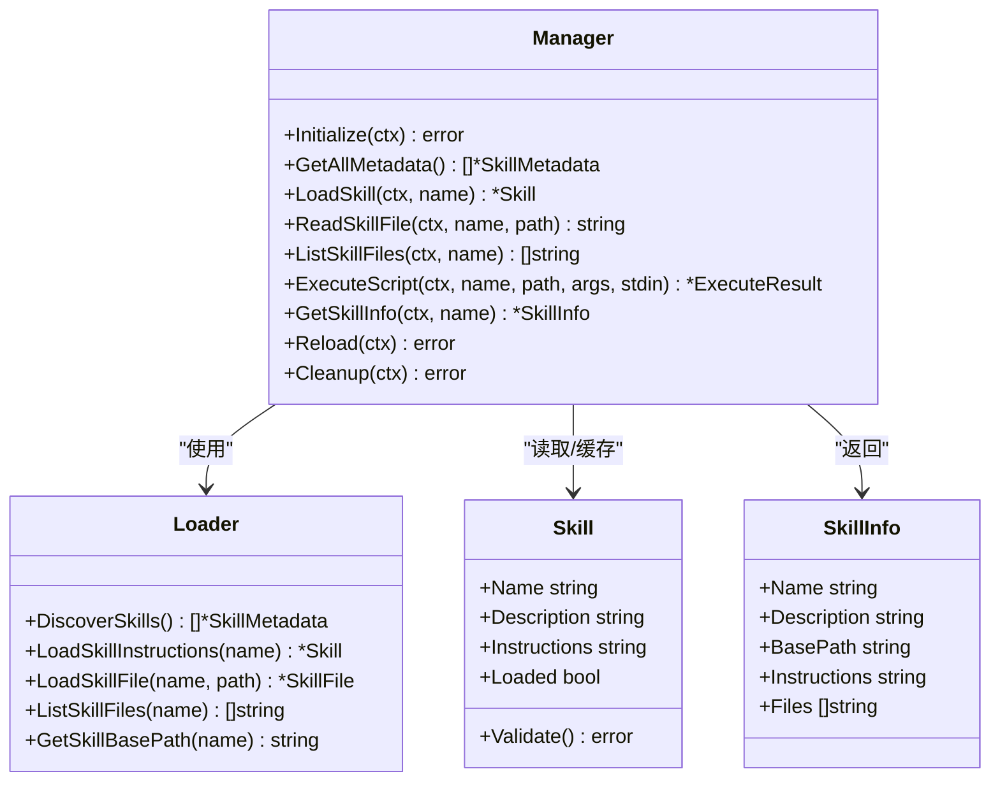
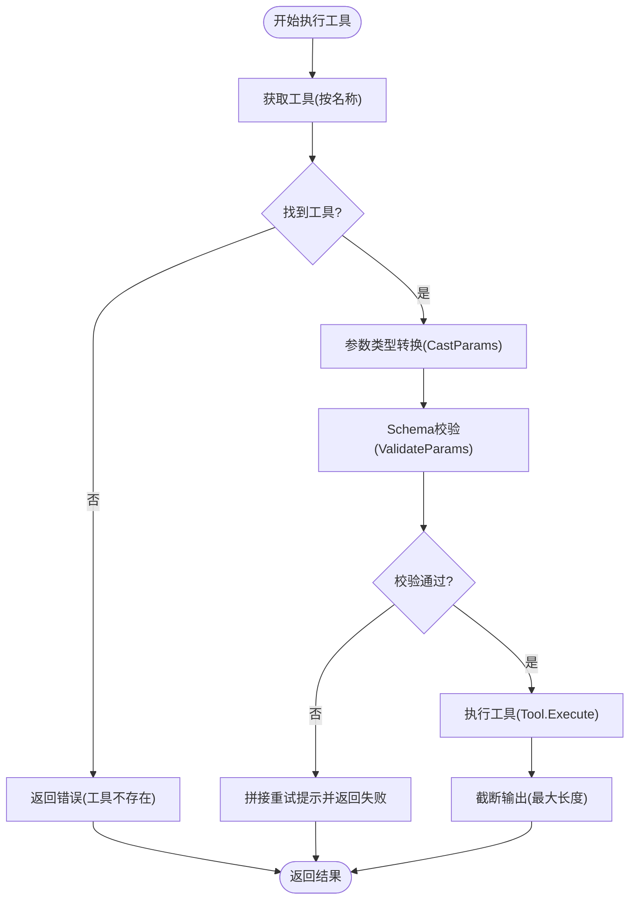
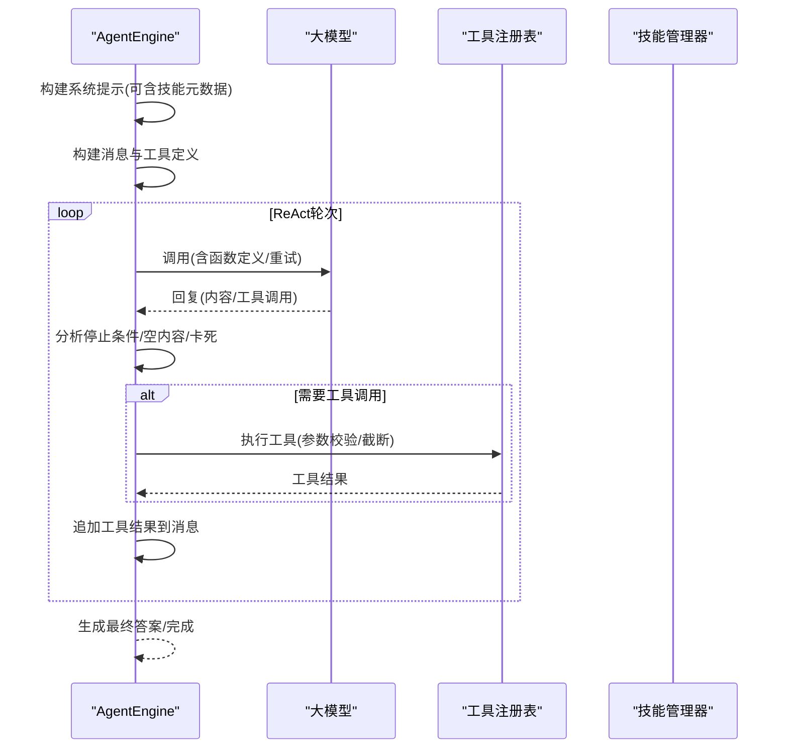
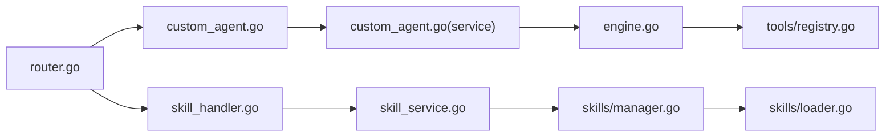

# 代理处理器

<cite>
**本文引用的文件**
- [internal/handler/custom_agent.go](file://internal/handler/custom_agent.go)
- [internal/handler/skill_handler.go](file://internal/handler/skill_handler.go)
- [internal/router/router.go](file://internal/router/router.go)
- [internal/application/service/custom_agent.go](file://internal/application/service/custom_agent.go)
- [internal/application/service/skill_service.go](file://internal/application/service/skill_service.go)
- [internal/agent/skills/manager.go](file://internal/agent/skills/manager.go)
- [internal/agent/skills/loader.go](file://internal/agent/skills/loader.go)
- [internal/agent/skills/skill.go](file://internal/agent/skills/skill.go)
- [internal/agent/engine.go](file://internal/agent/engine.go)
- [internal/agent/tools/registry.go](file://internal/agent/tools/registry.go)
- [internal/agent/tools/tool.go](file://internal/agent/tools/tool.go)
- [internal/types/custom_agent.go](file://internal/types/custom_agent.go)
- [examples/skills/pdf-processing/SKILL.md](file://examples/skills/pdf-processing/SKILL.md)
- [config/builtin_agents.yaml](file://config/builtin_agents.yaml)
- [docs/swagger.json](file://docs/swagger.json)
</cite>

## 目录
1. [简介](#简介)
2. [项目结构](#项目结构)
3. [核心组件](#核心组件)
4. [架构总览](#架构总览)
5. [详细组件分析](#详细组件分析)
6. [依赖分析](#依赖分析)
7. [性能考虑](#性能考虑)
8. [故障排查指南](#故障排查指南)
9. [结论](#结论)
10. [附录](#附录)

## 简介
本文件面向WeKnora智能代理系统的“代理处理器”子系统，系统性阐述代理的创建、配置与管理的HTTP接口实现；深入解析代理技能的注册、加载、执行与监控机制，涵盖技能发现、参数校验与执行结果处理；并提供代理配置的REST API、技能工具的调用接口与代理状态查询方法。文档以代码级映射与可视化图为依据，帮助读者理解从HTTP请求到代理引擎执行、再到工具与技能沙箱执行的完整链路。

## 项目结构
WeKnora后端采用分层架构：路由层负责HTTP路由注册与鉴权，处理器层承接请求并调用服务层；服务层协调应用逻辑与领域模型；引擎与工具/技能模块负责推理与能力扩展。关键路径如下：
- 路由层：在路由注册函数中挂载代理与技能相关路由
- 处理器层：实现HTTP接口，封装请求参数、错误处理与响应格式
- 服务层：实现业务规则、权限控制与数据访问
- 引擎层：ReAct推理循环、上下文窗口管理、事件发射
- 工具/技能层：工具注册表、技能发现与沙箱执行

图表来源
- [internal/router/router.go:554-587](file://internal/router/router.go#L554-L587)
- [internal/handler/custom_agent.go:1-495](file://internal/handler/custom_agent.go#L1-L495)
- [internal/handler/skill_handler.go:1-73](file://internal/handler/skill_handler.go#L1-L73)
- [internal/application/service/custom_agent.go:1-690](file://internal/application/service/custom_agent.go#L1-L690)
- [internal/application/service/skill_service.go:1-136](file://internal/application/service/skill_service.go#L1-L136)
- [internal/agent/engine.go:1-675](file://internal/agent/engine.go#L1-L675)
- [internal/agent/tools/registry.go:1-171](file://internal/agent/tools/registry.go#L1-L171)
- [internal/agent/skills/manager.go:1-284](file://internal/agent/skills/manager.go#L1-L284)
- [internal/agent/skills/loader.go:1-309](file://internal/agent/skills/loader.go#L1-L309)

章节来源
- [internal/router/router.go:554-587](file://internal/router/router.go#L554-L587)
- [internal/handler/custom_agent.go:1-495](file://internal/handler/custom_agent.go#L1-L495)
- [internal/handler/skill_handler.go:1-73](file://internal/handler/skill_handler.go#L1-L73)
- [internal/application/service/custom_agent.go:1-690](file://internal/application/service/custom_agent.go#L1-L690)
- [internal/application/service/skill_service.go:1-136](file://internal/application/service/skill_service.go#L1-L136)
- [internal/agent/engine.go:1-675](file://internal/agent/engine.go#L1-L675)
- [internal/agent/tools/registry.go:1-171](file://internal/agent/tools/registry.go#L1-L171)
- [internal/agent/skills/manager.go:1-284](file://internal/agent/skills/manager.go#L1-L284)
- [internal/agent/skills/loader.go:1-309](file://internal/agent/skills/loader.go#L1-L309)

## 核心组件
- 路由注册：在路由注册函数中挂载代理与技能相关路由，确保HTTP端点暴露给客户端
- 代理处理器：实现代理的创建、查询、列表、更新、删除、复制、占位符与推荐问题等接口
- 技能处理器：实现技能列表查询接口，结合沙箱可用性动态控制前端UI
- 代理服务：实现代理生命周期管理、内置代理解析、建议问题生成等业务逻辑
- 技能服务：负责预置技能目录定位、初始化与技能元数据发现
- 引擎：ReAct推理循环、上下文窗口估计与清理、事件发射
- 工具注册表：工具注册、参数校验与执行、输出截断与清理
- 技能管理器与加载器：技能发现、缓存、指令加载、脚本执行准备与沙箱交互

章节来源
- [internal/router/router.go:554-587](file://internal/router/router.go#L554-L587)
- [internal/handler/custom_agent.go:1-495](file://internal/handler/custom_agent.go#L1-L495)
- [internal/handler/skill_handler.go:1-73](file://internal/handler/skill_handler.go#L1-L73)
- [internal/application/service/custom_agent.go:1-690](file://internal/application/service/custom_agent.go#L1-L690)
- [internal/application/service/skill_service.go:1-136](file://internal/application/service/skill_service.go#L1-L136)
- [internal/agent/engine.go:1-675](file://internal/agent/engine.go#L1-L675)
- [internal/agent/tools/registry.go:1-171](file://internal/agent/tools/registry.go#L1-L171)
- [internal/agent/skills/manager.go:1-284](file://internal/agent/skills/manager.go#L1-L284)
- [internal/agent/skills/loader.go:1-309](file://internal/agent/skills/loader.go#L1-L309)

## 架构总览
下图展示了从HTTP请求到代理执行与工具/技能调用的整体流程：

图表来源
- [internal/router/router.go:554-587](file://internal/router/router.go#L554-L587)
- [internal/handler/custom_agent.go:1-495](file://internal/handler/custom_agent.go#L1-L495)
- [internal/handler/skill_handler.go:1-73](file://internal/handler/skill_handler.go#L1-L73)
- [internal/application/service/custom_agent.go:1-690](file://internal/application/service/custom_agent.go#L1-L690)
- [internal/agent/engine.go:1-675](file://internal/agent/engine.go#L1-L675)
- [internal/agent/tools/registry.go:1-171](file://internal/agent/tools/registry.go#L1-L171)
- [internal/agent/skills/manager.go:1-284](file://internal/agent/skills/manager.go#L1-L284)

## 详细组件分析

### 代理配置与管理HTTP接口
- 接口概览
  - 创建代理：POST /agents
  - 获取代理详情：GET /agents/{id}
  - 列出代理：GET /agents
  - 更新代理：PUT /agents/{id}
  - 删除代理：DELETE /agents/{id}
  - 复制代理：POST /agents/{id}/copy
  - 获取占位符定义：GET /agents/placeholders
  - 获取智能体类型预设：GET /agents/type-presets
  - 获取推荐问题：GET /agents/{id}/suggested-questions

- 关键处理流程
  - 请求参数绑定与校验（必填字段、ID合法性）
  - 上下文提取租户ID并进行权限检查
  - 调用服务层执行业务逻辑（内置/自定义代理区分处理）
  - 错误分类与统一错误响应（参数错误、未找到、禁止操作、内部错误）

- 代理配置模型
  - CustomAgentConfig包含运行模式、工具白名单、检索策略、Web搜索、多轮对话、图像/音频上传、文件类型限制、FAQ优先策略等
  - 内置代理通过YAML配置与国际化支持，服务层在数据库无记录时回退到默认内置配置

- Swagger接口定义
  - 以上接口均在Swagger中声明，包含安全策略（Bearer/ApiKeyAuth）、请求/响应格式与错误码

图表来源
- [internal/router/router.go:554-587](file://internal/router/router.go#L554-L587)
- [internal/handler/custom_agent.go:47-101](file://internal/handler/custom_agent.go#L47-L101)
- [internal/handler/custom_agent.go:103-144](file://internal/handler/custom_agent.go#L103-L144)
- [internal/handler/custom_agent.go:146-195](file://internal/handler/custom_agent.go#L146-L195)
- [internal/handler/custom_agent.go:197-268](file://internal/handler/custom_agent.go#L197-L268)
- [internal/handler/custom_agent.go:270-321](file://internal/handler/custom_agent.go#L270-L321)
- [internal/handler/custom_agent.go:323-372](file://internal/handler/custom_agent.go#L323-L372)
- [internal/handler/custom_agent.go:374-398](file://internal/handler/custom_agent.go#L374-L398)
- [internal/handler/custom_agent.go:400-417](file://internal/handler/custom_agent.go#L400-L417)
- [internal/handler/custom_agent.go:419-494](file://internal/handler/custom_agent.go#L419-L494)
- [internal/application/service/custom_agent.go:48-95](file://internal/application/service/custom_agent.go#L48-L95)
- [internal/application/service/custom_agent.go:97-137](file://internal/application/service/custom_agent.go#L97-L137)
- [internal/application/service/custom_agent.go:155-209](file://internal/application/service/custom_agent.go#L155-L209)
- [internal/application/service/custom_agent.go:211-269](file://internal/application/service/custom_agent.go#L211-L269)
- [internal/application/service/custom_agent.go:332-375](file://internal/application/service/custom_agent.go#L332-L375)
- [internal/application/service/custom_agent.go:377-424](file://internal/application/service/custom_agent.go#L377-L424)
- [internal/application/service/custom_agent.go:426-637](file://internal/application/service/custom_agent.go#L426-L637)
- [internal/agent/engine.go:158-298](file://internal/agent/engine.go#L158-L298)

章节来源
- [internal/handler/custom_agent.go:47-101](file://internal/handler/custom_agent.go#L47-L101)
- [internal/handler/custom_agent.go:103-144](file://internal/handler/custom_agent.go#L103-L144)
- [internal/handler/custom_agent.go:146-195](file://internal/handler/custom_agent.go#L146-L195)
- [internal/handler/custom_agent.go:197-268](file://internal/handler/custom_agent.go#L197-L268)
- [internal/handler/custom_agent.go:270-321](file://internal/handler/custom_agent.go#L270-L321)
- [internal/handler/custom_agent.go:323-372](file://internal/handler/custom_agent.go#L323-L372)
- [internal/handler/custom_agent.go:374-398](file://internal/handler/custom_agent.go#L374-L398)
- [internal/handler/custom_agent.go:400-417](file://internal/handler/custom_agent.go#L400-L417)
- [internal/handler/custom_agent.go:419-494](file://internal/handler/custom_agent.go#L419-L494)
- [internal/application/service/custom_agent.go:48-95](file://internal/application/service/custom_agent.go#L48-L95)
- [internal/application/service/custom_agent.go:97-137](file://internal/application/service/custom_agent.go#L97-L137)
- [internal/application/service/custom_agent.go:155-209](file://internal/application/service/custom_agent.go#L155-L209)
- [internal/application/service/custom_agent.go:211-269](file://internal/application/service/custom_agent.go#L211-L269)
- [internal/application/service/custom_agent.go:332-375](file://internal/application/service/custom_agent.go#L332-L375)
- [internal/application/service/custom_agent.go:377-424](file://internal/application/service/custom_agent.go#L377-L424)
- [internal/application/service/custom_agent.go:426-637](file://internal/application/service/custom_agent.go#L426-L637)
- [internal/agent/engine.go:158-298](file://internal/agent/engine.go#L158-L298)
- [internal/types/custom_agent.go:88-229](file://internal/types/custom_agent.go#L88-L229)
- [config/builtin_agents.yaml:1-236](file://config/builtin_agents.yaml#L1-L236)
- [docs/swagger.json:7821-7863](file://docs/swagger.json#L7821-L7863)

### 技能系统：注册、加载与执行
- 技能发现与缓存
  - Loader扫描技能目录，解析SKILL.md的YAML前言，提取元数据（Level 1）
  - 支持缓存已发现技能，避免重复IO
  - 支持按名称加载完整指令（Level 2）与附加文件（Level 3）

- 技能管理器
  - Manager协调Loader与沙箱，提供技能元数据、指令加载、文件列举、脚本执行
  - 支持白名单过滤与启用开关
  - 提供技能信息查询（含基础路径、文件列表）

- 沙箱执行
  - 通过ExecuteScript在沙箱中执行脚本，传入工作目录、参数与标准输入
  - 严格校验脚本文件是否可执行

- 技能示例
  - 示例技能pdf-processing展示SKILL.md的结构与脚本调用方式

图表来源
- [internal/agent/skills/loader.go:1-309](file://internal/agent/skills/loader.go#L1-L309)
- [internal/agent/skills/manager.go:1-284](file://internal/agent/skills/manager.go#L1-L284)
- [internal/agent/skills/skill.go:1-219](file://internal/agent/skills/skill.go#L1-L219)

章节来源
- [internal/agent/skills/loader.go:28-104](file://internal/agent/skills/loader.go#L28-L104)
- [internal/agent/skills/loader.go:106-174](file://internal/agent/skills/loader.go#L106-L174)
- [internal/agent/skills/loader.go:194-243](file://internal/agent/skills/loader.go#L194-L243)
- [internal/agent/skills/loader.go:245-282](file://internal/agent/skills/loader.go#L245-L282)
- [internal/agent/skills/loader.go:290-302](file://internal/agent/skills/loader.go#L290-L302)
- [internal/agent/skills/manager.go:56-78](file://internal/agent/skills/manager.go#L56-L78)
- [internal/agent/skills/manager.go:116-128](file://internal/agent/skills/manager.go#L116-L128)
- [internal/agent/skills/manager.go:143-172](file://internal/agent/skills/manager.go#L143-L172)
- [internal/agent/skills/manager.go:174-215](file://internal/agent/skills/manager.go#L174-L215)
- [internal/agent/skills/manager.go:217-244](file://internal/agent/skills/manager.go#L217-L244)
- [internal/agent/skills/manager.go:255-275](file://internal/agent/skills/manager.go#L255-L275)
- [internal/agent/skills/skill.go:67-100](file://internal/agent/skills/skill.go#L67-L100)
- [internal/agent/skills/skill.go:111-173](file://internal/agent/skills/skill.go#L111-L173)
- [examples/skills/pdf-processing/SKILL.md:1-41](file://examples/skills/pdf-processing/SKILL.md#L1-L41)

### 工具系统：参数校验与执行
- 工具注册表
  - 注册工具并保证同名工具不被覆盖（首胜策略）
  - 构造函数定义（名称、描述、参数Schema）
  - 执行前参数类型转换与Schema校验，失败时返回带重试提示的错误
  - 输出截断防止上下文污染，清理阶段释放资源

- 工具基类与辅助
  - BaseTool封装名称、描述与参数Schema
  - 辅助函数：相关性等级、匹配类型格式化

图表来源
- [internal/agent/tools/registry.go:87-159](file://internal/agent/tools/registry.go#L87-L159)
- [internal/agent/tools/tool.go:1-86](file://internal/agent/tools/tool.go#L1-L86)

章节来源
- [internal/agent/tools/registry.go:43-85](file://internal/agent/tools/registry.go#L43-L85)
- [internal/agent/tools/registry.go:87-159](file://internal/agent/tools/registry.go#L87-L159)
- [internal/agent/tools/tool.go:10-47](file://internal/agent/tools/tool.go#L10-L47)

### 代理执行流程：ReAct循环与上下文管理
- 引擎初始化
  - 构建系统提示（可注入技能元数据）
  - 构建消息上下文与工具定义
  - 初始化令牌估算器与可选的记忆整合器

- ReAct循环
  - 思考：调用大模型并支持重试与降级
  - 分析：检测停止条件、空内容重试、卡死循环保护
  - 行动：执行工具调用（参数校验/截断/错误提示）
  - 观察：追加工具结果到消息并写入上下文

- 事件与追踪
  - 顶层与回合级Langfuse跨度，记录轮次、工具调用次数、完成原因等

图表来源
- [internal/agent/engine.go:158-298](file://internal/agent/engine.go#L158-L298)
- [internal/agent/engine.go:341-405](file://internal/agent/engine.go#L341-L405)
- [internal/agent/engine.go:422-603](file://internal/agent/engine.go#L422-L603)

章节来源
- [internal/agent/engine.go:158-298](file://internal/agent/engine.go#L158-L298)
- [internal/agent/engine.go:341-405](file://internal/agent/engine.go#L341-L405)
- [internal/agent/engine.go:422-603](file://internal/agent/engine.go#L422-L603)

### 技能工具调用接口与代理状态查询
- 技能工具调用接口
  - 技能列表：GET /skills（返回技能名称与描述，并标注沙箱可用性）
  - 技能信息：GET /skills/{name}（返回技能基础信息与文件列表）
  - 技能脚本执行：POST /skills/{name}/exec（在沙箱中执行脚本，传参与stdin）
  - 技能文件读取：GET /skills/{name}/files/{path}

- 代理状态查询
  - 代理执行返回AgentState，包含轮次、步骤、知识引用、是否完成、最终答案等
  - 建议问题：GET /agents/{id}/suggested-questions（基于知识库与FAQ生成）

章节来源
- [internal/handler/skill_handler.go:31-73](file://internal/handler/skill_handler.go#L31-L73)
- [internal/agent/engine.go:214-298](file://internal/agent/engine.go#L214-L298)
- [internal/handler/custom_agent.go:419-494](file://internal/handler/custom_agent.go#L419-L494)

## 依赖分析
- 路由到处理器：通过router.go中的RegisterSkillRoutes与代理路由挂载，确保HTTP端点正确分发
- 处理器到服务：处理器仅负责参数绑定与错误处理，业务逻辑集中在服务层
- 服务到引擎/工具/技能：服务层协调引擎、工具注册表与技能管理器
- 引擎到工具/技能：引擎在推理循环中调用工具与技能，实现能力扩展

图表来源
- [internal/router/router.go:554-587](file://internal/router/router.go#L554-L587)
- [internal/handler/custom_agent.go:1-495](file://internal/handler/custom_agent.go#L1-L495)
- [internal/handler/skill_handler.go:1-73](file://internal/handler/skill_handler.go#L1-L73)
- [internal/application/service/custom_agent.go:1-690](file://internal/application/service/custom_agent.go#L1-L690)
- [internal/application/service/skill_service.go:1-136](file://internal/application/service/skill_service.go#L1-L136)
- [internal/agent/engine.go:1-675](file://internal/agent/engine.go#L1-L675)
- [internal/agent/tools/registry.go:1-171](file://internal/agent/tools/registry.go#L1-L171)
- [internal/agent/skills/manager.go:1-284](file://internal/agent/skills/manager.go#L1-L284)
- [internal/agent/skills/loader.go:1-309](file://internal/agent/skills/loader.go#L1-L309)

章节来源
- [internal/router/router.go:554-587](file://internal/router/router.go#L554-L587)
- [internal/handler/custom_agent.go:1-495](file://internal/handler/custom_agent.go#L1-L495)
- [internal/handler/skill_handler.go:1-73](file://internal/handler/skill_handler.go#L1-L73)
- [internal/application/service/custom_agent.go:1-690](file://internal/application/service/custom_agent.go#L1-L690)
- [internal/application/service/skill_service.go:1-136](file://internal/application/service/skill_service.go#L1-L136)
- [internal/agent/engine.go:1-675](file://internal/agent/engine.go#L1-L675)
- [internal/agent/tools/registry.go:1-171](file://internal/agent/tools/registry.go#L1-L171)
- [internal/agent/skills/manager.go:1-284](file://internal/agent/skills/manager.go#L1-L284)
- [internal/agent/skills/loader.go:1-309](file://internal/agent/skills/loader.go#L1-L309)

## 性能考虑
- 技能发现与缓存：Loader缓存已发现技能，Manager维护元数据缓存，减少重复IO
- 参数校验前置：工具执行前进行Schema校验与类型转换，避免无效调用与额外往返
- 输出截断：工具输出截断防止上下文膨胀，提升稳定性
- 上下文窗口估计：基于上次用量与增量估算，减少不必要的上下文压缩
- 并行工具调用：配置支持并行工具调用，提高吞吐

## 故障排查指南
- HTTP错误
  - 参数错误：请求体绑定失败或必填字段缺失
  - 未找到：代理不存在、技能不存在
  - 禁止操作：尝试修改/删除内置代理
  - 内部错误：服务层异常、引擎执行失败

- 技能相关
  - 技能未启用：检查Manager.Enabled与环境变量
  - 脚本不可执行：确认文件扩展名与脚本类型映射
  - 沙箱未配置：执行脚本前检查沙箱管理器

- 工具相关
  - 参数校验失败：核对Schema与参数类型
  - 工具不存在：确认工具已注册且名称一致
  - 输出过大：检查最大输出长度配置

章节来源
- [internal/handler/custom_agent.go:66-93](file://internal/handler/custom_agent.go#L66-L93)
- [internal/handler/custom_agent.go:127-138](file://internal/handler/custom_agent.go#L127-L138)
- [internal/handler/custom_agent.go:226-261](file://internal/handler/custom_agent.go#L226-L261)
- [internal/handler/custom_agent.go:297-314](file://internal/handler/custom_agent.go#L297-L314)
- [internal/handler/skill_handler.go:45-50](file://internal/handler/skill_handler.go#L45-L50)
- [internal/agent/skills/manager.go:174-187](file://internal/agent/skills/manager.go#L174-L187)
- [internal/agent/tools/registry.go:113-125](file://internal/agent/tools/registry.go#L113-L125)
- [internal/agent/tools/registry.go:129-133](file://internal/agent/tools/registry.go#L129-L133)

## 结论
WeKnora代理处理器通过清晰的分层设计与严格的职责划分，实现了代理的灵活配置与管理、技能的可插拔扩展以及工具的标准化调用。HTTP接口统一、错误处理规范、引擎具备完善的上下文管理与事件追踪能力。结合技能与工具的前置校验与输出截断，系统在功能完整性与运行稳定性之间取得良好平衡。

## 附录
- 代理配置示例要点
  - 运行模式：quick-answer（RAG）或 smart-reasoning（ReAct）
  - 工具白名单：如knowledge_search、grep_chunks、data_analysis等
  - 检索策略：向量/关键词TopK、阈值与重排配置
  - Web搜索：开关与最大结果数
  - 多轮对话：开关与历史轮次
  - 图像/音频上传：开关与存储提供商
  - 文件类型限制：支持的扩展名列表
  - FAQ优先策略：阈值与分数倍增

- 技能调用流程示例
  - 列出技能：GET /skills
  - 加载技能：Manager.LoadSkill
  - 读取文件：Manager.ReadSkillFile
  - 执行脚本：Manager.ExecuteScript（在沙箱中）
  - 获取信息：Manager.GetSkillInfo

- 错误处理策略
  - 参数错误：立即返回400并附带细节
  - 未找到：返回404
  - 禁止操作：返回403
  - 内部错误：返回500并记录日志

章节来源
- [internal/types/custom_agent.go:88-229](file://internal/types/custom_agent.go#L88-L229)
- [internal/handler/skill_handler.go:31-73](file://internal/handler/skill_handler.go#L31-L73)
- [internal/agent/skills/manager.go:116-128](file://internal/agent/skills/manager.go#L116-L128)
- [internal/agent/skills/manager.go:143-172](file://internal/agent/skills/manager.go#L143-L172)
- [internal/agent/skills/manager.go:174-215](file://internal/agent/skills/manager.go#L174-L215)
- [internal/agent/skills/manager.go:217-244](file://internal/agent/skills/manager.go#L217-L244)
- [examples/skills/pdf-processing/SKILL.md:1-41](file://examples/skills/pdf-processing/SKILL.md#L1-L41)