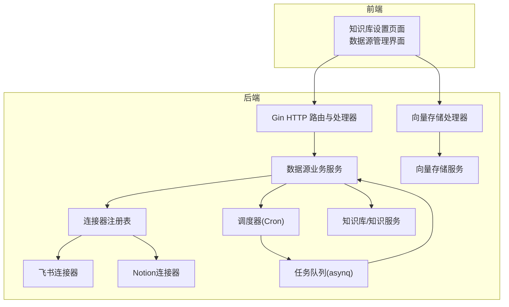
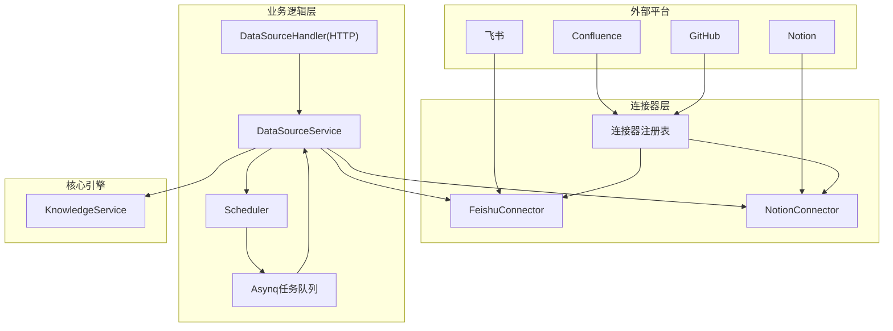
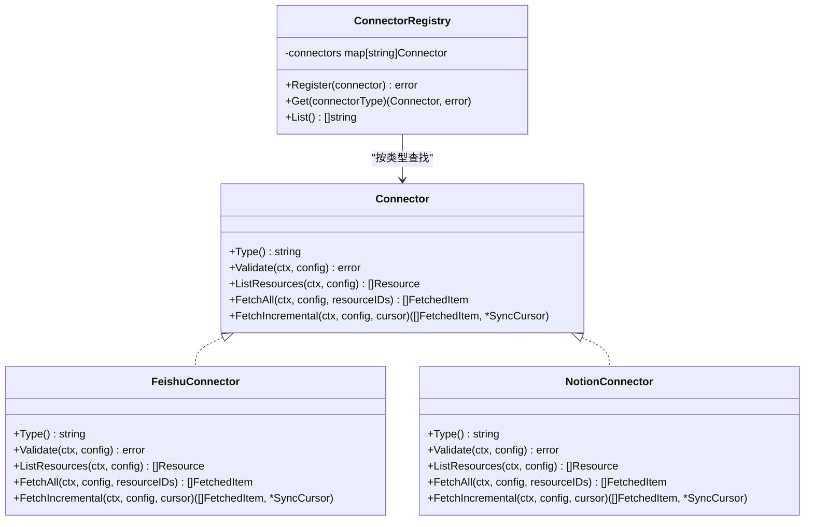
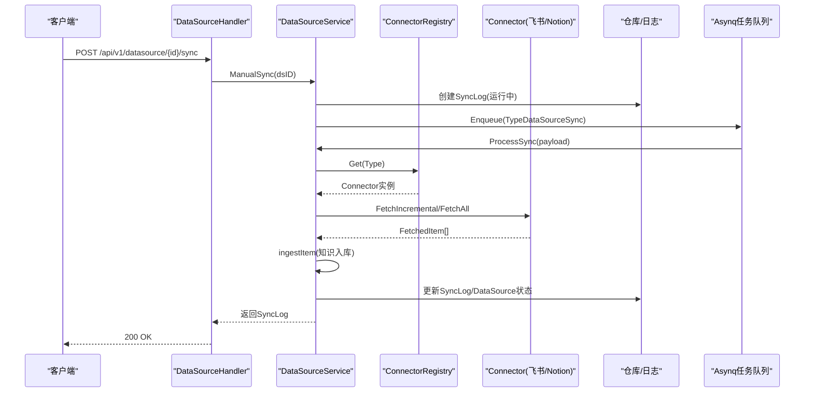
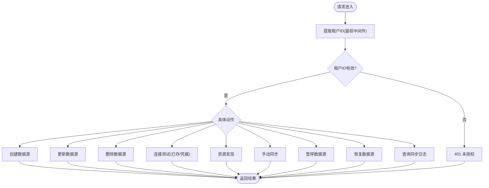
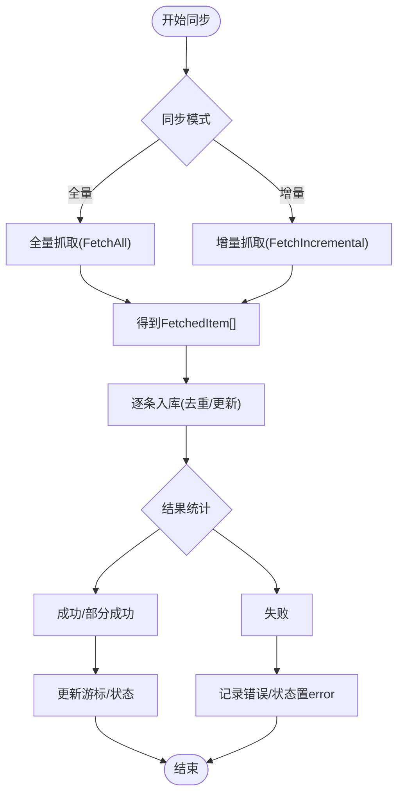
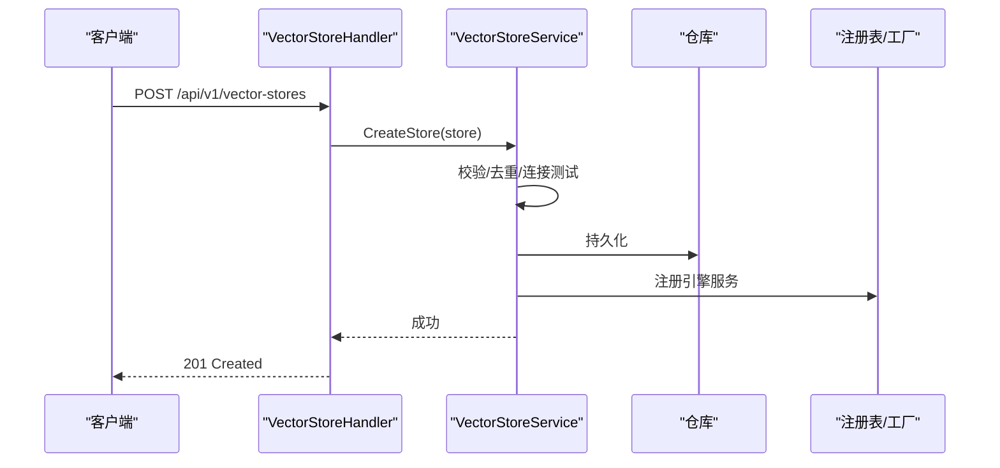
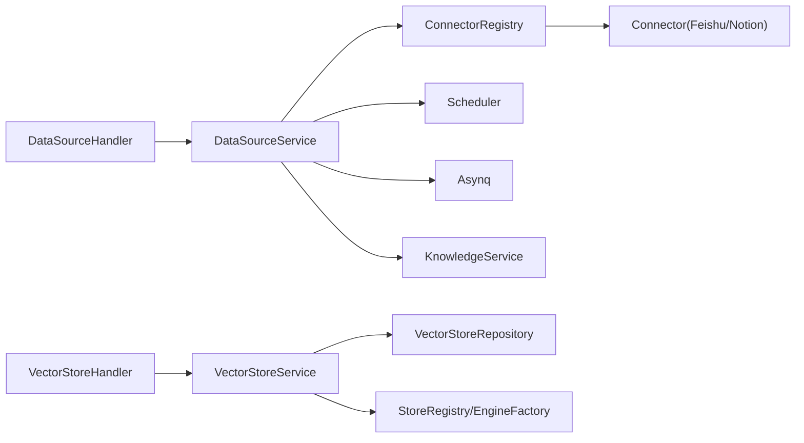

# 数据源处理器

<cite>
**本文引用的文件**
- [connector.go](file://internal/datasource/connector.go)
- [scheduler.go](file://internal/datasource/scheduler.go)
- [datasource.go](file://internal/datasource/connector/feishu/connector.go)
- [connector.go](file://internal/datasource/connector/notion/connector.go)
- [datasource_service.go](file://internal/application/service/datasource_service.go)
- [datasource.go](file://internal/handler/datasource.go)
- [datasource.go](file://internal/types/datasource.go)
- [task.go](file://internal/router/task.go)
- [vectorstore.go](file://internal/application/service/vectorstore.go)
- [vectorstore.go](file://internal/handler/vectorstore.go)
- [web_search.go](file://internal/handler/web_search.go)
- [router.go](file://internal/router/router.go)
- [errors.go](file://internal/datasource/errors.go)
- [数据源导入开发文档.md](file://docs/数据源导入开发文档.md)
</cite>

## 目录
1. [简介](#简介)
2. [项目结构](#项目结构)
3. [核心组件](#核心组件)
4. [架构总览](#架构总览)
5. [详细组件分析](#详细组件分析)
6. [依赖分析](#依赖分析)
7. [性能考虑](#性能考虑)
8. [故障排查指南](#故障排查指南)
9. [结论](#结论)
10. [附录](#附录)

## 简介
本技术文档面向 WeKnora 数据源处理器，系统性阐述数据源连接器的配置、同步与管理的 HTTP 接口实现；深入解析网页搜索、向量存储与文件存储的管理接口，包括连接测试、配置验证与状态监控；同时给出数据源自动同步的触发机制、增量更新策略与错误恢复处理方案，并提供多数据源集成的完整实践建议。

## 项目结构
WeKnora 将“数据源导入”作为核心能力之一，围绕“连接器接口 + 注册表 + 业务服务 + HTTP 处理器 + 调度器 + 任务队列”的分层架构组织代码。前端通过统一的 API 网关访问后端，后端通过 asynq 任务队列异步执行同步任务，确保高并发与可扩展性。

**图表来源**
- [datasource.go:1-557](file://internal/handler/datasource.go#L1-L557)
- [datasource_service.go:1-755](file://internal/application/service/datasource_service.go#L1-L755)
- [connector.go:1-208](file://internal/datasource/connector.go#L1-L208)
- [datasource.go:1-387](file://internal/datasource/connector/feishu/connector.go#L1-L387)
- [connector.go:1-800](file://internal/datasource/connector/notion/connector.go#L1-L800)
- [scheduler.go:1-211](file://internal/datasource/scheduler.go#L1-L211)
- [task.go:1-166](file://internal/router/task.go#L1-L166)
- [vectorstore.go:1-456](file://internal/handler/vectorstore.go#L1-L456)
- [vectorstore.go:1-190](file://internal/application/service/vectorstore.go#L1-L190)

**章节来源**
- [数据源导入开发文档.md:124-184](file://docs/数据源导入开发文档.md#L124-L184)

## 核心组件
- 连接器接口与注册表：定义统一的 Connector 接口，提供 Validate/ListResources/FetchAll/FetchIncremental 方法；通过注册表按类型动态查找连接器实例。
- 数据源业务服务：封装数据源 CRUD、连接测试、资源发现、手动同步、暂停/恢复、同步执行与入库处理。
- HTTP 处理器：暴露 REST API，负责鉴权、参数校验、租户隔离与响应返回。
- 调度器：基于 robfig/cron 的秒级调度器，结合 asynq 任务 ID 去重，保障多实例一致性。
- 任务队列：asynq 提供队列、重试与中间件（Langfuse 链路追踪）。
- 向量存储与文件存储：提供向量存储配置、连接测试与 CRUD；文件路由支持本地/对象存储等多提供商。

**章节来源**
- [connector.go:9-31](file://internal/datasource/connector.go#L9-L31)
- [datasource_service.go:21-56](file://internal/application/service/datasource_service.go#L21-L56)
- [datasource.go:14-29](file://internal/handler/datasource.go#L14-L29)
- [scheduler.go:18-52](file://internal/datasource/scheduler.go#L18-L52)
- [task.go:18-98](file://internal/router/task.go#L18-L98)
- [vectorstore.go:15-27](file://internal/handler/vectorstore.go#L15-L27)
- [vectorstore.go:16-34](file://internal/application/service/vectorstore.go#L16-L34)

## 架构总览
下图展示了数据源导入的整体架构：外部平台（飞书、Notion 等）通过连接器对接；业务服务协调连接测试、资源发现与同步；调度器与任务队列保证自动同步；最终通过知识服务完成文档解析、分块、向量化与索引。

**图表来源**
- [数据源导入开发文档.md:124-184](file://docs/数据源导入开发文档.md#L124-L184)
- [connector.go:33-74](file://internal/datasource/connector.go#L33-L74)
- [datasource.go:15-41](file://internal/datasource/connector/feishu/connector.go#L15-L41)
- [connector.go:23-45](file://internal/datasource/connector/notion/connector.go#L23-L45)
- [datasource_service.go:21-56](file://internal/application/service/datasource_service.go#L21-L56)
- [scheduler.go:18-52](file://internal/datasource/scheduler.go#L18-L52)
- [task.go:100-166](file://internal/router/task.go#L100-L166)

## 详细组件分析

### 连接器接口与注册表
- Connector 接口定义了类型标识、连接验证、资源列举、全量抓取与增量抓取方法，确保各平台实现一致的行为契约。
- ConnectorRegistry 提供注册、查询与元数据列表能力，支持优先级排序与能力标注（增量、Webhook、删除同步等）。
- 元数据注册表内置多种连接器类型（飞书、Notion、Confluence、语雀、GitHub、Google Drive、OneDrive、钉钉、Web 爬虫、Slack、IMAP、RSS），并标注认证方式与能力。

**图表来源**
- [connector.go:9-31](file://internal/datasource/connector.go#L9-L31)
- [connector.go:33-74](file://internal/datasource/connector.go#L33-L74)
- [datasource.go:15-41](file://internal/datasource/connector/feishu/connector.go#L15-L41)
- [connector.go:23-45](file://internal/datasource/connector/notion/connector.go#L23-L45)

**章节来源**
- [connector.go:9-208](file://internal/datasource/connector.go#L9-L208)
- [数据源导入开发文档.md:124-184](file://docs/数据源导入开发文档.md#L124-L184)

### 数据源业务服务
- 职责边界清晰：数据源 CRUD、连接测试、资源发现、手动同步、暂停/恢复、同步执行与入库处理。
- 自动同步：根据 Cron 表达式与任务 ID 去重，避免多实例重复执行；支持强制全量与增量模式切换。
- 增量策略：通过 SyncCursor 记录上次同步状态，对比变更检测（如文档修改时间、节点令牌等）。
- 错误恢复：同步失败时更新状态与错误消息；任务执行失败时回滚状态并保持幂等。

**图表来源**
- [datasource.go:366-396](file://internal/handler/datasource.go#L366-L396)
- [datasource_service.go:269-324](file://internal/application/service/datasource_service.go#L269-L324)
- [datasource_service.go:387-599](file://internal/application/service/datasource_service.go#L387-L599)
- [task.go:152-153](file://internal/router/task.go#L152-L153)

**章节来源**
- [datasource_service.go:202-385](file://internal/application/service/datasource_service.go#L202-L385)
- [datasource_service.go:387-599](file://internal/application/service/datasource_service.go#L387-L599)

### HTTP 接口与租户隔离
- 数据源管理接口：创建、查询、列表、更新、删除、连接测试、资源发现、手动同步、暂停/恢复、同步日志查询。
- 租户隔离：所有请求均需携带租户上下文，处理器在访问资源前进行租户归属校验，防止越权访问。
- 连接测试：支持对现有数据源进行连接测试，也支持仅凭类型与凭证进行无持久化测试。

**图表来源**
- [datasource.go:77-556](file://internal/handler/datasource.go#L77-L556)

**章节来源**
- [datasource.go:31-75](file://internal/handler/datasource.go#L31-L75)
- [datasource.go:77-556](file://internal/handler/datasource.go#L77-L556)

### 增量更新策略与错误恢复
- 增量策略：基于 SyncCursor 的游标记录上次同步状态；不同连接器采用各自策略（如飞书以节点编辑时间对比，Notion 以页面/记录最后编辑时间对比）。
- 错误恢复：同步失败时将状态置为 error 并记录错误消息；任务执行失败时回滚状态；暂停状态下保留状态不变，恢复后继续。
- 删除同步：支持可选的删除同步策略，但实际删除需显式在知识库界面操作，避免误删。

**图表来源**
- [datasource_service.go:451-599](file://internal/application/service/datasource_service.go#L451-L599)
- [datasource.go:115-227](file://internal/datasource/connector/feishu/connector.go#L115-L227)
- [connector.go:139-256](file://internal/datasource/connector/notion/connector.go#L139-L256)

**章节来源**
- [datasource_service.go:451-599](file://internal/application/service/datasource_service.go#L451-L599)
- [datasource.go:115-227](file://internal/datasource/connector/feishu/connector.go#L115-L227)
- [connector.go:139-256](file://internal/datasource/connector/notion/connector.go#L139-L256)

### 向量存储与文件存储管理接口
- 向量存储：支持创建、查询、更新（仅名称）、删除、类型枚举、连接测试（原始/已存）、环境变量注入只读配置合并。
- 文件存储：统一文件路由，支持本地与对象存储（MinIO 等），自动创建桶与安全校验。
- 网页搜索：提供可用搜索引擎类型列表，便于检索增强。

**图表来源**
- [vectorstore.go:80-128](file://internal/handler/vectorstore.go#L80-L128)
- [vectorstore.go:36-99](file://internal/application/service/vectorstore.go#L36-L99)
- [router.go:513-523](file://internal/router/router.go#L513-L523)

**章节来源**
- [vectorstore.go:15-456](file://internal/handler/vectorstore.go#L15-L456)
- [vectorstore.go:16-190](file://internal/application/service/vectorstore.go#L16-L190)
- [router.go:513-523](file://internal/router/router.go#L513-L523)

## 依赖分析
- 组件耦合：业务服务依赖连接器注册表与任务队列；HTTP 处理器依赖业务服务；调度器依赖仓库与任务队列。
- 外部依赖：asynq 用于任务队列与重试；robfig/cron 用于秒级调度；Langfuse 作为链路追踪中间件。
- 可能的循环依赖：当前结构通过接口解耦，未见直接循环依赖。

**图表来源**
- [datasource.go:14-29](file://internal/handler/datasource.go#L14-L29)
- [datasource_service.go:21-56](file://internal/application/service/datasource_service.go#L21-L56)
- [scheduler.go:27-51](file://internal/datasource/scheduler.go#L27-L51)
- [task.go:18-98](file://internal/router/task.go#L18-L98)
- [vectorstore.go:15-27](file://internal/handler/vectorstore.go#L15-L27)
- [vectorstore.go:16-34](file://internal/application/service/vectorstore.go#L16-L34)

**章节来源**
- [datasource_service.go:21-56](file://internal/application/service/datasource_service.go#L21-L56)
- [scheduler.go:27-51](file://internal/datasource/scheduler.go#L27-L51)
- [task.go:18-98](file://internal/router/task.go#L18-L98)
- [vectorstore.go:15-27](file://internal/handler/vectorstore.go#L15-L27)
- [vectorstore.go:16-34](file://internal/application/service/vectorstore.go#L16-L34)

## 性能考虑
- 异步执行：手动同步与定时同步均通过 asynq 异步执行，避免阻塞 HTTP 请求线程。
- 任务去重：基于“数据源ID+分钟级时间戳”的确定性任务 ID，结合 Redis 去重，防止多实例重复执行。
- 增量同步：通过游标与变更检测减少无效抓取，降低外部 API 压力与入库成本。
- 并发队列：队列分级（critical/default/low），高优任务优先处理，保障关键路径性能。
- 连接测试：向量存储在创建时进行连接测试并自动识别版本，避免后续协议不匹配导致的失败重试。

**章节来源**
- [scheduler.go:132-203](file://internal/datasource/scheduler.go#L132-L203)
- [task.go:67-98](file://internal/router/task.go#L67-L98)
- [vectorstore.go:75-85](file://internal/application/service/vectorstore.go#L75-L85)

## 故障排查指南
- 常见错误类型：连接器为空、类型为空、未找到连接器、数据源不存在、配置无效、同步失败、同步取消、资源未找到、知识库未找到、同步日志未找到。
- 排查步骤：
  - 确认租户上下文与权限；
  - 使用“测试连接”接口验证凭证与外部系统连通性；
  - 查看同步日志详情，定位失败原因；
  - 检查 Cron 表达式与调度器状态；
  - 核对增量游标与资源选择范围；
  - 对于向量存储，确认连接参数与版本识别。

**章节来源**
- [errors.go:1-32](file://internal/datasource/errors.go#L1-L32)
- [datasource.go:261-329](file://internal/handler/datasource.go#L261-L329)
- [datasource_service.go:202-238](file://internal/application/service/datasource_service.go#L202-L238)

## 结论
WeKnora 数据源处理器以“接口抽象 + 注册表 + 业务服务 + HTTP 处理器 + 调度器 + 任务队列”的架构实现了对多平台数据源的统一接入与自动化同步。通过增量同步、连接测试、租户隔离与错误恢复机制，系统在保证稳定性的同时具备良好的可扩展性与运维可观测性。结合向量存储与文件存储的统一管理接口，可构建完整的多数据源集成与检索增强方案。

## 附录

### 数据源配置示例（字段说明）
- 基本信息：名称、所属知识库、连接器类型、同步模式（增量/全量）、冲突策略（覆盖/跳过）、是否同步删除。
- 凭证与资源：按连接器类型填写凭证（如飞书 App ID/Secret），选择资源集合（如 Wiki 空间）。
- 调度：配置 Cron 表达式与日志保留天数。
- 状态与结果：系统自动维护最近一次同步时间、游标与结果摘要。

**章节来源**
- [数据源导入开发文档.md:27-86](file://docs/数据源导入开发文档.md#L27-L86)
- [datasource.go:49-114](file://internal/types/datasource.go#L49-L114)

### 同步任务管理要点
- 手动同步：立即创建运行中的同步日志并入队任务。
- 定时同步：启动时加载活跃数据源并注册 Cron；每分钟生成确定性任务 ID，避免重复执行。
- 任务执行：根据模式选择全量或增量抓取，逐条入库并统计结果，更新游标与状态。

**章节来源**
- [datasource_service.go:269-324](file://internal/application/service/datasource_service.go#L269-L324)
- [scheduler.go:54-75](file://internal/datasource/scheduler.go#L54-L75)
- [task.go:152-153](file://internal/router/task.go#L152-L153)