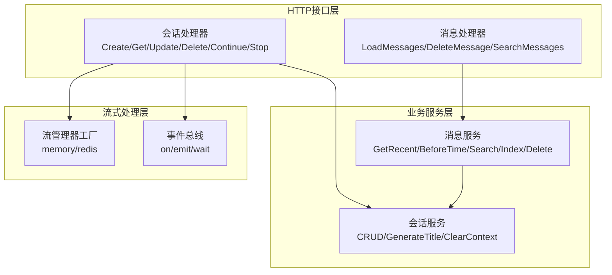
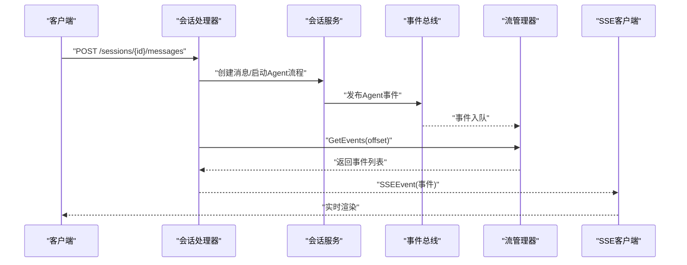
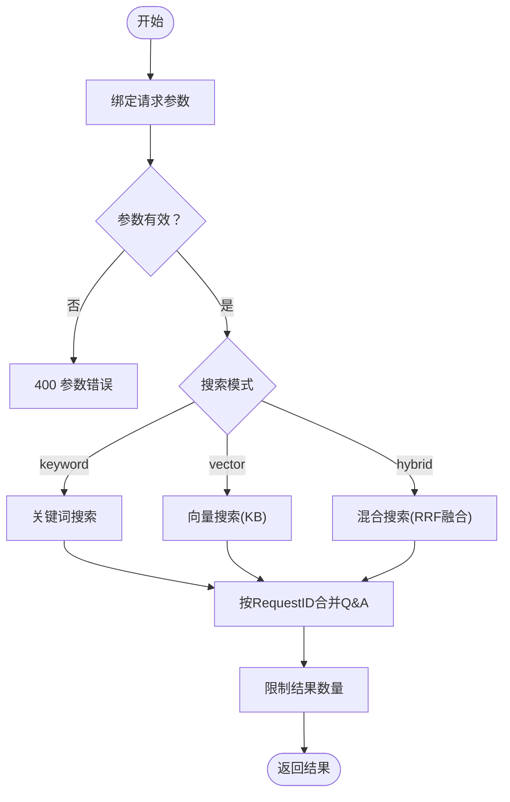
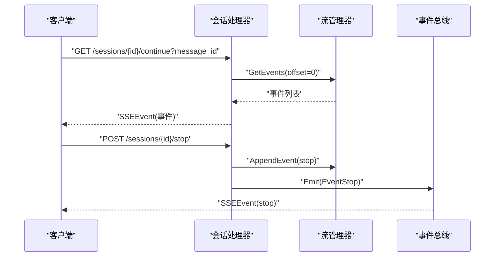
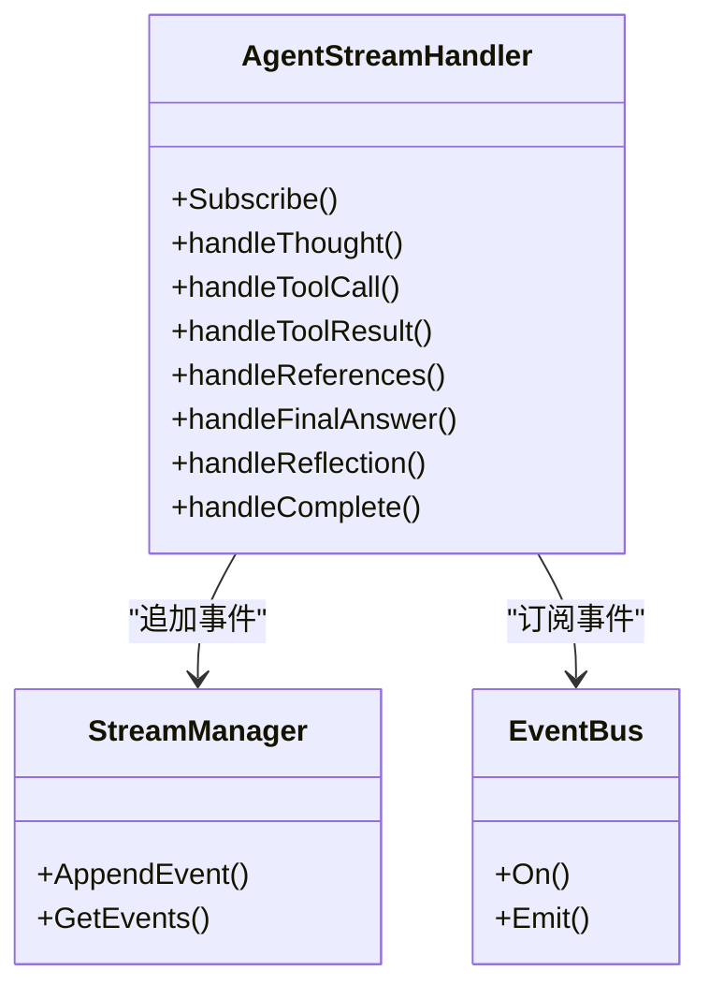
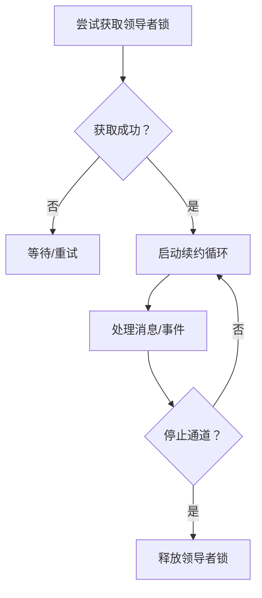
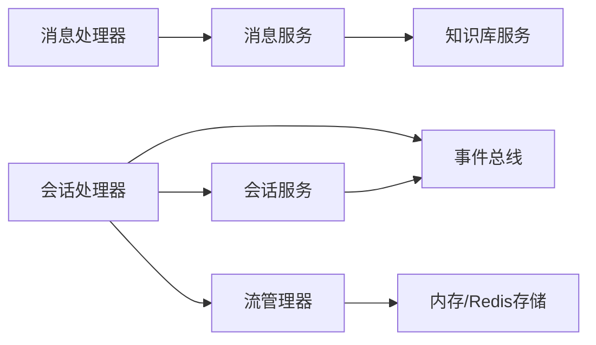

# 消息处理器

<cite>
**本文档引用的文件**
- [internal/handler/message.go](file://internal/handler/message.go)
- [internal/handler/session/handler.go](file://internal/handler/session/handler.go)
- [internal/handler/session/stream.go](file://internal/handler/session/stream.go)
- [internal/handler/session/agent_stream_handler.go](file://internal/handler/session/agent_stream_handler.go)
- [internal/application/service/message.go](file://internal/application/service/message.go)
- [internal/application/service/session.go](file://internal/application/service/session.go)
- [internal/models/chat/sse_reader.go](file://internal/models/chat/sse_reader.go)
- [internal/stream/factory.go](file://internal/stream/factory.go)
- [internal/event/event.go](file://internal/event/event.go)
- [internal/types/message.go](file://internal/types/message.go)
- [client/session.go](file://client/session.go)
- [internal/im/service.go](file://internal/im/service.go)
- [internal/im/wecom/longconn.go](file://internal/im/wecom/longconn.go)
</cite>

## 目录
1. [简介](#简介)
2. [项目结构](#项目结构)
3. [核心组件](#核心组件)
4. [架构总览](#架构总览)
5. [详细组件分析](#详细组件分析)
6. [依赖关系分析](#依赖关系分析)
7. [性能考虑](#性能考虑)
8. [故障排查指南](#故障排查指南)
9. [结论](#结论)
10. [附录](#附录)

## 简介
本技术文档面向WeKnora消息处理器，系统性阐述消息发送、接收、历史记录查询与会话管理的HTTP接口实现；深入解析流式响应处理机制、WebSocket连接管理与实时消息传递；对比Quick Q&A与智能推理两种模式的消息处理差异，并说明工具调用结果的处理流程。文档提供API端点示例、请求/响应格式与状态码说明，完整展示消息处理的生命周期。

## 项目结构
WeKnora采用分层架构：HTTP路由层（handler）、业务服务层（service）、应用服务层（application service）、基础设施层（stream/event/repository等）。消息处理涉及以下关键模块：
- HTTP接口层：消息与会话的REST接口
- 业务服务层：消息检索、会话管理、知识库检索与索引
- 流式处理层：SSE事件流、内存/Redis流管理器
- 事件总线：统一事件发布订阅，驱动流式输出
- IM集成：多平台即时通讯通道（长连接/轮询）

图表来源
- [internal/handler/message.go:34-253](file://internal/handler/message.go#L34-L253)
- [internal/handler/session/handler.go:66-443](file://internal/handler/session/handler.go#L66-L443)
- [internal/application/service/message.go:67-800](file://internal/application/service/message.go#L67-L800)
- [internal/application/service/session.go:81-527](file://internal/application/service/session.go#L81-L527)
- [internal/stream/factory.go:17-37](file://internal/stream/factory.go#L17-L37)
- [internal/event/event.go:80-231](file://internal/event/event.go#L80-L231)

章节来源
- [internal/handler/message.go:34-253](file://internal/handler/message.go#L34-L253)
- [internal/handler/session/handler.go:66-443](file://internal/handler/session/handler.go#L66-L443)
- [internal/application/service/message.go:67-800](file://internal/application/service/message.go#L67-L800)
- [internal/application/service/session.go:81-527](file://internal/application/service/session.go#L81-L527)
- [internal/stream/factory.go:17-37](file://internal/stream/factory.go#L17-L37)
- [internal/event/event.go:80-231](file://internal/event/event.go#L80-L231)

## 核心组件
- 消息处理器（MessageHandler）
  - 提供加载消息历史、删除消息、搜索历史、获取聊天历史知识库统计等接口
  - 支持分页与时间筛选，支持关键词/向量/混合搜索模式
- 会话处理器（Session Handler）
  - 提供会话CRUD、继续流式响应、停止生成、清空消息等接口
  - 通过流管理器与事件总线实现SSE实时推送
- 消息服务（MessageService）
  - 实现消息检索、索引到聊天历史知识库、删除清理、统计查询
  - 支持关键词与向量混合检索，支持重排序与配对消息合并
- 会话服务（SessionService）
  - 会话生命周期管理、标题生成、上下文清理
- 流管理器（StreamManager）
  - 内存/Redis两种实现，支持事件追加、按偏移获取事件
- 事件总线（EventBus）
  - 统一事件发布订阅，支持同步/异步模式，驱动Agent流式事件

章节来源
- [internal/handler/message.go:34-253](file://internal/handler/message.go#L34-L253)
- [internal/handler/session/handler.go:66-443](file://internal/handler/session/handler.go#L66-L443)
- [internal/application/service/message.go:67-800](file://internal/application/service/message.go#L67-L800)
- [internal/application/service/session.go:81-527](file://internal/application/service/session.go#L81-L527)
- [internal/stream/factory.go:17-37](file://internal/stream/factory.go#L17-L37)
- [internal/event/event.go:80-231](file://internal/event/event.go#L80-L231)

## 架构总览
消息处理的端到端流程如下：
- 客户端发起HTTP请求（消息历史/会话操作）
- 处理器调用对应服务层方法
- 服务层执行业务逻辑（数据库/知识库/模型）
- 事件总线发布Agent事件，流管理器存储事件
- SSE客户端轮询或WebSocket监听，实时接收事件流
- IM通道（长连接/轮询）通过适配器与领导者选举保障一致性

图表来源
- [internal/handler/session/handler.go:66-443](file://internal/handler/session/handler.go#L66-L443)
- [internal/application/service/session.go:81-527](file://internal/application/service/session.go#L81-L527)
- [internal/event/event.go:120-202](file://internal/event/event.go#L120-L202)
- [internal/stream/factory.go:17-37](file://internal/stream/factory.go#L17-L37)

## 详细组件分析

### 消息接口与历史查询
- 加载消息历史
  - 方法：GET /messages/{session_id}/load
  - 查询参数：limit（默认20）、before_time（RFC3339Nano）
  - 返回：消息数组（最近或指定时间前）
- 删除消息
  - 方法：DELETE /messages/{session_id}/{id}
  - 返回：删除成功标识
- 搜索历史
  - 方法：POST /messages/search
  - 请求体：query（必填）、mode（keyword/vector/hybrid，默认hybrid）、limit（默认20）、session_ids（可选）
  - 返回：Q&A对合并后的搜索结果
- 聊天历史知识库统计
  - 方法：GET /messages/chat-history-stats
  - 返回：启用状态、嵌入模型ID、知识库ID/名称、索引消息数等

图表来源
- [internal/handler/message.go:161-213](file://internal/handler/message.go#L161-L213)
- [internal/application/service/message.go:465-537](file://internal/application/service/message.go#L465-L537)

章节来源
- [internal/handler/message.go:34-253](file://internal/handler/message.go#L34-L253)
- [internal/application/service/message.go:465-537](file://internal/application/service/message.go#L465-L537)

### 会话管理与实时流式响应
- 会话CRUD
  - POST /sessions、GET /sessions、PUT /sessions/{id}、DELETE /sessions/{id}
  - GET /sessions（分页）、DELETE /sessions/batch（批量）
- 继续流式响应
  - GET /sessions/{session_id}/continue?message_id={id}
  - SSE：初始回放事件，随后轮询新事件，直到收到complete事件
- 停止生成
  - POST /sessions/{session_id}/stop
  - 写入stop事件，触发事件总线取消上下文
- 清空会话消息
  - DELETE /sessions/{id}/messages
  - 同步清理消息并异步清理聊天历史知识库条目

图表来源
- [internal/handler/session/stream.go:18-176](file://internal/handler/session/stream.go#L18-L176)
- [internal/handler/session/stream.go:178-294](file://internal/handler/session/stream.go#L178-L294)
- [internal/event/event.go:120-202](file://internal/event/event.go#L120-L202)

章节来源
- [internal/handler/session/handler.go:66-443](file://internal/handler/session/handler.go#L66-L443)
- [internal/handler/session/stream.go:18-176](file://internal/handler/session/stream.go#L18-L176)
- [internal/handler/session/stream.go:178-294](file://internal/handler/session/stream.go#L178-L294)
- [internal/event/event.go:120-202](file://internal/event/event.go#L120-L202)

### Agent事件流与工具调用处理
AgentStreamHandler订阅Agent事件，将事件转换为SSE响应：
- 思考事件（thought）：增量输出思维过程，完成后计算耗时
- 工具调用（tool_call/tool_result）：记录工具名、参数、结果或错误
- 引用（references）：聚合知识引用，更新消息引用列表
- 最终答案（final_answer）：累积答案，支持回退模式标记
- 反思（reflection）：Agent自我反思
- 完成（complete）：标记流结束，补充步骤与耗时信息

图表来源
- [internal/handler/session/agent_stream_handler.go:15-506](file://internal/handler/session/agent_stream_handler.go#L15-L506)
- [internal/stream/factory.go:17-37](file://internal/stream/factory.go#L17-L37)
- [internal/event/event.go:103-157](file://internal/event/event.go#L103-L157)

章节来源
- [internal/handler/session/agent_stream_handler.go:15-506](file://internal/handler/session/agent_stream_handler.go#L15-L506)
- [internal/stream/factory.go:17-37](file://internal/stream/factory.go#L17-L37)
- [internal/event/event.go:103-157](file://internal/event/event.go#L103-L157)

### Quick Q&A与智能推理模式差异
- Quick Q&A模式
  - 直接检索与生成，不进行复杂规划与工具调用
  - 流式事件主要为思考与最终答案，事件粒度较粗
- 智能推理模式
  - 包含计划（plan）、步骤（step）、工具调用（tool_call/tool_result）、引用（references）等细粒度事件
  - 支持回退（fallback）标记与重试策略
  - 事件总线驱动，前端可逐步渲染每个阶段

章节来源
- [internal/handler/session/agent_stream_handler.go:71-333](file://internal/handler/session/agent_stream_handler.go#L71-L333)
- [internal/application/service/message.go:349-390](file://internal/application/service/message.go#L349-L390)

### 工具调用结果处理流程
- 工具调用事件：记录工具名、参数、调用ID
- 工具结果事件：根据成功/失败输出不同响应类型，携带输出、错误、耗时、格式化结果等元数据
- 结果合并：将工具结果数据合并到SSE响应的元数据中，便于前端渲染

章节来源
- [internal/handler/session/agent_stream_handler.go:119-211](file://internal/handler/session/agent_stream_handler.go#L119-L211)

### WebSocket连接管理与IM集成
- WebSocket领导者选举：通过Redis锁实现多实例领导者选择，避免双写
- 领导者续约：周期性刷新TTL，确保连接稳定
- 长连接/轮询：支持websocket与longpoll模式，停止通道时区分释放策略
- 微信企业微信长连接：在收到回复后构造流式帧并通过WebSocket发送

图表来源
- [internal/im/service.go:522-574](file://internal/im/service.go#L522-L574)
- [internal/im/wecom/longconn.go:226-254](file://internal/im/wecom/longconn.go#L226-L254)

章节来源
- [internal/im/service.go:464-574](file://internal/im/service.go#L464-L574)
- [internal/im/wecom/longconn.go:226-254](file://internal/im/wecom/longconn.go#L226-L254)

## 依赖关系分析
- 处理器依赖服务接口，服务层依赖仓库与外部能力（知识库、模型、事件总线）
- 流管理器通过环境变量选择内存或Redis实现，保证分布式一致性
- SSE客户端通过SSEReader解析事件，支持断线重连与事件聚合

图表来源
- [internal/handler/message.go:17-32](file://internal/handler/message.go#L17-L32)
- [internal/handler/session/handler.go:16-29](file://internal/handler/session/handler.go#L16-L29)
- [internal/application/service/message.go:20-31](file://internal/application/service/message.go#L20-L31)
- [internal/application/service/session.go:26-43](file://internal/application/service/session.go#L26-L43)
- [internal/stream/factory.go:17-37](file://internal/stream/factory.go#L17-L37)

章节来源
- [internal/handler/message.go:17-32](file://internal/handler/message.go#L17-L32)
- [internal/handler/session/handler.go:16-29](file://internal/handler/session/handler.go#L16-L29)
- [internal/application/service/message.go:20-31](file://internal/application/service/message.go#L20-L31)
- [internal/application/service/session.go:26-43](file://internal/application/service/session.go#L26-L43)
- [internal/stream/factory.go:17-37](file://internal/stream/factory.go#L17-L37)

## 性能考虑
- SSE轮询间隔：默认100ms，平衡延迟与负载
- 事件去重与聚合：按事件ID与类型聚合，减少前端渲染压力
- 分布式一致性：Redis领导者选举与续约，避免双写与消息丢失
- 流管理器选择：生产环境建议使用Redis实现，提升可扩展性
- 搜索性能：关键词与向量混合搜索，RRF融合与重排序优化召回质量

## 故障排查指南
- SSE连接异常
  - 检查ContinueStream接口是否正确设置SSE头并持续轮询
  - 确认事件总线未阻塞，必要时切换异步模式
- 停止生成无效
  - 确认stop事件已写入流管理器并触发事件总线
  - 检查客户端是否正确接收stop事件并终止渲染
- 搜索结果为空
  - 确认聊天历史知识库配置与嵌入模型可用
  - 检查混合搜索阈值与重排序参数
- IM通道冲突
  - 检查Redis领导者锁状态与续约循环
  - 长连接/轮询停止时释放策略是否正确

章节来源
- [internal/handler/session/stream.go:18-176](file://internal/handler/session/stream.go#L18-L176)
- [internal/handler/session/stream.go:178-294](file://internal/handler/session/stream.go#L178-L294)
- [internal/im/service.go:522-574](file://internal/im/service.go#L522-L574)

## 结论
WeKnora消息处理器通过清晰的分层设计与事件驱动架构，实现了消息历史管理、会话控制与实时流式输出的完整闭环。Quick Q&A与智能推理两种模式覆盖不同场景需求，工具调用结果的结构化处理提升了前端渲染灵活性。结合SSE与WebSocket的多种传输方式，系统在性能与可靠性之间取得良好平衡。

## 附录

### API端点一览与状态码
- 消息历史
  - GET /messages/{session_id}/load
    - 查询参数：limit（默认20）、before_time（RFC3339Nano）
    - 成功：200，返回data（消息数组）
    - 失败：400（参数错误）、500（内部错误）
- 删除消息
  - DELETE /messages/{session_id}/{id}
    - 成功：200，返回success与message
    - 失败：500（内部错误）
- 搜索历史
  - POST /messages/search
    - 请求体：query（必填）、mode（keyword/vector/hybrid，默认hybrid）、limit（默认20）、session_ids（可选）
    - 成功：200，返回data（搜索结果）
    - 失败：400（参数错误）、500（内部错误）
- 聊天历史知识库统计
  - GET /messages/chat-history-stats
    - 成功：200，返回data（统计信息）
- 会话管理
  - POST /sessions：创建会话
  - GET /sessions：分页获取会话列表
  - GET /sessions/{id}：获取会话详情
  - PUT /sessions/{id}：更新会话
  - DELETE /sessions/{id}：删除会话
  - DELETE /sessions/batch：批量删除会话
  - 成功：200/201，返回data或success/message
  - 失败：400（参数错误）、404（会话不存在）、500（内部错误）
- 继续流式响应
  - GET /sessions/{session_id}/continue?message_id={id}
  - 成功：200（text/event-stream），返回SSE事件
  - 失败：404（会话/消息不存在）、500（内部错误）
- 停止生成
  - POST /sessions/{session_id}/stop
  - 成功：200，返回success/message
  - 失败：404（会话/消息不存在）、500（内部错误）
- 清空会话消息
  - DELETE /sessions/{id}/messages
  - 成功：200，返回success/message
  - 失败：400/404/500

章节来源
- [internal/handler/message.go:34-253](file://internal/handler/message.go#L34-L253)
- [internal/handler/session/handler.go:66-443](file://internal/handler/session/handler.go#L66-L443)
- [internal/handler/session/stream.go:18-176](file://internal/handler/session/stream.go#L18-L176)
- [internal/handler/session/stream.go:178-294](file://internal/handler/session/stream.go#L178-L294)

### SSE事件格式与解析
- 事件格式
  - SSEEvent：包含Data字节与Done标志
  - SSEReader：逐行扫描，识别data行与[DONE]结束标记
- 客户端解析
  - 使用bufio按行读取，遇到空行视为事件结束，解析JSON并回调处理

章节来源
- [internal/models/chat/sse_reader.go:9-64](file://internal/models/chat/sse_reader.go#L9-L64)
- [client/session.go:274-315](file://client/session.go#L274-L315)