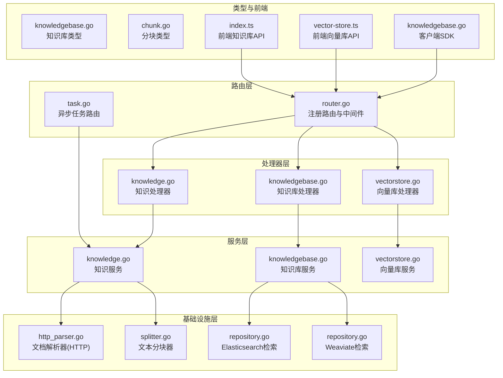
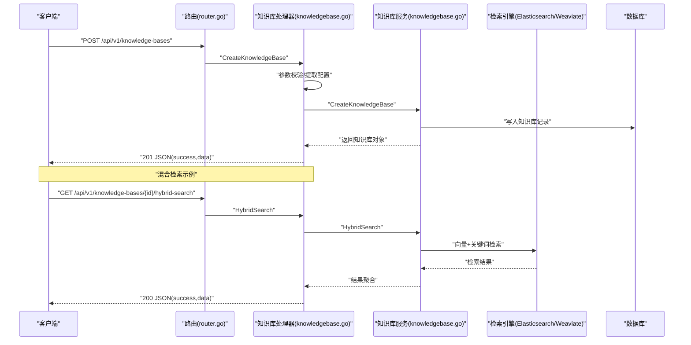
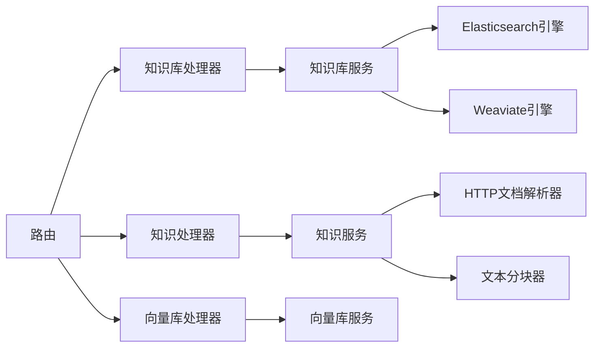

# 知识库处理器

<cite>
**本文引用的文件**
- [knowledgebase.go](file://internal/handler/knowledgebase.go)
- [knowledge.go](file://internal/handler/knowledge.go)
- [vectorstore.go](file://internal/handler/vectorstore.go)
- [router.go](file://internal/router/router.go)
- [task.go](file://internal/router/task.go)
- [knowledgebase.go](file://internal/application/service/knowledgebase.go)
- [knowledge.go](file://internal/application/service/knowledge.go)
- [vectorstore.go](file://internal/application/service/vectorstore.go)
- [knowledgebase.go](file://internal/types/knowledgebase.go)
- [chunk.go](file://internal/types/chunk.go)
- [http_parser.go](file://internal/infrastructure/docparser/http_parser.go)
- [splitter.go](file://internal/infrastructure/chunker/splitter.go)
- [repository.go](file://internal/application/repository/retriever/elasticsearch/v8/repository.go)
- [repository.go](file://internal/application/repository/retriever/weaviate/repository.go)
- [index.ts](file://frontend/src/api/knowledge-base/index.ts)
- [vector-store.ts](file://frontend/src/api/vector-store.ts)
- [knowledgebase.go](file://client/knowledgebase.go)
</cite>

## 目录
1. [简介](#简介)
2. [项目结构](#项目结构)
3. [核心组件](#核心组件)
4. [架构总览](#架构总览)
5. [详细组件分析](#详细组件分析)
6. [依赖分析](#依赖分析)
7. [性能考虑](#性能考虑)
8. [故障排查指南](#故障排查指南)
9. [结论](#结论)
10. [附录](#附录)

## 简介
本技术文档围绕 WeKnora 知识库处理器，系统性阐述知识库的 CRUD 接口实现、文档上传处理流程、分块与向量化存储、以及检索接口设计。文档覆盖从 HTTP 请求入口、权限校验、业务服务层、持久化与异步任务队列、到向量检索引擎的完整链路，并提供 API 端点定义、参数校验、响应格式与错误处理策略，同时给出实际工作流示例的代码路径指引。

## 项目结构
WeKnora 采用分层架构：路由层负责 HTTP 路由与中间件；处理器层封装业务接口；服务层承载核心业务逻辑；基础设施层提供文档解析、分块与向量检索实现；类型层定义数据结构与配置；前端提供 API 调用示例。

图表来源
- [router.go:72-161](file://internal/router/router.go#L72-L161)
- [task.go:109-139](file://internal/router/task.go#L109-L139)
- [knowledgebase.go:25-49](file://internal/handler/knowledgebase.go#L25-L49)
- [knowledge.go:30-37](file://internal/handler/knowledge.go#L30-L37)
- [vectorstore.go:15-27](file://internal/handler/vectorstore.go#L15-L27)
- [knowledgebase.go:21-62](file://internal/application/service/knowledgebase.go#L21-L62)
- [knowledge.go:61-88](file://internal/application/service/knowledge.go#L61-L88)
- [vectorstore.go:16-34](file://internal/application/service/vectorstore.go#L16-L34)
- [http_parser.go:57-102](file://internal/infrastructure/docparser/http_parser.go#L57-L102)
- [splitter.go:14-44](file://internal/infrastructure/chunker/splitter.go#L14-L44)
- [repository.go:384-417](file://internal/application/repository/retriever/elasticsearch/v8/repository.go#L384-L417)
- [repository.go:561-596](file://internal/application/repository/retriever/weaviate/repository.go#L561-L596)
- [knowledgebase.go:41-108](file://internal/types/knowledgebase.go#L41-L108)
- [chunk.go:106-166](file://internal/types/chunk.go#L106-L166)
- [index.ts:146-224](file://frontend/src/api/knowledge-base/index.ts#L146-L224)
- [vector-store.ts:50-64](file://frontend/src/api/vector-store.ts#L50-L64)
- [knowledgebase.go:198-236](file://client/knowledgebase.go#L198-L236)

章节来源
- [router.go:72-161](file://internal/router/router.go#L72-L161)
- [knowledgebase.go:25-49](file://internal/handler/knowledgebase.go#L25-L49)
- [knowledge.go:30-37](file://internal/handler/knowledge.go#L30-L37)
- [vectorstore.go:15-27](file://internal/handler/vectorstore.go#L15-L27)

## 核心组件
- 路由与中间件：统一注册 v1 API，挂载认证、日志、错误处理等中间件，健康检查与 Swagger 文档按环境启用。
- 知识库处理器：提供知识库 CRUD、混合检索、复制与进度查询等接口。
- 知识处理器：提供文件/URL/手工录入知识，知识列表、清空、下载预览等接口。
- 向量库处理器：提供向量库 CRUD、类型枚举、连接测试等接口。
- 服务层：封装业务规则、权限校验、异步任务编排、存储与检索引擎交互。
- 基础设施：文档解析器(HTTP)、文本分块器、多种检索引擎适配器。
- 类型定义：知识库、分块、向量库、检索参数等数据结构。
- 前端与客户端：提供 API 调用示例与 SDK 方法。

章节来源
- [router.go:72-161](file://internal/router/router.go#L72-L161)
- [knowledgebase.go:104-149](file://internal/handler/knowledgebase.go#L104-L149)
- [knowledge.go:30-37](file://internal/handler/knowledge.go#L30-L37)
- [vectorstore.go:80-128](file://internal/handler/vectorstore.go#L80-L128)
- [knowledgebase.go:21-62](file://internal/application/service/knowledgebase.go#L21-L62)
- [knowledge.go:61-88](file://internal/application/service/knowledge.go#L61-L88)
- [http_parser.go:57-102](file://internal/infrastructure/docparser/http_parser.go#L57-L102)
- [splitter.go:14-44](file://internal/infrastructure/chunker/splitter.go#L14-L44)
- [knowledgebase.go:41-108](file://internal/types/knowledgebase.go#L41-L108)
- [chunk.go:106-166](file://internal/types/chunk.go#L106-L166)
- [index.ts:146-224](file://frontend/src/api/knowledge-base/index.ts#L146-L224)
- [vector-store.ts:50-64](file://frontend/src/api/vector-store.ts#L50-L64)
- [knowledgebase.go:198-236](file://client/knowledgebase.go#L198-L236)

## 架构总览
WeKnora 的知识库处理链路自上而下分为：HTTP 入口 -> 处理器 -> 服务层 -> 基础设施 -> 持久化/检索引擎。异步任务通过 Asynq 队列解耦重负载操作（如知识库删除清理、FAQ 导入、文档解析等）。

图表来源
- [router.go:131-158](file://internal/router/router.go#L131-L158)
- [knowledgebase.go:104-149](file://internal/handler/knowledgebase.go#L104-L149)
- [knowledgebase.go:51-102](file://internal/handler/knowledgebase.go#L51-L102)
- [knowledgebase.go:74-99](file://internal/application/service/knowledgebase.go#L74-L99)
- [repository.go:384-417](file://internal/application/repository/retriever/elasticsearch/v8/repository.go#L384-L417)
- [repository.go:561-596](file://internal/application/repository/retriever/weaviate/repository.go#L561-L596)

## 详细组件分析

### 知识库处理器（CRUD 与检索）
- 创建知识库
  - 端点：POST /api/v1/knowledge-bases
  - 参数：JSON 请求体包含名称、类型、配置等
  - 校验：提取配置校验、服务层默认值填充
  - 响应：201 返回成功与知识库对象
  - 错误：400 参数错误，500 服务器错误
  - 参考路径：[知识库处理器-创建:104-149](file://internal/handler/knowledgebase.go#L104-L149)，[知识库服务-创建:74-99](file://internal/application/service/knowledgebase.go#L74-L99)

- 查询知识库详情
  - 端点：GET /api/v1/knowledge-bases/{id}
  - 权限：支持共享智能体参数 agent_id 校验
  - 响应：包含权限补充字段（仅共享场景）
  - 参考路径：[知识库处理器-详情:248-286](file://internal/handler/knowledgebase.go#L248-L286)

- 列出知识库
  - 端点：GET /api/v1/knowledge-bases
  - 支持：共享智能体筛选（agent_id），工具能力过滤
  - 参考路径：[知识库处理器-列表:288-413](file://internal/handler/knowledgebase.go#L288-L413)

- 更新知识库
  - 端点：PUT /api/v1/knowledge-bases/{id}
  - 权限：仅管理员/编辑者
  - 参数：名称、描述、配置（含索引策略、FAQ/Wiki 配置等）
  - 参考路径：[知识库处理器-更新:459-514](file://internal/handler/knowledgebase.go#L459-L514)，[知识库服务-更新:266-333](file://internal/application/service/knowledgebase.go#L266-L333)

- 删除知识库
  - 端点：DELETE /api/v1/knowledge-bases/{id}
  - 权限：仅拥有者（管理员且租户匹配）
  - 行为：软删除 + 异步清理（嵌入、分块、文件、图数据）
  - 参考路径：[知识库处理器-删除:516-562](file://internal/handler/knowledgebase.go#L516-L562)，[知识库服务-删除:352-408](file://internal/application/service/knowledgebase.go#L352-L408)

- 置顶/取消置顶
  - 端点：PUT /api/v1/knowledge-bases/{id}/pin
  - 参考路径：[知识库处理器-置顶:415-450](file://internal/handler/knowledgebase.go#L415-L450)

- 混合检索
  - 端点：GET /api/v1/knowledge-bases/{id}/hybrid-search
  - 功能：向量 + 关键词联合检索
  - 参考路径：[知识库处理器-混合检索:51-102](file://internal/handler/knowledgebase.go#L51-L102)，[服务层检索实现:74-99](file://internal/application/service/knowledgebase.go#L74-L99)

- 复制知识库（异步）
  - 端点：POST /api/v1/knowledge-bases/copy
  - 行为：校验跨租户限制，入队 KBClone 任务，保存初始进度
  - 参考路径：[知识库处理器-复制:578-706](file://internal/handler/knowledgebase.go#L578-L706)，[任务路由:131-133](file://internal/router/task.go#L131-L133)

- 复制进度查询
  - 端点：GET /api/v1/knowledge-bases/copy/progress/{task_id}
  - 参考路径：[知识库处理器-进度查询:708-741](file://internal/handler/knowledgebase.go#L708-L741)

章节来源
- [knowledgebase.go:51-102](file://internal/handler/knowledgebase.go#L51-L102)
- [knowledgebase.go:104-149](file://internal/handler/knowledgebase.go#L104-L149)
- [knowledgebase.go:248-286](file://internal/handler/knowledgebase.go#L248-L286)
- [knowledgebase.go:288-413](file://internal/handler/knowledgebase.go#L288-L413)
- [knowledgebase.go:415-450](file://internal/handler/knowledgebase.go#L415-L450)
- [knowledgebase.go:459-514](file://internal/handler/knowledgebase.go#L459-L514)
- [knowledgebase.go:516-562](file://internal/handler/knowledgebase.go#L516-L562)
- [knowledgebase.go:578-706](file://internal/handler/knowledgebase.go#L578-L706)
- [knowledgebase.go:708-741](file://internal/handler/knowledgebase.go#L708-L741)
- [knowledgebase.go:74-99](file://internal/application/service/knowledgebase.go#L74-L99)
- [task.go:131-133](file://internal/router/task.go#L131-L133)

### 知识处理器（文档上传与处理）
- 端点
  - POST /api/v1/knowledge-bases/{id}/knowledge/file：从文件创建知识
  - POST /api/v1/knowledge-bases/{id}/knowledge/url：从 URL 创建知识
  - POST /api/v1/knowledge-bases/{id}/knowledge/manual：手工 Markdown 录入
  - GET /api/v1/knowledge-bases/{id}/knowledge：列出知识
  - DELETE /api/v1/knowledge-bases/{id}/knowledge：清空知识库内容
- 处理流程要点
  - 存储引擎配置校验（KB 级或租户级）
  - 文档解析：HTTP 文档解析器（DocReader）或内置简单引擎
  - 文本分块：递归分块器，保护公式/表格/代码块，支持父子分块
  - 向量化：根据知识库绑定的向量库执行嵌入与入库
  - 异步任务：解析、分块、嵌入、索引等重任务通过 Asynq 异步执行
- 参考路径
  - [路由注册-知识路由:183-200](file://internal/router/router.go#L183-L200)
  - [HTTP 文档解析器:185-231](file://internal/infrastructure/docparser/http_parser.go#L185-L231)
  - [文本分块器:142-167](file://internal/infrastructure/chunker/splitter.go#L142-L167)
  - [知识服务-存储引擎校验:179-193](file://internal/application/service/knowledge.go#L179-L193)
  - [任务路由-文档处理:116-120](file://internal/router/task.go#L116-L120)

章节来源
- [router.go:183-200](file://internal/router/router.go#L183-L200)
- [http_parser.go:185-231](file://internal/infrastructure/docparser/http_parser.go#L185-L231)
- [splitter.go:142-167](file://internal/infrastructure/chunker/splitter.go#L142-L167)
- [knowledge.go:179-193](file://internal/application/service/knowledge.go#L179-L193)
- [task.go:116-120](file://internal/router/task.go#L116-L120)

### 向量库处理器（CRUD 与测试）
- 端点
  - POST /api/v1/vector-stores：创建向量库
  - GET /api/v1/vector-stores：列出向量库（含环境配置）
  - GET /api/v1/vector-stores/{id}：获取向量库详情
  - PUT /api/v1/vector-stores/{id}：更新向量库（仅名称）
  - DELETE /api/v1/vector-stores/{id}：删除向量库
  - GET /api/v1/vector-stores/types：获取引擎类型与配置模式
  - POST /api/v1/vector-stores/test：测试连接（原始凭据）
  - POST /api/v1/vector-stores/{id}/test：测试连接（已保存或环境配置）
- 服务层要点
  - 连接配置校验、索引配置校验、重复性检查（DB 与环境配置）
  - 自动检测服务版本并回写
  - 注册到检索引擎工厂与注册表
- 参考路径
  - [向量库处理器-创建/列表/获取/更新/删除/测试:80-455](file://internal/handler/vectorstore.go#L80-L455)
  - [向量库服务-创建/更新/删除/版本回写/注册:36-160](file://internal/application/service/vectorstore.go#L36-L160)
  - [向量库类型定义与环境构建:76-570](file://internal/types/knowledgebase.go#L76-L570)

章节来源
- [vectorstore.go:80-455](file://internal/handler/vectorstore.go#L80-L455)
- [vectorstore.go:36-160](file://internal/application/service/vectorstore.go#L36-L160)
- [knowledgebase.go:76-570](file://internal/types/knowledgebase.go#L76-L570)

### 检索接口与向量存储
- 检索类型
  - 向量检索：Elasticsearch/Weaviate 等引擎实现
  - 关键词检索：Elasticsearch BM25
- 参数与阈值
  - TopK、阈值、嵌入向量、过滤条件等
- 参考路径
  - [Elasticsearch 向量检索:384-417](file://internal/application/repository/retriever/elasticsearch/v8/repository.go#L384-L417)
  - [Weaviate 向量检索:561-596](file://internal/application/repository/retriever/weaviate/repository.go#L561-L596)

章节来源
- [repository.go:384-417](file://internal/application/repository/retriever/elasticsearch/v8/repository.go#L384-L417)
- [repository.go:561-596](file://internal/application/repository/retriever/weaviate/repository.go#L561-L596)

### 分块与父子分块
- 分块策略
  - 递归分隔符切分，保护公式/表格/代码块
  - 绝对最大长度限制，避免下游嵌入 API 超限
  - 上下文表头前置，减少重复
- 父子分块
  - 大父块提供上下文，小子块用于向量检索
  - 子块保留父索引，便于检索返回父内容
- 参考路径
  - [分块器-默认配置/保护模式/合并策略:38-167](file://internal/infrastructure/chunker/splitter.go#L38-L167)
  - [分块器-父子分块:511-550](file://internal/infrastructure/chunker/splitter.go#L511-L550)
  - [分块类型定义:11-39](file://internal/types/chunk.go#L11-L39)

章节来源
- [splitter.go:38-167](file://internal/infrastructure/chunker/splitter.go#L38-L167)
- [splitter.go:511-550](file://internal/infrastructure/chunker/splitter.go#L511-L550)
- [chunk.go:11-39](file://internal/types/chunk.go#L11-L39)

### API 端点与响应规范
- 知识库
  - POST /api/v1/knowledge-bases：创建
  - GET /api/v1/knowledge-bases/{id}：详情
  - GET /api/v1/knowledge-bases：列表
  - PUT /api/v1/knowledge-bases/{id}：更新
  - DELETE /api/v1/knowledge-bases/{id}：删除
  - PUT /api/v1/knowledge-bases/{id}/pin：置顶
  - GET /api/v1/knowledge-bases/{id}/hybrid-search：混合检索
  - POST /api/v1/knowledge-bases/copy：复制
  - GET /api/v1/knowledge-bases/copy/progress/{task_id}：复制进度
- 知识
  - POST /api/v1/knowledge-bases/{id}/knowledge/file：文件创建
  - POST /api/v1/knowledge-bases/{id}/knowledge/url：URL 创建
  - POST /api/v1/knowledge-bases/{id}/knowledge/manual：手工录入
  - GET /api/v1/knowledge-bases/{id}/knowledge：知识列表
  - DELETE /api/v1/knowledge-bases/{id}/knowledge：清空
- 向量库
  - POST /api/v1/vector-stores：创建
  - GET /api/v1/vector-stores：列表
  - GET /api/v1/vector-stores/{id}：详情
  - PUT /api/v1/vector-stores/{id}：更新
  - DELETE /api/v1/vector-stores/{id}：删除
  - GET /api/v1/vector-stores/types：类型
  - POST /api/v1/vector-stores/test：测试连接（原始凭据）
  - POST /api/v1/vector-stores/{id}/test：测试连接（已保存/环境）

章节来源
- [router.go:131-158](file://internal/router/router.go#L131-L158)
- [knowledgebase.go:104-149](file://internal/handler/knowledgebase.go#L104-L149)
- [knowledgebase.go:51-102](file://internal/handler/knowledgebase.go#L51-L102)
- [knowledgebase.go:578-706](file://internal/handler/knowledgebase.go#L578-L706)
- [vectorstore.go:80-455](file://internal/handler/vectorstore.go#L80-L455)

## 依赖分析
- 处理器依赖服务接口，服务层依赖仓库与基础设施组件
- 检索引擎通过注册表动态加载，支持多种实现
- 异步任务通过 Asynq 编排，解耦重负载操作
- 前端与客户端通过统一 API 调用，遵循一致的响应结构

图表来源
- [knowledgebase.go:21-62](file://internal/application/service/knowledgebase.go#L21-L62)
- [knowledge.go:61-88](file://internal/application/service/knowledge.go#L61-L88)
- [vectorstore.go:16-34](file://internal/application/service/vectorstore.go#L16-L34)
- [http_parser.go:57-102](file://internal/infrastructure/docparser/http_parser.go#L57-L102)
- [splitter.go:14-44](file://internal/infrastructure/chunker/splitter.go#L14-L44)
- [repository.go:384-417](file://internal/application/repository/retriever/elasticsearch/v8/repository.go#L384-L417)
- [repository.go:561-596](file://internal/application/repository/retriever/weaviate/repository.go#L561-L596)
- [router.go:131-158](file://internal/router/router.go#L131-L158)

章节来源
- [knowledgebase.go:21-62](file://internal/application/service/knowledgebase.go#L21-L62)
- [knowledge.go:61-88](file://internal/application/service/knowledge.go#L61-L88)
- [vectorstore.go:16-34](file://internal/application/service/vectorstore.go#L16-L34)
- [http_parser.go:57-102](file://internal/infrastructure/docparser/http_parser.go#L57-L102)
- [splitter.go:14-44](file://internal/infrastructure/chunker/splitter.go#L14-L44)
- [repository.go:384-417](file://internal/application/repository/retriever/elasticsearch/v8/repository.go#L384-L417)
- [repository.go:561-596](file://internal/application/repository/retriever/weaviate/repository.go#L561-L596)
- [router.go:131-158](file://internal/router/router.go#L131-L158)

## 性能考虑
- 分块策略
  - 保护公式/表格/代码块，避免语义破坏
  - 控制绝对最大长度，防止嵌入 API 超限
  - 父子分块平衡召回与效率
- 检索优化
  - 向量与关键词联合检索，提升召回质量
  - 引擎阈值与 TopK 参数调优
- 异步化
  - 大批量导入、删除清理、复制等重任务异步执行
- 存储与索引
  - 向量库连接测试与版本检测，确保正确 SDK 使用
  - 环境与用户配置分离，支持多租户隔离

## 故障排查指南
- 常见错误与定位
  - 400 参数错误：请求体校验失败、提取配置非法
  - 401 未授权：缺少租户上下文或认证失败
  - 403 无权限：知识库归属或共享权限不足
  - 404 资源不存在：知识库/向量库/任务不存在
  - 500 服务器错误：内部异常、引擎连接失败
- 定位步骤
  - 查看处理器日志与错误包装
  - 确认租户 ID 与权限校验链路
  - 检查向量库连接测试与版本
  - 核对异步任务队列与进度
- 参考路径
  - [处理器-错误处理与响应:116-149](file://internal/handler/knowledgebase.go#L116-L149)
  - [向量库处理器-错误处理:94-128](file://internal/handler/vectorstore.go#L94-L128)
  - [向量库服务-连接测试与注册:75-160](file://internal/application/service/vectorstore.go#L75-L160)

章节来源
- [knowledgebase.go:116-149](file://internal/handler/knowledgebase.go#L116-L149)
- [vectorstore.go:94-128](file://internal/handler/vectorstore.go#L94-L128)
- [vectorstore.go:75-160](file://internal/application/service/vectorstore.go#L75-L160)

## 结论
WeKnora 的知识库处理器以清晰的分层架构实现了从知识库 CRUD、文档上传解析、分块与向量化存储，到混合检索的完整闭环。通过异步任务与多引擎检索适配，系统在可扩展性与性能之间取得平衡。前端与客户端提供了直观的 API 调用示例，便于集成与二次开发。

## 附录
- 前端 API 示例
  - 知识库：[前端知识库API:146-224](file://frontend/src/api/knowledge-base/index.ts#L146-L224)
  - 向量库：[前端向量库API:50-64](file://frontend/src/api/vector-store.ts#L50-L64)
- 客户端 SDK
  - 知识库：[客户端SDK:198-236](file://client/knowledgebase.go#L198-L236)