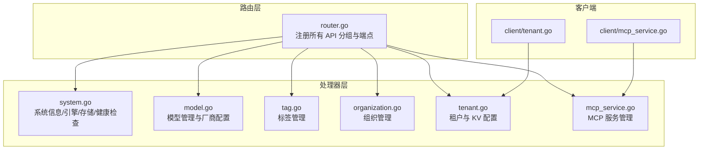
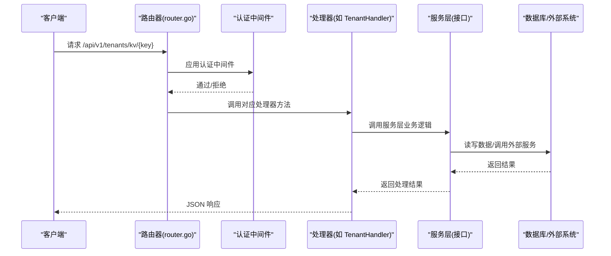
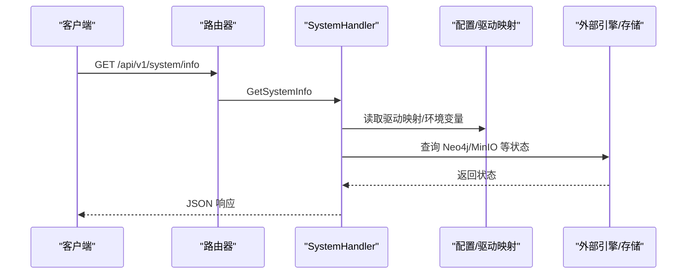
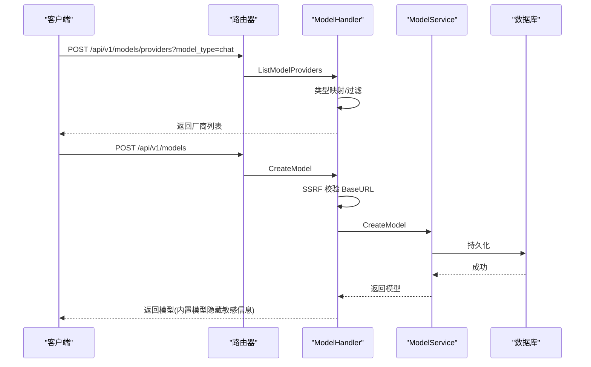
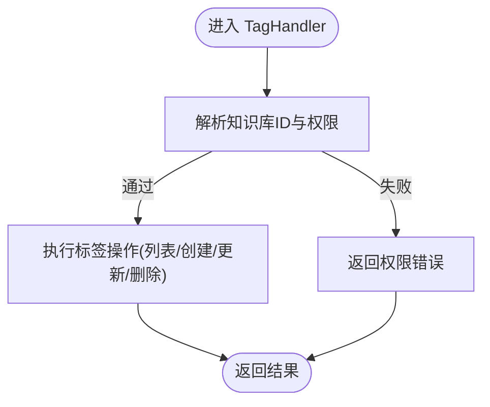
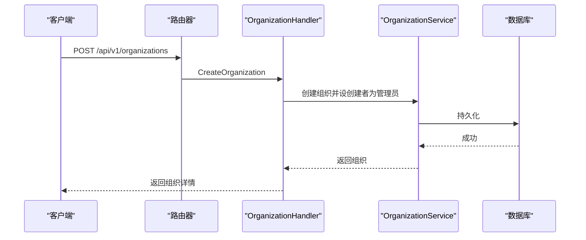
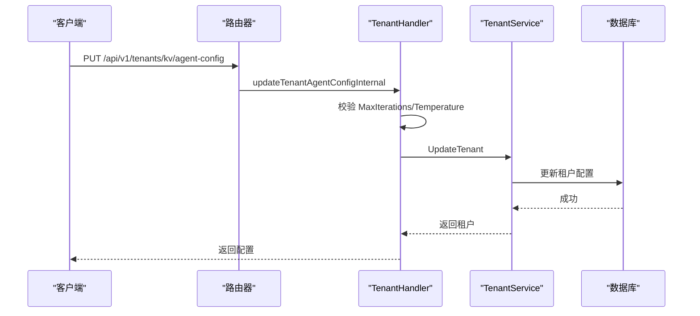
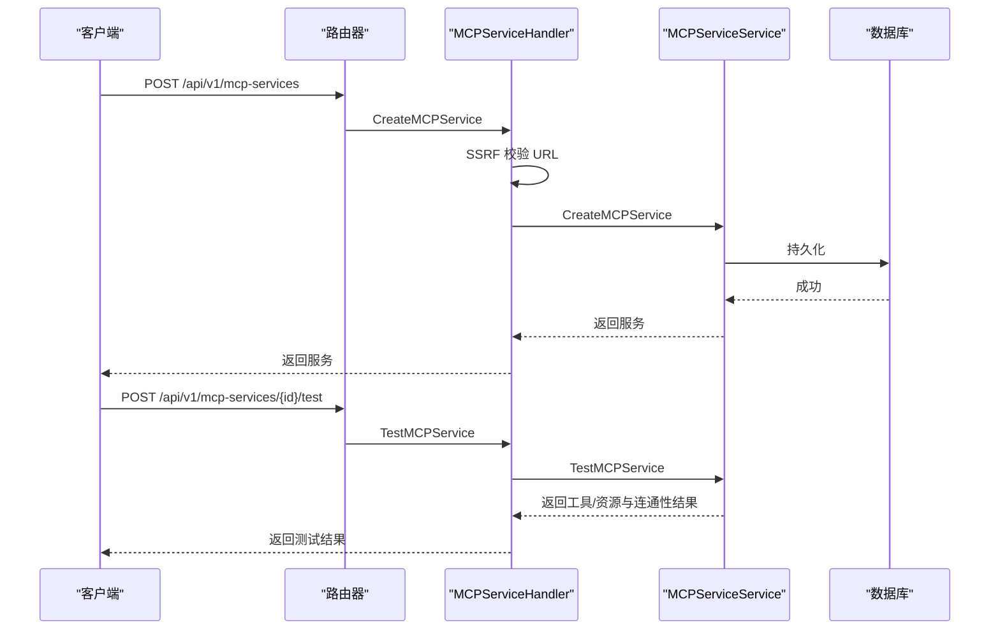
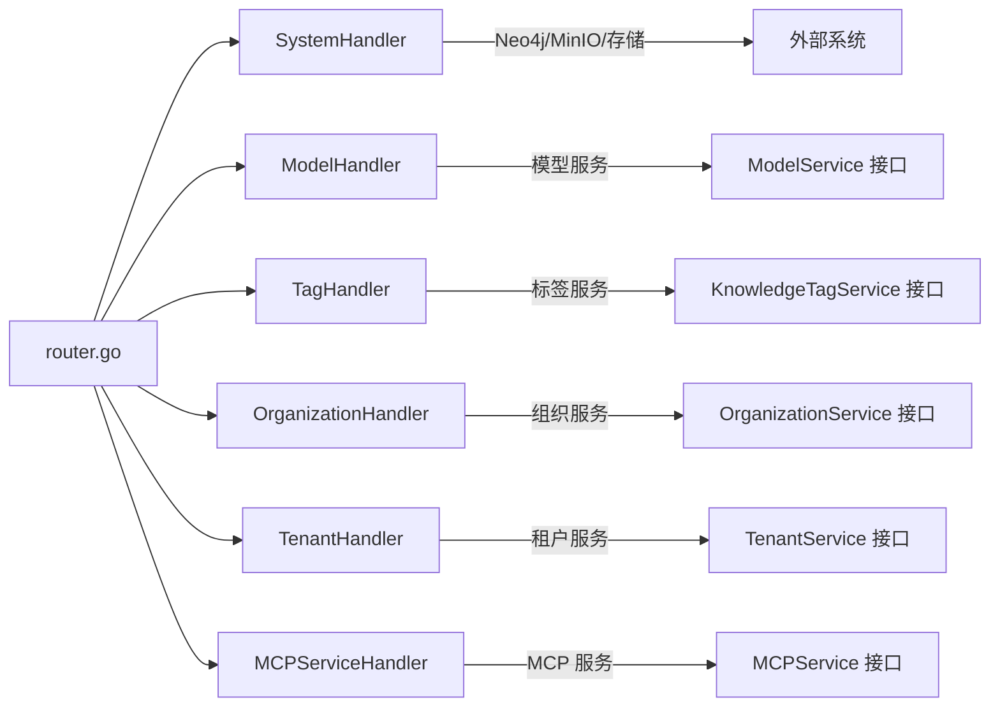

# 系统处理器

<cite>
**本文引用的文件**
- [internal/handler/system.go](file://internal/handler/system.go)
- [internal/handler/model.go](file://internal/handler/model.go)
- [internal/handler/tag.go](file://internal/handler/tag.go)
- [internal/handler/organization.go](file://internal/handler/organization.go)
- [internal/handler/tenant.go](file://internal/handler/tenant.go)
- [internal/router/router.go](file://internal/router/router.go)
- [internal/handler/mcp_service.go](file://internal/handler/mcp_service.go)
- [internal/types/interfaces/mcp_service.go](file://internal/types/interfaces/mcp_service.go)
- [client/mcp_service.go](file://client/mcp_service.go)
- [client/tenant.go](file://client/tenant.go)
- [docs/swagger.json](file://docs/swagger.json)
- [docs/docs.go](file://docs/docs.go)
- [internal/handler/initialization.go](file://internal/handler/initialization.go)
</cite>

## 目录
1. [简介](#简介)
2. [项目结构](#项目结构)
3. [核心组件](#核心组件)
4. [架构总览](#架构总览)
5. [详细组件分析](#详细组件分析)
6. [依赖分析](#依赖分析)
7. [性能考虑](#性能考虑)
8. [故障排查指南](#故障排查指南)
9. [结论](#结论)
10. [附录](#附录)

## 简介
本技术文档围绕 WeKnora 系统的“系统处理器”能力，系统性梳理并阐述以下管理域的 HTTP 接口实现与架构设计：
- 系统配置管理：系统信息查询、文档解析引擎与存储引擎状态查询、连通性检测等
- 模型管理：模型创建、查询、更新、删除与模型厂商配置管理
- 标签管理：知识库标签的增删改查与统计
- 组织管理：组织生命周期、成员管理、邀请与加入流程、权限升级与共享视图
- 多租户管理：租户级 KV 配置（Agent、Web 搜索、对话、提示模板、解析引擎、存储引擎、检索配置等）
- MCP 服务管理：MCP 服务的创建、查询、更新、删除、连通性测试与资源/工具枚举
- 健康检查：统一健康检查端点与系统信息端点

文档以“处理器”为核心视角，结合路由注册、处理器实现、客户端封装与接口契约，提供从架构到实现细节的全景式说明。

## 项目结构
WeKnora 的 HTTP 接口采用“路由分组 + 处理器”的分层设计：
- 路由层负责路径注册与中间件装配
- 处理器层负责业务入口、参数绑定、鉴权与响应封装
- 服务层负责具体业务逻辑（由处理器依赖注入）
- 类型与接口层定义数据结构与契约

图表来源
- [internal/router/router.go:448-482](file://internal/router/router.go#L448-L482)
- [internal/handler/system.go:71-121](file://internal/handler/system.go#L71-L121)
- [internal/handler/model.go:73-144](file://internal/handler/model.go#L73-L144)
- [internal/handler/tag.go:112-157](file://internal/handler/tag.go#L112-L157)
- [internal/handler/organization.go:54-94](file://internal/handler/organization.go#L54-L94)
- [internal/handler/tenant.go:357-377](file://internal/handler/tenant.go#L357-L377)
- [internal/handler/mcp_service.go:151-229](file://internal/handler/mcp_service.go#L151-L229)
- [client/mcp_service.go:74-207](file://client/mcp_service.go#L74-L207)
- [client/tenant.go:62-159](file://client/tenant.go#L62-L159)

章节来源
- [internal/router/router.go:448-482](file://internal/router/router.go#L448-L482)
- [internal/handler/system.go:71-121](file://internal/handler/system.go#L71-L121)
- [internal/handler/model.go:73-144](file://internal/handler/model.go#L73-L144)
- [internal/handler/tag.go:112-157](file://internal/handler/tag.go#L112-L157)
- [internal/handler/organization.go:54-94](file://internal/handler/organization.go#L54-L94)
- [internal/handler/tenant.go:357-377](file://internal/handler/tenant.go#L357-L377)
- [internal/handler/mcp_service.go:151-229](file://internal/handler/mcp_service.go#L151-L229)
- [client/mcp_service.go:74-207](file://client/mcp_service.go#L74-L207)
- [client/tenant.go:62-159](file://client/tenant.go#L62-L159)

## 核心组件
- 系统处理器（SystemHandler）：提供系统信息、解析引擎、存储引擎状态与连通性检测、文档阅读器重连等能力
- 模型处理器（ModelHandler）：提供模型 CRUD 与模型厂商列表查询
- 标签处理器（TagHandler）：提供知识库标签的 CRUD 与统计
- 组织处理器（OrganizationHandler）：提供组织生命周期、成员管理、邀请/加入、权限升级与共享视图
- 租户处理器（TenantHandler）：提供租户 CRUD、跨租户访问、KV 配置读写（Agent/WebSearch/Conversation/Prompt/Parser/Storage/Retrieval 等）
- MCP 服务处理器（MCPServiceHandler）：提供 MCP 服务 CRUD、连通性测试、工具与资源枚举
- 路由器（Router）：统一注册上述处理器到 /api/v1 下的各分组端点

章节来源
- [internal/handler/system.go:26-46](file://internal/handler/system.go#L26-L46)
- [internal/handler/model.go:17-31](file://internal/handler/model.go#L17-L31)
- [internal/handler/tag.go:17-25](file://internal/handler/tag.go#L17-L25)
- [internal/handler/organization.go:19-29](file://internal/handler/organization.go#L19-L29)
- [internal/handler/tenant.go:19-27](file://internal/handler/tenant.go#L19-L27)
- [internal/handler/mcp_service.go:1-150](file://internal/handler/mcp_service.go#L1-L150)
- [internal/router/router.go:448-482](file://internal/router/router.go#L448-L482)

## 架构总览
系统处理器通过 Gin 路由进行统一暴露，所有受保护端点均需经过认证中间件。处理器内部依赖服务层完成业务处理，并通过日志与错误模块进行可观测性与错误传播。

图表来源
- [internal/router/router.go:117-158](file://internal/router/router.go#L117-L158)
- [internal/handler/tenant.go:659-690](file://internal/handler/tenant.go#L659-L690)

章节来源
- [internal/router/router.go:117-158](file://internal/router/router.go#L117-L158)
- [internal/handler/tenant.go:659-690](file://internal/handler/tenant.go#L659-L690)

## 详细组件分析

### 系统信息与健康检查
- 系统信息端点：返回版本、构建信息、索引/向量/图数据库引擎、MinIO 状态、数据库迁移版本等
- 健康检查端点：/health 返回服务存活状态
- 文档解析引擎：列出可用引擎（本地+远程），支持连通性检测与重连
- 存储引擎状态与连通性：支持 MinIO、COS、TOS、OSS、S3 的状态查询与连通性检测

图表来源
- [internal/router/router.go:448-459](file://internal/router/router.go#L448-L459)
- [internal/handler/system.go:71-121](file://internal/handler/system.go#L71-L121)

章节来源
- [internal/router/router.go:93-96](file://internal/router/router.go#L93-L96)
- [internal/handler/system.go:71-121](file://internal/handler/system.go#L71-L121)
- [internal/handler/system.go:133-162](file://internal/handler/system.go#L133-L162)
- [internal/handler/system.go:225-256](file://internal/handler/system.go#L225-L256)
- [internal/handler/system.go:457-482](file://internal/handler/system.go#L457-L482)
- [internal/handler/system.go:593-625](file://internal/handler/system.go#L593-L625)

### 模型管理与模型厂商配置
- 模型 CRUD：创建、查询、列表、更新、删除
- 模型厂商列表：按模型类型过滤厂商，返回默认 URL 与支持的模型类型
- 安全校验：对 BaseURL 进行 SSRF 校验，内置模型隐藏敏感字段

图表来源
- [internal/router/router.go:379-397](file://internal/router/router.go#L379-L397)
- [internal/handler/model.go:412-488](file://internal/handler/model.go#L412-L488)
- [internal/handler/model.go:73-144](file://internal/handler/model.go#L73-L144)

章节来源
- [internal/handler/model.go:73-144](file://internal/handler/model.go#L73-L144)
- [internal/handler/model.go:197-242](file://internal/handler/model.go#L197-L242)
- [internal/handler/model.go:254-339](file://internal/handler/model.go#L254-L339)
- [internal/handler/model.go:341-382](file://internal/handler/model.go#L341-L382)
- [internal/handler/model.go:412-488](file://internal/handler/model.go#L412-L488)

### 标签管理
- 标签 CRUD：创建、查询、更新、删除
- 权限控制：基于知识库归属与共享关系解析有效租户上下文
- 批量操作：支持排除 ID、仅删除内容等策略

图表来源
- [internal/handler/tag.go:44-84](file://internal/handler/tag.go#L44-L84)
- [internal/handler/tag.go:112-157](file://internal/handler/tag.go#L112-L157)
- [internal/handler/tag.go:165-209](file://internal/handler/tag.go#L165-L209)
- [internal/handler/tag.go:217-267](file://internal/handler/tag.go#L217-L267)
- [internal/handler/tag.go:269-332](file://internal/handler/tag.go#L269-L332)

章节来源
- [internal/handler/tag.go:112-157](file://internal/handler/tag.go#L112-L157)
- [internal/handler/tag.go:165-209](file://internal/handler/tag.go#L165-L209)
- [internal/handler/tag.go:217-267](file://internal/handler/tag.go#L217-L267)
- [internal/handler/tag.go:269-332](file://internal/handler/tag.go#L269-L332)

### 组织管理
- 组织生命周期：创建、查询、更新、删除
- 成员管理：列表、角色更新、移除
- 邀请与加入：邀请码预览、通过邀请码加入、审批型加入与申请、公开空间直接加入
- 权限升级：现有成员申请更高权限
- 共享视图：组织内共享的知识库与智能体列表

图表来源
- [internal/router/router.go:566-591](file://internal/router/router.go#L566-L591)
- [internal/handler/organization.go:54-94](file://internal/handler/organization.go#L54-L94)

章节来源
- [internal/handler/organization.go:54-94](file://internal/handler/organization.go#L54-L94)
- [internal/handler/organization.go:125-173](file://internal/handler/organization.go#L125-L173)
- [internal/handler/organization.go:272-315](file://internal/handler/organization.go#L272-L315)
- [internal/handler/organization.go:317-342](file://internal/handler/organization.go#L317-L342)
- [internal/handler/organization.go:344-389](file://internal/handler/organization.go#L344-L389)
- [internal/handler/organization.go:391-427](file://internal/handler/organization.go#L391-L427)
- [internal/handler/organization.go:458-485](file://internal/handler/organization.go#L458-L485)
- [internal/handler/organization.go:487-540](file://internal/handler/organization.go#L487-L540)
- [internal/handler/organization.go:542-581](file://internal/handler/organization.go#L542-L581)
- [internal/handler/organization.go:583-654](file://internal/handler/organization.go#L583-L654)
- [internal/handler/organization.go:656-687](file://internal/handler/organization.go#L656-L687)
- [internal/handler/organization.go:689-742](file://internal/handler/organization.go#L689-L742)
- [internal/handler/organization.go:744-800](file://internal/handler/organization.go#L744-L800)

### 多租户与租户 KV 配置
- 租户 CRUD：创建、查询、更新、删除、列表、跨租户访问与搜索
- 租户 KV 配置：Agent、Web 搜索、对话、提示模板、解析引擎、存储引擎、检索配置等键值读写
- 安全校验：对配置参数进行范围与格式校验

图表来源
- [internal/router/router.go:357-377](file://internal/router/router.go#L357-L377)
- [internal/handler/tenant.go:659-690](file://internal/handler/tenant.go#L659-L690)
- [internal/handler/tenant.go:535-596](file://internal/handler/tenant.go#L535-L596)
- [internal/handler/tenant.go:692-734](file://internal/handler/tenant.go#L692-L734)

章节来源
- [internal/handler/tenant.go:357-377](file://internal/handler/tenant.go#L357-L377)
- [internal/handler/tenant.go:302-356](file://internal/handler/tenant.go#L302-L356)
- [internal/handler/tenant.go:358-447](file://internal/handler/tenant.go#L358-L447)
- [internal/handler/tenant.go:457-533](file://internal/handler/tenant.go#L457-L533)
- [internal/handler/tenant.go:598-644](file://internal/handler/tenant.go#L598-L644)
- [internal/handler/tenant.go:646-690](file://internal/handler/tenant.go#L646-L690)
- [internal/handler/tenant.go:692-734](file://internal/handler/tenant.go#L692-L734)
- [internal/handler/tenant.go:736-763](file://internal/handler/tenant.go#L736-L763)
- [internal/handler/tenant.go:765-782](file://internal/handler/tenant.go#L765-L782)
- [internal/handler/tenant.go:784-800](file://internal/handler/tenant.go#L784-L800)
- [internal/handler/tenant.go:801-843](file://internal/handler/tenant.go#L801-L843)
- [internal/handler/tenant.go:844-868](file://internal/handler/tenant.go#L844-L868)

### MCP 服务管理
- MCP 服务 CRUD：创建、查询、列表、更新、删除
- 连通性测试：测试与远端 MCP 服务的连通性并返回可用工具与资源
- 工具与资源枚举：按服务 ID 获取工具清单与资源清单
- 安全校验：对 URL 进行 SSRF 校验

图表来源
- [internal/router/router.go:461-482](file://internal/router/router.go#L461-L482)
- [internal/handler/mcp_service.go:151-229](file://internal/handler/mcp_service.go#L151-L229)
- [internal/types/interfaces/mcp_service.go:35-61](file://internal/types/interfaces/mcp_service.go#L35-L61)
- [client/mcp_service.go:74-207](file://client/mcp_service.go#L74-L207)

章节来源
- [internal/handler/mcp_service.go:151-229](file://internal/handler/mcp_service.go#L151-L229)
- [internal/handler/mcp_service.go:229-300](file://internal/handler/mcp_service.go#L229-L300)
- [internal/handler/mcp_service.go:300-360](file://internal/handler/mcp_service.go#L300-L360)
- [internal/handler/mcp_service.go:360-420](file://internal/handler/mcp_service.go#L360-L420)
- [internal/types/interfaces/mcp_service.go:35-61](file://internal/types/interfaces/mcp_service.go#L35-L61)
- [client/mcp_service.go:74-207](file://client/mcp_service.go#L74-L207)

### 系统配置示例与组织权限管理
- 系统配置示例：系统信息端点返回版本、构建信息、引擎与 MinIO 状态
- 模型参数设置：模型创建/更新时对 BaseURL 进行 SSRF 校验，内置模型隐藏敏感信息
- 组织权限管理：组织成员角色（查看者/编辑者/管理员）、邀请码生成与加入、审批流程、权限升级、共享视图

章节来源
- [internal/handler/system.go:71-121](file://internal/handler/system.go#L71-L121)
- [internal/handler/model.go:106-113](file://internal/handler/model.go#L106-L113)
- [internal/handler/model.go:305-312](file://internal/handler/model.go#L305-L312)
- [internal/handler/organization.go:391-427](file://internal/handler/organization.go#L391-L427)
- [internal/handler/organization.go:458-485](file://internal/handler/organization.go#L458-L485)
- [internal/handler/organization.go:583-654](file://internal/handler/organization.go#L583-L654)
- [internal/handler/organization.go:744-800](file://internal/handler/organization.go#L744-L800)

## 依赖分析
- 路由到处理器：路由器统一注册 /api/v1 下的各分组端点，处理器通过依赖注入获得服务实例
- 处理器到服务：处理器仅依赖接口，便于替换实现与单元测试
- 处理器到外部系统：系统处理器依赖 Neo4j 驱动、MinIO SDK、COS/TOS/OSS/S3 客户端等
- 客户端到处理器：客户端封装常用操作（如 MCP 服务、租户 KV）

图表来源
- [internal/router/router.go:448-482](file://internal/router/router.go#L448-L482)
- [internal/handler/system.go:26-46](file://internal/handler/system.go#L26-L46)
- [internal/handler/model.go:17-31](file://internal/handler/model.go#L17-L31)
- [internal/handler/tag.go:17-25](file://internal/handler/tag.go#L17-L25)
- [internal/handler/organization.go:19-29](file://internal/handler/organization.go#L19-L29)
- [internal/handler/tenant.go:19-27](file://internal/handler/tenant.go#L19-L27)
- [internal/handler/mcp_service.go:1-150](file://internal/handler/mcp_service.go#L1-L150)
- [internal/types/interfaces/mcp_service.go:35-61](file://internal/types/interfaces/mcp_service.go#L35-L61)

章节来源
- [internal/router/router.go:448-482](file://internal/router/router.go#L448-L482)
- [internal/handler/system.go:26-46](file://internal/handler/system.go#L26-L46)
- [internal/handler/model.go:17-31](file://internal/handler/model.go#L17-L31)
- [internal/handler/tag.go:17-25](file://internal/handler/tag.go#L17-L25)
- [internal/handler/organization.go:19-29](file://internal/handler/organization.go#L19-L29)
- [internal/handler/tenant.go:19-27](file://internal/handler/tenant.go#L19-L27)
- [internal/handler/mcp_service.go:1-150](file://internal/handler/mcp_service.go#L1-L150)
- [internal/types/interfaces/mcp_service.go:35-61](file://internal/types/interfaces/mcp_service.go#L35-L61)

## 性能考虑
- 路由与中间件：CORS、日志、恢复、错误处理、认证中间件按序注册，避免重复处理
- 存储引擎检测：对不同存储提供方进行连通性检测与桶存在性确认，失败时返回友好提示，避免泄露内部网络细节
- 引擎状态聚合：解析引擎列表合并本地与远程引擎，减少重复扫描
- 分页与限额：租户搜索接口限制最大页大小，防止过大请求

章节来源
- [internal/router/router.go:76-91](file://internal/router/router.go#L76-L91)
- [internal/handler/system.go:517-572](file://internal/handler/system.go#L517-L572)
- [internal/handler/system.go:133-162](file://internal/handler/system.go#L133-L162)
- [internal/handler/tenant.go:417-423](file://internal/handler/tenant.go#L417-L423)

## 故障排查指南
- 认证失败：检查 Authorization/X-API-Key 头部与令牌有效性
- 参数校验失败：检查请求体格式与必填字段，关注处理器中的校验错误
- 存储引擎连通性失败：根据错误信息定位 Endpoint、Region、Access Key、Secret Key、Bucket 名称等配置项
- SSRF 校验失败：确保 BaseURL/Endpoint 不包含非法方案或内网地址（受白名单保护）
- 跨租户访问受限：确认系统配置 EnableCrossTenantAccess 与用户权限 CanAccessAllTenants

章节来源
- [internal/router/router.go:117-118](file://internal/router/router.go#L117-L118)
- [internal/handler/system.go:517-572](file://internal/handler/system.go#L517-L572)
- [internal/handler/model.go:106-113](file://internal/handler/model.go#L106-L113)
- [internal/handler/tenant.go:323-335](file://internal/handler/tenant.go#L323-L335)

## 结论
WeKnora 的系统处理器以清晰的分层与契约设计，提供了覆盖系统配置、模型管理、标签管理、组织管理、多租户 KV 配置与 MCP 服务管理的完整 HTTP 接口体系。通过统一路由注册、严格的参数与安全校验、完善的错误处理与可观测性，系统在保证易用性的同时兼顾了安全性与可维护性。建议在生产环境中：
- 明确配置项与权限边界，启用跨租户访问前严格评估风险
- 对外暴露的 URL/Endpoint 做好 SSRF 与白名单控制
- 使用健康检查与系统信息端点持续监控运行状态

## 附录
- API 参考与端点汇总可参考 Swagger 文档与注释生成文件
- 初始化与配置更新：支持按知识库维度的配置更新与模型检查

章节来源
- [docs/swagger.json:5936-5948](file://docs/swagger.json#L5936-L5948)
- [docs/docs.go:8351-8389](file://docs/docs.go#L8351-L8389)
- [internal/handler/initialization.go:395-405](file://internal/handler/initialization.go#L395-L405)
- [internal/handler/initialization.go:407-436](file://internal/handler/initialization.go#L407-L436)