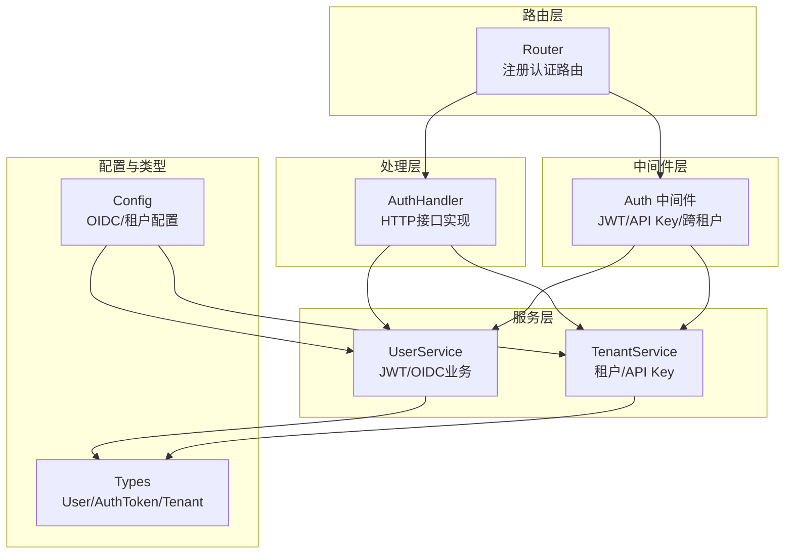
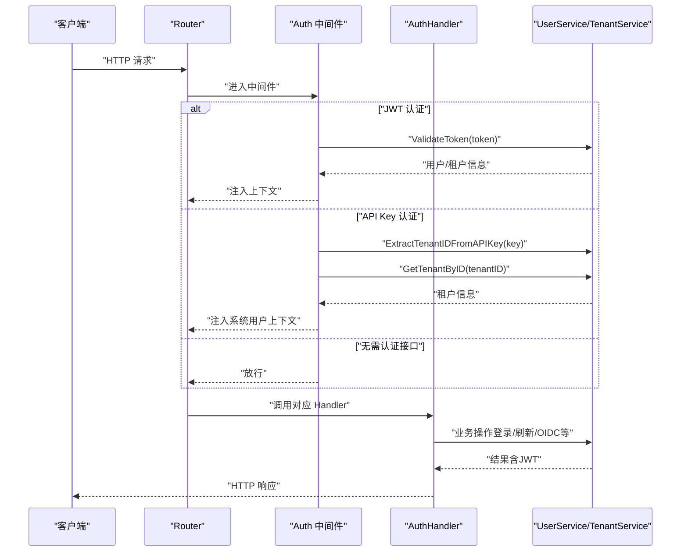
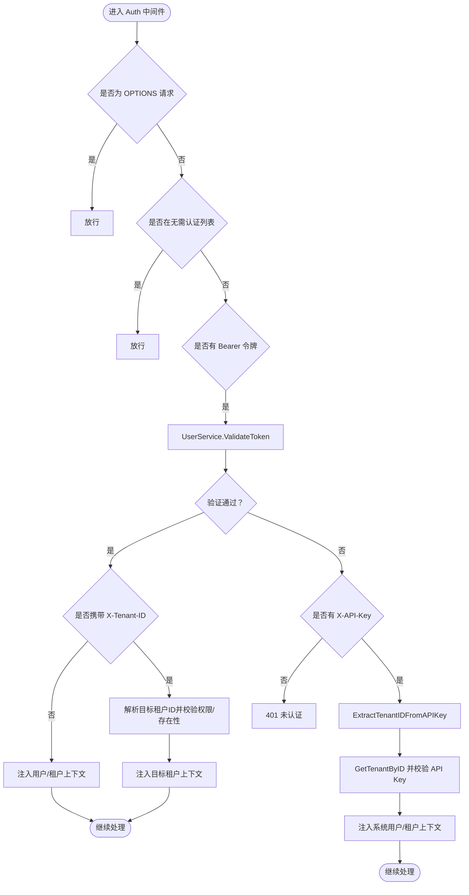
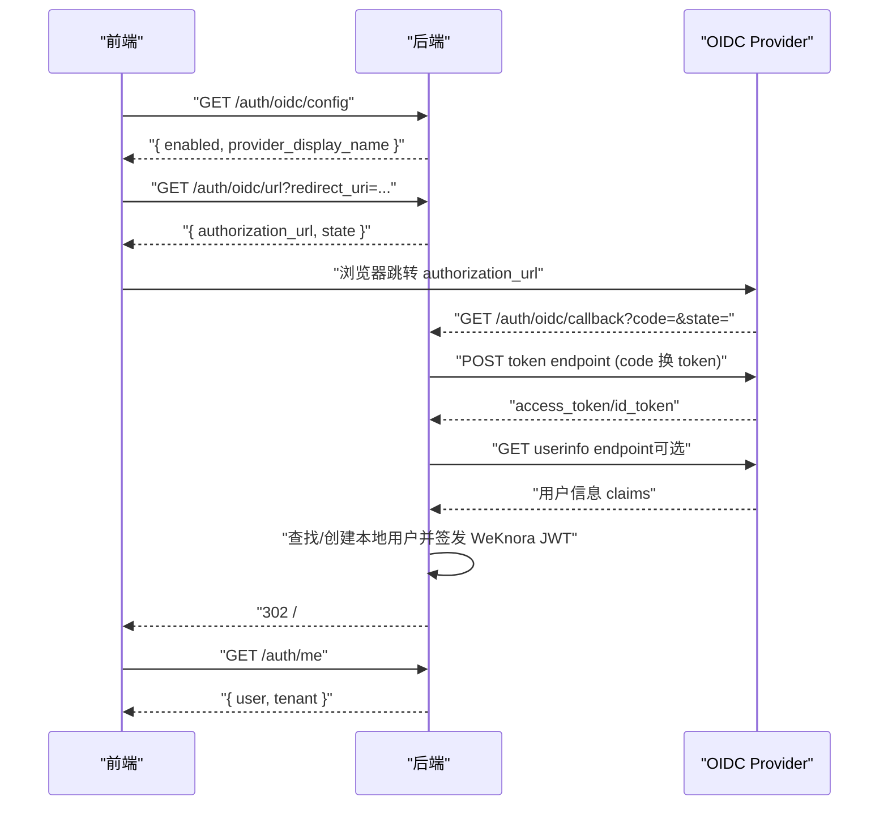
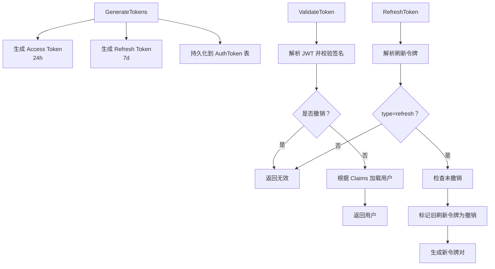
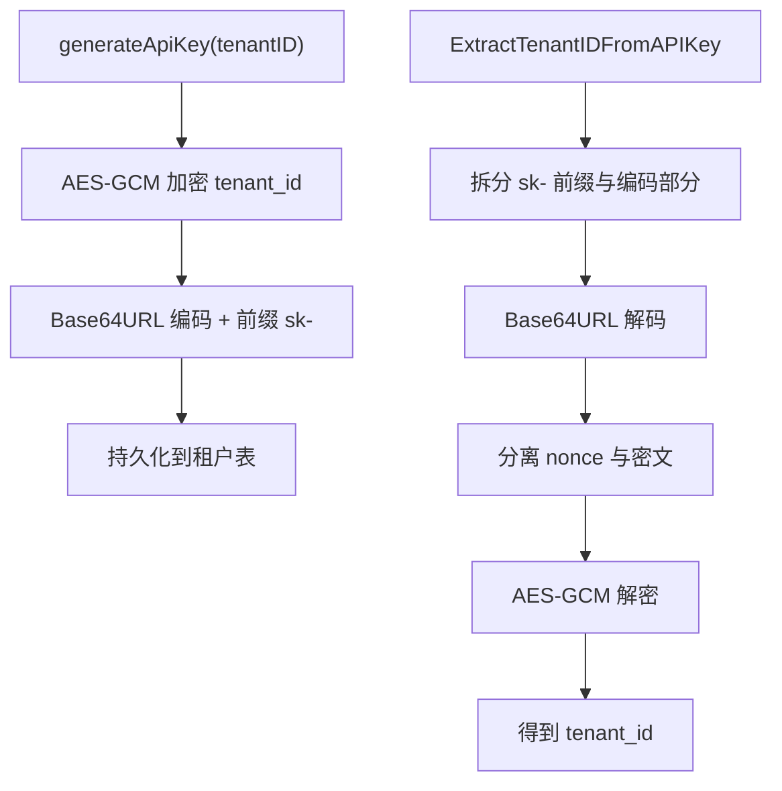
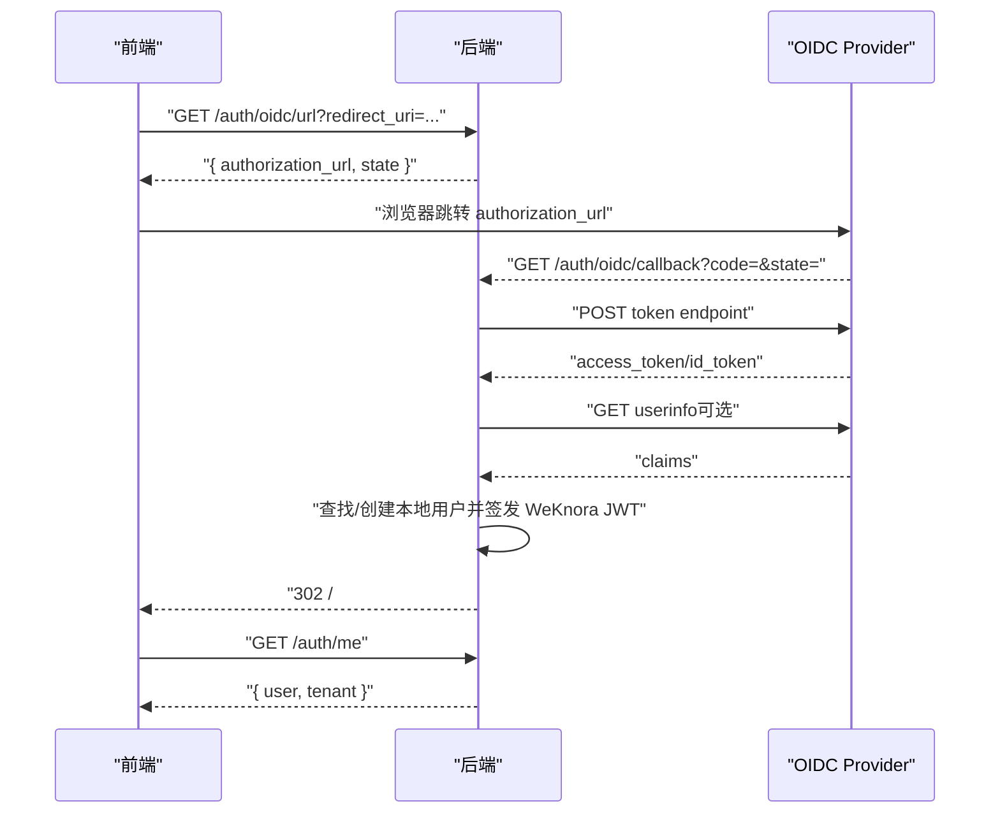
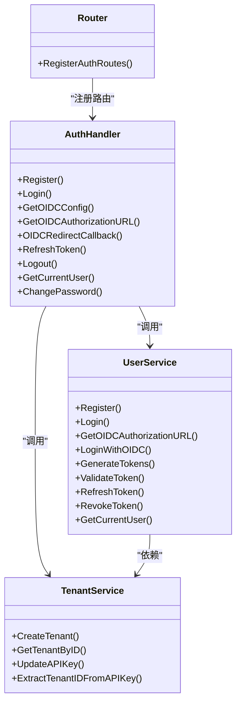

# 认证处理器

<cite>
**本文档引用的文件**
- [internal/middleware/auth.go](file://internal/middleware/auth.go)
- [internal/handler/auth.go](file://internal/handler/auth.go)
- [internal/application/service/user.go](file://internal/application/service/user.go)
- [internal/application/service/tenant.go](file://internal/application/service/tenant.go)
- [internal/router/router.go](file://internal/router/router.go)
- [internal/config/config.go](file://internal/config/config.go)
- [internal/types/user.go](file://internal/types/user.go)
- [internal/types/tenant.go](file://internal/types/tenant.go)
- [internal/types/interfaces/user.go](file://internal/types/interfaces/user.go)
- [internal/types/interfaces/tenant.go](file://internal/types/interfaces/tenant.go)
- [docs/OIDC认证调用流程.md](file://docs/OIDC认证调用流程.md)
</cite>

## 目录
1. [简介](#简介)
2. [项目结构](#项目结构)
3. [核心组件](#核心组件)
4. [架构总览](#架构总览)
5. [详细组件分析](#详细组件分析)
6. [依赖关系分析](#依赖关系分析)
7. [性能考虑](#性能考虑)
8. [故障排除指南](#故障排除指南)
9. [结论](#结论)

## 简介
本文件为 WeKnora 认证处理器的详细技术文档，聚焦于以下主题：
- JWT 令牌管理：令牌生成、验证、刷新与撤销
- API 密钥认证：租户级 API Key 的生成、解析与鉴权
- OIDC 集成：后端发起授权、回调处理、用户身份映射与本地令牌发放
- HTTP 接口：登录、登出、刷新、获取当前用户、修改密码等
- 认证中间件：JWT 与 API Key 的双通道认证、跨租户访问控制
- 权限验证与安全防护：令牌有效性校验、租户切换、跨租户访问控制
- 错误处理与安全建议：常见错误场景与修复策略

## 项目结构
WeKnora 的认证体系围绕 Handler、Service、Middleware、Router 与 Types 层协作构建，核心文件分布如下：
- 路由层：注册认证相关路由，绑定到 AuthHandler
- 处理层：AuthHandler 实现 HTTP 接口，调用 UserService 与 TenantService
- 服务层：UserService 负责 JWT 令牌与 OIDC 业务逻辑；TenantService 负责租户与 API Key 管理
- 中间件层：Auth 中间件统一处理 JWT 与 API Key 认证、跨租户切换
- 配置层：OIDC 配置、租户配置等
- 类型层：用户、令牌、租户、接口定义等

**图表来源**
- [internal/router/router.go:407-420](file://internal/router/router.go#L407-L420)
- [internal/handler/auth.go:22-44](file://internal/handler/auth.go#L22-L44)
- [internal/middleware/auth.go:65-70](file://internal/middleware/auth.go#L65-L70)
- [internal/application/service/user.go:58-80](file://internal/application/service/user.go#L58-L80)
- [internal/application/service/tenant.go:35-43](file://internal/application/service/tenant.go#L35-L43)
- [internal/config/config.go:18-33](file://internal/config/config.go#L18-L33)

**章节来源**
- [internal/router/router.go:407-420](file://internal/router/router.go#L407-L420)
- [internal/handler/auth.go:22-44](file://internal/handler/auth.go#L22-L44)
- [internal/middleware/auth.go:65-70](file://internal/middleware/auth.go#L65-L70)
- [internal/application/service/user.go:58-80](file://internal/application/service/user.go#L58-L80)
- [internal/application/service/tenant.go:35-43](file://internal/application/service/tenant.go#L35-L43)
- [internal/config/config.go:18-33](file://internal/config/config.go#L18-L33)

## 核心组件
- 认证中间件 Auth：统一处理 JWT 与 API Key 认证，支持跨租户访问与租户切换
- AuthHandler：提供注册、登录、OIDC、刷新、登出、获取当前用户、修改密码等 HTTP 接口
- UserService：JWT 令牌生成/验证/刷新/撤销；OIDC 授权 URL 生成、code 换 token、用户映射与本地令牌发放
- TenantService：租户创建、查询、API Key 生成与解析、跨租户访问控制辅助
- 配置 Config：OIDC 开关、端点、Scope、用户信息映射等
- 类型定义：User、AuthToken、Tenant、接口定义等

**章节来源**
- [internal/middleware/auth.go:65-228](file://internal/middleware/auth.go#L65-L228)
- [internal/handler/auth.go:22-633](file://internal/handler/auth.go#L22-L633)
- [internal/application/service/user.go:384-540](file://internal/application/service/user.go#L384-L540)
- [internal/application/service/tenant.go:241-313](file://internal/application/service/tenant.go#L241-L313)
- [internal/config/config.go:180-192](file://internal/config/config.go#L180-L192)
- [internal/types/user.go:9-59](file://internal/types/user.go#L9-L59)
- [internal/types/tenant.go:72-118](file://internal/types/tenant.go#L72-L118)

## 架构总览
认证处理的关键流程：
- 请求进入 Router，经 Auth 中间件统一认证
- JWT 认证：从 Authorization: Bearer 中解析令牌，验证有效性并注入用户/租户上下文
- API Key 认证：从 X-API-Key 中解析租户 ID，校验租户存在与 API Key 一致性，注入系统用户上下文
- OIDC：后端生成授权 URL，接收回调，用 code 换取 OIDC token，解析用户信息，本地创建或关联用户，发放 WeKnora JWT
- 令牌管理：生成 Access/Refresh 令牌，持久化到数据库，支持刷新与撤销

**图表来源**
- [internal/router/router.go:117-118](file://internal/router/router.go#L117-L118)
- [internal/middleware/auth.go:65-228](file://internal/middleware/auth.go#L65-L228)
- [internal/handler/auth.go:110-162](file://internal/handler/auth.go#L110-L162)
- [internal/application/service/user.go:446-476](file://internal/application/service/user.go#L446-L476)
- [internal/application/service/tenant.go:273-313](file://internal/application/service/tenant.go#L273-L313)

## 详细组件分析

### 认证中间件 Auth
- 无需认证接口白名单：健康检查、注册、登录、自动初始化、OIDC 配置、OIDC 授权 URL、OIDC 回调、令牌刷新
- JWT 认证流程：
  - 从 Authorization: Bearer 提取 token
  - 调用 UserService.ValidateToken 验证并获取用户
  - 支持跨租户访问：读取 X-Tenant-ID，校验用户权限与目标租户存在性
  - 注入用户、租户、租户 ID 上下文
- API Key 认证流程：
  - 从 X-API-Key 提取 API Key
  - TenantService.ExtractTenantIDFromAPIKey 解析租户 ID
  - 校验租户存在与 API Key 一致性（恒平滑比较）
  - 注入租户与系统用户上下文（ID 以 system-tenantID 命名）
- 未提供认证信息时返回 401

**图表来源**
- [internal/middleware/auth.go:20-228](file://internal/middleware/auth.go#L20-L228)

**章节来源**
- [internal/middleware/auth.go:20-228](file://internal/middleware/auth.go#L20-L228)

### HTTP 接口与处理流程

#### 注册 /api/v1/auth/register
- Handler：Register
- 业务：校验参数、检查注册开关、去重、密码加密、创建默认租户、创建用户
- 返回：201 注册成功

**章节来源**
- [internal/handler/auth.go:57-108](file://internal/handler/auth.go#L57-L108)

#### 登录 /api/v1/auth/login
- Handler：Login
- 业务：邮箱查找用户、校验账户状态、密码比对、生成 WeKnora JWT 与刷新令牌
- 返回：200 登录成功（含 token/refresh_token）

**章节来源**
- [internal/handler/auth.go:120-162](file://internal/handler/auth.go#L120-L162)
- [internal/application/service/user.go:144-213](file://internal/application/service/user.go#L144-L213)

#### OIDC 相关接口
- 获取 OIDC 配置 /api/v1/auth/oidc/config
  - Handler：GetOIDCConfig
  - 业务：读取配置开关与显示名称
- 生成授权 URL /api/v1/auth/oidc/url
  - Handler：GetOIDCAuthorizationURL
  - 业务：生成 state（包含 nonce 与 redirect_uri）、拼装授权 URL
- OIDC 回调 /api/v1/auth/oidc/callback
  - Handler：OIDCRedirectCallback
  - 业务：校验 error/state/code，调用 UserService.LoginWithOIDC，编码结果通过 hash 返回前端

**图表来源**
- [docs/OIDC认证调用流程.md:69-127](file://docs/OIDC认证调用流程.md#L69-L127)
- [internal/handler/auth.go:175-276](file://internal/handler/auth.go#L175-L276)
- [internal/application/service/user.go:260-316](file://internal/application/service/user.go#L260-L316)

**章节来源**
- [internal/handler/auth.go:175-276](file://internal/handler/auth.go#L175-L276)
- [docs/OIDC认证调用流程.md:45-63](file://docs/OIDC认证调用流程.md#L45-L63)

#### 刷新令牌 /api/v1/auth/refresh
- Handler：RefreshToken
- 业务：解析刷新令牌、验证有效性、撤销旧刷新令牌、重新生成新令牌对
- 返回：200 新令牌对

**章节来源**
- [internal/handler/auth.go:380-412](file://internal/handler/auth.go#L380-L412)
- [internal/application/service/user.go:478-527](file://internal/application/service/user.go#L478-L527)

#### 登出 /api/v1/auth/logout
- Handler：Logout
- 业务：从 Authorization: Bearer 提取令牌，调用 RevokeToken 标记撤销
- 返回：200 登出成功

**章节来源**
- [internal/handler/auth.go:329-368](file://internal/handler/auth.go#L329-L368)
- [internal/application/service/user.go:529-540](file://internal/application/service/user.go#L529-L540)

#### 获取当前用户 /api/v1/auth/me
- Handler：GetCurrentUser
- 业务：从上下文获取用户，查询租户信息，返回用户与租户数据
- 返回：200 用户信息

**章节来源**
- [internal/handler/auth.go:424-454](file://internal/handler/auth.go#L424-L454)

#### 修改密码 /api/v1/auth/change-password
- Handler：ChangePassword
- 业务：校验旧密码、哈希新密码、更新用户记录
- 返回：200 修改成功

**章节来源**
- [internal/handler/auth.go:467-507](file://internal/handler/auth.go#L467-L507)
- [internal/application/service/user.go:349-372](file://internal/application/service/user.go#L349-L372)

### JWT 令牌管理
- 生成：GenerateTokens
  - Access Token：24 小时过期，包含 user_id、email、tenant_id、iat/exp、type=access
  - Refresh Token：7 天过期，包含 user_id、iat/exp、type=refresh
  - 同步持久化到 AuthToken 表
- 验证：ValidateToken
  - HS256 签名校验
  - 校验 token 是否被撤销
  - 从 Claims 提取 user_id 并加载用户
- 刷新：RefreshToken
  - 验证刷新令牌类型与有效性
  - 校验未被撤销
  - 撤销旧刷新令牌并生成新令牌对
- 撤销：RevokeToken
  - 标记 AuthToken.IsRevoked=true

**图表来源**
- [internal/application/service/user.go:384-444](file://internal/application/service/user.go#L384-L444)
- [internal/application/service/user.go:446-476](file://internal/application/service/user.go#L446-L476)
- [internal/application/service/user.go:478-527](file://internal/application/service/user.go#L478-L527)
- [internal/application/service/user.go:529-540](file://internal/application/service/user.go#L529-L540)

**章节来源**
- [internal/application/service/user.go:384-540](file://internal/application/service/user.go#L384-L540)
- [internal/types/user.go:38-59](file://internal/types/user.go#L38-L59)

### API 密钥认证
- API Key 生成：TenantService.generateApiKey
  - 使用 AES-GCM 对 tenant_id 进行加密，组合 nonce 与密文，Base64URL 编码，前缀 sk-
- API Key 解析：TenantService.ExtractTenantIDFromAPIKey
  - 校验格式与编码
  - 分离 nonce 与密文，AES-GCM 解密得到 tenant_id
- 中间件校验：
  - 从 X-API-Key 读取
  - 解析 tenant_id
  - 查询租户并恒平滑比较 API Key
  - 注入系统用户（system-tenantID）上下文

**图表来源**
- [internal/application/service/tenant.go:241-271](file://internal/application/service/tenant.go#L241-L271)
- [internal/application/service/tenant.go:273-313](file://internal/application/service/tenant.go#L273-L313)
- [internal/middleware/auth.go:158-222](file://internal/middleware/auth.go#L158-L222)

**章节来源**
- [internal/application/service/tenant.go:241-313](file://internal/application/service/tenant.go#L241-L313)
- [internal/middleware/auth.go:158-222](file://internal/middleware/auth.go#L158-L222)

### OIDC 集成
- 授权 URL 生成：GetOIDCAuthorizationURL
  - 读取 OIDC 配置（Discovery 或显式端点）
  - 生成 state（包含 nonce 与 redirect_uri），拼装授权 URL
- 回调处理：OIDCRedirectCallback
  - 校验 error/state/code
  - 调用 LoginWithOIDC：code 换 token、解析用户信息、本地用户查找/创建、签发 WeKnora JWT
  - 将最小登录结果编码为 base64url，302 重定向到前端首页 hash
- 前端消费：App.vue 解析 hash，调用 /auth/me 补全用户与租户信息

**图表来源**
- [internal/handler/auth.go:175-276](file://internal/handler/auth.go#L175-L276)
- [internal/application/service/user.go:260-316](file://internal/application/service/user.go#L260-L316)
- [docs/OIDC认证调用流程.md:69-127](file://docs/OIDC认证调用流程.md#L69-L127)

**章节来源**
- [internal/handler/auth.go:175-276](file://internal/handler/auth.go#L175-L276)
- [internal/application/service/user.go:260-316](file://internal/application/service/user.go#L260-L316)
- [docs/OIDC认证调用流程.md:24-63](file://docs/OIDC认证调用流程.md#L24-L63)

### 跨租户访问与租户切换
- 中间件支持通过 X-Tenant-ID 切换目标租户
- canAccessTenant 逻辑：需开启跨租户访问、用户具备全局访问权限、目标租户存在
- 切换成功后，后续请求以目标租户上下文执行

**章节来源**
- [internal/middleware/auth.go:47-123](file://internal/middleware/auth.go#L47-L123)

## 依赖关系分析

**图表来源**
- [internal/router/router.go:407-420](file://internal/router/router.go#L407-L420)
- [internal/handler/auth.go:31-44](file://internal/handler/auth.go#L31-L44)
- [internal/application/service/user.go:66-79](file://internal/application/service/user.go#L66-L79)
- [internal/application/service/tenant.go:40-43](file://internal/application/service/tenant.go#L40-L43)

**章节来源**
- [internal/router/router.go:407-420](file://internal/router/router.go#L407-L420)
- [internal/handler/auth.go:31-44](file://internal/handler/auth.go#L31-L44)
- [internal/application/service/user.go:66-79](file://internal/application/service/user.go#L66-L79)
- [internal/application/service/tenant.go:40-43](file://internal/application/service/tenant.go#L40-L43)

## 性能考虑
- JWT 令牌大小与 Claims：Access Token 包含 user_id、email、tenant_id 等，建议避免冗余字段，减少传输与解析开销
- 刷新令牌策略：刷新令牌有效期较长（7 天），建议结合撤销机制与安全审计
- OIDC 交互：Discovery 文档缓存与端点预填可减少网络往返
- API Key 解析：AES-GCM 解密成本较低，但需确保密钥安全与正确配置

## 故障排除指南
- 401 未认证
  - 检查 Authorization: Bearer 是否正确
  - 检查 X-API-Key 格式与租户存在性
- 令牌无效或已撤销
  - 确认令牌未被 RevokeToken 标记撤销
  - 检查 JWT_SECRET 是否一致
- OIDC 登录失败
  - 校验 redirect_uri 与 Provider 配置一致
  - 检查 state 是否被篡改或缺失
  - 确认 Provider 返回 email 字段
- 跨租户访问被拒绝
  - 确认配置开启跨租户访问且用户具备全局访问权限
  - 确认目标租户存在且 ID 正确

**章节来源**
- [internal/middleware/auth.go:224-227](file://internal/middleware/auth.go#L224-L227)
- [internal/application/service/user.go:446-476](file://internal/application/service/user.go#L446-L476)
- [docs/OIDC认证调用流程.md:612-623](file://docs/OIDC认证调用流程.md#L612-L623)

## 结论
WeKnora 的认证处理器通过中间件统一处理 JWT 与 API Key 认证，结合 OIDC 后端完成授权与用户映射，形成“OIDC 身份确认 + WeKnora 本地 JWT 业务令牌”的安全模型。配合跨租户访问控制与严格的错误处理，系统在保障安全性的同时提供了灵活的多租户与外部身份集成能力。