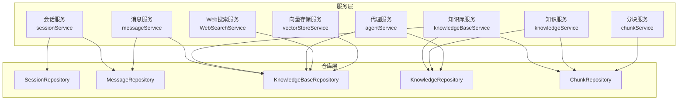
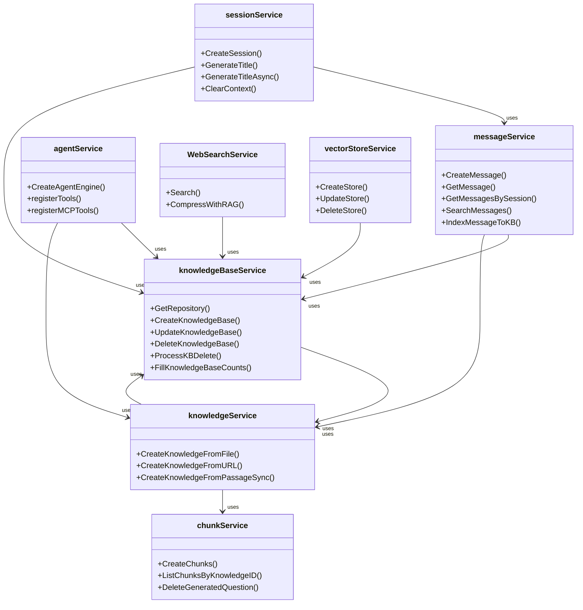
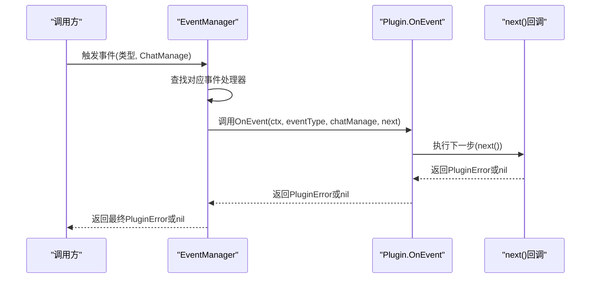
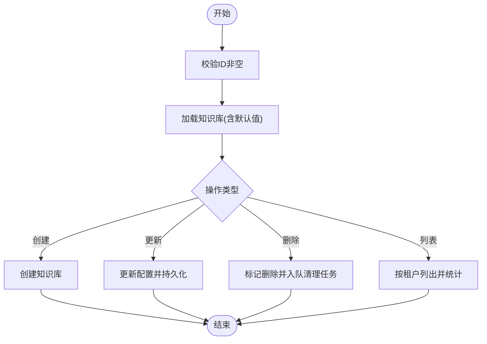
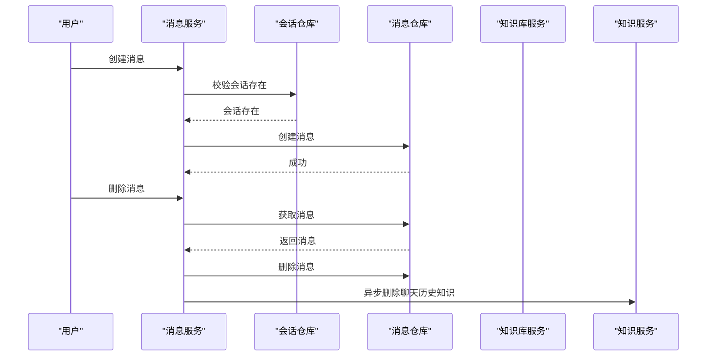
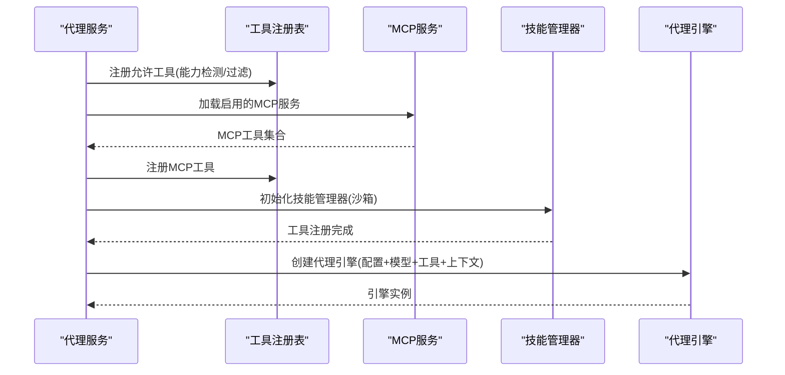
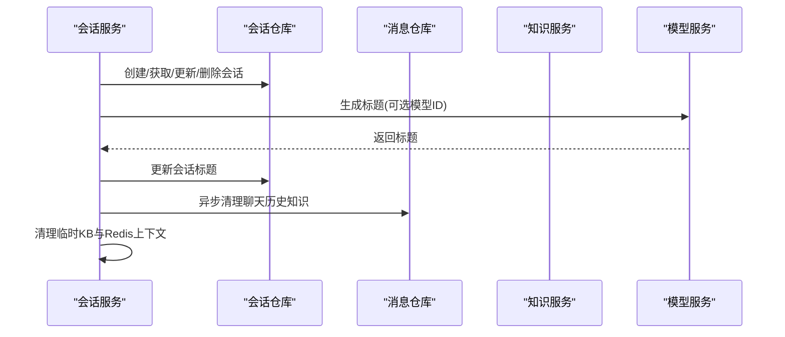
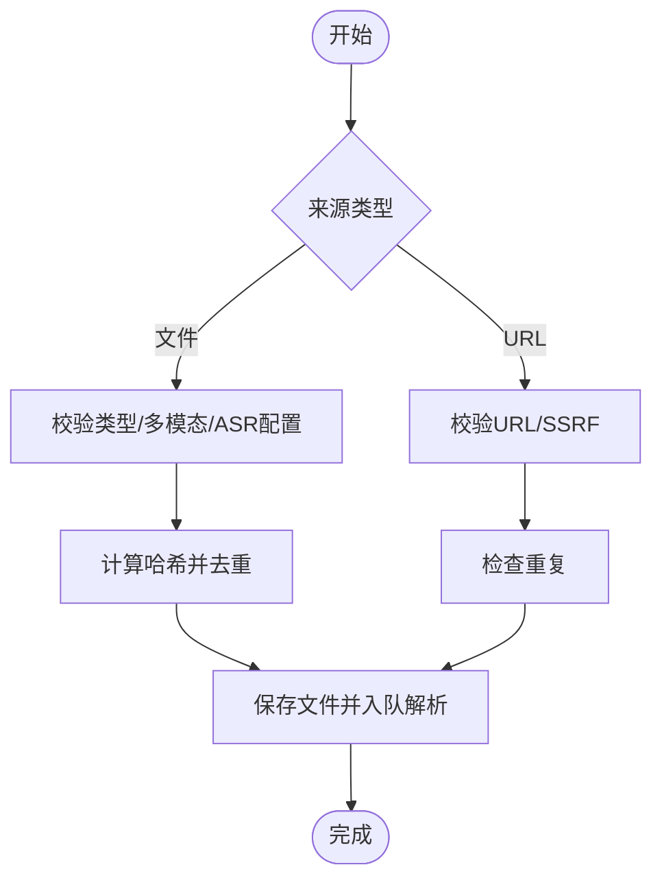
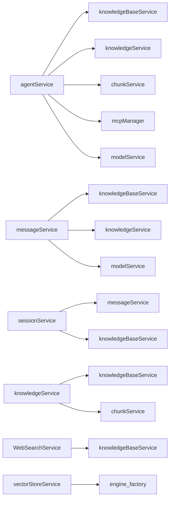

# 业务服务层

<cite>
**本文引用的文件**
- [chat_pipeline.go](file://internal/application/service/chat_pipeline/chat_pipeline.go)
- [knowledgebase.go](file://internal/application/service/knowledgebase.go)
- [message.go](file://internal/application/service/message.go)
- [agent_service.go](file://internal/application/service/agent_service.go)
- [session.go](file://internal/application/service/session.go)
- [knowledge.go](file://internal/application/service/knowledge.go)
- [chunk.go](file://internal/application/service/chunk.go)
- [vectorstore.go](file://internal/application/service/vectorstore.go)
- [web_search.go](file://internal/application/service/web_search.go)
- [engine_factory.go](file://internal/container/engine_factory.go)
</cite>

## 目录
1. [引言](#引言)
2. [项目结构](#项目结构)
3. [核心组件](#核心组件)
4. [架构总览](#架构总览)
5. [详细组件分析](#详细组件分析)
6. [依赖分析](#依赖分析)
7. [性能考虑](#性能考虑)
8. [故障排查指南](#故障排查指南)
9. [结论](#结论)

## 引言
本文件面向WeKnora业务服务层，系统化阐述服务层的设计模式、领域服务实现与业务逻辑封装，重点覆盖聊天管道、知识库管理、消息处理、代理服务、向量检索与Web搜索等核心能力。文档同时给出接口设计、事务处理、错误处理与性能优化策略，并说明服务层与数据访问层的交互模式与依赖关系。

## 项目结构
WeKnora采用分层架构，业务服务层位于应用层与数据访问层之间，负责编排领域模型、协调仓库与外部服务、执行业务规则与事务控制。内部模块按职责划分：
- 聊天管道：事件驱动插件机制，统一处理聊天生命周期事件
- 知识库服务：知识库的创建、更新、删除、异步清理与计数统计
- 消息服务：消息的增删改查、会话历史KB索引、消息检索与融合排序
- 代理服务：代理引擎构建、工具注册、MCP工具接入、技能管理
- 会话服务：会话生命周期管理、标题生成、上下文清理
- 知识服务：文件/URL导入、去重、解析任务入队、FAQ导入、Wiki集成
- 分块服务：分块的增删改查、批量操作、生成问题删除
- 向量存储服务：向量库配置校验、连接测试、动态注册
- Web搜索服务：提供者解析、黑名单过滤、RAG压缩

图表来源
- [session.go:26-79](file://internal/application/service/session.go#L26-L79)
- [message.go:20-49](file://internal/application/service/message.go#L20-L49)
- [knowledgebase.go:21-62](file://internal/application/service/knowledgebase.go#L21-L62)
- [knowledge.go:61-88](file://internal/application/service/knowledge.go#L61-L88)
- [chunk.go:16-45](file://internal/application/service/chunk.go#L16-L45)
- [web_search.go:18-44](file://internal/application/service/web_search.go#L18-L44)
- [vectorstore.go:16-34](file://internal/application/service/vectorstore.go#L16-L34)

章节来源
- [session.go:26-79](file://internal/application/service/session.go#L26-L79)
- [message.go:20-49](file://internal/application/service/message.go#L20-L49)
- [knowledgebase.go:21-62](file://internal/application/service/knowledgebase.go#L21-L62)
- [knowledge.go:61-88](file://internal/application/service/knowledge.go#L61-L88)
- [chunk.go:16-45](file://internal/application/service/chunk.go#L16-L45)
- [web_search.go:18-44](file://internal/application/service/web_search.go#L18-L44)
- [vectorstore.go:16-34](file://internal/application/service/vectorstore.go#L16-L34)

## 核心组件
- 聊天管道事件管理器：通过插件接口与事件链路，对聊天生命周期事件进行解耦处理
- 知识库服务：封装知识库CRUD、异步删除清理、计数统计与配置同步
- 消息服务：消息读写、会话历史KB索引、消息检索与融合排序
- 代理服务：代理引擎构建、工具注册、MCP工具与技能管理
- 会话服务：会话生命周期、标题生成、上下文清理
- 知识服务：文件/URL导入、去重、解析任务入队、FAQ导入、Wiki集成
- 分块服务：分块管理、批量操作、生成问题删除
- 向量存储服务：向量库配置校验、连接测试、动态注册
- Web搜索服务：提供者解析、黑名单过滤、RAG压缩

章节来源
- [chat_pipeline.go:9-78](file://internal/application/service/chat_pipeline/chat_pipeline.go#L9-L78)
- [knowledgebase.go:21-62](file://internal/application/service/knowledgebase.go#L21-L62)
- [message.go:20-49](file://internal/application/service/message.go#L20-L49)
- [agent_service.go:45-61](file://internal/application/service/agent_service.go#L45-L61)
- [session.go:26-43](file://internal/application/service/session.go#L26-L43)
- [knowledge.go:61-88](file://internal/application/service/knowledge.go#L61-L88)
- [chunk.go:16-24](file://internal/application/service/chunk.go#L16-L24)
- [vectorstore.go:16-21](file://internal/application/service/vectorstore.go#L16-L21)
- [web_search.go:18-25](file://internal/application/service/web_search.go#L18-L25)

## 架构总览
服务层通过依赖注入组合各仓库与外部服务，围绕领域模型执行业务规则。以“知识库-知识-分块”为核心数据流，结合消息与会话形成完整的对话与检索闭环；代理服务通过工具注册与MCP集成扩展能力；向量存储服务提供可插拔的检索后端；Web搜索服务提供外部信息补充与RAG压缩。

图表来源
- [knowledgebase.go:21-62](file://internal/application/service/knowledgebase.go#L21-L62)
- [message.go:20-49](file://internal/application/service/message.go#L20-L49)
- [agent_service.go:45-61](file://internal/application/service/agent_service.go#L45-L61)
- [session.go:26-43](file://internal/application/service/session.go#L26-L43)
- [knowledge.go:61-88](file://internal/application/service/knowledge.go#L61-L88)
- [chunk.go:16-24](file://internal/application/service/chunk.go#L16-L24)
- [web_search.go:18-25](file://internal/application/service/web_search.go#L18-L25)
- [vectorstore.go:16-21](file://internal/application/service/vectorstore.go#L16-L21)

## 详细组件分析

### 聊天管道与事件管理
- 插件接口：定义OnEvent与ActivationEvents，支持事件链式处理
- 事件管理器：注册插件、构建handler链、触发事件
- 预定义错误：针对检索、重排、模型调用等常见失败场景提供标准化错误包装

图表来源
- [chat_pipeline.go:31-78](file://internal/application/service/chat_pipeline/chat_pipeline.go#L31-L78)

章节来源
- [chat_pipeline.go:9-141](file://internal/application/service/chat_pipeline/chat_pipeline.go#L9-L141)

### 知识库服务
- 设计要点：依赖注入多个仓库与服务，统一处理知识库配置、计数统计、异步删除
- 关键流程：
  - 创建/更新：填充默认值、持久化、日志记录
  - 列表与详情：按租户过滤、统计知识/分块数量、处理导入中状态
  - 删除：标记删除并异步清理嵌入、分块、文件与图数据
  - 计数填充：根据知识库类型分别查询知识或分块计数
  - 复制：浅拷贝知识库配置到目标知识库

图表来源
- [knowledgebase.go:74-408](file://internal/application/service/knowledgebase.go#L74-L408)

章节来源
- [knowledgebase.go:21-639](file://internal/application/service/knowledgebase.go#L21-L639)

### 消息服务
- 设计要点：围绕会话与消息的CRUD，结合租户上下文与会话所有权；支持聊天历史KB索引、消息检索与融合排序
- 关键流程：
  - 消息创建/查询/更新/删除：均先校验会话存在性
  - 异步清理：删除消息时异步清理聊天历史KB中的知识条目
  - 索引与删除：将问答对索引至聊天历史KB，并建立消息与知识的关联
  - 检索：关键词搜索与向量搜索（经聊天历史KB）混合，支持重排与分组

图表来源
- [message.go:67-294](file://internal/application/service/message.go#L67-L294)

章节来源
- [message.go:20-800](file://internal/application/service/message.go#L20-L800)

### 代理服务
- 设计要点：集中构建代理引擎，注册工具与MCP工具，初始化技能管理器，支持VLM图像描述
- 关键流程：
  - 配置校验与工具注册：基于允许工具白名单与能力检测过滤工具
  - MCP工具注册：按租户启用的服务列表注册MCP工具
  - 技能管理：根据环境变量配置沙箱模式，初始化技能管理器并注册读取/执行工具
  - 引擎创建：组装系统提示模板、知识库与文档元信息、上下文管理器

图表来源
- [agent_service.go:98-173](file://internal/application/service/agent_service.go#L98-L173)

章节来源
- [agent_service.go:45-797](file://internal/application/service/agent_service.go#L45-L797)

### 会话服务
- 设计要点：会话生命周期管理、标题生成（同步/异步）、上下文清理
- 关键流程：
  - 会话CRUD：校验租户ID，按租户维度查询与分页
  - 标题生成：准备系统提示与首条用户消息，调用模型生成标题并回写
  - 异步标题：克隆上下文，后台生成标题并通过事件总线通知
  - 清理：删除临时KB状态、Redis会话上下文，删除会话

图表来源
- [session.go:81-334](file://internal/application/service/session.go#L81-L334)

章节来源
- [session.go:26-527](file://internal/application/service/session.go#L26-L527)

### 知识服务
- 设计要点：文件/URL导入、去重、解析任务入队、FAQ导入、Wiki集成、存储配额与安全校验
- 关键流程：
  - 文件导入：校验类型/多模态/ASR配置，计算哈希去重，保存文件并入队解析任务
  - URL导入：静态文件URL与网页URL分流，SSRF防护，入队解析任务
  - 同步/异步：提供同步创建知识片段的能力用于RAG压缩
  - FAQ导入：批处理、进度跟踪、运行中状态管理

图表来源
- [knowledge.go:202-462](file://internal/application/service/knowledge.go#L202-L462)

章节来源
- [knowledge.go:61-9843](file://internal/application/service/knowledge.go#L61-L9843)

### 分块服务
- 设计要点：分块的CRUD与批量操作，支持按知识ID分页查询，删除生成问题并同步向量索引
- 关键流程：
  - 查询：按知识ID列出分块，支持分页与类型过滤
  - 更新：单个/批量更新分块元数据
  - 删除：按ID/批量/知识ID删除分块
  - 生成问题删除：解析元数据，删除指定问题并清理向量索引

章节来源
- [chunk.go:16-454](file://internal/application/service/chunk.go#L16-L454)

### 向量存储服务
- 设计要点：向量库配置校验、连接测试、重复性检查、动态注册到检索引擎
- 关键流程：
  - 创建：基础校验、连接配置校验、索引配置校验、重复性检查、连接测试、持久化、注册
  - 更新/删除：名称更新、从注册表移除
  - 工厂：按存储类型创建检索引擎服务

章节来源
- [vectorstore.go:16-190](file://internal/application/service/vectorstore.go#L16-L190)
- [engine_factory.go:32-64](file://internal/container/engine_factory.go#L32-L64)

### Web搜索服务
- 设计要点：提供者解析（实体ID或旧配置字段）、超时控制、黑名单过滤、RAG压缩
- 关键流程：
  - 搜索：解析提供者、设置超时、执行搜索、黑名单过滤
  - RAG压缩：临时知识库、去重、向量检索、轮询选择、按URL合并

章节来源
- [web_search.go:18-424](file://internal/application/service/web_search.go#L18-L424)

## 依赖分析
- 低耦合高内聚：各服务通过接口依赖，避免直接耦合具体实现
- 事件驱动：聊天管道通过事件管理器与插件解耦
- 事务边界：服务层承担事务边界与一致性保障，仓库层专注数据持久化
- 外部依赖：模型服务、MCP管理器、向量检索引擎、Web搜索提供者、文件存储等

图表来源
- [agent_service.go:45-96](file://internal/application/service/agent_service.go#L45-L96)
- [message.go:20-49](file://internal/application/service/message.go#L20-L49)
- [session.go:26-79](file://internal/application/service/session.go#L26-L79)
- [knowledge.go:61-88](file://internal/application/service/knowledge.go#L61-L88)
- [web_search.go:18-44](file://internal/application/service/web_search.go#L18-L44)
- [vectorstore.go:16-34](file://internal/application/service/vectorstore.go#L16-L34)
- [engine_factory.go:32-64](file://internal/container/engine_factory.go#L32-L64)

章节来源
- [agent_service.go:45-96](file://internal/application/service/agent_service.go#L45-L96)
- [message.go:20-49](file://internal/application/service/message.go#L20-L49)
- [session.go:26-79](file://internal/application/service/session.go#L26-L79)
- [knowledge.go:61-88](file://internal/application/service/knowledge.go#L61-L88)
- [web_search.go:18-44](file://internal/application/service/web_search.go#L18-L44)
- [vectorstore.go:16-34](file://internal/application/service/vectorstore.go#L16-L34)
- [engine_factory.go:32-64](file://internal/container/engine_factory.go#L32-L64)

## 性能考虑
- 异步处理：知识库删除、消息清理、文档解析等重操作通过任务队列异步执行，避免阻塞请求
- 批量操作：分块批量更新/删除、消息分页查询，降低数据库压力
- 缓存与上下文：会话上下文存储于Redis，减少重复计算；临时KB用于Web搜索RAG压缩，避免重复索引
- 检索优化：消息检索采用关键词+向量混合，重排与融合排序提升相关性
- 超时控制：Web搜索设置超时，防止慢提供者拖垮请求
- 存储配额：导入前检查租户配额，避免资源耗尽

## 故障排查指南
- 事件插件错误：使用预定义的PluginError，包含描述与类型，便于定位与降级
- 会话/消息权限：通过租户上下文与会话所有权校验，确保跨租户隔离
- 知识库删除失败：标记删除成功但清理任务入队失败时，记录告警并忽略，保证主流程不中断
- 文档解析失败：解析任务入队失败时返回知识对象，文件已保存，后续可通过重试机制恢复
- Web搜索失败：提供者解析失败或超时，检查提供者配置与网络连通性
- 向量存储注册失败：连接测试失败或版本不匹配，检查连接参数与版本

章节来源
- [chat_pipeline.go:80-141](file://internal/application/service/chat_pipeline/chat_pipeline.go#L80-L141)
- [session.go:194-242](file://internal/application/service/session.go#L194-L242)
- [knowledge.go:400-455](file://internal/application/service/knowledge.go#L400-L455)
- [web_search.go:46-83](file://internal/application/service/web_search.go#L46-L83)
- [vectorstore.go:75-98](file://internal/application/service/vectorstore.go#L75-L98)

## 结论
WeKnora业务服务层通过清晰的接口设计、事件驱动的聊天管道、完善的事务与错误处理机制，以及对异步任务与缓存的合理运用，实现了知识库、消息、代理、会话、向量检索与Web搜索等核心业务的高内聚低耦合组织。该架构既满足了复杂业务场景的扩展需求，也为性能优化与运维稳定性提供了坚实基础。