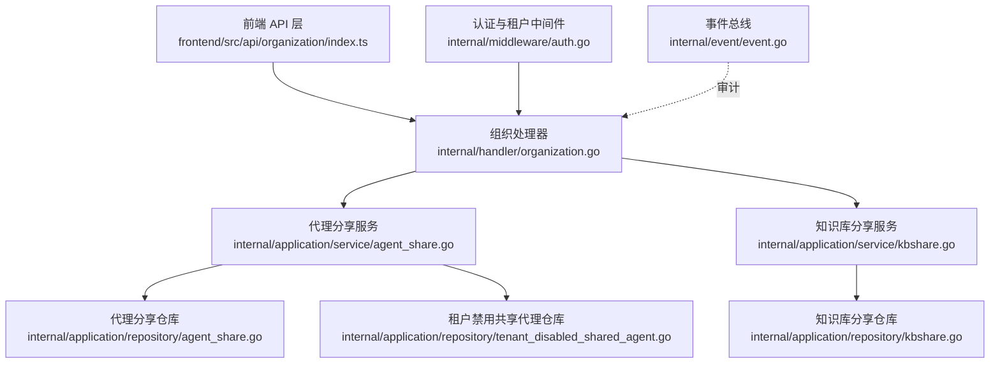
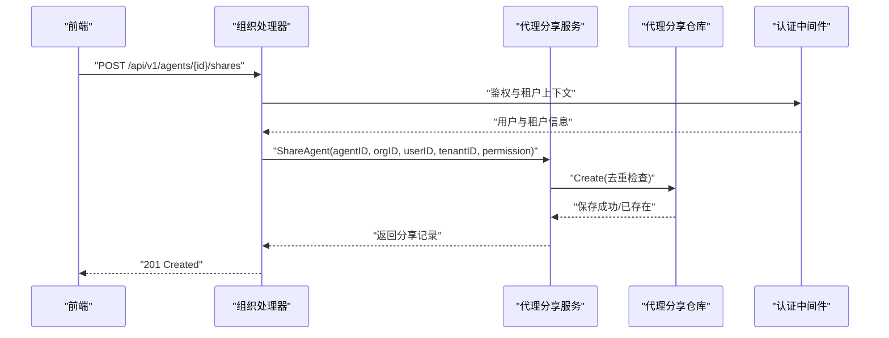
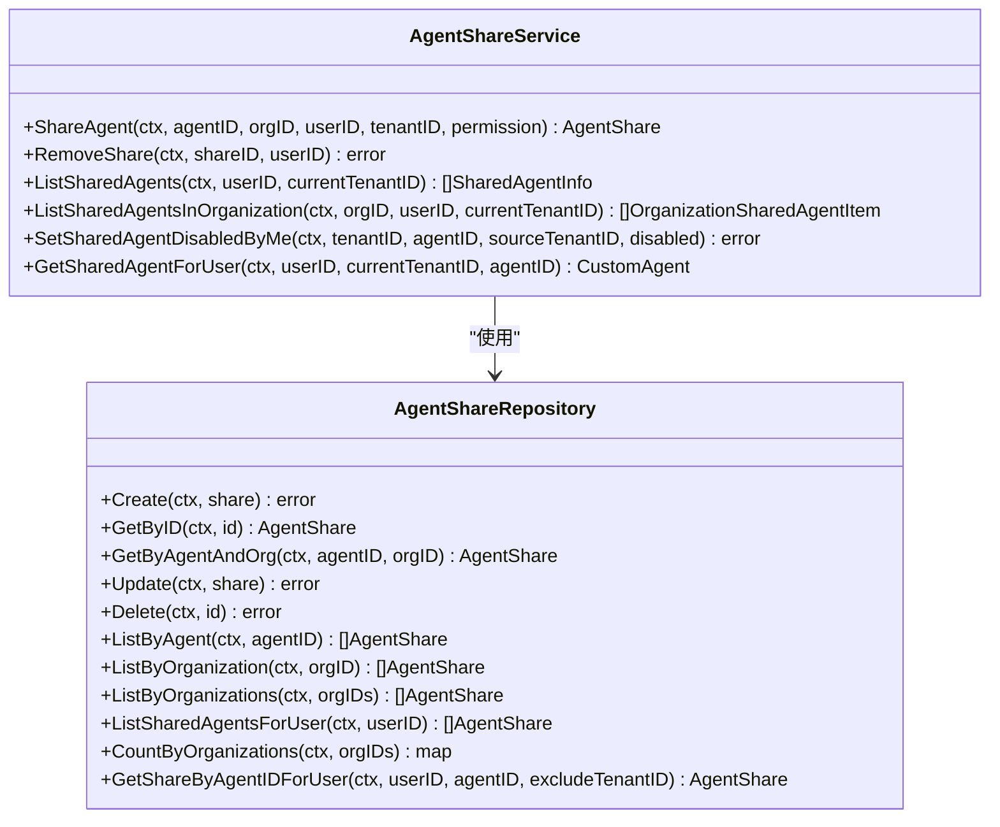
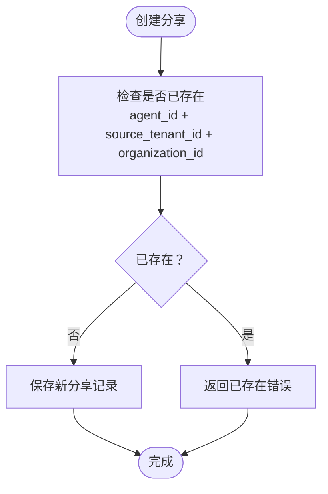
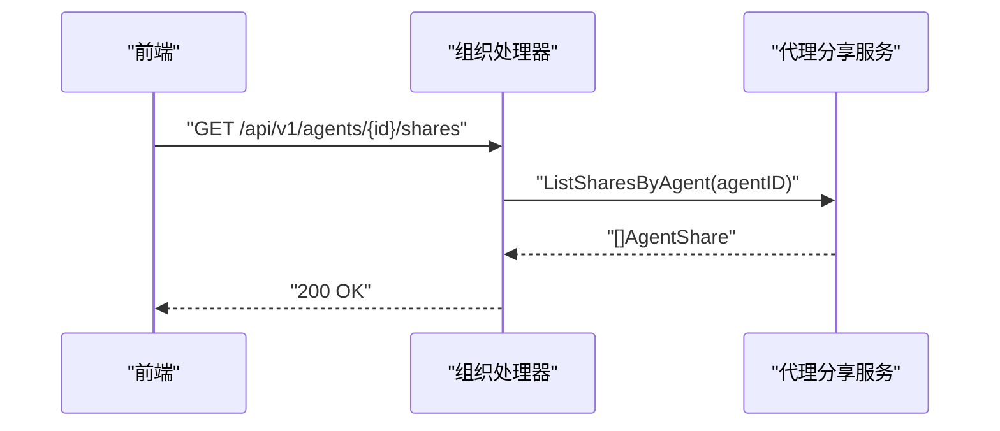
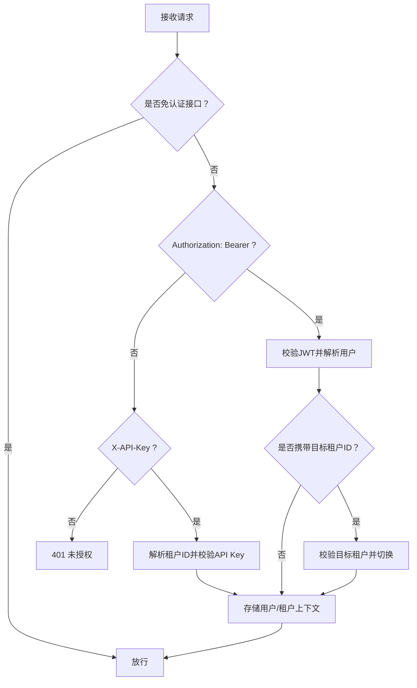
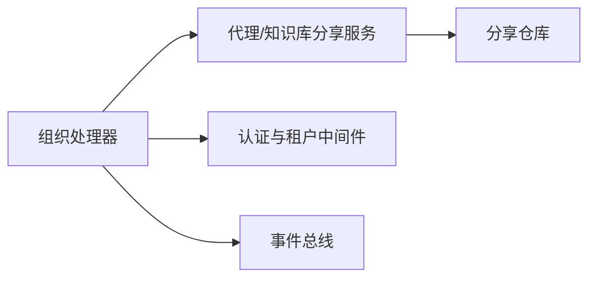

# 代理分享机制

<cite>
**本文档引用的文件**
- [agent_share.go](file://internal/application/service/agent_share.go)
- [agent_share.go](file://internal/application/repository/agent_share.go)
- [organization.go](file://internal/handler/organization.go)
- [tenant.go](file://internal/handler/tenant.go)
- [auth.go](file://internal/middleware/auth.go)
- [kbshare.go](file://internal/application/service/kbshare.go)
- [tenant_disabled_shared_agent.go](file://internal/application/repository/tenant_disabled_shared_agent.go)
- [organization.go](file://internal/types/interfaces/organization.go)
- [event.go](file://internal/event/event.go)
- [index.ts](file://frontend/src/api/organization/index.ts)
</cite>

## 目录
1. [简介](#简介)
2. [项目结构](#项目结构)
3. [核心组件](#核心组件)
4. [架构总览](#架构总览)
5. [详细组件分析](#详细组件分析)
6. [依赖关系分析](#依赖关系分析)
7. [性能考虑](#性能考虑)
8. [故障排查指南](#故障排查指南)
9. [结论](#结论)
10. [附录](#附录)

## 简介
本文件系统性阐述 WeKnora 代理分享机制的设计与实现，覆盖权限控制、访问管理、版本控制、分享链接生成、访问限制与使用统计等关键能力。重点说明后端服务层如何通过组织成员角色与租户隔离保障安全，前端如何调用接口实现分享操作，并与租户系统、权限管理、审计事件进行集成。

## 项目结构
围绕代理分享机制的关键模块分布如下：
- 应用服务层：负责业务规则与权限校验，如代理分享服务、知识库分享服务、禁用共享代理记录仓库等
- 数据访问层：封装数据库操作，如代理分享仓库、租户禁用共享代理仓库等
- 处理器层：HTTP 接口实现，如组织处理器中的分享相关路由
- 中间件层：认证与租户切换中间件，确保请求上下文包含正确的用户与租户信息
- 前端 API 层：组织相关接口封装，用于触发分享、移除分享、列出共享资源等
- 事件系统：提供统一事件总线，便于审计与监控

**图表来源**
- [organization.go:1244-1310](file://internal/handler/organization.go#L1244-L1310)
- [agent_share.go:78-152](file://internal/application/service/agent_share.go#L78-L152)
- [kbshare.go:50-120](file://internal/application/service/kbshare.go#L50-L120)
- [agent_share.go:27-38](file://internal/application/repository/agent_share.go#L27-L38)
- [tenant_disabled_shared_agent.go:20-47](file://internal/application/repository/tenant_disabled_shared_agent.go#L20-L47)
- [auth.go:65-227](file://internal/middleware/auth.go#L65-L227)
- [event.go:80-101](file://internal/event/event.go#L80-L101)

**章节来源**
- [organization.go:1244-1310](file://internal/handler/organization.go#L1244-L1310)
- [agent_share.go:78-152](file://internal/application/service/agent_share.go#L78-L152)
- [kbshare.go:50-120](file://internal/application/service/kbshare.go#L50-L120)
- [agent_share.go:27-38](file://internal/application/repository/agent_share.go#L27-L38)
- [tenant_disabled_shared_agent.go:20-47](file://internal/application/repository/tenant_disabled_shared_agent.go#L20-L47)
- [auth.go:65-227](file://internal/middleware/auth.go#L65-L227)
- [event.go:80-101](file://internal/event/event.go#L80-L101)

## 核心组件
- 代理分享服务：负责代理分享的创建、删除、权限计算、共享代理列表聚合与禁用标记
- 代理分享仓库：封装代理分享的持久化操作，包括去重、计数、按用户/组织批量查询
- 组织处理器：暴露 HTTP 接口，处理分享代理、列出分享、移除分享等请求
- 认证与租户中间件：统一鉴权入口，支持 JWT 与 API Key，支持跨租户访问策略
- 知识库分享服务：与代理分享类似，但面向知识库资源
- 租户禁用共享代理仓库：维护“当前租户禁用的其他租户共享代理”集合，用于界面过滤
- 事件总线：提供统一事件发布订阅，便于审计与监控

**章节来源**
- [agent_share.go:52-76](file://internal/application/service/agent_share.go#L52-L76)
- [agent_share.go:17-25](file://internal/application/repository/agent_share.go#L17-L25)
- [organization.go:1244-1310](file://internal/handler/organization.go#L1244-L1310)
- [auth.go:65-227](file://internal/middleware/auth.go#L65-L227)
- [kbshare.go:24-48](file://internal/application/service/kbshare.go#L24-L48)
- [tenant_disabled_shared_agent.go:11-18](file://internal/application/repository/tenant_disabled_shared_agent.go#L11-L18)
- [event.go:80-101](file://internal/event/event.go#L80-L101)

## 架构总览
代理分享机制遵循分层架构：前端通过组织处理器发起分享请求，处理器调用应用服务层执行业务逻辑，服务层通过仓库层访问数据库，同时受认证中间件保护，最终通过事件总线记录审计事件。

**图表来源**
- [organization.go:1244-1271](file://internal/handler/organization.go#L1244-L1271)
- [agent_share.go:78-152](file://internal/application/service/agent_share.go#L78-L152)
- [agent_share.go:27-38](file://internal/application/repository/agent_share.go#L27-L38)
- [auth.go:65-227](file://internal/middleware/auth.go#L65-L227)

**章节来源**
- [organization.go:1244-1271](file://internal/handler/organization.go#L1244-L1271)
- [agent_share.go:78-152](file://internal/application/service/agent_share.go#L78-L152)
- [agent_share.go:27-38](file://internal/application/repository/agent_share.go#L27-L38)
- [auth.go:65-227](file://internal/middleware/auth.go#L65-L227)

## 详细组件分析

### 代理分享服务（AgentShareService）
职责与要点：
- 分享创建：校验代理存在性与归属、组织存在性、调用者组织角色（仅编辑以上）、代理配置完整性（聊天模型必填，启用知识检索工具时需重排序模型），固定权限为只读
- 权限计算：对用户在各组织中的有效权限取最小值，避免越权
- 列表聚合：按代理与源租户去重，保留最高权限项；补充“是否被当前租户禁用”标记
- 删除与权限变更：支持分享者或组织管理员删除/修改权限
- 辅助查询：按用户/组织/多组织批量查询分享记录，计算组织分享计数

**图表来源**
- [agent_share.go:52-76](file://internal/application/service/agent_share.go#L52-L76)
- [agent_share.go:17-25](file://internal/application/repository/agent_share.go#L17-L25)

**章节来源**
- [agent_share.go:78-152](file://internal/application/service/agent_share.go#L78-L152)
- [agent_share.go:183-254](file://internal/application/service/agent_share.go#L183-L254)
- [agent_share.go:256-324](file://internal/application/service/agent_share.go#L256-L324)
- [agent_share.go:396-407](file://internal/application/service/agent_share.go#L396-L407)
- [agent_share.go:409-429](file://internal/application/service/agent_share.go#L409-L429)
- [agent_share.go:466-493](file://internal/application/service/agent_share.go#L466-L493)
- [agent_share.go:27-38](file://internal/application/repository/agent_share.go#L27-L38)
- [agent_share.go:91-138](file://internal/application/repository/agent_share.go#L91-L138)
- [agent_share.go:169-205](file://internal/application/repository/agent_share.go#L169-L205)

### 代理分享仓库（AgentShareRepository）
职责与要点：
- 去重约束：同一代理、源租户、组织的分享记录唯一
- 查询优化：按代理/组织/用户批量查询，支持计数与关联预加载
- 软删除：支持按代理/组织维度软删除，保证历史审计

**图表来源**
- [agent_share.go:27-38](file://internal/application/repository/agent_share.go#L27-L38)

**章节来源**
- [agent_share.go:27-38](file://internal/application/repository/agent_share.go#L27-L38)
- [agent_share.go:91-138](file://internal/application/repository/agent_share.go#L91-L138)
- [agent_share.go:140-167](file://internal/application/repository/agent_share.go#L140-L167)
- [agent_share.go:169-205](file://internal/application/repository/agent_share.go#L169-L205)

### 组织处理器（OrganizationHandler）
职责与要点：
- 提供分享代理、列出分享、移除分享、列出组织内分享等接口
- 在处理器层进行参数绑定、错误分类与响应
- 对“组织内分享列表”返回“分享权限”与“用户在组织内的角色”的交集作为有效权限

**图表来源**
- [organization.go:1274-1296](file://internal/handler/organization.go#L1274-L1296)

**章节来源**
- [organization.go:1244-1271](file://internal/handler/organization.go#L1244-L1271)
- [organization.go:1274-1296](file://internal/handler/organization.go#L1274-L1296)
- [organization.go:1299-1310](file://internal/handler/organization.go#L1299-L1310)
- [organization.go:1312-1371](file://internal/handler/organization.go#L1312-L1371)
- [organization.go:1373-1385](file://internal/handler/organization.go#L1373-L1385)

### 认证与租户中间件（Auth Middleware）
职责与要点：
- 支持 JWT Bearer 与 X-API-Key 两种认证方式
- 支持跨租户访问策略：当启用跨租户访问且用户具备相应权限时，允许通过请求头切换目标租户
- 将用户与租户信息注入请求上下文，供后续处理器使用

**图表来源**
- [auth.go:65-227](file://internal/middleware/auth.go#L65-L227)

**章节来源**
- [auth.go:65-227](file://internal/middleware/auth.go#L65-L227)

### 知识库分享服务（KBShareService）
职责与要点：
- 与代理分享类似，但面向知识库资源；组织成员至少为编辑才可分享
- 提供知识库权限检查、共享计数、按组织批量查询等能力
- 支持根据知识库类型计算知识/块数量，用于前端展示

**章节来源**
- [kbshare.go:50-120](file://internal/application/service/kbshare.go#L50-L120)
- [kbshare.go:194-290](file://internal/application/service/kbshare.go#L194-L290)
- [kbshare.go:292-349](file://internal/application/service/kbshare.go#L292-L349)
- [kbshare.go:404-452](file://internal/application/service/kbshare.go#L404-L452)
- [kbshare.go:454-483](file://internal/application/service/kbshare.go#L454-L483)

### 租户禁用共享代理仓库（TenantDisabledSharedAgentRepository）
职责与要点：
- 维护“当前租户禁用的其他租户共享代理”集合
- 支持按租户列出、添加、移除禁用项
- 用于前端界面过滤，避免显示已被禁用的共享代理

**章节来源**
- [tenant_disabled_shared_agent.go:20-47](file://internal/application/repository/tenant_disabled_shared_agent.go#L20-L47)

### 前端 API 层（Organization API）
职责与要点：
- 提供分享代理、移除分享、列出共享代理、列出组织内分享等接口封装
- 与后端组织处理器一一对应，便于前端调用

**章节来源**
- [index.ts:527-659](file://frontend/src/api/organization/index.ts#L527-L659)
- [index.ts:562-596](file://frontend/src/api/organization/index.ts#L562-L596)

## 依赖关系分析
- 服务层依赖仓库层：服务层通过仓库层访问数据库，实现业务规则与数据持久化解耦
- 处理器层依赖服务层：处理器负责接口契约与错误处理，业务逻辑由服务层承担
- 中间件层贯穿：认证与租户中间件在请求进入处理器前统一注入上下文
- 事件系统：事件总线提供统一事件发布订阅，便于审计与监控

**图表来源**
- [organization.go:1244-1310](file://internal/handler/organization.go#L1244-L1310)
- [agent_share.go:52-76](file://internal/application/service/agent_share.go#L52-L76)
- [agent_share.go:17-25](file://internal/application/repository/agent_share.go#L17-L25)
- [auth.go:65-227](file://internal/middleware/auth.go#L65-L227)
- [event.go:80-101](file://internal/event/event.go#L80-L101)

**章节来源**
- [organization.go:1244-1310](file://internal/handler/organization.go#L1244-L1310)
- [agent_share.go:52-76](file://internal/application/service/agent_share.go#L52-L76)
- [agent_share.go:17-25](file://internal/application/repository/agent_share.go#L17-L25)
- [auth.go:65-227](file://internal/middleware/auth.go#L65-L227)
- [event.go:80-101](file://internal/event/event.go#L80-L101)

## 性能考虑
- 批量查询与去重：服务层对用户可见的共享代理/知识库进行去重与权限合并，减少前端重复处理
- 关联预加载：仓库层在查询分享时预加载组织与代理信息，降低 N+1 查询风险
- 计数查询：提供按组织计数与批量查询，便于前端侧边栏快速渲染
- 事件异步：事件总线支持异步模式，避免阻塞主业务流程

[本节为通用指导，无需特定文件来源]

## 故障排查指南
常见错误与定位建议：
- 权限不足：处理器对不同错误进行分类返回，如“仅编辑与管理员可分享代理”“代理未完全配置”等
- 分享不存在：仓库层返回“分享不存在”，需确认分享 ID 或用户是否属于分享组织
- 跨租户访问受限：中间件对跨租户访问进行严格校验，需确认用户权限与目标租户有效性
- API Key 校验失败：中间件对 API Key 格式与有效性进行校验，需检查密钥格式与租户状态

**章节来源**
- [organization.go:1257-1271](file://internal/handler/organization.go#L1257-L1271)
- [agent_share.go:78-152](file://internal/application/service/agent_share.go#L78-L152)
- [agent_share.go:40-51](file://internal/application/repository/agent_share.go#L40-L51)
- [auth.go:158-227](file://internal/middleware/auth.go#L158-L227)

## 结论
WeKnora 的代理分享机制通过清晰的分层设计与严格的权限控制，实现了跨租户的安全共享。服务层负责业务规则与权限计算，仓库层提供高效的数据访问，处理器层统一对外接口，中间件层确保认证与租户上下文一致。配合事件总线，可进一步完善审计与监控能力。前端通过组织 API 封装，简化了分享操作的调用流程。

[本节为总结，无需特定文件来源]

## 附录

### 与租户系统的集成
- 认证中间件支持跨租户访问策略，通过请求头切换目标租户
- 服务层在分享与查询时区分“源租户”与“当前租户”，避免越权访问
- 租户禁用共享代理仓库维护“当前租户禁用的其他租户共享代理”集合

**章节来源**
- [auth.go:65-227](file://internal/middleware/auth.go#L65-L227)
- [agent_share.go:183-254](file://internal/application/service/agent_share.go#L183-L254)
- [tenant_disabled_shared_agent.go:20-47](file://internal/application/repository/tenant_disabled_shared_agent.go#L20-L47)

### 与权限管理的集成
- 组织成员角色（查看者、编辑者、管理员）决定分享与操作权限
- 服务层对“分享权限”与“用户在组织内角色”的交集进行有效权限计算
- 支持组织管理员删除任意分享，分享者可修改自身分享的权限

**章节来源**
- [organization.go:1312-1371](file://internal/handler/organization.go#L1312-L1371)
- [kbshare.go:122-175](file://internal/application/service/kbshare.go#L122-L175)

### 与审计日志的集成
- 事件总线提供统一事件发布订阅，可用于记录分享、删除、权限变更等关键操作
- 建议在处理器层或服务层对关键操作进行事件发布，便于审计与监控

**章节来源**
- [event.go:80-101](file://internal/event/event.go#L80-L101)