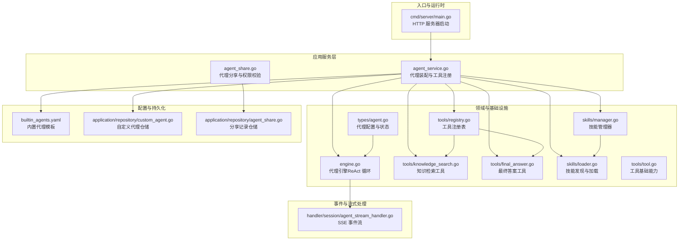
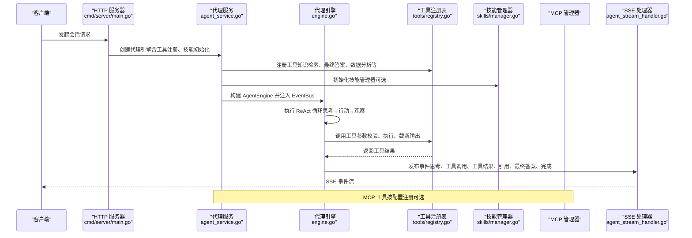
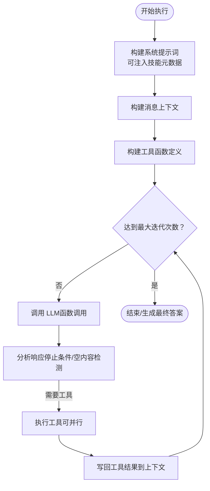
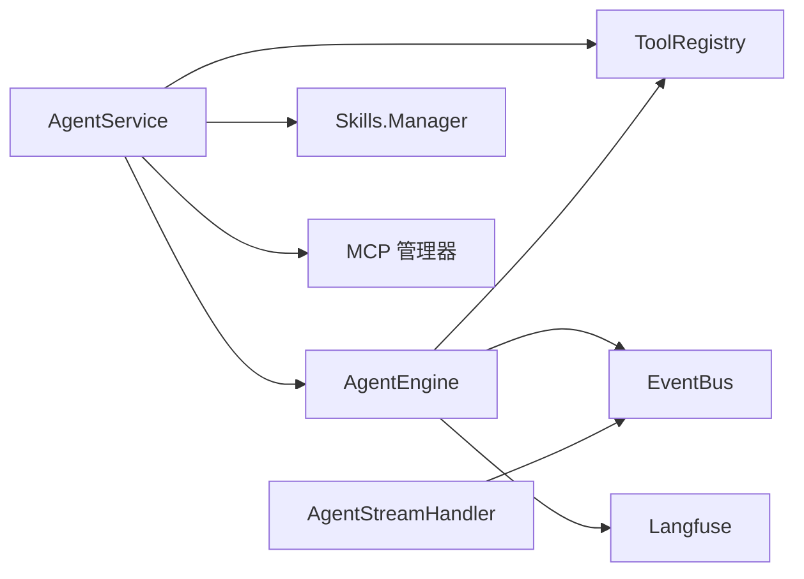

# 代理服务

<cite>
**本文引用的文件**
- [cmd/server/main.go](file://cmd/server/main.go)
- [internal/agent/engine.go](file://internal/agent/engine.go)
- [internal/application/service/agent_service.go](file://internal/application/service/agent_service.go)
- [internal/agent/skills/manager.go](file://internal/agent/skills/manager.go)
- [internal/agent/tools/registry.go](file://internal/agent/tools/registry.go)
- [internal/types/agent.go](file://internal/types/agent.go)
- [internal/agent/skills/loader.go](file://internal/agent/skills/loader.go)
- [internal/agent/tools/tool.go](file://internal/agent/tools/tool.go)
- [internal/application/repository/custom_agent.go](file://internal/application/repository/custom_agent.go)
- [config/builtin_agents.yaml](file://config/builtin_agents.yaml)
- [internal/handler/session/agent_stream_handler.go](file://internal/handler/session/agent_stream_handler.go)
- [internal/agent/tools/knowledge_search.go](file://internal/agent/tools/knowledge_search.go)
- [internal/agent/tools/final_answer.go](file://internal/agent/tools/final_answer.go)
- [internal/application/service/agent_share.go](file://internal/application/service/agent_share.go)
- [internal/application/repository/agent_share.go](file://internal/application/repository/agent_share.go)
</cite>

## 目录
1. [简介](#简介)
2. [项目结构](#项目结构)
3. [核心组件](#核心组件)
4. [架构总览](#架构总览)
5. [详细组件分析](#详细组件分析)
6. [依赖分析](#依赖分析)
7. [性能考虑](#性能考虑)
8. [故障排查指南](#故障排查指南)
9. [结论](#结论)
10. [附录](#附录)

## 简介
本技术文档围绕 WeKnora 代理服务展开，系统性阐述代理配置管理、自定义代理创建、代理分享机制、技能系统（含沙箱执行）以及代理生命周期管理、工具调用、上下文处理与性能监控等实现细节。文档同时给出与代理引擎、技能系统、权限控制的集成关系说明，并提供可直接定位到源码路径的示例，帮助读者快速理解并扩展代理能力。

## 项目结构
WeKnora 后端采用分层架构：入口程序负责启动 HTTP 服务器与资源清理；应用层封装业务逻辑（如代理服务、知识检索、工具注册等）；领域层包含代理引擎、工具注册表、技能管理器与沙箱；类型与接口层统一数据结构与契约；配置层提供内置代理模板与提示词模板；事件与流式处理器负责将代理执行过程以 SSE 形式输出给前端。

图表来源
- [cmd/server/main.go:1-124](file://cmd/server/main.go#L1-L124)
- [internal/application/service/agent_service.go:1-797](file://internal/application/service/agent_service.go#L1-L797)
- [internal/agent/engine.go:1-675](file://internal/agent/engine.go#L1-L675)
- [internal/agent/tools/registry.go:1-171](file://internal/agent/tools/registry.go#L1-L171)
- [internal/agent/tools/knowledge_search.go:1-800](file://internal/agent/tools/knowledge_search.go#L1-L800)
- [internal/agent/tools/final_answer.go:1-151](file://internal/agent/tools/final_answer.go#L1-L151)
- [internal/agent/skills/manager.go:1-284](file://internal/agent/skills/manager.go#L1-L284)
- [internal/agent/skills/loader.go:1-309](file://internal/agent/skills/loader.go#L1-L309)
- [internal/agent/tools/tool.go:1-86](file://internal/agent/tools/tool.go#L1-L86)
- [internal/types/agent.go:1-225](file://internal/types/agent.go#L1-L225)
- [config/builtin_agents.yaml:1-236](file://config/builtin_agents.yaml#L1-L236)
- [internal/application/repository/custom_agent.go:1-63](file://internal/application/repository/custom_agent.go#L1-L63)
- [internal/application/repository/agent_share.go:1-206](file://internal/application/repository/agent_share.go#L1-L206)
- [internal/handler/session/agent_stream_handler.go:1-506](file://internal/handler/session/agent_stream_handler.go#L1-L506)

章节来源
- [cmd/server/main.go:1-124](file://cmd/server/main.go#L1-L124)
- [internal/application/service/agent_service.go:1-797](file://internal/application/service/agent_service.go#L1-L797)

## 核心组件
- 代理引擎（AgentEngine）
  - 负责 ReAct 推理循环：思考（LLM）、分析（停止条件）、行动（工具调用）、观察（结果写回上下文）。
  - 支持上下文窗口压缩、并发工具调用、图像描述（VLM）、Langfuse 性能追踪。
  - 参考路径：[internal/agent/engine.go:1-675](file://internal/agent/engine.go#L1-L675)

- 工具注册表（ToolRegistry）
  - 统一注册、参数校验、参数修复、执行与清理。
  - 支持最大工具输出截断，防止上下文污染。
  - 参考路径：[internal/agent/tools/registry.go:1-171](file://internal/agent/tools/registry.go#L1-L171)

- 技能系统（Skills Manager + Loader）
  - 渐进披露：一级（元数据）、二级（指令）、三级（脚本文件）。
  - 支持白名单过滤、缓存、沙箱执行（Docker/本地/禁用）。
  - 参考路径：[internal/agent/skills/manager.go:1-284](file://internal/agent/skills/manager.go#L1-L284)、[internal/agent/skills/loader.go:1-309](file://internal/agent/skills/loader.go#L1-L309)

- 代理服务（AgentService）
  - 负责装配引擎、注册工具、解析 MCP 工具、初始化技能管理器、设置 VLM 图像分析器。
  - 参考路径：[internal/application/service/agent_service.go:1-797](file://internal/application/service/agent_service.go#L1-L797)

- 自定义代理与分享（CustomAgent + AgentShare）
  - 自定义代理仓储与分享服务，包含权限校验、组织成员角色检查、分享记录与禁用列表。
  - 参考路径：[internal/application/repository/custom_agent.go:1-63](file://internal/application/repository/custom_agent.go#L1-L63)、[internal/application/service/agent_share.go:1-494](file://internal/application/service/agent_share.go#L1-L494)、[internal/application/repository/agent_share.go:1-206](file://internal/application/repository/agent_share.go#L1-L206)

- 流式事件处理器（AgentStreamHandler）
  - 将代理事件（思考、工具调用、工具结果、引用、最终答案、完成）通过 SSE 输出。
  - 参考路径：[internal/handler/session/agent_stream_handler.go:1-506](file://internal/handler/session/agent_stream_handler.go#L1-L506)

章节来源
- [internal/agent/engine.go:1-675](file://internal/agent/engine.go#L1-L675)
- [internal/agent/tools/registry.go:1-171](file://internal/agent/tools/registry.go#L1-L171)
- [internal/agent/skills/manager.go:1-284](file://internal/agent/skills/manager.go#L1-L284)
- [internal/agent/skills/loader.go:1-309](file://internal/agent/skills/loader.go#L1-L309)
- [internal/application/service/agent_service.go:1-797](file://internal/application/service/agent_service.go#L1-L797)
- [internal/application/repository/custom_agent.go:1-63](file://internal/application/repository/custom_agent.go#L1-L63)
- [internal/application/service/agent_share.go:1-494](file://internal/application/service/agent_share.go#L1-L494)
- [internal/application/repository/agent_share.go:1-206](file://internal/application/repository/agent_share.go#L1-L206)
- [internal/handler/session/agent_stream_handler.go:1-506](file://internal/handler/session/agent_stream_handler.go#L1-L506)

## 架构总览
下图展示了从请求进入、代理装配、工具执行到事件流输出的完整链路，以及与 MCP、技能系统、权限控制的集成点。

图表来源
- [cmd/server/main.go:1-124](file://cmd/server/main.go#L1-L124)
- [internal/application/service/agent_service.go:1-797](file://internal/application/service/agent_service.go#L1-L797)
- [internal/agent/engine.go:1-675](file://internal/agent/engine.go#L1-L675)
- [internal/agent/tools/registry.go:1-171](file://internal/agent/tools/registry.go#L1-L171)
- [internal/agent/skills/manager.go:1-284](file://internal/agent/skills/manager.go#L1-L284)
- [internal/handler/session/agent_stream_handler.go:1-506](file://internal/handler/session/agent_stream_handler.go#L1-L506)

## 详细组件分析

### 代理引擎（AgentEngine）
- 关键职责
  - 构建系统提示词（支持技能元数据注入），准备消息上下文，构建工具函数定义。
  - 执行 ReAct 循环：每次迭代估算上下文 token 数，必要时压缩历史；调用 LLM 获取思维与工具调用；并发或串行执行工具；将结果写回上下文。
  - 支持 VLM 对工具返回图片进行描述，增强工具结果可读性。
  - 使用 Langfuse 追踪单次执行的 spans，便于性能分析与可视化。
- 上下文窗口管理
  - 基于上次用量与增量 BPE 估算当前 token 数，必要时通过内存整理器压缩旧消息，保留工具调用对。
- 并发工具调用
  - 可配置并行执行多个工具调用，提升吞吐。
- 错误处理与兜底
  - 自动检测“空内容”并重试，超过阈值后生成兜底回复。
  - 记录错误事件并通过 EventBus 传播。

图表来源
- [internal/agent/engine.go:158-675](file://internal/agent/engine.go#L158-L675)

章节来源
- [internal/agent/engine.go:1-675](file://internal/agent/engine.go#L1-L675)

### 工具注册表与工具执行
- 注册表
  - 提供注册、查询、函数定义导出、执行与清理能力。
  - 参数修复与校验，避免无效参数导致的工具失败。
  - 输出截断，防止超长结果污染上下文。
- 常用工具
  - 知识检索工具：语义/混合检索、去重、重排序（rerank）、MMR、FAQ 优先策略。
  - 最终答案工具：严格解析最终答案参数，容忍 LLM 的 JSON 不规范输出。
- 参考路径
  - [internal/agent/tools/registry.go:1-171](file://internal/agent/tools/registry.go#L1-L171)
  - [internal/agent/tools/knowledge_search.go:1-800](file://internal/agent/tools/knowledge_search.go#L1-L800)
  - [internal/agent/tools/final_answer.go:1-151](file://internal/agent/tools/final_answer.go#L1-L151)

章节来源
- [internal/agent/tools/registry.go:1-171](file://internal/agent/tools/registry.go#L1-L171)
- [internal/agent/tools/knowledge_search.go:1-800](file://internal/agent/tools/knowledge_search.go#L1-L800)
- [internal/agent/tools/final_answer.go:1-151](file://internal/agent/tools/final_answer.go#L1-L151)

### 技能系统（Manager + Loader）
- 渐进披露
  - Level 1：发现技能目录中的 SKILL.md，提取元数据。
  - Level 2：加载技能完整指令。
  - Level 3：读取技能内的任意文件（如脚本）。
- 安全与隔离
  - 白名单过滤允许的技能名。
  - 文件路径安全检查，防止越权访问。
  - 沙箱执行（Docker/本地/禁用），支持超时与镜像配置。
- 生命周期
  - 初始化发现与缓存；支持热重载；清理释放资源。
- 参考路径
  - [internal/agent/skills/manager.go:1-284](file://internal/agent/skills/manager.go#L1-L284)
  - [internal/agent/skills/loader.go:1-309](file://internal/agent/skills/loader.go#L1-L309)

章节来源
- [internal/agent/skills/manager.go:1-284](file://internal/agent/skills/manager.go#L1-L284)
- [internal/agent/skills/loader.go:1-309](file://internal/agent/skills/loader.go#L1-L309)

### 代理服务（装配与工具注册）
- 职责
  - 校验代理配置，注册工具（含知识检索、数据分析、Web 搜索、Wiki 工具等），注册 MCP 工具。
  - 解析知识库与选定文档信息，构建系统提示词模板。
  - 初始化技能管理器（可选），设置 VLM 图像分析器。
- 参考路径
  - [internal/application/service/agent_service.go:1-797](file://internal/application/service/agent_service.go#L1-L797)

章节来源
- [internal/application/service/agent_service.go:1-797](file://internal/application/service/agent_service.go#L1-L797)

### 自定义代理与分享机制
- 自定义代理
  - 仓储提供创建、查询、更新、删除（软删）能力。
  - 参考路径：[internal/application/repository/custom_agent.go:1-63](file://internal/application/repository/custom_agent.go#L1-L63)
- 分享机制
  - 校验分享者与被分享组织成员角色，强制只读权限。
  - 分享记录仓储支持批量查询、计数、禁用列表维护。
  - 分享服务提供用户可访问的共享代理列表、组织内共享代理列表、按组织批量查询等。
  - 参考路径：
    - [internal/application/service/agent_share.go:1-494](file://internal/application/service/agent_share.go#L1-L494)
    - [internal/application/repository/agent_share.go:1-206](file://internal/application/repository/agent_share.go#L1-L206)

章节来源
- [internal/application/repository/custom_agent.go:1-63](file://internal/application/repository/custom_agent.go#L1-L63)
- [internal/application/service/agent_share.go:1-494](file://internal/application/service/agent_share.go#L1-L494)
- [internal/application/repository/agent_share.go:1-206](file://internal/application/repository/agent_share.go#L1-L206)

### 流式事件处理（SSE）
- 职责
  - 订阅代理事件（思考、工具调用、工具结果、引用、最终答案、完成、错误、会话标题等）。
  - 将事件以 SSE 形式发送至前端，前端负责累积与渲染。
- 参考路径
  - [internal/handler/session/agent_stream_handler.go:1-506](file://internal/handler/session/agent_stream_handler.go#L1-L506)

章节来源
- [internal/handler/session/agent_stream_handler.go:1-506](file://internal/handler/session/agent_stream_handler.go#L1-L506)

### 代理配置与内置模板
- 代理配置
  - 包含最大迭代次数、允许工具、温度、知识库选择、Web 搜索开关、多轮对话、上下文窗口、工具输出上限、并行工具调用、技能启用与目录、MCP 选择模式等。
  - 参考路径：[internal/types/agent.go:1-225](file://internal/types/agent.go#L1-L225)
- 内置代理模板
  - 提供多种内置代理（快速问答、智能推理、数据分析师、Wiki 研究者、Wiki 修订者），包含系统提示词 ID、上下文模板 ID、温度、最大补全 token、工具白名单、检索策略等。
  - 参考路径：[config/builtin_agents.yaml:1-236](file://config/builtin_agents.yaml#L1-L236)

章节来源
- [internal/types/agent.go:1-225](file://internal/types/agent.go#L1-L225)
- [config/builtin_agents.yaml:1-236](file://config/builtin_agents.yaml#L1-L236)

## 依赖分析
- 组件耦合
  - AgentService 作为装配中心，依赖工具注册表、技能管理器、MCP 管理器、知识库/知识/文件/向量库等服务。
  - AgentEngine 依赖工具注册表、事件总线、上下文管理器、Langfuse 追踪。
  - AgentStreamHandler 依赖事件总线与流管理器。
- 外部依赖
  - MCP 服务（可选）通过注册表注入工具。
  - VLM 模型用于工具结果图片描述。
  - Langfuse 用于性能追踪与可视化。
- 循环依赖
  - 未发现直接循环依赖；各模块通过接口与依赖注入解耦。

图表来源
- [internal/application/service/agent_service.go:1-797](file://internal/application/service/agent_service.go#L1-L797)
- [internal/agent/engine.go:1-675](file://internal/agent/engine.go#L1-L675)
- [internal/agent/tools/registry.go:1-171](file://internal/agent/tools/registry.go#L1-L171)
- [internal/agent/skills/manager.go:1-284](file://internal/agent/skills/manager.go#L1-L284)
- [internal/handler/session/agent_stream_handler.go:1-506](file://internal/handler/session/agent_stream_handler.go#L1-L506)

章节来源
- [internal/application/service/agent_service.go:1-797](file://internal/application/service/agent_service.go#L1-L797)
- [internal/agent/engine.go:1-675](file://internal/agent/engine.go#L1-L675)
- [internal/agent/tools/registry.go:1-171](file://internal/agent/tools/registry.go#L1-L171)
- [internal/agent/skills/manager.go:1-284](file://internal/agent/skills/manager.go#L1-L284)
- [internal/handler/session/agent_stream_handler.go:1-506](file://internal/handler/session/agent_stream_handler.go#L1-L506)

## 性能考虑
- 上下文窗口管理
  - 通过估计当前 token 数与内存整理器压缩历史消息，避免超出模型上下文限制。
- 工具输出截断
  - 注册表对工具输出进行截断，防止超长文本污染上下文。
- 并发工具调用
  - 可配置并行执行多个工具调用，减少总耗时。
- 重排序与多样性
  - 知识检索工具支持 LLM 或 rerank 模型重排序，以及 MMR 降低冗余，提升相关性与多样性。
- 追踪与可观测性
  - Langfuse 为一次代理执行建立顶层 span，便于定位瓶颈与优化。

章节来源
- [internal/agent/engine.go:146-156](file://internal/agent/engine.go#L146-L156)
- [internal/agent/tools/registry.go:129-133](file://internal/agent/tools/registry.go#L129-L133)
- [internal/agent/tools/knowledge_search.go:302-375](file://internal/agent/tools/knowledge_search.go#L302-L375)

## 故障排查指南
- 代理执行中断或卡死
  - 检查是否出现连续相同内容且无工具调用，引擎会自动检测并终止，必要时检查工具调用是否正确返回。
  - 参考路径：[internal/agent/engine.go:528-547](file://internal/agent/engine.go#L528-L547)
- 工具执行失败
  - 参数校验失败会返回错误提示；建议检查工具参数 Schema 与传入参数类型一致性。
  - 参考路径：[internal/agent/tools/registry.go:115-125](file://internal/agent/tools/registry.go#L115-L125)
- 工具输出过长
  - 注册表会对输出进行截断；若仍影响性能，调整代理配置中的最大工具输出字符数。
  - 参考路径：[internal/agent/tools/registry.go:129-133](file://internal/agent/tools/registry.go#L129-L133)
- 分享权限问题
  - 确认分享者具备编辑/管理员角色，被分享对象为组织成员；仅支持只读权限。
  - 参考路径：[internal/application/service/agent_share.go:116-118](file://internal/application/service/agent_share.go#L116-L118)
- SSE 事件缺失
  - 检查事件总线订阅与流管理器是否正常工作；确认事件类型与会话 ID 正确。
  - 参考路径：[internal/handler/session/agent_stream_handler.go:56-69](file://internal/handler/session/agent_stream_handler.go#L56-L69)

章节来源
- [internal/agent/engine.go:528-547](file://internal/agent/engine.go#L528-L547)
- [internal/agent/tools/registry.go:115-125](file://internal/agent/tools/registry.go#L115-L125)
- [internal/agent/tools/registry.go:129-133](file://internal/agent/tools/registry.go#L129-L133)
- [internal/application/service/agent_share.go:116-118](file://internal/application/service/agent_share.go#L116-L118)
- [internal/handler/session/agent_stream_handler.go:56-69](file://internal/handler/session/agent_stream_handler.go#L56-L69)

## 结论
WeKnora 代理服务通过清晰的分层设计与依赖注入，实现了可插拔的工具体系、可选的技能系统与严格的权限控制。代理引擎以 ReAct 为核心，结合上下文窗口管理、并发工具调用与 Langfuse 追踪，提供了高可用、可观测的智能体执行能力。分享机制与内置模板进一步降低了定制成本，适合在多租户场景下快速落地。

## 附录
- 代码示例路径（不含具体代码内容）
  - 代理配置结构定义：[internal/types/agent.go:15-65](file://internal/types/agent.go#L15-L65)
  - 代理引擎执行流程：[internal/agent/engine.go:158-298](file://internal/agent/engine.go#L158-L298)
  - 工具注册与执行：[internal/agent/tools/registry.go:87-159](file://internal/agent/tools/registry.go#L87-L159)
  - 知识检索工具实现：[internal/agent/tools/knowledge_search.go:161-429](file://internal/agent/tools/knowledge_search.go#L161-L429)
  - 最终答案工具实现：[internal/agent/tools/final_answer.go:62-88](file://internal/agent/tools/final_answer.go#L62-L88)
  - 技能管理器初始化与脚本执行：[internal/agent/skills/manager.go:56-215](file://internal/agent/skills/manager.go#L56-L215)
  - 自定义代理仓储操作：[internal/application/repository/custom_agent.go:25-62](file://internal/application/repository/custom_agent.go#L25-L62)
  - 代理分享服务与权限校验：[internal/application/service/agent_share.go:78-152](file://internal/application/service/agent_share.go#L78-L152)
  - 内置代理模板：[config/builtin_agents.yaml:5-236](file://config/builtin_agents.yaml#L5-L236)
  - SSE 事件流处理：[internal/handler/session/agent_stream_handler.go:56-505](file://internal/handler/session/agent_stream_handler.go#L56-L505)