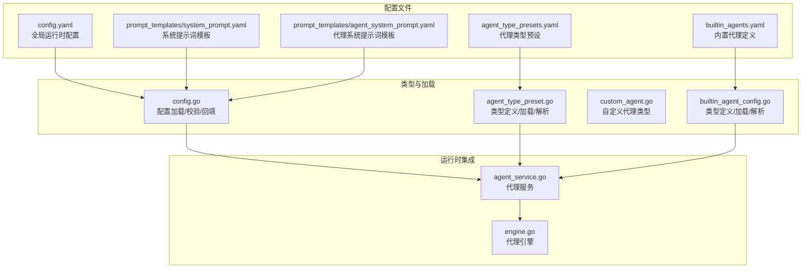
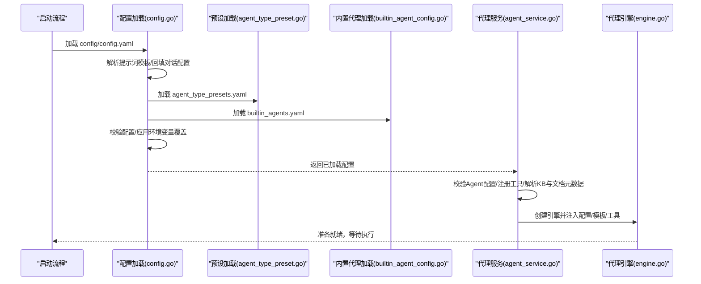
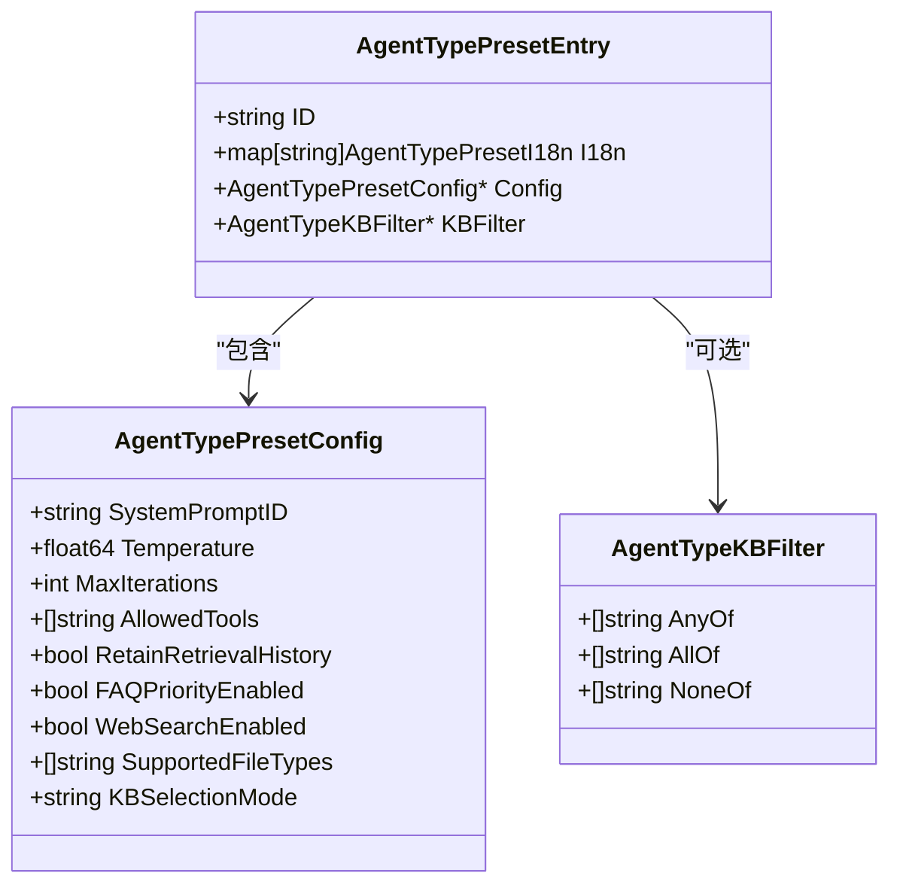
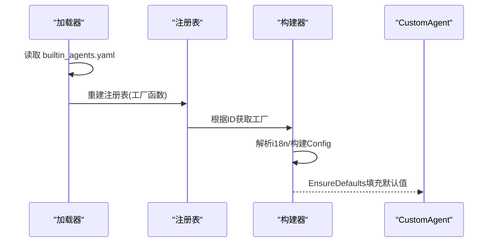
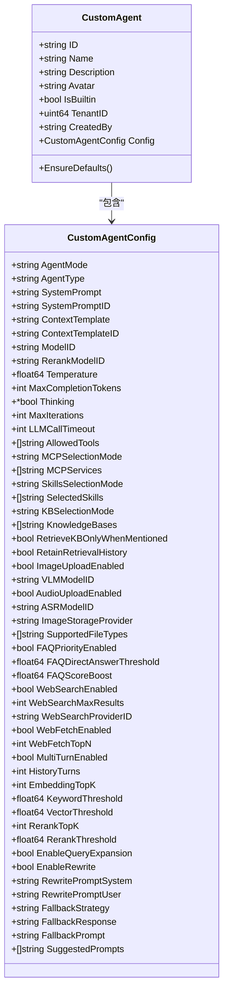
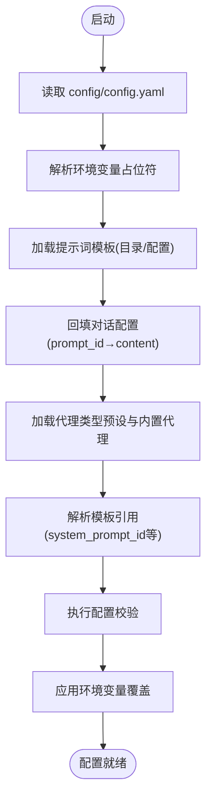
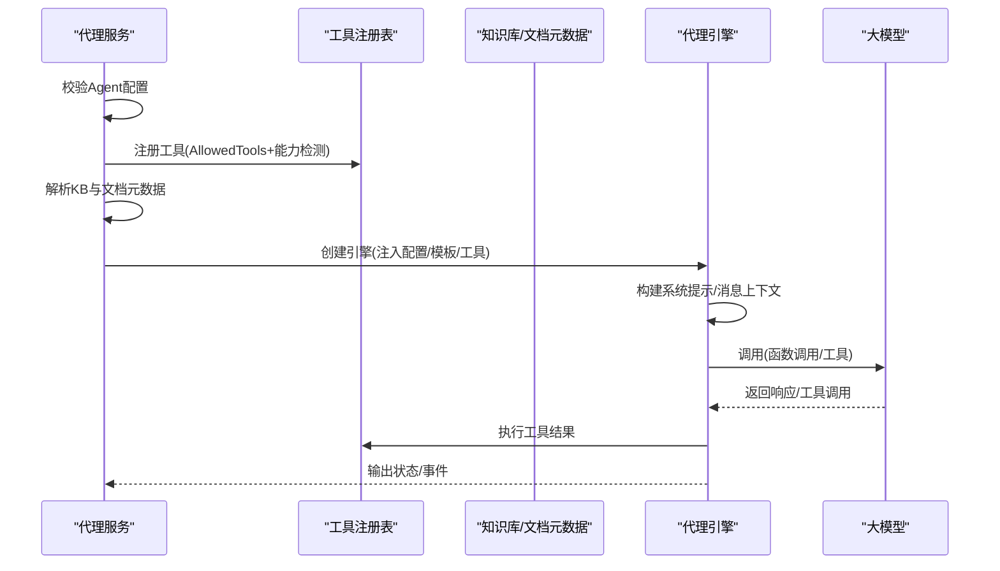
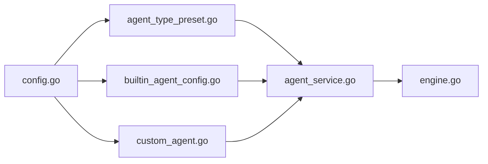

# 代理配置管理

<cite>
**本文档引用的文件**
- [agent_type_presets.yaml](file://config/agent_type_presets.yaml)
- [builtin_agents.yaml](file://config/builtin_agents.yaml)
- [config.yaml](file://config/config.yaml)
- [agent_system_prompt.yaml](file://config/prompt_templates/agent_system_prompt.yaml)
- [system_prompt.yaml](file://config/prompt_templates/system_prompt.yaml)
- [agent_type_preset.go](file://internal/types/agent_type_preset.go)
- [builtin_agent_config.go](file://internal/types/builtin_agent_config.go)
- [custom_agent.go](file://internal/types/custom_agent.go)
- [config.go](file://internal/config/config.go)
- [engine.go](file://internal/agent/engine.go)
- [agent_service.go](file://internal/application/service/agent_service.go)
</cite>

## 目录
1. [简介](#简介)
2. [项目结构](#项目结构)
3. [核心组件](#核心组件)
4. [架构总览](#架构总览)
5. [详细组件分析](#详细组件分析)
6. [依赖关系分析](#依赖关系分析)
7. [性能考虑](#性能考虑)
8. [故障排查指南](#故障排查指南)
9. [结论](#结论)
10. [附录](#附录)

## 简介
本文件系统性阐述 WeKnora 代理配置管理的设计与实现，覆盖代理配置结构、配置验证机制、默认配置策略、代理类型预设、内置代理配置、配置继承关系、作用域与优先级规则、模板系统以及与代理引擎、工具系统、权限控制的集成关系。目标是帮助开发者与运维人员高效理解与维护代理配置体系。

## 项目结构
WeKnora 将“配置”分为两类：
- 运行时配置：位于 config/config.yaml，描述服务器、对话、知识库、租户、提示词模板等全局设置。
- 预设与内置配置：位于 config/agent_type_presets.yaml（智能推理代理类型预设）、config/builtin_agents.yaml（内置代理定义），以及 config/prompt_templates/ 下的各类提示词模板文件。

图表来源
- [config.go:342-438](file://internal/config/config.go#L342-L438)
- [agent_type_preset.go:85-126](file://internal/types/agent_type_preset.go#L85-L126)
- [builtin_agent_config.go:48-89](file://internal/types/builtin_agent_config.go#L48-L89)
- [custom_agent.go:61-86](file://internal/types/custom_agent.go#L61-L86)
- [engine.go:52-92](file://internal/agent/engine.go#L52-L92)
- [agent_service.go:99-173](file://internal/application/service/agent_service.go#L99-L173)

章节来源
- [config.go:342-438](file://internal/config/config.go#L342-L438)
- [agent_type_preset.go:85-126](file://internal/types/agent_type_preset.go#L85-L126)
- [builtin_agent_config.go:48-89](file://internal/types/builtin_agent_config.go#L48-L89)
- [custom_agent.go:61-86](file://internal/types/custom_agent.go#L61-L86)

## 核心组件
- 代理类型预设（AgentTypePresets）
  - 定义于 config/agent_type_presets.yaml，提供“RAG 问答、Wiki 问答、混合检索、数据分析、自定义”等预设类别，自动填充系统提示、工具白名单、知识库选择模式、文件类型限制等。
  - 运行时通过 internal/types/agent_type_preset.go 加载与解析，并提供按语言环境裁剪的 i18n 输出。
- 内置代理（BuiltinAgents）
  - 定义于 config/builtin_agents.yaml，包含“快速问答、智能推理、数据分析师、Wiki 研究员、Wiki 修复者”等内置代理，支持多语言本地化与配置覆盖。
  - 运行时通过 internal/types/builtin_agent_config.go 加载，支持从 YAML 动态重建注册表。
- 自定义代理（CustomAgent）
  - 定义于 internal/types/custom_agent.go，承载完整的代理配置结构（模式、系统提示、工具、知识库、检索策略、多轮对话、Web 搜索、图像上传、文件类型限制、FAQ 策略、高级设置等），并提供 EnsureDefaults 默认值填充。
- 配置加载与校验（Config Loader）
  - internal/config/config.go 负责加载 config/config.yaml，解析提示词模板，回填对话配置，加载内置代理与代理类型预设，执行基本校验与环境变量覆盖。
- 代理引擎与服务集成
  - internal/agent/engine.go 与 internal/application/service/agent_service.go 将配置注入工具注册表、知识库元数据、系统提示模板，驱动 ReAct 执行循环。

章节来源
- [agent_type_presets.yaml:30-204](file://config/agent_type_presets.yaml#L30-L204)
- [builtin_agents.yaml:5-236](file://config/builtin_agents.yaml#L5-L236)
- [agent_type_preset.go:17-83](file://internal/types/agent_type_preset.go#L17-L83)
- [builtin_agent_config.go:18-46](file://internal/types/builtin_agent_config.go#L18-L46)
- [custom_agent.go:88-229](file://internal/types/custom_agent.go#L88-L229)
- [config.go:342-438](file://internal/config/config.go#L342-L438)
- [engine.go:28-92](file://internal/agent/engine.go#L28-L92)
- [agent_service.go:99-173](file://internal/application/service/agent_service.go#L99-L173)

## 架构总览
代理配置管理贯穿“配置加载 → 类型解析 → 注入引擎”的链路。启动阶段完成：
- 读取 config/config.yaml 并解析提示词模板；
- 加载 agent_type_presets.yaml 与 builtin_agents.yaml；
- 回填对话配置（如 prompt_id → content）；
- 校验配置有效性；
- 在服务层将配置转换为工具注册表、系统提示模板与知识库元数据，最终驱动代理引擎执行。

图表来源
- [config.go:342-438](file://internal/config/config.go#L342-L438)
- [agent_type_preset.go:85-126](file://internal/types/agent_type_preset.go#L85-L126)
- [builtin_agent_config.go:48-89](file://internal/types/builtin_agent_config.go#L48-L89)
- [agent_service.go:99-173](file://internal/application/service/agent_service.go#L99-L173)
- [engine.go:158-298](file://internal/agent/engine.go#L158-L298)

## 详细组件分析

### 代理类型预设（AgentTypePresets）
- 结构要点
  - 每个预设包含唯一 id、多语言 i18n、config（用于自动填充编辑器）、可选 kb_filter（基于 KB 能力的过滤谓词）。
  - config 中的关键字段包括：system_prompt_id、temperature、max_iterations、allowed_tools、retain_retrieval_history、faq_priority_enabled、web_search_enabled、supported_file_types、kb_selection_mode 等。
- 运行时行为
  - 加载：LoadAgentTypePresetsConfig 读取 YAML 并建立内存映射，保证插入顺序稳定。
  - 列表：ListAgentTypePresetsWithContext 按请求语言裁剪 i18n，返回紧凑响应。
  - 引用解析：ResolveAgentTypePresetPromptRefs 校验 system_prompt_id 是否存在对应模板。
- KB 过滤规则
  - kb_filter 支持 any_of/all_of/none_of，针对 KB capabilities（vector、keyword、wiki、graph、faq）进行谓词判断；若为空表示不限制。

图表来源
- [agent_type_preset.go:37-67](file://internal/types/agent_type_preset.go#L37-L67)

章节来源
- [agent_type_presets.yaml:30-204](file://config/agent_type_presets.yaml#L30-L204)
- [agent_type_preset.go:78-126](file://internal/types/agent_type_preset.go#L78-L126)

### 内置代理（BuiltinAgents）
- 结构要点
  - 每个内置代理包含 id、avatar、is_builtin、i18n、config（继承自 CustomAgentConfig）。
  - 支持从 YAML 动态重建注册表，使内置代理与自定义代理在运行时无缝切换。
- 运行时行为
  - 加载：LoadBuiltinAgentsConfig 读取 YAML 并重建注册表。
  - 获取：GetBuiltinAgentWithContext 按语言环境解析 i18n 并构建 CustomAgent，随后 EnsureDefaults 填充默认值。
  - 引用解析：ResolveBuiltinAgentPromptRefs 将 system_prompt_id/context_template_id 解析为实际内容。

图表来源
- [builtin_agent_config.go:48-101](file://internal/types/builtin_agent_config.go#L48-L101)
- [builtin_agent_config.go:107-126](file://internal/types/builtin_agent_config.go#L107-L126)
- [builtin_agent_config.go:132-156](file://internal/types/builtin_agent_config.go#L132-L156)

章节来源
- [builtin_agents.yaml:5-236](file://config/builtin_agents.yaml#L5-L236)
- [builtin_agent_config.go:42-101](file://internal/types/builtin_agent_config.go#L42-L101)

### 自定义代理（CustomAgent）
- 结构要点
  - 包含代理标识、名称、描述、头像、是否内置、租户 ID、创建人、配置（CustomAgentConfig）及时间戳。
  - CustomAgentConfig 覆盖模式、系统提示、模型、温度、最大补全 token、思维/待办工具、MCP 与技能选择模式、知识库选择模式、检索历史保留、图像/音频上传、文件类型限制、FAQ 策略、Web 搜索、多轮对话、检索策略、高级设置与建议问题等。
- 默认值策略
  - EnsureDefaults 在空值时填充合理默认，确保最小可用配置。

图表来源
- [custom_agent.go:61-86](file://internal/types/custom_agent.go#L61-L86)
- [custom_agent.go:88-229](file://internal/types/custom_agent.go#L88-L229)
- [custom_agent.go:258-299](file://internal/types/custom_agent.go#L258-L299)

章节来源
- [custom_agent.go:61-86](file://internal/types/custom_agent.go#L61-L86)
- [custom_agent.go:88-229](file://internal/types/custom_agent.go#L88-L229)
- [custom_agent.go:258-299](file://internal/types/custom_agent.go#L258-L299)

### 配置加载与校验（Config Loader）
- 关键流程
  - 读取 config/config.yaml，支持环境变量替换与 ${ENV_VAR} 占位符解析。
  - 加载提示词模板（优先目录文件，其次配置内嵌），并回填对话配置（prompt_id → content）。
  - 加载内置代理与代理类型预设，解析 system_prompt_id/context_template_id 引用，校验模板存在性。
  - 执行 ValidateConfig 基本校验（如 OIDC 参数、知识库 chunk 参数、服务器端口范围等）。
  - 应用环境变量覆盖（如 WEKNORA_AGENT_LLM_TIMEOUT）。
- 作用域与优先级
  - 配置文件 → 环境变量（环境变量优先级更高）→ 运行时默认值（EnsureDefaults）。
  - 模板引用解析：config.yaml 中的 *_prompt_id → prompt_templates/*.yaml 中的实际内容。

图表来源
- [config.go:342-438](file://internal/config/config.go#L342-L438)
- [config.go:440-495](file://internal/config/config.go#L440-L495)
- [config.go:559-571](file://internal/config/config.go#L559-L571)

章节来源
- [config.go:342-438](file://internal/config/config.go#L342-L438)
- [config.go:440-495](file://internal/config/config.go#L440-L495)
- [config.go:559-571](file://internal/config/config.go#L559-L571)

### 代理引擎与工具系统集成
- 服务层装配
  - CreateAgentEngine 校验配置，注册工具（基于 AllowedTools 与能力检测），解析知识库与文档元数据，构建系统提示模板，创建代理引擎并注入 VLM 描述器与技能管理器。
  - registerTools 根据 AllowedTools 与 KB 能力（向量/关键词/ Wiki）动态注册工具，硬性安全网剔除不可用工具。
  - registerMCPTools 根据 MCPSelectionMode 选择启用的服务注册 MCP 工具。
- 引擎执行
  - Execute 构建系统提示（支持技能元数据与语言），准备消息上下文，构建工具清单，进入 ReAct 循环，事件驱动输出，Langfuse 跨轮跟踪。

图表来源
- [agent_service.go:99-173](file://internal/application/service/agent_service.go#L99-L173)
- [agent_service.go:334-594](file://internal/application/service/agent_service.go#L334-L594)
- [engine.go:158-298](file://internal/agent/engine.go#L158-L298)

章节来源
- [agent_service.go:99-173](file://internal/application/service/agent_service.go#L99-L173)
- [agent_service.go:334-594](file://internal/application/service/agent_service.go#L334-L594)
- [engine.go:158-298](file://internal/agent/engine.go#L158-L298)

## 依赖关系分析
- 组件耦合
  - config.go 作为入口，向上游 types/* 提供加载接口，向下连接 service 与 engine。
  - types/* 仅负责数据结构与加载逻辑，不直接依赖服务层，保持高内聚低耦合。
  - agent_service 依赖 types 的配置与工具注册表，间接依赖 config 的模板解析结果。
- 外部依赖
  - 提示词模板系统：config/prompt_templates/* 与 internal/config/config.go 的回填逻辑强关联。
  - 工具系统：agent_service 的 registerTools 与工具集合紧密耦合，工具能力检测依赖 KB 能力。
- 可能的循环依赖
  - 未发现直接循环依赖；类型定义与加载分离，服务层仅通过接口使用。

图表来源
- [config.go:342-438](file://internal/config/config.go#L342-L438)
- [agent_type_preset.go:85-126](file://internal/types/agent_type_preset.go#L85-L126)
- [builtin_agent_config.go:48-89](file://internal/types/builtin_agent_config.go#L48-L89)
- [custom_agent.go:61-86](file://internal/types/custom_agent.go#L61-L86)
- [agent_service.go:99-173](file://internal/application/service/agent_service.go#L99-L173)
- [engine.go:52-92](file://internal/agent/engine.go#L52-L92)

章节来源
- [config.go:342-438](file://internal/config/config.go#L342-L438)
- [agent_service.go:99-173](file://internal/application/service/agent_service.go#L99-L173)

## 性能考虑
- 模板解析与回填
  - 仅在启动阶段加载与解析模板，避免运行时重复 IO。
  - 回填对话配置时按需解析，减少冗余字符串处理。
- 工具注册与能力检测
  - registerTools 通过集合与布尔映射快速过滤不可用工具，避免无效调用。
  - dedupStrings 去重保持原始顺序，减少重复注册成本。
- 上下文窗口管理
  - 代理引擎估算当前 token 数量，结合上次用量增量估计，降低 BPE 估算开销。
- 并发与资源
  - MCP 工具注册与 VLM 描述器注入按需开启，避免不必要的初始化。

## 故障排查指南
- 配置校验错误
  - OIDC 参数缺失或不合法：检查 config/config.yaml 中 oidc_auth.* 字段，或设置对应的环境变量。
  - 知识库参数异常：chunk_size 必须大于 0，chunk_overlap 必须小于 chunk_size。
  - 服务器端口非法：必须在 1..65535 范围内。
- 模板引用缺失
  - system_prompt_id/context_template_id 指向的模板不存在：确认 config/prompt_templates/* 是否包含对应 ID 的模板。
- 工具不可用
  - AllowedTools 中包含不可用工具：检查 KB 能力（向量/关键词/Wiki）与 Web 搜索开关。
- 代理执行异常
  - LLM 调用超时：调整 WEKNORA_AGENT_LLM_TIMEOUT 或 AgentConfig.LLMCallTimeout。
  - 空响应重试耗尽：检查 final_answer 工具是否正确注册与可用。

章节来源
- [config.go:440-495](file://internal/config/config.go#L440-L495)
- [config.go:559-571](file://internal/config/config.go#L559-L571)
- [agent_service.go:596-611](file://internal/application/service/agent_service.go#L596-L611)

## 结论
WeKnora 的代理配置管理通过“预设 + 内置 + 自定义”的三层结构，结合严格的加载、校验与模板解析机制，实现了灵活而可靠的代理配置体系。运行时通过服务层将配置注入工具注册表与引擎，确保 ReAct 执行的可控性与可观测性。建议在生产环境中：
- 明确配置优先级与作用域，善用环境变量覆盖；
- 严格校验模板引用与 KB 能力，避免运行时工具不可用；
- 通过 EnsureDefaults 与 ValidateConfig 保障最小可用配置与稳定性。

## 附录

### 配置参数作用域与优先级
- 作用域
  - 全局：config/config.yaml 中的 server、conversation、knowledge_base、tenant 等。
  - 代理级：CustomAgentConfig 中的 agent_mode、agent_type、system_prompt、allowed_tools、kb_selection_mode、web_search_*、retrieval 策略等。
- 优先级
  - 环境变量 > 配置文件 > 运行时默认值（EnsureDefaults）。

章节来源
- [config.yaml:1-113](file://config/config.yaml#L1-L113)
- [custom_agent.go:258-299](file://internal/types/custom_agent.go#L258-L299)
- [config.go:559-571](file://internal/config/config.go#L559-L571)

### 配置模板系统
- 模板来源
  - config/prompt_templates/system_prompt.yaml：普通问答系统提示词模板。
  - config/prompt_templates/agent_system_prompt.yaml：代理模式（ReAct）系统提示词模板。
- 回填逻辑
  - config.go 在加载配置后，将 config.yaml 中的 *_prompt_id 解析为实际内容，写入 ConversationConfig 与 SummaryConfig 的对应字段。

章节来源
- [system_prompt.yaml:1-201](file://config/prompt_templates/system_prompt.yaml#L1-L201)
- [agent_system_prompt.yaml:1-503](file://config/prompt_templates/agent_system_prompt.yaml#L1-L503)
- [config.go:576-657](file://internal/config/config.go#L576-L657)

### 代理类型预设与内置代理的继承关系
- 预设 → 自定义代理：当创建自定义代理时，可选择 agent_type（如 rag-qa、wiki-qa、hybrid-rag-wiki、data-analysis、custom），预设会自动填充部分配置字段（如 system_prompt_id、allowed_tools、kb_selection_mode 等），其余字段仍可手动编辑。
- 内置代理 → 自定义代理：内置代理的配置来源于 config/builtin_agents.yaml，运行时通过 YAML 加载与 i18n 解析，最终构建 CustomAgent 并调用 EnsureDefaults。

章节来源
- [agent_type_presets.yaml:30-204](file://config/agent_type_presets.yaml#L30-L204)
- [builtin_agents.yaml:5-236](file://config/builtin_agents.yaml#L5-L236)
- [agent_type_preset.go:161-191](file://internal/types/agent_type_preset.go#L161-L191)
- [builtin_agent_config.go:205-239](file://internal/types/builtin_agent_config.go#L205-L239)

### 与代理引擎、工具系统、权限控制的集成
- 代理引擎
  - 通过 CreateAgentEngine 注入 CustomAgent.Config、工具注册表、系统提示模板与知识库元数据，驱动 ReAct 执行循环。
- 工具系统
  - registerTools 根据 AllowedTools 与 KB 能力动态注册工具，硬性安全网剔除不可用工具；registerMCPTools 根据 MCPSelectionMode 注册外部 MCP 工具。
- 权限控制
  - 服务层在解析知识库与文档元数据时，结合租户上下文与共享访问控制，确保仅加载用户有权访问的 KB 与文档。

章节来源
- [engine.go:158-298](file://internal/agent/engine.go#L158-L298)
- [agent_service.go:99-173](file://internal/application/service/agent_service.go#L99-L173)
- [agent_service.go:334-594](file://internal/application/service/agent_service.go#L334-L594)
- [agent_service.go:613-796](file://internal/application/service/agent_service.go#L613-L796)