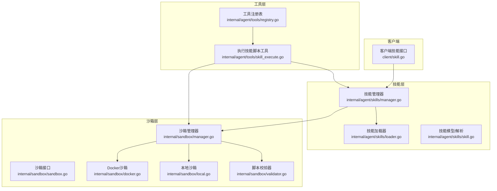
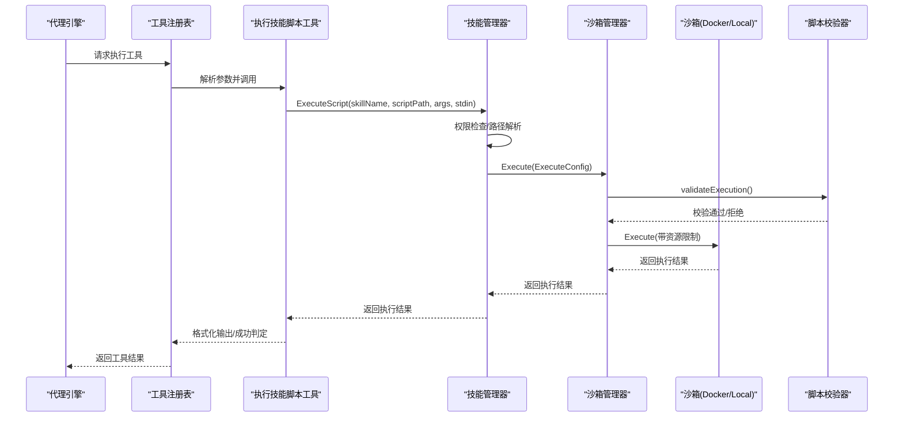
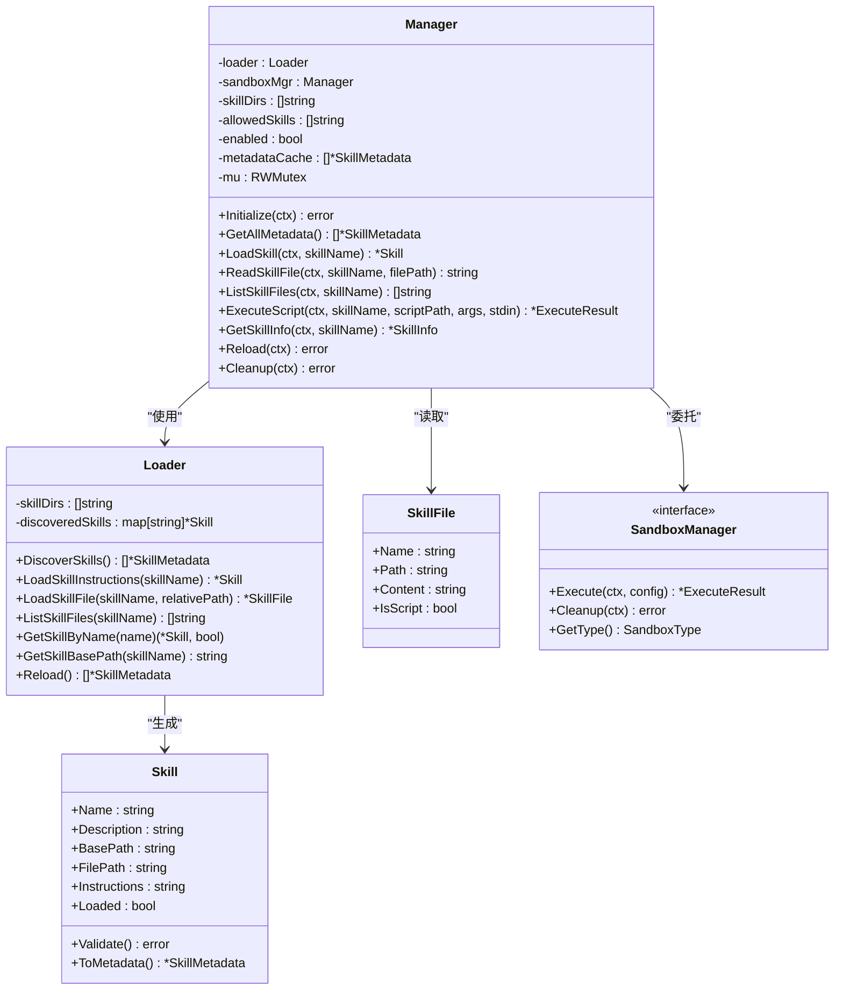
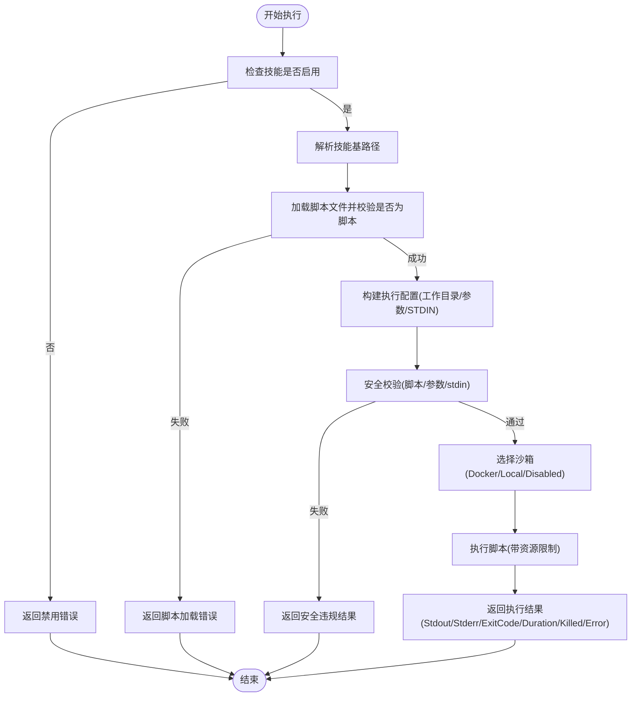
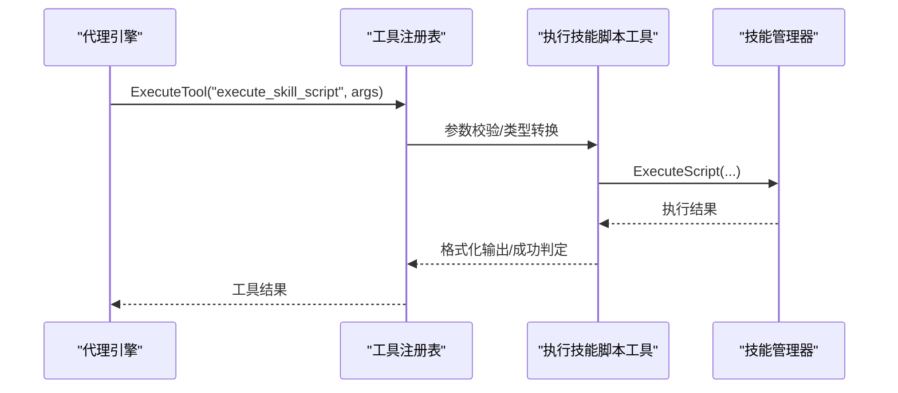
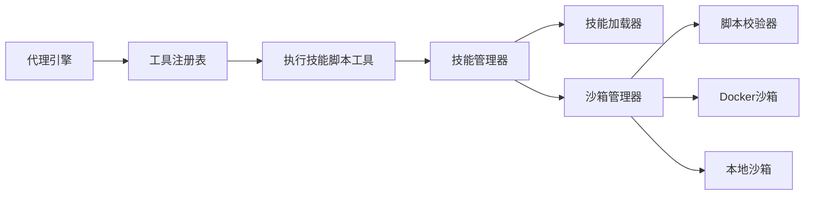

# 技能系统集成

<cite>
**本文引用的文件**
- [internal/agent/skills/manager.go](file://internal/agent/skills/manager.go)
- [internal/agent/skills/loader.go](file://internal/agent/skills/loader.go)
- [internal/agent/skills/skill.go](file://internal/agent/skills/skill.go)
- [internal/sandbox/manager.go](file://internal/sandbox/manager.go)
- [internal/sandbox/sandbox.go](file://internal/sandbox/sandbox.go)
- [internal/sandbox/docker.go](file://internal/sandbox/docker.go)
- [internal/sandbox/local.go](file://internal/sandbox/local.go)
- [internal/sandbox/validator.go](file://internal/sandbox/validator.go)
- [internal/agent/tools/skill_execute.go](file://internal/agent/tools/skill_execute.go)
- [internal/agent/tools/registry.go](file://internal/agent/tools/registry.go)
- [client/skill.go](file://client/skill.go)
- [examples/skills/pdf-processing/SKILL.md](file://examples/skills/pdf-processing/SKILL.md)
- [skills/preloaded/citation-generator/SKILL.md](file://skills/preloaded/citation-generator/SKILL.md)
- [cmd/server/main.go](file://cmd/server/main.go)
</cite>

## 目录
1. [引言](#引言)
2. [项目结构](#项目结构)
3. [核心组件](#核心组件)
4. [架构总览](#架构总览)
5. [详细组件分析](#详细组件分析)
6. [依赖分析](#依赖分析)
7. [性能考虑](#性能考虑)
8. [故障排查指南](#故障排查指南)
9. [结论](#结论)
10. [附录](#附录)

## 引言
本技术文档围绕 WeKnora 的“技能系统集成”展开，目标是帮助开发者理解并正确使用技能管理器、技能加载机制、执行环境隔离与安全校验、参数验证与错误处理、以及与代理引擎、工具系统、沙箱管理的集成关系。文档同时给出开发、注册、执行技能的实践路径，并解释权限控制、资源限制与性能监控等机制。

## 项目结构
WeKnora 的技能系统主要由以下模块构成：
- 技能管理与发现：位于 internal/agent/skills，负责扫描、解析、缓存技能元数据与指令，以及按需加载技能资源文件。
- 沙箱执行：位于 internal/sandbox，提供统一的 Manager 接口与 Docker/Local 两种执行后端，内置脚本与参数安全校验。
- 工具系统：位于 internal/agent/tools，将技能脚本执行封装为工具，供代理引擎调用；包含工具注册、参数校验与输出截断等。
- 客户端接口：位于 client，提供技能列表查询等 API 调用封装。
- 示例与预置技能：examples/skills 与 skills/preloaded 下的 SKILL.md 文件，定义技能的元数据与使用说明。

图表来源
- [internal/agent/skills/manager.go:1-284](file://internal/agent/skills/manager.go#L1-L284)
- [internal/agent/skills/loader.go:1-309](file://internal/agent/skills/loader.go#L1-L309)
- [internal/agent/skills/skill.go:1-219](file://internal/agent/skills/skill.go#L1-L219)
- [internal/sandbox/manager.go:1-258](file://internal/sandbox/manager.go#L1-L258)
- [internal/sandbox/sandbox.go:1-245](file://internal/sandbox/sandbox.go#L1-L245)
- [internal/sandbox/docker.go:1-219](file://internal/sandbox/docker.go#L1-L219)
- [internal/sandbox/local.go:1-253](file://internal/sandbox/local.go#L1-L253)
- [internal/sandbox/validator.go:1-507](file://internal/sandbox/validator.go#L1-L507)
- [internal/agent/tools/skill_execute.go:1-191](file://internal/agent/tools/skill_execute.go#L1-L191)
- [internal/agent/tools/registry.go:1-171](file://internal/agent/tools/registry.go#L1-L171)
- [client/skill.go:1-35](file://client/skill.go#L1-L35)

章节来源
- [internal/agent/skills/manager.go:1-284](file://internal/agent/skills/manager.go#L1-L284)
- [internal/agent/skills/loader.go:1-309](file://internal/agent/skills/loader.go#L1-L309)
- [internal/agent/skills/skill.go:1-219](file://internal/agent/skills/skill.go#L1-L219)
- [internal/sandbox/manager.go:1-258](file://internal/sandbox/manager.go#L1-L258)
- [internal/sandbox/sandbox.go:1-245](file://internal/sandbox/sandbox.go#L1-L245)
- [internal/sandbox/docker.go:1-219](file://internal/sandbox/docker.go#L1-L219)
- [internal/sandbox/local.go:1-253](file://internal/sandbox/local.go#L1-L253)
- [internal/sandbox/validator.go:1-507](file://internal/sandbox/validator.go#L1-L507)
- [internal/agent/tools/skill_execute.go:1-191](file://internal/agent/tools/skill_execute.go#L1-L191)
- [internal/agent/tools/registry.go:1-171](file://internal/agent/tools/registry.go#L1-L171)
- [client/skill.go:1-35](file://client/skill.go#L1-L35)

## 核心组件
- 技能管理器（Manager）
  - 负责技能生命周期管理：发现、加载、缓存、重载、清理。
  - 提供脚本执行入口，协调 Loader 与 Sandbox。
  - 支持白名单过滤与启用开关。
- 技能加载器（Loader）
  - 扫描指定目录，解析 SKILL.md 的 YAML frontmatter 获取元数据。
  - 支持按需加载技能指令与资源文件，路径安全校验防止越权访问。
- 沙箱管理器（Sandbox Manager）
  - 统一执行接口，支持 Docker、Local 两种后端，具备回退策略。
  - 执行前进行脚本、参数、stdin 的安全校验，防止注入与危险命令。
  - 提供超时、内存/CPU 限制、只读根文件系统等资源约束。
- 工具系统（ExecuteSkillScriptTool）
  - 将技能脚本执行封装为工具，供代理引擎调用。
  - 包含参数校验、输出格式化、成功/失败判定与错误提示。
- 工具注册表（ToolRegistry）
  - 注册与检索工具，执行前参数校验与类型转换，执行后输出截断。
- 客户端接口（client/skill.go）
  - 提供技能列表查询等 API 调用封装。

章节来源
- [internal/agent/skills/manager.go:11-284](file://internal/agent/skills/manager.go#L11-L284)
- [internal/agent/skills/loader.go:10-309](file://internal/agent/skills/loader.go#L10-L309)
- [internal/agent/skills/skill.go:32-219](file://internal/agent/skills/skill.go#L32-L219)
- [internal/sandbox/manager.go:11-258](file://internal/sandbox/manager.go#L11-L258)
- [internal/sandbox/sandbox.go:44-245](file://internal/sandbox/sandbox.go#L44-L245)
- [internal/sandbox/validator.go:9-507](file://internal/sandbox/validator.go#L9-L507)
- [internal/agent/tools/skill_execute.go:15-191](file://internal/agent/tools/skill_execute.go#L15-L191)
- [internal/agent/tools/registry.go:16-171](file://internal/agent/tools/registry.go#L16-L171)
- [client/skill.go:8-35](file://client/skill.go#L8-L35)

## 架构总览
下图展示了从代理引擎到技能脚本执行的完整链路，包括权限控制、资源限制与安全校验：

图表来源
- [internal/agent/tools/skill_execute.go:64-191](file://internal/agent/tools/skill_execute.go#L64-L191)
- [internal/agent/skills/manager.go:174-215](file://internal/agent/skills/manager.go#L174-L215)
- [internal/sandbox/manager.go:82-174](file://internal/sandbox/manager.go#L82-L174)
- [internal/sandbox/validator.go:48-191](file://internal/sandbox/validator.go#L48-L191)
- [internal/sandbox/docker.go:45-101](file://internal/sandbox/docker.go#L45-L101)
- [internal/sandbox/local.go:47-132](file://internal/sandbox/local.go#L47-L132)

## 详细组件分析

### 技能管理器（Manager）类图

图表来源
- [internal/agent/skills/manager.go:11-284](file://internal/agent/skills/manager.go#L11-L284)
- [internal/agent/skills/loader.go:10-309](file://internal/agent/skills/loader.go#L10-L309)
- [internal/agent/skills/skill.go:32-109](file://internal/agent/skills/skill.go#L32-L109)

章节来源
- [internal/agent/skills/manager.go:11-284](file://internal/agent/skills/manager.go#L11-L284)
- [internal/agent/skills/loader.go:10-309](file://internal/agent/skills/loader.go#L10-L309)
- [internal/agent/skills/skill.go:32-109](file://internal/agent/skills/skill.go#L32-L109)

### 沙箱管理器与执行流程
- 沙箱类型与配置
  - 支持 docker、local、disabled 三种类型，默认 local，可配置回退策略。
  - 默认超时、内存/CPU 上限、默认允许命令集、默认 Docker 镜像等。
- 执行流程
  - Manager.Execute 前进行安全校验（脚本、参数、stdin），失败则直接返回安全违规结果。
  - 选择 Docker 或 Local 后端执行，设置工作目录、只读根文件系统、网络隔离、资源限制等。
  - 返回标准输出、错误、退出码、耗时、是否被终止等结果。
- 回退逻辑
  - 当 Docker 不可用且开启回退时，自动切换到 Local 沙箱。

图表来源
- [internal/agent/skills/manager.go:174-215](file://internal/agent/skills/manager.go#L174-L215)
- [internal/sandbox/manager.go:82-174](file://internal/sandbox/manager.go#L82-L174)
- [internal/sandbox/validator.go:48-191](file://internal/sandbox/validator.go#L48-L191)
- [internal/sandbox/docker.go:45-101](file://internal/sandbox/docker.go#L45-L101)
- [internal/sandbox/local.go:47-132](file://internal/sandbox/local.go#L47-L132)

章节来源
- [internal/sandbox/manager.go:43-80](file://internal/sandbox/manager.go#L43-L80)
- [internal/sandbox/manager.go:82-174](file://internal/sandbox/manager.go#L82-L174)
- [internal/sandbox/sandbox.go:75-177](file://internal/sandbox/sandbox.go#L75-L177)
- [internal/sandbox/docker.go:103-170](file://internal/sandbox/docker.go#L103-L170)
- [internal/sandbox/local.go:134-213](file://internal/sandbox/local.go#L134-L213)

### 工具系统与代理引擎集成
- 工具定义
  - execute_skill_script 工具描述了在沙箱中执行技能脚本的能力，包含使用场景、安全限制与返回值说明。
- 参数与校验
  - 输入包含技能名、脚本相对路径、可选参数与 STDIN 数据；执行前进行必填字段校验与工具可用性检查。
- 输出与成功判定
  - 格式化输出包含参数、退出码、耗时、警告（如被终止）、标准输出/错误与内部错误；以退出码判断成功与否。
- 注册与执行
  - 工具注册表负责注册、参数校验（JSON Schema）、类型转换、执行与输出截断，确保上下文窗口不被污染。

图表来源
- [internal/agent/tools/skill_execute.go:64-191](file://internal/agent/tools/skill_execute.go#L64-L191)
- [internal/agent/tools/registry.go:87-159](file://internal/agent/tools/registry.go#L87-L159)

章节来源
- [internal/agent/tools/skill_execute.go:15-191](file://internal/agent/tools/skill_execute.go#L15-L191)
- [internal/agent/tools/registry.go:16-171](file://internal/agent/tools/registry.go#L16-L171)

### 技能配置与示例
- SKILL.md 规范
  - 必须以 YAML frontmatter（三横线分隔）开头，包含 name 与 description 字段；其余为技能说明与使用指南。
  - 支持 IsScript 判定与 GetScriptLanguage 映射不同语言解释器。
- 示例技能
  - pdf-processing：演示如何在技能说明中引用脚本路径，便于代理引擎在工具调用时定位脚本。
  - citation-generator：中文技能示例，展示多格式引用生成与最佳实践。

章节来源
- [internal/agent/skills/skill.go:111-183](file://internal/agent/skills/skill.go#L111-L183)
- [examples/skills/pdf-processing/SKILL.md:1-41](file://examples/skills/pdf-processing/SKILL.md#L1-L41)
- [skills/preloaded/citation-generator/SKILL.md:1-59](file://skills/preloaded/citation-generator/SKILL.md#L1-L59)

## 依赖分析
- 组件耦合
  - Manager 依赖 Loader 与 Sandbox.Manager，体现“发现—加载—执行”的分层职责。
  - ExecuteSkillScriptTool 依赖 Manager 与工具注册表，形成代理引擎与技能执行的桥接。
  - Sandbox.Manager 依赖 Validator 与具体沙箱实现（Docker/Local），统一执行与安全策略。
- 外部依赖
  - Docker 命令可用性检测与镜像拉取。
  - Gin 路由与容器注入（服务启动入口）。

图表来源
- [internal/agent/tools/registry.go:87-159](file://internal/agent/tools/registry.go#L87-L159)
- [internal/agent/tools/skill_execute.go:64-191](file://internal/agent/tools/skill_execute.go#L64-L191)
- [internal/agent/skills/manager.go:174-215](file://internal/agent/skills/manager.go#L174-L215)
- [internal/sandbox/manager.go:82-174](file://internal/sandbox/manager.go#L82-L174)
- [internal/sandbox/validator.go:48-191](file://internal/sandbox/validator.go#L48-L191)
- [internal/sandbox/docker.go:45-101](file://internal/sandbox/docker.go#L45-L101)
- [internal/sandbox/local.go:47-132](file://internal/sandbox/local.go#L47-L132)

章节来源
- [internal/agent/tools/registry.go:87-159](file://internal/agent/tools/registry.go#L87-L159)
- [internal/agent/tools/skill_execute.go:64-191](file://internal/agent/tools/skill_execute.go#L64-L191)
- [internal/agent/skills/manager.go:174-215](file://internal/agent/skills/manager.go#L174-L215)
- [internal/sandbox/manager.go:82-174](file://internal/sandbox/manager.go#L82-L174)

## 性能考虑
- 资源限制
  - 默认超时、内存/CPU 上限、只读根文件系统、网络隔离等，避免资源滥用与逃逸。
- 执行后端选择
  - Docker 提供更强隔离与镜像复用，Local 作为回退方案；优先使用 Docker 并异步预拉取镜像。
- 输出截断
  - 工具注册表对大输出进行截断，防止上下文窗口溢出。
- 缓存与发现
  - Manager 缓存技能元数据，Loader 缓存已发现技能，减少重复 IO 与解析开销。

章节来源
- [internal/sandbox/sandbox.go:23-42](file://internal/sandbox/sandbox.go#L23-L42)
- [internal/sandbox/manager.go:54-61](file://internal/sandbox/manager.go#L54-L61)
- [internal/agent/tools/registry.go:129-133](file://internal/agent/tools/registry.go#L129-L133)
- [internal/agent/skills/manager.go:22-25](file://internal/agent/skills/manager.go#L22-L25)
- [internal/agent/skills/loader.go:16-26](file://internal/agent/skills/loader.go#L16-L26)

## 故障排查指南
- 技能未启用或不允许
  - 现象：返回“skills are not enabled”或“skill not allowed”。
  - 排查：确认 ManagerConfig.Enabled 与 AllowedSkills 设置。
- 脚本路径无效或非脚本
  - 现象：返回“file path outside skill directory”或“file is not an executable script”。
  - 排查：检查相对路径是否越权、扩展名是否在脚本映射中。
- 沙箱不可用或禁用
  - 现象：返回“sandbox is not configured”或“sandbox is disabled”。
  - 排查：确认沙箱类型与可用性，Docker 是否可用或回退是否开启。
- 安全校验失败
  - 现象：返回“Security validation failed/Arg injection/stdin injection”。
  - 排查：检查脚本内容、参数与 STDIN 是否包含危险模式或注入特征。
- 超时或被终止
  - 现象：返回“Killed=true”，退出码非零或 Error=timeout。
  - 排查：调整超时、降低资源消耗或优化脚本逻辑。

章节来源
- [internal/agent/skills/manager.go:144-151](file://internal/agent/skills/manager.go#L144-L151)
- [internal/agent/skills/loader.go:211-229](file://internal/agent/skills/loader.go#L211-L229)
- [internal/sandbox/manager.go:186-204](file://internal/sandbox/manager.go#L186-L204)
- [internal/sandbox/manager.go:98-108](file://internal/sandbox/manager.go#L98-L108)
- [internal/sandbox/validator.go:48-191](file://internal/sandbox/validator.go#L48-L191)

## 结论
WeKnora 的技能系统通过“发现—加载—执行—隔离—校验”的完整链路，实现了可扩展、可审计、可限制的技能执行能力。技能管理器负责生命周期与权限控制，沙箱管理器提供强隔离与资源限制，工具系统将技能脚本无缝接入代理引擎。结合参数校验、输出截断与错误提示，整体方案兼顾易用性与安全性。

## 附录

### 开发、注册、执行技能的实践步骤
- 开发技能
  - 在 skills/preloaded 或自定义目录下创建技能目录，并编写 SKILL.md（含 YAML frontmatter 与说明）。
  - 在技能目录内放置脚本文件（支持 Python、Bash、Node、Ruby、Perl、PHP 等）。
- 注册工具
  - 将 ExecuteSkillScriptTool 注册到工具注册表，确保代理引擎可调用。
- 执行技能
  - 代理引擎通过工具注册表调用 execute_skill_script，传入技能名、脚本相对路径、参数与 STDIN。
  - 工具调用技能管理器执行脚本，沙箱管理器进行安全校验与资源限制，返回结果。

章节来源
- [internal/agent/tools/skill_execute.go:56-62](file://internal/agent/tools/skill_execute.go#L56-L62)
- [internal/agent/tools/registry.go:43-54](file://internal/agent/tools/registry.go#L43-L54)
- [internal/agent/skills/skill.go:185-219](file://internal/agent/skills/skill.go#L185-L219)

### 与代理引擎、工具系统、沙箱管理的集成关系
- 代理引擎通过工具注册表统一调度工具。
- 工具通过技能管理器访问技能资源与执行脚本。
- 技能管理器通过沙箱管理器完成安全隔离与资源限制。
- 服务启动入口（cmd/server/main.go）负责依赖注入与路由装配。

章节来源
- [internal/agent/tools/registry.go:87-159](file://internal/agent/tools/registry.go#L87-L159)
- [internal/agent/tools/skill_execute.go:64-191](file://internal/agent/tools/skill_execute.go#L64-L191)
- [internal/agent/skills/manager.go:174-215](file://internal/agent/skills/manager.go#L174-L215)
- [cmd/server/main.go:52-60](file://cmd/server/main.go#L52-L60)