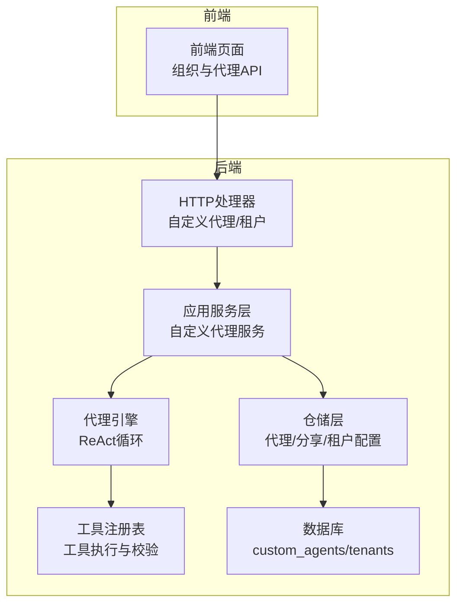
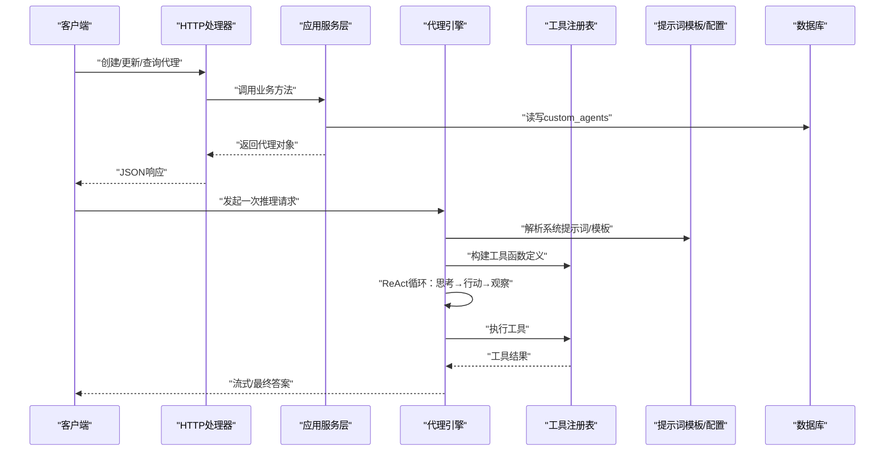
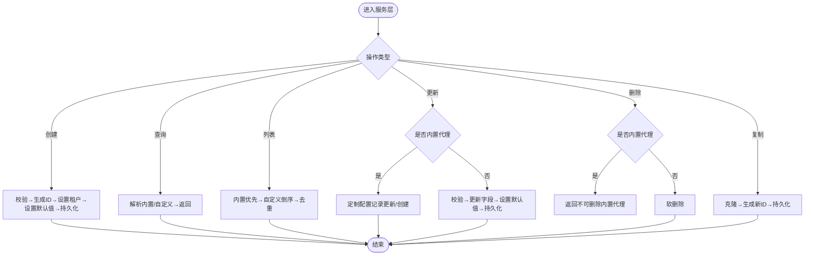
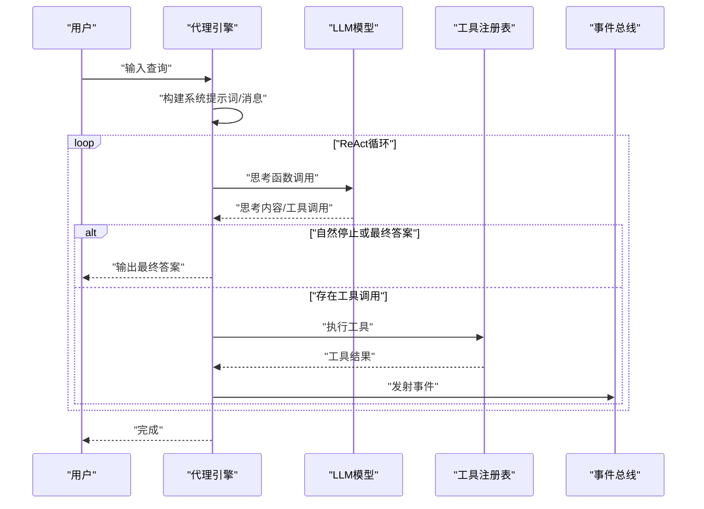
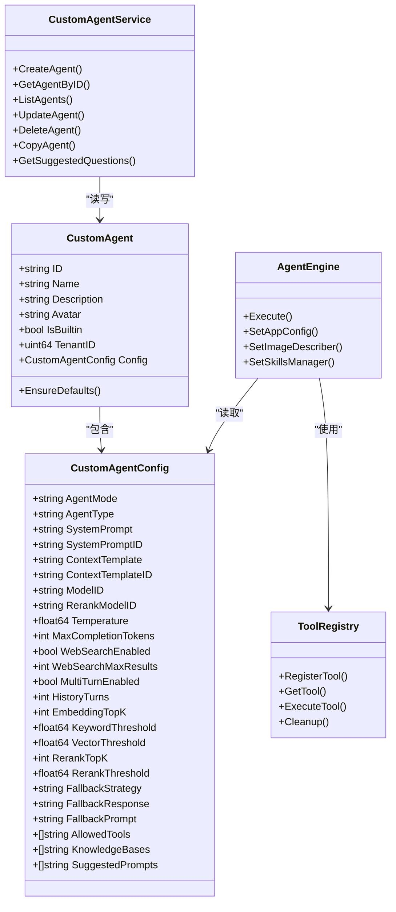

# 自定义代理开发

<cite>
**本文引用的文件**
- [internal/types/custom_agent.go](file://internal/types/custom_agent.go)
- [internal/application/service/custom_agent.go](file://internal/application/service/custom_agent.go)
- [internal/handler/custom_agent.go](file://internal/handler/custom_agent.go)
- [internal/agent/engine.go](file://internal/agent/engine.go)
- [internal/agent/tools/registry.go](file://internal/agent/tools/registry.go)
- [config/builtin_agents.yaml](file://config/builtin_agents.yaml)
- [config/agent_type_presets.yaml](file://config/agent_type_presets.yaml)
- [config/prompt_templates/system_prompt.yaml](file://config/prompt_templates/system_prompt.yaml)
- [internal/application/repository/custom_agent.go](file://internal/application/repository/custom_agent.go)
- [internal/application/repository/agent_share.go](file://internal/application/repository/agent_share.go)
- [internal/handler/tenant.go](file://internal/handler/tenant.go)
- [client/agent_manage.go](file://client/agent_manage.go)
- [frontend/src/api/organization/index.ts](file://frontend/src/api/organization/index.ts)
- [migrations/versioned/000006_custom_agents.up.sql](file://migrations/versioned/000006_custom_agents.up.sql)
- [test_agent_config.sh](file://test_agent_config.sh)
- [examples/skills/README.md](file://examples/skills/README.md)
</cite>

## 目录
1. [简介](#简介)
2. [项目结构](#项目结构)
3. [核心组件](#核心组件)
4. [架构总览](#架构总览)
5. [详细组件分析](#详细组件分析)
6. [依赖关系分析](#依赖关系分析)
7. [性能考虑](#性能考虑)
8. [故障排查指南](#故障排查指南)
9. [结论](#结论)
10. [附录](#附录)

## 简介
本文件面向WeKnora自定义代理（Agent）开发，提供从创建、配置、模板系统、工具集成到生命周期管理、权限控制与版本管理的完整技术文档。读者将了解：
- 如何创建、更新、删除与复制自定义代理
- 代理配置项与默认值、占位符系统、提示词模板与预设
- 代理引擎的执行流程、工具注册与调用、上下文窗口管理
- 代理共享与权限控制、租户级代理配置
- 数据库迁移与版本演进、测试与部署建议

## 项目结构
WeKnora采用分层架构：HTTP层负责路由与鉴权，应用服务层处理业务规则，仓储层持久化，引擎层执行推理与工具调用，前端通过API与后端交互。

图表来源
- [internal/handler/custom_agent.go:17-29](file://internal/handler/custom_agent.go#L17-L29)
- [internal/application/service/custom_agent.go:25-46](file://internal/application/service/custom_agent.go#L25-L46)
- [internal/agent/engine.go:28-46](file://internal/agent/engine.go#L28-L46)
- [internal/agent/tools/registry.go:16-27](file://internal/agent/tools/registry.go#L16-L27)
- [internal/application/repository/custom_agent.go:36-62](file://internal/application/repository/custom_agent.go#L36-L62)
- [migrations/versioned/000006_custom_agents.up.sql:152-176](file://migrations/versioned/000006_custom_agents.up.sql#L152-L176)

章节来源
- [internal/handler/custom_agent.go:17-29](file://internal/handler/custom_agent.go#L17-L29)
- [internal/application/service/custom_agent.go:25-46](file://internal/application/service/custom_agent.go#L25-L46)
- [internal/agent/engine.go:28-46](file://internal/agent/engine.go#L28-L46)
- [internal/agent/tools/registry.go:16-27](file://internal/agent/tools/registry.go#L16-L27)
- [internal/application/repository/custom_agent.go:36-62](file://internal/application/repository/custom_agent.go#L36-L62)
- [migrations/versioned/000006_custom_agents.up.sql:152-176](file://migrations/versioned/000006_custom_agents.up.sql#L152-L176)

## 核心组件
- 自定义代理模型与配置
  - 自定义代理实体与配置结构体，包含代理模式、系统提示词、工具白名单、知识库选择、检索策略、多轮对话、图像/音频上传、文件类型限制、FAQ优先策略、网络搜索、多轮历史保留、高级回退策略等。
  - 默认值与模式约束：如智能推理模式强制开启多轮对话，温度、最大迭代次数、历史轮次、检索阈值等均有默认值。
- 应用服务层
  - 提供创建、查询、列表、更新、删除、复制代理等操作，并处理内置代理与租户上下文的解析与合并。
- HTTP处理器
  - 对外暴露REST接口，负责参数校验、鉴权、调用服务层并返回结果。
- 代理引擎
  - 实现ReAct循环，构建系统提示词、管理上下文窗口、调用LLM与工具、事件发射与追踪。
- 工具注册表
  - 统一注册与执行工具，参数校验与输出截断，资源清理。
- 配置与模板
  - 内置代理配置、智能体类型预设、提示词模板、占位符定义。
- 权限与共享
  - 代理分享、组织维度的可见性与权限控制。
- 数据持久化与迁移
  - custom_agents表结构与租户代理配置迁移。

章节来源
- [internal/types/custom_agent.go:60-329](file://internal/types/custom_agent.go#L60-L329)
- [internal/application/service/custom_agent.go:48-375](file://internal/application/service/custom_agent.go#L48-L375)
- [internal/handler/custom_agent.go:47-321](file://internal/handler/custom_agent.go#L47-L321)
- [internal/agent/engine.go:158-298](file://internal/agent/engine.go#L158-L298)
- [internal/agent/tools/registry.go:43-159](file://internal/agent/tools/registry.go#L43-L159)
- [config/builtin_agents.yaml:5-236](file://config/builtin_agents.yaml#L5-L236)
- [config/agent_type_presets.yaml:30-204](file://config/agent_type_presets.yaml#L30-L204)
- [config/prompt_templates/system_prompt.yaml:1-201](file://config/prompt_templates/system_prompt.yaml#L1-L201)
- [internal/application/repository/agent_share.go:27-206](file://internal/application/repository/agent_share.go#L27-L206)
- [migrations/versioned/000006_custom_agents.up.sql:152-176](file://migrations/versioned/000006_custom_agents.up.sql#L152-L176)

## 架构总览
下图展示自定义代理从HTTP入口到引擎执行的关键路径，以及与工具系统、提示词模板、知识库信息的协作关系。

图表来源
- [internal/handler/custom_agent.go:47-321](file://internal/handler/custom_agent.go#L47-L321)
- [internal/application/service/custom_agent.go:48-375](file://internal/application/service/custom_agent.go#L48-L375)
- [internal/agent/engine.go:158-298](file://internal/agent/engine.go#L158-L298)
- [internal/agent/tools/registry.go:74-159](file://internal/agent/tools/registry.go#L74-L159)
- [config/prompt_templates/system_prompt.yaml:1-201](file://config/prompt_templates/system_prompt.yaml#L1-L201)

## 详细组件分析

### 自定义代理模型与配置
- 关键点
  - 代理ID区分内置与自定义：内置ID固定前缀，自定义使用UUID；内置代理可通过租户上下文解析本地化配置。
  - 配置字段覆盖范围广：系统提示词/模板ID、上下文模板/模板ID、模型与重排序模型、温度、最大补全token、思维模式开关、最大迭代次数、LLM调用超时、工具白名单、MCP服务选择模式、技能选择模式、知识库选择模式、仅@触发检索、保留检索历史、图像/音频上传、存储提供商、文件类型限制、FAQ优先策略、网络搜索、多轮对话、检索阈值、高级回退策略、建议问题等。
  - 默认值与模式约束：EnsureDefaults设置温度、最大迭代、Web搜索结果数、历史轮次、检索阈值、回退策略、最大补全token、智能推理模式强制开启多轮。
- 设计要点
  - JSON序列化/反序列化实现，便于数据库持久化与跨语言传输。
  - 内置代理注册表与显示顺序，保证内置代理优先展示且可被租户定制。

章节来源
- [internal/types/custom_agent.go:60-329](file://internal/types/custom_agent.go#L60-L329)

### 应用服务层：代理生命周期管理
- 关键能力
  - 创建：校验名称必填、生成ID、设置租户ID、默认模式、禁用内置标记、设置默认值、持久化。
  - 查询：支持内置代理解析（数据库定制优先，否则回退默认内置），也支持按租户ID直接查询。
  - 列表：内置代理优先、自定义代理按创建时间倒序，内置代理去重。
  - 更新：内置代理走“定制配置记录”更新/创建路径；自定义代理禁止修改内置标记。
  - 删除：禁止删除内置代理；自定义代理软删除。
  - 复制：克隆代理配置，生成新ID，保持租户归属。
  - 建议问题：聚合代理配置建议、FAQ、文档生成问题、Wiki页面建议，按知识库/文档桶随机打散，保证多样性。
- 错误处理
  - 代理不存在、名称必填、内置代理不可修改/删除等统一错误码。

图表来源
- [internal/application/service/custom_agent.go:48-424](file://internal/application/service/custom_agent.go#L48-L424)

章节来源
- [internal/application/service/custom_agent.go:48-424](file://internal/application/service/custom_agent.go#L48-L424)

### HTTP处理器：API入口与鉴权
- 关键点
  - 提供创建、查询、列表、更新、删除、复制、占位符、类型预设、建议问题等接口。
  - 参数绑定与错误处理，统一返回success/data结构。
  - 占位符接口返回系统提示词、上下文模板、改写提示词、回退提示词等字段的占位符定义。
  - 类型预设接口返回智能体类型预设列表，供编辑器自动填充。
- 安全
  - 使用Bearer/ApiKey鉴权装饰器。

章节来源
- [internal/handler/custom_agent.go:47-494](file://internal/handler/custom_agent.go#L47-L494)

### 代理引擎：ReAct执行与上下文管理
- 关键点
  - 构建系统提示词：支持技能元数据注入、语言占位符、应用配置模板解析。
  - ReAct循环：思考→分析停止条件→行动（工具调用）→观察（追加结果）→事件发射与追踪。
  - 上下文窗口管理：基于上次用量估算新增消息token，必要时压缩历史。
  - 图像描述：对工具结果中的图片进行视觉语言模型分析并附加描述。
  - 并行工具调用：可配置并发执行多个工具调用。
- 事件与追踪
  - 使用Langfuse为每次执行建立顶层span，每轮迭代独立span，便于可视化与调试。

图表来源
- [internal/agent/engine.go:158-298](file://internal/agent/engine.go#L158-L298)
- [internal/agent/engine.go:341-405](file://internal/agent/engine.go#L341-L405)
- [internal/agent/engine.go:422-603](file://internal/agent/engine.go#L422-L603)

章节来源
- [internal/agent/engine.go:158-298](file://internal/agent/engine.go#L158-L298)
- [internal/agent/engine.go:341-405](file://internal/agent/engine.go#L341-L405)
- [internal/agent/engine.go:422-603](file://internal/agent/engine.go#L422-L603)

### 工具系统：注册、校验与执行
- 关键点
  - 注册策略：同名工具拒绝重复注册（首胜策略），防止劫持。
  - 参数校验：基于JSON Schema提前校验，避免无效调用。
  - 输出截断：超过阈值的工具输出进行头尾截断，保护上下文。
  - 清理：会话结束时清理实现Cleanable接口的工具资源。
- 错误提示
  - 工具执行失败时附加“尝试不同方法”的提示，引导LLM重试。

章节来源
- [internal/agent/tools/registry.go:43-159](file://internal/agent/tools/registry.go#L43-L159)

### 模板系统与配置继承
- 内置代理配置
  - 通过YAML定义内置代理的本地化名称/描述/头像与配置覆盖，支持多语言回退。
- 智能体类型预设
  - 定义RAG/Wiki/Hybrid/Data-Analysis/Custom等类型，自动填充系统提示词模板ID、工具白名单、KB兼容性过滤规则。
- 提示词模板
  - 提供多种场景模板（知识库问答、领域专家、客服、技术支持、通用对话、网络搜索），支持语言占位符与上下文注入。
- 配置继承
  - 自定义代理可继承内置代理的配置，也可覆盖；租户级AgentConfig与会话级配置共同决定运行时行为。

章节来源
- [config/builtin_agents.yaml:5-236](file://config/builtin_agents.yaml#L5-L236)
- [config/agent_type_presets.yaml:30-204](file://config/agent_type_presets.yaml#L30-L204)
- [config/prompt_templates/system_prompt.yaml:1-201](file://config/prompt_templates/system_prompt.yaml#L1-L201)
- [internal/handler/tenant.go:497-533](file://internal/handler/tenant.go#L497-L533)

### 权限控制与代理共享
- 代理分享
  - 支持将代理分享至组织，设置权限；支持列出/移除分享、按组织查看分享列表。
- 组织维度可见性
  - 前端通过组织API获取共享代理列表，后端维护分享记录与软删除。
- 租户级代理配置
  - 提供租户级代理配置读取与更新接口，支持最大迭代、允许工具、温度、系统提示词、可用工具与占位符等。

章节来源
- [frontend/src/api/organization/index.ts:626-659](file://frontend/src/api/organization/index.ts#L626-L659)
- [internal/application/repository/agent_share.go:27-206](file://internal/application/repository/agent_share.go#L27-L206)
- [internal/handler/tenant.go:497-533](file://internal/handler/tenant.go#L497-L533)

### 数据持久化与版本管理
- 表结构
  - custom_agents：存储自定义代理与内置代理的定制配置，复合主键（ID, TenantID）。
- 迁移
  - 000006_custom_agents.up.sql：初始化custom_agents表，将租户agent_config映射为代理配置，设置默认值与时间戳。
- 客户端与前端
  - 提供代理管理的HTTP客户端封装与组织API封装，便于集成与测试。

章节来源
- [migrations/versioned/000006_custom_agents.up.sql:152-176](file://migrations/versioned/000006_custom_agents.up.sql#L152-L176)
- [internal/application/repository/custom_agent.go:36-62](file://internal/application/repository/custom_agent.go#L36-L62)
- [client/agent_manage.go:101-165](file://client/agent_manage.go#L101-L165)
- [frontend/src/api/organization/index.ts:626-659](file://frontend/src/api/organization/index.ts#L626-L659)

## 依赖关系分析

图表来源
- [internal/types/custom_agent.go:60-329](file://internal/types/custom_agent.go#L60-L329)
- [internal/application/service/custom_agent.go:25-46](file://internal/application/service/custom_agent.go#L25-L46)
- [internal/agent/engine.go:28-46](file://internal/agent/engine.go#L28-L46)
- [internal/agent/tools/registry.go:16-27](file://internal/agent/tools/registry.go#L16-L27)

章节来源
- [internal/types/custom_agent.go:60-329](file://internal/types/custom_agent.go#L60-L329)
- [internal/application/service/custom_agent.go:25-46](file://internal/application/service/custom_agent.go#L25-L46)
- [internal/agent/engine.go:28-46](file://internal/agent/engine.go#L28-L46)
- [internal/agent/tools/registry.go:16-27](file://internal/agent/tools/registry.go#L16-L27)

## 性能考虑
- 上下文窗口管理
  - 基于上次用量估算新增消息token，必要时压缩历史，避免超出模型上下文限制。
- 工具输出截断
  - 超长工具输出进行头尾截断，降低上下文污染风险。
- 并行工具调用
  - 可配置并发执行多个工具调用，提升吞吐但需注意资源竞争。
- 图像描述
  - 对工具结果图片进行VLM分析，增强理解但增加延迟，建议按需启用。
- 检索与回退
  - 合理设置TopK、阈值与回退策略，平衡召回与质量。

## 故障排查指南
- 常见错误
  - 代理不存在：检查ID与租户上下文。
  - 名称必填：创建/更新时确保名称非空。
  - 不可修改/删除内置代理：内置代理仅支持定制配置记录更新。
  - 请求参数错误：核对JSON结构与字段类型。
- 日志与追踪
  - 引擎执行与每轮迭代均记录关键指标，结合Langfuse追踪定位瓶颈。
- 数据一致性
  - 确认custom_agents表结构与租户迁移是否完成；检查分享记录软删除状态。
- 测试脚本
  - 使用提供的测试脚本验证租户级代理配置的读取与保存流程。

章节来源
- [internal/application/service/custom_agent.go:17-23](file://internal/application/service/custom_agent.go#L17-L23)
- [internal/handler/custom_agent.go:211-321](file://internal/handler/custom_agent.go#L211-L321)
- [internal/agent/engine.go:158-298](file://internal/agent/engine.go#L158-L298)
- [test_agent_config.sh:1-148](file://test_agent_config.sh#L1-L148)

## 结论
WeKnora的自定义代理体系以清晰的分层设计与完善的配置模板支撑了灵活的代理开发与部署。内置代理与租户定制的组合、智能体类型预设、工具注册与校验、上下文窗口管理与追踪，共同构成了可扩展、可观测、易维护的代理平台。配合权限控制与分享机制，可在组织内高效复用与治理代理资产。

## 附录

### 开发、部署与测试清单
- 开发步骤
  - 在config目录准备内置代理与类型预设YAML，确保模板ID与工具白名单一致。
  - 通过HTTP接口创建/更新代理，或使用前端组织页面进行配置与分享。
  - 在代理引擎中启用所需工具与技能，配置上下文窗口与回退策略。
- 部署建议
  - 先执行数据库迁移，确保custom_agents表与租户配置字段可用。
  - 配置Langfuse以便追踪与优化。
- 测试建议
  - 使用测试脚本验证租户级代理配置读取与保存。
  - 通过前端组织API验证代理分享与权限控制。

章节来源
- [config/builtin_agents.yaml:5-236](file://config/builtin_agents.yaml#L5-L236)
- [config/agent_type_presets.yaml:30-204](file://config/agent_type_presets.yaml#L30-L204)
- [migrations/versioned/000006_custom_agents.up.sql:152-176](file://migrations/versioned/000006_custom_agents.up.sql#L152-L176)
- [test_agent_config.sh:1-148](file://test_agent_config.sh#L1-L148)
- [examples/skills/README.md:1-93](file://examples/skills/README.md#L1-L93)