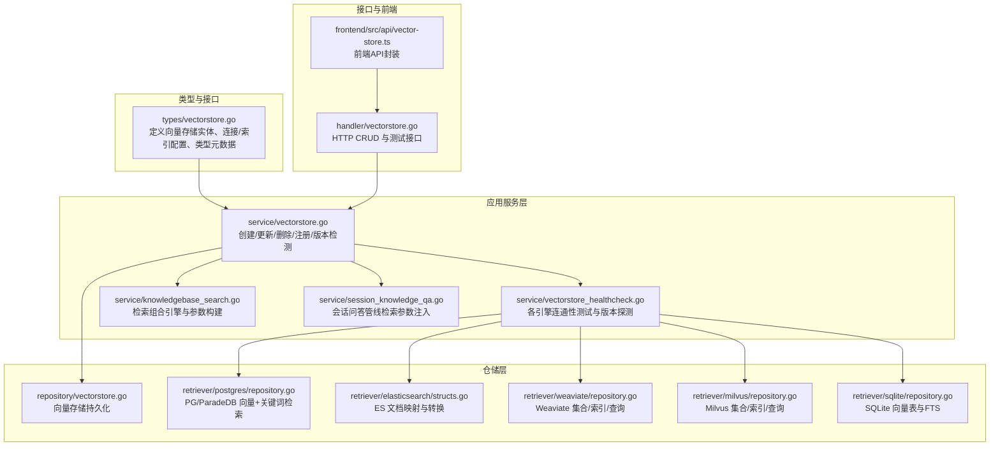
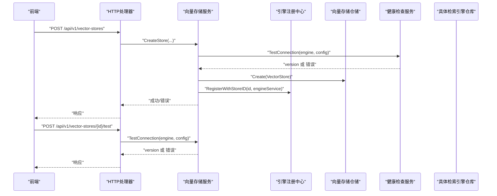
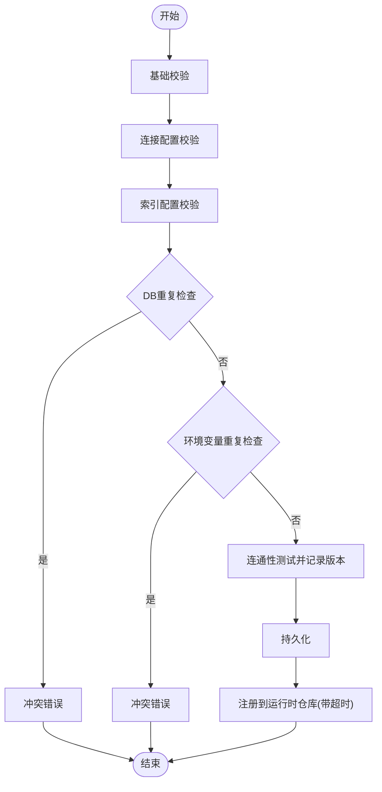
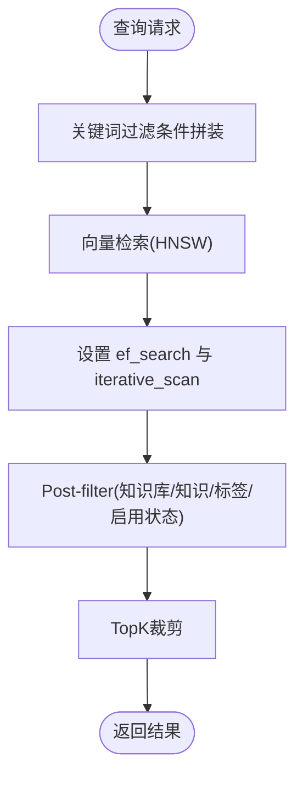
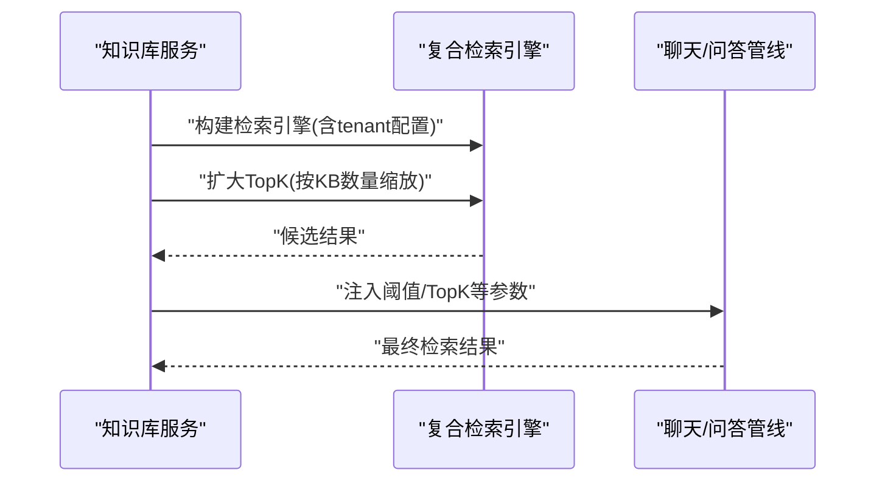
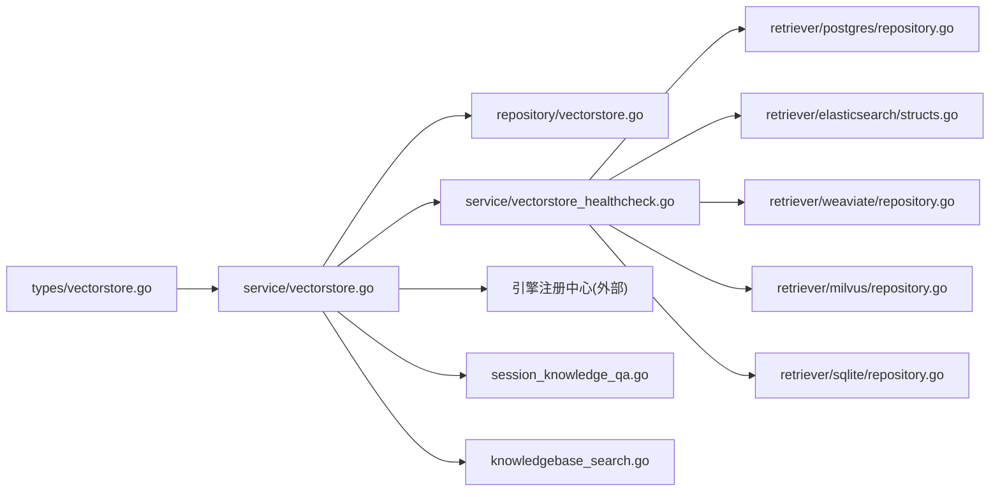

# 向量存储服务

<cite>
**本文引用的文件**
- [internal/types/vectorstore.go](file://internal/types/vectorstore.go)
- [internal/application/service/vectorstore.go](file://internal/application/service/vectorstore.go)
- [internal/application/repository/vectorstore.go](file://internal/application/repository/vectorstore.go)
- [internal/application/service/vectorstore_healthcheck.go](file://internal/application/service/vectorstore_healthcheck.go)
- [internal/handler/vectorstore.go](file://internal/handler/vectorstore.go)
- [internal/application/repository/retriever/postgres/repository.go](file://internal/application/repository/retriever/postgres/repository.go)
- [internal/application/repository/retriever/postgres/structs.go](file://internal/application/repository/retriever/postgres/structs.go)
- [internal/application/repository/retriever/elasticsearch/structs.go](file://internal/application/repository/retriever/elasticsearch/structs.go)
- [internal/application/repository/retriever/weaviate/repository.go](file://internal/application/repository/retriever/weaviate/repository.go)
- [internal/application/repository/retriever/milvus/repository.go](file://internal/application/repository/retriever/milvus/repository.go)
- [internal/application/repository/retriever/weaviate/structs.go](file://internal/application/repository/retriever/weaviate/structs.go)
- [internal/application/repository/retriever/milvus/structs.go](file://internal/application/repository/retriever/milvus/structs.go)
- [internal/application/repository/retriever/sqlite/repository.go](file://internal/application/repository/retriever/sqlite/repository.go)
- [internal/application/service/knowledgebase_search.go](file://internal/application/service/knowledgebase_search.go)
- [internal/application/service/session_knowledge_qa.go](file://internal/application/service/session_knowledge_qa.go)
- [frontend/src/api/vector-store.ts](file://frontend/src/api/vector-store.ts)
- [migrations/paradedb/00-init-db.sql](file://migrations/paradedb/00-init-db.sql)
</cite>

## 目录
1. [简介](#简介)
2. [项目结构](#项目结构)
3. [核心组件](#核心组件)
4. [架构总览](#架构总览)
5. [详细组件分析](#详细组件分析)
6. [依赖分析](#依赖分析)
7. [性能考量](#性能考量)
8. [故障排查指南](#故障排查指南)
9. [结论](#结论)
10. [附录](#附录)

## 简介
本文件面向WeKnora向量存储服务，系统性阐述其抽象层设计、多后端支持（PostgreSQL/ParadeDB、Elasticsearch、Qdrant、Milvus、Weaviate、SQLite）、查询优化策略、健康检查机制，以及与知识库、聊天管道、检索器的协作关系。文档同时覆盖嵌入模型管理、向量索引策略、相似度计算、批量操作等实现要点，并提供可直接定位到源码的路径示例，帮助读者快速上手配置、导入数据、执行查询与性能调优。

## 项目结构
WeKnora的向量存储能力由“类型定义 + 应用服务 + 仓储层 + 多后端仓库 + 健康检查 + HTTP处理器”构成，前端通过API对接向量存储的增删改查与连通性测试。

**图表来源**
- [internal/types/vectorstore.go:1-677](file://internal/types/vectorstore.go#L1-L677)
- [internal/application/service/vectorstore.go:1-190](file://internal/application/service/vectorstore.go#L1-L190)
- [internal/application/service/vectorstore_healthcheck.go:1-229](file://internal/application/service/vectorstore_healthcheck.go#L1-L229)
- [internal/application/repository/vectorstore.go:1-102](file://internal/application/repository/vectorstore.go#L1-L102)
- [internal/application/repository/retriever/postgres/repository.go:1-200](file://internal/application/repository/retriever/postgres/repository.go#L1-L200)
- [internal/application/repository/retriever/elasticsearch/structs.go:50-78](file://internal/application/repository/retriever/elasticsearch/structs.go#L50-L78)
- [internal/application/repository/retriever/weaviate/repository.go:1-200](file://internal/application/repository/retriever/weaviate/repository.go#L1-L200)
- [internal/application/repository/retriever/milvus/repository.go:1-200](file://internal/application/repository/retriever/milvus/repository.go#L1-L200)
- [internal/application/repository/retriever/sqlite/repository.go:488-538](file://internal/application/repository/retriever/sqlite/repository.go#L488-L538)
- [internal/handler/vectorstore.go:1-455](file://internal/handler/vectorstore.go#L1-L455)
- [frontend/src/api/vector-store.ts:50-64](file://frontend/src/api/vector-store.ts#L50-L64)

**章节来源**
- [internal/types/vectorstore.go:1-677](file://internal/types/vectorstore.go#L1-L677)
- [internal/application/service/vectorstore.go:1-190](file://internal/application/service/vectorstore.go#L1-L190)
- [internal/application/repository/vectorstore.go:1-102](file://internal/application/repository/vectorstore.go#L1-L102)
- [internal/application/service/vectorstore_healthcheck.go:1-229](file://internal/application/service/vectorstore_healthcheck.go#L1-L229)
- [internal/handler/vectorstore.go:1-455](file://internal/handler/vectorstore.go#L1-L455)
- [frontend/src/api/vector-store.ts:50-64](file://frontend/src/api/vector-store.ts#L50-L64)

## 核心组件
- 类型与配置
  - 向量存储实体：名称、租户ID、引擎类型、连接配置、索引配置、时间戳。
  - 连接配置：地址、用户名、密码、API Key、TLS、默认连接标记、版本号等。
  - 索引配置：索引名/集合前缀/集合名、分片数、副本数、期望分片数等；含校验与环境变量回退解析。
  - 引擎类型元数据：用于“/types”返回可用引擎及其字段定义，便于前端表单渲染。
- 应用服务
  - 创建/更新/删除向量存储：参数校验、重复性检查（DB与环境变量）、自动版本探测、注册到运行时仓库。
  - 健康检查：对各引擎进行连通性测试，解析版本信息（如可用）。
- 仓储层
  - 持久化：创建、查询、列表、更新（仅名称）、删除（软删）、按端点+索引名去重检查。
- 多后端仓库
  - PostgreSQL/ParadeDB：向量检索（HNSW）、关键词检索（BM25/FTS）、批量写入、维度感知集合/索引。
  - Elasticsearch：文档映射、阈值过滤、NearVector查询、结果转换。
  - Weaviate：动态集合（按维度命名）、HNSW索引、payload过滤、BM25文本检索。
  - Milvus：集合schema（主键、向量、文本稀疏向量、payload字段）、HNSW/BM25索引、分片/副本控制。
  - SQLite：向量表（按维度命名）、序列化/反序列化、FTS全文检索。
- 前端与HTTP
  - Handler提供CRUD与测试接口；前端API封装测试与CRUD调用。

**章节来源**
- [internal/types/vectorstore.go:30-95](file://internal/types/vectorstore.go#L30-L95)
- [internal/types/vectorstore.go:101-121](file://internal/types/vectorstore.go#L101-L121)
- [internal/types/vectorstore.go:203-265](file://internal/types/vectorstore.go#L203-L265)
- [internal/application/service/vectorstore.go:36-99](file://internal/application/service/vectorstore.go#L36-L99)
- [internal/application/service/vectorstore_healthcheck.go:25-50](file://internal/application/service/vectorstore_healthcheck.go#L25-L50)
- [internal/application/repository/vectorstore.go:22-101](file://internal/application/repository/vectorstore.go#L22-L101)
- [internal/application/repository/retriever/postgres/repository.go:19-161](file://internal/application/repository/retriever/postgres/repository.go#L19-L161)
- [internal/application/repository/retriever/elasticsearch/structs.go:50-78](file://internal/application/repository/retriever/elasticsearch/structs.go#L50-L78)
- [internal/application/repository/retriever/weaviate/repository.go:37-160](file://internal/application/repository/retriever/weaviate/repository.go#L37-L160)
- [internal/application/repository/retriever/milvus/repository.go:44-78](file://internal/application/repository/retriever/milvus/repository.go#L44-L78)
- [internal/application/repository/retriever/sqlite/repository.go:488-538](file://internal/application/repository/retriever/sqlite/repository.go#L488-L538)
- [internal/handler/vectorstore.go:15-455](file://internal/handler/vectorstore.go#L15-L455)
- [frontend/src/api/vector-store.ts:50-64](file://frontend/src/api/vector-store.ts#L50-L64)

## 架构总览
下图展示从HTTP请求到多后端检索的整体流程，包括健康检查、注册、检索参数构建与执行。

**图表来源**
- [internal/handler/vectorstore.go:31-455](file://internal/handler/vectorstore.go#L31-L455)
- [internal/application/service/vectorstore.go:36-99](file://internal/application/service/vectorstore.go#L36-L99)
- [internal/application/service/vectorstore_healthcheck.go:25-50](file://internal/application/service/vectorstore_healthcheck.go#L25-L50)
- [internal/application/repository/vectorstore.go:22-69](file://internal/application/repository/vectorstore.go#L22-L69)

## 详细组件分析

### 向量存储类型与配置
- 实体与验证
  - 名称、租户ID、引擎类型必填；引擎类型白名单限定。
  - 连接配置支持敏感字段加密存储与解密读取。
  - 索引配置支持字符串与数值字段校验，提供环境变量回退解析。
- 引擎类型元数据
  - 返回每种引擎的连接字段与索引字段定义，便于前端表单渲染与校验。

**章节来源**
- [internal/types/vectorstore.go:30-95](file://internal/types/vectorstore.go#L30-L95)
- [internal/types/vectorstore.go:101-167](file://internal/types/vectorstore.go#L101-L167)
- [internal/types/vectorstore.go:203-434](file://internal/types/vectorstore.go#L203-L434)
- [internal/types/vectorstore.go:462-547](file://internal/types/vectorstore.go#L462-L547)

### 向量存储服务（创建/更新/删除/注册）
- 创建流程
  - 基础校验 → 引擎特定连接校验 → 索引配置校验 → DB与环境变量重复性检查 → 连通性测试并记录版本 → 持久化 → 注册到运行时仓库（带超时保护）。
- 更新/删除
  - 更新仅允许修改名称；删除软删并从注册中心注销。
- 注册策略
  - 工厂创建引擎服务并注册，失败仅记录日志，保证自愈（重启后加载）。

**图表来源**
- [internal/application/service/vectorstore.go:36-99](file://internal/application/service/vectorstore.go#L36-L99)
- [internal/application/service/vectorstore.go:140-160](file://internal/application/service/vectorstore.go#L140-L160)

**章节来源**
- [internal/application/service/vectorstore.go:36-139](file://internal/application/service/vectorstore.go#L36-L139)
- [internal/application/repository/vectorstore.go:78-101](file://internal/application/repository/vectorstore.go#L78-L101)

### 健康检查与版本探测
- 支持引擎：Elasticsearch、PostgreSQL、Qdrant、Milvus、Weaviate、SQLite。
- 探测方式
  - Elasticsearch：HTTP根请求解析版本。
  - PostgreSQL：使用pgx驱动Ping并SHOW server_version。
  - Qdrant：SDK HealthCheck。
  - Milvus：TCP拨号（避免proto命名冲突）。
  - Weaviate：ReadyChecker + /v1/meta。
  - SQLite：文件型无需远端探测。
- 超时控制：统一10秒超时，避免阻塞。

**章节来源**
- [internal/application/service/vectorstore_healthcheck.go:25-229](file://internal/application/service/vectorstore_healthcheck.go#L25-L229)

### 多后端检索仓库

#### PostgreSQL/ParadeDB
- 能力
  - 向量检索：HNSW索引（半精度向量），支持阈值过滤与迭代扫描。
  - 关键词检索：BM25（含中文分词器）与FTS。
  - 批量写入：ON CONFLICT DO NOTHING 去重。
  - 存储估算：内容长度 + 向量大小 + 元数据 + HNSW索引开销。
- 查询优化
  - 动态扩大TopK以提升召回，再在服务端进行阈值与过滤筛选。
  - 设置hnsw.ef_search与hnsw.iterative_scan以平衡召回与性能。
- 索引策略
  - 按维度创建集合与HNSW索引，Cos距离，构造参数可调。

**图表来源**
- [internal/application/repository/retriever/postgres/repository.go:318-434](file://internal/application/repository/retriever/postgres/repository.go#L318-L434)
- [internal/application/repository/retriever/postgres/structs.go:73-103](file://internal/application/repository/retriever/postgres/structs.go#L73-L103)

**章节来源**
- [internal/application/repository/retriever/postgres/repository.go:19-161](file://internal/application/repository/retriever/postgres/repository.go#L19-L161)
- [internal/application/repository/retriever/postgres/repository.go:318-434](file://internal/application/repository/retriever/postgres/repository.go#L318-L434)
- [internal/application/repository/retriever/postgres/structs.go:73-103](file://internal/application/repository/retriever/postgres/structs.go#L73-L103)
- [migrations/paradedb/00-init-db.sql:187-215](file://migrations/paradedb/00-init-db.sql#L187-L215)

#### Elasticsearch
- 能力
  - NearVector + Where过滤 + 限界阈值。
  - 结果转换为统一IndexWithScore模型。
- 索引与查询
  - 使用引擎提供的向量字段与过滤条件，结合阈值与TopK。

**章节来源**
- [internal/application/repository/retriever/elasticsearch/structs.go:50-78](file://internal/application/repository/retriever/elasticsearch/structs.go#L50-L78)
- [internal/application/repository/retriever/weaviate/repository.go:561-596](file://internal/application/repository/retriever/weaviate/repository.go#L561-L596)

#### Weaviate
- 能力
  - 动态集合：按维度命名，自动创建与加载。
  - HNSW索引：cosine距离，可配置ef/efConstruction/maxConnections等。
  - Payload过滤：chunk_id/knowledge_id/knowledge_base_id/source_type/is_enabled。
  - 文本检索：BM25（中文分词）。
- 存储估算
  - payload + 向量 + HNSW索引 + ID追踪开销。

**章节来源**
- [internal/application/repository/retriever/weaviate/repository.go:60-160](file://internal/application/repository/retriever/weaviate/repository.go#L60-L160)
- [internal/application/repository/retriever/weaviate/structs.go:993-1064](file://internal/application/repository/retriever/weaviate/structs.go#L993-L1064)

#### Milvus
- 能力
  - 集合Schema：主键、向量、文本稀疏向量、payload字段。
  - 索引：HNSW（向量）、BM25（文本）、自动索引（payload）。
  - 分片/副本：写入并行与读HA。
- 存储估算
  - payload + 向量 + IVF_FLAT索引开销 + 元数据追踪。

**章节来源**
- [internal/application/repository/retriever/milvus/repository.go:80-200](file://internal/application/repository/retriever/milvus/repository.go#L80-L200)
- [internal/application/repository/retriever/milvus/structs.go:916-947](file://internal/application/repository/retriever/milvus/structs.go#L916-L947)

#### SQLite
- 能力
  - 向量表按维度命名，使用sqlite_vec序列化/反序列化。
  - FTS全文检索配合向量检索。
- 批量与复制
  - 批量插入去重；复制/删除按维度表执行。

**章节来源**
- [internal/application/repository/retriever/sqlite/repository.go:488-538](file://internal/application/repository/retriever/sqlite/repository.go#L488-L538)

### 与知识库、聊天管道、检索器的协作
- 知识库搜索
  - 组合检索引擎（tenant级生效），按KB数量按比例扩大TopK，确保RRF融合与重排序质量。
  - 构建检索参数（向量TopK、阈值、关键词阈值等）。
- 会话问答
  - 从上下文解析租户范围，构建统一搜索目标。
  - 注入向量阈值、关键词阈值、向量TopK等参数到管线。

**图表来源**
- [internal/application/service/knowledgebase_search.go:95-129](file://internal/application/service/knowledgebase_search.go#L95-L129)
- [internal/application/service/session_knowledge_qa.go:69-624](file://internal/application/service/session_knowledge_qa.go#L69-L624)

**章节来源**
- [internal/application/service/knowledgebase_search.go:95-129](file://internal/application/service/knowledgebase_search.go#L95-L129)
- [internal/application/service/session_knowledge_qa.go:69-624](file://internal/application/service/session_knowledge_qa.go#L69-L624)

## 依赖分析
- 低耦合高内聚
  - 类型层独立于业务逻辑；服务层负责编排与注册；仓储层隔离不同后端差异。
- 外部依赖
  - 各引擎客户端（Elasticsearch、Qdrant、Milvus、Weaviate、PostgreSQL/ParadeDB、SQLite）。
- 循环依赖
  - 未发现直接循环依赖；通过接口与工厂解耦。

**图表来源**
- [internal/types/vectorstore.go:1-677](file://internal/types/vectorstore.go#L1-L677)
- [internal/application/service/vectorstore.go:1-190](file://internal/application/service/vectorstore.go#L1-L190)
- [internal/application/service/vectorstore_healthcheck.go:1-229](file://internal/application/service/vectorstore_healthcheck.go#L1-L229)
- [internal/application/repository/vectorstore.go:1-102](file://internal/application/repository/vectorstore.go#L1-L102)
- [internal/application/repository/retriever/postgres/repository.go:1-200](file://internal/application/repository/retriever/postgres/repository.go#L1-L200)
- [internal/application/repository/retriever/elasticsearch/structs.go:50-78](file://internal/application/repository/retriever/elasticsearch/structs.go#L50-L78)
- [internal/application/repository/retriever/weaviate/repository.go:1-200](file://internal/application/repository/retriever/weaviate/repository.go#L1-L200)
- [internal/application/repository/retriever/milvus/repository.go:1-200](file://internal/application/repository/retriever/milvus/repository.go#L1-L200)
- [internal/application/repository/retriever/sqlite/repository.go:488-538](file://internal/application/repository/retriever/sqlite/repository.go#L488-L538)
- [internal/application/service/knowledgebase_search.go:95-129](file://internal/application/service/knowledgebase_search.go#L95-L129)
- [internal/application/service/session_knowledge_qa.go:69-624](file://internal/application/service/session_knowledge_qa.go#L69-L624)

**章节来源**
- [internal/types/vectorstore.go:1-677](file://internal/types/vectorstore.go#L1-L677)
- [internal/application/service/vectorstore.go:1-190](file://internal/application/service/vectorstore.go#L1-L190)
- [internal/application/service/vectorstore_healthcheck.go:1-229](file://internal/application/service/vectorstore_healthcheck.go#L1-L229)
- [internal/application/repository/vectorstore.go:1-102](file://internal/application/repository/vectorstore.go#L1-L102)
- [internal/application/repository/retriever/postgres/repository.go:1-200](file://internal/application/repository/retriever/postgres/repository.go#L1-L200)
- [internal/application/repository/retriever/elasticsearch/structs.go:50-78](file://internal/application/repository/retriever/elasticsearch/structs.go#L50-L78)
- [internal/application/repository/retriever/weaviate/repository.go:1-200](file://internal/application/repository/retriever/weaviate/repository.go#L1-L200)
- [internal/application/repository/retriever/milvus/repository.go:1-200](file://internal/application/repository/retriever/milvus/repository.go#L1-L200)
- [internal/application/repository/retriever/sqlite/repository.go:488-538](file://internal/application/repository/retriever/sqlite/repository.go#L488-L538)
- [internal/application/service/knowledgebase_search.go:95-129](file://internal/application/service/knowledgebase_search.go#L95-L129)
- [internal/application/service/session_knowledge_qa.go:69-624](file://internal/application/service/session_knowledge_qa.go#L69-L624)

## 性能考量
- 向量检索
  - PostgreSQL/ParadeDB：合理设置hnsw.ef_search与iterative_scan，避免过大TopK导致图遍历膨胀；根据过滤选择性调整扩大的候选规模。
  - Weaviate/Milvus：HNSW参数（efConstruction、maxConnections、ef）需结合数据规模与查询延迟权衡。
- 关键词检索
  - PostgreSQL：BM25中文分词器与FTS索引；避免过宽的过滤条件导致回表。
  - Elasticsearch：阈值与TopK结合，减少后续post-filter成本。
- 批量写入
  - PostgreSQL：使用ON CONFLICT DO NOTHING降低重复写入成本。
  - Milvus/Weaviate：批量插入与索引构建需考虑写入放大与内存占用。
- 存储估算
  - 各后端提供估算函数，建议在入库前评估容量与索引开销。

**章节来源**
- [internal/application/repository/retriever/postgres/repository.go:318-434](file://internal/application/repository/retriever/postgres/repository.go#L318-L434)
- [internal/application/repository/retriever/weaviate/repository.go:60-160](file://internal/application/repository/retriever/weaviate/repository.go#L60-L160)
- [internal/application/repository/retriever/milvus/repository.go:80-200](file://internal/application/repository/retriever/milvus/repository.go#L80-L200)
- [internal/application/repository/retriever/weaviate/structs.go:993-998](file://internal/application/repository/retriever/weaviate/structs.go#L993-L998)
- [internal/application/repository/retriever/milvus/structs.go:916-947](file://internal/application/repository/retriever/milvus/structs.go#L916-L947)

## 故障排查指南
- 健康检查失败
  - 检查地址、凭据、网络连通性；查看对应引擎日志；确认版本兼容性（如ES v7/v8）。
- 重复配置
  - 同一端点与索引名在同一租户下不可重复；检查DB与环境变量配置。
- 连接超时
  - Milvus/Weaviate等远程服务可能因网络或认证超时；适当增大超时或检查防火墙。
- PostgreSQL检索召回不足
  - 调整TopK扩大策略、ef_search与iterative_scan；确认过滤条件是否过于严格。
- 前端测试
  - 使用前端API封装的测试接口验证连通性与版本。

**章节来源**
- [internal/application/service/vectorstore_healthcheck.go:25-229](file://internal/application/service/vectorstore_healthcheck.go#L25-L229)
- [internal/application/service/vectorstore.go:53-73](file://internal/application/service/vectorstore.go#L53-L73)
- [frontend/src/api/vector-store.ts:58-64](file://frontend/src/api/vector-store.ts#L58-L64)

## 结论
WeKnora的向量存储服务通过清晰的抽象层与多后端实现，提供了统一的向量检索与关键词检索能力。服务层负责配置校验、健康检查与注册，仓储层屏蔽后端差异，前端提供便捷的测试与CRUD接口。结合知识库与聊天管道，形成完整的检索-重排-融合工作流。针对不同引擎的特性进行参数调优与容量估算，可获得更优的召回与吞吐表现。

## 附录

### 嵌入模型管理与索引策略
- 嵌入模型
  - 通过额外的嵌入服务模块提供模型选择与维度信息；向量存储按维度自动选择集合/索引。
- 索引策略
  - PostgreSQL/ParadeDB：HNSW + 半精度向量；关键词：BM25 + 中文分词。
  - Weaviate：HNSW + payload过滤 + BM25文本。
  - Milvus：HNSW + BM25（稀疏向量） + 自动索引。
  - Elasticsearch：NearVector + 过滤 + 阈值。
  - SQLite：按维度向量表 + FTS。

**章节来源**
- [internal/application/repository/retriever/postgres/repository.go:40-77](file://internal/application/repository/retriever/postgres/repository.go#L40-L77)
- [internal/application/repository/retriever/weaviate/repository.go:60-160](file://internal/application/repository/retriever/weaviate/repository.go#L60-L160)
- [internal/application/repository/retriever/milvus/repository.go:80-200](file://internal/application/repository/retriever/milvus/repository.go#L80-L200)
- [internal/application/repository/retriever/elasticsearch/structs.go:50-78](file://internal/application/repository/retriever/elasticsearch/structs.go#L50-L78)
- [internal/application/repository/retriever/sqlite/repository.go:488-538](file://internal/application/repository/retriever/sqlite/repository.go#L488-L538)

### 相似度计算与阈值
- PostgreSQL/ParadeDB：HNSW索引使用余弦距离。
- Weaviate：HNSW索引使用cosine距离。
- Milvus：metric类型可配置（COSINE/L2/IP）。
- Elasticsearch：NearVector + certainty阈值。
- SQLite：向量表按维度存储，相似度由具体查询算子决定。

**章节来源**
- [internal/application/repository/retriever/postgres/repository.go:40-77](file://internal/application/repository/retriever/postgres/repository.go#L40-L77)
- [internal/application/repository/retriever/weaviate/repository.go:80-160](file://internal/application/repository/retriever/weaviate/repository.go#L80-L160)
- [internal/application/repository/retriever/milvus/repository.go:44-78](file://internal/application/repository/retriever/milvus/repository.go#L44-L78)
- [internal/application/repository/retriever/elasticsearch/structs.go:50-78](file://internal/application/repository/retriever/elasticsearch/structs.go#L50-L78)

### 批量操作
- PostgreSQL：批量插入去重。
- Milvus/Weaviate：批量写入与索引构建。
- SQLite：批量插入与复制/删除按维度表执行。

**章节来源**
- [internal/application/repository/retriever/postgres/repository.go:92-108](file://internal/application/repository/retriever/postgres/repository.go#L92-L108)
- [internal/application/repository/retriever/milvus/repository.go:80-200](file://internal/application/repository/retriever/milvus/repository.go#L80-L200)
- [internal/application/repository/retriever/sqlite/repository.go:488-538](file://internal/application/repository/retriever/sqlite/repository.go#L488-L538)

### 代码示例路径（不展示具体代码内容）
- 向量存储配置
  - [internal/types/vectorstore.go:30-95](file://internal/types/vectorstore.go#L30-L95)
  - [internal/types/vectorstore.go:101-121](file://internal/types/vectorstore.go#L101-L121)
  - [internal/types/vectorstore.go:203-265](file://internal/types/vectorstore.go#L203-L265)
- 健康检查
  - [internal/application/service/vectorstore_healthcheck.go:25-229](file://internal/application/service/vectorstore_healthcheck.go#L25-L229)
- 数据导入
  - PostgreSQL批量保存：[internal/application/repository/retriever/postgres/repository.go:92-108](file://internal/application/repository/retriever/postgres/repository.go#L92-L108)
  - Milvus集合与索引：[internal/application/repository/retriever/milvus/repository.go:80-200](file://internal/application/repository/retriever/milvus/repository.go#L80-L200)
  - Weaviate集合与索引：[internal/application/repository/retriever/weaviate/repository.go:60-160](file://internal/application/repository/retriever/weaviate/repository.go#L60-L160)
  - SQLite向量表：[internal/application/repository/retriever/sqlite/repository.go:488-538](file://internal/application/repository/retriever/sqlite/repository.go#L488-L538)
- 查询执行
  - PostgreSQL向量检索与过滤：[internal/application/repository/retriever/postgres/repository.go:318-434](file://internal/application/repository/retriever/postgres/repository.go#L318-L434)
  - Elasticsearch近邻检索：[internal/application/repository/retriever/elasticsearch/structs.go:50-78](file://internal/application/repository/retriever/elasticsearch/structs.go#L50-L78)
  - Weaviate GraphQL检索：[internal/application/repository/retriever/weaviate/repository.go:561-596](file://internal/application/repository/retriever/weaviate/repository.go#L561-L596)
- 性能调优
  - PostgreSQL HNSW参数与iterative_scan：[internal/application/repository/retriever/postgres/repository.go:318-434](file://internal/application/repository/retriever/postgres/repository.go#L318-L434)
  - Weaviate/HNSW参数：[internal/application/repository/retriever/weaviate/repository.go:80-160](file://internal/application/repository/retriever/weaviate/repository.go#L80-L160)
  - Milvus分片/副本：[internal/application/repository/retriever/milvus/repository.go:80-200](file://internal/application/repository/retriever/milvus/repository.go#L80-L200)
- 前端调用
  - 测试与CRUD：[frontend/src/api/vector-store.ts:50-64](file://frontend/src/api/vector-store.ts#L50-L64)