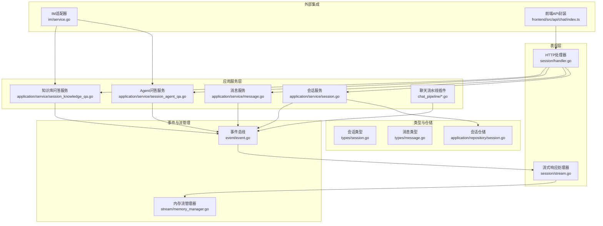
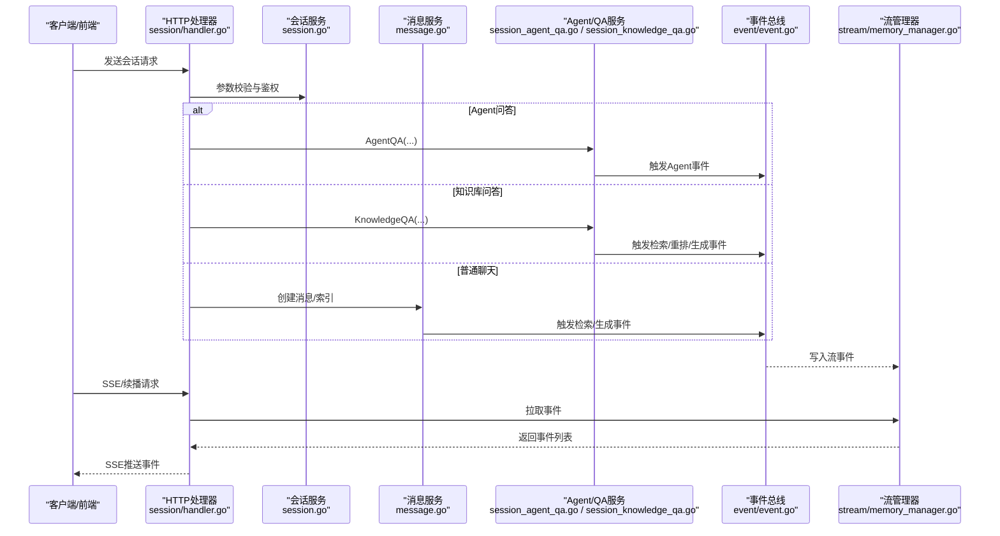
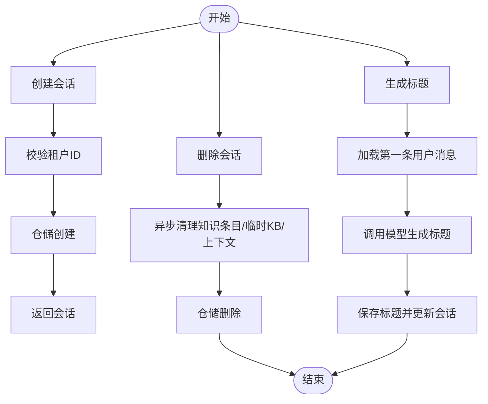
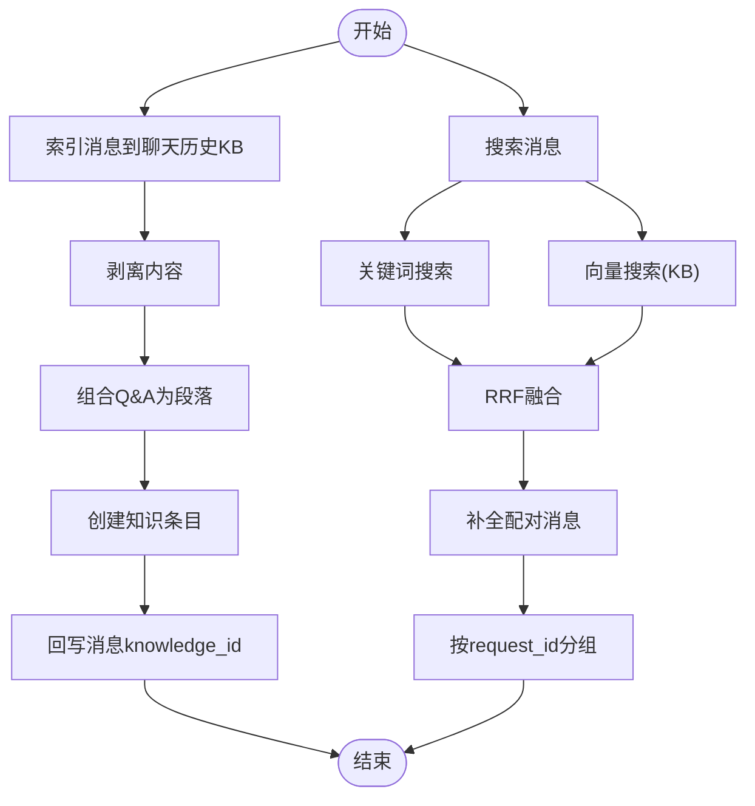
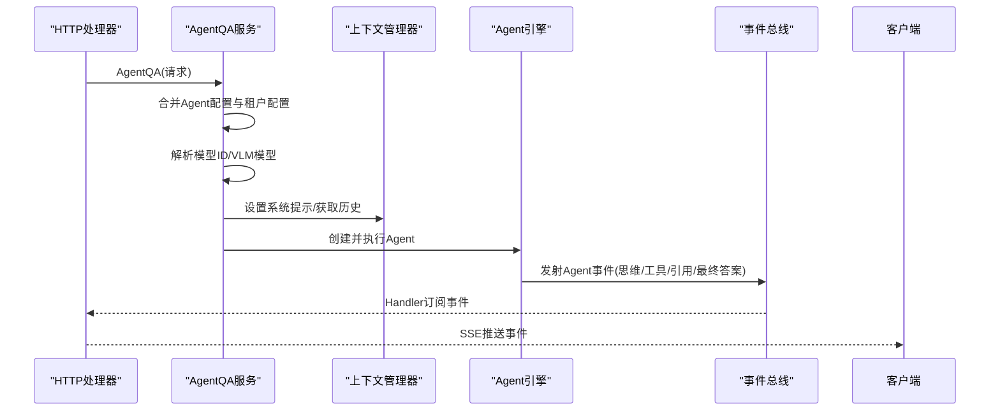
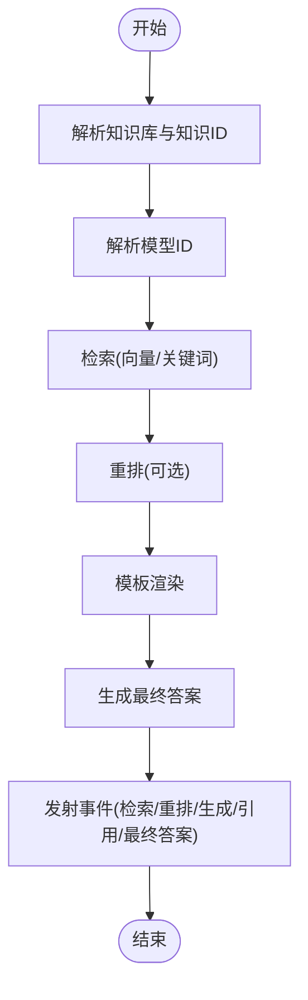
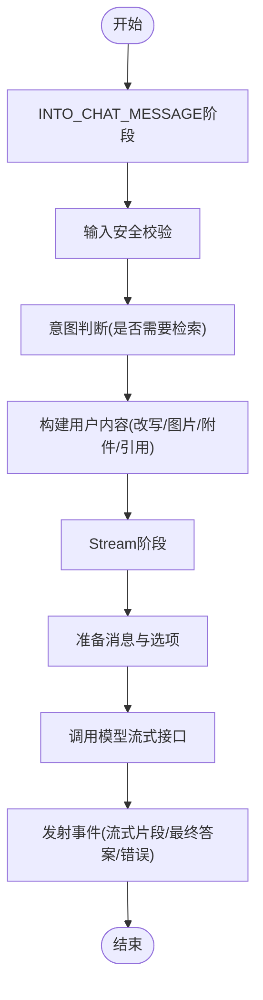
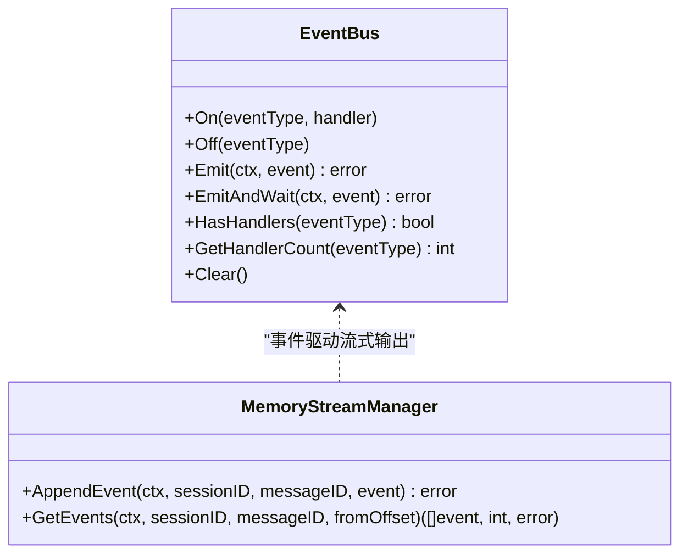
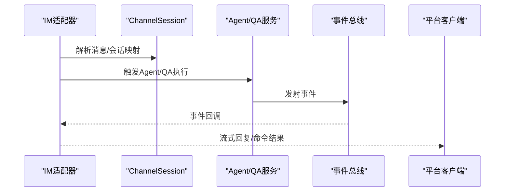
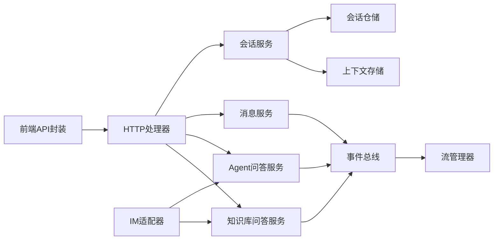

# 消息会话服务

<cite>
**本文档引用的文件**
- [session.go](file://internal/application/service/session.go)
- [session_agent_qa.go](file://internal/application/service/session_agent_qa.go)
- [session_knowledge_qa.go](file://internal/application/service/session_knowledge_qa.go)
- [session_qa_helpers.go](file://internal/application/service/session_qa_helpers.go)
- [handler.go](file://internal/handler/session/handler.go)
- [stream.go](file://internal/handler/session/stream.go)
- [message.go](file://internal/application/service/message.go)
- [session.go](file://internal/application/repository/session.go)
- [chat_pipeline.go](file://internal/application/service/chat_pipeline/chat_pipeline.go)
- [into_chat_message.go](file://internal/application/service/chat_pipeline/into_chat_message.go)
- [chat_completion_stream.go](file://internal/application/service/chat_pipeline/chat_completion_stream.go)
- [common.go](file://internal/application/service/chat_pipeline/common.go)
- [memory_manager.go](file://internal/stream/memory_manager.go)
- [event.go](file://internal/event/event.go)
- [session.go](file://internal/types/session.go)
- [message.go](file://internal/types/message.go)
- [service.go](file://internal/im/service.go)
- [index.ts](file://frontend/src/api/chat/index.ts)
- [session.go](file://client/session.go)
</cite>

## 目录
1. [简介](#简介)
2. [项目结构](#项目结构)
3. [核心组件](#核心组件)
4. [架构总览](#架构总览)
5. [详细组件分析](#详细组件分析)
6. [依赖关系分析](#依赖关系分析)
7. [性能考虑](#性能考虑)
8. [故障排查指南](#故障排查指南)
9. [结论](#结论)
10. [附录](#附录)

## 简介
本文件为 WeKnora 消息会话服务的详细技术文档，聚焦消息处理流程、会话状态管理、历史记录维护等核心能力。文档覆盖三类会话场景：Agent 问答、知识库问答、普通聊天，并解释其处理逻辑与状态转换机制。同时，文档阐述了与代理引擎、知识库服务、即时通讯适配器的协作关系，提供从请求接入到流式响应的完整链路说明，并给出关键流程的可视化图示与代码路径指引。

## 项目结构
WeKnora 的消息会话服务采用分层架构：
- 表现层：HTTP 处理器负责接收请求、参数校验、鉴权与流式响应。
- 应用服务层：会话服务、消息服务、QA 服务协调业务流程，管理上下文与事件。
- 事件与流管理：事件总线驱动异步事件，内存/Redis 流管理器持久化流事件。
- 类型与仓库：统一的数据模型与仓储接口，保证领域对象与存储解耦。
- 即时通讯适配器：IM 通道解析、会话映射与命令处理，复用相同 QA 流程。

图表来源
- [handler.go:1-444](file://internal/handler/session/handler.go#L1-444)
- [stream.go:1-441](file://internal/handler/session/stream.go#L1-441)
- [session.go:1-527](file://internal/application/service/session.go#L1-527)
- [message.go:1-867](file://internal/application/service/message.go#L1-867)
- [session_agent_qa.go:1-379](file://internal/application/service/session_agent_qa.go#L1-379)
- [session_knowledge_qa.go:1-43](file://internal/application/service/session_knowledge_qa.go#L1-43)
- [chat_pipeline.go:1-141](file://internal/application/service/chat_pipeline/chat_pipeline.go#L1-141)
- [event.go:1-231](file://internal/event/event.go#L1-231)
- [memory_manager.go:1-119](file://internal/stream/memory_manager.go#L1-119)
- [session.go:1-110](file://internal/application/repository/session.go#L1-110)
- [session.go:1-168](file://internal/types/session.go#L1-168)
- [message.go:1-369](file://internal/types/message.go#L1-369)
- [service.go:790-1918](file://internal/im/service.go#L790-1918)
- [index.ts:1-39](file://frontend/src/api/chat/index.ts#L1-39)

章节来源
- [handler.go:1-444](file://internal/handler/session/handler.go#L1-444)
- [session.go:1-527](file://internal/application/service/session.go#L1-527)

## 核心组件
- 会话服务（SessionService）
  - 负责会话生命周期管理：创建、查询、更新、删除、批量清理、标题生成、上下文清理。
  - 提供异步标题生成与上下文清理能力，保障多租户隔离与资源回收。
- 消息服务（MessageService）
  - 负责消息的增删改查、最近消息查询、按时间前缀查询、消息搜索（关键词/向量/混合）。
  - 支持聊天历史知识库索引与删除，提供向量化检索与重排序能力。
- Agent 问答服务（AgentQA）
  - 基于自定义 Agent 配置，构建运行时 AgentConfig，选择模型与检索器，执行多轮 Agent 引擎。
  - 支持工具调用、思维链、引用与最终答案事件推送。
- 知识库问答服务（KnowledgeQA）
  - 结合检索、重排、模板渲染与大模型总结，形成带引用的问答流。
- 聊天流水线（ChatPipeline）
  - 插件化事件驱动流水线，支持 INTO_CHAT_MESSAGE、Stream 等阶段。
- 事件总线（EventBus）
  - 统一事件发布订阅，支持同步/异步模式，承载检索、重排、Agent 执行、流式输出等事件。
- 流管理器（StreamManager）
  - 内存/Redis 等后端的流事件存储与拉取，支撑 SSE 断点续播与停止控制。
- 即时通讯适配器（IM Service）
  - 解析平台消息、会话映射、命令处理，复用相同 QA 流程，支持流式回复。

章节来源
- [session.go:1-527](file://internal/application/service/session.go#L1-527)
- [message.go:1-867](file://internal/application/service/message.go#L1-867)
- [session_agent_qa.go:1-379](file://internal/application/service/session_agent_qa.go#L1-379)
- [session_knowledge_qa.go:1-43](file://internal/application/service/session_knowledge_qa.go#L1-43)
- [chat_pipeline.go:1-141](file://internal/application/service/chat_pipeline/chat_pipeline.go#L1-141)
- [event.go:1-231](file://internal/event/event.go#L1-231)
- [memory_manager.go:1-119](file://internal/stream/memory_manager.go#L1-119)
- [service.go:790-1918](file://internal/im/service.go#L790-1918)

## 架构总览
WeKnora 的消息会话服务以“请求-事件-流”的方式组织：
- 请求进入 HTTP 层，经参数校验与鉴权后，路由到对应服务层。
- 服务层根据会话类型（Agent/QA/普通）构建运行时配置，触发事件总线。
- 事件驱动流水线在各阶段产生中间事件（检索、重排、Agent 步骤、流式片段），由流管理器持久化。
- 前端通过 SSE 或断点续播接口持续拉取事件，实时渲染。

图表来源
- [handler.go:1-444](file://internal/handler/session/handler.go#L1-444)
- [session.go:1-527](file://internal/application/service/session.go#L1-527)
- [message.go:1-867](file://internal/application/service/message.go#L1-867)
- [session_agent_qa.go:1-379](file://internal/application/service/session_agent_qa.go#L1-379)
- [session_knowledge_qa.go:1-43](file://internal/application/service/session_knowledge_qa.go#L1-43)
- [event.go:1-231](file://internal/event/event.go#L1-231)
- [memory_manager.go:1-119](file://internal/stream/memory_manager.go#L1-119)

## 详细组件分析

### 会话服务（SessionService）
- 职责
  - 会话 CRUD、分页查询、批量删除、全租户清空。
  - 会话标题生成（同步/异步）、上下文清理（LLM 上下文）。
- 关键流程
  - 创建会话：校验租户 ID，写入仓储，返回会话信息。
  - 删除会话：异步清理聊天历史知识条目、临时 KB、会话上下文，再删除会话。
  - 标题生成：优先使用第一条用户消息，调用模型生成标题并回写会话。
  - 上下文清理：基于会话 ID 删除 LLM 上下文存储。

图表来源
- [session.go:82-527](file://internal/application/service/session.go#L82-527)

章节来源
- [session.go:82-527](file://internal/application/service/session.go#L82-527)

### 消息服务（MessageService）
- 职责
  - 消息 CRUD、最近消息/时间前缀查询、消息搜索（关键词/向量/混合）。
  - 聊天历史知识库索引与删除，向量化检索与重排序。
- 关键流程
  - 索引消息到聊天历史 KB：剥离思考内容，组合 Q&A，创建知识条目并回写消息 knowledge_id。
  - 搜索消息：关键词搜索 + 向量搜索（混合/独立），RRF 融合，补全配对消息，按 request_id 分组。
  - 重排序：若配置 rerank 模型则进行重排序与阈值过滤。

图表来源
- [message.go:353-800](file://internal/application/service/message.go#L353-800)

章节来源
- [message.go:353-800](file://internal/application/service/message.go#L353-800)

### Agent 问答服务（AgentQA）
- 职责
  - 基于自定义 Agent 配置构建运行时 AgentConfig，解析检索租户、模型与检索器。
  - 初始化上下文管理器（系统提示、历史上下文、多轮开关），启动 Agent 引擎执行。
  - 通过事件总线推送 Agent 思维、工具调用、引用与最终答案等事件。
- 关键流程
  - 配置合并：Agent 配置 + 租户配置 + 默认值。
  - 模型解析：必须提供模型 ID；可选 VLM 模型用于图像分析。
  - 上下文管理：根据多轮开关决定是否保留历史；设置系统提示。
  - 执行 Agent：异步执行，事件由 Handler 订阅并通过 SSE 推送。

图表来源
- [session_agent_qa.go:23-206](file://internal/application/service/session_agent_qa.go#L23-206)
- [event.go:1-231](file://internal/event/event.go#L1-231)
- [stream.go:296-441](file://internal/handler/session/stream.go#L296-441)

章节来源
- [session_agent_qa.go:23-206](file://internal/application/service/session_agent_qa.go#L23-206)

### 知识库问答服务（KnowledgeQA）
- 职责
  - 解析知识库与模型 ID，准备检索参数，执行检索与重排，模板渲染生成最终回答。
  - 通过事件总线发射检索、重排、生成、引用与最终答案事件。
- 关键流程
  - 知识库解析：支持 @提及、仅在提及才检索、Agent 配置的 KB 选择模式。
  - 模型解析：优先自定义 Agent 配置，否则回退到默认模型。
  - 检索与重排：向量 + 关键词混合检索，可选重排模型。
  - 模板渲染：将检索结果注入上下文模板，生成最终回答。

图表来源
- [session_knowledge_qa.go:21-43](file://internal/application/service/session_knowledge_qa.go#L21-43)
- [session_qa_helpers.go:14-34](file://internal/application/service/session_qa_helpers.go#L14-34)

章节来源
- [session_knowledge_qa.go:21-43](file://internal/application/service/session_knowledge_qa.go#L21-43)
- [session_qa_helpers.go:14-34](file://internal/application/service/session_qa_helpers.go#L14-34)

### 聊天流水线（ChatPipeline）
- 职责
  - 插件化事件驱动流水线，支持 INTO_CHAT_MESSAGE（消息格式化）、Stream（模型调用与流式输出）等阶段。
  - 提供统一的日志与错误包装，便于调试与可观测性。
- 关键流程
  - INTO_CHAT_MESSAGE：安全校验、意图判断、上下文拼接（改写、图片描述、附件、引用）。
  - Stream：准备消息与选项、调用模型流式接口、事件总线驱动、goroutine 消费通道并发射事件。

图表来源
- [into_chat_message.go:14-101](file://internal/application/service/chat_pipeline/into_chat_message.go#L14-101)
- [chat_completion_stream.go:40-152](file://internal/application/service/chat_pipeline/chat_completion_stream.go#L40-152)
- [common.go:18-33](file://internal/application/service/chat_pipeline/common.go#L18-33)

章节来源
- [chat_pipeline.go:9-141](file://internal/application/service/chat_pipeline/chat_pipeline.go#L9-141)
- [into_chat_message.go:14-101](file://internal/application/service/chat_pipeline/into_chat_message.go#L14-101)
- [chat_completion_stream.go:40-152](file://internal/application/service/chat_pipeline/chat_completion_stream.go#L40-152)

### 事件总线与流管理器
- 事件总线（EventBus）
  - 支持同步/异步模式，注册多种事件类型（检索、重排、Agent 步骤、流式片段、停止、标题等）。
  - 提供 Emit/EmitAndWait、HasHandlers、Clear 等能力。
- 流管理器（StreamManager）
  - 内存实现：按 sessionID/messageID 维护事件队列，支持偏移拉取与续播。
  - 提供 AppendEvent、GetEvents 接口，保障并发安全。

图表来源
- [event.go:80-231](file://internal/event/event.go#L80-231)
- [memory_manager.go:18-119](file://internal/stream/memory_manager.go#L18-119)

章节来源
- [event.go:80-231](file://internal/event/event.go#L80-231)
- [memory_manager.go:18-119](file://internal/stream/memory_manager.go#L18-119)

### 即时通讯适配器（IM）
- 职责
  - 解析平台消息、识别会话模式（单聊/群聊/线程）、动态启动通道。
  - 命令处理与流式回复，复用相同 QA 流程，支持停止与断点续播。
- 关键流程
  - 消息去重、长度限制、通道配置加载、命令解析与执行。
  - 将 Agent/QA 输出转为平台可读格式，注入工具调用进度与引用信息。

图表来源
- [service.go:790-1918](file://internal/im/service.go#L790-1918)

章节来源
- [service.go:790-1918](file://internal/im/service.go#L790-1918)

## 依赖关系分析
- 组件耦合
  - Handler 依赖 SessionService、MessageService、StreamManager、EventBus。
  - SessionService 依赖仓储、模型服务、知识库服务、上下文存储、WebSearch 状态等。
  - AgentQA/KnowledgeQA 依赖 Agent 引擎、模型服务、检索器、事件总线。
  - ChatPipeline 插件依赖 EventBus、模型服务、消息服务。
- 外部依赖
  - 前端通过 API 封装发起会话、知识库问答与 Agent 问答请求。
  - IM 适配器通过通道与 Agent/QA 服务交互。

图表来源
- [handler.go:1-444](file://internal/handler/session/handler.go#L1-444)
- [session.go:1-527](file://internal/application/service/session.go#L1-527)
- [message.go:1-867](file://internal/application/service/message.go#L1-867)
- [session_agent_qa.go:1-379](file://internal/application/service/session_agent_qa.go#L1-379)
- [session_knowledge_qa.go:1-43](file://internal/application/service/session_knowledge_qa.go#L1-43)
- [event.go:1-231](file://internal/event/event.go#L1-231)
- [memory_manager.go:1-119](file://internal/stream/memory_manager.go#L1-119)
- [index.ts:1-39](file://frontend/src/api/chat/index.ts#L1-39)
- [service.go:790-1918](file://internal/im/service.go#L790-1918)

章节来源
- [handler.go:1-444](file://internal/handler/session/handler.go#L1-444)
- [session.go:1-527](file://internal/application/service/session.go#L1-527)
- [message.go:1-867](file://internal/application/service/message.go#L1-867)
- [session_agent_qa.go:1-379](file://internal/application/service/session_agent_qa.go#L1-379)
- [session_knowledge_qa.go:1-43](file://internal/application/service/session_knowledge_qa.go#L1-43)
- [event.go:1-231](file://internal/event/event.go#L1-231)
- [memory_manager.go:1-119](file://internal/stream/memory_manager.go#L1-119)
- [index.ts:1-39](file://frontend/src/api/chat/index.ts#L1-39)
- [service.go:790-1918](file://internal/im/service.go#L790-1918)

## 性能考虑
- 上下文压缩与滑动窗口
  - 通过上下文配置（最大令牌数、压缩策略、最近消息数、摘要阈值）控制上下文大小，避免 OOM。
- 流式输出与断点续播
  - SSE + 偏移拉取，降低长对话延迟；支持停止事件与续播，提升用户体验。
- 检索与重排优化
  - 向量 + 关键词混合检索，必要时启用重排模型；合理设置 TopK 与阈值，平衡质量与性能。
- 并发与异步
  - 事件总线异步模式减少阻塞；后台清理聊天历史知识条目，避免请求超时。
- 缓存与索引
  - 聊天历史知识库索引加速检索；消息搜索支持关键词与向量双通道，RRF 融合提升命中率。

## 故障排查指南
- 常见错误与定位
  - 会话/消息不存在：检查租户 ID、会话 ID、消息 ID 的合法性与归属。
  - 模型不可用：确认模型 ID 配置正确，AgentQA 必须提供模型 ID。
  - 事件未到达：检查 EventBus 是否注册对应事件处理器，异步模式下注意日志与错误收集。
  - 流式中断：确认 StreamManager 存储可用、偏移正确、客户端连接未关闭。
- 日志与可观测性
  - 使用流水线日志函数（info/warn/error）记录阶段输入/输出与关键字段，便于定位问题。
  - 在 Handler 中区分“继续流式”与“停止生成”，确保事件一致性。

章节来源
- [session.go:82-527](file://internal/application/service/session.go#L82-527)
- [message.go:353-800](file://internal/application/service/message.go#L353-800)
- [chat_completion_stream.go:40-152](file://internal/application/service/chat_pipeline/chat_completion_stream.go#L40-152)
- [stream.go:18-441](file://internal/handler/session/stream.go#L18-441)
- [common.go:18-33](file://internal/application/service/chat_pipeline/common.go#L18-33)

## 结论
WeKnora 的消息会话服务通过清晰的分层设计与事件驱动架构，实现了 Agent 问答、知识库问答与普通聊天的统一处理框架。结合流式输出、断点续播、上下文管理与聊天历史知识库索引，系统在可扩展性、可观测性与用户体验方面具备良好表现。建议在生产环境中关注模型配置、检索参数与上下文压缩策略，以获得更优的性能与稳定性。

## 附录
- 代码示例路径（不直接展示代码内容）
  - 消息接收与处理：[handler.go:78-127](file://internal/handler/session/handler.go#L78-L127)
  - Agent 问答入口：[session_agent_qa.go:23-206](file://internal/application/service/session_agent_qa.go#L23-L206)
  - 知识库问答入口：[session_knowledge_qa.go:21-43](file://internal/application/service/session_knowledge_qa.go#L21-L43)
  - 流式响应与续播：[stream.go:31-176](file://internal/handler/session/stream.go#L31-L176)
  - 事件总线使用：[event.go:120-202](file://internal/event/event.go#L120-L202)
  - 内存流管理器：[memory_manager.go:62-115](file://internal/stream/memory_manager.go#L62-L115)
  - 前端 API 封装：[index.ts:17-34](file://frontend/src/api/chat/index.ts#L17-L34)
  - 客户端会话操作：[session.go:69-100](file://client/session.go#L69-L100)