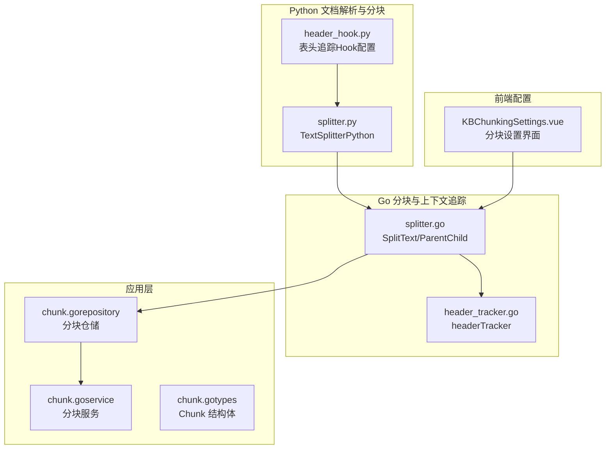
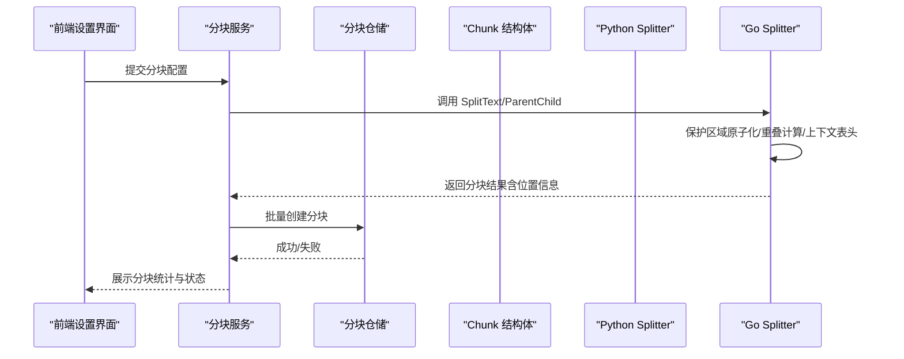
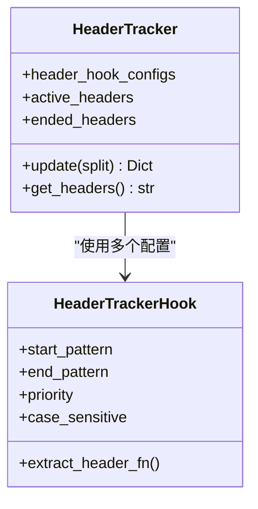
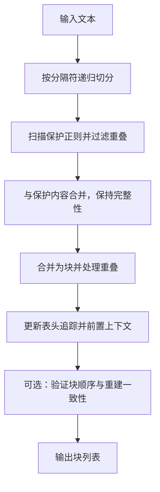
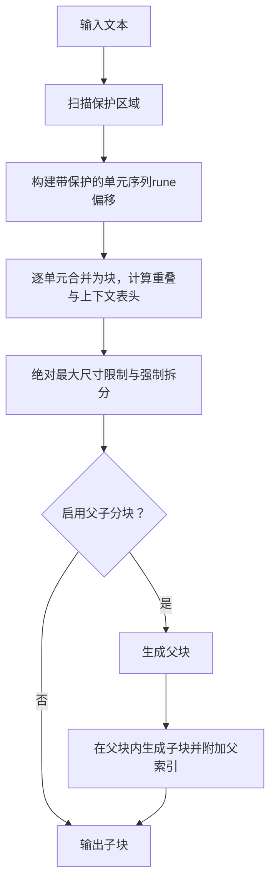
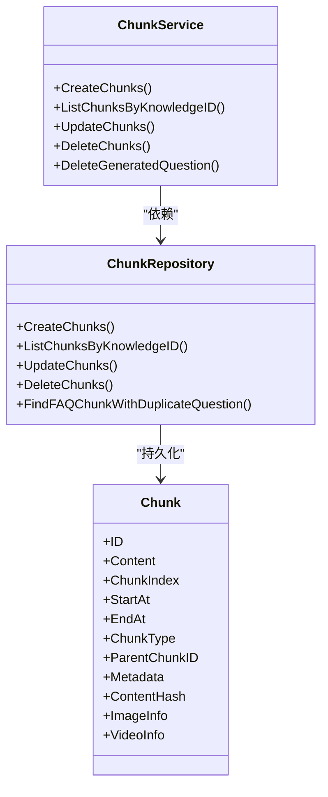
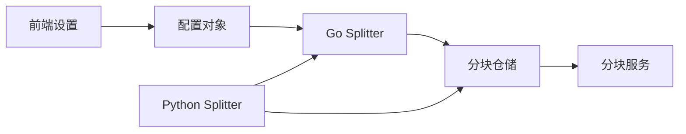

# 分块策略配置

<cite>
**本文引用的文件**
- [header_hook.py](file://docreader/splitter/header_hook.py)
- [splitter.py](file://docreader/splitter/splitter.py)
- [splitter.go](file://internal/infrastructure/chunker/splitter.go)
- [header_tracker.go](file://internal/infrastructure/chunker/header_tracker.go)
- [chunk.go](file://internal/application/service/chunk.go)
- [chunk.go](file://internal/application/repository/chunk.go)
- [chunk.go](file://internal/types/chunk.go)
- [KBChunkingSettings.vue](file://frontend/src/views/knowledge/settings/KBChunkingSettings.vue)
- [knowledgebase.go](file://internal/types/knowledgebase.go)
- [docparser.go](file://internal/types/docparser.go)
- [splitter_test.go](file://internal/infrastructure/Chunker/splitter_test.go)
</cite>

## 目录
1. [简介](#简介)
2. [项目结构](#项目结构)
3. [核心组件](#核心组件)
4. [架构总览](#架构总览)
5. [详细组件分析](#详细组件分析)
6. [依赖分析](#依赖分析)
7. [性能考量](#性能考量)
8. [故障排查指南](#故障排查指南)
9. [结论](#结论)
10. [附录](#附录)

## 简介
本技术文档围绕 WeKnora 的“分块策略配置”展开，系统性阐述文档分块算法、分块大小与重叠策略、上下文表头追踪、父子分块两阶段策略、分块质量评估与去重机制、元数据保留与位置信息等关键主题。文档同时给出不同文档类型的适用策略建议、参数调优方法与可视化流程图，帮助读者在实际部署中高效配置与优化分块效果。

## 项目结构
WeKnora 在 Python 侧提供 Markdown/表格/代码块等保护规则与表头追踪 Hook，在 Go 侧实现高性能的分块器与上下文表头追踪，并通过前端知识库设置界面提供交互式配置入口。分块结果最终落库并支持后续检索与向量化。

图表来源
- [header_hook.py:1-113](file://docreader/splitter/header_hook.py#L1-L113)
- [splitter.py:1-585](file://docreader/splitter/splitter.py#L1-L585)
- [splitter.go:1-571](file://internal/infrastructure/chunker/splitter.go#L1-L571)
- [header_tracker.go:1-162](file://internal/infrastructure/chunker/header_tracker.go#L1-L162)
- [chunk.go:1-454](file://internal/application/service/chunk.go#L1-L454)
- [chunk.go:1-800](file://internal/application/repository/chunk.go#L1-L800)
- [chunk.go:1-198](file://internal/types/chunk.go#L1-L198)
- [KBChunkingSettings.vue:1-297](file://frontend/src/views/knowledge/settings/KBChunkingSettings.vue#L1-L297)

章节来源
- [header_hook.py:1-113](file://docreader/splitter/header_hook.py#L1-L113)
- [splitter.py:1-585](file://docreader/splitter/splitter.py#L1-L585)
- [splitter.go:1-571](file://internal/infrastructure/chunker/splitter.go#L1-L571)
- [header_tracker.go:1-162](file://internal/infrastructure/chunker/header_tracker.go#L1-L162)
- [chunk.go:1-454](file://internal/application/service/chunk.go#L1-L454)
- [chunk.go:1-800](file://internal/application/repository/chunk.go#L1-L800)
- [chunk.go:1-198](file://internal/types/chunk.go#L1-L198)
- [KBChunkingSettings.vue:1-297](file://frontend/src/views/knowledge/settings/KBChunkingSettings.vue#L1-L297)

## 核心组件
- 表头追踪 Hook（Python）：定义表头开始/结束正则、优先级、大小写敏感等，支持 Markdown 表格等场景。
- TextSplitter（Python）：基于分隔符递归切分、保护正则（公式、图片、链接、表格、代码块）、智能合并与重叠处理、上下文表头前置。
- Splitter（Go）：高性能分块器，支持保护区域原子化、绝对最大尺寸限制、重叠计算、父子分块两阶段策略。
- HeaderTracker（Go）：维护活动表头状态，自动检测并拼接上下文表头，避免跨块丢失表头信息。
- 应用层分块服务与仓储：负责分块持久化、分页查询、批量更新、删除、FAQ 去重与重复问题检测。
- 前端分块设置界面：提供 chunk_size、chunk_overlap、separators、父子分块开关与大小等参数的可视化配置。

章节来源
- [header_hook.py:1-113](file://docreader/splitter/header_hook.py#L1-L113)
- [splitter.py:31-585](file://docreader/splitter/splitter.py#L31-L585)
- [splitter.go:30-571](file://internal/infrastructure/chunker/splitter.go#L30-L571)
- [header_tracker.go:15-162](file://internal/infrastructure/chunker/header_tracker.go#L15-L162)
- [chunk.go:1-454](file://internal/application/service/chunk.go#L1-L454)
- [chunk.go:1-800](file://internal/application/repository/chunk.go#L1-L800)
- [KBChunkingSettings.vue:134-208](file://frontend/src/views/knowledge/settings/KBChunkingSettings.vue#L134-L208)

## 架构总览
下图展示了从文档解析到分块入库的关键流程，以及分块策略配置在各层的作用点。

图表来源
- [splitter.go:142-550](file://internal/infrastructure/chunker/splitter.go#L142-L550)
- [splitter.py:116-585](file://docreader/splitter/splitter.py#L116-L585)
- [chunk.go:57-76](file://internal/application/service/chunk.go#L57-L76)
- [chunk.go:27-54](file://internal/application/repository/chunk.go#L27-L54)
- [chunk.go:106-166](file://internal/types/chunk.go#L106-L166)
- [KBChunkingSettings.vue:198-208](file://frontend/src/views/knowledge/settings/KBChunkingSettings.vue#L198-L208)

## 详细组件分析

### 组件一：表头追踪 Hook（Python）
- 功能要点
  - 支持多配置项，每项包含开始/结束正则、提取函数、优先级、大小写敏感等。
  - 默认配置包含 Markdown 表格识别（表头行+分隔行），结束条件为空行或非表格行。
  - 更新逻辑：先检查结束标记，再检查新开始标记；结束后清空状态。
  - 获取当前活跃表头：按优先级降序拼接，形成上下文前缀。
- 适用场景
  - 大表格跨块时，确保后续块能携带表头上下文，提升检索与理解准确性。
- 性能与复杂度
  - 正则匹配与字典操作，时间复杂度与输入长度线性相关；优先级排序开销较小。
- 配置建议
  - 优先级越高，越早被识别；大小写敏感按需开启；提取函数可自定义表头文本。

图表来源
- [header_hook.py:7-113](file://docreader/splitter/header_hook.py#L7-L113)

章节来源
- [header_hook.py:1-113](file://docreader/splitter/header_hook.py#L1-L113)

### 组件二：TextSplitter（Python）
- 核心算法
  - 分隔符优先级递归切分，保证尽可能按语义边界切分。
  - 保护正则扫描并过滤重叠，确保公式、图片、链接、表格、代码块等整体不被拆分。
  - 合并阶段：累计长度超过阈值时新建块，计算重叠并回退移除首元素；必要时前置上下文表头。
  - 位置恢复：支持按起止位置重建原文，便于验证与调试。
- 参数与行为
  - chunk_size、chunk_overlap、separators、protected_regex、length_function。
  - 重叠策略：当新块加入导致超限，从旧块头部弹出元素直至满足重叠与容量约束。
  - 上下文表头：若表头过大则跳过，避免超块。
- 质量评估与校验
  - 提供验证函数：检查块顺序与重建原文一致性；失败时输出详细差异与调试文件。

图表来源
- [splitter.py:116-585](file://docreader/splitter/splitter.py#L116-L585)

章节来源
- [splitter.py:31-585](file://docreader/splitter/splitter.py#L31-L585)

### 组件三：Splitter（Go）
- 核心算法
  - 保护区域原子化：先扫描所有保护区域，再对非保护区间按分隔符切分，确保保护内容整体性。
  - 绝对最大尺寸限制：单个单位超过阈值强制拆分，防止下游嵌入接口超限。
  - 合并与重叠：累计长度超限则落盘当前块，计算重叠并回退；必要时前置上下文表头。
  - 父子分块：先生成大窗口父块，再在父块内生成小窗口子块，子块携带父索引以便检索返回父内容。
- 上下文表头追踪（Go）
  - 识别 Markdown 表格头（含空列名行的动态补全），检测结束行后清除状态。
  - 避免重复前置：若重叠或下一个单元已包含表头内容，则不再前置。
- 位置与偏移
  - 使用 Unicode rune 偏移，保证多字节字符场景下的 Start/End 准确性。

图表来源
- [splitter.go:142-550](file://internal/infrastructure/chunker/splitter.go#L142-L550)
- [header_tracker.go:47-162](file://internal/infrastructure/chunker/header_tracker.go#L47-L162)

章节来源
- [splitter.go:30-571](file://internal/infrastructure/chunker/splitter.go#L30-L571)
- [header_tracker.go:15-162](file://internal/infrastructure/chunker/header_tracker.go#L15-L162)

### 组件四：应用层分块服务与仓储
- 服务职责
  - 创建/查询/更新/删除分块；支持分页与批量更新；FAQ 问题去重与向量索引清理。
- 仓储职责
  - 批量插入（SQLite 预分配 SeqID、其他数据库使用序列）；按知识库/标签/状态筛选；FAQ 重复问题检测（JSON 字段查询）。
- 数据模型
  - Chunk 结构体包含 ID、内容、索引、起止位置、类型、父块 ID、元数据、内容哈希、图片/视频信息等字段。

图表来源
- [chunk.go:16-45](file://internal/application/service/chunk.go#L16-L45)
- [chunk.go:17-800](file://internal/application/repository/chunk.go#L17-L800)
- [chunk.go:106-198](file://internal/types/chunk.go#L106-L198)

章节来源
- [chunk.go:1-454](file://internal/application/service/chunk.go#L1-L454)
- [chunk.go:1-800](file://internal/application/repository/chunk.go#L1-L800)
- [chunk.go:1-198](file://internal/types/chunk.go#L1-L198)

### 组件五：前端分块设置界面
- 配置项
  - 块大小、重叠、分隔符、父子分块开关、父块大小、子块大小。
- 交互与校验
  - 滑块范围与步进；多选分隔符；实时触发更新事件。
- 与后端映射
  - 通过配置对象传递给后端分块器，后端据此执行 Python 或 Go 分块逻辑。

章节来源
- [KBChunkingSettings.vue:134-208](file://frontend/src/views/knowledge/settings/KBChunkingSettings.vue#L134-L208)

## 依赖分析
- Python Splitter 依赖 header_hook 提供表头追踪能力；Go Splitter 独立实现相同逻辑，二者在行为上保持一致。
- Go Splitter 与前端配置强耦合：前端滑块参数直接映射到 Go 的 SplitterConfig。
- 应用层服务与仓储解耦：服务层负责业务编排，仓储层负责数据持久化与查询。

图表来源
- [KBChunkingSettings.vue:198-208](file://frontend/src/views/knowledge/settings/KBChunkingSettings.vue#L198-L208)
- [splitter.go:142-550](file://internal/infrastructure/chunker/splitter.go#L142-L550)
- [chunk.go:27-54](file://internal/application/repository/chunk.go#L27-L54)

章节来源
- [KBChunkingSettings.vue:134-208](file://frontend/src/views/knowledge/settings/KBChunkingSettings.vue#L134-L208)
- [splitter.go:30-571](file://internal/infrastructure/chunker/splitter.go#L30-L571)
- [chunk.go:1-800](file://internal/application/repository/chunk.go#L1-L800)

## 性能考量
- 时间复杂度
  - Python Splitter：递归切分与保护区域扫描，总体近似 O(n) 线性复杂度，受分隔符数量与保护区域数量影响。
  - Go Splitter：保护区域扫描与合并阶段，同样近似 O(n)，但使用 rune 偏移减少多字节字符处理成本。
- 内存与吞吐
  - Go 分块器采用“单元序列 + 合并”的中间态，内存占用与块数线性相关；批量入库与分页查询降低数据库压力。
- 重叠与上下文
  - 合理的重叠可提升检索召回，但会增加向量维度与索引体积；应结合下游嵌入模型与检索目标权衡。
- 绝对最大尺寸
  - Go 实现内置绝对上限，避免超限错误；Python Splitter 通过保护单元强制拆分保障安全。

[本节为通用性能讨论，无需特定文件引用]

## 故障排查指南
- 分块验证失败
  - Python Splitter 提供验证与调试文件输出，检查块顺序与重建一致性，定位差异位置。
- 重叠与上下文异常
  - 检查分隔符优先级与保护正则是否覆盖关键内容；确认表头追踪配置是否匹配实际文档结构。
- 父子分块不生效
  - 确认前端已启用父子分块并正确设置父/子块大小；Go Splitter 的 ParentChildResult 输出应包含父块与子块索引映射。
- FAQ 重复问题
  - 仓储层提供重复问题检测与删除接口，结合内容签名与 JSON 字段进行去重。
- 位置偏移不准确
  - Go 分块器使用 rune 偏移，确保多字节字符场景下 Start/End 正确；测试用例验证了这一点。

章节来源
- [splitter.py:409-556](file://docreader/splitter/splitter.py#L409-L556)
- [splitter.go:511-550](file://internal/infrastructure/chunker/splitter.go#L511-L550)
- [chunk.go:640-698](file://internal/application/repository/chunk.go#L640-L698)
- [splitter_test.go:1-85](file://internal/infrastructure/Chunker/splitter_test.go#L1-L85)

## 结论
WeKnora 的分块策略在 Python 与 Go 两侧实现了高度一致的行为：保护内容原子化、智能分隔符切分、上下文表头前置、父子两阶段策略与绝对最大尺寸限制。通过前端可视化配置与应用层仓储服务，用户可以灵活调整分块参数并获得稳定可靠的分块结果。针对不同文档类型与检索目标，建议以“语义边界优先、保护内容完整、适度重叠”为原则进行参数调优。

[本节为总结性内容，无需特定文件引用]

## 附录

### 不同文档类型的分块策略建议
- 技术文档（含大量代码块与表格）
  - 建议：启用保护正则（代码块、表格、公式），优先使用换行与段落分隔符，适当增大重叠以保留上下文。
  - 参数示例：chunk_size 较大（如 512~1024），chunk_overlap 中等（如 64~128），separators 包含换行与句号。
- 产品文档（段落清晰、少量表格）
  - 建议：以段落为主，重叠略小，避免过度拆分造成语义割裂。
  - 参数示例：chunk_size 中等（如 512），chunk_overlap 较小（如 32~64）。
- FAQ/问答（短文本、JSON 元数据丰富）
  - 建议：启用父子分块，父块更大用于上下文，子块更小用于精确匹配；配合去重逻辑避免重复问题。
  - 参数示例：parent_chunk_size 较大（如 2048~4096），child_chunk_size 较小（如 384）。

[本节为通用建议，无需特定文件引用]

### 分块质量评估与去重机制
- 质量评估
  - 重建一致性：将分块按顺序拼接，与原文比较，定位差异位置。
  - 位置偏移：验证 Start/End 是否与 rune 长度一致，确保多字节字符场景正确。
- 去重机制
  - 基于 ID、父块 ID、知识库+索引组合键去重，再基于内容签名二次去重，最后去重重复 ID。
  - FAQ 重复问题检测：利用 JSON 字段（标准问题、相似问题、答案）进行跨块重复检测。

章节来源
- [splitter.py:409-556](file://docreader/splitter/splitter.py#L409-L556)
- [splitter_test.go:1-85](file://internal/infrastructure/Chunker/splitter_test.go#L1-L85)
- [chunk.go:640-698](file://internal/application/repository/chunk.go#L640-L698)
- [grep_chunks.go:640-695](file://internal/agent/tools/grep_chunks.go#L640-L695)

### 配置参数与调优方法
- 关键参数
  - chunk_size：块大小，越大语义越完整但召回可能下降。
  - chunk_overlap：重叠大小，越大召回越好但索引体积增大。
  - separators：分隔符优先级，影响切分语义边界。
  - enable_parent_child、parent_chunk_size、child_chunk_size：父子分块策略。
- 调优步骤
  - 以默认值启动，观察检索效果与索引体积。
  - 逐步调整 chunk_size 与 chunk_overlap，观察召回与精度变化。
  - 对表格/代码密集文档，优先保证保护正则覆盖。
  - 启用父子分块时，先调大父块，再调小子块，确保上下文充足且匹配精准。

章节来源
- [knowledgebase.go:132-152](file://internal/types/knowledgebase.go#L132-L152)
- [KBChunkingSettings.vue:134-208](file://frontend/src/views/knowledge/settings/KBChunkingSettings.vue#L134-L208)
- [splitter.go:38-44](file://internal/infrastructure/chunker/splitter.go#L38-L44)
- [splitter.py:22-28](file://docreader/splitter/splitter.py#L22-L28)

### 代码示例路径（如何配置与使用）
- 配置 HeaderHook（Python）
  - 参考路径：[header_hook.py:42-63](file://docreader/splitter/header_hook.py#L42-L63)
- 配置 TextSplitter（Python）
  - 参考路径：[splitter.py:65-115](file://docreader/splitter/splitter.py#L65-L115)
- 启用父子分块（Go）
  - 参考路径：[splitter.go:516-550](file://internal/infrastructure/chunker/splitter.go#L516-L550)
- 前端分块设置
  - 参考路径：[KBChunkingSettings.vue:198-208](file://frontend/src/views/knowledge/settings/KBChunkingSettings.vue#L198-L208)

章节来源
- [header_hook.py:42-63](file://docreader/splitter/header_hook.py#L42-L63)
- [splitter.py:65-115](file://docreader/splitter/splitter.py#L65-L115)
- [splitter.go:516-550](file://internal/infrastructure/chunker/splitter.go#L516-L550)
- [KBChunkingSettings.vue:198-208](file://frontend/src/views/knowledge/settings/KBChunkingSettings.vue#L198-L208)