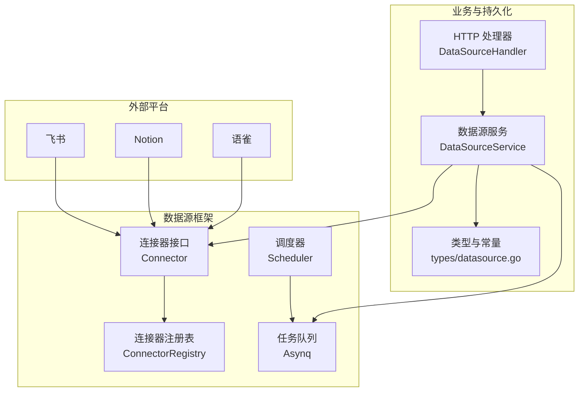
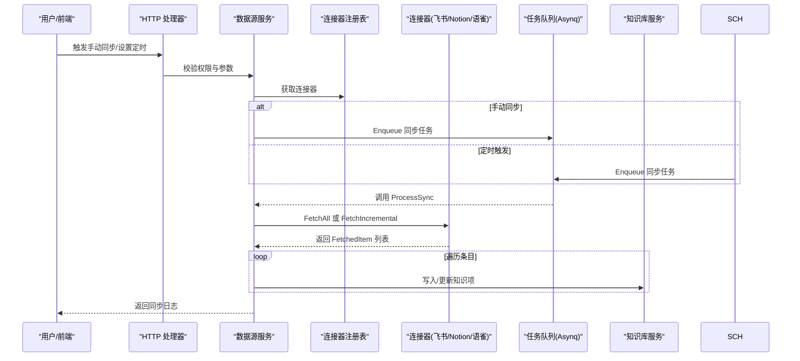
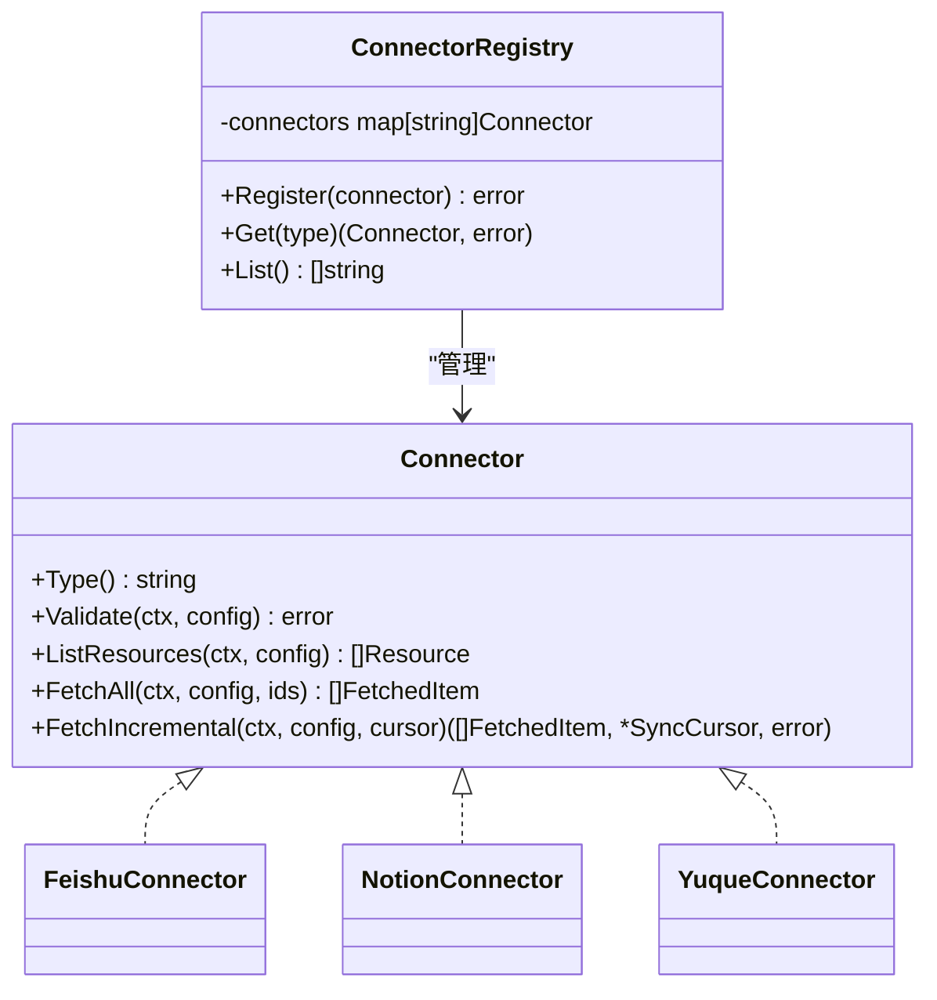
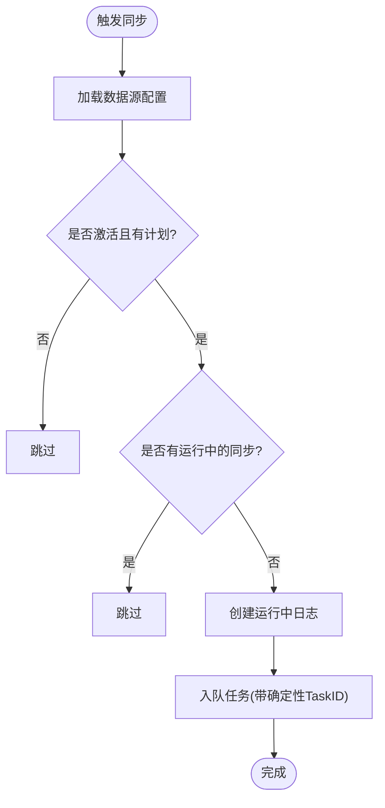
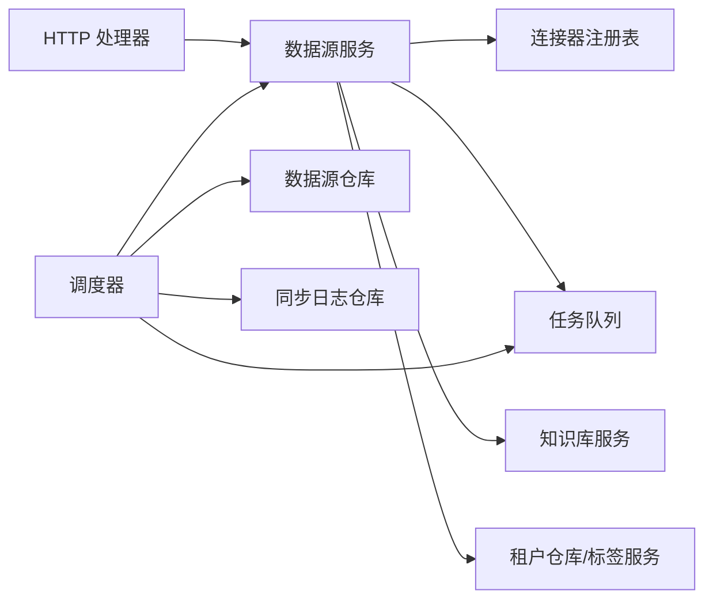

# 数据源集成

<cite>
**本文引用的文件**
- [connector.go](file://internal/datasource/connector.go)
- [scheduler.go](file://internal/datasource/scheduler.go)
- [CONNECTOR_IMPLEMENTATION_GUIDE.md](file://internal/datasource/CONNECTOR_IMPLEMENTATION_GUIDE.md)
- [README.md](file://internal/datasource/README.md)
- [datasource.go](file://internal/handler/datasource.go)
- [datasource_service.go](file://internal/application/service/datasource_service.go)
- [datasource.go](file://internal/types/datasource.go)
- [client.go（飞书）](file://internal/datasource/connector/feishu/client.go)
- [client.go（Notion）](file://internal/datasource/connector/notion/client.go)
- [client.go（语雀）](file://internal/datasource/connector/yuque/client.go)
- [task.go](file://internal/router/task.go)
- [sync_task.go](file://internal/router/sync_task.go)
- [errors.go](file://internal/datasource/errors.go)
</cite>

## 目录
1. [简介](#简介)
2. [项目结构](#项目结构)
3. [核心组件](#核心组件)
4. [架构总览](#架构总览)
5. [详细组件分析](#详细组件分析)
6. [依赖分析](#依赖分析)
7. [性能考虑](#性能考虑)
8. [故障排查指南](#故障排查指南)
9. [结论](#结论)
10. [附录](#附录)

## 简介
本技术文档围绕 WeKnora 的数据源集成功能，系统性阐述飞书、Notion、语雀等第三方数据源的连接配置、同步机制与增量更新策略；深入解析数据源连接器的设计模式、错误处理与重试策略；并提供可直接定位到源码路径的示例，帮助开发者快速添加新数据源连接器、配置同步调度器、处理同步状态。同时说明认证、权限管理、同步日志记录等关键功能的实现原理。

## 项目结构
WeKnora 的数据源同步体系由“连接器接口与注册表”“调度器与任务队列”“业务服务与处理器”“类型定义与持久化”四大部分组成，并通过 HTTP 接口对外提供配置、验证、手动触发与日志查询能力。

图表来源
- [connector.go:11-31](file://internal/datasource/connector.go#L11-L31)
- [scheduler.go:18-52](file://internal/datasource/scheduler.go#L18-L52)
- [datasource_service.go:21-57](file://internal/application/service/datasource_service.go#L21-L57)
- [datasource.go:14-29](file://internal/handler/datasource.go#L14-L29)
- [datasource.go:11-47](file://internal/types/datasource.go#L11-L47)

章节来源
- [README.md:1-261](file://internal/datasource/README.md#L1-L261)
- [connector.go:1-208](file://internal/datasource/connector.go#L1-L208)
- [scheduler.go:1-211](file://internal/datasource/scheduler.go#L1-L211)
- [datasource.go:1-557](file://internal/handler/datasource.go#L1-L557)
- [datasource_service.go:1-755](file://internal/application/service/datasource_service.go#L1-L755)
- [datasource.go:1-418](file://internal/types/datasource.go#L1-L418)

## 核心组件
- 连接器接口与注册表：统一抽象第三方平台接入，支持按类型动态注册与查找。
- 调度器：基于 cron 的周期性触发，结合 Redis 任务 ID 去重，避免多实例重复执行。
- 任务队列：基于 Asynq 的异步任务执行，支持队列优先级与自定义重试策略。
- 业务服务：封装数据源生命周期、连接校验、资源列举、手动同步、增量/全量拉取、结果写入与状态更新。
- 类型与常量：统一的数据模型、状态枚举、同步游标与任务载荷定义。
- HTTP 处理器：提供 REST API，供前端或外部系统进行配置、验证、手动触发与日志查询。

章节来源
- [connector.go:9-31](file://internal/datasource/connector.go#L9-L31)
- [scheduler.go:18-52](file://internal/datasource/scheduler.go#L18-L52)
- [datasource_service.go:21-57](file://internal/application/service/datasource_service.go#L21-L57)
- [datasource.go:11-418](file://internal/types/datasource.go#L11-L418)
- [datasource.go:14-29](file://internal/handler/datasource.go#L14-L29)

## 架构总览
下图展示了从用户操作到外部平台数据拉取、再到知识库入库的完整流程。

图表来源
- [datasource.go:366-396](file://internal/handler/datasource.go#L366-L396)
- [datasource_service.go:269-324](file://internal/application/service/datasource_service.go#L269-L324)
- [scheduler.go:132-203](file://internal/datasource/scheduler.go#L132-L203)
- [task.go:100-165](file://internal/router/task.go#L100-L165)

章节来源
- [README.md:47-63](file://internal/datasource/README.md#L47-L63)
- [datasource_service.go:387-599](file://internal/application/service/datasource_service.go#L387-L599)

## 详细组件分析

### 连接器设计模式与适配器
- 设计要点
  - 统一接口：所有平台实现 Connector 接口，屏蔽差异。
  - 注册表：集中管理连接器类型与实例，便于扩展。
  - 元数据：提供 UI 展示所需的名称、描述、认证方式与能力标识。
- 关键方法
  - Type：返回连接器类型字符串。
  - Validate：校验凭据与连通性。
  - ListResources：列出可选资源集合。
  - FetchAll：全量拉取指定资源。
  - FetchIncremental：增量拉取，返回游标以支持下一次增量。

图表来源
- [connector.go:11-31](file://internal/datasource/connector.go#L11-L31)
- [connector.go:34-73](file://internal/datasource/connector.go#L34-L73)

章节来源
- [connector.go:9-208](file://internal/datasource/connector.go#L9-L208)
- [CONNECTOR_IMPLEMENTATION_GUIDE.md:1-498](file://internal/datasource/CONNECTOR_IMPLEMENTATION_GUIDE.md#L1-L498)

### 认证与权限管理
- 认证方式
  - OAuth2：飞书、GitHub、Google Drive、OneDrive、Slack 等。
  - API Key：Notion、语雀、Confluence、DingTalk 等。
  - 密码：IMAP。
  - 无认证：Web 爬虫、RSS。
- 权限隔离
  - 多租户：每个数据源绑定 TenantID，确保跨租户数据隔离。
  - 知识库绑定：数据源仅能作用于其所属的知识库。
  - 操作鉴权：HTTP 层在处理器中校验租户上下文与知识库归属。

章节来源
- [connector.go:88-185](file://internal/datasource/connector.go#L88-L185)
- [datasource.go:49-114](file://internal/types/datasource.go#L49-L114)
- [datasource.go:31-75](file://internal/handler/datasource.go#L31-L75)

### 同步调度器与去重策略
- 触发来源
  - 用户手动触发：立即创建同步日志并入队。
  - 定时触发：基于 cron 表达式周期执行。
- 去重机制
  - 第一层：检查是否存在正在运行的同步，避免重叠。
  - 第二层：基于任务 ID 去重（同一分钟内相同 DS 的任务 ID 固定），Redis 保证只入队一个。
- 任务载荷
  - 包含数据源 ID、租户 ID、同步日志 ID、是否强制全量等字段。

图表来源
- [scheduler.go:132-203](file://internal/datasource/scheduler.go#L132-L203)

章节来源
- [scheduler.go:18-211](file://internal/datasource/scheduler.go#L18-L211)
- [datasource_service.go:269-324](file://internal/application/service/datasource_service.go#L269-L324)
- [task.go:100-165](file://internal/router/task.go#L100-L165)

### 增量更新策略与游标
- 游标结构
  - LastSyncTime：上次同步时间。
  - ConnectorCursor：平台特定游标（如分页 token、偏移等）。
  - LastSchemaHash：用于检测结构变化。
- 实现要点
  - 若未提供游标或为空，则默认回溯一定时间窗口（例如最近 7 天）。
  - 平台侧需返回下一次增量同步所需的游标，以便下次继续推进。
  - 支持删除标记（IsDeleted）与删除同步开关（SyncDeletions）。

章节来源
- [datasource.go:275-286](file://internal/types/datasource.go#L275-L286)
- [datasource_service.go:460-465](file://internal/application/service/datasource_service.go#L460-L465)

### 错误处理与重试策略
- 连接器层
  - 飞书：令牌缓存与安全过期；导出/下载采用超时控制与日志裁剪。
  - Notion：速率限制（每秒请求数与突发）、指数退避重试、429/5xx 分类处理。
  - 语雀：429/5xx 重试、401/403 明确区分无效凭证。
- 服务层
  - 失败时更新同步日志状态与错误消息，必要时将数据源置为错误状态。
  - 对重复内容（同 external_id）按“跳过”处理，不视为失败。
- 任务层
  - 自定义重试延迟：针对 Wiki 入库并发冲突使用固定短延迟，其余采用默认指数退避。

章节来源
- [client.go（飞书）:40-95](file://internal/datasource/connector/feishu/client.go#L40-L95)
- [client.go（Notion）:41-148](file://internal/datasource/connector/notion/client.go#L41-L148)
- [client.go（语雀）:43-151](file://internal/datasource/connector/yuque/client.go#L43-L151)
- [datasource_service.go:467-599](file://internal/application/service/datasource_service.go#L467-L599)
- [task.go:77-82](file://internal/router/task.go#L77-L82)

### HTTP API 与状态管理
- 数据源管理
  - 创建/查询/列表/更新/删除。
  - 连接校验（持久化）与凭据校验（临时）。
  - 资源列举与手动同步。
  - 暂停/恢复与日志查询。
- 状态流转
  - 数据源状态：active/paused/error/deleted。
  - 同步日志状态：running/success/partial/failed/canceled。

章节来源
- [datasource.go:77-557](file://internal/handler/datasource.go#L77-L557)
- [datasource.go:31-43](file://internal/types/datasource.go#L31-L43)

### 添加新的数据源连接器（步骤与示例）
- 步骤概览
  - 创建包与文件：client.go、connector.go、types.go。
  - 定义平台配置、资源与条目结构。
  - 实现连接器接口：Type、Validate、ListResources、FetchAll、FetchIncremental。
  - 在容器中注册连接器与元数据。
  - 编写测试并验证。
- 示例路径（不展示具体代码，仅提供定位）
  - 新连接器骨架与实现模板：[CONNECTOR_IMPLEMENTATION_GUIDE.md:13-293](file://internal/datasource/CONNECTOR_IMPLEMENTATION_GUIDE.md#L13-L293)
  - 连接器元数据注册位置：[connector.go:347-361](file://internal/datasource/connector.go#L347-L361)
  - 容器注册位置（两种方式）：[CONNECTOR_IMPLEMENTATION_GUIDE.md:295-332](file://internal/datasource/CONNECTOR_IMPLEMENTATION_GUIDE.md#L295-L332)

章节来源
- [CONNECTOR_IMPLEMENTATION_GUIDE.md:1-498](file://internal/datasource/CONNECTOR_IMPLEMENTATION_GUIDE.md#L1-L498)
- [connector.go:347-361](file://internal/datasource/connector.go#L347-L361)

### 配置同步调度器与任务执行
- 启动与注册
  - 服务启动时加载激活的数据源并注册 cron。
  - 手动同步或定时触发后，创建运行中日志并入队任务。
- 任务执行
  - 反序列化载荷，获取数据源与连接器，按模式选择全量或增量。
  - 将拉取的条目写入知识库，统计结果并更新数据源与日志。
- Lite 模式
  - 无 Redis 时使用同步执行器替代 Asynq，注册处理器并在 goroutine 中执行。

章节来源
- [scheduler.go:54-109](file://internal/datasource/scheduler.go#L54-L109)
- [datasource_service.go:269-599](file://internal/application/service/datasource_service.go#L269-L599)
- [sync_task.go:86-106](file://internal/router/sync_task.go#L86-L106)

## 依赖分析
- 组件耦合
  - DataSourceService 依赖连接器注册表、任务队列、知识库服务、租户仓库与标签服务。
  - Scheduler 依赖数据源仓库、同步日志仓库与任务入队器。
  - HTTP 处理器依赖数据源服务与知识库服务。
- 外部依赖
  - Asynq：任务队列与重试。
  - robfig/cron：定时调度。
  - 平台 SDK/HTTP 客户端：各平台 API 访问。
- 循环依赖
  - 未发现直接循环；通过接口与服务层解耦。

图表来源
- [datasource_service.go:21-57](file://internal/application/service/datasource_service.go#L21-L57)
- [scheduler.go:27-52](file://internal/datasource/scheduler.go#L27-L52)
- [datasource.go:14-29](file://internal/handler/datasource.go#L14-L29)

章节来源
- [datasource_service.go:1-755](file://internal/application/service/datasource_service.go#L1-L755)
- [scheduler.go:1-211](file://internal/datasource/scheduler.go#L1-L211)

## 性能考虑
- 并发与去重
  - 多实例场景下，通过“运行中检测 + Redis 任务 ID 去重”避免重复执行。
- 速率控制
  - Notion 客户端内置速率限制与指数退避；语雀对 429/5xx 做重试与等待。
- I/O 优化
  - 飞书导出/下载采用超时与日志裁剪，避免大体积响应影响日志可读性。
- 存储与索引
  - 同步完成后进入知识库解析、分块、向量化与索引流程，建议合理配置向量存储与批处理大小。

## 故障排查指南
- 常见错误类型
  - 连接器缺失：检查类型是否正确、是否已注册。
  - 凭据无效：确认 OAuth/Token 是否过期或权限不足。
  - 资源不存在：确认资源 ID 是否有效。
  - 同步失败：查看同步日志中的错误消息与结果统计。
- 定位路径
  - 连接器错误定义：[errors.go:6-32](file://internal/datasource/errors.go#L6-L32)
  - 服务层错误处理与状态更新：[datasource_service.go:467-599](file://internal/application/service/datasource_service.go#L467-L599)
  - 调度器去重与日志记录：[scheduler.go:132-203](file://internal/datasource/scheduler.go#L132-L203)
  - 平台客户端重试与错误分类：[client.go（Notion）:41-148](file://internal/datasource/connector/notion/client.go#L41-L148)，[client.go（语雀）:43-151](file://internal/datasource/connector/yuque/client.go#L43-L151)

章节来源
- [errors.go:1-33](file://internal/datasource/errors.go#L1-L33)
- [datasource_service.go:467-599](file://internal/application/service/datasource_service.go#L467-L599)
- [scheduler.go:132-203](file://internal/datasource/scheduler.go#L132-L203)
- [client.go（Notion）:41-148](file://internal/datasource/connector/notion/client.go#L41-L148)
- [client.go（语雀）:43-151](file://internal/datasource/connector/yuque/client.go#L43-L151)

## 结论
WeKnora 的数据源集成以“适配器 + 注册表 + 调度 + 任务队列”的架构实现了对飞书、Notion、语雀等平台的统一接入。通过严格的认证与权限隔离、完善的增量同步与游标管理、稳健的错误处理与重试策略，以及清晰的 API 与日志体系，为知识库的自动化内容同步提供了高可靠、可扩展的基础设施。新增数据源时，遵循统一的接口与实现指南，即可快速完成对接与上线。

## 附录
- 数据模型与状态枚举参考：[datasource.go:11-418](file://internal/types/datasource.go#L11-L418)
- 平台客户端实现参考：
  - 飞书：[client.go（飞书）:1-460](file://internal/datasource/connector/feishu/client.go#L1-L460)
  - Notion：[client.go（Notion）:1-524](file://internal/datasource/connector/notion/client.go#L1-L524)
  - 语雀：[client.go（语雀）:1-297](file://internal/datasource/connector/yuque/client.go#L1-L297)
- 任务执行与队列配置：
  - 异步服务器与处理器注册：[task.go:100-165](file://internal/router/task.go#L100-L165)
  - Lite 模式同步执行器：[sync_task.go:17-106](file://internal/router/sync_task.go#L17-L106)